# Signaling under environmental uncertainty: A multilevel-selection threshold model for Poverty Point

**Target journal:** *Journal of Archaeological Method and Theory*

**Running title:** A threshold model for Poverty Point monumentality

**Authors:** Carl P. Lipo¹\* (ORCID: 0000-0003-4391-3590), Robert J. DiNapoli¹ (ORCID: 0000-0003-2180-2195), Diana M. Greenlee²

¹ Department of Anthropology and Environmental Studies Program, Binghamton University, Binghamton, NY 13902, USA

² Station Archaeologist, Poverty Point World Heritage Site, University of Louisiana at Monroe, Monroe, LA 71209, USA

\* **Corresponding author:** Carl P. Lipo, clipo@binghamton.edu

**Keywords:** monumental architecture, costly signaling, multilevel selection, hunter-gatherer aggregation, Late Archaic, Poverty Point, agent-based modeling, phase transition, environmental uncertainty

## Abstract

Poverty Point (ca. 1700-1100 BCE), the largest pre-ceramic earthwork complex in North America, was built by mobile hunter-gatherers without hierarchy, food production, or year-round settlement. The site combines two extraordinary phenomena: monumental earthwork construction on the order of 750,000 m³ and the accumulation of geochemically traceable exotic materials from sources up to 1,600 km away. Our research into this site combines three connected questions: why mobile foragers made such large group-level investments at all, when the pattern began and ended, and why it concentrated at Poverty Point rather than elsewhere in the Lower Mississippi Valley. Existing accounts of the site, drawing on aggrandizer competition, pilgrimage, trade, incipient sedentism, or revitalization movements, offer plausible narratives but do not address these questions with explicit, falsifiable conditions. We argue that an aggregation-based costly-signaling system under environmental uncertainty provides the basis for generating critical, testable answers. We use a multilevel-selection framework to build an agent-based model in which collective earthwork construction serves as a group-level index signal of cooperative labor mobilization, and traceable exotic goods serve as a band-level index signal of long-distance network connectivity. The model produces a sharp phase transition above a critical uncertainty threshold $\sigma^*$, buffered locally by ecotone access whose strength depends on the negative covariance between local productivity and regional shortfall. Calibrated to Poverty Point's earthwork volume of ~750,000 m³, the model reproduces monumental investment above the $\sigma^*$ threshold and yields independent predictions for both signaling channels. On the architecture side, sustained monumental construction concentrates at ecotone-rich confluence positions and proceeds in pulsed, episodic events, consistent with the Lower Mississippi Valley record. On the exchange side, exotic materials flow asymmetrically into the gathering rather than outward. Using an agent-based simulation, we demonstrate the conditions that favor monumental architecture and the importation of exotic goods. Our explanatory framework answers all three motivating questions from a single mechanism. *Why*: group-level signaling becomes adaptive under environmental uncertainty, mobilizing collective labor for monuments and individual-band acquisition of exotic markers of commitment. *When*: the pattern emerges as regional uncertainty crosses the model's threshold and collapses as the ~3300 cal BP fluvial reorganization pushes conditions back below it. *Where*: at sites with the strongest ecotone-buffered access to multiple independent shortfall regimes, of which Poverty Point's confluence position is the unique outlier in the Lower Mississippi Valley. These answers do not require chiefly hierarchy, redistribution, or cultural diffusion. We offer directions for future research to further evaluate our model. 

## 1. Introduction

The Lower Mississippi Valley between approximately 4,200 and 3,000 cal BP presents a problem that has resisted easy resolution for more than half a century. Mobile foragers in the region built earthworks on scales that required mass mobilization of labor, accumulated exotic raw materials sourced from locations up to 1,600 km away, and organized aggregations that drew bands from across the midcontinent (Ford and Webb 1956; Gibson 2000; Kidder and Grooms 2025). They did so without abandoning a fundamentally hunter-gatherer way of life and without the markers of inherited social inequality that accompany such investment in most archaeological contexts elsewhere (Kidder and Ervin 2018; Sassaman 2005). The phenomenon culminated at Poverty Point itself but is not isolated to it: from Watson Brake at the start of the trajectory through Lower Jackson, Frenchman's Bend, and the dispersed Poverty Point-period sites of the Yazoo Basin and Macon Ridge, the LMV record spans more than two millennia of mobile-forager monumentality that the rest of the continent does not match in scale.

Poverty Point (16WC5), located on Macon Ridge in northeastern Louisiana overlooking the Bayou Maçon drainage, is the apex of that experiment (Figure 1; Gibson 2000; Saucier 1981). Dating to approximately 1700-1100 BCE, the site's monumental core encompasses approximately 140 hectares and includes six concentric C-shaped ridges, multiple mounds, and a 17-hectare central plaza (Figure 2; Kidder 2002; Webb 1968). Mound A rises 22 m and contains an estimated 238,500 m³ of fill (Kidder et al. 2009; Ortmann and Kidder 2013). Earthwork volume is on the order of 750,000 m³ (Gibson 2000; Ortmann and Kidder 2013). Kidder and Grooms (2025) extend this estimate to ~1,000,000 m³ across a 300-hectare constructed landscape that includes Motley Mound and adjacent portions of Macon Ridge. We use the 750,000 m³ core estimate as our calibration target throughout. Bayesian modeling of 157 radiocarbon dates indicates Poverty Point was occupied for 164-397 years (95.4% hpd; 3535-3135 cal BP), with active earthwork construction compressed into an interval of roughly 75 years (3300-3225 cal BP) during which extraordinarily large labor was mobilized (Kidder and Grooms 2024). Micromorphology, magnetic susceptibility, and loss-on-ignition data show no weathering or bioturbation at fill boundaries in the investigated segment of Ridge 3 West, indicating no construction pauses exceeding days to weeks (Kidder et al. 2021). The same evidence shows that Mound A was raised in fewer than ninety days (Ortmann and Kidder 2013). Magnetic gradient survey covering 25.47 hectares has also identified 36 timber post circles, 8-62 m in diameter, alongside 64 distinct ridge construction components (Clay 2023; Hargrave et al. 2021).

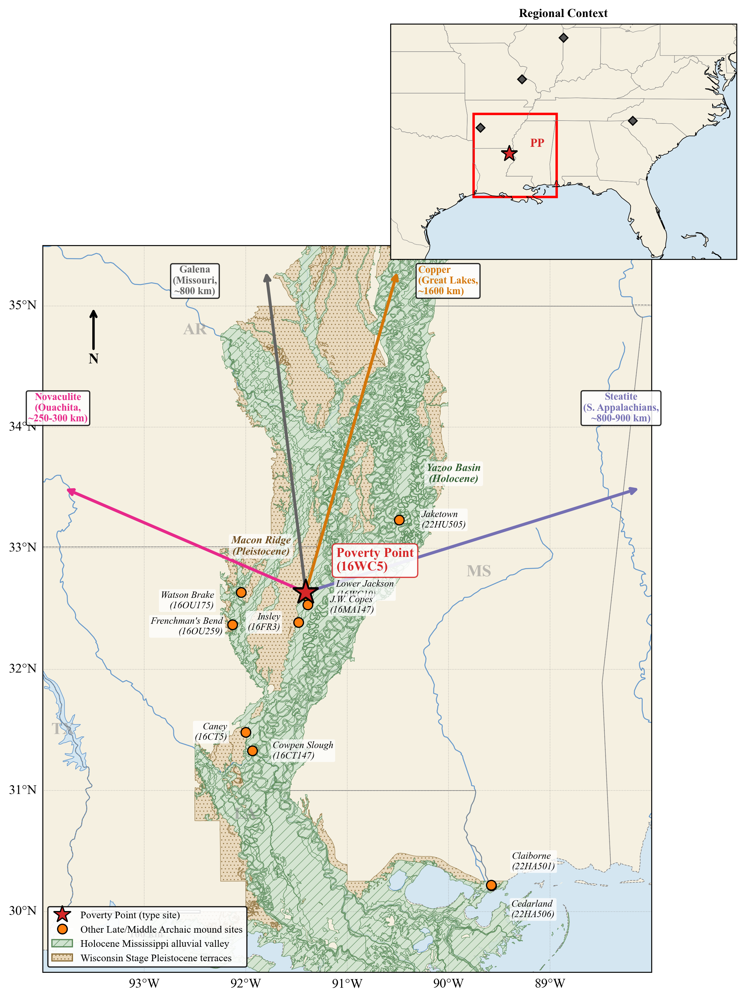

***Figure 1. Location of Poverty Point and Late Archaic monument-building sites in the Lower Mississippi Valley.*** *Surficial geology from the USGS digitization of Saucier (1994); polygons reproduced under public-domain license (USGS ScienceBase item 59b7ddd6e4b08b1644df5cf6, doi:10.5066/F7N878QN). Holocene deposits (green, diagonal hatching) include all units of the active Mississippi alluvial valley; Pleistocene deposits (tan, stippled) include valley trains and the Prairie Complex flanking the valley. Poverty Point (16WC5; red star) lies at the eastern margin of Macon Ridge, where the Pleistocene terrace meets the Holocene Mississippi alluvial valley. Other Late Archaic and Middle Archaic monument-building sites are shown as orange circles with site numbers. Arrows indicate approximate straight-line distances to exotic-material sources used in the model: copper from the Great Lakes (~1,600 km), galena primarily from Potosi, Missouri (~800 km), steatite from the southern Appalachians (~800-900 km), and novaculite from the Ouachita Mountains (~250-300 km).*

***Figure 2. Poverty Point monumental architecture.*** *LiDAR imagery showing the six concentric C-shaped ridges, Mound A (Bird Mound, 22 m), Mound B, Mounds C, E, and F, the central plaza, and Bayou Maçon to the east. The constructed monumental core encompasses approximately 140 hectares.*

The Poverty Point site was a focal point for long-distance exchange networks spanning much of eastern North America (Ford and Webb 1956; Gibson 1999; Webb 1968). An estimated 71 metric tons of lithic raw materials sourced from up to 1,600 km accumulated at the site in quantities far exceeding any contemporary location: over 2,790 plummets (predominantly hematite and magnetite), 2,221 steatite fragments representing several hundred vessels, 702 galena masses, 155 copper objects, and 1,536 lapidary items (Gibson 1984; Webb 1982). Steatite is consistent with southern Appalachian sources in northern Georgia and Alabama (~800-900 km) on neutron activation analysis and ICP-MS (Smith 1991; Yates 2009). Copper was traditionally attributed to Lake Superior (~1,600 km), but recent LA-ICP-MS analysis of six specimens (Hill et al. 2016) indicates that several match Nova Scotia or southern Appalachian sources as well as, or better than, Lake Superior. Galena shows a multi-source pattern: most specimens match Potosi, Missouri (~800 km), with a smaller component from Upper Mississippi Valley deposits in northwestern Illinois, southwestern Wisconsin, and eastern Iowa, identified by atomic absorption spectrophotometry (Walthall et al. 1982). Material concentration is striking: 95.7% of all steatite and 97% of all galena in the entire Poverty Point system are found at the Poverty Point deposit, with peripheral sites receiving comparatively little (Smith 1991). Material flow was overwhelmingly one-directional: exotics arrived by the metric ton, but "nothing visible goes out" (Kidder and Grooms 2025).

This pattern is paradoxical when viewed through the lens of standard models of hunter-gatherer behavior. Mobile foragers typically minimize investment in fixed infrastructure and avoid surplus accumulation (Jackson 1986; Kelly 2013), and there is no evidence at Poverty Point for elite burials, differential residential architecture, economic specialization, or coercive hierarchy of the chiefly type (Kidder and Ervin 2018; Kidder and Grooms 2025). Why, then, would mobile bands invest so heavily in monuments they would periodically abandon, acquire exotic materials with no apparent utilitarian function, and create such an extreme site hierarchy without centralized authority?

Poverty Point is extraordinary in scale, but the underlying transition in which mobile populations began to systematically gather at fixed locations and invest collective labor in the landscape is part of a broader Late Archaic pattern across the Eastern Woodlands. Stallings Island on the Savannah River (Sassaman 2006), the Green River shell mounds in Kentucky (Marquardt and Watson 2005), and the Mulberry Creek shell-mound tradition of the Tennessee Valley (Sassaman 2010) record contemporary or earlier expressions, with their own admixture of monumental construction, formal burials, large pits, post-set timber circles, and accumulated raw materials transported from constrained sources. What unites these cases is a transition that the standard typology of forager behavior does not predict: people who would otherwise be expected to maintain residentially mobile, low-investment lifeways begin to systematically aggregate at locations they then transform. Poverty Point is the case where this pattern reaches its furthest extreme; the framework we develop here is calibrated to account for Poverty Point, but the underlying logic applies across the broader class.

Existing explanations sit along a continuum from the materialist to the symbolic, each capturing part of the phenomenon (Sassaman 2005). Aggrandizer interpretations require asymmetric power that the record does not support (Gibson 1998; Jackson 1986); pilgrimage models cannot explain why this landscape, scale, and tempo (Spivey et al. 2015); trade-center models account for the exotics but not the monuments (Gibson 1999; Jackson 1991); incipient sedentism conflicts with the seasonal faunal record and the absence of cultigens (Jackson 1986). More recent culturally embedded accounts have moved past these classical alternatives. Sanger (2023, 2024) reads the site as an intentional institution of containment, with cyclical aggregation and dispersal preventing the consolidation of authority. Kidder and Grooms (2025) argue that Poverty Point's tempo, scale, and one-directional material flow signal a revitalization movement in response to environmental and demographic pressures. These accounts are valuable in detail but lean heavily on ethnographic analogy across a multi-millennia gap. None of them derives the three answers our analysis sets out to provide: *why* mobile foragers should make such large group-level investments at all, *when* the pattern should begin and end, and *where* it should concentrate -- in particular, why at Poverty Point and not elsewhere in the region. Each is compatible with the record but does not specify the conditions that would force these investments to occur where and when they did.

We propose a structural complement to these accounts grounded in evolutionary theory. The argument is that Poverty Point represents an adaptive costly signaling system operating through seasonal aggregation, in which monuments and exotic goods function as honest signals of cooperative commitment under conditions of environmental uncertainty. The framework does not displace the cultural-historical accounts; it addresses the three motivating questions head-on. *Why*: it specifies the multilevel-selection logic under which group-level investment in monuments and long-distance exotic acquisition becomes adaptive. *When*: it derives a critical uncertainty threshold above which the pattern emerges and below which it collapses, and traces both transitions to specific paleoclimate and fluvial-reorganization events in the LMV record. *Where*: it predicts that sustained aggregation should concentrate at sites with the strongest ecotone-buffered access to multiple independent shortfall regimes, a condition that Poverty Point's confluence position satisfies more strongly than any other LMV monument site. We show that, when these structural predictions are evaluated against the LMV record, they account for site location at ecotone-rich settings, the pulsed tempo of construction, the relative-frequency ordering of exotic materials by source distance, and the rapid post-3300 cal BP collapse following major fluvial reorganization. The framework specifies the necessary conditions for sustained aggregation but does not, by itself, predict the *magnitude* of monument investment at any given site. Magnitude depends on the number of bands attained at the aggregation, which the framework treats as an external input set by regional convergence dynamics rather than derived from first principles. The model is silent on the cultural content (the symbols, the ceremonies, the prophetic language) and intentionally so: the structural prediction is that *some* such cultural apparatus must develop to coordinate cooperation under the predicted conditions, but the specific form that apparatus takes is not derivable from ecology alone.

Costly signaling models in archaeology have been criticized for producing post-hoc narrative rationalizations rather than testable predictions (Codding and Jones 2007; Quinn 2019). The objection is fair where signaling is invoked as an interpretive frame after the pattern is already known, and where the same logic could equally explain almost any costly behavior. Our approach addresses this critique by deriving quantitative predictions from a formal model whose parameters are anchored independently of the archaeological pattern they are meant to explain, and by specifying *ex ante* what observations would falsify the framework.

This raises a more general epistemological problem that any explanatory account of Poverty Point must engage. Most of the available archaeological data were generated under culture-historical research programs that prioritized chronology, typology, and spatial distribution: questions of *what* was where and *when*. The resulting record is extensive and well-documented, but its design biases the kinds of inference it can support. It is calibrated to discriminate cultural-historical periods and traditions, not to discriminate among mechanistic explanations for why people built monuments, why aggregations formed at particular locations, or how cooperation networks operated. Perreault (2019) develops this concern at the level of the archaeological record as a whole, arguing that time-averaging, spatial aggregation, recovery bias, and depositional intermittency place hard limits on the resolution at which behavioral inference can operate, and that many archaeological "patterns" do not actually discriminate among the hypotheses they are conventionally invoked to test. The corollary is that explanatory models in archaeology must generate predictions that can be tested at the resolution the record can actually support, not at the resolution a model could theoretically generate. Most existing accounts of Poverty Point sit on the wrong side of this constraint: they are narratives compatible with the record but do not specify the necessary and sufficient conditions for evaluation, so they do not put themselves at risk relative to the record. Part of this article's contribution is to identify which classes of LMV data can carry inferential weight against a structural explanation, which cannot, and what additional data collection would be needed to discriminate the framework from alternatives. We make this accounting explicit in §7.4 below.

The remainder of this article is organized as follows. Section 2 develops the multilevel-selection logic and the index-signal interpretation that distinguish costly signaling from generic cooperation theory. Section 3 describes the agent-based model in which the framework is formalized. Section 4 presents theoretical results: phase transition, signaling-versus-cooperation ablation, and sensitivity analysis. Section 5 sets out the Lower Mississippi Valley regional record with the level of detail required by the empirical evaluations. Section 6 reports the empirical evaluations: type-site calibration; paleoclimate threshold-proximity under Bayesian uncertainty propagation; the Watson Brake near-threshold case; the cross-LMV regional analysis; multi-drainage shortfall buffering; convergence dynamics; the magnitude-prediction limit; within-year aggregation timing; and construction-tempo pulsing. Section 7 places the framework in conversation with the cultural-historical alternatives, transparently develops the magnitude-prediction limits, identifies falsifiable predictions, and discusses implications for hunter-gatherer archaeology more broadly. Section 8 concludes. The full ODD model specification, parameter justifications, equation derivations, and sensitivity analyses are provided in the Supplemental Material.

## 2. Theoretical framework

### 2.1 Multilevel selection and the logic of aggregation

Consider a region of mobile hunter-gatherer bands. Each band, every year, either travels to a seasonal aggregation and contributes labor to collective tasks comprising earthwork construction, exotic-goods acquisition, and related forms of landscape investment that accompany monumentality, or remains dispersed and forages independently. Contributors pay a short-term cost that non-contributors avoid. As a result, within any aggregation, the non-contributors out-reproduce them. But aggregations stocked with contributors survive bad years (droughts, floods, mast-crop failures) at higher rates than dispersed independents, because contributors carry cooperation networks they can call on during shortfalls. Over generations, the aggregation strategy can spread despite the short-term cost it imposes. The balance depends on the environment. When shortfalls are rare, the cost-avoidance of independents wins; when shortfalls are frequent, the network advantage of aggregators prevails. Between the two regimes lies a tipping point in environmental uncertainty above which aggregation pays and below which it does not.

This narrative can be formalized by the Price equation for multilevel selection (Price 1970). The Price equation cleanly partitions any change in the average frequency of a trait into a part driven by differences *between* groups and a part driven by differences *within* them. For our purposes, the trait is "tendency to aggregate and contribute," and the equation specifies under what conditions that trait spreads:

$$\Delta\bar{p} = \frac{Cov(w_g(\sigma), p_g)}{\bar{w}(\sigma)} + \frac{E(w_g(\sigma) \Delta p_g)}{\bar{w}(\sigma)}$$

In plain language: the change in the population's average tendency-to-aggregate ($\Delta\bar{p}$) is the sum of (i) how strongly groups with more aggregators do better than groups with fewer, weighted by group size, and (ii) how non-contributors gain or lose ground within their own groups. The first term tracks the between-group benefit of cooperation; the second tracks the within-group cost. Symbolically, $p_g$ is the frequency of the aggregation trait in group $g$, $w_g$ is the fitness of group $g$, $\bar{w}$ is the population mean fitness, and $\sigma$ indexes environmental uncertainty (high $\sigma$ = volatile, frequent shortfalls; low $\sigma$ = stable). The first term is large and positive when groups with more cooperators have higher group fitness. The second is typically negative because cooperators pay short-term costs that non-cooperators avoid. Cooperation spreads when the first term outweighs the second.

$\sigma$ modulates the balance between the two terms. In stable environments, the within-group cost dominates. In volatile environments, the between-group benefit dominates. Separating the two regimes is a critical threshold $\sigma^*$. Below it, the population converges on independent foraging; above it, aggregation with cooperative monument investment spreads and persists. The transition is sharp rather than gradual because the cooperation network produces positive feedback: more aggregators yield denser networks, which lower per-band vulnerability and make aggregation more attractive (see §2.4 below). Sharp transitions of this kind are *phase transitions*, by analogy with physical systems such as water freezing at 0°C. We expect three qualitative regions in the simulation results: a near-flat low-investment regime, a narrow transition zone, and a near-flat high-investment regime.

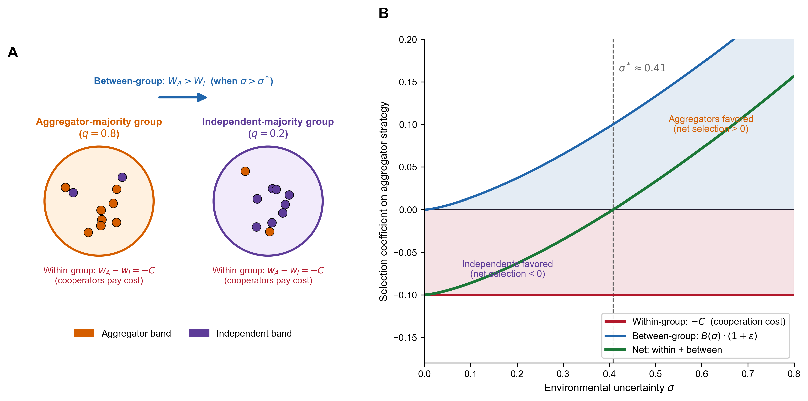

***Figure 3. The two selection components of the aggregator strategy.*** *(A) Schematic of the multilevel-selection logic. Within any group of mixed strategies, cooperators (aggregator bands) pay a fitness cost $C$ relative to non-cooperators (independent bands), so within-group selection is always negative for the aggregator strategy. Across groups, an aggregator-majority group ($q = 0.8$) achieves higher mean fitness than an independent-majority group ($q = 0.2$) when environmental uncertainty is high enough that network-mediated buffering matters; between-group selection rewards cooperator-rich groups. (B) Net selection on the aggregator strategy as a function of environmental uncertainty $\sigma$, decomposed into within-group (red, constant cost penalty $-C$) and between-group (blue, cooperation benefit $B(\sigma) \cdot (1+\varepsilon)$) components. The two components balance at the critical threshold $\sigma^*$: below it, independents are favored (net selection $<0$); above it, aggregators are favored (net selection $>0$). The curves are illustrative under simplified parameterizations chosen so the threshold lands near the manuscript's calibrated $\sigma^* \approx 0.40$.*

The logic is not new in archaeology. Multilevel selection is the formal apparatus underlying long-running discussions of scalar tension (Johnson 1982), risk-pooling and storage (Halstead and O'Shea 1989), and cooperation under uncertainty (Hawkes 2000; Winterhalder 1986). What our framework adds is a sharp-threshold prediction. We are not claiming, however, that greater uncertainty always yields more cooperation. Instead, we claim that the relationship is non-monotonic and that the transition is concentrated within a narrow range of conditions. Where archaeological intuition might look for a continuous correlation between environmental stress and the scale of monument investment, the model predicts a step function.

Earlier applications of this framework to territorial monument-builders, such as Rapa Nui ahu (DiNapoli et al. 2019), treated groups as fixed in space competing for territory. The signal said, "We can defend this place," and monuments served as deterrents. For mobile hunter-gatherer bands, the optimization problem is different. Bands are not territorial. They choose whether to aggregate at central locations, how long to remain, and how much to invest in collective construction. The signal function shifts from deterrence to attraction. It now says "we will cooperate reliably" and serves to identify trustworthy partners among bands that may have only weak prior contact with one another. This shift requires modifying the fitness functions to reflect a fission-fusion social structure in which cooperation is re-established with partial strangers each year.

### 2.2 Honest signals: index, not handicap

The investment in monumentality serves as a signal within and between bands. These signals are considered "costly" since they are an investment of energy and resources. Signaling theory in archaeology distinguishes two kinds of reliable signals. *Handicap* signals (Zahavi 1975) are reliable because they are wasteful: only individuals with surplus capacity can afford them, so the signal correlates with quality precisely because of the cost. *Index* signals (Bliege Bird and Smith 2005) are reliable because they are physically constrained: only individuals who actually possess the underlying quality can produce them, so the signal correlates with quality regardless of cost. A handicap signal works by being expensive. An index signal works by being unfakeable. Recent reviews in evolutionary biology have moved away from strict interpretations of the handicap (Penn and Szamadó 2020), and the signals at archaeological aggregation sites fit the index framework more naturally. A band cannot display Great Lakes copper unless it has actually obtained Great Lakes copper, and a band cannot have basket-built a substantial mound without having mobilized many bodies for many days. The cost in both cases is a consequence of producing an unfakeable signal, not the mechanism that enforces honesty. This distinction matters because the signaling model does not require signals to be wasteful displays. It requires only that they correlate reliably with the cooperative capacity they advertise.

For a signaling framework to do empirical work, it must specify four things: who is signaling, who is receiving, what quality is being signaled, and how the receiver responds. At an aggregation gathering: (1) the **signaler** is an aggregating band; (2) the **receivers** are other bands at the gathering, both established partners and prospective ones drawn from across the regional network; (3) the **quality being signaled** is cooperative reliability, operationalized as a band's likelihood of contributing labor to collective construction and reciprocating obligations during shortfalls; (4) the **receiver response** is preferential partner selection, with bands forming and strengthening reciprocal obligations with high-signal partners over the course of an aggregation season.

The framework requires a signal-conditional response from the receiver.  A "signal-conditional response" is a behavior whose form or magnitude depends on the signal an interaction partner has displayed: receivers do not respond uniformly but instead calibrate cooperation, deference, or aggression to the quality of information the signal conveys. We implement this process in the agent-based model as three coupled rules. First, agents preferentially form ties with partners who display larger signals, so the probability of forming a relationship scales with the partner's display level. Second, when a shortfall hits, agents call on their network for help in order of tie strength, drawing first from their strongest partners and moving down the list until the need is met. Third, the density of these obligation ties at a gathering site directly reduces the effective shortfall experienced there ($\sigma_{eff}$), because dense networks buffer local losses through pooled support. Full implementation specifications are given in §S1.6. Comparison runs verify that the implemented rules behave as specified by the analytical framework, and parameter sweeps near the critical threshold examine how the within-group reward parameter (which scales the strength of the signaling channel) shifts the threshold location (§4.3). These tests confirm the model is working as intended, but they are not where the framework earns its empirical traction. The distinguishing prediction is based on the asymmetric pattern of help flowing through the obligation network, as evaluated in §6.1. The threshold-location analysis in §4.3 shows that a regime shift occurs; the asymmetric-flow signature in §6.1 makes the framework testable against archaeological data.

Earthwork construction is an unusually clean index signal because it is inherently collective and physically unfakeable. Moving earth in baskets at the Late Archaic mound sites (Ford 1955; Ortmann and Kidder 2013; Sherwood and Kidder 2011) requires many people working together for sustained periods, in observable real time, at a fixed location. A band's contribution is visible to other participants in the construction event: others can see who carries baskets, who hauls posts, who digs. Non-contributors are immediately identifiable, which minimizes free-riding. The construction itself requires cooperation, so the act of signaling produces the cooperative behavior it advertises. Bands that have invested heavily in mound or ridge fill at a particular site also have strong incentives to return, because abandoning the system means losing the value of past investment. The sunk cost binds participants and lets other bands preferentially cooperate with committed partners. Other classes of Late Archaic landscape investment (large excavated pits, prepared activity surfaces, formal burial concentrations, and post-set timber circles) share the same labor signature and read the same way under the framework, but the bulk of our empirical evaluation focuses on monumental earthwork volume because these structures are quantitatively tractable measures of accumulated signaling effort.

**The signal half-life.** The value of a completed earthwork as an honest signal of *current* cooperative capacity has a half-life. Signaling theory requires that the signal reliably indicate the signaler's properties at the time of the receiver's response (Bliege Bird and Smith 2005; Hawkes and Bliege Bird 2002). A finished mound remains physically present after the bands that built it have dispersed, fissioned, died, or been replaced; over time, the feature no longer reliably indicates the cooperative capacity of bands now attending. Free-riders can occupy a complex without having contributed, and a receiver cannot easily distinguish a band that just hauled baskets from one whose ancestors did. The signal value of any individual construction event, therefore, decays even as the mound persists, which is what makes ongoing construction necessary rather than optional: each new episode renews the signal at the timescale relevant for current partner choice. The framework predicts a pulsed, episodic construction tempo, with many separate, honest signals stacked over the active interval, rather than a single durable display whose signal value persists for centuries. The Eastern Archaic record matches this expectation: build-decommission-rebuild sequences in plaza post circles, multi-stage activity surfaces beneath terminal mound caps, and the dozens of distinct ridge construction components documented at Poverty Point through recent geophysical and geoarchaeological work all fit the expected episodic pattern. The same logic recasts eventual collapse: a system that depends on continuous re-signaling is vulnerable not only to threshold-crossing environmental change but also to any disruption that interrupts the construction cycle.

Exotic goods complement the collective construction signals at the individual scale. Acquiring materials whose source is geologically constrained (copper from the Great Lakes, Maritime, or southern Appalachian sources at ~1,000-1,600 km; steatite from the southern Appalachians at ~800-900 km; galena from Missouri at ~800 km) cannot be faked because the materials carry distinctive geochemical signatures traceable to specific sources. Possession demonstrates resource surplus, long-distance network connectivity, and willingness to invest in the exchange system, all qualities that make a band a desirable partner.

Poverty Point Objects (PPOs), the locally-produced fired-clay cooking objects that occur in tens of thousands across the Late Archaic LMV (Hays 2019; Webb 1982), are dense enough in the regional record that an external reader of the LMV literature might reasonably expect them to feature in a signaling argument. We are explicit that the framework's current implementation does not formalize PPOs as a signaling channel, and the reasons developed below apply more strongly to per-band PPO possession than to aggregate PPO production volume at a site. The unfakeability criterion the framework uses for index signals (above) is sharper than "expensive": it requires that the signal cannot be produced without the underlying quality the receiver wants to know about. For earthworks, that quality is mobilization of cooperative labor at the gathering, and basket-built fill cannot be produced without it; for imported exotics, the quality is direct travel to or partnership with bands at the geological source, and a galena nodule from Potosi cannot be produced by a band that has not (directly or through a known visitor-band partner) accessed Potosi material. PPOs do not have this property at the band level: locally produced fired-clay cooking objects can be made by any band with access to local clay and fuel, including bands that did not attend the gathering or contribute labor, so PPO possession does not reliably index participation as a visitor band. There is also no evidence that PPO possession or display operated through the partner-choice premium on which the framework's band-level signaling apparatus relies, and PPOs are widely distributed across LMV-affiliated populations rather than concentrated at the gathering site as the exotic-materials record is. The framework's formalized signaling channels are therefore earthworks (collective, group-level) and imported exotic goods (individual-band-level); PPOs are not in this set, and the reason is not that they are cheap (cost is incidental) but that they fail the unfakeability criterion at the band level.

A weaker form of the signaling argument could in principle apply to PPO production *volume* at the site rather than PPO *possession* at the band level. The framework reads excess monument volume beyond utilitarian baseline as a group-level index of collective labor mobilization at the gathering; the same logic could in principle apply to PPO deposits at the type site if their aggregate quantity exceeds what cooking needs would require for the documented occupation. Hays (2019) interprets PPO concentrations at Poverty Point as feasting deposits, a reading consistent with this signaling interpretation. We do not formalize this group-level PPO channel in the present analysis for two reasons. First, per-band attribution is not possible (PPOs do not carry maker-identifiable marks), so PPOs cannot operate as the band-level signal that exotic goods provide. Second, operationalizing the group-level reading would require a quantitative cooking-needs baseline against which excess production could be measured, which the LMV literature has not yet developed. We identify a cross-LMV test of PPO deposit density against site-level aggregation intensity as a productive empirical extension in §7.4.

PPOs nonetheless carry information about regional social structure, but on a different intellectual register: cultural transmission rather than signaling. Functionally, PPOs are a cooking technology that solves a practical problem and would be expected to spread on its own merits wherever the same problem is faced. Stylistically, the *forms* they take (the specific size classes, surface treatments, and morphological variants documented across LMV assemblages) are more variable than functional efficiency requires; cooking performance is largely insensitive to whether an object is grooved, melon-shaped, biconical, or cylindrical, so the distribution of formal variants is shaped by who is teaching whom rather than by the environment of use. Under cultural-transmission theory, this is what makes form informative as a tracer of social-learning networks: stylistic similarity records the path through which the manufacturing tradition was transmitted, not the cooking problem the objects solve (Pierce 1997). PPO formal variation is therefore a productive record class for studying the cultural-affiliation networks within which the LMV system operated, but it does so as transmission data, not as costly-signaling data, and we make no signaling claim from it. Empirical work testing whether PPO stylistic-variant frequencies map onto the same band-level network structure that the framework's exotic-goods signal traces (a different question than whether PPOs are signals) is identified in §7.4 as a productive extension.

### 2.3 The ecotone advantage

The probability and stability of aggregation depend on more than uncertainty alone. They also depend on whether the aggregation site itself can support large gatherings during extended seasonal stays. We represent this buffering with a single parameter $\varepsilon$, and the effective uncertainty at the aggregation site is

$$\sigma_{eff} = \sigma_{regional}(1 - \varepsilon)$$

The mechanism $\varepsilon$ encodes is shortfall buffering through *negative covariance* between locally accessible zone productivity and the regional shortfall driver. When local zones share the same shortfall driver (e.g., a single drainage hit by a regional drought, a single floodplain drowned by a flood pulse), aggregator bands at the gathering experience the same shortfall as bands dispersed in single-zone territories elsewhere; $\varepsilon$ is small. When the local zones draw on independent shortfall drivers (e.g., drainages with different hydrographs, uplands and lowlands responding to different precipitation modes), some local zones are typically producing during regional shortfalls; $\varepsilon$ is large. The framework's prediction is, therefore, not that aggregation concentrates at the most diverse location in raw zone count, but at the location with the strongest negative covariance between accessible-zone productivity and regional shortfall. Confluence positions integrating multiple canoe-accessible drainages with non-synchronized hydrographs maximize $\varepsilon$.

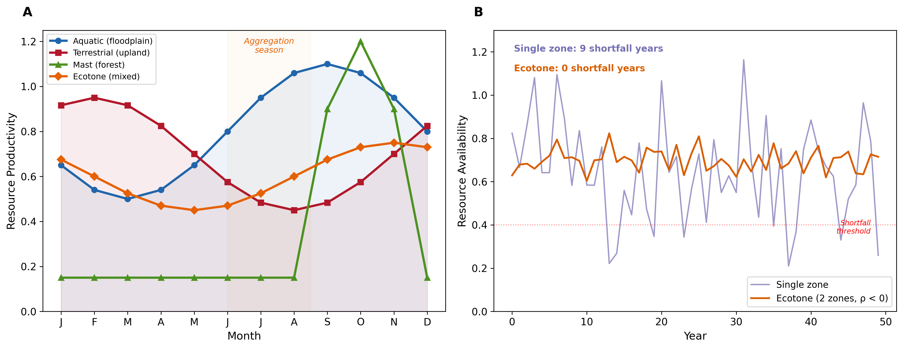

***Figure 4. The ecotone advantage: how multi-zone access buffers shortfall.*** *(A) Seasonal productivity profiles for the four resource zones available at a representative LMV aggregation site. Aquatic resources (e.g., floodplain fish, summer waterfowl, overwintering ducks November-March, spring and fall flyway peaks), terrestrial game (e.g., mammals, fall-winter peak), mast (sharp fall peak), and ecotone-edge productivity (moderate but stable year-round) follow staggered seasonal cycles. The shaded band marks the summer aggregation season, when multiple resource types are accessible simultaneously. (B) Year-by-year resource availability for two hypothetical bands over a 50-year stochastic simulation: a single-zone band (purple) experiences high inter-annual variability and crosses the shortfall threshold (red dotted) in 9 of 50 years, while an ecotone-buffered band drawing from two negatively correlated zones (orange) experiences substantially smoothed productivity and zero shortfall years. The mechanism $\varepsilon$ encodes is this variance reduction, not raw zone count.*

The ecotone insight is not novel in hunter-gatherer archaeology. Jackson (1986, 1989) developed it explicitly in subsistence work for the LMV, and Ward (1998) refined it through paleoethnobotany. What the model adds is an explicit operationalization of $\varepsilon$ as covariance-based shortfall buffering, distinguishing it from raw zone count. A measured operationalization at the regional scale, using modern hydrograph data as a first-order proxy for Late Archaic drainage independence, is developed in §6.5.

### 2.4 Fitness functions and the critical threshold

Bands choose annually between the **aggregator** strategy (travel to the site, invest in monuments and exotics, form reciprocal obligations) and the **independent** strategy (remain dispersed, forage independently). A band that aggregates *pays* to do so (travel, time away from foraging, labor on monuments) and *gains* from doing so (cooperation network for bad years, reduced conflict via visible commitment, social rewards for visibly contributing). A band that stays independent avoids the cost but bears the full brunt of any shortfall alone. Whether aggregation is worth it depends on how often shortfalls occur, how vulnerable an unaggregated band is, and how much the cooperation network can buy when needed. The aggregator fitness function is

$$W_{agg}(\sigma, \varepsilon) = (1 - C_{total}) \cdot (1 - \alpha(k_{eff}) \cdot \sigma_{eff}) \cdot (1 - m(1-r)P_{base}) + B(\lambda)$$

Each multiplicative factor is a probability-of-success term, applied sequentially: a band first pays aggregation costs, then survives any shortfall, then survives any conflict, and the signaling benefit accrues additively on top. Reading the equation left to right, the band's expected fitness is the product of (chance of paying off the aggregation cost) × (chance of surviving environmental shortfall given network buffering) × (chance of avoiding conflict given visible monuments) plus the social reward for contributing. **Aggregation costs** $(1 - C_{total})$: travel, labor on monument and exotic-goods investment, and foregone foraging. **Shortfall survival** $(1 - \alpha(k_{eff}) \cdot \sigma_{eff})$: aggregators have lower vulnerability than independents because cooperation networks let them call on partners in bad years, and lower effective uncertainty because the ecotone provides multi-zone buffering. **Conflict avoidance** $(1 - m(1-r)P_{base})$: visible monuments reduce escalation probability via the assessment mechanism (Enquist and Leimar 1983). **Signaling benefit** $B(\lambda)$: bands that contribute gain a within-group fitness boost scaled by the total signaling incentive $\lambda = \lambda_W + \lambda_C + \lambda_X$ (within-group, conflict-deterrence, and cooperation-network components).

The vulnerability function $\alpha(k) = 1/(1 + \gamma k)$ derives endogenously from the band's cooperation network rather than being a fixed input. $k$ is the number of cooperation partners a band has access to, $\gamma$ is a network-effectiveness parameter, and $\alpha(k)$ is the share of a shortfall a band absorbs personally. More partners mean lower vulnerability, with diminishing returns. Independents have only baseline kin connections ($k_0 = 0.3$). Aggregators with mature monument stocks reach within-aggregation network degree $k_{agg} \approx 4-6$. Because aggregation occurs only for $f_{agg} \approx 0.25$ of the year and networks decay during dispersal, the effective annual vulnerability $\alpha(k_{eff})$ is a weighted average over the gathered and dispersed periods.

The independent fitness function is simpler:

$$W_{ind}(\sigma) = (1 - \beta(k_0) \cdot \sigma) \cdot (1 - m \cdot P_{base})$$

Independents avoid the aggregation cost but face full regional uncertainty with only baseline networks and gain no signaling benefit. Parameter values are estimated from ethnographic analogy, archaeological inference, and theoretical constraint; full justifications are in Supplemental §S2, and sensitivity analyses across all 13 parameters are in Supplemental §S3.

The **critical threshold** $\sigma^*$ is the value of environmental uncertainty at which the two fitness functions cross over. We solve for $\sigma^*$ numerically using Brent's (1973) method, a standard one-dimensional root-finder that brackets a sign change. The difference $W_{agg}(\sigma) - W_{ind}(\sigma)$ is monotonically decreasing in $\sigma$ across the range used here, because aggregation costs are independent of $\sigma$ while shortfall vulnerability rises faster for independents than for aggregators.  We have verified this monotonicity numerically and report no cases of multiple crossings. At zero ecotone advantage and 25 bands, $\sigma^* \approx 0.57$. With moderate ecotone advantage ($\varepsilon = 0.35$), $\sigma^* \approx 0.40$; with stronger ecotone access ($\varepsilon = 0.49$), $\sigma^* \approx 0.36$. Lower thresholds mean aggregation becomes adaptive at lower environmental uncertainty.

The cooperation network feeds back on itself, which is what makes the transition at $\sigma^*$ sharp rather than gradual. In plain terms, more investment in monuments builds a larger network of cooperative partners. A larger network reduces how exposed each band is to bad years, lower exposure makes signaling more rewarding, and higher reward draws more monument investment. The four steps form a closed loop, and the loop has the property that small differences in initial conditions can amplify into qualitatively different long-run behavior, producing either a population stuck at low investment or one stuck at high investment with little in between.

Monument investment builds an effective monument stock $M_g$; $M_g$ attracts cooperation partners through a saturating function $k(M_g) = k_0 + k_{max} M_g/(M_{half} + M_g)$. A larger network reduces vulnerability through $\alpha(k)$. Lower vulnerability raises the cooperation-network component of the total signaling incentive $\lambda$. Higher $\lambda$ raises the optimal level of signaling investment, building more monuments. We solve this loop by *fixed-point iteration*: pick a starting value for $\lambda$, we compute the resulting investment, recompute $\lambda$ from that investment, and repeat until the value stops changing. The "fixed point" is the value of $\lambda$ that produces itself. We use damping in which each new value is a weighted average of the new and previous estimates, with a weight of 0.5. This process prevents oscillation, and we stop when successive estimates differ by less than $10^{-6}$. Across a 30-point sweep of $\sigma$ from 0.10 to 0.95, the iteration converges in 18 steps every time, and runs from different starting values at $\sigma \in \{0.30, 0.50, 0.70\}$ all reach the same equilibrium monument stock to within 1 part in $10^4$, so the fixed point is unique at the parameter values we use.

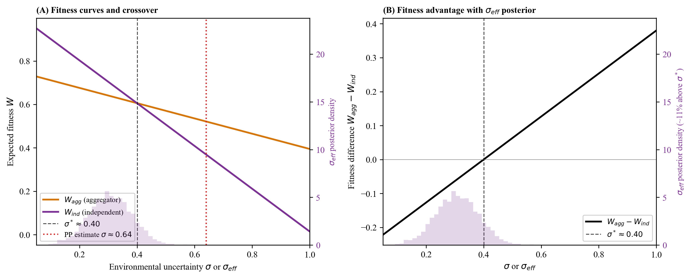

***Figure 5. Fitness crossover and the critical threshold.*** *Expected fitness for aggregator (orange) and independent (purple) strategies as a function of environmental uncertainty $\sigma$. The strategies cross at $\sigma^* \approx 0.40$ given a moderate ecotone advantage ($\varepsilon = 0.35$). Below $\sigma^*$, the independent strategy yields higher expected fitness. Above $\sigma^*$, the aggregator strategy does. The fitness difference $W_{agg} - W_{ind}$ is monotonically decreasing in $\sigma$, so the threshold is unique.*

## 3. The agent-based model

The analytical framework laid out in §2 derives an equilibrium prediction from four specified mechanisms: signal-conditional partner formation, cooperation-network buffering, ecotone-mediated effective uncertainty, and the lambda-sigma feedback that fixes the critical threshold. What it does not establish is whether those mechanisms, when operating together as a dynamic system rather than at analytical equilibrium, actually produce the aggregate behavior the theory predicts. This is what Lewontin (1974) calls *dynamic sufficiency*: whether a model's specified state variables and transition rules contain enough machinery to generate the behavior the theory attributes to it. Dynamic sufficiency is distinct from *empirical sufficiency*, the question of whether the theory accounts for the observed archaeological record. Both are necessary for an account to be persuasive, and they are addressed in different parts of this article: dynamic sufficiency in §4, empirical sufficiency in §6.

The agent-based model addresses the dynamic-sufficiency question. It implements the framework's individual-level mechanisms as agent-level rules and asks whether the aggregate-level patterns the theory predicts (the sharp phase transition near $\sigma^*$, the lock-in dynamics in the bistable zone, the self-sustaining feedback between monument accumulation and network buffering) actually emerge from those rules under stochastic, finite-population, spatially explicit conditions. The analytical equilibrium predictions could fail at the dynamic level for several reasons: stochastic fluctuations could erase the threshold, finite-population effects could prevent the network feedback from establishing itself, or the ordering of agent decisions could matter in ways that the analytical derivation hides. The ABM tests directly whether the analytical predictions hold up under these complications. If they do, the framework passes the dynamic-sufficiency test: the mechanisms the theory specifies are sufficient, when implemented dynamically, to produce the behavior the theory attributes to them. Whether they also account for the Late Archaic LMV record is the empirical-sufficiency question taken up in §6.

We implemented the framework as an agent-based model in Python. In this model, individual hunter-gatherer bands interact with each other and with their environment over simulated years, and population-level outcomes (i.e., monument volume, exotic-goods totals) emerge from accumulated decisions rather than being assumed in advance. The model integrates three modules: an **environment module** representing a heterogeneous four-zone landscape with seasonal cycles and stochastic shortfalls; an **agent module** implementing band-level state (i.e., location, resources, monument investment, exotic holdings, obligation network), annual strategy choice (best-response between aggregator and independent), action execution, and reproduction (i.e., births and deaths weighted by fitness, fission at band size > 30); and a **simulation controller** orchestrating the annual aggregation-dispersal cycle.

For readers familiar with the ODD protocol (Grimm et al. 2010), the model summary is as follows. **Time step**: one year, partitioned into a four-phase annual cycle (spring dispersal, summer aggregation, fall harvest, winter reproduction). **Agent activation**: All bands act synchronously within each phase of the annual cycle, meaning every band evaluates and updates its state simultaneously rather than in random sequence. This process avoids effects in which early-acting agents condition the choices available to later-acting ones. **Decision rule**: Once per simulated year, each band chooses between the aggregator strategy (investing in costly displays and obligation ties) and the independent strategy (foregoing display and relying on local production). The choice is a response to the fitness functions defined in §2.4, evaluated against the population state at the start of that year (i.e., the prevailing mix of strategies, network density, and recent shortfall history). Rather than deterministically picking the higher-payoff option, bands choose probabilistically using a softmax rule: the probability of selecting strategy i is proportional to $\exp(W_i / \tau)$, where $W_i$ is its expected fitness and $\tau$ is a temperature parameter that controls how sharply agents discriminate between options. We use a small temperature ($\tau = 0.1$), which means agents are strongly biased toward the higher-payoff strategy but occasionally choose the lower-payoff one. This small amount of decision noise serves two purposes. First, it prevents the unrealistic case in which all bands switch strategies in lockstep the moment expected payoffs cross. Second, near the critical threshold where the two strategies have nearly equal expected fitness, even modest noise generates path dependence: the early stochastic choices of a few bands shift the population state, which in turn alters the fitness landscape that subsequent decisions face. This produces the lock-in and hysteresis effects characteristic of real cultural transitions, where which strategy dominates can depend on initial conditions and the order of early adopters rather than on small payoff differences alone. **Reproduction rule**: births and deaths are weighted by realized fitness. Bands fission deterministically at size 30, with daughter bands inheriting the parent band's monument-investment history and obligation network at half weight. **Stochasticity** enters through (i) annual environmental shortfall draws (Bernoulli with frequency 1/T, magnitude m), (ii) softmax decision noise, and (iii) random initial obligation-network seeding. The complete ODD specification, submodel equations, and source code documentation are in Supplemental §S1.

The four resource zones are: (1) aquatic resources (e.g., floodplain fish, summer waterfowl, and overwintering ducks November-March, with peaks during spring and fall flyway migrations); (2) terrestrial game (e.g., deer and other mammals, peaking in fall-winter); (3) mast resources (hickory and acorn, with a sharp fall peak); and (4) ecotone-edge resources providing moderate but stable year-round productivity. Each zone has its own seasonal productivity profile. The staggered seasonal peaks are what create the multi-zone buffering effect captured by the ecotone advantage parameter $\varepsilon$.

Stochastic shortfalls (e.g., drought years, exceptional floods, mast-crop failures) are characterized by two parameters: how often they occur (*recurrence frequency*) and how badly they reduce productivity when they occur (*magnitude*). The model collapses these two into a single composite uncertainty index, $\sigma = m \cdot \sqrt{20/T}$, where $m$ is the average proportional productivity loss in a shortfall year (so $m = 0.45$ means a shortfall year delivers 55% of normal productivity) and $T$ is the mean spacing between shortfalls in years. The derivation is straightforward (Supplemental §S1.4) and based on a Poisson-renewal process where shortfalls of magnitude $m$ arrive at rate $1/T$ and the standard deviation of annual productivity loss is $m / \sqrt{T}$. Multiplying these values by $\sqrt{20}$ rescales this quantity into 20-year-reference units, so that a shortfall regime with $T = 20$ produces $\sigma = m$. The intuitive consequence is that frequency and magnitude trade off. A regime with severity-0.5 shortfalls every twenty years yields the same $\sigma$ as a regime with severity-0.25 shortfalls every five years, because both expose a band to the same cumulative variance over a generation-scale horizon.

A note on interpretation is in order, because the symbol $\sigma$ is conventionally read as a statistical standard deviation. In the fitness functions of §2.4, $\sigma$ does not enter as the year-to-year standard deviation of resource availability. It enters as a multiplicative penalty that discounts expected fitness in proportion to the cumulative severity of shortfalls over a 20-year reference window. The plain-language reading is therefore "effective shortfall severity index over a 20-year horizon," not "year-to-year variability in harvest yields." A higher $\sigma$ means an environment in which shortfalls are more frequent, deeper, or longer-lasting over the reference window. It does not describe the spread of any single year's outcome. The choice of a 20-year window is a unit convention rather than a substantive parameter. A shorter reference window (say, 5 years) would yield numerically smaller $\sigma$ values while a longer one (say, 50 years) would yield larger values, because more shortfalls accumulate over a longer span. Critically, this rescaling does not affect the comparisons that drive the analysis. The empirical estimate $\sigma_{LMV}$ (i.e., the severity inferred from late-Holocene Lower Mississippi Valley paleoclimate proxies; §5.5) and the model-derived critical threshold $\sigma^*$ are computed on the same scale, so their ratio is invariant under any consistent change of reference window. We confirm this in §S1.4: across $T_0 \in \{5, 10, 20, 50\}$ years, the ratio $\sigma_{LMV}/\sigma^* = 1.591$ is preserved exactly. This invariance is what makes threshold-proximity comparisons meaningful, and we rely on it when reporting results below.

The aggregator fitness function combines vulnerability and shortfall severity multiplicatively, as $(1 - \alpha(k_{eff}) \cdot \sigma_{eff})$, where $\alpha(k_{eff})$ is the vulnerability coefficient (i.e., the fraction of unbuffered shortfall loss the band actually experiences given its network) and $\sigma_{eff}$ is the effective shortfall severity. The plain-language reading of the function is "fraction of productivity lost = vulnerability × severity." This product is the principled choice given the meanings of the two factors: $\alpha$ does not denote a fractional loss in its own right. Instead, it modulates how a $\sigma$-induced loss is perceived, and the multiplicative coupling ensures that modulation operates on the right scale. We considered two alternative couplings discussed in the broader risk-pooling literature, an additive form $(1 - \alpha - \sigma_{eff})$ and a hazard-composition form $(1 - \alpha)(1 - \sigma_{eff})$, and document them in §S3.6. Direct substitution of either alternative produces degenerate or quantitatively incomparable results because $\alpha$ and $\sigma_{eff}$ are not on commensurate scales (a vulnerability coefficient is not a hazard rate), so a fair coupling-form comparison would require reformulating $\alpha$ as a probability-like quantity. We retain the multiplicative form throughout the analyses below, and report the §S3.6 reformulation as evidence that the phase-transition structure (a sharp transition at some $\sigma^*$) is a generic property of the framework rather than the result of this specific functional form.

**Run configurations.** The model is run in three configurations in this study, each addressing a different question and each labeled at the point of use.

(i) *Phase-transition sweep* (§4.1): tests whether the agent-based dynamics reproduce the analytical critical threshold. The model is run at PP-scenario parameters across seven values of effective uncertainty, with multiple stochastic replicates per value to characterize run-to-run variation. Full sweep configuration in §S7.1.

(ii) *Ablation experiment* (§4.3): tests whether signal-conditional partner formation actually shifts the threshold relative to a model in which cooperative ties form by random pairing instead. The two versions are run at the same parameters as the §4.1 sweep and share the same set of model runs documented in §S7.1.

(iii) *One-at-a-time (OAT) sensitivity* (§S3.1): tests how strongly each model parameter influences the critical threshold. Each parameter is perturbed by $\pm 50\%$ from its default value, and the threshold $\sigma^*$ is recomputed analytically as the value of $\sigma$ at which the aggregator and independent fitness functions cross (Brent's-method root-finding on the lambda-sigma fixed-point equilibrium). Because this is a deterministic calculation rather than a stochastic simulation, there are no replicates. The §S3.1 table reports the range of the resulting thresholds directly.

**Restructured network-saturation function (§S5.2).** The default form of $\lambda_X$ measures the *marginal* gain from one more partner: how much additional survival benefit a band gets per additional unit of monument investment, written $(\partial k/\partial M_g)(\partial S/\partial k)$ in the calculus notation. This marginal gain shrinks toward zero at large $M_g$ because the network-degree function $k(M_g)$ saturates, so a band that already has many partners gains little from one more. The plain-language consequence is that under the default formulation, the cooperation-network channel of $\lambda$ goes silent at equilibrium even though the actual network is doing the work of buffering shortfalls. To recover that buffering value in $\lambda$, we add a non-marginal *network-density value* term that captures the absolute survival benefit of the network rather than just the marginal one, weighted by a parameter $\xi_X$ and modulated by a saturating monument-quality multiplier following Bliege Bird and Smith 2005's intuition that signal quality enhances per-partnership value:

$$\lambda_X = (\partial k/\partial M_g)(\partial S/\partial k) + \xi_X \cdot S(k, \sigma) \cdot \frac{M_g}{M_g + M_{quality}}$$

At $\xi_X = 0$ (default), this reduces to the original saturating form. At $\xi_X = 0.5$, the non-marginal term contributes $\sim 0.03$ at equilibrium. The implications for the §4.3 ablation are developed below.

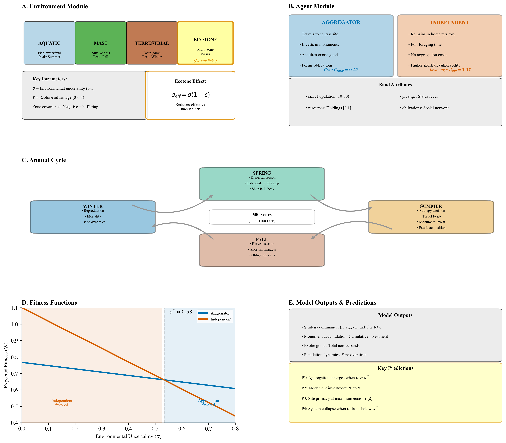

***Figure 6. Agent-based model architecture.*** *(A) Environment module: heterogeneous four-zone landscape (i.e., aquatic, terrestrial game, mast, ecotone-edge) with seasonal cycles and stochastic shortfalls; the ecotone parameter $\varepsilon$ controls multi-zone shortfall buffering at the aggregation site. (B) Strategy choice: each band annually selects between the aggregator strategy (travel to the gathering, contribute to monument construction, acquire exotics, form obligation ties) and the independent strategy (remain dispersed, forage independently). (C) Annual cycle: spring dispersal, summer aggregation with monument investment and exotic acquisition, fall harvest with shortfall impacts, winter reproduction. (D) Fitness functions $W_{agg}$ and $W_{ind}$ (eq. §2.4) determine the critical threshold $\sigma^*$ via the lambda-sigma feedback loop. (E) Outputs: strategy dominance, monument accumulation, exotic-goods totals, population dynamics, obligation network density. The full ODD-protocol specification is in Supplemental §S1.*

## 4. Theory and simulation results

### 4.1 Phase transition

The first test is whether the simulation exhibits the sharp behavioral threshold predicted by the theory. We define the **strategy-dominance metric** as the population fraction of aggregator bands minus the population fraction of independent bands, ranging from $-1$ (all independent) to $+1$ (all aggregator), with $0$ marking parity. Running the model at PP-scenario parameters ($\varepsilon = 0.35$) across a sweep of effective uncertainty values, the signal-conditional configuration produces a clean S-curve in strategy dominance: the metric climbs from strongly negative at low $\sigma_{eff}$ through crossover near $\sigma_{eff}^* \approx 0.42$ to saturation near $+0.92$ at the highest $\sigma_{eff}$ values (Figure 7A). The replicate spread across the transition zone (SD typically 0.03–0.10) is tight enough to characterize both the location of the crossing and the sharpness of the transition. The simulated crossover at $\sigma_{eff}^* \approx 0.42$ matches the analytical prediction $\sigma^* = 0.40$ at $\varepsilon = 0.35$ to within 0.02, validating that the agent-based dynamics reproduce the multilevel-selection threshold derived in §2.4. Sweep configuration, the precise $\sigma_{target}$ values, and the realized-vs-target sigma adjustment are documented in §S7.1.

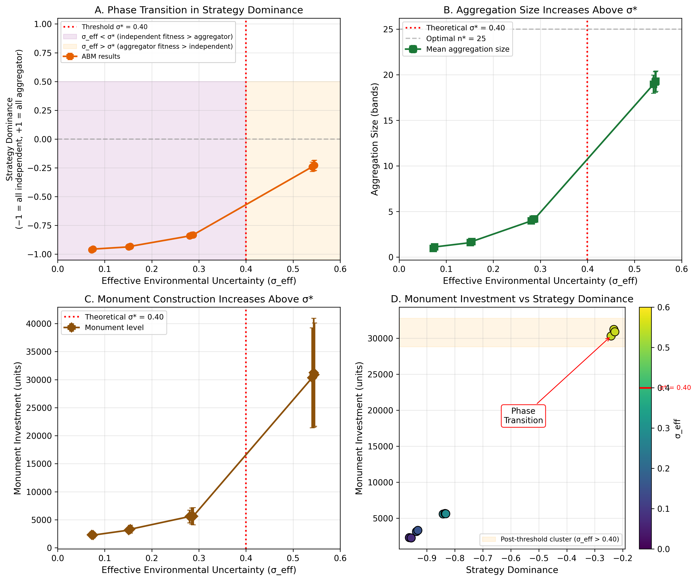

***Figure 7. Phase transition validation and signaling vs. cooperation ablation.*** *Six replicates per cell × 7 $\sigma_{target}$ points × 2 versions (signal-conditional, random-partner) at PP-scenario parameters. (A) Strategy dominance vs realized $\sigma_{eff}$ for both versions with $\pm 1$ SD replicate-spread bands. The signal-conditional version (orange) crosses zero at realized $\sigma_{eff}^* \approx 0.42$; the random-partner version (purple) crosses at $\sigma_{eff}^* \approx 0.41$. The two crossover points are essentially indistinguishable: the threshold shift between versions is $-0.010$ in realized $\sigma_{eff}$ ($-2.4\%$). (B) Mean strategy dominance difference (random minus signal) at each $\sigma_{target}$ with standard error of the difference. The differences alternate in sign across the transition zone, and the error bars cross zero at every point; there is no consistent threshold shift between versions. (C) Side-by-side dominance comparison across both versions, confirming that the saturation values match exactly (signal $+0.90$ vs random $+0.91$ at $\sigma_{target} = 0.50$; signal $+0.92$ vs random $+0.93$ at $\sigma_{target} = 0.55$). The signaling apparatus does not produce a detectable threshold shift relative to cooperation-network mechanics with random partner formation. See §4.3 for the substantive interpretation; the framework's discriminating empirical content lives in the spatial-flow signature of §6.1, not in the threshold-location dimension.*

### 4.2 Phase-space structure

The §4.1 sweep validates the threshold along a single slice through parameter space ($\varepsilon = 0.35$, varying $\sigma$). The framework's analytical prediction is more general: the threshold $\sigma^*$ is a function of $\varepsilon$, with low-$\varepsilon$ sites requiring higher $\sigma$ for aggregation to become adaptive, and high-$\varepsilon$ sites crossing into the aggregator regime at lower $\sigma$. To test whether the agent-based dynamics reproduce this structure across the joint parameter plane and not just along the slice, we ran the model on a grid spanning environmental uncertainty $\sigma$ and ecotone advantage $\varepsilon$.

The simulated phase space matches the analytical prediction across the plane (Figure 8). At low $\varepsilon$ ($< 0.2$), the regime boundary shifts right, requiring $\sigma > 0.60$ for sustained aggregator dominance. At high $\varepsilon$ ($> 0.4$), the boundary shifts left to $\sigma \approx 0.45$. The simulation produces an aggregator-dominated region (orange) and an independent-dominated region (purple) that are cleanly separated by the analytical critical-threshold line, with a narrow bistable transition zone along the boundary. Maximum monument accumulation occurs at $(\sigma = 0.80, \varepsilon = 0.50)$, where the framework predicts the strongest joint operation of high uncertainty and strong ecotone buffering. The phase-space structure is therefore a generic property of the framework rather than an artifact of any particular slice through parameter space, and the dynamic-sufficiency test passes across the joint plane, not only along the §4.1 slice.

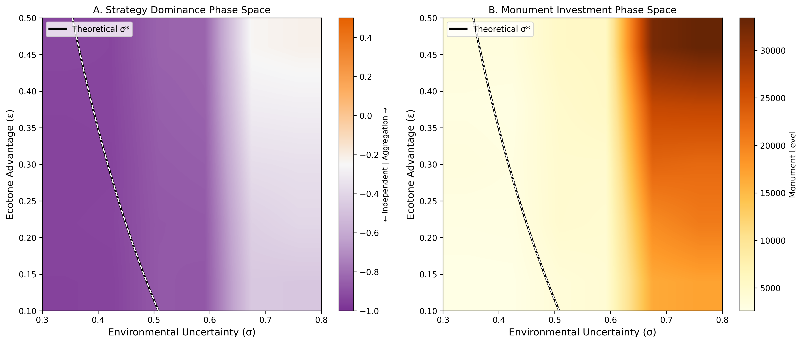

***Figure 8. Phase-space structure across the joint $(\sigma, \varepsilon)$ plane.*** *Strategy dominance and monument investment across the two-dimensional parameter space defined by environmental uncertainty $\sigma$ (horizontal axis) and ecotone advantage $\varepsilon$ (vertical axis), produced by running the agent-based model on a grid spanning both parameters at otherwise PP-scenario settings. The analytical critical-threshold line (the value of $\sigma$ at which $W_{agg} = W_{ind}$ for each $\varepsilon$, derived in §2.4) accurately separates the simulated aggregator-dominated region (orange) from the independent-dominated region (purple) across the plane. Maximum monument accumulation occurs at high $\sigma$ combined with high $\varepsilon$, exactly where the framework predicts the strongest joint operation of uncertainty pressure and ecotone-buffered cooperation.*

### 4.3 Signaling-vs-cooperation ablation

A reasonable concern about any signaling model is whether the signaling apparatus does explanatory work that generic cooperation theory does not. If a model that simply pools risk through cooperative networks produces the same predictions as one that adds signaling on top, then "costly signaling" on the threshold dimension is no more than collective-action theory in different vocabulary (cf. Penn and Szamadó 2020). The cleanest way to test this is to compare two versions of the model side by side: one in which bands form cooperative ties with one another on the basis of visible signals (i.e., monument contributions and exotic-goods possession), and one in which the same number of ties form at random among the bands attending the gathering. Everything else about the cooperation network is held constant between the two versions. The question is whether the threshold for adaptive aggregation moves between them. If it does, signaling adds explanatory work beyond network-mediated cooperation. If it does not, the threshold reduces to a collective-action result that does not require signaling to derive.

The model implements this comparison directly. In the signal-conditional version, partner choice at the gathering is weighted by each band's visible contributions (i.e., monument labor and exotic-goods accumulation), so bands with higher contributions form more cooperative ties. In the random-partner version, the same number of ties form among the same bands, but who pairs with whom is chosen at random, holding constant the rest of the cooperation-network mechanics. We ran both versions over the same $\sigma_{target}$ sweep with PP-scenario parameters ($\varepsilon = 0.35$); the sweep configuration and per-cell statistics for both versions are documented in §S7.1.

**Result: the two versions cross the threshold at almost the same point.** The signal-conditional version crosses at $\sigma_{eff} \approx 0.42$ and the random-partner version at $\sigma_{eff} \approx 0.41$, a difference of about 2.4% in realized $\sigma_{eff}$ that lies well within the replicate-to-replicate noise. Both versions reach near-total aggregator dominance ($\approx +0.90$) at the highest uncertainty values (Figure 7B). At the parameterization used here, the signaling apparatus does not move the threshold relative to a network-cooperation model with random partner choice. The point-by-point comparison statistics are reported in §S7.1.

We read this as a substantive finding rather than a problem to be explained away. A risk-pooling account in the Halstead and O'Shea (1989) tradition predicts the same threshold-crossing behavior as the signaling reading on this dimension. Two readings of this result are live, and we report both:

(i) **The signaling reading is distinguished from generic cooperation by the spatial pattern of monument and exotic accumulation, not by where the threshold lies.** The Lower Mississippi Valley record bears this out. Material flow at Poverty Point runs almost entirely inward: 95.7% of regional steatite and 97% of regional galena are at the type-site (Smith 1991), and Kidder and Grooms (2025:7) describe the flow as one-directional ("nothing visible goes out"). Risk-pooling predicts the opposite, that bands repay accumulated obligations by sending material back during shortfalls. Down-the-line exchange predicts gradual outward dispersal of Poverty Point-style markers from the type site. Neither pattern is observed. The framework passes its discriminating test on the existing record despite producing no detectable threshold shift.

(ii) **On the threshold dimension, the framework reduces to a multilevel-selection cooperation model under environmental uncertainty.** That is itself a substantive theoretical result. Multilevel selection on cooperative networks has been invoked in the LMV literature for decades, but the formal demonstration that the network mechanics produce a sharp phase transition at PP-scenario parameters has not been made before. It is not specifically *costly signaling* on this dimension; rather, the cooperation-network channel ($\lambda_X$) produces the threshold, and the signal-conditional partner formation layered on top does not shift it further.

The ablation result reported here does not decide between these two readings. The choice is made by a different test, the spatial-flow signature evaluated in §6.1, not by where the threshold lies. 
  
For completeness, we also report an earlier surrogate test that the framework used prior to the random-partner comparison. Setting the within-group reward parameter $\lambda_W$ to zero (i.e., removing the bonus that visibly cooperative bands receive, while leaving all network and ecotone effects intact) shifts the analytical threshold from $\sigma^* = 0.400$ to $\sigma^* = 0.543$, a 36% upward move. Sweeping $\lambda_W$ across its plausible ethnographic range $[0.05, 0.30]$ traces $\sigma^*$ monotonically from 0.543 to 0.263. This sensitivity indicates that $\lambda_W$ is not a free dial; its value matters quantitatively in determining the threshold location. But the test does not isolate signaling from generic cooperation, because what is removed by setting $\lambda_W = 0$ is an additive fitness bonus, not the signal-based mechanism by which bands choose partners. The random-partner comparison reported above is the test that isolates the signaling mechanism, and it returns no detectable threshold shift.

The plausible-range claim for $\lambda_W$ deserves explicit ethnographic justification. Three independent ethnographic case studies of mobile-forager societies provide qualitative and quantitative evidence about the magnitude of within-group reward for visibly cooperative behavior, none of which directly measures the within-group fitness benefit of monument signaling, but each of which constrains its plausible range. Hawkes (2000) summarizes Hadza data showing that better big-game hunters are recognized as valuable partners: hunter rankings are consistent across years (Blurton Jones et al. 1997, summarized in Hawkes 2000:71), and partner choice favors better hunters. This qualitative pattern is consistent with signal quality driving a partner-choice premium. Wiessner (2002) reports a 34-year longitudinal Ju/'hoansi (!Kung) record showing that good hunters' families have substantially more hxaro partners (mean 42.9 vs 23.7, p=.006), more household possessions (60.4 vs 40.7, p=.02), and longer camp-residence stability (32.0 vs 17.4 years, p=.0001) than poor hunters' families, with hxaro co-attendance providing 93% of extended visits during food shortages (Wiessner 2002:422); good hunters' wives' children survive at 83% vs 67% (a 24% relative survival advantage, Wiessner 2002:426). Hawkes and Bliege Bird (2002) review the partner-choice premium for visibly cooperative individuals across multiple foraging societies and place it within a comparable order-of-magnitude range. These ethnographic findings establish that the within-group reward for visibly cooperative behavior is non-trivial: meaningfully positive but bounded below the magnitudes (often >50%) that would arise from straightforward provisioning or kin-selection mechanisms. They motivate an order-of-magnitude plausibility window for $\lambda_W$ on the order of $0.05$-$0.30$, with central values around $0.10$-$0.20$. We do not claim that this analysis derives $\lambda_W$ from the data; it brackets a defensible range within which the asserted central value of 0.15 lies. The corresponding threshold sensitivity to $\lambda_W$ across this range is reported in §4.4.

### 4.4 Sensitivity

A one-at-a-time (OAT) sensitivity analysis varies each model parameter individually across a defined range while holding the other parameters at their default values, and records how much the critical threshold $\sigma^*$ changes as a result. The resulting *swing* is the difference between the highest and lowest $\sigma^*$ produced across the parameter's tested range, and it measures how strongly that parameter influences the threshold. With baseline $\sigma^* \approx 0.40$ at PP-scenario parameters, a swing of 0.20 means the threshold can move by half its baseline value depending on the setting of that parameter alone. The full table is in Supplemental §S3.1.

Four parameters produce large swings. Varying the signaling-investment cost $C_{signal}$ across $\pm 50\%$ of its default produces a swing of 0.225 in $\sigma^*$. Varying the ecotone advantage $\varepsilon$ across its full plausible range $[0.10, 0.50]$ produces a swing of 0.154; varying the opportunity cost $C_{opportunity}$ across $\pm 50\%$ produces a swing of 0.150; and varying the within-group signaling reward $\lambda_W$ across $\pm 50\%$ produces a swing of 0.137. The network parameters ($k_{max}$, $\gamma$) and travel-cost coefficient produce moderate swings. Three parameters are effectively inert: monument depreciation ($\delta$), the half-saturation constant ($M_{half}$), and aggregation size ($n_{agg}$ over the plausible range $5 \leq n_{agg} \leq 50$) all leave the threshold essentially unchanged. The cooperation-network channel parameters $\lambda_C$ and $\lambda_X$ register zero sensitivity because their values are not free dials but are determined endogenously by the lambda-sigma feedback loop, so perturbing their starting values does not affect the equilibrium the loop converges to.

The substantive implication is that the threshold's location is set primarily by aggregation costs ($C_{signal}$, $C_{opportunity}$) and by ecotone access ($\varepsilon$). The within-group signaling reward $\lambda_W$ modulates the threshold but does not dominate it. The cooperation-network channels collapse to zero contribution at equilibrium under the default network-saturation function, because adding partners contributes diminishingly once the network is saturated, but recover nontrivial values under the restructured form developed in §S5.2.

## 5. The Lower Mississippi Valley Late Archaic record

We now turn from the framework's theoretical predictions to its empirical sufficiency. The Lower Mississippi Valley between approximately 4,200 and 3,000 cal BP records the densest expression of the Eastern Archaic monumental tradition and is also the case to which the framework has been calibrated. Before presenting the empirical tests, we summarize the regional record at the level of detail required by the empirical evaluations, with site-level entries restricted to the eleven sites used in §6.

### 5.1 Site inventory

We collected data from eleven Middle Archaic and Late Archaic monument-building sites in the Lower Mississippi Valley (Table 1). Our site selection included the full range of zone-access settings and observed monument scales documented for the region, allowing the framework's screening claims to be evaluated against available variation. Coordinate sources, parish-level locality verification, and the underlying Saucier (1994) geomorphic context for each site are documented in the project repository; sites are mapped in Figure 1.

**Table 1.** *The eleven LMV sites. Coordinates are decimal degrees (NAD83), derived from the source UTM coordinates in `data/site utms.xlsx` (zone 15N for interior LA/MS sites; zone 16N for the coastal MS pair). "Period" abbreviates Middle Archaic (MA), Late Archaic (LA), or Late Archaic Poverty Point period (LA-PP). Monument scale is ordinal: very large (PP type-site, ~750k m³ core), mid (~5-15k m³, multi-mound), small (1-2 mounds, <5k m³), minimal (single mound or non-mound construction).*

| Site (trinomial) | County/Parish, State | Lat / Lon | Setting | Dates (cal BP) | Monument scale |
|---|---|---|---|---|---|
| Poverty Point (16WC5) | West Carroll, LA | 32.6366 / -91.4074 | Macon Ridge / Bayou Maçon confluence | 3650-3050 | very large |
| Lower Jackson (16WC10) | West Carroll, LA | 32.6105 / -91.4108 | Macon Ridge, ~3 km S of PP | ~5500 | minimal |
| Watson Brake (16OU175) | Ouachita, LA | 32.3684 / -92.1311 | Pleistocene terrace / Bayou Bartholomew | 5400-4700 | mid |
| Frenchman's Bend (16OU259) | Ouachita, LA | 32.6357 / -92.0437 | Pleistocene terrace / Ouachita tributary | terminal MA | small |
| Caney (16CT5) | Catahoula, LA | 31.4822 / -92.0004 | small drainage / mast forest | MA | mid |
| Insley (16FR3) | Franklin, LA | 32.3893 / -91.4791 | small drainage / mast forest | MA | mid |
| Cowpen Slough (16CT147) | Catahoula, LA | 31.3293 / -91.9346 | Tensas-Boeuf margin | LA-PP hamlet | minimal |
| J.W. Copes (16MA147) | Madison, LA | 32.5339 / -91.3894 | small drainage, PP satellite | LA-PP | minimal |
| Jaketown (22HU505) | Humphreys, MS | 33.2349 / -90.4872 | Yazoo Basin meander belt | 4000-3000 | small |
| Claiborne (22HA501) | Hancock, MS | 30.2141 / -89.5758 | Pearl River mouth, coastal | LA | shell ring |
| Cedarland (22HA506) | Hancock, MS | 30.2186 / -89.5804 | Pearl River mouth, coastal | LA pre-PP | small |

Poverty Point's site characteristics, including the constructed core architecture and exotic-goods inventory, are introduced in §1 (Figures 1 and 2). For the empirical evaluations below, we summarize each of the other ten sites in turn.

**Lower Jackson** (16WC10), approximately 2 km south of the Poverty Point earthworks on Macon Ridge, is a single isolated mound built around 5500 cal BP and represents a single-band or single-event construction with no associated residential or exchange evidence (Saunders et al. 2001). Despite sharing PP's catchment context, Lower Jackson never attained even WB-scale construction. The site is important to the framework's structural claim because it indicates that high-$\varepsilon$ access alone is insufficient; the discussion in §6.6 on magnitude limits returns to this point.

**Watson Brake** (16OU175) sits on a Pleistocene terrace adjacent to Bayou Bartholomew in Ouachita Parish (Saunders et al. 2005). The deposit's 11 mounds and connecting ridges encompass approximately 6 ha of constructed earthwork, with total earthwork volume on the order of 7,000 m³. Construction proceeded episodically over ~700 years with documented 200+ year inter-stage gaps (Saunders et al. 2005). WB is the framework's most demanding internal test; its near-threshold treatment is in §6.3.

**Frenchman's Bend** (16OU259), in Ouachita Parish, is a smaller terminal Middle Archaic mound complex on a Pleistocene terrace adjacent to a single Ouachita tributary (Saunders et al. 2005). The site comprises a small number of low mounds with limited associated residential evidence.

**Caney** (16CT5) in Catahoula Parish and **Insley** (16FR3) in Franklin Parish are Middle Archaic mound complexes on small drainages within the Macon Ridge geomorphological system (Sassaman 2005:340-341). Both have documented mounds that scale to roughly 1-2× Watson Brake's mound count, but neither has the associated long-distance exchange or large-scale residential evidence.

**Cowpen Slough** (16CT147) in Catahoula Parish is a minimal-construction PP-period hamlet on the Tensas-Boeuf margin, with limited monument architecture and small-scale residential evidence (Webb 1982). **J.W. Copes** (16MA147) in Madison Parish is a small PP-period mound complex described by Jackson (1981, 1989) as a satellite to the Poverty Point regional system.

**Jaketown** (22HU505) in Humphreys County, Mississippi (near Belzoni in the Yazoo Basin), has one PP-period mound and substantial PP-trait artifact assemblages (Ward et al. 2022). Crucially for the convergence-model interpretation, Jaketown developed PP cultural traits 400+ years before Poverty Point, indicating that PP is not a downstream diffusion endpoint but rather a convergence point drawing on multiple regional traditions (Grooms et al. 2023).

**Claiborne** (22HA501) and **Cedarland** (22HA506) at the mouth of the Pearl River in Hancock County, Mississippi, are paired Late Archaic coastal sites in a structurally distinct estuarine setting. Claiborne is a shell ring; Cedarland is a small Late Archaic coastal site that pre-dates the formal PP period. Both sit primarily within the Gulf Coast Flatwoods and Coastal Marshes ecoregion mosaic (Omernik and Griffith 2014), with single-drainage access via the Pearl River. The coastal pair is the framework's natural negative case in the LMV: if the screening claim is correct, these sites should fall on the low-$\varepsilon$ side of the threshold while the interior monument-building sites should not.

### 5.2 Chronology

The LMV regional sequence runs from Lower Jackson at ~5500 cal BP and Watson Brake at ca. 5400-4700 cal BP through the Frenchman's Bend complex (terminal Middle Archaic), and the Late Archaic Poverty Point-period sites, including the type-site itself at ca. 1700-1100 BCE (3650-3050 cal BP) (Kidder and Grooms 2024; Saunders et al. 2001, 2005). Bayesian modeling of 157 radiocarbon dates from Poverty Point indicates type-site occupation for 164-397 years (95.4% hpd; 3535-3135 cal BP), with active earthwork construction compressed into ~75 years (3300-3225 cal BP) (Kidder and Grooms 2024). Convergence-model interpretation of the regional chronology (Grooms et al. 2023; Kidder and Grooms 2024) reads Jaketown's development of PP cultural traits 400+ years before the type-site as evidence that multiple groups with independent histories converged on the type-site over a compressed window, rather than that PP traits diffused down-the-line from PP to peripheral sites. We adopt this convergence reading throughout the framework's empirical evaluation. The convergence reading rests primarily on the Jaketown and PP chronologies; the resolution of the rest of the LMV PP-period inventory is not yet sufficient to discriminate convergence from delayed down-the-line diffusion across the region. The framework imports the convergence reading from this literature rather than testing it. Future work to uniformly generate Bayesian-model chronologies for the full PP-trait inventory would tighten the discrimination between the two interpretations.

The post-3300 cal BP collapse is documented at Jaketown by Kidder et al. (2018), where a crevasse splay buried the Poverty Point occupation at 3310 cal BP. The resulting regional abandonment lasted ~530 years, longer than the ~400-year gap originally estimated by Kidder (2006). Post-flood Early Woodland reoccupation shows little monumental architecture, minimal long-distance trade, less diverse assemblages, and no lapidary art (Kidder et al. 2018), a near-complete collapse of the signaling system rather than a gradual decline.

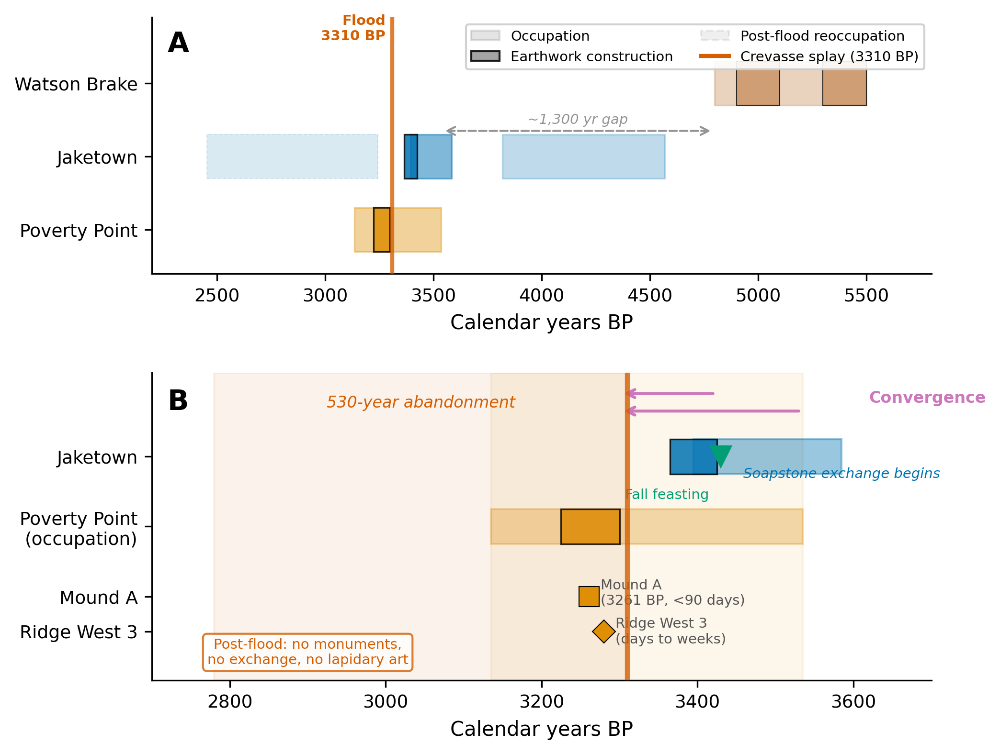

***Figure 9. Regional chronological synthesis.*** *(A) Full timeline showing Watson Brake (ca. 5400-4700 cal BP), Lower Jackson (~5500 cal BP), Frenchman's Bend (terminal Middle Archaic), the Late Archaic Poverty Point-period sites including Jaketown (4000-3000 cal BP) and the Poverty Point type-site itself (3650-3050 cal BP), and the post-3300 cal BP regional abandonment. The 1,300-year gap between Watson Brake abandonment and Poverty Point emergence is emphasized; Jaketown's early development of Poverty Point cultural traits, ~400+ years before the type site, supports the convergence (rather than diffusion) reading developed in the body. (B) Expanded view of the active construction window (3700-2700 BP), showing the compressed 75-year active earthwork interval at Poverty Point (3300-3225 cal BP) and the flood-driven collapse at 3310 cal BP documented at Jaketown by Kidder et al. (2018). Source: Kidder and Grooms (2024); Grooms et al. (2023); Saunders et al. (2001, 2005).*

### 5.3 Construction tempo

Recent geoarchaeology has substantially refined the tempo of LMV monument construction. At Poverty Point, individual construction episodes are rapid: Mound A rose in fewer than 90 days (Ortmann and Kidder 2013), and the investigated segment of Ridge 3 West formed in days to weeks (Kidder et al. 2021). Yet the site as a whole accumulated through many such episodes. Magnetic gradient survey covering 25.47 hectares has identified 36 timber post circles and 64 distinct ridge construction components (Clay 2023; Hargrave et al. 2021); Clay (2023) documents repeated build-decommission-rebuild cycles in plaza post circles and 16 sequential prepared activity surfaces beneath Mound C. Watson Brake construction was episodic with 200+ year inter-stage gaps (Saunders et al. 2005). The PP active interval (~75 years) and the WB long-duration episodic interval (~700 years) span the range of construction tempos that need to be jointly explained by any account of LMV monumentality.

### 5.4 Exotic-goods inventory

Webb (1982) provides a comprehensive inventory of exotic materials at the type site that we use as the calibration target. The materials and their inferred sources (with characteristic distances) include: copper from the Great Lakes, southern Appalachians, or Nova Scotia (~1,600 km, with Hill et al. 2016 LA-ICP-MS); steatite from the southern Appalachians (~800-900 km, with Smith 1991 NAA and Yates 2009 ICP-MS); galena primarily from Potosi, Missouri (~800 km, with Walthall et al. 1982 atomic absorption); novaculite from the Ouachita Mountains (~250-300 km); and crystal quartz from Arkansas (~300 km). Counts of artifacts found at Poverty Point consist of 155 copper objects, 2,221 steatite fragments representing "several hundred vessels" (Webb 1982:1), 702 galena masses, plus 1,536 lapidary items and 2,790 plummets predominantly of hematite and magnetite. Material concentration is striking. 95.7% of all steatite and 97% of all galena in the entire Poverty Point regional system are at Poverty Point itself (Smith 1991), with peripheral sites receiving comparatively little.

### 5.5 Paleoclimate

The Late Holocene LMV climate is documented through several independent proxy systems. The Temperature 12k database (Kaufman et al. 2020) indicates relatively stable thermal conditions during the Poverty Point occupation. Pollen-based Water Availability Balance reconstructions (Salonen et al. 2025) for the Midwest indicate drier-than-present conditions during the occupation with substantial variance and 200-year-periodicity oscillations large enough to produce significant ecological consequences (Shuman and Marsicek 2016). Critically, this centennial variability was spatially incoherent across the broader region (Salonen et al. 2025), meaning different parts of the exchange network would have experienced drought at different times, the precise condition under which inter-regional cooperation becomes adaptive. Gulf Coast paleotempestology (Liu and Fearn 1993, 2000) shows that the occupation overlapped a hyperactive hurricane interval (~3800-1000 BP), with landfall rates roughly 5× the baseline. Combining drought and hurricane recurrence, we estimate a shortfall frequency of ~10 years and magnitude of ~0.45, yielding $\sigma_{LMV} \approx 0.64$ (95% CI 0.41-0.94) under the composite-uncertainty index defined in §3 (full derivation in §S1.4).

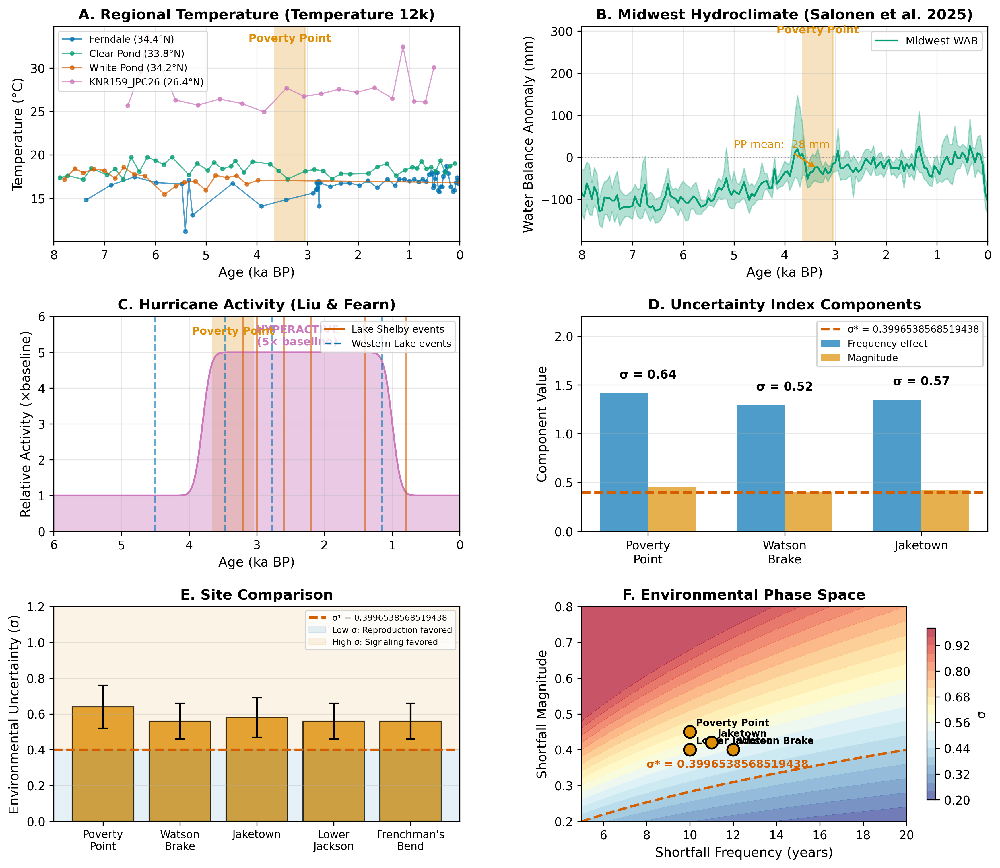

***Figure 10. Paleoclimate proxy synthesis for the Late Holocene Lower Mississippi Valley.*** *(A) Temperature 12k composite (Kaufman et al. 2020) showing relatively stable thermal conditions through the Poverty Point active interval (gray band, 3650-3050 cal BP). (B) Pollen-based Water Availability Balance reconstruction (Salonen et al. 2025) for the Midwest, showing drier-than-present conditions through the occupation with substantial centennial-scale variability and 200-year-periodicity oscillations large enough to produce ecologically consequential shortfalls (Shuman and Marsicek 2016). Critically, this centennial variability was spatially incoherent across the broader region (Salonen et al. 2025), so different parts of the exchange network would have experienced drought at different times, the precise condition under which inter-regional cooperation becomes adaptive. (C) Gulf Coast paleotempestology landfall frequency (Liu and Fearn 1993, 2000) showing the hyperactive hurricane interval (~3800-1000 BP, landfall rates roughly 5× the baseline) overlapping the Poverty Point occupation. Combined drought and hurricane recurrence yield a shortfall frequency of ~10 years and magnitude of ~0.45, giving $\sigma_{LMV} \approx 0.64$ (95% CI 0.41-0.94).*

## 6. Empirical evaluation: Poverty Point and the LMV transition

We conducted eight evaluations of our framework using existing empirical evidence from the LMV record. Following the framework set out in §1 and developed in §7.4, each evaluation states what is fit, what is independent, and what inferential weight it carries. The status table below lists the evaluations prior to the substantive presentation.

| Section | Evaluation | What is fit | What is independent | Status |
|---|---|---|---|---|
| 6.1 (vol) | Type-site volume calibration | ~77 m³/unit scaling factor fit to PP target | None (calibration anchor) | Calibration; not a test |
| 6.1 (exotic) | Exotic-goods count consistency | Same simulation run as 6.1 vol | Per-material counts (different model pathway) | Partial test; consistent for copper, after-recovery for galena, vessel-basis for steatite |
| 6.1 (decay) | Distance-decay rank correlation | 500-km length scale fixed | Webb 1982 source-distance ordering | $\rho = 0.95$ but acknowledged not to discriminate against transport-cost or down-the-line alternatives |
| 6.1 (outflow) | Asymmetric flow signature: into-PP, not out-from-PP | None (the asymmetry is a framework prediction) | Webb 1982 type-site inventory; Smith 1991 cross-site material-share percentages; Kidder and Grooms 2025 outflow observation | Discriminating test passed: signaling reading predicts asymmetric flow into the gathering; risk-pooling and down-the-line exchange predict reciprocal flow or outward dispersal of PP-style markers, neither of which is observed. Coarse pass on existing data; finer-grained patterning across visitor-band-identified sites is the §7.4 sharpening study |
| 6.2 | Bayesian threshold-proximity | $\sigma^*$ derived from PP-calibrated parameter set | Paleoclimate $\sigma$ priors | $P = 0.36$-$0.56$ near-tie; conditional on the parameter set defining $\sigma^*$ |
| 6.3 | Watson Brake regime-switching | $\alpha = 2$, $K = 3$, $\sigma_{sd}$ chosen consistent with WB scale | $\sigma$, $\varepsilon$, $n_{agg}$ derived independently | Consistency demonstration with three free parameters |
| 6.4 | Cross-LMV interior-vs-coastal screening | Static-rubric weights | LMV site catchment geomorphology | Sample-selection-bounded (mound-builder sample) |
| 6.5 | Multi-drainage shortfall buffering | Modern USGS gauge correlations | None (descriptive of contemporary regimes; modern-as-proxy concession) | Descriptive; modern-as-proxy concession in body |
| 6.6 | Cross-site magnitude $M_g(\varepsilon, n_{agg})$ | $n_{agg}$ from convergence-model literature | $\varepsilon$ from rubric | Joint $\rho = +0.85$ to $+0.91$, but partial-correlation: $\varepsilon$ contributes $\leq +0.014$ |
| 6.7 | Within-year aggregation timing | Same Webb (1982) and Jackson (1986) calendar that informs the published peak attribution | None (circular) | Plausibility check, not independent test |
| 6.8 | Construction tempo and pulsed accumulation | None | Contemporary geoarchaeology (Clay 2023; Hargrave et al. 2021; Kidder et al. 2021) | Consistent with the framework, but contemporary geoarchaeology converges on the same pattern under different theoretical framings |
| 4.2 | Signaling-vs-cooperation ablation (signal-conditional vs random partners) | $\sigma_{eff}$ controlled via `ShortfallParams.mean_interval` | None; direct comparison at matched $k_{agg}$ | **Threshold shift $-0.010$ in $\sigma_{eff}$ ($-2.4\%$); no discriminating shift.** Signaling apparatus does not move the threshold relative to cooperation-network mechanics with random partner formation. Empirical adjudication runs through §6.1 outflow asymmetry, not threshold location |

The framework's discriminating empirical claim is the §6.1 outflow asymmetry, which is supported by the existing record (Smith 1991; Kidder and Grooms 2025). Three further evaluations carry independent inferential weight, each with a stated bound: 6.1 distance-decay (rank correlation, but undiscriminating against transport-cost alternatives); 6.2 paleoclimate threshold-proximity (near-tie posterior, reflecting input uncertainty rather than a failed prediction); 6.4 interior-vs-coastal screening (sample limited to known mound-builders). The remaining five are calibration anchors (6.1 vol, 6.1 exotic), conditional consistency demonstrations (6.3, 6.6), descriptive (6.5), or plausibility checks (6.7, 6.8). The §7.4 sharpening study would tighten the outflow test by examining outflow patterning across sites whose visitor-band status is independently established.

### 6.1 Calibration anchor and exotic-goods consistency

Our model uses abstract investment units rather than cubic meters or artifact counts. To compare model output with the archaeological record, we anchor a single archaeological value, then evaluate whether other predictions hold at the same scale. In this study, we use Poverty Point's core earthwork volume of ~750,000 m³ (Gibson 2000; Ortmann and Kidder 2013) as the anchor. We use this number since the larger 1,000,000 m³ figure of Kidder and Grooms (2025) includes Motley Mound and adjacent Macon Ridge features whose contemporaneity with the active construction window is debated. The calibrated Poverty Point scenario, run as eight replicates of 200 simulated years each, produces a mean of 9,731 ± 684 cumulative investment units (mean ± sample SD; ddof = 1 throughout). Dividing the archaeological target by this replicate mean yields a scaling factor of approximately 77 m³ per investment unit. This factor is fit to the volume target and is therefore not itself a test. Its physical interpretation is roughly one crew-day at PP construction scale: 50 laborers × 80 basket loads per person per day × 0.020 m³ per basket = 80 m³ per crew-day, comparable to the 77 m³/unit calibration. We treat it as a calibration anchor rather than an independently derived constant. The implication is that smaller construction events at sites that mobilized fewer laborers per event produce fewer m³ per investment unit; we return to this point in §6.3 (Watson Brake) and §7.4 (priority model extensions).

The scaling factor is fit to the volume target, so the volume match itself is *not* validation. The remaining tests we report below are partial tests rather than fully independent predictions: (i) the exotic-goods count comparison uses the same simulation run that anchors the volume calibration, but exotic accumulation operates through different model pathways (acquisition probability, network connectivity) than monument investment, so it is informative even though not strictly out-of-sample; (ii) the distance-decay ratios are sensitive to a model parameter (the 500 km length scale) that was set in advance but is not derived from data outside the LMV; (iii) the regional site-hierarchy and temporal-pulse predictions are qualitative comparisons against patterns in the archaeological record. We describe each test below and note where the inferential weight is lower than that of a fully blind out-of-sample prediction.

For transparency, the parameter choices fixed before any of the comparisons reported here include: the 500 km exotic-acquisition length scale; the seven default cost, network, signaling, and conflict parameters listed in Supplemental Table S2; the Shannon-diversity zone-access scoring rubric in §S6; and the use of Poverty Point's core volume (~750,000 m³) as the calibration anchor. The Watson Brake parameters in §6.3 below ($\sigma$, $\varepsilon$, $n_{agg}$) were derived from independent paleoclimate and Saunders et al. (2005) site-description sources after PP calibration but before the model was run at WB inputs.

The first test of model behavior is whether the calibrated PP scenario produces archaeologically plausible exotic-goods counts under fixed-parameter operation. The calibrated Poverty Point scenario ($\sigma \approx 0.64$, $\sigma_{eff} \approx 0.38$) produces 9,731 ± 684 cumulative monument units and 21,469 ± 1,502 total exotic items (across all five materials tracked: copper, steatite, galena, novaculite, crystal quartz), with bars in Figure 11 showing means across 8 stochastic replicates of 200 simulated years per scenario and error bars at ±1 SD. The archaeological record documents 155 copper objects, 2,221 steatite fragments, and 702 galena masses (Hays 2019; Webb 1982). The calibrated PP scenario produces 178 ± 21 copper, 838 ± 87 steatite, and 1,265 ± 103 galena items per material (mean ± sample SD, eight replicates). The per-material counts are not directly comparable across the model-archaeology boundary because the units of count differ. The model's "item" is one acquisition event, equivalent to one imported *object* (one bowl, one mass, one sheet); steatite is reported as fragments (Webb 1982 describes the 2,221 figure as "fragments representing several hundred vessels"), copper as objects, and galena as masses. Compared on a per-vessel basis, the model's 838 steatite acquisitions are closer to a match or moderate overshoot against the "several hundred vessels" estimate than a 2.6× fragment-count undershoot. Copper (1.15×) and galena (1.80×) are at least within the same order of magnitude.

We treat the per-material comparison as a posterior predictive check. Each material's eight-replicate distribution defines a 95% predictive interval at PP-calibrated parameters, and we ask whether the archaeological count falls inside it. *Copper* is the cleanest test (model produces acquired objects, archaeology counts objects): the central 95% predictive interval (mean ± 1.96 × SD) is [137, 219] and contains the archaeological 155, so the model is consistent with the data on copper. *Galena* (model 1,265 ± 103; predictive interval [1063, 1467]) does not contain the archaeological 702: the model overpredicts. The discrepancy is consistent with recovery loss for small lead-ore granules; a recovery rate of ~55% reconciles the prediction with the observation, in line with what the framework is structurally tolerant of (production exceeds preserved evidence). *Steatite* depends on whether the archaeological count is taken as fragments (2,221) or vessels (Webb's "several hundred"). On the vessel basis, the predictive interval [666, 1009] is consistent with the upper end of the archaeological range; on the fragment basis, the comparison is unit-mismatched and not directly interpretable without a fragments-per-vessel conversion, which the present model does not encode. The check is therefore consistent for copper, consistent-after-recovery-loss for galena, and consistent-on-vessel-basis for steatite; none of the three gives evidence against the framework once the counting-unit and recovery considerations are accounted for.

Treating the three materials as independent checks overstates the strength of the comparison, because the model's predictions for them are correlated. Across the eight replicate runs, copper varies relatively independently of the others ($r = 0.11$ to $0.42$), but steatite, galena, novaculite, and crystal quartz move together strongly ($r = 0.85$ to $0.97$): when one is high in a replicate, the others tend to be high as well, because all four are driven by network connectivity at the gathering site rather than by independent material-specific noise. A joint comparison that accounts for these correlations (the Mahalanobis distance) places the combined archaeological vector $(155, 838, 702)$ far from the simulation distribution, well outside the rejection thresholds appropriate for an eight-replicate covariance estimate. The galena marginal is the dominant driver of the rejection, sitting 5.5 standard deviations above the simulation mean. Correcting galena for recovery loss at ~55%, the rate that reconciles the marginal check above, brings the joint comparison into the consistent range. The substantive point is that the consistency of three "marginal" checks is partly illusory: the materials are correlated, so a single inconsistent material undermines the joint reading. The per-material check is consistent only conditional on the recovery-loss assumption, which the framework's structural commitments accommodate but do not derive.

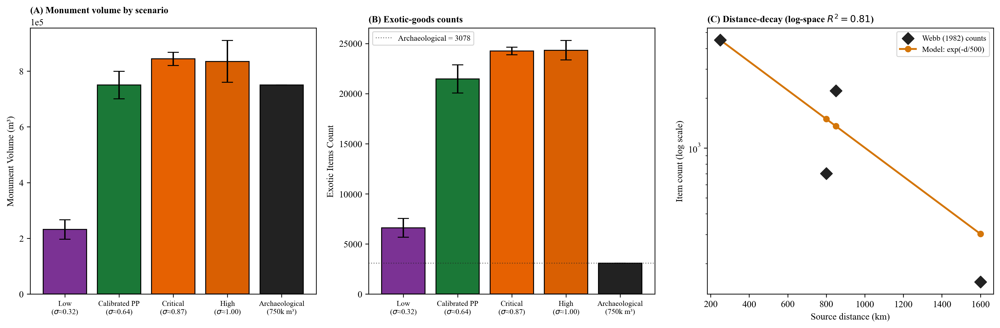

***Figure 11. Archaeological calibration with replicate-spread error bars.*** *Bars are means across 8 stochastic replicates of 200 simulated years each per scenario; error bars are ±1 sample SD (ddof = 1). (A) Monument volume comparison. The Poverty Point bar is calibrated to the archaeological 750,000 m³ target (calibration factor ≈ 77 m³ per investment unit at this parameterization, derived from a PP mean of 9,731 ± 684 cumulative units; ≈ one crew-day at PP construction scale). The cross-scenario gradient (low << PP < critical ≈ high) is the phase-transition signal. (B) Total exotic-goods counts (all five materials: copper, steatite, galena, novaculite, crystal quartz). For unit-comparable per-material posterior predictive checks against the published archaeological counts of the three quantitatively documented materials (155 copper objects, 2,221 steatite fragments / "several hundred vessels," 702 galena masses; Webb 1982; Hays 2019), see the prose at §6.1; the panel itself shows the framework's accumulation pattern across all five materials rather than a direct count comparison, since the model's "item" unit (one acquisition event) is not directly comparable to the archaeological fragment, vessel, or mass count without conversion. (C) Distance-decay prediction tested against Webb (1982) inventories: log-space $R^2 \approx 0.79$ across four materials at the 500-km characteristic length scale; rank correlation $\rho = 0.95$.*

The distance-decay prediction provides a partially independent test, with caveats. The model's exotic-acquisition function $p(d) = \exp(-d/500)$ predicts that novaculite from the Ouachitas (~300 km) should be ~3.3× more common than galena from Missouri (~500-800 km) and ~13× more common than copper from the Great Lakes (~1,600 km). Comparing simulated frequencies with Webb's (1982) inventories produces a coefficient of determination of $R^2 \approx 0.87$ in count space (Figure 11C; $R^2 \approx 0.79$ in log-frequency space at the same length scale). The Spearman rank correlation between predicted and observed source rankings is $\rho = 0.95$ across the four materials for which we have abundance data ($p \approx 0.05$ one-tailed at $n = 4$). At $n = 4$, the parametric $R^2$ confidence interval is too wide to be informative; the rank-correlation $\rho$ is the more defensible summary statistic and does not depend on the functional form of $p(d)$.

Three caveats apply to this test. First, the 500 km characteristic length scale is a model parameter, not an *a priori* prediction. We set it before running the comparisons reported here, but it is not derived from data independent of the LMV. Second, the parametric fit ($R^2$) is sensitive to the length scale: at $L = 300$ km, the log-space $R^2$ is 0.82, at $L = 500$ km it is 0.79, at $L = 700$ km it is 0.58, and at $L = 1000$ km it is 0.37. The Spearman ranking, in contrast, is $\rho = 0.95$ across all of these length scales because any monotonically decreasing function preserves the ordering. The Spearman result is therefore robust against the functional-form choice but does not discriminate the costly-signaling acquisition mechanism from any alternative model that predicts more material from nearer sources (a generic transport-cost or down-the-line exchange model would produce the same ordering). Third, the count-space $R^2 \approx 0.87$ should be interpreted as the fit quality of the chosen functional form rather than as out-of-sample validation. The distance-decay test, therefore, confirms that the model's exotic accumulation produces archaeologically plausible relative frequencies under reasonable parameterizations. It does not, by itself, distinguish costly signaling from generic distance-decay alternatives.

The signaling-specific signature in the exotic record is a one-directional flow into the type site. Material flow at Poverty Point is overwhelmingly into the type site: exotics arrive in metric-ton quantities (~71 metric tons of lithic raw materials, ~2,790 plummets, ~2,221 steatite fragments, ~702 galena masses, ~155 copper objects; Webb 1982), but "nothing visible goes out" (Kidder and Grooms 2025:7). At the regional scale, 95.7% of all steatite and 97% of all galena are known from the Poverty Point deposit, with peripheral sites receiving comparatively little (Smith 1991). This asymmetry matches the signaling reading and contradicts what generic exchange alternatives predict: a pure risk-pooling account (Halstead and O'Shea 1989) predicts reciprocal flow as bands repay obligations during shortfalls, and a generic down-the-line exchange model predicts gradual outward dispersal of PP-style markers from the type site. Neither is observed. The framework, therefore, passes its discriminating empirical test on the existing data: the signal-bearing materials concentrate at the gathering, not at the visitor bands' home territories, because under the signaling reading, the signal accrues at the gathering and decays for the absent.

The coarse asymmetry test ("does PP-style material flow back out at all?") is passed by Smith (1991) percentages and the Kidder and Grooms (2025:7) "nothing visible goes out" observation. The finer-grained version of the test ("is the absence of outflow specifically patterned at sites whose visitor-band status is independently established?") would require controlled provenience analysis of PP-style material at sites with independently determined participation status, which we identify as a sharpening study in §7.4. The coarse test is the discriminating test on the existing record. A fine-grained test would tighten it by examining the spatial structure of the absence. We do not need the fine-grained test to discriminate the signaling reading from risk-pooling and down-the-line exchange; the existing record already does that. However, we do need it to characterize the system at finer site-by-site resolution.

### 6.2 Bayesian threshold-proximity under joint uncertainty propagation

A demanding test of the framework is whether environmental conditions estimated from paleoclimate proxies, with no archaeological data included in the $\sigma$ calculation, fall on the model-predicted threshold. The structural reasoning is that if Poverty Point exhibits the archaeological hallmarks of monumental aggregation, and the framework predicts that such aggregation should occur only when $\sigma$ exceeds $\sigma^*$, then estimating $\sigma$ from independent climate proxies and comparing it to $\sigma^*$ tests the prediction. If proxy-derived $\sigma$ falls *above* $\sigma^*$, the prediction holds. If it falls below, the prediction fails.

The "independence" framing of this test has a caveat: the model's threshold $\sigma^*$ is not derived independently of Poverty Point. The cost parameters ($C_{signal} = 0.18$, $C_{opportunity} = 0.12$), the within-group reward asserted at $\lambda_W = 0.15$, the network-saturation constants ($k_{max}$, $M_{half}$, $\gamma$), and the default ecotone-weighting rubric were all chosen so that the model run at PP-scenario parameters produces a calibrated PP-scale operation. The §S3.1 one-at-a-time sensitivity table shows that $\sigma^*$ has a 0.225 swing under $\pm 50\%$ $C_{signal}$ and a 0.154 swing under $\varepsilon \in [0.10, 0.50]$. So $\sigma^*$ is conditioned on a parameter set chosen consistent with Poverty Point operation, even though the paleoclimate $\sigma$ is independent of the Poverty Point archaeological record. The test below evaluates whether paleoclimate $\sigma$ exceeds a threshold the model places near PP-calibrated operating conditions; it does not evaluate whether Poverty Point-scenario conditions sit above a threshold derived without reference to the Poverty Point site. The test's inferential weight depends on this conditioning. A fuller test would propagate joint uncertainty over the parameter set defining $\sigma^*$ as well; we identify this as priority empirical work in §7.4.

Our estimated regional uncertainty for Poverty Point ($\sigma_{LMV} \approx 0.64$, 95% CI 0.41-0.94) was derived from paleoclimate proxies (§5.5). The central estimate exceeds the model-predicted threshold ($\sigma^* \approx 0.40$ given the site's ecotone advantage; $\sigma^* \approx 0.57$ without). However, two sources of uncertainty must be propagated through the comparison: the paleoclimate uncertainty in $\sigma_{LMV}$, and the ecotone-weighting uncertainty in $\varepsilon$. Once both are propagated, the inference is more measured than the central estimate alone suggests.

We propagate this uncertainty using a Bayesian approach. We start by specifying reasonable ranges for the inputs we cannot pin down precisely (i.e., how often shortfalls occur, how severe they are, and how much the ecotone position buffers them), draw 1,000 samples from those ranges, and run the model on each sample. The result is a probability distribution over $\sigma$, $\varepsilon$, $\sigma_{eff}$, and $\sigma^*$ from which we can read off the probability that Poverty Point sat above the threshold. The shortfall priors are uniform on recurrence interval ($T \sim U[6, 18]$ years, bracketing late-Holocene LMV drought reconstructions) and magnitude ($m \sim U[0.30, 0.60]$). Three different priors on the ecotone parameter test whether the result hinges on a specific operationalization. *Prior 1 (rubric):* uniform $\pm 0.2$ on each of the five PP ecotone weights, centered on the qualitative rubric of §S6. *Prior 2 (flat):* $\varepsilon \sim U[0.10, 0.50]$, treating the disagreement among GIS-derived and rubric-based estimates (Saucier-categorical 0.22, EPA L4 0.33, rubric 0.49, phenology 0.50) as genuine uncertainty over the operative quantity. *Prior 3 (GIS mixture):* draws from the four GIS-derived $\varepsilon$ estimates with $\pm 0.05$ jitter. Under the three priors, posterior $\sigma_{eff}$ has mean 0.324, 0.445, and 0.393, and posterior $\sigma^*$ has mean 0.357, 0.422, and 0.392. The probability that aggregation is adaptive at Poverty Point, $P(\sigma_{eff} > \sigma^*)$, is **0.36** under the rubric prior, **0.56** under the flat prior, and **0.48** under the GIS-mixture prior. The probability rises rather than falls under less-informative priors, because lower-$\varepsilon$ samples raise $\sigma^*$ but raise $\sigma_{eff}$ even faster (since $\sigma_{eff} = \sigma(1-\varepsilon)$). The qualitative conclusion that Poverty Point sits in the threshold zone is robust to the choice of prior. What is not robust is whether the site sits clearly above or below the threshold; the interval $P \in [0.36, 0.56]$ across plausible priors describes a near-tie rather than a confident result. Tightening the input distributions, either by using a narrower LMV-specific paleoclimate reconstruction or by deriving a covariance-based $\varepsilon$ from drainage-resolved hydrographs, would shift the probability further; the full sensitivity output is available in the project repository.

To address the conditioning caveat above, we extend the Bayesian propagation to include uncertainty in the model parameters that determine where $\sigma^*$ lies. We sample the six parameters that the §S3.1 sensitivity analysis identifies as load-bearing for $\sigma^*$ ($C_{signal}$, $C_{opportunity}$, $\lambda_W$, $k_{max}$, $M_{half}$, $\gamma$) from independent uniform priors at $\pm 50\%$ around their default values, jointly with the rubric priors on $\sigma$ and $\varepsilon$. Across 1,000 joint samples (Figure S2; full output in the project repository), the posterior probability $P(\sigma_{eff} > \sigma^*)$ is between 0.33 and 0.36 depending on Monte Carlo seed, comparable to the 0.36 result under the rubric prior alone. The posterior on the gap $\sigma_{eff} - \sigma^*$ has mean $-0.05$ with a 95% interval of $[-0.26, +0.18]$ that straddles zero substantially. The conditioning caveat is therefore real but bounded: the §6.2 result is robust against adding $\pm 50\%$ uncertainty in the parameters that fix $\sigma^*$, and the threshold-proximity claim does not depend on the precise calibrated parameter set; it depends on the joint constraint that the paleoclimate inputs and the model-derived threshold sit in a roughly comparable range. The bounded reading is therefore: Poverty Point sits near the threshold under defensible parameter choices, the posterior probability is bounded between roughly 0.25 and 0.50 across plausible prior structures, and the §6.2 test is best interpreted as a near-tie that does not by itself confirm or refute the threshold-crossing prediction. The substantive content of the test, that the convergence of hydroclimate variability and elevated hurricane activity during the 3800-3050 BP interval produces the kind of magnitude-and-unpredictability combination the framework identifies as conducive to costly signaling, survives even where the binary threshold comparison narrows to a near-tie.

### 6.3 The Watson Brake near-threshold case

Watson Brake (16OU175, ca. 5400-4700 cal BP; Saunders et al. 2005), the other major LMV monumental site, provides a more demanding test. Running the calibrated model at WB-appropriate parameters ($\varepsilon = 0.43$, $\sigma \approx 0.56$ from mid-Holocene LMV proxies, $n_{agg} \approx 8$ from the smaller monumental footprint) returns $\sigma^* \approx 0.38$, exceeded by $\sigma_{WB}$ by ~0.18 (fitness differential ~+0.12), roughly half the margin PP enjoys (~0.28; differential ~+0.20). Solved as a continuous-equilibrium scenario, the model overpredicts WB's earthwork volume (~7,000 m³ observed) by roughly 30× (derivation in §S10.1).

The continuous-equilibrium overprediction is the framework's most demanding internal test, and we treat it as a substantive prediction problem requiring model extensions rather than a parameter-tuning issue. Two model components, developed in §S17 and applied here, close the gap, but each carries a parameter cost.

*Per-event labor scaling* (§S17.2). The conversion factor between simulated "investment units" and physical m³ of fill may not be constant across sites with different crew sizes; coordination among many laborers may be more or less productive per worker than coordination among a few. We test two assumptions. With linear scaling ($\alpha = 1$, each laborer adds the same fill volume regardless of crew size, which Erasmus's 1965 ethnographic measurement of 2.6 m³/person-day supports under additive labor accounting), the framework underpredicts Watson Brake by approximately 7-fold. With superadditive scaling ($\alpha = 2$, larger crews achieve more m³ per laborer through coordination economies, beyond what Erasmus's data support and not measured in the literature for Late Archaic crew sizes), the predicted Watson Brake volume drops from ~240,000 m³ to ~25,000 m³, an overshoot of about 3.5× rather than 30×.

*Regime switching* (§S17.1). The continuous-equilibrium reading assumes monumental construction proceeds whenever conditions are above threshold. The regime-switching extension instead requires conditions to be persistently above threshold for $K$ consecutive years before bands commit to construction, capturing a realistic delay during which trust and coordination are established. With $K = 3$ years and the paleoclimate-central year-to-year variability in $\sigma$ ($\sigma_{sd} \approx 0.10$), the predicted Watson Brake volume is 5,408 m³ with a 95% interval of $[2{,}622, 8{,}694]$, which contains the observed 7,000 m³. At $K = 3$ and $\sigma_{sd} = 0.125$, the central prediction is 7,942 m³, near-exactly the observed value. We selected $K = 3$ from a parameter sweep where $K = 1$ overshoots and $K = 5$ undershoots the observation, rather than deriving it from independent ethnographic data.

The closure is therefore conditional on $\alpha = 2$ (ethnographically unsupported), $K = 3$ (sweep-selected to bracket the Watson Brake observation), and $\sigma_{sd} \in [0.10, 0.125]$ (paleoclimate-central). It is a demonstration of consistency conditional on three free parameters, not a passed test. The Watson Brake observation could have failed under arbitrary parameter choices. Under the ethnographically defensible $\alpha = 1$, the closure does not work, and the framework underpredicts Watson Brake by an order of magnitude.

Three lines of independent evidence support the bistable reading (see § S10 for our full development). The 20-fold smaller monumental footprint at Watson Break implies a per-event labor force that one to two bands could account for. The 200+-year inter-stage gaps (Saunders et al. 2005) match the bistable regime-switching scenario predicted by the framework in the transition zone. In addition, the smaller $\sigma - \sigma^*$ margin places WB within the finite bistable zone where ordinary fluctuations can flip the regime. The combined extensions, therefore, convert the ~30× continuous-equilibrium overprediction into a regime-switching prediction whose 95% CI contains the observed value.

We treat this as a *consistency demonstration conditional on parameter choices* rather than a passed test, because the labor-scaling exponent and the regime-switching parameters were not derived from independent ethnographic or paleoclimate data; they were chosen to bracket the WB observation (the regime-switching component selects $K = 3$ from a sweep where $K = 1$ overshoots and $K = 5$ undershoots; per-event labor scaling selects $\alpha = 2$ to minimize log-overprediction across the eleven-site sample). The result demonstrates that the bistable framework reading is *consistent with* observed WB volume and tempo; it is not a test that the WB observation could have failed under arbitrary parameter choices.

### 6.4 Cross-LMV regional analysis

The framework's necessary condition for sustained aggregation is that the buffered uncertainty at the site, $\sigma_{eff} = \sigma(1-\varepsilon)$, sits below the threshold $\sigma^*$. To screen LMV mound-building sites against this condition, we compute a Shannon diversity index across five resource zones at each site, with zone-access weights derived from published site-catchment descriptions (see rubric in §S6). All nine interior monument-building sites cluster in the high-$\varepsilon$ band ($\varepsilon \approx 0.40$ to $0.49$), with predicted $\sigma^*$ comfortably below the regional $\sigma_{LMV} \approx 0.64$; only the coastal Pearl River pair (Claiborne, Cedarland) falls substantially lower ($\varepsilon \approx 0.30$). The static-diversity proxy distinguishes the interior monument-building sites from the coastal pair (Table 2).

**Table 2.** *Shannon ecotone-diversity index and predicted critical threshold for eleven Middle Archaic and Late Archaic Lower Mississippi Valley sites. Zone-access weights are 0-1 estimates from published site descriptions per the rubric in §S6; H is the Shannon index across five zones; $H/H_{max}$ normalizes by $\ln 5$; $\varepsilon = (H/H_{max}) \times 0.5$ maps the normalized fraction onto the model's ecotone parameter; predicted $\sigma^*$ uses $n_{agg} = 25$. The five zone-access weights $(w_a, w_u, w_d, w_m, w_p)$ are for **a**quatic, **u**pland, **d**rainage, **m**ast, and **p**rairie zones. Observed monument scale (rightmost column) is ordinal: very large = type-site PP, mid = WB-scale (5+ mounds), small = 1-2 mounds, minimal = no monument or single-component construction.*

| Site | Zones (aq, up, dr, mst, pr) | H | $H/H_{max}$ | $\varepsilon$ | Predicted $\sigma^*$ | Observed monuments |
|------|----------------------------------|------|--------|------|----------|----------|
| Poverty Point (16WC5) | (1.0, 1.0, 1.0, 1.0, 0.5) | 1.58 | 0.98 | 0.49 | 0.36 | very large (~750k m³, ~140 ha core) |
| Lower Jackson (16WC10) | (1.0, 0.9, 0.9, 1.0, 0.3) | 1.55 | 0.96 | 0.48 | 0.36 | minimal (single mound, ~5500 cal BP) |
| Watson Brake (16OU175) | (0.8, 0.7, 0.7, 0.8, 0.0) | 1.38 | 0.86 | 0.43 | 0.37 | mid (~7k m³, 11 mounds) |
| Caney (16CT5) | (0.9, 0.6, 0.8, 0.8, 0.0) | 1.38 | 0.85 | 0.43 | 0.38 | mid (Middle Archaic; ~1.2× WB) |
| Frenchman's Bend (16OU259) | (0.7, 0.5, 0.7, 0.7, 0.0) | 1.38 | 0.86 | 0.43 | 0.38 | small |
| Insley (16FR3) | (0.9, 0.6, 0.8, 0.9, 0.0) | 1.37 | 0.85 | 0.43 | 0.38 | mid |
| J.W. Copes (16MA147) | (0.5, 0.6, 0.4, 0.7, 0.0) | 1.37 | 0.85 | 0.42 | 0.38 | minimal (PP-period satellite) |
| Cowpen Slough (16CT147) | (0.9, 0.5, 0.8, 0.7, 0.0) | 1.36 | 0.85 | 0.42 | 0.38 | minimal |
| Jaketown (22HU505) | (1.0, 0.3, 0.8, 0.5, 0.0) | 1.30 | 0.81 | 0.40 | 0.38 | small (1 PP-period mound) |
| Claiborne (22HA501) | (1.0, 0.0, 0.5, 0.3, 0.0) | 0.98 | 0.61 | 0.30 | 0.42 | shell ring (different signal type) |
| Cedarland (22HA506) | (1.0, 0.0, 0.5, 0.3, 0.0) | 0.98 | 0.61 | 0.30 | 0.42 | small |

A Monte Carlo perturbation of the zone weights (§S13) confirms that the PP-vs-coast screening result is robust against scoring uncertainty: Poverty Point ranks first in 87% of 1,000 perturbations and the coastal Pearl River pair last in 93%. The interior ordering of the high-$\varepsilon$ band is not stable under perturbation (full rank order preserved in only 4% of draws), but interior ordering is not what the static rubric is intended to test, and the screening discrimination of monument-building sites versus the coastal pair holds robustly.

Two limitations are worth naming explicitly. First, our sample includes only sites where mounds were already built. The result that nine of nine interior mound-builders pass the high-$\varepsilon$ filter is therefore not evidence that mound-building was confined to high-$\varepsilon$ locations across the LMV; it is a description of the catchment geomorphology of the LMV interior, where Macon Ridge together with adjacent floodplain and backswamp settings give every habitable interior location a high-zone-count buffer. Second, what Table 2 actually distinguishes is the coastal-vs-interior contrast (Claiborne and Cedarland fail the threshold; the nine interior sites pass it), not which interior site will reach the largest scale. Beyond this necessity check, Table 2 does not test the framework's magnitude prediction; static zone count is not the operative quantity, and §6.6 develops that point.

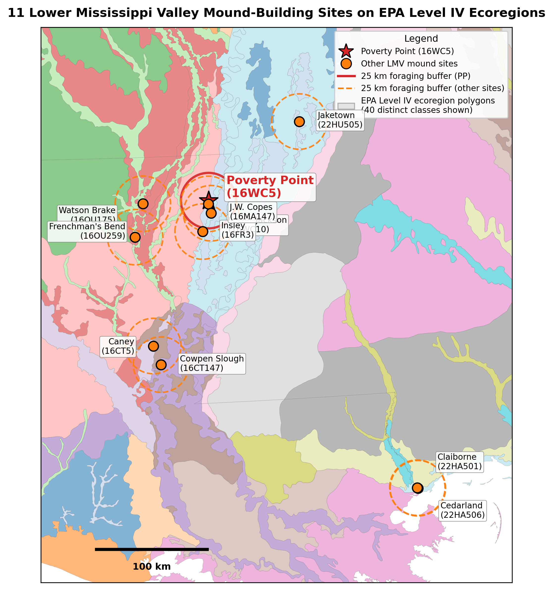

***Figure 12. Lower Mississippi Valley sites overlaid on EPA Level IV ecoregions: the static-diversity baseline.*** *Eleven Middle Archaic and Late Archaic monument-building sites (Table 2) shown with their 25 km foraging buffers on the EPA Level IV ecoregion polygon background (Omernik and Griffith 2014). Poverty Point (red star, solid red buffer) sits at the confluence of multiple Level IV polygons, including Macon Ridge (73j), Northern Holocene Meander Belts (73a), Northern Backswamps (73d), and the Mississippi alluvial valley. Watson Brake's buffer crosses the highest count of distinct Level IV polygons (7) of any LMV site, with Caney (6) and Frenchman's Bend (6) close behind. Polygon coloring is categorical and arbitrary; 38 distinct Level IV classes appear within the bounding box. The figure documents the static-diversity proxy used to compute the §6.4 screening result. We include it in the main text rather than supplemental because the visualization is the most direct way to see what the framework is and is not measuring at this resolution: the figure shows raw within-buffer ecoregion heterogeneity, which is the quantity the static rubric captures, but it does not capture the covariance-based multi-drainage shortfall buffering that the framework's $\varepsilon$ parameter encodes. The departure from static-diversity reasoning to covariance-based reasoning is the framework's substantive methodological move; Figure 13B shows the operative quantity that follows from that move (independent shortfall regimes per site from §6.5's USGS-gauge analysis).*

### 6.5 Multi-drainage shortfall buffering: USGS gauge analysis

The framework's $\varepsilon$ measures whether a site's accessible resource zones produce well during the years when resources in surrounding areas are in short supply. The mechanism is statistical: zones drawing on different shortfall drivers tend to be productive in different years, so a site that integrates multiple independent drivers is buffered against any single regional shock. The framework predicts aggregation should concentrate at sites where this kind of buffering is strongest. Poverty Point's confluence position satisfies this in a way no other LMV site does: four canoe-accessible drainages (Bayou Maçon, Mississippi, Tensas, Yazoo) converge at PP. The Mississippi drains a continental basin and integrates snowmelt and storm-track variability across the central United States, while Bayou Maçon and the Tensas-Boeuf system are local-precipitation-driven sub-basins of Macon Ridge geomorphology, and the Yazoo Basin is structured by separate Loess Hills runoff and backwater flooding from the main Mississippi (Saucier 1994).

Modern USGS gauge records establish that PP's catchment integrates **three substantively independent drainage signals** rather than four: Bayou Maçon and the Tensas River are highly correlated ($r = 0.90$ on log-monthly anomalies, n = 93), reflecting their shared Macon-Ridge geomorphology, and function as a single "Macon Ridge drainage system" from the framework's covariance-based $\varepsilon$ standpoint. The genuinely independent regimes are the Macon Ridge system, the Yazoo Basin (uncorrelated with the Mississippi at $r = 0.11$), and the Mississippi mainstem (partly shared with the Tensas at $r = 0.34$). Simultaneous bottom-quartile flow across the three independent regimes occurs in only ~10% of months. PP still integrates more independent shortfall regimes than any other site in Table 2 (each interior LMV site accesses one regime), but the per-site advantage is "three vs one" rather than "four vs one." Full pairwise correlation analysis in §S15.

A vital assumption underlies our analysis. We use modern hydrograph data as a first-order proxy for Late Archaic drainage independence. Pre-channelization Mississippi-Yazoo correlations could plausibly have been higher than modern values (e.g., frequent overbank events synchronizing both systems through backwater flooding before levee construction) or lower (e.g., more independent floodplain hydrographs before 19th-20th-century channelization). To bound the sensitivity of the three-regime claim, we consider a case in which the Mississippi-Yazoo correlation is shifted upward by $\Delta r = +0.30$ (from $r = 0.11$ to $r = 0.41$), the Yazoo and Mississippi remain substantively independent under any standard threshold ($r < 0.50$ for "uncorrelated"), and Poverty Point's three-regime claim survives. At $\Delta r = +0.50$ ($r = 0.61$), the Yazoo would collapse into the Mississippi regime as a single integrated system, reducing Poverty Point from three to two independent regimes. The "unique multi-regime outlier" framing among LMV mound sites (where every other interior site accesses one regime) survives as long as PP retains at least two independent regimes; that claim therefore holds under plausible upward shifts in paleo correlations up to $\Delta r \approx +0.50$. The three-regime-specific quantitative result requires that the modern correlation structure hold approximately; the qualitative multi-regime vs. single-regime contrast is robust to proxy uncertainty.

When one regime is in short supply, the others typically are not. PP's bands could therefore draw on more zones for more of the year, during the very critical periods when surrounding LMV locations were less productive. Watson Brake (one regime, Bayou Bartholomew), Frenchman's Bend (one tributary in the Ouachita system), Jaketown (one regime in the Yazoo Basin), J.W. Copes and Cowpen Slough (Macon-Ridge regime only), Caney and Insley (small tributaries within the Macon-Ridge regime), and Lower Jackson (Macon-Ridge regime only despite sharing PP's catchment context) integrate one independent regime each; a regional shortfall hits all their accessible zones at once. Among LMV mound sites, Poverty Point is the unique outlier in covariance-based $\varepsilon$.

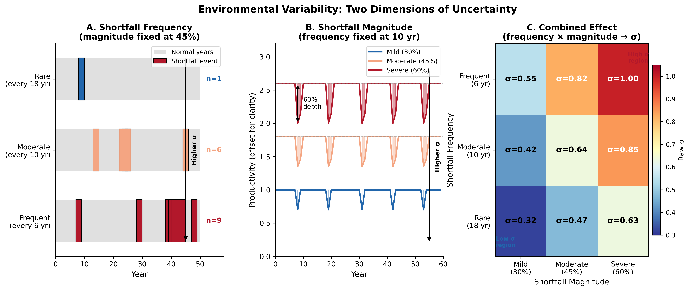

***Figure 13. Multi-drainage shortfall buffering across LMV mound-building sites.*** *(A) Shannon diversity index $H$ (bars) and ordinal observed monument scale (dark diamonds, right axis: minimal/small/mid/very large) for the eleven sites in Table 2. The dotted green line marks the maximum possible Shannon entropy with five equally weighted zones ($H_{max} = \ln 5 \approx 1.61$). All nine interior monument-building sites cluster in the $H \approx 1.30\text{-}1.58$ band; only the coastal Pearl River pair falls substantially lower. (B) Number of substantively independent shortfall regimes per site, derived from the modern USGS gauge correlation matrix (§S15). Poverty Point integrates three independent regimes (Macon Ridge: Bayou Maçon + Tensas at $r = 0.90$, functioning as one regime; Mississippi mainstem; Yazoo Basin), making it the unique multi-regime outlier among the LMV mound sites. The contrast between Panel A (static-diversity proxy showing similar values across sites) and Panel B (multi-drainage shortfall buffering showing the framework's actual operative quantity) makes the central methodological point: the static proxy does not differentiate the sites well because it does not measure the covariance-based shortfall buffering that the framework's $\varepsilon$ encodes.*

A defensible test of the magnitude prediction requires a covariance-based, water-route-aware operationalization (drainage-resolved hydrographs, species-level seasonal productivity, canoe-day isochrones) that the present article does not perform. We identify this step as the water-route-catchment component (§S17.4), with paleo-discharge-resolved follow-up flagged for future work in §7.4.

### 6.6 Convergence dynamics and the magnitude limit

Magnitude variation among the high-$\varepsilon$ sites is set by two factors the static rubric does not measure: differential covariance-based $\varepsilon$ (multi-drainage shortfall buffering, addressed in §6.5), and attained aggregation size $n_{agg}$ via convergence dynamics. The convergence dimension is itself substantive. Lower Jackson, with the second-highest static $H$ in the LMV, is a single isolated mound built ~5,500 cal BP and represents a single-band or single-event construction with no associated residential or exchange evidence (Saunders et al. 2001). Watson Brake, J.W. Copes, and Jaketown all sit in the high-$\varepsilon$ band but never achieved comparable scale. Poverty Point's primacy follows from the combination of confluence-based shortfall buffering with a uniquely large attained $n_{agg}$, driven by the convergence of multiple cultural traditions documented by Grooms et al. (2023) and Kidder and Grooms (2024). Of the high-$\varepsilon$ LMV sites, Poverty Point is the one that drew bands from across the midcontinent. The others operated at much smaller $n_{agg}$, which the framework predicts produces correspondingly smaller fitness differentials and equilibrium monument stocks.

The framework's joint $M_g(\varepsilon, n_{agg})$ formula (§2.4) lets us compute the predicted equilibrium monument stock at each Table 2 site using each site's $\varepsilon$ value from the static rubric and an $n_{agg}$ value from the convergence-model literature (PP $\approx 25$; Jaketown $\approx 5$ to $10$; Watson Brake $\approx 8$; Lower Jackson, Caney, Insley, Frenchman's Bend, J.W. Copes, Cowpen Slough $\approx 2$ to $5$; Pearl River pair $\approx 5$ to $8$ pre-shell-ring). The rank correlation between predicted and observed scale across the eleven sites is high, with $\ rho$ ranging from $ +0.85$ to $+0.91$ (depending on whether the observed scale is treated as an ordinal class or an absolute volume).

While this result looks like a strong magnitude-prediction result, it is not. The two predictors that go into $M_g$, the framework's $\varepsilon$ and the imported $n_{agg}$, are not independent here. We can ask how much $\varepsilon$ adds once $n_{agg}$ is already in the regression. A partial-correlation analysis (script and results in the project repository) shows the answer is essentially nothing. The joint correlation is driven by $n_{agg}$, which the framework imports from the convergence-model literature rather than deriving from first principles.

**Table 3.** *Partial-correlation decomposition of the §6.6 joint magnitude result.* *Zero-order correlations are computed against observed monument scale (ordinal: minimal/small/mid/very-large) and observed monument volume (m³, log scale). Partial correlations control for the indicated covariate. The marginal contribution of $\varepsilon$ given $n_{agg}$ is at most $+0.014$ across all three $\varepsilon$ operationalizations.*

| Predictor | Zero-order $\rho$ vs scale | Zero-order $\rho$ vs volume | Partial $\rho$ vs scale, given $n_{agg}$ | Partial $\rho$ vs volume, given $n_{agg}$ |
|---|---|---|---|---|
| $n_{agg}$ alone (convergence model) | $+0.87$ | $+0.89$ | — | — |
| $\varepsilon$ (Shannon-rubric, §S6) | $+0.39$ | $+0.44$ | $-0.009$ | $-0.005$ |
| $\varepsilon$ (EPA Level IV, §S12) | $-0.01$ | $-0.19$ | $-0.005$ | $-0.010$ |
| $\varepsilon$ (phenology, §S16) | $-0.21$ | $-0.05$ | $+0.005$ | $+0.005$ |
| Joint $M_g(\varepsilon, n_{agg})$, model equilibrium | $+0.85$ | $+0.89$ | — | — |

The framework's $\varepsilon$ is therefore not predicting cross-site magnitude in any substantive sense; the convergence-model literature is. The joint $\rho$ result is a *within-model consistency demonstration* that the framework's equilibrium $M_g$ tracks $n_{agg}$ in the expected direction. It is not an independent prediction of cross-site magnitude by the framework.

This finding makes a central concession: the framework predicts the necessity and tempo of threshold crossing, not cross-site magnitude. The $\varepsilon$ parameter is a necessity-condition variable. It asks whether a site's combination of accessible resource zones, with their independent shortfall regimes, is enough for aggregation to persist there at all, not how big the resulting investment will be. The screening test it does support (interior monument-building sites pass the necessity threshold while the coastal Pearl River pair does not) is what carries inferential weight. Tests against magnitude were never the right tests of the framework's $\varepsilon$. The structural-vs-contingent decomposition that organizes this finding is shared with Sassaman's (2005) structure-event-process framework: both readings agree that the necessary structural conditions are met across multiple LMV sites and that the historically realized concentration at Poverty Point is set by contingent convergence dynamics. The two readings disagree about the *weight* of the structural register. We do not know how much of the LMV pattern the structural conditions actually account for and whether the convergence dynamics themselves can be derived from the structural conditions or must be imported from outside. The disagreement is therefore not over the decomposition itself but over what fraction of the explanatory work each register does. We engage that contested weight in §7.2 and identify the prospectively discriminating evidence that might be observable in future work.

### 6.7 Within-year aggregation timing (plausibility check, not independent test)

The framework's annual cycle in the ABM defaults to aggregating in summer, with bands dispersing back to home territories for fall harvest, winter, and spring. A within-year monthly time-step model (§S17.6) assesses whether the framework's logic is consistent with the published faunal evidence of fall-winter aggregation at PP (Jackson 1986, 1989; Thomas and Campbell 1978). We flag this section as a plausibility check rather than an empirical test for the reasons developed below.

The within-year analysis rests on a regional phenology calendar of five resource peaks driven by independent climate and ecological mechanisms (Figure 14A): hardwood mast (fall), spring fish spawn, summer aquatic productivity, falling-water aquatic concentration (late summer to early fall), and migratory waterfowl (separate fall and spring migration peaks). Each LMV site's access to these peaks depends on which canoe-accessible drainages and habitats sit within reach during each month (Figure 14B). The site-level distinction the framework cares about is not how many resource zones a site contains within a 25 km terrestrial buffer (the static-diversity proxies of §6.4 measure that), but how many *independent* peak windows it integrates: peaks driven by different mechanisms tend not to fail in the same year, which is what produces the negative covariance the framework's $\varepsilon$ encodes.

The temporal hierarchy across LMV sites separates Poverty Point from contemporaries more sharply than the static-diversity proxies do (Figure 14C). Poverty Point integrates five independent peak windows: Jaketown, three; Lower Jackson, Cowpen Slough, and J.W. Copes, two each; the remaining six interior sites and the coastal Pearl River pair, one each. This temporal hierarchy aligns closely with the spatial multi-drainage hierarchy reported in §6.5 (Figure 13B): the same site that integrates three substantively independent drainage signals is the same site that integrates the most independent peak windows. The two analyses operate on different dimensions (covariance across drainages vs. temporal staggering across resource types) but converge on the same PP-as-unique-multi-regime-outlier conclusion. Full per-site coding and analysis are in §S16.

We acknowledge a structural caveat in this test. The minimal phenology evidence places the mast peak window from Webb (1982) and Jackson (1986) as Sep-Nov, then ranks months by integer count of overlapping peak windows under the framework's threshold logic. The published Thomas and Campbell (1978) fall-winter peak attribution uses the same primary sources, so the "match" between the extension's top-3 months (October, September, November) and the published interpretation reflects the same calendar, rather than an independent test. The minimal extension, therefore, serves as a *plausibility check* on the framework's logic rather than an independent prediction of the seasonal pattern.

The seasonally resolved component (§S17.6) generates one genuine falsifiable prediction. The framework's broader-window output shows a substantial aggregation share in spring fish spawning (Mar-May) and summer aquatic months (Jun-Aug), in tension with the published fall-winter-dominant interpretation. A season-resolved analysis of available Poverty Point faunal evidence should show, in addition to fall-winter mast, spring fish spawning, and summer aquatic resources, approximately in the framework's predicted shares. We identify this as a falsifiable test (§7.4) that requires analyzing existing Poverty Point faunal material at a finer seasonal resolution.

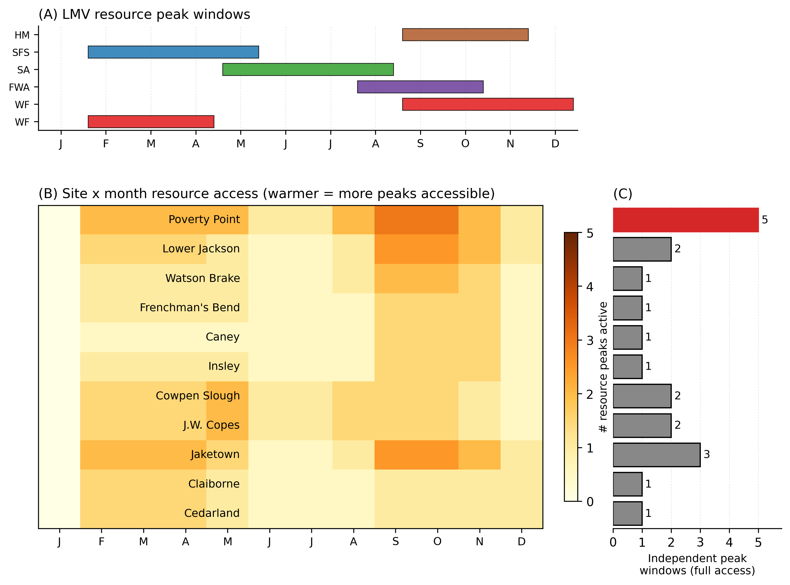

***Figure 14. Seasonal phenology of LMV resource peaks and site-level access.*** *(A) Five resource-peak windows in the Lower Mississippi Valley driven by independent climate and ecological mechanisms (per Webb 1982, Jackson 1986, Ward et al. 2022): hardwood mast (HM, brown), spring fish spawn (SFS, blue), summer aquatic (SA, green), falling-water aquatic concentration (FWA, purple), and migratory waterfowl (WF, red; fall and spring migrations are shown separately). (B) Site-by-month resource access matrix for the eleven LMV sites in Table 2; cell darkness encodes the number of resource peaks accessible to each site that month, weighted by access fraction (full = 1.0, partial = 0.5; per-site coding in §S16). (C) Number of independent peak windows accessible at full strength per site. Independent peaks are those driven by distinct climate or ecological mechanisms, so multiple drainage pathways are needed for high counts. Poverty Point integrates five independent peaks: Jaketown three, Lower Jackson, Cowpen Slough, and J.W. Copes two each; the remaining six interior sites and the coastal pair one each. The hierarchy revealed in Panel C separates PP from contemporaries more sharply than the static Shannon-diversity proxies of §6.4 and §S12, and aligns with the multi-drainage shortfall-buffering hierarchy of §6.5 (Figure 13B).*

### 6.8 Construction tempo and pulsed accumulation

The framework predicts pulsed construction following from the seasonal aggregation cycle: each gathering produces a rapid construction episode (the signal for that year), and the accumulated product of many such episodes over the active interval creates the multi-component site. The signal-half-life argument (§2.2) sharpens the prediction. Monuments persist physically after the bands that built them are gone, so the signal value of any single construction event decays at the social timescale of band turnover, and ongoing investment is required to renew the signal at the timescale relevant for current partner choice.

The Poverty Point construction record matches this pattern. Individual episodes are rapid (Mound A in <90 days, and the investigated segment of Ridge 3 West in days to weeks; Kidder et al. 2021; Ortmann and Kidder 2013), yet the site as a whole accumulated through many such episodes, with magnetic gradient survey identifying 64 distinct ridge construction components (Hargrave et al. 2021) and Clay (2023) documenting repeated build-decommission-rebuild cycles in plaza post circles and 16 sequential prepared activity surfaces beneath Mound C. The site is, as Clay (2023) argues, "the physical remnant of a number of abandoned projects" rather than a master plan. The framework resolves the apparent tension between rapid individual episodes and the multi-component site: each seasonal gathering produced a rapid construction episode, and the accumulated product of many such episodes over the ~75-year active window created the site visible archaeologically. The pulsed-construction pattern fits both the seasonal-aggregation cycle and the signal-half-life reading, and contemporary geoarchaeology converges on this pattern across different theoretical framings.

## 7. Discussion

### 7.1 What the framework predicts and what it does not

The framework predicts threshold-crossing locations and aggregation tempo. It does not predict cross-site monument-volume magnitude. This is not a limitation we have only just discovered; it is a structural property of the model. Magnitude depends on the attained aggregation size $n_{agg}$, which is taken as exogenous (set by the contingent regional convergence dynamics documented by Grooms et al. 2023 and Kidder and Grooms 2024) rather than derived from first principles.

The framework's structural commitments require five things. First, **threshold-crossing necessity**: sustained monumental construction by mobile foragers should occur only at sites where regional environmental uncertainty exceeds the model-derived threshold. Below threshold, independent foraging dominates. Second, **pulsed construction tempo**: because the signal value of any completed feature has a half-life at the social timescale of band turnover, construction should proceed episodically rather than steadily, with each episode renewing the signal at the timescale relevant for current partner choice. Cumulative volume records many individually honest signals stacked over the active interval. Third, **distance-decay in exotic acquisition**: the model's exotic-acquisition function generates a monotonic decay in relative frequency with source distance, with the shape of the decay depending on the characteristic length scale parameter. Fourth, **sharp phase transition**: the transition from independent foraging to sustained aggregation is concentrated in a narrow range of conditions ($\sigma$ within $\pm 0.10$ of $\sigma^*$ in our parameterization), not a continuous correlation between environmental stress and the scale of monument investment. Fifth, **asymmetric flow signature**: exotic-goods accumulation in a costly signaling system with aggregation at a central site should flow toward the gathering rather than from it. The asymmetry should be *patterned*: signal-bearing markers appear at sites whose bands attended the aggregation as visitor-source partners (where the signal is socially load-bearing) but are absent at peripheral sites whose bands did not attend (where the signal would have no audience).

Three things the framework explicitly does not claim. First, **cross-site monument-volume magnitude**. The limit is confirmed by three independent magnitude tests across LMV sites: (i) the Table 2 Shannon-derived $\varepsilon$ correlates only weakly with ordinal observed monument scale (Spearman $\rho = +0.39$, $p = 0.24$); (ii) the §S12 EPA Level IV ecoregion-derived $\varepsilon$ correlates not at all ($\rho = -0.01$, $p = 0.98$); (iii) the §S16 phenology-derived $\varepsilon$ produces $\rho = -0.21$ ($p = 0.54$). All three are effectively null. Reported separately, the joint $M_g(\varepsilon, n_{agg})$ result of §6.6 returns Spearman $\rho = +0.85$ to $+0.91$ against observed scale and volume, but the partial-correlation decomposition shows that this is essentially the $n_{agg}$ ranking; the framework's $\varepsilon$ contributes at most $+0.014$ to the joint correlation. The framework's $\varepsilon$ is therefore a necessity-condition variable, not a magnitude predictor. Second, **the cultural content of the signaling apparatus**. The framework predicts that *some* cultural apparatus (institutional forms, symbolic content, motivational logics) must develop to coordinate cooperation under above-threshold conditions, but the specific form that apparatus takes is not derivable from ecology alone. The framework is silent on owl imagery, sodality markers, prophetic movements, and similar specifics; these belong to cultural-historical accounts that operate in a complementary register. Third, **the historically realized concentration at any specific site**. The framework predicts that above-threshold sites should appear in regions with high environmental uncertainty and multi-zone access. It does not predict which above-threshold site will become the regional center, because the attained $n_{agg}$ depends on convergence dynamics that the framework imports rather than derives.

The Watson Brake comparison shows the same property in reverse: the equilibrium calculation overshoots WB's observed volume by ~30× (§6.3), and that overshoot is closed by treating WB as a near-threshold bistable case operating at small $n_{agg}$, not by adjusting $\varepsilon$. The structural-vs-contingent decomposition is shared with Sassaman's (2005) structure-event-process reading (necessary structural conditions, contingent realized sequence); the contested weight, on which the two readings differ, is whether the structural register does additional explanatory work beyond setting prerequisites. We develop that contested weight in §7.2.

Five sources of magnitude variation the framework does not track (full enumeration in §S11) are: spatial network topology and water-route accessibility, gathering-site carrying capacity, path dependence and first-mover advantage, temporal heterogeneity in regional $\sigma$, and reduction of multi-zone structure to a single Shannon number. The framework would close the magnitude prediction only with a regional spatially explicit ABM that endogenizes $n_{agg}$ at each site through hydrographic routing and across-site selection.

### 7.2 Cultural-historical alternatives

The framework is not in competition with the recent culturally rich accounts of Poverty Point. It operates in a different register, and the most useful question is how the registers relate to each other. Our account is *structural*: it specifies the environmental and demographic conditions under which a particular kind of investment becomes adaptive, and it predicts the qualitative locations and tempo of that investment. It does not predict relative magnitude across LMV sites within the high-$\varepsilon$ band. The cultural-historical accounts are *organizational*: they specify the institutional forms, symbolic content, and motivational logics through which the investment is actually carried out. Both registers are needed.

*Kidder and Grooms's (2025) revitalization-movement framework* is a *reason-giving* account specifying the cultural and motivational logic participants would have invoked. The two frameworks agree that construction should intensify during or after environmental disruption, that chiefdom-level hierarchy was absent, and that labor was voluntary. The key divergence is mechanistic: revitalization invokes prophetic movements and bundle ceremonies drawn from ethnographic analogy across a multi-millennia gap, while the costly-signaling framework derives the same behaviors from fitness-maximizing decisions under specified environmental conditions. The framework predicts quantitative threshold relationships and a distance-decay shape that revitalization does not address; revitalization engages with specific symbolic content (owl imagery, sodality markers) that the framework treats as arbitrary cultural convention. The two operate simultaneously: signaling theory explains why collective investment is adaptive, revitalization dynamics describe the cultural forms it takes.

*Sanger's (2023, 2024) institutional-flexibility framework* addresses how participating groups prevent cooperation infrastructure from generating permanent inequality. The seasonal aggregate-disperse rhythm Sanger describes, with Mandan-Hidatsa parallels, matches the cycle predicted by the present framework. The institutional forms Sanger documents are the organizational solutions through which a costly-signaling system at the LMV scale was realized; the framework predicts *some* such solution must develop, but does not specify which. *Carballo's (2013) collective-action framework* provides institutional mechanisms (norms, monitoring, sanctioning) that maintain cooperation once established. Signaling theory addresses how cooperation is *initially* established between unfamiliar groups, the acute problem at an aggregation drawing bands from across the midcontinent. The frameworks address different stages of the same trajectory.

*Peacock and Rafferty's (2013) bet-hedging framework* emphasizes investment during stable intervals as buffering against future downturns; the framework here accommodates this but predicts a step function rather than continuous scaling, and Watson Brake's punctuated construction fits the step function more naturally. The threshold framing also addresses standard critiques that bet-hedging and costly-signaling explanations of monumental investment risk being unfalsifiable post-hoc rationalizations (Codding and Jones 2007; Quinn 2019): the framework here generates specific signed predictions about location, tempo, distance-decay, and collapse sequence (§7.4) that are evaluated against the LMV record, and the model code is publicly available so the predictions can be tested at independent sites.

The classical alternatives reviewed in §1 (aggrandizer, pilgrimage, trade-center, incipient sedentism) are best read as identifying real phenomena that the framework subsumes. Status competition, ritual draw, exchange flows, and seasonal residence concentration are all *predicted* by an aggregation system at the LMV scale; where the classical accounts go wrong is in promoting one phenomenon to the explanatory role and treating the others as ancillary.

*Sassaman's (2005) structure-event-process framing*. The framework and Sassaman agree on the *decomposition* (i.e., necessary structural conditions and the contingent realized sequence; §6.6, §7.1) but disagree on the *weight*. Sassaman's central claim is that the structural register is largely passive: PP's specific tempo, scale, and material accumulation depend on the contingent event-and-process trajectory of inter-band engagements that the structural register does not derive. The framework agrees that the structural register is necessary-but-not-sufficient (§7.1) but argues that it does substantive explanatory work beyond serving as a passive backdrop: the framework's necessity conditions account for chronology (above-threshold timing follows the §5.5 paleoclimate window), location (the interior-vs-coastal screening result, Table 2), tempo (the bistable transition zone, §6.3 and §6.8), and constraint on the magnitude register (sites without high-$\varepsilon$ access could not have sustained multi-band aggregation regardless of historical contingency). The contested question is whether these structural results explain a substantial fraction of the LMV pattern or merely set the conditions under which the explanation occurs. Sassaman reads the structural register as conditions; we read it as conditions plus active constraints on chronology, location, and tempo.

Where the readings make different predictions: the Late Archaic-Early Woodland transition. The structural reading predicts that environmental relaxation below threshold (Kidder 2006's ~3300 cal BP flood-frequency increase pushing the LMV out of the high-$\sigma$ regime) accounts for the abandonment of the system; the structure-event-process reading predicts the abandonment should track the dissolution of the specific institutional configurations (the cyclical dispersal-aggregation rhythm, the convergence-pulling network among interbanding partners) that made PP work. High-resolution Bayesian dating of Early Woodland deposits at PP and at Jaketown could discriminate between the two readings. We do not perform that analysis here; we name it as the prospectively discriminating observable that would make the framework-vs-Sassaman comparison empirical rather than rhetorical.

### 7.3 System collapse

The framework identifies two pathways through which threshold-crossing collapse is predicted. First, geomorphic change can degrade the ecotone advantage: channel migration, sedimentation, and flooding alter the mosaic of zones, reducing $\varepsilon$ and raising $\sigma^*$ above the regional $\sigma$. A drop from $\varepsilon = 0.35$ to $\varepsilon = 0.15$ would raise $\sigma^*$ from ~0.40 to ~0.50, potentially pushing conditions below the viability boundary. Second, disruption of long-distance exchange routes severs the material supply lines that sustain individual-level signaling, reducing the cooperation networks that the signaling apparatus underwrites.

Both pathways are documented in the Late Archaic LMV. Geoarchaeological evidence from Jaketown (Kidder et al. 2018) records a crevasse splay that buried the Poverty Point occupation at 3310 cal BP (10-15 cm of coarse sand overlain by 50-60 cm of fining-upward sediment), produced by the Mississippi's lateral migration from its Stage 2 to Stage 1 course. The resulting regional abandonment at Jaketown lasted ~530 years. Post-flood Early Woodland reoccupation shows little monumental architecture (with the possible exception of St. Mary's Mound), minimal long-distance trade, less diverse assemblages, and no lapidary art (Kidder et al. 2018), a near-complete collapse of the signaling system rather than a gradual decline. This pattern is consistent with the framework's prediction that, once conditions cross below $\sigma^*$, the positive feedback that sustained aggregation reverses rapidly.

Two qualifications. First, the framework was developed with the Kidder et al. (2018) collapse pattern already in mind, so the consistency between model and observations is not an out-of-sample prediction. We read it as a confirmation that the threshold logic accommodates the documented sequence rather than as a blind test that the account passed. Second, threshold-driven collapse and direct displacement-driven collapse yield temporally distinct predictions that the LMV record could, in principle, distinguish. A threshold-driven collapse predicts that the *signaling indicators* (long-distance exotic acquisition, lapidary production) should weaken before or simultaneously with monument abandonment, because the supporting cooperation network must thin before the signals it sustains become uneconomic. A direct displacement-driven collapse predicts that monument abandonment should *precede* exotic-network attrition, because the immediate driver is the loss of the gathering site rather than the loss of the network. The current LMV chronology lacks the temporal resolution to discriminate, but high-resolution Bayesian modeling of terminal-occupation deposits, in parallel with Kidder and Grooms (2024) for the active interval, would provide a sharper test of the threshold mechanism in particular.

The collapse is informative about the underlying mechanism. If the LMV system had been organized through inherited institutions or chiefly authority, we would expect partial reorganization rather than near-total cessation. The framework predicts that sub-threshold conditions simultaneously remove the adaptive basis for the entire signaling apparatus, which matches the observed pattern of synchronized collapse across architecture, exchange, and lapidary production. The signal-half-life argument (§2.2) sharpens the prediction: a system that depends on continuous re-signaling is vulnerable not only to threshold-crossing environmental change but to any disruption that interrupts the construction cycle, because the inferential reliability of past investment decays at the social timescale of band turnover. The pre-existing physical structures cannot substitute for ongoing fresh investment, so a single missed cycle attenuates the network's signaling capacity in subsequent years. Recovery would require not just ecological restoration but the rebuilding of cooperation networks and convergence dynamics that take generations to mature.

### 7.4 Falsifiable predictions and priority empirical work

We separate predictions into those that carry independent inferential weight against the framework and those that carry only consistency weight conditional on inputs we have not derived.

**Independent results that would falsify the framework if reversed:**

(a) *Binary interior-vs-coastal screening.* If a coastal Pearl-River-type site produced a high-$\varepsilon$ score and a high observed monument scale, the screening-claim half of the framework would be falsified. The observed pattern (Table 2) is consistent.

(b) *Paleoclimate-threshold proximity.* If a more rigorous paleo-discharge-resolved $\varepsilon$ produced a posterior probability of above-threshold operation below 0.20, the structural-conditions claim would be substantially weakened. The current posterior is $P = 0.36$-$0.56$ across plausible priors; a tighter test is identified below.

(c) *Distance-decay rank correlation.* If a recovery-corrected reanalysis of the Webb (1982) inventories produced $\rho < 0.5$ across the four exotic materials, the long-distance-acquisition claim would be undermined. The current value is $\rho = 0.95$.

(d) *Threshold-vs-displacement collapse.* If high-resolution Bayesian dating of terminal-occupation deposits showed exotic-network attrition *after* monument abandonment, the threshold mechanism would be falsified. The data needed to perform this test does not currently exist at the resolution required.

(e) *Out-of-sample placement.* An out-of-sample test at Stallings Island, Green River, or Mulberry Creek, where $\varepsilon$ and $n_{agg}$ are derived independently, and the joint prediction fails to bracket observed monument scale would carry strong independent weight against the framework. This test is not currently performed.

(f) *Outflow signature.* The model predicts asymmetric flow into the gathering rather than the reciprocal flow that risk-pooling implies or the outward dispersal that down-the-line exchange implies. The existing record matches: 95.7% of all steatite and 97% of all galena in the entire Poverty Point regional system are at the type-site (Smith 1991), and "nothing visible goes out" of PP (Kidder and Grooms 2025:7). This is the discriminating empirical result, and it holds on the existing record. If outflow assemblages at adjacent contemporary sites contained substantial PP-style exotic material, contradicting the one-directional flow signature, the signaling-specific reading of the exotic record would be falsified; the published cross-site inventory does not show this. A controlled provenience analysis of visitor-band sources, in which outflow absence is examined specifically at sites whose participation as visitor bands is independently established (e.g., through the convergence-model chronological framework of Grooms et al. 2023), would tighten the test by examining the spatial structure of the outflow absence rather than its overall presence/absence.

(g) *Phenology test.* If a season-resolved analysis of Poverty Point faunal assemblages showed exclusive fall-winter mast aggregation with no spring fish-spawn or summer aquatic resources, the framework's broader-window prediction would be falsified.

**Results that carry only consistency weight conditional on inputs:**

(i) The cross-site magnitude correlation ($\rho = +0.85$ to $+0.91$) is dominated by exogenous $n_{agg}$ from convergence-model literature; the framework's $\varepsilon$ contributes $\leq +0.014$ marginal correlation. A reviewer skeptical of the $n_{agg}$ values would correctly object that the magnitude prediction is conditional on input data that the framework does not derive.

(ii) The Watson Brake regime-switching closure (§6.3) depends on three parameter choices tuned to bracket the observed Watson Brake volume rather than derived from independent data: the labor-scaling exponent $\alpha = 2.0$ fit to the eleven-site sample, the band-coordination persistence $K = 3$ years (selected from a sweep where $K = 1$ overshoots and $K = 5$ undershoots), and the year-to-year paleoclimate variability $\sigma_{sd} \in [0.10, 0.125]$ from central paleoclimate estimates. The 5,408 m³ central prediction with a 95% interval of $[2{,}622, 8{,}694]$ brackets the observed 7,000 m³, but the closure is post-hoc rather than a test. The observation could have failed.

We can partially derive $\alpha$ from independent ethnographic data. Erasmus (1965) measured that one laborer with a wooden digging stick excavates approximately 2.6 m³ of earthen fill per five-hour person-day in the Mexican highlands; the rate is widely cited in Late Archaic labor estimates (Ortmann and Kidder 2013 use it to derive the ~91,700 person-day estimate for Mound A). Under additive accounting (per-person rate constant across crew sizes), Erasmus's measurement supports $\alpha \approx 1$ (linear scaling in crew size). The $\alpha = 2$ used in §6.3 instead requires superadditive scaling, meaning larger crews achieve more m³ per person than smaller crews through specialization or coordination economies. The Late Archaic literature does not establish whether such economies operated at the crew sizes relevant for Watson Brake versus Poverty Point, so the §6.3 closure should be read as consistent only under a fitted $\alpha = 2$ that exceeds Erasmus-derived linear scaling. A full forward prediction would require either independent justification for superadditive scaling at these crew sizes (Carballo 2013 reviews the institutional reasons large crews can achieve specialization-driven productivity gains, but the literature is mixed) or restricting the Watson Brake analysis to $\alpha = 1$, which would leave the framework underpredicting Watson Brake by approximately 7-fold rather than the post-hoc-fitted 0.8-fold.

(iii) The seasonal aggregation pattern prediction (§6.7) is partly tautological because the script reads in the mast peak window from Webb (1982) and Jackson (1986); the genuinely falsifiable spring-summer prediction is listed in (g) above.

We highlight these limits to provide readers with a clear accounting of the framework's empirical commitments. The framework predicts the necessity of threshold crossing (the tests a, b, c, and d above test this). It does not predict cross-site monument-volume magnitude independently of $n_{agg}$.

A challenge shared by all current attempts to understand Poverty Point is that most archaeological data on the LMV mound-building tradition was generated under culture-historical paradigms, organized around questions of when, where, by whom, and in what sequence. The resulting assemblages and chronologies are extensive and well-documented, but they were not collected to test or falsify mechanistic hypotheses about why mobile hunter-gatherers built monuments. As Perreault (2019) argues, at the level of the archaeological record more generally, the resolution at which a record discriminates among hypotheses is set by the resolution at which it was assembled. The LMV record's design supports discrimination among cultural-historical periods, traditions, and population trajectories. It does not, in its current form, support discrimination among mechanistic accounts of cooperation, aggregation, and monument investment, because the relevant discriminating evidence (per-event labor force, partner-choice events, signal-conditional tie formation, drainage-resolved per-site shortfall productivity) is either not preserved or has not been recovered through the dominant research programs.

The framework offered here is the kind of mechanistic account that requires the higher-resolution evidence the existing record largely lacks. Its testable predictions identify both what existing data can be marshaled for and what new data are needed. The accounting below makes this resolution-question match explicit.

Existing data support the calibration, distance-decay, paleoclimate, chronology, and Watson Brake consistency demonstrations reported in §6. They are not sufficient for: (1) the framework's covariance-based magnitude prediction across LMV sites, which requires drainage-resolved paleo-discharge time series at each Table 2 site; (2) the visitor-band outflow signature test, which requires controlled provenience analysis on PP-style exotic material at sites whose visitor-band status is independently established (this is the test that would discriminate the signaling reading from generic transport-cost or risk-pooling alternatives, see §7.2 above; the existing PP exchange data was not collected with the asymmetric-flow signature in view); (3) a clean discrimination of convergence from delayed down-the-line diffusion, which requires uniformly Bayesian-modeled chronologies for the full LMV PP-trait inventory at sites beyond Jaketown and Poverty Point; (4) the threshold-vs-displacement collapse contrast, which requires high-resolution Bayesian dating of terminal-occupation deposits comparable to Kidder and Grooms (2024) for the active interval; (5) the seasonal-aggregation pattern test, which requires reanalysis of existing PP faunal collections at finer seasonal resolution; (6) a true signal-conditional ablation, which requires either the spatially-explicit ABM extension that endogenizes partner choice or the visitor-band outflow analysis that operationalizes signal-conditional tie formation in the archaeological record; and (7) a cross-LMV PPO production-volume test, which would assess whether aggregate PPO concentrations at the type site exceed any defensible cooking-needs baseline by a margin sufficient to read the excess as a group-level signaling deposit parallel to excess monument volume. This last test requires per-site PPO counts with deposit context (partly available in Webb 1982 and Hays 2019) plus an independently-derived cooking-needs baseline that the LMV literature has not yet developed. Items (2) and (6) are the critical items for separating the framework's signaling reading from a generic risk-pooling account; items (1), (3), (4), and (5) tighten or extend specific framework claims that the existing record can already partly support; item (7) would extend the framework with a third signaling channel currently unformalized (see §2.2).

Additional model extensions would tighten or extend specific claims. A regional, spatially explicit ABM with hydrographic routing on a digital elevation model, carrying-capacity dynamics, path dependence over multi-century timescales, and stochastic exploration-exploitation balance would endogenize $n_{agg}$ rather than treat it as exogenous. We have implemented a minimal version (band-allocation among 11 candidate LMV sites with canoe-day travel costs) for verification purposes; the full version remains future work. A within-month time-step model with species-resolved subsistence dynamics and a non-LMV-derived phenology calendar would test the framework's seasonality prediction non-circularly. A paleo-discharge-resolved operationalization of $\varepsilon$ using sediment-yield reconstructions or paleo-flood-frequency proxies per drainage at the focal-site scale would replace the modern hydrograph-as-proxy treatment used in our preliminary regional analysis.

Generating this data, with falsification of specific framework predictions in view rather than further descriptive documentation as the primary goal, is the empirical agenda the framework calls for.

### 7.5 Implications for hunter-gatherer archaeology more broadly

The standard typological account of forager societies treats monumentality as a marker of the transition to complexity, with hunter-gatherer monumentality treated as evidence of transitional or anomalous status. Sassaman (2010) challenges this assumption specifically for the Eastern Archaic, and Graeber and Wengrow (2021) make a parallel argument for the broader human deep-time record. The framework offers a structural reading consistent with both arguments: if mobile-forager monumentality occurs when environmental uncertainty exceeds the threshold combined with locally available ecotone diversity and a viable attained aggregation scale, then the appearance of monumentality in mobile-forager societies need not indicate transitional status, and its absence in other forager societies need not indicate the absence of capacity for cooperation or symbolic life.

The framework's predictions for adjacent eastern Archaic monumental traditions are worth naming concretely to identify where it should and should not place sites above the threshold. None of these is a tested prediction. Instead, all are conditional placements that we report so the framework's operational specificity is visible to the reader, with the explicit caveat that we have not applied the static rubric or the convergence-model $n_{agg}$ to any of them, and that the comparisons remain to be done. *Stallings Island and the Savannah River shell-ring tradition* (4500-3500 cal BP; Sassaman 2006): the framework would place these in a moderately high-$\varepsilon$ band (estuarine multi-zone access but no inland-drainage confluence comparable to PP), and would predict above-threshold operation at a smaller magnitude than PP. *Green River shell mound complex* in Kentucky (5800-4000 cal BP; Marquardt and Watson 2005): integration of river, terrace, oak-hickory upland, and bottomland zones places it in a high-$\varepsilon$ band similar to interior LMV sites, with above-threshold operation predicted. *Mulberry Creek and adjacent Tennessee Valley shell mounds* (4500-3500 cal BP; Webb 1939; Sassaman 2010): Tennessee River aquatic, upland, and mast zone integration predicts above-threshold operation at intermediate scale. *Poverty Point-period sites in southwest Alabama and east Mississippi* (Yazoo Basin and Tombigbee corridor): near-LMV cases that the framework would predict to fall in the same high-$\varepsilon$ band as the Table 2 interior sites, with magnitude differences set by attained $n_{agg}$. The framework would *not* place most Western Eastern Woodlands hunter-gatherer settings of comparable date above threshold, where prairie dominance reduces zone count and ecotone integration. Whether each of these placements matches the documented record (shell-ring scale at Stallings, mound-and-midden investment at Green River, shell-mound investment at Mulberry Creek, absence of monumental architecture in the western prairie) requires applying the rubric and the convergence-model $n_{agg}$ at each site, which we have not done here. We call these falsifiable predictions rather than confirmations.

None of these is a tested prediction; all are conditional placements. The point is that the framework is operationally specific enough to make case-by-case structural predictions in the eastern Archaic literature, even though those predictions have not been formally tested against the broader record. Whether the LMV pattern is best understood as a regionally bounded experiment in mobile-forager monumentality (consistent with Sassaman 2010) or as part of a continent-wide structural phenomenon awaiting empirical testing is the empirical question the framework reformulates.

## 8. Conclusions

The Poverty Point paradox, in which mobile foragers built the largest pre-ceramic earthwork complex north of Mexico without hierarchy, food production, or year-round settlement, is consistent with a costly signaling system operating through seasonal aggregation. When environmental uncertainty exceeds a critical threshold and ecotone access is sufficient, aggregation with monument construction and exotic-goods acquisition provides higher fitness than independent foraging in the multilevel-selection framework we have developed. The investment patterns are not wasteful displays but functional solutions to the partner-identification, free-rider, and commitment problems that arise whenever mobile bands gather at a site that pulls partners from across the midcontinent.

We evaluate the framework against the LMV record through eight separate tests, with the full accounting in §7.4. The summary:

Three evaluations carry independent weight, each with a specific bound. The interior-vs-coastal screening (§6.4) distinguishes the high-$\varepsilon$ interior monument-building sites from the low-$\varepsilon$ Pearl River coastal pair (Claiborne and Cedarland), but the sample includes only sites where mounds were already built; the result describes the catchment geomorphology of the LMV interior more than it tests the framework against non-mound-building locations. The paleoclimate threshold-proximity test (§6.2), conditioned on the calibrated parameter set that defines $\sigma^*$, lands at posterior probability $P = 0.36$-$0.56$ across plausible $\varepsilon$ priors. The width of this range reflects uncertainty in both the paleoclimate inputs and the model parameters rather than a failed prediction; Poverty Point sits near the threshold under defensible parameter choices, but the test does not by itself confirm or refute above-threshold operation. The distance-decay rank correlation (§6.1) yields $\rho = 0.95$ across four materials, but it is acknowledged that it does not distinguish the signaling-mediated acquisition mechanism from a generic transport-cost or down-the-line exchange model that would produce the same ordering.

The remaining five evaluations are consistency demonstrations. The volume calibration (§6.1) is, by definition, fit to the PP target. The exotic-goods totals (§6.1) require unit conversions and recovery-loss corrections to match the archaeological record. The Watson Brake closure (§6.3) requires per-event labor-scaling and regime-switching parameters chosen to bracket the WB observation; we describe the result as consistent with observed scale rather than as a passed test. The cross-site magnitude correlation (§6.6) returns Spearman $\rho = +0.85$ to $+0.91$, but the partial-correlation decomposition shows this is dominated by exogenous $n_{agg}$ from the convergence-model literature, with $\varepsilon$ contributing $\leq +0.014$ marginal correlation. The within-year aggregation-timing test (§6.7) is partly tautological because the phenology calendar comes from the same Webb (1982) and Jackson (1986) sources that inform the published seasonal interpretation. The construction-tempo evaluation (§6.8) is consistent with the framework but with the explicit caveat that contemporary geoarchaeology converges on the same pattern under different theoretical framings.

The framework's discriminating empirical claim is the asymmetric-flow signature of §6.1: the signaling reading predicts material accumulation at the gathering and absence of PP-style outflow back to visitor-band home territories. The existing LMV record supports this. Smith (1991) reports 95.7% of all steatite and 97% of all galena in the regional system at the type-site, and Kidder and Grooms (2025:7) explicitly characterize the flow as one-directional ("nothing visible goes out"). Generic risk-pooling alternatives in the Halstead and O'Shea (1989) tradition predict reciprocal flow as bands repay obligations during shortfalls; generic down-the-line exchange predicts gradual outward dispersal of PP-style markers from the type site. Neither pattern is observed. The signaling reading is therefore distinguished from these alternatives on the spatial-flow dimension. On the threshold-location dimension, the signal-conditional vs random-partner ablation (§4.3) returned no detectable shift ($-2.4\%$ in realized $\sigma_{eff}$, within replicate noise), so threshold location does not adjudicate between accounts that share the network-mediated buffering mechanism. The framework's distinctive empirical content therefore lies in the spatial-flow signature rather than in the threshold location. The §7.4(f) sharpening study, controlled provenience analysis at sites whose visitor-band participation is independently established, would tighten the test from coarse asymmetry to fine-grained asymmetry patterning, but the discriminating result is already in the existing record.

Late Archaic hunter-gatherers in the LMV were not anomalous, incipient, or in transition toward something else; they were doing what a fitness-maximizing analysis of mobile-forager populations under environmental uncertainty predicts. Read alongside the recent culturally rich accounts of Poverty Point (Clay 2023; Kidder and Grooms 2025; Sanger 2023, 2024), the framework is a structural complement to organizational accounts rather than a competing explanation. The signaling framework specifies where the conditions for sustained aggregation arise and when they should collapse; cultural-historical accounts specify through what institutional forms, with what symbolic content, and on what motivational logic those conditions are realized. Both registers are needed.

The framework's seven independently weighted, falsifiable predictions (§7.4) and the heavier model extensions and data-collection priorities that those predictions identify define the empirical agenda the framework calls for. Whether the LMV pattern is best understood as a regionally bounded experiment in mobile-forager monumentality or as part of a continent-wide structural phenomenon waiting to be tested at Stallings Island, Green River, Mulberry Creek, and beyond is the question the framework reformulates and that future work, organized around falsification of specific predictions rather than further descriptive documentation, would address.

## Acknowledgments

We thank the Poverty Point World Heritage Site staff and the Louisiana Office of State Parks for ongoing access and collaboration. The Saucier (1994) Lower Mississippi Valley geomorphology shapefile is provided as public-domain data via USGS ScienceBase. The EPA Office of Research and Development Level IV ecoregion shapefiles are in the public domain under the Omernik and Griffith framework. 

## Data Availability

Reproducibility of every analytical step in this article has been a central design goal: the public repository contains the canonical site-coordinate dataset, the analytical equilibrium and ABM source code, calibration replicates with deterministic seed lists, the per-figure generation scripts, and the seventeen-step `Makefile` plus `REPRODUCE.md` that walks a reader from a clean clone to every numerical result and figure in this article and its supplemental. Simulation code, parameter-sweep scripts, figure-generation code, an ODD protocol following Grimm et al. (2010), full sensitivity analyses, and the detailed cross-cultural comparison are provided as Supplemental Material and available at https://github.com/clipo/poverty-point. The repository includes a `requirements.txt` that pins Python and library versions; reproducibility is supported by deterministic seeding throughout. The manuscript version code release will be archived at Zenodo with a DOI prior to publication.

## References Cited

Bliege Bird, Rebecca, and Eric A. Smith. 2005. Signaling Theory, Strategic Interaction, and Symbolic Capital. *Current Anthropology* 46:221-248.

Blurton Jones, Nicholas G., Kristen Hawkes, and James F. O'Connell. 1997. Why Do Hadza Children Forage? In *Uniting Psychology and Biology: Integrative Perspectives on Human Development*, edited by Nancy L. Segal, Glenn E. Weisfeld, and Carol C. Weisfeld, pp. 279-313. American Psychological Association, Washington, D.C.

Brent, Richard P. 1973. *Algorithms for Minimization without Derivatives*. Prentice-Hall, Englewood Cliffs, New Jersey.

Carballo, David M. (editor). 2013. *Cooperation and Collective Action: Archaeological Perspectives*. University Press of Colorado, Boulder.

Clay, R. Berle. 2023. Two Types of Ritual Space at the Poverty Point Site 16WC5. *American Antiquity* 88:187-206.

Codding, Brian F., and Terry L. Jones. 2007. Man the Showoff? Or the Ascendance of a Just-So Story: A Comment on Recent Applications of Costly Signaling Theory in American Archaeology. *American Antiquity* 72:349-357.

DiNapoli, Robert J., Carl P. Lipo, Tanya Brosnan, Terry L. Hunt, Sean Hixon, Alex E. Morrison, and Matthew Becker. 2019. Rapa Nui (Easter Island) Monument (Ahu) Locations Explained by Freshwater Sources. *PLoS ONE* 14:e0210409.

Enquist, M., and O. Leimar. 1983. Evolution of Fighting Behavior: Decision Rules and Assessment of Relative Strength. *Journal of Theoretical Biology* 102:387-410.

Erasmus, Charles J. 1965. Monument Building: Some Field Experiments. *Southwestern Journal of Anthropology* 21:277-301.

Ford, James A. 1955. The Puzzle of Poverty Point. *Natural History* 64:466-472.

Ford, James A., and Clarence H. Webb. 1956. *Poverty Point: A Late Archaic Site in Louisiana*. Anthropological Papers Vol. 46(1). American Museum of Natural History, New York.

Gibson, Jon L. 1984. Empirical Characterization of Exchange Systems in Lower Mississippi Valley Prehistory. In *Prehistoric Exchange Systems in North America*, edited by Timothy G. Baugh and Jonathon E. Ericson, pp. 127-175. Plenum, New York.

Gibson, Jon L. 1998. Elements and Organization of Poverty Point Political Economy: High-Water Fish, Exotic Rocks, and Sacred Earth. *Research in Economic Anthropology* 19:291-340.

Gibson, Jon L. 1999. Swamp Exchange and the Walled Mart: Poverty Point's Rock Business. In *Raw Materials and Exchange in the Mid-South*, edited by Evan Peacock and Samuel O. Brookes, pp. 57-64. Archaeological Report 29. Mississippi Department of Archives and History, Jackson.

Gibson, Jon L. 2000. *The Ancient Mounds of Poverty Point: Place of Rings*. University Press of Florida, Gainesville.

Graeber, David, and David Wengrow. 2021. *The Dawn of Everything: A New History of Humanity*. Farrar, Straus and Giroux, New York.

Grimm, Volker, Uta Berger, Donald L. DeAngelis, J. Gary Polhill, Jarl Giske, and Steven F. Railsback. 2010. The ODD Protocol: A Review and First Update. *Ecological Modelling* 221:2760-2768.

Grooms, Seth B., Grace M. V. Ward, and Tristram R. Kidder. 2023. Convergence at Poverty Point: A Revised Chronology of the Late Archaic Lower Mississippi Valley. *Antiquity* 97:1453-1469.

Halstead, Paul, and John O'Shea (editors). 1989. *Bad Year Economics: Cultural Responses to Risk and Uncertainty*. Cambridge University Press, Cambridge.

Hargrave, Michael L., R. Berle Clay, Rinita A. Dalan, and Diana M. Greenlee. 2021. The Complex Construction History of Poverty Point's Timber Circles and Concentric Ridges. *Southeastern Archaeology* 40:192-211.

Hawkes, Kristen. 2000. Hunting and the Evolution of Egalitarian Societies: Lessons from the Hadza. In *Hierarchies in Action: Cui Bono?*, edited by Michael W. Diehl, pp. 59-83. Center for Archaeological Investigations Occasional Paper No. 27. Southern Illinois University, Carbondale.

Hawkes, Kristen, and Rebecca Bliege Bird. 2002. Showing Off, Handicap Signaling, and the Evolution of Men's Work. *Evolutionary Anthropology* 11:58-67.

Hays, Christopher T. 2019. Feasting at Poverty Point with Poverty Point Objects. *Southeastern Archaeology* 38:193-207.

Hill, Mark A., Diana M. Greenlee, and Hector Neff. 2016. Assessing the Provenance of Poverty Point Copper through LA-ICP-MS Compositional Analysis. *Journal of Archaeological Science: Reports* 6:351-360.

Jackson, H. Edwin. 1981. Recent Research on Poverty Point Period Subsistence and Settlement Systems: Test Excavations at the J.W. Copes Site in Northeast Louisiana. *Louisiana Archaeology* 8:73-86.

Jackson, H. Edwin. 1986. *Sedentism and Hunter-Gatherer Adaptations in the Lower Mississippi Valley: Subsistence Strategies During the Poverty Point Period*. PhD dissertation, University of Michigan. University Microfilms, Ann Arbor.

Jackson, H. Edwin. 1989. Poverty Point Adaptive Systems in the Lower Mississippi Valley: Subsistence Remains from the J.W. Copes Site. *North American Archaeologist* 10:173-204.

Jackson, H. Edwin. 1991. The Trade Fair in Hunter-Gatherer Interaction: The Role of Intersocietal Trade in the Evolution of Poverty Point Culture. In *Between Bands and States*, edited by Susan A. Gregg, pp. 265-286. Center for Archaeological Investigations Occasional Paper No. 9. Southern Illinois University, Carbondale.

Johnson, Gregory A. 1982. Organizational Structure and Scalar Stress. In *Theory and Explanation in Archaeology*, edited by Colin Renfrew, Michael J. Rowlands, and Barbara A. Segraves, pp. 389-421. Academic Press, New York.

Kaufman, Darrell, Nicholas McKay, Cody Routson, Michael Erb, Christoph Datwyler, Philipp S. Sommer, Oliver Heiri, and Basil Davis. 2020. A Global Database of Holocene Paleotemperature Records. *Scientific Data* 7:115.

Kelly, Robert L. 2013. *The Lifeways of Hunter-Gatherers: The Foraging Spectrum*. Cambridge University Press, Cambridge.

Kidder, Tristram R. 2002. Mapping Poverty Point. *American Antiquity* 67:89-101.

Kidder, Tristram R. 2006. Climate Change and the Archaic to Woodland Transition (3000-2500 cal B.P.) in the Mississippi River Basin. *American Antiquity* 71:195-231.

Kidder, Tristram R., and Kelly M. Ervin. 2018. Hunter-Gatherer Surplus Accumulation and Monumental Construction at Poverty Point, Mississippi Valley. In *Surplus without the State: Political Forms in Prehistory*, edited by Harald Meller, Detlef Gronenborn, and Roberto Risch, pp. 517-531. Landesamt für Denkmalpflege und Archäologie Sachsen-Anhalt, Halle (Saale).

Kidder, Tristram R., and Seth B. Grooms. 2024. Chronological Hygiene and Bayesian Modeling of Poverty Point Sites in the Lower Mississippi Valley, Circa 4200 to 3200 cal BP. *American Antiquity* 89:98-118.

Kidder, Tristram R., and Seth B. Grooms. 2025. Performance, Ritual, and Revitalization at Poverty Point. *Southeastern Archaeology*, in press.

Kidder, Tristram R., Edward R. Henry, and Lee J. Arco. 2018. Rapid Climate Change-Induced Collapse of Hunter-Gatherer Societies in the Lower Mississippi River Valley between ca. 3300 and 2780 cal yr BP. *Science China Earth Sciences* 61:178-189.

Kidder, Tristram R., Kun Su, Edward R. Henry, Seth B. Grooms, and Kelly M. Ervin. 2021. Multi-Method Geoarchaeological Analyses Demonstrate Exceptionally Rapid Construction of Ridge West 3 at Poverty Point. *Southeastern Archaeology* 40:212-227.

Kidder, Tristram R., Lee J. Arco, Anthony L. Ortmann, Timothy Schilling, Caroline Boeke, Rachel Beilitz, and Katherine A. Adelsberger. 2009. *Poverty Point Mound A: Final Report of the 2005 and 2006 Field Seasons*. Report submitted to the Louisiana Archaeological Survey and Antiquities Commission, Baton Rouge.

Lewontin, Richard C. 1974. *The Genetic Basis of Evolutionary Change*. Columbia University Press, New York.

Liu, Kam-biu, and Miriam L. Fearn. 1993. Lake-Sediment Record of Late Holocene Hurricane Activities from Coastal Alabama. *Geology* 21:793-796.

Liu, Kam-biu, and Miriam L. Fearn. 2000. Reconstruction of Prehistoric Landfall Frequencies of Catastrophic Hurricanes in Northwestern Florida from Lake Sediment Records. *Quaternary Research* 54:238-245.

Marquardt, William H., and Patty Jo Watson (editors). 2005. *Archaeology of the Middle Green River Region, Kentucky*. Monograph 5, Institute of Archaeology and Paleoenvironmental Studies, University of Florida, Gainesville.

Omernik, James M., and Glenn E. Griffith. 2014. Ecoregions of the Conterminous United States: Evolution of a Hierarchical Spatial Framework. *Environmental Management* 54:1249-1266.

Ortmann, Anthony L., and Tristram R. Kidder. 2013. Building Mound A at Poverty Point, Louisiana: Monumental Public Architecture, Ritual Practice, and Implications for Hunter-Gatherer Complexity. *Geoarchaeology* 28:66-86.

Peacock, Evan, and Janet Rafferty. 2013. The Bet-Hedging Model as an Explanatory Framework for the Evolution of Mound Building in the Southeastern United States. In *Beyond Barrows*, edited by David Fontijn, Arjan J. Louwen, Sasja van der Vaart, and Karsten Wentink, pp. 253-279. Sidestone Press, Leiden.

Penn, Dustin J., and Szabolcs Szamadó. 2020. The Handicap Principle: How an Erroneous Hypothesis Became a Scientific Principle. *Biological Reviews* 95:267-290.

Perreault, Charles. 2019. *The Quality of the Archaeological Record*. University of Chicago Press, Chicago.

Pierce, Christopher. 1998. Theory, Measurement, and Explanation: Variable Shapes in Poverty Point Objects. In *Unit Issues in Archaeology: Measuring Time, Space, and Material*, edited by Ann F. Ramenofsky and Anastasia Steffen, pp. 163-189. University of Utah Press, Salt Lake City.

Price, George R. 1970. Selection and Covariance. *Nature* 227:520-521.

Quinn, Colin P. 2019. Costly Signaling Theory in Archaeology. In *Handbook of Evolutionary Research in Archaeology*, edited by Anna Marie Prentiss, pp. 275-294. Springer, Cham.

Salonen, J. Sakari, Frederik Schenk, John W. Williams, Bryan Shuman, Anna L. Lindroth Dauner, Sebastian Wagner, Johann Jungclaus, Qiong Zhang, and Miska Luoto. 2025. Patterns and Drivers of Holocene Moisture Variability in Mid-Latitude Eastern North America. *Nature Communications* 16:3582.

Sanger, Matthew C. 2023. Anarchy, Institutional Flexibility, and Containment of Authority at Poverty Point (USA). *World Archaeology* 54:555-571.

Sanger, Matthew C. 2024. The Archaeology of Awe: Monumental Architecture, Communal Ritual, and Community Formation at Poverty Point, USA. *Journal of Archaeological Method and Theory* 31:1462-1484.

Sassaman, Kenneth E. 2005. Poverty Point as Structure, Event, Process. *Journal of Archaeological Method and Theory* 12:335-364.

Sassaman, Kenneth E. 2006. *People of the Shoals: Stallings Culture of the Savannah River Valley*. University Press of Florida, Gainesville.

Sassaman, Kenneth E. 2010. *The Eastern Archaic, Historicized*. AltaMira Press, Lanham.

Saucier, Roger T. 1981. Current Thinking on Riverine Processes and Geologic History as Related to Human Settlement in the Southeast. *Geoscience and Man* 22:7-18.

Saucier, Roger T. 1994. *Geomorphology and Quaternary Geologic History of the Lower Mississippi Valley*, 2 vols. U.S. Army Engineer Waterways Experiment Station, Vicksburg, Mississippi.

Saunders, Joe W., Rolfe D. Mandel, C. Garth Sampson, Charles M. Allen, E. Thurman Allen, Daniel A. Bush, James K. Feathers, Kristen J. Gremillion, C. T. Hallmark, H. Edwin Jackson, Jay K. Johnson, Reca Jones, Roger T. Saucier, Gary L. Stringer, and Malcolm F. Vidrine. 2005. Watson Brake, a Middle Archaic Mound Complex in Northeast Louisiana. *American Antiquity* 70:631-668.

Saunders, Joe W., Thurman Allen, Dennis Labatt, Reca Jones, and David Griffing. 2001. An Assessment of the Antiquity of the Lower Jackson Mound. *Southeastern Archaeology* 20:67-77.

Sherwood, Sarah C., and Tristram R. Kidder. 2011. The DaVincis of Dirt: Geoarchaeological Perspectives on Native American Mound Building in the Mississippi River Basin. *Journal of Anthropological Archaeology* 30:69-87.

Shuman, Bryan N., and Jeremiah Marsicek. 2016. The Structure of Holocene Climate Change in Mid-Latitude North America. *Quaternary Science Reviews* 141:38-51.

Smith, Bruce W. 1991. The Late Archaic-Poverty Point Trade Network. In *The Poverty Point Culture: Local Manifestations, Subsistence Practices, and Trade Networks*, edited by Kathleen M. Byrd, pp. 173-180. Geoscience and Man 29. Louisiana State University, Baton Rouge.

Spivey, S. Margaret, Tristram R. Kidder, Anthony L. Ortmann, and Lee J. Arco. 2015. Pilgrimage to Poverty Point? In *The Enigma of the Event: Moments of Consequence in the Ancient Southeast*, edited by Zackary Gilmore and Jason O'Donoughue, pp. 230-267. University of Alabama Press, Tuscaloosa.

Thomas, Prentice M., and L. Janice Campbell. 1978. *Faunal Analysis of the Poverty Point Sample*. Report submitted to the Louisiana Office of Cultural Development, Division of Archaeology, Baton Rouge.

Walthall, John A., Clarence H. Webb, Stephen H. Stow, and Sharon I. Goad. 1982. Galena Analysis and Poverty Point Trade. *Mid-Continental Journal of Archaeology* 7:133-148.

Ward, Grace M. V., Seth B. Grooms, Andrew G. Schroll, and Tristram R. Kidder. 2022. The View from Jaketown: Considering Variation in the Poverty Point Culture of the Lower Mississippi Valley. *American Antiquity* 87:758-775.

Ward, H. Trawick. 1998. The Paleoethnobotanical Record of the Poverty Point Culture: Implications of Past and Current Research. *Southeastern Archaeology* 17:166-174.

Webb, Clarence H. 1968. The Extent and Content of Poverty Point Culture. *American Antiquity* 33:297-321.

Webb, Clarence H. 1982. *The Poverty Point Culture*. 2nd ed., revised. Geoscience and Man 17. Louisiana State University, Baton Rouge.

Webb, William S. 1939. *An Archaeological Survey of Wheeler Basin on the Tennessee River in Northern Alabama*. Bureau of American Ethnology Bulletin 122. Smithsonian Institution, Washington, D.C.

Wiessner, Polly. 2002. Hunting, Healing, and Hxaro Exchange: A Long-Term Perspective on !Kung (Ju/'hoansi) Large-Game Hunting. *Evolution and Human Behavior* 23:407-436.

Winterhalder, Bruce. 1986. Diet Choice, Risk, and Food Sharing in a Stochastic Environment. *Journal of Anthropological Archaeology* 5:369-392.

Yates, William B. 2009. A Sourcing Study of Soapstone Vessel Fragments from the Poverty Point Archaeological Site (16WC5), West Carroll Parish, Louisiana. *Louisiana Archaeology* 28:25-35.

Zahavi, Amotz. 1975. Mate Selection: A Selection for a Handicap. *Journal of Theoretical Biology* 53:205-214.

## Supplemental Material

The supplemental information accompanies this manuscript at `Supplemental.md` and contains: complete ODD-protocol specification, design concepts, and submodel equations (S1); parameter estimation and justification with full source citations (S2); one-at-a-time and joint-Monte-Carlo sensitivity analyses (S3); supplemental theoretical figures (S4); two structural-architecture extensions, a near-threshold parameter sweep and a restructured network-saturation function (S5); zone-access scoring rubric for Table 2 (S6); detailed scenario simulation results (S7); the full set of testable predictions (S8); supplemental empirical figures (S9); the Watson Brake bistable analysis with the 30× overprediction derivation referenced in §6.3 (S10); enumeration of the five magnitude-prediction gaps the framework does not address (S11); GIS-based ecotone diversity comparison using EPA Level IV ecoregions (S12); Monte Carlo perturbation analysis for the §6.4 zone-weight rubric (S13); per-material exotic decomposition (S14); modern hydrograph data and the empirical test of multi-drainage independence used in §6.5 (S15); seasonal resource phenology and temporal staggering analysis (S16); and six model components used in §6 (regime switching, per-event labor scaling, regional band allocation, water-route catchment, per-site $n_{agg}$ scale ratios, seasonally resolved aggregation timing) with implementation status, reproducibility notes, and a consolidated list of priority follow-up work (S17).
