# Signaling under environmental uncertainty: A multilevel-selection threshold model for Poverty Point

**Target journal:** *Journal of Archaeological Method and Theory*

**Authors:** Carl P. Lipo¹\* (ORCID: 0000-0003-4391-3590), Beau DiNapoli¹ (ORCID: 0000-0003-2180-2195), Diana M. Greenlee²

¹ Department of Anthropology, Binghamton University, Binghamton, NY 13902, USA

² Poverty Point Station Archaeology Program, University of Louisiana at Monroe, Monroe, LA 71209, USA

\* **Corresponding author:** Carl P. Lipo, clipo@binghamton.edu

**Keywords:** monumental architecture, costly signaling, multilevel selection, hunter-gatherer aggregation, Late Archaic, Poverty Point, agent-based modeling, phase transition, environmental uncertainty

## Abstract

Poverty Point (ca. 1700-1100 BCE), a large earthwork complex in northeastern Louisiana, was built by mobile hunter-gatherers without hierarchy, food production, or year-round settlement. The site combines monumental earthwork construction on the order of 750,000 m³ with the accumulation of geochemically traceable exotic materials from sources up to 1,600 km away. Three connected questions follow: why mobile foragers made such large group-level investments at all, when the pattern began and ended, and why it concentrated at Poverty Point rather than elsewhere in the Lower Mississippi Valley. Existing accounts offer plausible narratives but do not specify the structural conditions under which these investments become adaptive. We develop an aggregation-based costly-signaling framework in which collective earthwork construction serves as a group-level index signal of cooperative labor, and traceable exotic goods serve as a band-level index signal of long-distance network connectivity, with selection on band-level investment becoming adaptive once regional environmental uncertainty crosses a critical threshold. The framework's discriminating prediction is a spatial-flow signature: durable exotics should accumulate disproportionately at the gathering hub, with only low-magnitude leakage to visitor-band territories, a pattern the regional record matches and that pure risk-pooling, social-storage, and down-the-line exchange do not predict. We embed this apparatus in an agent-based model calibrated to Poverty Point's earthwork volume and evaluate it against the regional record. The framework answers why, when, and where through a single mechanism, and is intended as a structural complement to culturally rich accounts of Poverty Point rather than a replacement.

## 1. Introduction

The Lower Mississippi Valley between approximately 4,200 and 3,000 cal BP presents a problem that has resisted easy resolution for more than half a century. Mobile foragers in the region built earthworks on scales that required mass mobilization of labor, accumulated exotic raw materials sourced from locations up to 1,600 km away, and organized aggregations that drew bands from across the midcontinent (Ford and Webb 1956; Gibson 2000; Kidder and Grooms 2025). They did so without abandoning a fundamentally hunter-gatherer way of life and without the markers of inherited social inequality that accompany such investment in most archaeological contexts elsewhere (Kidder and Ervin 2018; Sassaman 2005). The phenomenon culminated at Poverty Point itself but is not isolated to it: from Monte Sano (Mound A ca. 7450-6985 cal BP; Jones and Brookes 2019) at the start of the trajectory through Watson Brake, Lower Jackson, Frenchman's Bend, and the dispersed Poverty Point-period sites of the Yazoo Basin and Macon Ridge, the LMV record spans more than two millennia of mobile-forager monumentality that the rest of the continent does not match in scale.

Poverty Point (16WC5), located on Macon Ridge in northeastern Louisiana overlooking the Bayou Maçon drainage, is the apex of that experiment (Figure 1; Gibson 2000; Saucier 1981). Dating to approximately 1700-1100 BCE, the site's monumental core encompasses approximately 140 hectares and includes six concentric C-shaped ridges, multiple mounds, and a 17-hectare central plaza (Figure 2; Kidder 2002; Webb 1968). Mound A rises 22 m and contains an estimated 238,500 m³ of fill (Kidder et al. 2009; Ortmann and Kidder 2013). Earthwork volume is on the order of 750,000 m³ (Gibson 2000; Ortmann and Kidder 2013). Kidder and Grooms (2025) extend this estimate to \~1,000,000 m³ across a 300-hectare constructed landscape that includes Motley Mound and adjacent portions of Macon Ridge. We use the 750,000 m³ core estimate as our calibration target throughout this analysis. Bayesian modeling of 157 radiocarbon dates indicates Poverty Point was occupied for 164-397 years (95.4% hpd; 3535-3135 cal BP), with active earthwork construction compressed into an interval of roughly 75 years (3300-3225 cal BP) during which extraordinarily large labor was mobilized (Kidder and Grooms 2024). Micromorphology, magnetic susceptibility, and loss-on-ignition data show no weathering or bioturbation at fill boundaries in the investigated segment of Ridge 3 West, indicating no construction pauses exceeding days to weeks (Kidder et al. 2021). The same evidence shows that Mound A was raised in fewer than ninety days (Ortmann and Kidder 2013). A magnetic gradient survey covering 25.47 hectares has also identified 36 timber post circles, ranging from 6 to 62 m in diameter, as well as 64 distinct ridge construction components (Clay 2023; Hargrave et al. 2021).

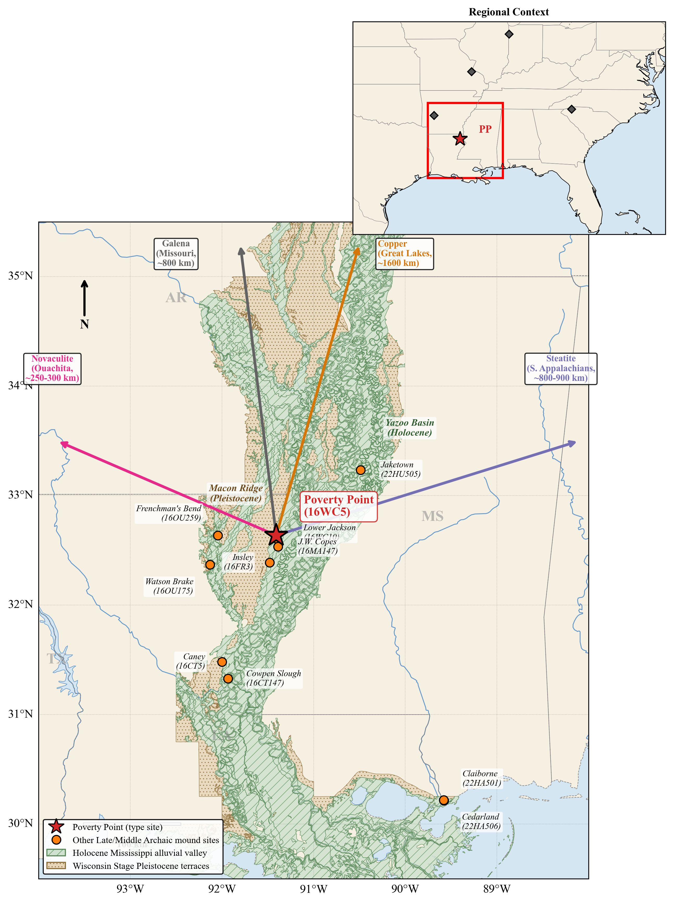

***Figure 1. Location of Poverty Point and other sites in the Lower Mississippi Valley.*** *Surficial geology from the USGS digitization of Saucier (1994). Polygons reproduced under public-domain license (USGS ScienceBase item 59b7ddd6e4b08b1644df5cf6, doi:10.5066/F7N878QN). Holocene deposits (green, diagonal hatching) include all units of the active Mississippi alluvial valley. Pleistocene deposits (tan, stippled) include valley trains and the Prairie Complex flanking the valley. Poverty Point (16WC5; red star) lies at the eastern margin of Macon Ridge, where the Pleistocene terrace meets the Holocene Mississippi alluvial valley.* *Other Late Archaic and Middle Archaic sites are shown as orange circles with site numbers.* *Arrows indicate approximate straight-line distances to exotic-material sources used in the model: copper from the Great Lakes (\~1,600 km), galena primarily from Potosi, Missouri (\~800 km), steatite from the southern Appalachians (\~800-900 km), and novaculite from the Ouachita Mountains (\~250-300 km).*

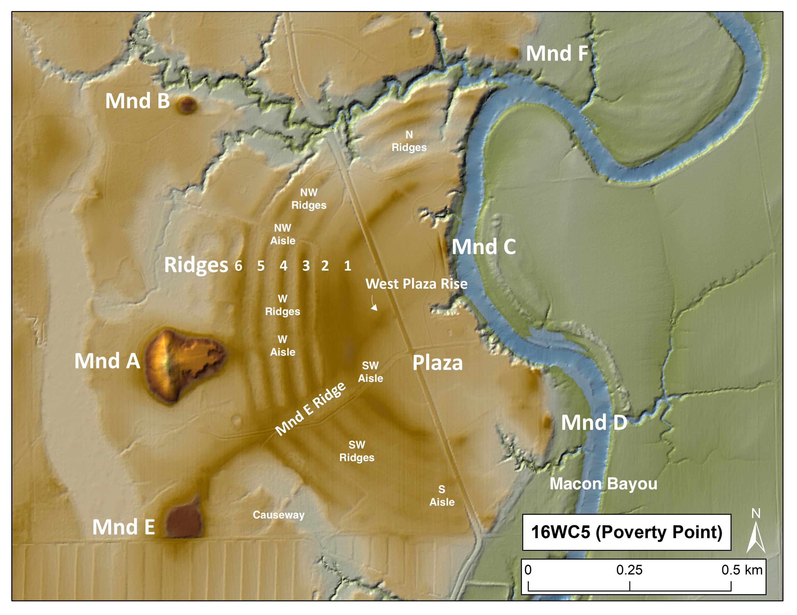

***Figure 2. Poverty Point monumental architecture.*** *LiDAR digital elevation model (elevation in meters, color scale at right) of the Poverty Point core, showing the six concentric C-shaped earthen ridge sets (N, NW, W, SW, and S ridges, numbered 1 to 6 from inner to outer) divided by radial aisles, Mound A (Bird Mound, 22 m), Mounds B, C, D, E, and F, the Mound E ridge and causeway, the central plaza, and the W Plaza Rise. White circles mark the timber post circles identified within and around the plaza by magnetic gradient survey (Clay 2023; Hargrave et al. 2021). Bayou Maçon flanks the core to the east. The constructed monumental core encompasses approximately 140 hectares.*

In addition to its monumental architecture, the Poverty Point site was a focal point for long-distance exchange networks spanning much of eastern North America (Ford and Webb 1956; Gibson 1999; Webb 1968). An estimated 71 metric tons of lithic raw materials, sourced from up to 1,600 km away, accumulated at the site in quantities far exceeding those at any contemporary location (Gibson 1984). Surface collections from the site tabulated in 1982 include 2,790 plummets (predominantly hematite and magnetite), 2,221 steatite fragments, 740 galena masses and shaped objects, 155 copper objects, 395 quartz crystals, and 1,536 lapidary items (Webb 1982). Steatite is consistent with southern Appalachian sources in northern Georgia and Alabama (\~800-900 km) on neutron activation analysis and ICP-MS (Smith 1991; Yates 2009). Copper was traditionally attributed to Lake Superior (\~1,600 km), though recent LA-ICP-MS analyses of six specimens (Hill et al. 2016) suggest that several match Nova Scotia or southern Appalachian sources as well. Galena shows a multi-source pattern: most specimens match Potosi, Missouri (\~800 km), with a smaller component from Upper Mississippi Valley deposits in northwestern Illinois, southwestern Wisconsin, and eastern Iowa, identified by atomic absorption spectrophotometry (Walthall et al. 1982). Material concentration is striking: 95.7% of all steatite and 97% of all galena in the entire Poverty Point regional system are found at the Poverty Point deposit (Smith 1991). Hinterland PP-affiliated sites do contain exotic material, but in quantities that are orders of magnitude smaller than those of the type-site cache (Gibson and Griffing 1994; Mitch 2023). Kidder and Grooms (2025:7) describe the regional flow as strongly asymmetric, with material concentrating at the gathering hub and only personal-effects leakage to visitor-band territories. In the Gibson and Griffing (1994:Table 1) inventory of 10 PP cultural components within 30 km of Poverty Point, even the most exotic-rich hinterland sites carry only modest quantities: maxima are 41 plummets (Arledge), 24 gorgets (Arledge), and 6 beads (Aaron, Insley), against 2,790 plummets and 1,536 lapidary items at the type site, a per-category ratio of roughly 70× for plummets and comparable magnitudes for the other categories. The empirical pattern throughout this paper is therefore a strong asymmetric concentration at the gathering hub, with low-magnitude hinterland traces, rather than the literal absence of outflow.

This pattern is paradoxical when viewed through the lens of standard models of hunter-gatherer behavior. Mobile foragers typically minimize investment in fixed infrastructure and avoid accumulating surplus (Jackson 1986; Kelly 2013). In addition, there is no evidence at Poverty Point for elite burials, differential residential architecture, economic specialization, or coercive hierarchy of the chiefly type (Kidder and Ervin 2018; Kidder and Grooms 2025), traits typically associated with "complexity" (Earle 1997). Why, then, would mobile bands invest so heavily in monuments they would periodically abandon, acquire exotic materials with no apparent utilitarian function, and create such an extreme site hierarchy without centralized authority?

Although Poverty Point is extraordinary in scale, the underlying transition in which mobile populations began to systematically gather at fixed locations and invest collective labor in the landscape is part of a broader Late Archaic pattern across the Eastern Woodlands. Stallings Island on the Savannah River (Sassaman 2006), the Green River shell mounds in Kentucky (Marquardt and Watson 2005), and the Mulberry Creek shell-mound tradition of the Tennessee Valley (Sassaman 2010) record contemporary or earlier expressions, with their own admixture of monumental construction, formal burials, large pits, post-set timber circles, and accumulated raw materials transported from constrained sources. What unites these cases is a transition that the standard typology of forager behavior does not predict: people who would otherwise be expected to maintain residentially mobile, low-investment lifeways begin to aggregate at locations they then transform systematically. Poverty Point is the case where this pattern reaches its furthest extreme. We calibrate the framework developed here to Poverty Point, though its underlying logic applies more broadly across the class.

Existing explanations sit along a continuum from the materialist to the symbolic, each capturing part of the phenomenon (Sassaman 2005). Aggrandizer-tradition models posit institutional forms (hereditary inequality, residential differentiation, coercive authority of the chiefly type) whose direct material correlates are absent at PP (Jackson 1991). Political-economy readings closer to the record (Gibson 1998) develop the case for organized economic activity at the site without committing to the chiefly institutions the aggrandizer logic requires. Evidence for an asymmetric-power infrastructure is not documented. Pilgrimage models cannot explain why this landscape, scale, and tempo (Spivey et al. 2015). Trade-center models account for the exotics but not the monuments (Gibson 1999; Jackson 1991). Incipient sedentism in the agricultural sense is not supported by the subsistence record. The type-site macrobotanical assemblage is dominated by wild nuts and fruits, with only small quantities of native starchy cultigens (maygrass, little barley, chenopod) that fall well short of agricultural dependence (Leone 2014, 2020), and the peripheral-site record is consistent with seasonal rather than year-round residence (Jackson 1986; Thomas and Campbell 1978). More recent culturally embedded accounts have moved past these classical alternatives. Sanger (2023, 2024) reads the site as an intentional institution of containment, in which cyclical aggregation and dispersal prevent the consolidation of authority. Kidder and Grooms (2025) argue that Poverty Point's tempo, scale, and asymmetric material flow signal a revitalization movement in response to environmental and demographic pressures. Grooms (2022) develops a relational-performative reading grounded in Native American philosophies, treating mound building as a communal performance to restore balance amid environmental volatility, and explicitly opposes signaling-intergroup-cooperation accounts that reduce mound building to "transactional epiphenomena." These accounts are valuable for the cultural and motivational logic they specify, and our framework is intended to operate alongside them rather than to displace them. None of them, however, sets out to derive the structural conditions under which such investments become adaptive: *why* mobile foragers should make such large group-level investments at all, *when* the pattern should begin and end, and *where* it should concentrate, in particular, why at Poverty Point and not elsewhere in the region. Each is compatible with the record but does not specify the conditions that would have forced these investments to occur when and where they did.

A second family of explanations is explicitly evolutionary, treating monument construction and exotic acquisition not as markers of social complexity but as costly behaviors whose persistence requires a fitness account. Dunnell (1989) proposed that energy diverted into nonreproductive cultural elaboration, which he termed *waste*, can be adaptive under environmental unpredictability and is selected against as conditions become more predictable, with the form the elaboration takes treated as historically contingent and the underlying mechanism as general. Dunnell and Greenlee (1999) applied this logic to the Hopewell decline. A closely related strand recasts the same insight as bet-hedging: Hamilton (1999) linked the appearance of Middle Archaic mounds to the mid-Holocene onset of ENSO-driven interannual variability, and Madsen, Lipo, and Cannon (1999) formalized the argument, showing that populations investing in elaboration achieve higher geometric-mean fitness under variable conditions than populations that do not. Peacock and Rafferty (2013) brought this framework directly to the Lower Mississippi Valley, arguing that Archaic mounds concentrate where environmental variability is greatest and proposing that Poverty Point marks a shift from household-level to community-level bet-hedging. Neiman (1997) developed a third strand, treating conspicuous consumption as wasteful advertising in which monumental expenditure is an honest signal of competitive ability precisely because it cannot be faked, the same honest-signal logic that costly signaling theory in behavioral ecology derives from a separate intellectual genealogy (Bliege Bird and Smith 2005). These strands are usually presented as competitors, with bet-hedging assigned to variable environments and costly signaling to stable ones (Peacock and Rafferty 2013), and the waste hypothesis has been challenged based on an agent-based model in which individual-level selection drives the propensity to waste toward zero irrespective of variability (Carleton et al. 2019). Overall, the disagreements among these accounts are real, but they concern the level at which selection operates, not whether costly investment can be adaptive.

We propose a framework, grounded in evolutionary theory, that brings these strands together into a single multilevel-selection account. The argument is that Poverty Point represents an adaptive, costly signaling system operating through seasonal aggregation, in which monuments and exotic goods serve as honest signals of cooperative commitment under environmental uncertainty. The framework does not displace the cultural-historical accounts. It addresses the why, when, and where questions through a single mechanism: multilevel selection on band-level investment in monuments and exotic-goods acquisition becomes adaptive once regional environmental uncertainty crosses a critical threshold, the pattern collapses when the \~3300 cal BP fluvial reorganization degrades local ecotone access at the gathering hub and pushes conditions back across the viability boundary (with the regional-uncertainty pathway treated as a parallel hypothesis the existing record does not discriminate; §7.3), and sustained aggregation concentrates at the site with the strongest ecotone-buffered access to multiple independent shortfall regimes (Poverty Point's confluence position satisfies this more strongly than any other LMV monument site). When the structural predictions are evaluated against the LMV record, they account for site location at ecotone-rich settings, pulsed construction tempo, and the rapid post-3300 cal BP collapse following major fluvial reorganization (read as ecotone degradation rather than as regional-uncertainty reduction; see §7.3). The framework specifies necessary conditions for sustained aggregation but does not predict the magnitude of monument investment at any given site, because magnitude depends on the number of bands attained during aggregation, which the framework treats as an external input determined by regional convergence dynamics. The model is silent on the cultural content (the symbols, the ceremonies, the prophetic language) by design. Some such cultural apparatus must develop to coordinate cooperation under above-threshold conditions, but its specific form is not derivable from ecology alone.

Costly signaling models in archaeology have been criticized for producing post-hoc narrative rationalizations rather than testable predictions (Codding and Jones 2007; Quinn 2019). The objection is fair where signaling is invoked as an interpretive frame after the pattern is already known, and where the same logic could equally explain almost any costly behavior. Our approach addresses this critique by deriving quantitative predictions from a formal model whose parameters are anchored independently of the archaeological pattern they are meant to explain, and by specifying *ex ante* what observations would falsify the framework.

This point raises a more general epistemological problem that any explanatory account of Poverty Point must engage. Most of the available archaeological data were generated under culture-historical research programs that prioritized chronology, typology, and spatial distribution: questions of *what* was where and *when*. The resulting record is extensive and well-documented, but its design biases the kinds of inference it can support. It is calibrated to discriminate cultural-historical periods and traditions, not to discriminate among mechanistic explanations for why people built monuments, why aggregations formed at particular locations, or how cooperation networks operated. Perreault (2019) develops this concern at the level of the archaeological record as a whole, arguing that time-averaging, spatial aggregation, recovery bias, and depositional intermittency place hard limits on the resolution at which behavioral inference can operate, and that many archaeological "patterns" do not actually discriminate among the hypotheses they are conventionally invoked to test. The corollary is that explanatory models in archaeology must generate predictions that can be tested at the resolution the record can actually support, not at the resolution a model could theoretically generate. Most existing accounts of Poverty Point sit on the wrong side of this constraint: they are narratives compatible with the record but do not specify the necessary and sufficient conditions for evaluation, so they do not put themselves at risk relative to the record. Part of this article's contribution is to identify which classes of LMV data can carry inferential weight against a structural explanation, which cannot, and what additional data collection would be needed to discriminate the framework from alternatives. We make this accounting explicit in §7.4 below.

The remainder of this article is organized as follows. Section 2 develops the multilevel-selection logic and the index-signal interpretation that distinguish costly signaling from generic cooperation theory. Section 3 describes the agent-based model in which the framework is formalized. Section 4 presents theoretical results: the phase transition, a signaling-versus-cooperation ablation comparison (a controlled experiment in which the signaling mechanism is replaced with random partner choice to isolate how much of the result is attributable to the signaling component itself), and a sensitivity analysis. Section 5 presents the Lower Mississippi Valley regional record at the level of detail required by the empirical evaluations. Section 6 reports the empirical evaluations: type-site calibration; paleoclimate threshold-proximity under Bayesian uncertainty propagation; the Watson Brake near-threshold case; the cross-LMV regional analysis; multi-drainage shortfall buffering; convergence dynamics; the magnitude-prediction limit; within-year aggregation timing; and construction-tempo pulsing. Section 7 places the framework in conversation with the cultural-historical alternatives, transparently develops the magnitude-prediction limits, identifies falsifiable predictions, and discusses implications for hunter-gatherer archaeology more broadly. Section 8 concludes by offering directions on how this model may be evaluated with additional data and research. The full ODD model specification, parameter justifications, equation derivations, and sensitivity analyses are provided in the Supplemental Material.

## 2. Theoretical framework

**Notation.** *Symbols used throughout the paper, grouped by role. Tunable-parameter values, ranges, and sources are given in Supplemental §S2. This table is a reader's glossary of meaning. Derived quantities (e.g.,* $\sigma^{*}$*,* $S(t)$*) are computed from the others rather than set directly.*

| Symbol | Meaning |
|---|---|
| **Environmental uncertainty** | |
| $\sigma$ | Composite environmental-uncertainty index, $\sigma = m\sqrt{20/T}$. Read as *effective shortfall severity over a 20-year reference window*, not a year-to-year standard deviation (§3). |
| $\sigma_{regional}$ | Regional uncertainty before local buffering. |
| $\sigma_{eff}$ | Effective uncertainty experienced at the aggregation site after ecotone buffering, $\sigma_{eff} = \sigma_{regional}(1-\varepsilon)$. |
| $\sigma^{*}$ | Critical threshold: the value of $\sigma$ at which $W_{agg} = W_{ind}$ (strategy crossover). |
| $\sigma_{target}$ | Target $\sigma$ set as input in a simulation sweep, as distinct from the realized $\sigma_{eff}$ a run produces (§4). |
| $\sigma_{LMV}$, $\sigma_{WB}$ | Empirical uncertainty estimates for the Late Archaic LMV (§5.5) and Watson Brake (§6.3). |
| **Ecotone buffering** | |
| $\varepsilon$ | Ecotone advantage: shortfall buffering through negative covariance between locally accessible zone productivity and the regional shortfall driver; enters via $\sigma_{eff} = \sigma_{regional}(1-\varepsilon)$ (§2.3). |
| **Signaling components and incentive** | |
| $\lambda$ | Total signaling incentive, $\lambda = \lambda_{W} + \lambda_{C} + \lambda_{X}$. |
| $\lambda_{W}$ | Within-group-reward component (fitness boost to visibly contributing bands). |
| $\lambda_{C}$ | Conflict-deterrence component. |
| $\lambda_{X}$ | Cooperation-network (buffering) component. |
| $\xi_{X}$ | Tunable weight on the restructured network-density term (§S5.2). |
| | *The model's four signaling components are* $\lambda_{W}, \lambda_{C}, \lambda_{X}$*, and* $\varepsilon$ *(§2.4).* |
| **Costs (deducted in $W_{agg}$)** | |
| $C_{total}$ | Total aggregation cost, the sum of the three below. |
| $C_{signal}$ | Signaling / monument-investment cost. |
| $C_{opportunity}$ | Opportunity cost (foregone foraging while aggregated). |
| $C_{travel}$ | Travel cost to the aggregation site. |
| **Cooperation network and vulnerability** | |
| $k$ | Number of cooperation partners a band has. |
| $k_{0}$ | Baseline (kin) network degree. |
| $k_{agg}$ | Within-aggregation network degree (mature bands). |
| $k_{eff}$ | Effective annual network degree, weighted across gathered and dispersed phases. |
| $k_{\max}$ | Maximum recruitable partners (network saturation). |
| $\alpha(k)$ | Aggregator vulnerability, $\alpha(k) = 1/(1 + \gamma k)$: the share of a shortfall a band absorbs personally. |
| $\beta(k)$ | Independent vulnerability (same functional form, baseline network). |
| $\gamma$ | Per-partner buffering rate (how much each added partner reduces vulnerability). |
| **Monument stock** | |
| $M_{g}$ | Effective monument stock of group $g$. |
| $M_{half}$ | Half-saturation constant in the partner-recruitment function $k(M_{g}) = k_{0} + k_{\max} M_{g}/(M_{half} + M_{g})$. |
| $\delta$ | Monument depreciation (decay) rate. |
| $M_{quality}$ | Monument-quality multiplier in the restructured network term (§S5.2). |
| **Aggregation and population** | |
| $n_{agg}$ | Number of bands attained at the aggregation (crowd size). *Imported as an external input*, not derived by the framework (§6.6). |
| $n_{ind}$ | Number of independent (non-aggregating) bands. |
| $N$ | Total number of bands in the population. |
| $f_{agg}$ | Fraction of the year occupied by aggregation. |
| **Shortfall and conflict parameters** | |
| $m$ | Shortfall magnitude: mean proportional productivity loss in a shortfall year (e.g., $m = 0.45$ → 55% of normal). |
| $T$ | Mean spacing between shortfalls (recurrence interval), in years. |
| $T_{0}$ | Reference-window length for $\sigma$ (the 20-year unit convention). |
| $P_{base}$ | Baseline annual conflict probability. |
| $\mu_c$ | Conflict mortality fraction (the baseline conflict cost). |
| $r$ | Reduction in conflict escalation conferred by visible monumental commitment (aggregators). |
| **Strategy choice and fitness** | |
| $W_{agg}$ | Expected fitness of the aggregator strategy. |
| $W_{ind}$ | Expected fitness of the independent strategy. |
| $B(\lambda)$ | Signaling-benefit term added to aggregator fitness. |
| $\Delta W$ | Fitness difference $W_{agg} - W_{ind}$ driving the annual choice. |
| $p_{agg}$ | Probability a band chooses to aggregate, a logit on $\Delta W$: $p_{agg} = 1/(1 + e^{-\Delta W/\tau})$. |
| $\tau$ | Softmax temperature ($\tau = 0.1$); low $\tau$ gives near-deterministic, payoff-biased choice. |
| strategy dominance | Population fraction of aggregator bands minus fraction of independent bands; ranges $-1$ (all independent) to $+1$ (all aggregator). |
| **Selection accounting and statistics** | |
| $\Delta\bar{p}$ | Year-on-year change in the population frequency of the aggregator strategy (Price equation, §2.1). |
| $p_{g}$ | Strategy of band $g$ (aggregator $= 1$, independent $= 0$). |
| $w_{g}$, $\bar{w}$ | Fitness of band $g$; mean fitness. |
| $S(t)$ | Between-strategy-class selection differential, $S(t) = (n_{agg} n_{ind}/N^{2})(w_{agg} - w_{ind})/\bar{w}$. |
| $\rho$ | Spearman rank correlation (distance-decay and cross-site magnitude tests). |

### 2.1 Multilevel selection and the logic of aggregation

Consider a region of mobile hunter-gatherer bands. Each year, each band either travels to a seasonal aggregation and contributes labor to collective tasks comprising earthwork construction, exotic-goods acquisition, and related forms of landscape investment that accompany monumentality or remains dispersed and forages independently. Contributors pay a short-term cost that non-contributors avoid. As a result, within any aggregation, the non-contributors out-reproduce them. But aggregations stocked with contributors survive bad years (droughts, floods, mast-crop failures) at higher rates than dispersed independents do, because contributors carry cooperation networks they can draw on during shortfalls. Over generations, the aggregation strategy can spread despite the short-term cost it imposes. The balance depends on the environment. When shortfalls are rare, independents\' cost avoidance wins. When shortfalls are frequent, aggregators\' network advantage prevails. Between the two regimes lies a tipping point in environmental uncertainty above which aggregation pays and below which it does not.

The framework operates at two distinct scales, and both are needed to explain Poverty Point. At the *band level*, each band decides each year whether to aggregate based on its own expected fitness: signal-conditional partner formation gives high-display bands more cooperative ties, network buffering reduces their shortfall vulnerability, and prestige accumulation translates into further partner-choice premium in subsequent years. The benefits of joining the aggregation accrue to the individual band that joins, and the strategy choice is made based on the individual band's fitness. This is the engine that produces the year-on-year aggregation events that the archaeology records as construction episodes at the gathering site. At the *population level*, the cumulative effect of many band-level decisions interacts through the cooperation network: more aggregator bands at the gathering produce a denser obligation network, which in turn raises the buffering value of joining, which makes aggregation more attractive at the band level in subsequent years. This positive feedback is what gives the framework its sharp-threshold structure. The two scales are coupled, not independent: per-year decisions are made at the band level, but band-level payoffs depend on emergent population-level properties (network density, partner availability, accumulated monument stock at the gathering), so the band's strategy choice is frequency-dependent rather than fixed.

We summarize the resulting dynamics using the Price equation (Price 1970), which partitions year-on-year change in the population frequency of the aggregator strategy into a selection term and a transmission term (readers unfamiliar with the formalism can read it as bookkeeping that asks, each year, whether aggregating bands are currently out-reproducing independent ones, and tracks how those small yearly differences accumulate):

$$\Delta\bar{p} = \frac{Cov(w_{g}(\sigma),p_{g})}{\bar{w}(\sigma)} + \frac{E(w_{g}(\sigma)\Delta p_{g})}{\bar{w}(\sigma)}$$

For the binary aggregator/independent strategy in the Poverty Point model, where each band is either an aggregator or an independent (no within-band strategy mixing), the formal within-group selection term reduces to zero. The equation reduces to a between-strategy-class selection differential, $S(t) = (n_{agg} n_{ind}/N^2)(w_{agg} - w_{ind})/\bar{w}$, plus a transmission residual that captures strategy switching. This is a selection on a band-level trait under frequency-dependent network feedback rather than the within-group/between-group decomposition. The Sober-Wilson formulation applies to mixed-strategy groups (Sober and Wilson 1998; West, Griffin, and Gardner 2008). The Price equation is useful here as a population-dynamics accounting tool: per-year $S(t)$ tells us whether aggregator bands or independent bands are doing better at the moment, and the cumulative integral $\sum_t S(t)$ tells us how far the population frequency has shifted as a result. For Poverty Point, both quantities matter. Per-year $S(t)$ is small in absolute value (because the per-year fitness differential between strategy classes is bounded by realized shortfall buffering at that year), but its sign is consistent across the post-burn-in interval, and its integral over many decision cycles produces the substantial population shifts (initial $\bar{p} \approx 0.5$ to equilibrium $\bar{p} \approx 0.98$ above threshold; $\bar{p} \approx 0.37$ below) that explain how the LMV system converges on the sustained-aggregation equilibrium archaeology records, or fails to.

The persistent-kin-band structure of the model is important for this cumulative dynamics. Bands fission at size 30, daughter bands inherit half the parent's network, and band identity tracks across years, subject to demographic turnover. This means that bands that consistently aggregate accumulate the network ties and monument-contribution history that fuel the cooperation-network feedback, and the small per-year selection differentials compound coherently along band lineages rather than scrambling across generations. The framework treats this as the operative population-level dynamic for Poverty Point, without positing a separate level of selection beyond what already operates at the band level under frequency-dependent feedback. The empirical Price decomposition from agent-based model output (§S5.5) confirms the expected pattern: per-year $S(t) \approx +0.02$ above the threshold, $\approx +0.05$ at it, and $\approx -0.01$ below it, integrating over the 200-year simulated interval to the population-level shifts that the simulation actually exhibits.

$\sigma$ modulates the balance between the two Price components. In stable environments, the within-group cost dominates. In volatile environments, the between-group benefit dominates. Separating the two regimes is a critical threshold $\sigma^{*}$. Below it, the population converges on independent foraging. Above it, aggregation with cooperative monument investment spreads and persists. The transition is sharp rather than gradual because the cooperation network produces positive feedback: more aggregators yield denser networks, which lower per-band vulnerability and make aggregation more attractive (see §2.4 below). Sharp transitions of this kind are *phase transitions*, analogous to physical systems such as water freezing at 0°C. We expect three qualitative regions in the simulation results: a near-flat low-investment regime, a narrow transition zone, and a near-flat high-investment regime.

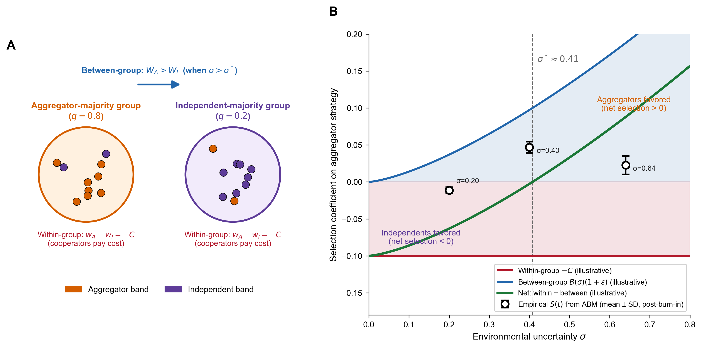

***Figure 3. The cost and benefit components of the aggregator strategy.*** *(A) Schematic of the band-level selection logic. Aggregator bands pay a cooperation cost denoted by* $C$ *(monument labor, opportunity cost of travel, and time at the gathering), which independent bands avoid. Between-strategy fitness depends on whether the network-mediated buffering value of joining the aggregation exceeds this cost. An aggregator-majority population (*$q = 0.8$*) supports a denser cooperation network, raising the buffering value of joining. An independent-majority population (*$q = 0.2$*) supports a thinner network. (B) Net selection on the aggregator strategy as a function of environmental uncertainty* $\sigma$*, decomposed into the constant-cost component (red,* $- C$*) and the network-buffering benefit component (blue,* $B(\sigma) \cdot (1 + \varepsilon)$*), which grows with shortfall frequency. The smooth analytical curves are illustrative under simplified parameterizations chosen so the schematic threshold lands near our calibrated* $\sigma^{*} \approx 0.40$*. Black points (with* $\pm 1$ *SD error bars) overlay the empirical between-strategy-class selection differential* $S(t) = \mathrm{Cov}(w_g, p_g)/\bar{w}$ *computed from agent-based-model output at three* $\sigma$ *scenarios spanning the threshold (below-threshold* $\sigma = 0.20$*, near-threshold* $\sigma = 0.40$*, above-threshold* $\sigma = 0.64$*, 5 replicates each, post-burn-in pooled across years; §S5.5). The empirical anchors confirm the analytical prediction: between-strategy-class selection is negative below* $\sigma^{*}$ *and positive above it, with the sign reversal occurring near the framework's analytical threshold.*

The logic is not new in archaeology. Multilevel selection is the formal apparatus underlying long-running discussions of scalar tension (Johnson 1982), risk-pooling and storage (Halstead and O'Shea 1989), and cooperation under uncertainty (Hawkes 2000; Winterhalder 1986). What our framework adds is a sharp-threshold prediction. We are not, however, claiming that greater uncertainty produces a steadily larger response. Instead, the relationship between uncertainty and cooperation is not a smooth gradient. Aggregation either occurs and persists, or it does not, with the switch concentrated within a narrow range of conditions. An archaeological intuition that looks for a continuous correlation between environmental stress and the scale of monument investment will not find one. The prediction is a step from one regime to the other.

Costly-signaling models in archaeology have traditionally been developed for territorial groups competing for fixed positions in a landscape, where the signal carries a "we can defend this place" message, and monuments serve as deterrents directed at neighboring groups. For mobile hunter-gatherer bands, the optimization problem is different. Bands are not territorial (Kelly 2013). They choose whether to aggregate at a central location, how long to remain, and how much to invest in collective construction. The signal function shifts from deterrence to attraction. It now says "we will cooperate reliably" and serves to identify trustworthy partners among bands that may have only weak prior contact with one another. This shift requires fitness functions that reflect a fission-fusion social structure in which cooperation is re-established with partial strangers each year. It makes the network-feedback dynamic central rather than peripheral: the value of joining the aggregation depends on who else is joining, which depends in turn on whether the network has accumulated enough cooperative density to make joining worthwhile.

### 2.2 Honest signals: index, not handicap

The investment in monumentality serves as a signal within and between bands. These signals are considered "costly" since they are an investment of energy and resources. Signaling theory in archaeology distinguishes two kinds of reliable signals. *Handicap* signals (Zahavi 1975) are reliable because they are wasteful: only individuals with surplus capacity can afford them, so the signal correlates with quality precisely because of the cost. *Index* signals (Bliege Bird and Smith 2005) are reliable because they are physically constrained: only individuals who actually possess the underlying quality can produce them, so the signal correlates with quality regardless of cost. A handicap signal works by being expensive. An index signal works by being unfakeable. Recent reviews in evolutionary biology have moved away from strict interpretations of the handicap (Penn and Szamadó 2020), and the signals at archaeological aggregation sites fit more naturally within the index framework. A band cannot display Great Lakes copper unless it has actually obtained Great Lakes copper, and a band cannot have basket-built a substantial mound without having mobilized many bodies for many days. The cost in both cases is a consequence of producing an unfakeable signal, not the mechanism that enforces honesty. This distinction matters because the signaling model does not require signals to be wasteful displays. It requires only that they correlate reliably with the cooperative capacity they advertise. The framework operationalizes index signaling in the Spence-Bliege Bird-Smith sense, in which the signal correlates with cooperative capacity through unfakeable production. This is distinct from the credibility-enhancing display (CRED) of Henrich (2009), in which the same costly act serves to transmit a belief or commitment to cultural learners. Brusse, Handfield, and Zollman (2022) develop the operational distinction between the two architectures. Both channels can operate through the same monument, but the framework's discriminating predictions come from the index-signal channel.

For a signaling framework to do empirical work, it must specify four things: who is signaling, who is receiving, what quality is being signaled, and how the receiver responds. At an aggregation gathering: (1) the **signaler** is an aggregating band; (2) the **receivers** are other bands at the gathering, both established partners and prospective ones drawn from across the regional network; (3) the **quality being signaled** is cooperative reliability, operationalized as a band's likelihood of contributing labor to collective construction and reciprocating obligations during shortfalls; (4) the **receiver response** is preferential partner selection, with bands forming and strengthening reciprocal obligations with high-signal partners over the course of an aggregation season.

The framework requires a signal-conditional response from the receiver. A "signal-conditional response" is a behavior whose form or magnitude depends on the signal an interaction partner has displayed: receivers do not respond uniformly but instead calibrate cooperation, deference, or aggression to the quality of information the signal conveys. We implement this process in the agent-based model as three coupled rules. First, agents preferentially form ties with partners who display larger signals, so the probability of forming a relationship scales with the partner's display level. Second, when a shortfall hits, agents call on their network for help in order of tie strength, drawing first from their strongest partners and moving down the list until the need is met. Third, the density of these obligation ties at a gathering site directly reduces the effective shortfall experienced there ($\sigma_{eff}$), because dense networks buffer local losses through pooled support. Full implementation specifications are given in §S1.6. Comparison runs verify that the implemented rules behave as specified by the analytical framework, and parameter sweeps near the critical threshold examine how the within-group reward parameter (which scales the strength of the signaling channel) shifts the threshold location (§4.3). These tests confirm the model is working as intended, but they are not where the framework earns its empirical traction. The distinguishing prediction is based on the asymmetric pattern of help flowing through the obligation network, as evaluated in §6.1. The threshold-location analysis in §4.3 shows that a regime shift occurs. The asymmetric-flow signature in §6.1 makes the framework testable against archaeological data.

Earthwork construction is an unusually clean index signal because it is inherently collective and physically unfakeable. Moving earth in baskets at the Late Archaic mound sites (Ford 1955; Ortmann and Kidder 2013; Sherwood and Kidder 2011) requires many people to work together for sustained periods, in real time, at a fixed location. A band's contribution is visible to other participants in the construction event: others can see who carries baskets, who hauls posts, who digs. Non-contributors are immediately identifiable, which minimizes free-riding. The construction itself requires cooperation, so signaling produces the cooperative behavior it advertises. Bands that have invested heavily in mound or ridge fill at a particular site also have strong incentives to return, because abandoning the system means losing the value of past investment. The sunk cost binds participants and lets other bands preferentially cooperate with committed partners. Other classes of Late Archaic landscape investment (large excavated pits, prepared activity surfaces, formal burial concentrations, and post-set timber circles) share the same labor signature and read the same way under the framework. The bulk of our empirical evaluation, however, focuses on the volume of monumental earthwork because these structures are quantitatively tractable measures of accumulated signaling effort.

**The signal half-life.** The value of a completed earthwork as an honest signal of *current* cooperative capacity has a half-life. Signaling theory requires that the signal reliably indicate the signaler's properties at the time of the receiver's response (Bliege Bird and Smith 2005; Hawkes and Bliege Bird 2002). A finished mound remains physically present after the bands that built it have dispersed, fissioned, died, or been replaced. Over time, the feature no longer reliably indicates the cooperative capacity of bands now attending. Free-riders can occupy a complex without having contributed, and a receiver cannot easily distinguish a band that just hauled baskets from one whose ancestors did. The signal value of any individual construction event, therefore, decays even as the mound persists, which is why ongoing construction is necessary rather than optional. Each new episode renews the signal on the timescale relevant to current partner choice. The framework predicts a pulsed, episodic construction tempo, with many separate, honest signals stacked over the active interval, rather than a single durable display whose signal value persists for centuries. The Eastern Archaic record matches this expectation: build-decommission-rebuild sequences in plaza post circles, multi-stage activity surfaces beneath terminal mound caps, and the dozens of distinct ridge construction components documented at Poverty Point through recent geophysical and geoarchaeological work all fit the expected episodic pattern. The same logic recasts eventual collapse: a system that depends on continuous re-signaling is vulnerable not only to threshold-crossing environmental change but also to any disruption that interrupts the construction cycle. Henrich's (2009) credibility-enhancing-display argument converges on the same prediction from an independent direction: a costly act witnessed by cultural learners reduces their credence in alternatives to the practice's underlying belief, and a standing monumental landscape extends this logic temporally by carrying long-duration evidence that past actors paid the cost. The two arguments reinforce while maintenance continues (the current index value plus the persistent-CRED value) and decouple under abandonment, when the index value decays first, and the persistent-CRED value follows the landscape's physical decay. Continuous reinvestment is necessary to sustain either channel.

Exotic goods complement the collective construction signals at the individual scale. The imported materials (copper from the Great Lakes, Maritime, or southern Appalachian sources at \~1,000-1,600 km; steatite from the southern Appalachians at \~800-900 km; galena from Missouri at \~800 km) carry distinctive observable physical properties (color, density, sheen, working characteristics) that distinguish source material from locally available substitutes for a contemporary observer. Geochemical signatures, traceable to specific sources through analyses such as neutron activation, ICP-MS, and atomic absorption spectrophotometry, allow us to confirm provenance after the fact. The signal is unfakeable in the index sense because a band cannot display source material without having actually obtained it through direct travel or partnership with bands at the source. Possession demonstrates resource surplus, long-distance network connectivity, and willingness to invest in the exchange system, all qualities that make a band a desirable partner.

Poverty Point Objects (PPOs), the locally-produced fired-earth cooking objects that occur in tens of thousands across the Late Archaic LMV (Hays 2019; Webb 1982), are dense enough in the regional record that an external reader of the LMV literature might reasonably expect them to feature in a signaling argument. We are explicit that the framework's current implementation does not formalize PPOs as a signaling channel, and the reasons developed below apply more strongly to per-band PPO possession than to aggregate PPO production volume at a site. The unfakeability criterion the framework uses for index signals (as described above) is sharper than "expensive": it requires that the signal cannot be produced without the underlying quality the receiver wants to know about. For earthworks, that quality is the mobilization of cooperative labor at the gathering, and basket-built fill cannot be produced without it. For imported exotics, the quality is directly related to travel to or partnership with bands at the geological source. A galena nodule from Potosi, Wisconsin, cannot be produced by a band that has not (directly or through a known visitor-band partner) accessed Potosi material. PPOs do not have this property at the band level: locally produced fired-earth cooking objects can be made by any band with access to local clay and fuel, including bands that neither attended the gathering nor contributed labor. PPO possession does not reliably index participation as a visitor band. The same logic applies to locally-produced lithic forms widely distributed in the regional record (projectile points, Jaketown perforators). These artifacts are produced from materials available to any band in the LMV and are not source-constrained in the way that copper, galena, or steatite are. They, therefore, do not function as band-level index signals of visitor-band participation, even though they appear in large quantities at the type site. There is also no evidence that PPO possession or display operated through the partner-choice premium on which the framework's band-level signaling apparatus relies. PPOs are widely distributed among LMV-affiliated populations rather than concentrated at the gathering site, unlike exotic materials. The framework's formalized signaling channels are therefore earthworks (i.e., features that are collective and group-level) and imported exotic goods (i.e., artifacts that reflect the individual-band level). PPOs are not in this set, not because they are cheap (cost is incidental), but because they fail the unfakeability criterion at the band level.

A weaker form of the signaling argument could, in principle, apply to PPO production *volume* at the site rather than PPO *possession* at the band level. The framework reads excess monument volume beyond the utilitarian baseline as a group-level index of collective labor mobilization at the gathering. The same logic could apply to PPO deposits at the Poverty Point site if their aggregate quantity exceeds the cooking needs of the documented occupation. Hays (2019) interprets PPO concentrations at Poverty Point as feasting deposits, a reading consistent with this signaling interpretation. We do not formalize this group-level PPO channel in the present analysis for two reasons. First, per-band attribution is not possible (PPOs do not carry maker-identifiable marks), so PPOs cannot operate as the band-level signal that exotic goods provide. Second, operationalizing the group-level reading would require a quantitative baseline of cooking needs against which excess production could be measured, which the LMV literature has not yet developed. We identify a cross-LMV test of PPO deposit density against site-level aggregation intensity as a productive empirical extension in §7.4.

PPOs nonetheless carry information about regional social structure, though on a different intellectual register: cultural transmission rather than signaling. Functionally, PPOs are a cooking technology that solves a practical problem and would be expected to spread on its own merits wherever the same problem is faced. Stylistically, the *forms* they take (the specific size classes, surface treatments, and morphological variants documented across LMV assemblages) are more variable than functional efficiency requires. Cooking performance is largely insensitive to whether an object is grooved, melon-shaped, biconical, or cylindrical, so the distribution of formal variants is shaped by who is teaching whom rather than by the environment of use. Under cultural-transmission theory, this is what makes form informative as a tracer of social-learning networks: stylistic similarity records the path through which the manufacturing tradition was transmitted, not the cooking problem the objects solve (Pierce 1998). PPO formal variation is therefore a productive record class for studying the cultural-affiliation networks within which the LMV system operated. It serves as transmission data rather than signaling data, and we make no signaling claim from it. Empirical work testing whether PPO stylistic-variant frequencies map onto the same band-level network structure that the framework's exotic-goods signal traces (a different question than whether PPOs are signals) is identified in §7.4 as a productive extension.

### 2.3 The ecotone advantage

The probability and stability of aggregation depend on more than uncertainty alone. They also depend on whether the aggregation site itself can support large gatherings during extended seasonal stays. We represent this buffering with a single parameter $\varepsilon$, and the effective uncertainty at the aggregation site is

$$\sigma_{eff} = \sigma_{regional}(1 - \varepsilon)$$

The mechanism $\varepsilon$ encodes is shortfall buffering through *negative covariance* between locally accessible zone productivity and the regional shortfall driver. When local zones share the same shortfall driver (e.g., a single drainage hit by a regional drought, a single floodplain drowned by a flood pulse), aggregator bands at the gathering experience the same shortfall as bands dispersed in single-zone territories elsewhere. $\varepsilon$ is small. When the local zones draw on independent shortfall drivers (e.g., drainages with different hydrographs, uplands and lowlands responding to different precipitation modes), some local zones are typically producing during regional shortfalls. $\varepsilon$ is large. The framework's prediction is, therefore, not that aggregation concentrates at the most diverse location in raw zone count, but at the location with the strongest negative covariance between accessible-zone productivity and regional shortfall. Confluence positions integrating multiple canoe-accessible drainages with non-synchronized hydrographs maximize $\varepsilon$.

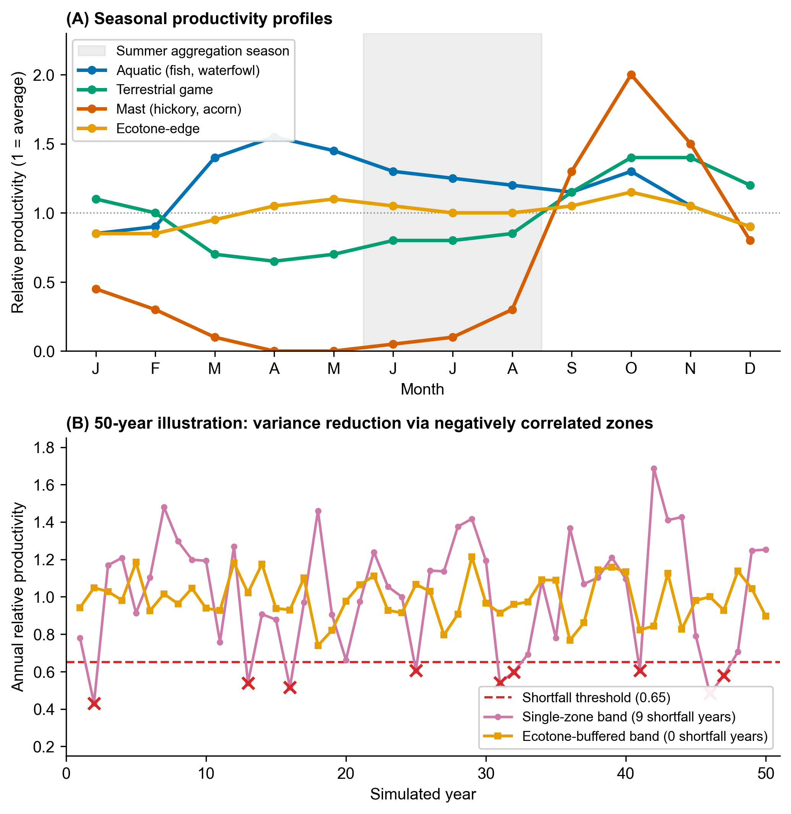

***Figure 4. The ecotone advantage: how multi-zone access buffers shortfall.*** *(A) Seasonal productivity profiles for the four resource zones available at a representative LMV aggregation site. Aquatic resources (e.g., floodplain fish, summer waterfowl, overwintering ducks November-March, spring and fall flyway peaks), terrestrial game (e.g., mammals, fall-winter peak), mast (sharp fall peak), and ecotone-edge productivity (moderate but stable year-round) follow staggered seasonal cycles. The shaded band marks the summer aggregation season. Because the zones peak at staggered times, several resource types overlap in summer and at least one zone remains productive in most other seasons; this temporal complementarity, not summer abundance alone, is what the ecotone advantage exploits (Panel B). (B) Year-by-year resource availability for two hypothetical bands over a 50-year stochastic simulation: a single-zone band (purple) experiences high inter-annual variability and crosses the shortfall threshold (red dotted) in 9 of 50 years, while an ecotone-buffered band drawing from two negatively correlated zones (orange) experiences substantially smoothed productivity and zero shortfall years. The mechanism* $\varepsilon$ *encodes this variance reduction, not raw zone count.*

The ecotone insight is not novel in hunter-gatherer archaeology. Jackson (1986, 1989; see also Gibson 1973, 1994) developed it explicitly in subsistence work for the LMV, and Ward (1998) documented the wild-resource diversity (mast, fruits, and native EAC seeds across multiple habitats at Poverty Point and J.W. Copes) on which the multi-zone interpretation rests. What the model adds is an explicit operationalization of the $\varepsilon$ as covariance-based shortfall buffering, distinguishing it from the raw zone count. A measured operationalization at the regional scale, using modern hydrograph data as a first-order proxy for Late Archaic drainage independence, is developed in §6.5.

### 2.4 Fitness functions and the critical threshold

Bands choose annually between the **aggregator** strategy (travel to the site, invest in monuments and exotics, and form reciprocal obligations) and the **independent** strategy (remain dispersed and forage independently). A band that aggregates *pays* to do so (travel, time away from foraging, labor on monuments) and *gains* from doing so (cooperation network for bad years, reduced conflict via visible commitment, social rewards for visibly contributing). A band that stays independent avoids the cost but bears the full brunt of any shortfall alone. Whether aggregation is worth it depends on how often shortfalls occur, how vulnerable an unaggregated band is, and how much the cooperation network can buy when needed. The aggregator fitness function is

$$W_{agg}(\sigma,\varepsilon) = (1 - C_{total}) \cdot (1 - \alpha(k_{eff}) \cdot \sigma_{eff}) \cdot (1 - \mu_c(1 - r)P_{base}) + B(\lambda)$$

Each multiplicative factor is a probability-of-success term applied in sequence: the band first pays aggregation costs, then survives any shortfall, then survives any conflict, and the signaling benefit accrues additively on top. The aggregation-cost factor $(1 - C_{total})$ deducts travel, labor on monuments, exotic-goods investment, and foregone foraging. The shortfall-survival factor $(1 - \alpha(k_{eff}) \cdot \sigma_{eff})$ captures the buffering advantage of aggregators: cooperation networks allow them to call on partners in bad years, and ecotone access lowers the effective uncertainty they face in the first place. The conflict-avoidance factor encodes the reduction in the probability of escalation from the assessment mechanism of Enquist and Leimar (1983), in which visible monumental investment is read as commitment. The signaling benefit $B(\lambda)$ adds a within-group fitness boost to bands that contribute, scaled by the total signaling incentive $\lambda = \lambda_{W} + \lambda_{C} + \lambda_{X}$, which combines the within-group reward, the conflict-deterrence component, and the cooperation-network component. We refer to these three terms, together with the ecotone parameter $\varepsilon$, as the model's four signaling components. The ablation experiments in §4.3 and §S5.4 switch each one on and off, individually and in combination.

The vulnerability function $\alpha(k) = 1/(1 + \gamma k)$ is computed from the band's cooperation network rather than set as a free input. Here $k$ is the number of cooperation partners a band has access to, $\gamma$ controls how much each partner reduces vulnerability, and $\alpha(k)$ is the share of a shortfall a band absorbs personally rather than absorbing through partner help. The functional form has the standard properties expected of risk-pooling: more partners lower vulnerability, but each additional partner adds less than the last. Independents have only baseline kin connections ($k_{0} = 0.3$). Aggregators with mature monument stocks reach within-aggregation network degree $k_{agg} \approx 4$ to $6.2$. Aggregation occupies only a fraction $f_{agg} \approx 0.25$ of the year, and the ties formed there decay during the dispersed phase. Therefore, the effective annual vulnerability $\alpha(k_{eff})$ is a weighted average across the gathered and dispersed periods rather than the within-gathering value alone.

The independent fitness function is simpler:

$$W_{ind}(\sigma) = (1 - \beta(k_{0}) \cdot \sigma) \cdot (1 - \mu_c \cdot P_{base})$$

Independents avoid the aggregation cost but face full regional uncertainty with only baseline networks and gain no signaling benefit. Parameter values are estimated from ethnographic analogy, archaeological inference, and theoretical constraint. The full justifications are in Supplemental §S2, and sensitivity analyses across all 13 parameters are in Supplemental §S3.

The **critical threshold** $\sigma^{*}$ is the value of environmental uncertainty at which the two fitness functions cross over: below $\sigma^{*}$ the independent strategy pays better, above it the aggregator strategy pays better. We find $\sigma^{*}$ numerically using Brent's (1973) method, a standard one-dimensional root-finder that locates where a function changes sign. The difference $W_{agg}(\sigma) - W_{ind}(\sigma)$ rises steadily with $\sigma$ across the range we use, because aggregation costs do not depend on $\sigma$ while shortfall losses accumulate faster for independents than for aggregators (the cooperation network and ecotone access buffer part of the loss). The difference is negative at low $\sigma$ and positive at high $\sigma$. We verified this single-crossing behavior numerically. There are no cases of multiple thresholds. At zero ecotone advantage and 25 bands, $\sigma^{*} \approx 0.57$. With moderate ecotone advantage ($\varepsilon = 0.35$), $\sigma^{*} \approx 0.40$. With stronger ecotone access ($\varepsilon = 0.49$), $\sigma^{*} \approx 0.36$. Lower thresholds mean aggregation becomes adaptive under milder environmental uncertainty.

The cooperation network feeds back on itself, which is what makes the transition at $\sigma^{*}$ sharp rather than gradual. In plain terms, more investment in monuments builds a larger network of cooperative partners. A larger network reduces how exposed each band is to bad years, lower exposure makes signaling more rewarding, and higher reward draws more monument investment. The four steps form a closed loop, and the loop has the property that small differences in initial conditions can amplify into qualitatively different long-run behavior, producing either a population stuck at low investment or one stuck at high investment with little in between.

Monument investment builds an effective monument stock $M_{g}$. The stock attracts cooperation partners through a saturating function $k(M_{g}) = k_{0} + k_{\max}M_{g}/(M_{half} + M_{g})$. This functional form (sometimes called Michaelis-Menten) has the property that partners are recruited steadily at low stock and then plateau $k_{0} + k_{\max}$ as the maximum capacity is reached. A larger network reduces vulnerability through $\alpha(k)$. Lower vulnerability increases the cooperation-network component of the total signaling incentive $\lambda$. A higher $\lambda$ raises the optimal level of signaling investment, leading to more monuments. The four steps form a closed loop in which $\lambda$ depends on $M_{g}$ and $M_{g}$ depends on $\lambda$. We solve this loop computationally by what mathematicians call *fixed-point iteration*: pick a starting value for $\lambda$, compute the monument stock that value implies, recompute $\lambda$ from that stock, and repeat until the value stops changing. The "fixed point" is the value of $\lambda$ that produces itself when fed back through the loop. To prevent the iteration from overshooting and oscillating, each new estimate is set to a 50/50 average of the most recent estimate and the previous one (standard numerical damping). We stop when successive estimates differ by less than $10^{- 6}$. Across a 30-point sweep of $\sigma$ from 0.10 to 0.95, the iteration converges in 18 steps every time, and runs starting from very different initial values at $\sigma \in \{ 0.30,0.50,0.70\}$ all reach the same monument stock to within 1 part in $10^{4}$. The equilibrium is therefore unique at the parameter values we use. The answer the model returns does not depend on the analyst's starting guess.

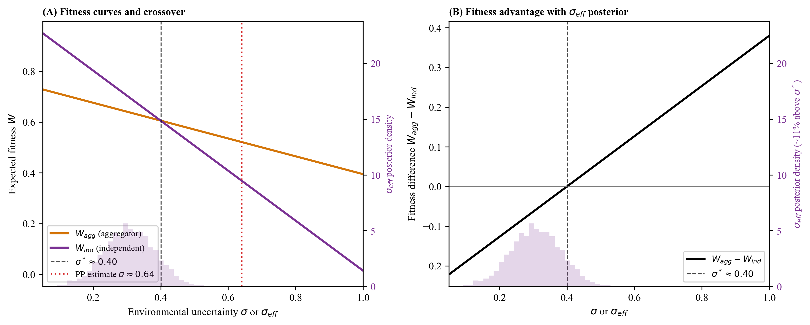

***Figure 5. Fitness crossover and the critical threshold.*** *Expected fitness for aggregator (orange) and independent (purple) strategies as a function of environmental uncertainty* $\sigma$*. The strategies cross at* $\sigma^{*} \approx 0.40$ *given a given moderate ecotone advantage (*$\varepsilon = 0.35$*). Below* $\sigma^{*}$*, the independent strategy yields a higher expected fitness. Above* $\sigma^{*}$*, the aggregator strategy does. The fitness difference* $W_{agg} - W_{ind}$ *is monotonically increasing in* $\sigma$*, so the threshold is unique.*

## 3. The agent-based model

The analytical framework laid out in §2 derives an equilibrium prediction from four specified mechanisms: signal-conditional partner formation, cooperation-network buffering, ecotone-mediated effective uncertainty, and the lambda-sigma feedback that fixes the critical threshold. What it does not establish is whether those mechanisms, when operating together as a dynamic system rather than at analytical equilibrium, actually produce the aggregate behavior the theory predicts. This is what Lewontin (1974) calls *dynamic sufficiency*: whether a model's specified state variables and transition rules contain enough machinery to generate the behavior the theory attributes to it. Dynamic sufficiency is distinct from *empirical sufficiency*, the question of whether the theory accounts for the observed archaeological record. Both are necessary for an account to be persuasive, and they are addressed in different parts of this article: dynamic sufficiency in §4, empirical sufficiency in §6.

The agent-based model addresses the dynamic-sufficiency question. It implements the framework's individual-level mechanisms as agent-level rules. It asks whether the aggregate-level patterns predicted by the theory (the sharp phase transition near $\sigma^{*}$, the lock-in dynamics in the bistable zone, the self-sustaining feedback between monument accumulation and network buffering) actually emerge from those rules under stochastic, finite-population, spatially explicit conditions. The analytical equilibrium predictions could fail at the dynamic level for several reasons: stochastic fluctuations could erase the threshold, finite-population effects could prevent the network feedback from establishing itself, or the ordering of agent decisions could matter in ways that the analytical derivation hides. The ABM tests directly whether the analytical predictions hold up under these complications. If they do, the framework passes the dynamic-sufficiency test: the mechanisms the theory specifies are sufficient, when implemented dynamically, to produce the behavior the theory attributes to them. Whether they also account for the Late Archaic LMV record is the empirical-sufficiency question taken up in §6.

We implemented the framework as an agent-based model in Python. In this model, individual hunter-gatherer bands interact with each other and with their environment over simulated years, and population-level outcomes (i.e., monument volume, exotic-goods totals) emerge from accumulated decisions rather than being assumed in advance. The model integrates three modules. First, there is an **environment module** representing a heterogeneous four-zone landscape with seasonal cycles and stochastic shortfalls. Second, we use an **agent module** that implements band-level state (i.e., location, resources, monument investment, exotic holdings, obligation network), annual strategy choice (best-response between aggregator and independent), action execution, and reproduction (i.e., births and deaths weighted by fitness, fission at band size \> 30). Third, we implement a **simulation controller** that orchestrates the annual aggregation-dispersal cycle.

For readers familiar with the ODD protocol (Grimm et al. 2010), the model summary is as follows: The time step is one year, partitioned into a four-phase annual cycle of spring dispersal, summer aggregation, fall harvest, and winter reproduction. All bands act synchronously within each phase, evaluating and updating their state simultaneously, so that early-acting bands do not condition the choices available to later-acting ones. Once per simulated year, each band chooses between the aggregator strategy (investing in costly displays and obligation ties) and the independent strategy (foregoing display and relying on local production). The choice is a response to the fitness functions defined in §2.4, evaluated against the population state at the start of that year (the previous year's realized attendance, the accumulated monument signal stock visible at the site and the signaling incentive it implies, and recent shortfall history through the realized-variance adjustment to $\sigma$). Bands do not always pick the higher-payoff option. Instead, they choose probabilistically. For the binary aggregator-versus-independent choice, the model uses a logit on the fitness difference $\Delta W = W_{\mathrm{agg}} - W_{\mathrm{ind}}$, with $p_{\mathrm{agg}} = 1 / (1 + e^{-\Delta W / \tau})$ and a softmax temperature $\tau = 0.1$. Low $\tau$ produces a near-deterministic choice. High $\tau$ produces nearly a random choice.

We use the low value, so bands are strongly biased toward the higher-payoff strategy but occasionally choose the lower-payoff one. This small amount of decision noise prevents the unrealistic case in which all bands switch strategies in lockstep the moment expected payoffs cross, and it generates path dependence near the critical threshold where the two strategies have nearly equal expected fitness. The model also implements a small memory effect that adjusts $\Delta W$ by $\pm 0.05$ before the logit is applied: if a band has been aggregating and its recent five-year fitness is above its long-term mean, the recent-success signal nudges $\Delta W$ by $+0.05$ in favor of continuing to aggregate (and symmetrically for the independent strategy and for the reverse case where recent fitness is below the long-term mean). The adjustment is at the same magnitude as the per-step sensitivity of $\Delta W$ near $\sigma^{*}$, so it can plausibly shift the threshold location. A sensitivity probe (`scripts/analysis/memory_effect_probe.py`) measures the effect directly: removing the memory adjustment shifts the simulated crossing from realized $\sigma \approx 0.38$ to $\approx 0.40$, a shift of about +0.02 (roughly 5% of the threshold value). The memory effect therefore nudges the threshold location detectably but does not change the phase-transition structure, and the two variants bracket the analytical $\sigma^{*} = 0.40$. In that zone, the early stochastic choices of a few bands shift the population state, altering the fitness landscape that subsequent decisions face, and producing the lock-in and hysteresis effects characteristic of real cultural transitions. Births and deaths are weighted by realized fitness. Bands fission deterministically at size 30, with daughter bands inheriting the parent band's monument-investment history and obligation network at half weight. Stochasticity enters through annual environmental shortfall draws (onset Bernoulli with per-year probability $1/T$; event magnitude drawn from a clipped normal centered on $m$; event duration scaling with magnitude), the softmax decision noise just described, and random initial obligation-network seeding. The complete ODD specification, submodel equations, and source code documentation are in Supplemental §S1.

The four resource zones are: (1) aquatic resources (e.g., floodplain fish, summer waterfowl, and overwintering ducks November-March, with peaks during spring and fall flyway migrations); (2) terrestrial game (e.g., deer and other mammals, peaking in fall-winter); (3) mast resources (hickory and acorn, with a sharp fall peak); and (4) ecotone-edge resources providing moderate but stable year-round productivity. Each zone has its own seasonal productivity profile. The staggered seasonal peaks create the multi-zone buffering effect captured by the ecotone advantage parameter $\varepsilon$.

Stochastic shortfalls (e.g., drought years, exceptional floods, mast-crop failures) are characterized by two parameters: how often they occur (*recurrence frequency*) and how badly they reduce productivity when they occur (*magnitude*). The model collapses these two into a single composite uncertainty index, $\sigma = m \cdot \sqrt{20/T}$, where $m$ is the average proportional productivity loss in a shortfall year (so $m = 0.45$ means a shortfall year delivers 55% of normal productivity) and $T$ is the mean spacing between shortfalls. The derivation (Supplemental §S1.4) treats shortfalls as random events that arrive at an average rate of one per $T$ year, each reducing that year's productivity by $m$. Standard probability theory then gives the standard deviation of annual productivity loss across many years as $m/\sqrt{T}$. We multiply by $\sqrt{20}$ to express this in 20-year-reference units, so that a shortfall regime with $T = 20$ produces $\sigma = m$. The intuitive consequence is that frequency and magnitude trade off. A regime with severity-0.5 shortfalls every twenty years yields the same $\sigma$ as a regime with severity-0.25 shortfalls every five years, because both expose a band to the same cumulative variance over a generation-scale horizon.

A note on interpretation is in order, because the symbol $\sigma$ is conventionally read as a statistical standard deviation. In the fitness functions of §2.4, $\sigma$ does not enter as the year-to-year standard deviation of resource availability. It enters as a multiplicative penalty that discounts expected fitness in proportion to the cumulative severity of shortfalls over a 20-year reference window. The plain-language reading is therefore "effective shortfall severity index over a 20-year horizon," not "year-to-year variability in harvest yields." A higher $\sigma$ means an environment in which shortfalls are more frequent, deeper, or longer-lasting over the reference window. It does not describe the spread of any single year's outcome. The choice of a 20-year window is a unit convention rather than a substantive parameter. A shorter reference window (say, 5 years) would yield numerically smaller $\sigma$ values, while a longer one (say, 50 years) would yield larger values, because more shortfalls accumulate over a longer span. Critically, this rescaling does not affect the comparisons that drive the analysis. The empirical estimate $\sigma_{LMV}$ (i.e., the severity inferred from late-Holocene Lower Mississippi Valley paleoclimate proxies; §5.5) and the model-derived critical threshold $\sigma^{*}$ are computed on the same scale, so their ratio is invariant under any consistent change of reference window. We confirm this in §S1.4: across $T_{0} \in \{ 5,10,20,50\}$ years, the ratio $\sigma_{LMV}/\sigma^{*} = 1.59$ is preserved exactly. This invariance is what makes threshold-proximity comparisons meaningful, and we rely on it when reporting results below.

The aggregator fitness function combines vulnerability and shortfall severity multiplicatively, as $(1 - \alpha(k_{eff}) \cdot \sigma_{eff})$, where $\alpha(k_{eff})$ is the vulnerability coefficient (i.e., the fraction of unbuffered shortfall loss the band actually experiences given its network) and $\sigma_{eff}$ is the effective shortfall severity. The plain-language reading of the function is "fraction of productivity lost = vulnerability × severity." This product is the principled choice given the meanings of the two factors: $\alpha$ does not denote a fractional loss in its own right. Instead, it modulates how a $\sigma$-induced loss is perceived, and the multiplicative coupling ensures that modulation operates on the right scale. We considered two alternative couplings discussed in the broader risk-pooling literature, an additive form $(1 - \alpha - \sigma_{eff})$ and a hazard-composition form $(1 - \alpha)(1 - \sigma_{eff})$, and document them in §S3.6. Direct substitution of either alternative produces degenerate or quantitatively incomparable results because $\alpha$ and $\sigma_{eff}$ are not on commensurate scales (a vulnerability coefficient is not a hazard rate), so a fair coupling-form comparison would require reformulating $\alpha$ as a probability-like quantity. We retain the multiplicative form throughout the analyses below, and report the §S3.6 reformulation as evidence that the phase-transition structure (a sharp transition at some $\sigma^{*}$) is a generic property of the framework rather than the result of this specific functional form.

**Run configurations.** The model is run in three configurations in this study, each addressing a different question and each labeled at the point of use.

(i) *Phase-transition sweep* (§4.1): tests whether the agent-based dynamics reproduce the analytical critical threshold. The model is run under PP-scenario parameters across seven values of effective uncertainty, with multiple stochastic replicates at each value to characterize run-to-run variation. Full sweep configuration in §S7.1.

(ii) *Ablation experiment* (§4.3): tests whether signal-conditional partner formation actually shifts the threshold relative to a model in which cooperative ties form by random pairing instead. The two versions are run at the same parameters as the §4.1 sweep and share the same set of model runs documented in §S7.1.

(iii) *One-at-a-time (OAT) sensitivity* (§S3.1): tests how strongly each model parameter influences the critical threshold. Each parameter is shifted by $\pm 50\%$ from its default value, and the threshold $\sigma^{*}$ is recomputed analytically as the value of $\sigma$ at which the aggregator and independent fitness functions cross (the algorithmic implementation uses root-finding on the lambda-sigma feedback equilibrium; see §S3.1). Because this is a deterministic calculation rather than a stochastic simulation, there are no replicates. The §S3.1 table directly reports the range of the resulting thresholds.

**Restructured network-saturation function (§S5.2).** The default formulation of the cooperation-network component, $\lambda_{X}$, captures only the *incremental* value of one additional partner. Once a band has already accumulated many partners through past investment, that incremental value approaches zero, and so $\lambda_{X}$ effectively goes silent at equilibrium, even though the network itself is still doing real work, buffering shortfalls. To recover that buffering value, we test a restructured form that adds an absolute *network-density* term: the survival benefit of the network as a whole, rather than just the gain from the next partner, modulated by a monument-quality multiplier following Bliege Bird and Smith (2005)'s argument that signal quality enhances the value of each partnership. A tunable weight $\xi_{X}$ controls how much this density term contributes. At $\xi_{X} = 0$ the formulation reduces to the default, and at $\xi_{X} = 0.5$ the density term adds $0.03$ to $\lambda$ at equilibrium. The full functional form and parameter values are given in §S5.2. The implications for the §4.3 ablation are developed below.

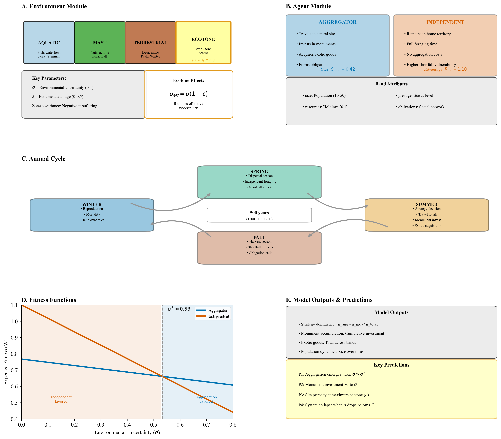

***Figure 6. Agent-based model architecture.*** *(A) Environment module: heterogeneous four-zone landscape (i.e., aquatic, terrestrial game, mast, ecotone-edge) with seasonal cycles and stochastic shortfalls. The ecotone parameter* $\varepsilon$ *controls multi-zone shortfall buffering at the aggregation site. (B) Strategy choice: each band annually selects between the aggregator strategy (travel to the gathering, contribute to monument construction, acquire exotics, form obligation ties) and the independent strategy (remain dispersed, forage independently). (C) Annual cycle: spring dispersal, summer aggregation with monument investment and exotic acquisition, fall harvest with shortfall impacts, winter reproduction. (D) Fitness functions* $W_{agg}$ *and* $W_{ind}$ *(eq. §2.4) determine the critical threshold* $\sigma^{*}$ *via the lambda-sigma feedback loop. (E) Outputs: strategy dominance, monument accumulation, exotic-goods totals, population dynamics, obligation network density. The full ODD-protocol specification is in Supplemental §S1.*

## 4. Theory and simulation results

### 4.1 Phase transition

The first test is whether the simulation exhibits the sharp behavioral threshold predicted by the theory. We define the **strategy-dominance metric** as the population fraction of aggregator bands minus the population fraction of independent bands, ranging from $- 1$ (all independent) to $+ 1$ (all aggregator), with $0$ indicating parity. Running the model at PP-scenario parameters ($\varepsilon = 0.35$) across a sweep of effective uncertainty values with twenty stochastic replicates per cell, the signal-conditional configuration produces a clean S-curve in strategy dominance: the metric climbs from strongly negative at low $\sigma_{eff}$ through crossover at $\sigma_{eff}^{*} \approx 0.387$ to saturation near $+ 0.89$ at the highest $\sigma_{eff}$ values (Figure 7A). The per-cell replicate spread (SD 0.01 to 0.14, largest in the transition zone) is tight enough to characterize both the location of the crossing and the sharpness of the transition. The simulated crossover at $\sigma_{eff}^{*} \approx 0.387$ matches the analytical prediction $\sigma^{*} = 0.40$ at $\varepsilon = 0.35$ to within 0.013. The match is a genuine dynamic-sufficiency result rather than a restatement of the decision rule: bands decide against the emergent monument stock, realized network buffering, and density-dependent resources, none of which is pinned to the analytical equilibrium, and the emergent crossing lands within 0.013 of the analytically derived threshold. Sweep configuration, the precise $\sigma_{target}$ values, and the realized-vs-target sigma adjustment are documented in §S7.1.

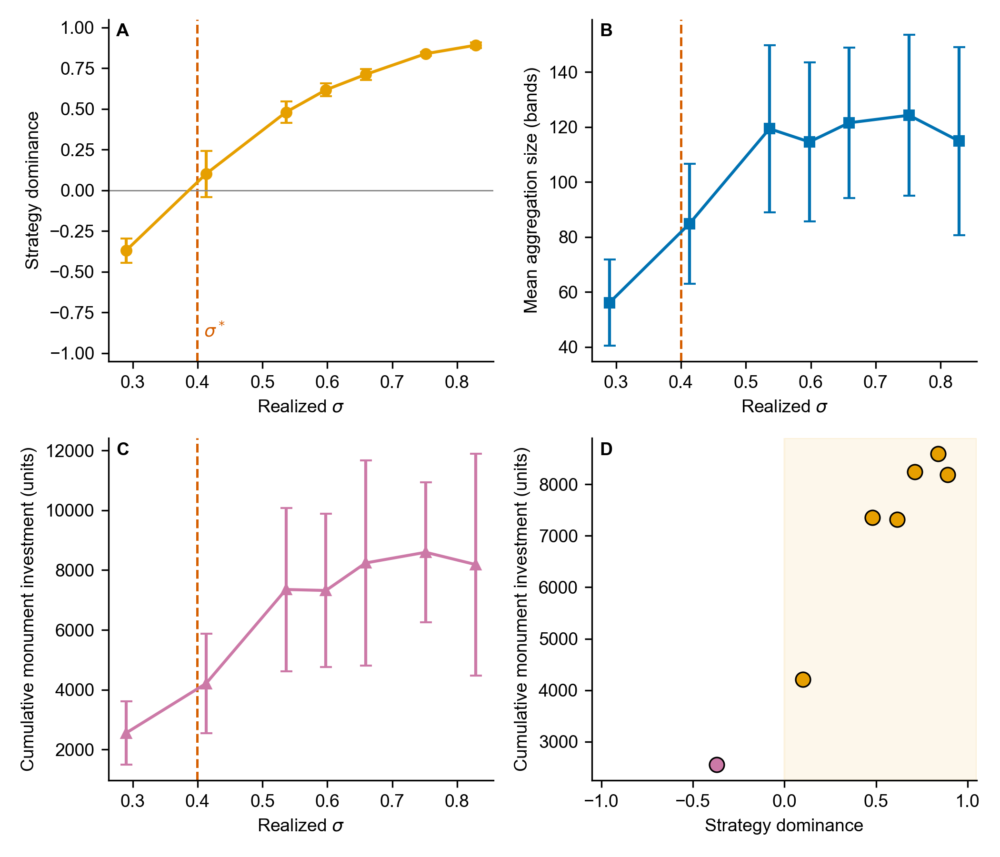

***Figure 7. Phase transition validation at the calibrated PP scenario.*** *Twenty stochastic replicates per cell × 7* $\sigma_{eff}$ *points at PP-scenario parameters (*$\varepsilon = 0.35$*). (A) Strategy dominance vs realized environmental uncertainty. The metric climbs from strongly negative at low* $\sigma_{eff}$ *through crossover at* $\sigma_{eff}^{*} \approx 0.387$ *to saturation near* $+ 0.89$ *at the highest* $\sigma_{eff}$ *values, matching the analytical threshold* $\sigma^{*} = 0.40$ *(dashed red line) to within 0.013. (B) Mean aggregation size in bands per gathering, increasing from ~56 below the threshold to ~115-125 above it (the fission-grown band population numbers 130-190). (C) Monument investment (cumulative units across the 200-year simulated interval), climbing from baseline at low* $\sigma_{eff}$ *to large accumulations at high* $\sigma_{eff}$*, with the steep climb concentrated across the transition zone. (D) Joint phase-transition signature: monument investment vs strategy dominance across the sweep, with the post-threshold cluster (orange, aggregator-dominant shading) separating cleanly from the pre-threshold cluster. The signal-conditional vs random-partner ablation comparison (§4.3) is tabulated per cell in §S7.1 rather than plotted here. The substantive result is that the two versions cross the threshold at almost the same point (signal-conditional* $\sigma_{eff}^{*} \approx 0.387$*, random-partner* $\sigma_{eff}^{*} \approx 0.385$*; threshold shift* $- 0.002$ *or* $- 0.4\%$*, well within replicate noise).*

The phase-transition sweep characterizes where the threshold lies. Figure 8 shows the dynamics in the calibrated PP scenario across a 5-replicate ensemble of 500-year trajectories above the threshold. Strategy dominance stabilizes within the burn-in window and remains stable thereafter, with the post-burn-in median at $+0.70$ and the 10-90 percentile envelope $[+0.62, +0.78]$ across replicates (Panel A). Cumulative monument investment grows steadily through the simulated interval, with substantial replicate-to-replicate divergence in the accumulated total (final values 6,361-32,667 units across the five seeds) that reflects genuine path dependence in the monument-network feedback (Panel B). Aggregation size settles to roughly 100-180 bands per gathering across the ensemble, out of a fission-grown population of 130-190 bands (Panel C). Stochastic shortfall realizations produce visible year-to-year variation within each trajectory, but no post-burn-in replicate-year falls below parity or out of the aggregator-dominant regime, confirming that the aggregator strategy is the stable equilibrium under PP-scenario uncertainty rather than a transient outcome.

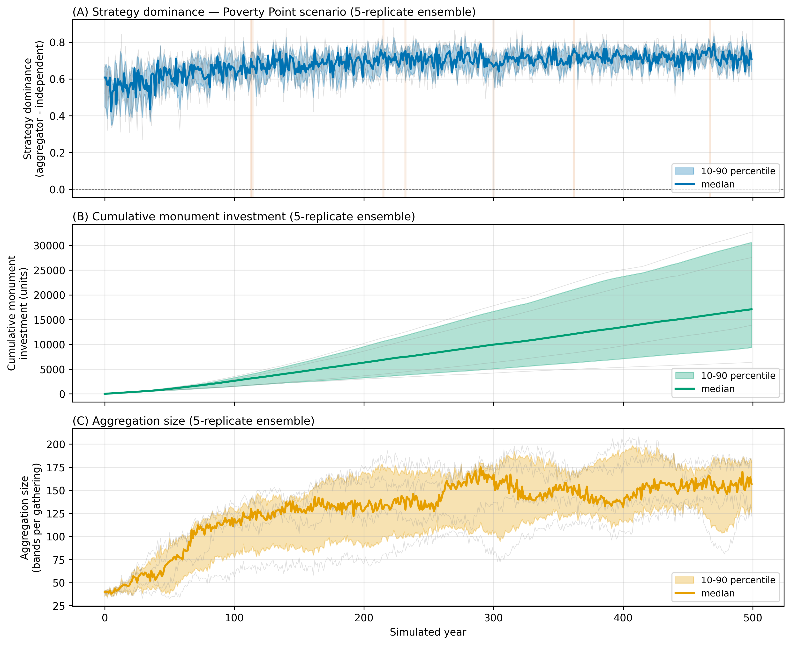

***Figure 8. Temporal dynamics at calibrated PP-scenario parameters (5-replicate ensemble).*** *Five 500-year trajectories at PP-scenario parameters (*$\sigma = 0.64$*,* $\varepsilon = 0.35$*), above the threshold. Each panel shows individual replicate trajectories as thin gray lines, the 10-90 percentile envelope as a colored band, and the median across replicates as a thick colored line. (A) Strategy dominance (fraction of aggregator bands minus fraction of independent bands). The metric stabilizes during burn-in and remains in the aggregator-dominant band, with a post-burn-in median of +0.70 and a replicate envelope of $[+0.62, +0.78]$. Light orange shading marks years in which more than half of the replicates were in a shortfall state. (B) Cumulative monument investment climbing steadily through the simulated interval, with substantial replicate divergence in the accumulated total (final values 6,361-32,667 units across the five seeds), reflecting path dependence in the monument-network feedback. (C) Aggregation size in bands per gathering, settling to roughly 100-180 across the ensemble as the band population grows under fission. Stochastic shortfall realizations drive year-to-year variation within each trajectory, but no post-burn-in replicate-year falls below parity.*

### 4.2 Phase-space structure

The §4.1 sweep validates the threshold along a single slice through parameter space ($\varepsilon = 0.35$, varying $\sigma$). The framework's analytical prediction is more general: the threshold $\sigma^{*}$ is a function of $\varepsilon$, with low-$\varepsilon$ sites requiring higher $\sigma$ for aggregation to become adaptive, and high-$\varepsilon$ sites crossing into the aggregator regime at lower $\sigma$. To test whether the agent-based dynamics reproduce this structure across the joint parameter plane, rather than just along the slice, we ran the model on a grid over the environmental uncertainty $\sigma$ and the ecotone advantage $\varepsilon$.

The simulated phase space matches the analytical prediction across the plane (Figure 9). The regime boundary shifts monotonically with $\varepsilon$: at low $\varepsilon$ ($\leq 0.15$) sustained aggregator dominance requires realized $\sigma \approx 0.47$-$0.51$, while at high $\varepsilon$ ($\geq 0.40$) the boundary sits at $\sigma \approx 0.35$-$0.37$. At every $\varepsilon$ row of the grid, the simulated dominance zero-crossing falls within 0.03 of the analytical $\sigma^{*}(\varepsilon)$ line (within 0.001 at $\varepsilon = 0.50$), so the aggregator-dominated region (orange) and the independent-dominated region (purple) are cleanly separated by the analytically derived boundary, with a narrow bistable transition zone along it. Maximum monument accumulation occurs in the high-$\sigma$, high-$\varepsilon$ corner of the plane ($\sigma \gtrsim 0.74$, $\varepsilon \gtrsim 0.45$), where the framework predicts the strongest joint operation of high uncertainty and strong ecotone buffering. The phase-space structure is therefore a generic property of the framework rather than an artifact of any particular slice through parameter space, and the dynamic-sufficiency test passes across the joint plane, not only along the §4.1 slice.

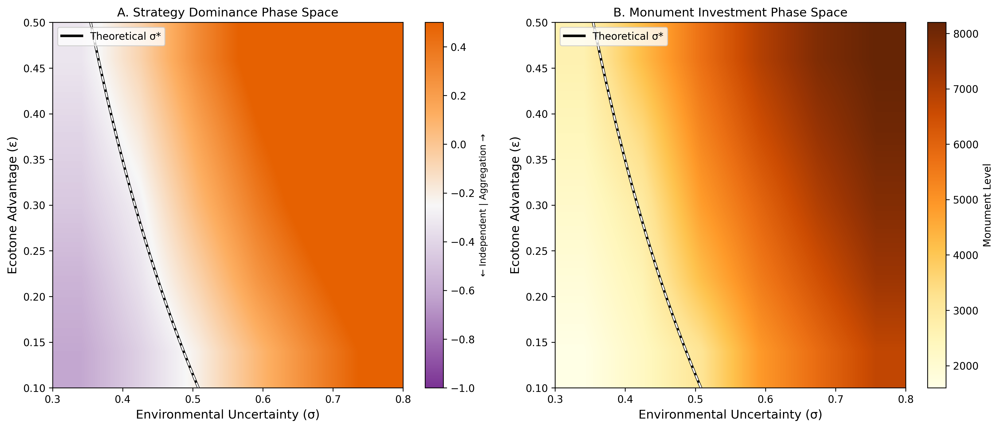

***Figure 9. Phase-space structure across the joint*** $(\sigma,\varepsilon)$ ***plane (5 replicates per cell).*** *Mean strategy dominance, mean monument investment, and replicate spread across the two-dimensional parameter space defined by environmental uncertainty* $\sigma$ *(horizontal axis) and ecotone advantage* $\varepsilon$ *(vertical axis), produced by running the agent-based model on a 12×10 grid spanning both parameters at otherwise PP-scenario settings, with five stochastic replicates per cell. A) The analytical critical-threshold line (the value of* $\sigma$ *at which* $W_{agg} = W_{ind}$ *for each* $\varepsilon$*, derived in §2.4) is overlaid on a continuous color map of mean simulated strategy dominance (purple = independents dominate at* $\sigma < \sigma^{*}$*; off-white = parity at the threshold; orange = aggregators dominate at* $\sigma > \sigma^{*}$*). The threshold line falls along the color transition across the plane. B) Mean monument accumulation, which is maximal in the high-* $\sigma$*, high-* $\varepsilon$ *corner, exactly where the framework predicts the strongest joint operation of uncertainty pressure and ecotone-buffered cooperation. C) Per-cell standard deviation of strategy dominance across the five replicates. The replicate spread is small away from the boundary (median SD* $\approx 0.04$*; up to* $\approx 0.23$ *in the bistable transition zone, where path dependence is real), confirming that the mean phase-space structure in panels A and B is robust to stochastic variation rather than an artifact of single realizations.*

### 4.3 Signaling-vs-cooperation ablation

A reasonable concern about any signaling model is whether the signaling apparatus does explanatory work that generic cooperation theory does not. If a model that pools risk through cooperative networks produces the same predictions as one that adds signaling on top, then "costly signaling" on the threshold dimension is no more than collective-action theory in different vocabulary (cf. Penn and Szamadó 2020). We address this with an *ablation comparison*: a controlled experiment in which a single component of the model is removed or replaced with a neutral alternative, and the analysis is rerun to measure the extent to which that component actually contributes. The cleanest implementation here is to compare two versions of the model side by side: one in which bands form cooperative ties with one another based on visible signals (i.e., monument contributions and possession of exotic goods), and one in which the same number of ties form at random among the bands attending the gathering. Everything else about the cooperation network is held constant between the two versions. The question is whether the threshold for adaptive aggregation moves between them. If it does, signaling adds explanatory work beyond network-mediated cooperation. If it does not, the threshold reduces to a collective-action result that does not require signaling to derive.

The model implements this comparison directly. In the signal-conditional version, partner choice at the gathering is weighted by each band's visible contributions (i.e., monument labor and exotic-goods accumulation), so bands with higher contributions form more cooperative ties. In the random-partner version, the same number of ties form among the same bands, but who pairs with whom is chosen at random, holding constant the rest of the cooperation-network mechanics. We ran both versions over the same $\sigma_{target}$ sweep with PP-scenario parameters ($\varepsilon = 0.35$). The sweep configuration and per-cell statistics for both versions are documented in §S7.1.

**Result: the two versions cross the threshold at almost the same point.** In plain terms, we tested whether *choosing partners based on their visible signals* changes the point at which aggregation becomes worthwhile, holding the cooperation safety-net mechanics fixed, and we found it does not. With twenty stochastic replicates per cell, the signal-conditional version crosses at $\sigma_{eff} \approx 0.387$ and the random-partner version at $\sigma_{eff} \approx 0.385$, a difference of about 0.4% in realized $\sigma_{eff}$ that lies well within the replicate-to-replicate noise. Both versions reach near-total aggregator dominance ($+0.89$ to $+0.90$) at the highest uncertainty levels, indistinguishable at the reported precision. The ablation result is narrower than the broad framing might suggest. What the comparison removes is the *signal-conditional partner-formation* mechanism (mechanism (i) in §2.2's three-rule operationalization): in the random-partner version, ties form by uniform random pairing instead of preferentially with high-display partners, but tie-strength-ordered shortfall help-calling (mechanism (ii)) and network-density-driven $\sigma_{eff}$ reduction (mechanism (iii)) are preserved. The honest statement is therefore that, with the parameterization used here, weighted partner selection does not shift the threshold while holding network cooperation constant. This is not the same as showing that signaling adds nothing to network cooperation generally. The cooperation-network component itself is not ablated in this experiment. The deeper test, which would ablate the cooperation-network buffering mechanism itself, is reported in the factorial component-ablation experiment of §S5.4 (which turns each of $\lambda_{W}$, $\lambda_{C}$, $\lambda_{X}$, and $\varepsilon$ off individually and in factorial combination). The point-by-point comparison statistics for the partner-formation ablation are in §S7.1.

We read this as a substantive finding rather than a problem to be explained away. A risk-pooling account in the Halstead and O'Shea (1989) tradition predicts the same threshold-crossing behavior as the signaling reading on this dimension. We can interpret this result in two ways. The signaling reading is distinguished from generic cooperation by the spatial pattern of monument and exotic accumulation, not by the location of the threshold. The regional exotic distribution is one of extreme asymmetric concentration: 95.7% of regional steatite and 97% of regional galena are at the type-site (Smith 1991), with hinterland PP-affiliated sites carrying small but nonzero quantities of the same materials (Gibson and Griffing 1994; Mitch 2023). Kidder and Grooms (2025:7) describe the active-period flow as strongly asymmetric, concentrating material at the hub. Under the signaling reading, exotic acquisition operates through partner-choice premium at the gathering, so material accumulates at the hub while only personal-effects fractions return home with visitor bands. That is the pattern observed. Each alternative predicts a different pattern. The legitimate risk-pooling counter-hypothesis is sharper than the form sometimes stated: under hunter-gatherer risk-pooling, which operates primarily in archaeologically invisible media (food, dried provisions, labor, hospitality) during the dispersed phase, there is no particular reason for durable exotics to flow at all, since the pooled medium is not the durable item. The discriminating contrast is therefore not between signaling and bidirectional galena flow, but between signaling and negligible durable-exotic flow under pure risk-pooling. The Smith (1991), Gibson and Griffing (1994), and Mitch (2023) data show metric-ton-scale concentrated inflow, which signaling-via-partner-choice predicts and pure risk-pooling does not. A generic down-the-line exchange predicts smooth distance-decay from each geological source, with no single node dominating. Those concentration figures rule this out. The framework passes the discriminating test on the existing record despite producing no detectable threshold shift.

The second reading is that, in the threshold dimension, the framework reduces to a multilevel selection cooperation model under environmental uncertainty. That is itself a substantive theoretical result. Multilevel selection on cooperative networks has been invoked in the LMV literature for decades, but the formal demonstration that the network mechanics produce a sharp phase transition at PP-scenario parameters has not been made before. It is not specifically *costly signaling* on this dimension. Rather, the cooperation-network component ($\lambda_{X}$) produces the threshold, and the signal-conditional partner formation layered on top does not shift it further.

The ablation result reported here does not resolve the discrepancy between these two findings. A different test makes the choice, the spatial-flow signature evaluated in §6.1, not by where the threshold lies.

For completeness, we also report an earlier surrogate test that the framework used before the random-partner comparison. Setting the within-group reward parameter $\lambda_{W}$ to zero (i.e., removing the bonus that visibly cooperative bands receive, while leaving all network and ecotone effects intact) shifts the analytical threshold from $\sigma^{*} = 0.400$ to $\sigma^{*} = 0.543$, a 36% increase. Sweeping $\lambda_{W}$ across its plausible ethnographic range $\lbrack 0.05,0.30\rbrack$ traces $\sigma^{*}$ monotonically from 0.491 to 0.263 (the $\lambda_{W} = 0$ ablation endpoint is 0.543). This sensitivity indicates that $\lambda_{W}$ is not free to vary. Its value matters quantitatively in determining the threshold location. But the test does not isolate signaling from generic cooperation, because what is removed by setting $\lambda_{W} = 0$ is an additive fitness bonus, not the signal-based mechanism by which bands choose partners. The random-partner comparison reported above is the test that isolates the signaling mechanism, and it returns no detectable threshold shift.

The plausible-range claim for $\lambda_{W}$ deserves explicit ethnographic justification. Three independent ethnographic case studies of mobile-forager societies provide qualitative and quantitative evidence on the magnitude of within-group reward for visibly cooperative behavior. None directly measures the within-group fitness benefit of monument signaling, but each constrains the plausible range of that benefit. Hawkes (2000) summarizes Hadza data showing that better big-game hunters are recognized as valuable partners: hunter rankings are consistent across years (Blurton Jones et al. 1997, summarized in Hawkes 2000:71), and partner choice favors better hunters. This qualitative pattern is consistent with the idea that signal quality drives a partner-choice premium. Wiessner (2002) reports a 34-year longitudinal Ju/'hoansi (!Kung) record showing that good hunters' families have substantially more hxaro partners (mean 42.9 vs 23.7, p=.006), more household possessions (60.4 vs 40.7, p=.02), and longer camp-residence stability (32.0 vs 17.4 years, p=.0001) than poor hunters' families, with hxaro co-attendance providing 93% of extended visits during food shortages (Wiessner 2002:422). Good hunters' wives' children survive at 83% vs 67% (a 24% relative survival advantage, Wiessner 2002:426). Hawkes and Bliege Bird (2002) review the partner-choice premium for visibly cooperative individuals across multiple foraging societies and place it within a comparable order-of-magnitude range. These ethnographic findings establish that the within-group reward for visibly cooperative behavior is non-trivial: meaningfully positive but bounded below the magnitudes (often \>50%) that would arise from straightforward provisioning or kin-selection mechanisms. They motivate an order-of-magnitude plausibility window for $\lambda_{W}$ on the order of $0.05$-$0.30$, with central values around $0.10$-$0.20$. We do not claim that this analysis derives $\lambda_{W}$ from the data. It brackets a defensible range within which the asserted central value of 0.15 lies. The corresponding threshold sensitivity to $\lambda_{W}$ across this range is reported in §4.4.

### 4.4 Sensitivity

A one-at-a-time (OAT) sensitivity analysis varies each model parameter individually across a defined range while holding the other parameters at their default values. It records how much the critical threshold $\sigma^{*}$ changes as a result. The resulting *swing* is the difference between the highest and lowest $\sigma^{*}$ produced across the parameter's tested range, and it measures how strongly that parameter influences the threshold. With baseline $\sigma^{*} \approx 0.40$ at PP-scenario parameters, a swing of 0.20 means the threshold can move by half its baseline value depending on the setting of that parameter alone. The full table is in Supplemental §S3.1.

Four parameters produce large swings. A $\pm 50\%$ perturbation of the signaling-investment cost $C_{signal}$ moves $\sigma^{*}$ by 0.225, the largest swing in the model. The ecotone advantage $\varepsilon$ contributes 0.154 across its full plausible range $\lbrack 0.10,0.50\rbrack$, followed closely by the opportunity cost $C_{opportunity}$ at 0.150 and the within-group signaling reward $\lambda_{W}$ at 0.137 (both across $\pm 50\%$). The network parameters ($k_{\max}$, $\gamma$) and travel-cost coefficient produce moderate swings. Three parameters leave the threshold essentially unchanged: monument depreciation ($\delta$), the half-saturation constant ($M_{half}$), and aggregation size ($n_{agg}$ over the plausible range $5 \leq n_{agg} \leq 50$) show swings below 0.02. The cooperation-network component parameters $\lambda_{C}$ and $\lambda_{X}$ exhibit zero sensitivity because their values are not free dials but are determined endogenously by the lambda-sigma feedback loop. Thus, perturbing their starting values does not affect the equilibrium the loop converges to.

The substantive implication is that the threshold's location is set primarily by aggregation costs ($C_{signal}$, $C_{opportunity}$) and by ecotone access ($\varepsilon$). The within-group signaling reward $\lambda_{W}$ modulates the threshold but does not dominate it. The cooperation-network components collapse to zero contribution at equilibrium under the default network-saturation function, because adding partners contributes diminishingly once the network is saturated, but recover nontrivial values under the restructured form developed in §S5.2.

## 5. The Lower Mississippi Valley Late Archaic record

We now turn from the framework's theoretical predictions to its empirical sufficiency. The Lower Mississippi Valley between approximately 4,200 and 3,000 cal BP records the densest expression of the Eastern Archaic monumental tradition. It is also the case to which the framework has been calibrated. Before presenting the empirical tests, we summarize the regional record at the level of detail required by the empirical evaluations, with site-level entries restricted to the eleven sites used in §6.

### 5.1 Site inventory

We gathered data from descriptions of eleven Middle Archaic and Late Archaic monument-building sites in the Lower Mississippi Valley (Table 1). Our site selection included the full range of zone-access settings and observed monument scales documented for the region, allowing the framework's screening claims to be evaluated against available variation. These eleven sites sit within a broader Louisiana Archaic mound inventory of thirteen Middle Archaic mound sites (Jones and Brookes 2019:Table 3, Figure 6) that provide a more than 2,000-year deep-time context for the Late Archaic Poverty Point florescence. The framework's PP-period predictions are evaluated against the interior LMV subset analyzed here, with the Middle Archaic mound trajectory entering as background rather than as an analytical target. Coordinate sources, parish-level locality verification, and the underlying Saucier (1994) geomorphic context for each site are documented in the project repository. Sites are mapped in Figure 1.

**Table 1.** *The eleven LMV sites. Coordinates are decimal degrees (NAD83), derived from the source UTM coordinates in data/site utms.xlsx (zone 15N for interior LA/MS sites; zone 16N for the coastal MS pair). "Period" abbreviates Middle Archaic (MA), Late Archaic (LA), or Late Archaic Poverty Point period (LA-PP). Monument scale is ordinal: very large (PP type-site, \~750k m³ core), mid (\~5-15k m³, multi-mound), small (1-2 mounds, \<5k m³), minimal (single mound or non-mound construction).*

-------------------------------------------------------------------------------------------------------------------------------------------------------------------------------------------------------------------------
  **Site (trinomial)**         **County/Parish, State**   **Lat / Lon**        **Setting**                                                **Dates (cal BP)**                                           **Monument scale**
---------------------------- -------------------------- -------------------- ---------------------------------------------------------- ------------------------------------------------------------ --------------------
  Poverty Point (16WC5)        West Carroll, LA           32.6362 / -91.4089   Macon Ridge / Bayou Maçon confluence                       3650-3050                                                    Very large

  Lower Jackson (16WC10)       West Carroll, LA           32.6175 / -91.4108   Macon Ridge, \~3 km S of PP                                \~5500                                                       Minimal

  Watson Brake (16OU175)       Ouachita, LA               32.4475 / -92.0978   Pleistocene terrace / Ouachita River                       5400-4700                                                    Mid

  Frenchman's Bend (16OU259)   Ouachita, LA               32.5530 / -92.1100   Pleistocene terrace / Ouachita tributary, Bayou DeSiard    Middle Archaic (5600-5320 BP cluster; many large-SD dates)   Mid?

  Caney (16CT5)                Catahoula, LA              31.8500 / -91.6700   Pleistocene terrace / small drainage / mast forest         MA + later?                                                  Mid

  Insley (16FR3)               Franklin, LA               32.0833 / -91.6750   Macon Ridge / Bayou Maçon / small drainage / mast forest   Pov Pt with Coles Creek Mnds.                                ?

  Cowpen Slough (16CT147)      Catahoula, LA              31.6800 / -91.6500   Red/Black River confluence area                            LA-PP                                                        None / hamlet

  J.W. Copes (16MA47)         Madison, LA                32.4500 / -91.1500   Joe's Bayou / small drainage; PP satellite                 LA-PP                                                        None / hamlet

  Jaketown (22HU505)           Humphreys, MS              33.1789 / -90.4561   Yazoo Basin meander belt                                   4000-3000                                                    Small

  Claiborne (22HA501)          Hancock, MS                30.3097 / -89.5933   Pearl River mouth, coastal                                 LA-PP                                                        Minimal

  Cedarland (22HA506)          Hancock, MS                30.3083 / -89.5919   Pearl River mouth, coastal                                 3880-3800 BP (Kidder et al. 2025)                            Shell/earth midden
  -------------------------------------------------------------------------------------------------------------------------------------------------------------------------------------------------------------------------

Poverty Point's site characteristics, including the constructed core architecture and exotic-goods inventory, are introduced in §1 (Figures 1 and 2). For the empirical evaluations below, we summarize each of the other ten sites in turn.

**Lower Jackson** (16WC10), approximately 3 km south of the Poverty Point earthworks on Macon Ridge, is a single isolated mound (Saunders et al. 2001). The conventional Middle Archaic assignment rests on a single submound charcoal date that appears to be a multi-entity sample, and both Middle Archaic and Poverty Point-period artifacts have been recovered in the immediate area. Kidder and Grooms (2024) apply chronological hygiene criteria that would reject the submound date as a reliable *terminus post quem* and treat the Middle Archaic assignment as unconfirmed. Lower Jackson is likely a single-band or single-event minimal-construction event with no associated residential or evidence of exchange. The Middle Archaic chronology should be understood as provisional under the chronological hygiene criteria the framework otherwise invokes (Kidder and Grooms 2024). Three readings of the site are compatible with the available evidence: (a) a Middle Archaic single-event monument at \~5500 cal BP, the conventional reading; (b) a Late Archaic PP-period monument with a contaminated submound date; or (c) a complex site whose chronological position cannot be resolved on the existing data. The single-band single-event reading is provisional under (a), entirely defeated under (b), and indeterminate under (c). Despite sharing PP's catchment context under any of the three readings, Lower Jackson never attained even WB-scale construction. The site is used here as one of several anchors for the structural claim that high-$\varepsilon$ access alone is insufficient for large-scale monument accumulation. The same point is made independently by Insley and J.W. Copes (which sit in the high-$\varepsilon$ band without becoming monumental) and by the convergence dimension of §6.6, so the structural argument does not rest on Lower Jackson's reading. Conclusions drawn specifically from Lower Jackson should be read as conditional on the conventional chronology and revisable in light of future data.

**Watson Brake** (16OU175) sits on a Pleistocene terrace overlooking an unnamed intermittent stream that flows from Watson Brake into the Ouachita River, in Ouachita Parish (Saunders et al. 2005b). The deposit's 11 mounds and connecting ridges encompass approximately 6 ha of constructed earthwork. We estimate the constructed earthwork volume by per-mound polygon integration using Lidar data available from the State of Louisiana. Rough polygons were drawn by hand around each mound or mound-and-ridge cluster (eight clusters in all), and the volume above a local minimum-elevation baseline was integrated within each polygon. Each cluster's baseline is set to the local minimum natural-ground elevation in its immediate vicinity (22 m for the K/A/B/C/D, E, and F clusters; 21.5 m for the G, H, I, and J + ridge clusters), accounting for the natural topographic gradient across the site, so the analysis counts only the volume of the mounds and ridges themselves. It treats the inter-mound surface as natural ground rather than as constructed fill. Summing across all clusters gives a total of **27,065 m³**: the largest cluster (Mounds K, A, B, C, D plus their connecting ridge) at 17,986 m³, Mound E plus ridge at 6,267 m³, Mound J plus ridge at 1,939 m³, Mound I at 518 m³, Mounds G and H at 192 m³, and Mound F at 163 m³. Construction proceeded episodically over \~700 years, with documented 200+-year interstage gaps (Saunders et al. 2005b). WB is the framework's most demanding internal test. Its near-threshold treatment is in §6.3.

**Frenchman's Bend** (16OU259), in Ouachita Parish, is a smaller Middle Archaic mound complex on a Pleistocene terrace adjacent to Bayou Desiard, a tributary of the Ouachita (Saunders et al. 1994, 2009). The site comprises five low mounds with limited associated evidence of residential activity.

**Caney** (16CT5) in Catahoula Parish has a complex chronology that the framework treats with caution. Mounds C and D yielded Middle Archaic dates on mid-mound organically-enriched sediments. The artifact assemblage spans the Paleoindian through the Plaquemine periods. The last stage of Mound B contained a complete Marksville pot. Pedogenetic evidence in mound soils indicates that the bulk of construction at most of the six mounds occurred during Poverty Point or Tchefuncte times rather than the Middle Archaic, with Middle Archaic dates as the earliest component overprinted by substantial later construction (Sassaman 2005:340-341, summarizing Saunders et al. 2000). For the §6.4 / Table 2 screening, we treat Caney as a multi-period mound complex whose latest substantial construction is broadly Poverty Point-Tchefuncte, comparable in scale to roughly 1-2$\times$ Watson Brake's individual mounds. The screening test on Caney is therefore a comparison of its catchment $\varepsilon$ against the Late Archaic monument-builder distribution. If the bulk of construction is in fact Middle Archaic, Caney's catchment $\varepsilon$ remains a relevant comparator under a different period assignment, but the comparison case to WB rather than to PP becomes the right reference. The framework's screening conclusion is not sensitive to which of these chronological readings is correct because Caney falls within the high-$\varepsilon$ band on either reading.

**Insley** (16FR3) in Franklin Parish was originally assigned to the Middle Archaic based on its mound arrangement (Sassaman and Heckenberger 2004), but submound charcoal dates from two of the mounds return Coles Creek ages (Saunders et al. 2005a). In addition, the artifact assemblage spans Poverty Point through Coles Creek periods, and the total number of mounds is contested (estimates range from four to sixteen, twelve unconfirmed) (Griffing 1990). Insley, therefore, lacks a confirmed Middle Archaic component. Insley does contain exotic material, though in small quantities, and lacks the large-scale residential occupation associated with the Poverty Point type-site. We retain Insley in the §6.4 and §6.5 GIS analyses below because the screening test operates on catchment geomorphology rather than chronology, and the screening result is robust to the site's inclusion or exclusion.

**Cowpen Slough** (16CT147) in Catahoula Parish is an LA/PP-period hamlet near the confluence of the Red and Black Rivers, with no monumental architecture and only small-scale residential evidence (Ramenofsky 1986, 1991; Webb 1982). The record spans two functionally distinct occupations bracketed by stratigraphic flood deposits: a Late Archaic component (\~4500-3170 cal BP) with multiple lines of sedentary-residence evidence (high lithic functional diversity, abundant reed-impressed daub indicating structures, 28-burial cemetery), followed by a Poverty Point period component (\~2980 cal BP) with mobile-occupation signatures (reduced functional diversity and daub frequency), and abandonment by ca. 2900 cal BP after a fluvial shift to high-energy conditions (Ramenofsky 1991:Tables 4-8). The same regional flooding pattern ends the Jaketown occupation at 3310 cal BP (Kidder et al. 2018). The Late-Archaic-sedentary to PP-period-mobile shift at a hinterland site is consistent with the framework's prediction that dispersed-phase bands should be more mobile once the aggregation system operates and they travel between hub and dispersed residences.

**J.W. Copes** (16MA47) in Madison Parish, on Brimberry Brake near Joe's Bayou, is a small PP-period habitation site described by Jackson (1982, 1986, 1989) as a satellite to the Poverty Point regional system. Jackson (1982:73, 82) argues from a small but multi-season faunal assemblage (summer fish, fall-winter deer, a spring shed-antler skull, late summer-fall nuts) that Copes \"may have been occupied year-round\" and was characterized by \"specialization in the procurement of deer and fish,\" with the year-round inference offered as a possibility rather than a confident claim given the sample size. Even at this small peripheral site, exotic material extends well beyond the single galena cube usually cited. Copes yielded one of the larger documented hinterland Poverty Point assemblages (4,031 artifacts), including nonlocal chipped stone such as novaculite alongside the galena, in quantities far below the type-site totals (Gibson and Griffing 1994:223; Jackson 1982:84; cf. Walthall et al. 1982). Participation in the long-distance exchange network therefore reached well beyond the Poverty Point type site.

**Jaketown** (22HU505) in Humphreys County, Mississippi (near Belzoni in the Yazoo Basin), has at least three Poverty Point-period mounds among fifteen or more total mounds at the site, along with substantial PP-trait artifact assemblages (Grooms et al. 2023; Lehmann 1982; Ward et al. 2022). For the convergence-model interpretation, Poverty Point-period traits appear at Jaketown more than 400 years before they appear at the type site. Those traits therefore cannot have radiated outward from Poverty Point, and Poverty Point is not the terminal point of a single down-the-line diffusion chain. The pattern instead supports a convergence reading, in which PP-period traits developed across several regional centers (Jaketown among the earliest) and later concentrated at Poverty Point (Grooms et al. 2023).

**Claiborne** (22HA501) and **Cedarland** (22HA506) at the mouth of the Pearl River in Hancock County, Mississippi, are paired Late Archaic coastal sites in a structurally distinct estuarine setting. Both are horseshoe-shaped shell and earth middens roughly 50-75 m apart, within 5 km of the Gulf of Mexico (Kidder et al. 2025). New high-resolution radiocarbon dates from previously unreported MSU and Bruseth excavations (12 dates total) revise their chronology: Cedarland dates to approximately 3880-3800 BP and predates Claiborne by ca. 500 years. Claiborne is contemporary with the Poverty Point type-site (Kidder et al. 2025). The sites are therefore not a single population's sequential occupation (Gagliano and Webb 1975) but two structurally distinct deposits with different histories and roles in the Late Archaic Southeast, materially connected to the Poverty Point exchange network through the Claiborne soapstone vessel cache and other artifacts such as copper and galena (Kidder et al. 2025; Lambert et al. 2024; Sassaman and Brookes 2017). The cache itself is best read as a terminal deposition of legacy material rather than a snapshot of active-period acquisition: eleven dates from eight vessels span ca. 6180-2970 BP, two vessel-residue samples sit roughly 500 years earlier than the rest of the Claiborne assemblage and align chronologically with Cedarland, and the most recent dated vessel still predates emplacement at the end of the Poverty Point occupation (Baumgartel 2024; Sassaman and Brookes 2017). Both sit primarily within the Gulf Coast Flatwoods and Coastal Marshes ecoregion mosaic (Omernik and Griffith 2014), with single-drainage access via the Pearl River. The broader Pearl River coast reinforces this reading, and it must be stated carefully because the relevant site is morphologically Poverty Point-like. The nearby Jackson Landing site pairs a platform mound with a 460 m semicircular earthen enclosure, but that construction dates to the early Late Woodland (ca. AD 400-700), roughly 1,500 years after the Poverty Point period, and overlies the buried Late Archaic ground surface rather than being built during it. The site's Poverty Point-period presence is only a minor Late Archaic Pearl River-phase component (ca. 3000-1200 BC) with a perforated Poverty Point object and soapstone, not monumental architecture (Boudreaux 2015). Two points follow. The coast participated in the Poverty Point-period exchange sphere without building monuments at that time. And because the same coastal setting did support a semicircular-earthwork center later, the Poverty Point-period absence of coastal monuments cannot reflect a permanent ecological veto. It reflects the absence, during the Poverty Point window, of the sustained aggregation that produces monumentality, consistent with the necessity-but-not-sufficiency reading developed in §6.6 rather than a low-$\varepsilon$ exclusion. The coastal pair is the framework's natural negative case in the LMV: coastal sites that participated in the Poverty Point exchange network yet did not become monumental during the Poverty Point period. If the screening claim is correct, they should sit at the low end of the interior $\varepsilon$ and resource-diversity ranking; §6.4 reports that they do, though by smaller margins than a clean coastal-versus-interior split would imply.

### 5.2 Chronology

The LMV regional sequence for northeast Louisiana runs from Lower Jackson at \~5500 cal BP and the Frenchman's Bend complex through Watson Brake at ca. 5400-4700 cal BP, and the Late Archaic Poverty Point-period sites, including the type-site itself at ca. 1700-1100 BCE (3650-3050 cal BP) (Kidder and Grooms 2024; Saunders et al. 2001, 2005b). Bayesian modeling of 157 radiocarbon dates from Poverty Point indicates type-site occupation for 164-397 years (95.4% hpd; 3535-3135 cal BP), with active earthwork construction compressed into \~75 years (3300-3225 cal BP) (Kidder and Grooms 2024). Convergence-model interpretation of the regional chronology (Grooms et al. 2023; Kidder and Grooms 2024) reads Jaketown's development of PP cultural traits 400+ years before the type-site as evidence that multiple groups with independent histories converged on the type-site over a compressed window, rather than that PP traits diffused down-the-line from PP to peripheral sites. We adopt this convergence reading throughout the framework's empirical evaluation. The convergence reading rests primarily on the Jaketown and PP chronologies.  The resolution of the remaining LMV PP-period inventory is not yet sufficient to distinguish convergence from delayed, down-the-line diffusion across the region. The framework imports the convergence reading from this literature rather than testing it. Future work to uniformly generate Bayesian-model chronologies for the full PP-trait inventory would tighten the discrimination between the two interpretations.

The post-3300 cal BP collapse is documented at Jaketown by Kidder et al. (2018), where a crevasse splay buried the Poverty Point occupation there at 3310 cal BP. The resulting regional abandonment lasted \~530 years, longer than the \~400-year gap originally estimated by Kidder (2006). Post-flood Early Woodland reoccupation shows little monumental architecture, minimal long-distance trade, less diverse assemblages, and no lapidary art (Kidder et al. 2018), a near-complete collapse of the signaling system rather than a gradual decline.

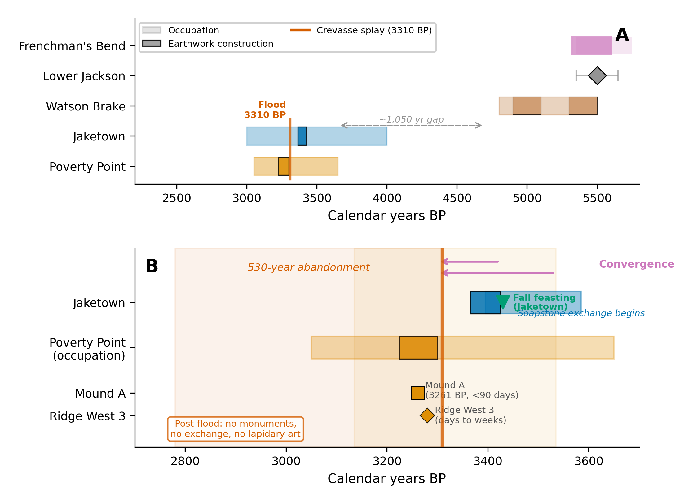

***Figure 10. Regional chronological synthesis.*** *(A) Full timeline showing Frenchman's Bend (5600-5320 BP reliable cluster shown as solid purple band, with lighter extension to older large-SD dates (Saunders et al. 1994, 2009), Lower Jackson (single isolated mound at \~5500 cal BP shown as gray diamond with* $\pm 150$ *yr uncertainty bars, MA assignment provisional under Kidder and Grooms 2024 hygiene criteria), Watson Brake (ca. 5400-4700 cal BP), Jaketown (4000-3000 cal BP), the Poverty Point type-site (3650-3050 cal BP), and the post-3300 cal BP regional abandonment. The 1050-year gap between the abandonment of Watson Brake and the emergence of Poverty Point is emphasized. Jaketown's early development of Poverty Point cultural traits, \~400+ years before the type site, supports the convergence (rather than diffusion) reading developed in the body. (B) Expanded view of the active construction window (3700-2700 BP), showing the compressed 75-year active earthwork interval at Poverty Point (3300-3225 cal BP) and the flood-driven collapse at 3310 cal BP documented at Jaketown by Kidder et al. (2018). The \"Fall feasting\" marker on the Jaketown row indicates an* in situ *deposit (PPO concentrations, hearths, large-mammal long bones oriented as a single depositional event, fall macrobotanical signature) interpreted as a feast immediately preceding Jaketown earthwork construction (Grooms et al. 2023:1464; Ward et al. 2022:769). No equivalent direct feasting deposit is documented from Poverty Point itself, where acidic soils preserve few faunal remains. The PP feasting interpretation (Hays 2019) rests instead on PPO production volumes and assemblage composition. Source: Kidder and Grooms (2024); Grooms et al. (2023); Saunders et al. (2001, 2005b, 2009).*

### 5.3 Construction tempo

Recent geoarchaeological work has substantially refined the chronology of LMV monument construction. At Poverty Point, individual construction episodes are rapid: Mound A rose in fewer than 90 days (Ortmann and Kidder 2013), and the investigated segment of Ridge 3 West formed in days to weeks (Kidder et al. 2021). Yet the site as a whole accumulated through many such episodes. A magnetic gradient survey covering 25.47 hectares has identified 36 timber post circles and 64 distinct ridge construction components (Clay 2023; Hargrave et al. 2021). Clay (2023) documents repeated build-decommission-rebuild cycles in plaza post circles, and Ortmann (2010) identified 16 sequential prepared activity surfaces beneath Mound C. Watson Brake construction was episodic with 200+ year inter-stage gaps (Saunders et al. 2005b). The PP active interval (\~75 years) and the WB long-duration episodic interval (\~700 years) span the range of construction tempos that need to be jointly explained by any account of LMV monumentality.

### 5.4 Exotic-goods inventory

Webb (1982) tabulates an inventory of exotic materials (from unsystematic surface collections and a few haphazard excavation contexts) at the type site, which we use as the calibration target. The materials and their inferred sources (with characteristic distances) include: copper from the Great Lakes, southern Appalachians, or Nova Scotia (\~1,600 km, with Hill et al. 2016 LA-ICP-MS); steatite from the southern Appalachians (\~800-900 km, with Smith 1991 NAA and Yates 2009 ICP-MS); galena primarily from Potosi, Missouri (\~800 km, with Walthall et al. 1982 atomic absorption); novaculite from the Ouachita Mountains (\~250-300 km); and crystal quartz from Arkansas (\~300 km). Counts of primarily surface-collected artifacts found at Poverty Point consist of 155 copper objects, 2,221 steatite fragments, 740 galena object (702 masses and 38 shaped objects), 395 quartz crystals, plus 1,536 lapidary items and 2,790 plummets predominantly of hematite and magnetite. Material concentration is striking. 95.7% of all steatite and 97% of all galena in the entire Poverty Point regional system are at Poverty Point itself (Smith 1991), with peripheral sites receiving comparatively little.

### 5.5 Paleoclimate

The Late Holocene LMV climate is documented through several proxy systems, none of which is specifically an LMV-interior hydroclimate reconstruction at the resolution the framework's $\sigma$ derivation would prefer. We summarize the proxies we engage, acknowledge their geographic mismatch with LMV-interior subsistence variance, and identify the LMV-region records that a future revision should bring to bear. The Temperature 12k database (Kaufman et al. 2020) is a continental-scale composite that under-resolves centennial variability but indicates relatively stable thermal conditions during the Poverty Point occupation. Pollen-based Water Availability Balance reconstructions (Salonen et al. 2025) for the Midwest indicate drier-than-present conditions during the occupation with substantial variance and 200-year-periodicity oscillations large enough to produce significant ecological consequences (Shuman and Marsicek 2016). The Salonen et al. (2025) calibration is for the upper Midwest, not the LMV interior. We use it as a regional analog for the broader hydroclimate, not as a direct LMV proxy. Critically, the centennial variability was spatially incoherent across the broader region (Salonen et al. 2025), meaning different parts of the exchange network would have experienced drought at different times, the precise condition under which inter-regional cooperation becomes adaptive. Gulf Coast paleotempestology (Liu and Fearn 1993, 2000) at Western Lake (Florida) and Lake Shelby (Alabama) shows that the occupation overlapped a hyperactive hurricane interval (\~3800-1000 BP), with landfall rates roughly 5× the baseline. These are Gulf Coast records, and we use them as a proxy for the eastern LMV hurricane regime. The western LMV interior, including Macon Ridge, would have experienced hurricanes at lower intensity and frequency than the Gulf Coast records document. Hence, the landfall rate enters the LMV-interior $\sigma$ derivation as an upper bound on the hurricane-driven component. Combining drought and hurricane recurrence, we estimate a shortfall frequency of \~10 years and magnitude of \~0.45, yielding $\sigma_{LMV} \approx 0.64$ (95% CI 0.41-0.94) under the composite-uncertainty index defined in §3 (full derivation in §S1.4). The 95% CI on $\sigma_{LMV}$ reflects three sources of uncertainty (decomposed in §6.2 and §S15): proxy magnitude uncertainty (the $m$ parameter, $\sim \pm 30\%$ on the cited proxies), proxy frequency uncertainty (the $T$ parameter, $\sim \pm 30\%$ from cross-dating of paleotempestology events), and paleo-archaeological cross-dating error between the proxy chronologies and the archaeological active interval ($\sim \pm 50$-$100$ yr per proxy, propagating to $\sim \pm 10\%$ on the integrated $\sigma$ estimate). The width of the interval is therefore real, not nominal, and reflects genuine input uncertainty rather than artifactual broadening.

*LMV-interior proxies not yet engaged.* A future revision of the framework's $\sigma$ derivation should bring LMV-interior records to bear in place of the regional composites used here. Candidates include Lake Tulane pollen (Florida, the closest published LMV-region pollen reconstruction), Avery Island salt-dome paleoenvironmental records (Louisiana, the only Pleistocene-Holocene record from within the LMV catchment), Pigmy Basin Mg/Ca SSTs (offshore Gulf, the closest published high-resolution Holocene SST record to the LMV), and Mississippi Delta sediment-supply records (the most direct paleo-hydroclimate signal for the LMV mainstem). None of these is a single-proxy LMV-interior subsistence-variance reconstruction at the resolution PP requires, and constructing such a composite is a substantial paleoenvironmental project beyond the scope of the present framework. We treat the $\sigma_{LMV}$ estimate above as a first-order regional analog rather than a calibrated LMV-interior signal, and the §6.2 threshold-proximity test as a near-tie posterior (not a confirmed pass) in part because of this proxy provenance limitation. A future paleo-revision could substantially tighten the test in either direction.

*Decomposition of $\sigma$ into independent components.* The current composite $\sigma = m \cdot \sqrt{20/T}$ aggregates drought and hurricane variance into a single index. This is a model-of-convenience choice rather than a derivation: hunters facing a multi-year drought versus a Category-4 hurricane experience qualitatively different shortfalls, and the cooperation network the framework posits buffers them through different channels (e.g., a drought year is buffered by spatially distributed partners pooling food, and a hurricane is buffered by upstream partners taking in displaced bands). A decomposition into drought-component $\sigma_d$ and event-component $\sigma_e$, run separately through the §6.2 threshold-proximity test, would either confirm that the lumped-$\sigma$ result is robust to decomposition or identify which component is doing the threshold-crossing work. We do not run this decomposition in the present article because the LMV-interior drought-component proxy is not currently constructed (see preceding paragraph). However, the decomposition analysis is a natural extension when the LMV-interior reconstructions are available.

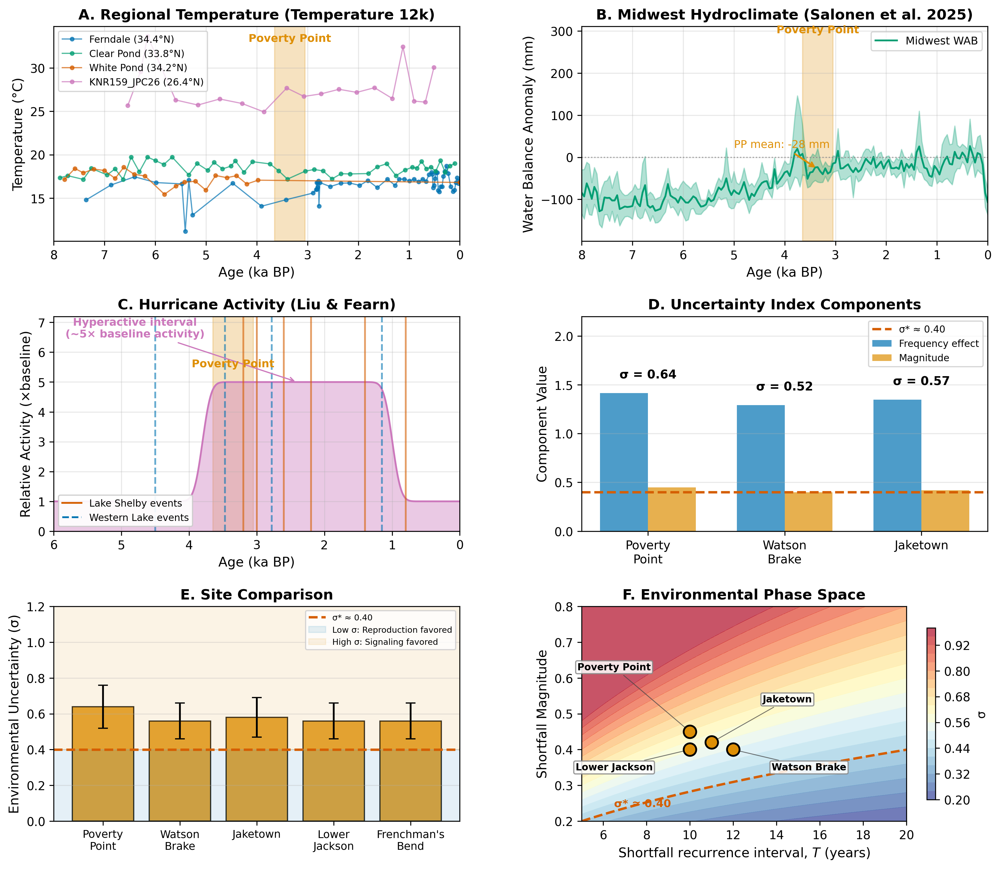

***Figure 11. Paleoclimate proxy synthesis for the Late Holocene Lower Mississippi Valley.*** *(A) Temperature 12k composite (Kaufman et al. 2020) showing relatively stable thermal conditions through the Poverty Point active interval (orange band, 3650-3050 cal BP). (B) Pollen-based Water Availability Balance reconstruction (Salonen et al. 2025) for the Midwest, showing drier-than-present conditions through the occupation with substantial centennial-scale variability and 200-year-periodicity oscillations large enough to produce ecologically consequential shortfalls (Shuman and Marsicek 2016). This centennial variability was spatially incoherent across the broader region (Salonen et al. 2025), so different parts of the exchange network would have experienced drought at different times, the precise condition under which inter-regional cooperation becomes adaptive. (C) Gulf Coast paleotempestology landfall frequency (Liu and Fearn 1993, 2000) showing the hyperactive hurricane interval (\~3800-1000 BP, landfall rates roughly 5× the baseline) overlapping the Poverty Point occupation. Individual events from Lake Shelby (Alabama, solid red lines) and Western Lake (Florida, dashed blue lines) are marked along the timeline. (D) Per-site decomposition of the composite uncertainty index* $\sigma = m\sqrt{20/T}$ *for the three highest-* $\sigma$ *LMV mound-building cases: Poverty Point (*$T = 10$ *yr,* $m = 0.45$*,* $\sigma = 0.64$*), Watson Brake (*$T = 12$ *yr,* $m = 0.43$*,* $\sigma = 0.56$*), and Jaketown (*$T = 11$ *yr,* $m = 0.43$*,* $\sigma = 0.58$*), showing the frequency-effect component* $\sqrt{20/T}$ *(blue bars) and magnitude component* $m$ *(orange bars). Dashed red line marks the analytical critical threshold* $\sigma^{*} \approx 0.40$*. (E) Cross-site composite uncertainty (* $\sigma$ *with ±1 SD error bars) across the five highest-* $\sigma$ *LMV sites (Poverty Point, Watson Brake, Jaketown, Lower Jackson, Frenchman's Bend). Each site's central estimate exceeds the* $\sigma^{*} \approx 0.40$ *threshold (dashed red line). (F) Environmental phase space defined by the shortfall recurrence interval (horizontal axis, mean years between shortfalls) and shortfall magnitude (vertical axis). The analytical critical-threshold contour* $\sigma^{*} \approx 0.40$ *(dashed red) separates the regime where the framework predicts independent foraging (lower-right, blue: long recurrence interval, low magnitude) from the regime where it predicts sustained aggregation (upper-left, red: short recurrence interval, high magnitude). The four interior LMV monument-building sites with the strongest paleoclimate estimates (Poverty Point, Watson Brake, Jaketown, Lower Jackson) all fall above the threshold contour at their LMV-derived* $(T,m)$ *coordinates.*

## 6. Empirical evaluation: Poverty Point and the LMV transition

We conducted eight evaluations of our framework using existing empirical evidence from the LMV record. Following the framework set out in §1 and developed in §7.4, each evaluation states what is fit, what is independent, and what inferential weight it carries. The status of each evaluation (what is fit, what is independent, inferential weight) is tabulated in §S7.0. The discriminating empirical claim is developed in §6.1.

The framework's discriminating empirical claim is the §6.1 concentration-ratio asymmetry, which is supported by the existing record (Smith 1991; Gibson and Griffing 1994; Mitch 2023; Kidder and Grooms 2025). Four further evaluations carry independent inferential weight, each with a stated bound: 6.1 distance-decay (rank correlation, but undiscriminating against transport-cost alternatives); 6.2 paleoclimate threshold-proximity (near-tie posterior, reflecting input uncertainty rather than a failed prediction); 6.4 interior-vs-coastal screening (sample limited to sites known to have built mounds); and 6.8 maintenance-to-new-construction event density (PP-vs-WB contrast follows from the signal-half-life mechanism without additional free parameters). The remaining four are calibration anchors (6.1 vol, 6.1 exotic), conditional consistency demonstrations (6.3, 6.6), descriptive (6.5), or plausibility checks (6.7). The §7.4 sharpening study would tighten the asymmetry test by examining the per-site concentration pattern across sites with independently established visitor-band status.

### 6.1 Calibration anchor and exotic-goods consistency

Our model uses abstract investment units rather than cubic meters or artifact counts. To compare model output with the archaeological record, we anchor to a single archaeological value and then evaluate whether other predictions hold at the same scale. In this study, we use Poverty Point's core earthwork volume of \~750,000 m³ (Gibson 2000; Ortmann and Kidder 2013) as the anchor. We use this number since the larger 1,000,000 m³ figure of Kidder and Grooms (2025) includes Motley Mound and adjacent Macon Ridge features whose contemporaneity with the active construction window is debated. The calibrated Poverty Point scenario, run with eight replicates of 200 simulated years each, yields a mean cumulative investment of 7,203 ± 3,276 (mean ± sample SD; ddof = 1 throughout; the wide replicate spread reflects genuine path dependence in the monument-network feedback across stochastic histories). Dividing the archaeological target by this replicate mean yields a scaling factor of approximately 104 m³ per investment unit. This factor is fit to the volume target and is therefore not itself a test. Its physical interpretation is roughly one large construction-crew day at PP scale: 65 laborers × 80 basket loads per person per day × 0.020 m³ per basket = 104 m³ per crew-day, of the same order as Erasmus's (1965) per-laborer rates. We treat it as a calibration anchor rather than an independently derived constant. The implication is that smaller construction events at sites that mobilize fewer laborers per event produce fewer m³ per unit of investment. We return to this point in §6.3 (Watson Brake) and §7.4 (priority model extensions).

The scaling factor is fit to the volume target, so the volume match itself is *not* validation. The remaining tests we report below are partial tests rather than fully independent predictions: (i) the exotic-goods count comparison uses the same simulation run that anchors the volume calibration, but exotic accumulation operates through different model pathways (acquisition probability, network connectivity) than monument investment, so it is informative even though not strictly out-of-sample; (ii) the distance-decay ratios are sensitive to a model parameter (the 500 km length scale) that was set in advance but is not derived from data outside the LMV; (iii) the regional site-hierarchy and temporal-pulse predictions are qualitative comparisons against patterns in the archaeological record. We describe each test below and note where the inferential weight is lower than that of a fully blind out-of-sample prediction.

For transparency, the parameter choices fixed before any of the comparisons reported here include: the 500 km exotic-acquisition length scale; the seven default cost, network, signaling, and conflict parameters listed in Supplemental Table S2; the Shannon-diversity zone-access scoring rubric in §S6; and the use of Poverty Point's core volume (\~750,000 m³) as the calibration anchor. The Watson Brake parameters in §6.3 below ($\sigma$, $\varepsilon$, $n_{agg}$) were derived from independent paleoclimate and Saunders et al. (2005b) site-description sources after PP calibration but before the model was run at WB inputs.

The first test of model behavior is whether the calibrated PP scenario produces archaeologically plausible exotic-goods counts under fixed-parameter operation. The calibrated Poverty Point scenario ($\sigma \approx 0.64$, $\sigma_{eff} \approx 0.38$) produces 7,203 ± 3,276 cumulative monument units and 10,883 ± 3,131 total exotic items across all five materials tracked (copper, steatite, galena, novaculite, and crystal quartz; the n = 395 quartz-crystal figure is from Webb 1982:Table 17), with bars in Figure 12 showing means across 8 stochastic replicates of 200 simulated years per scenario and error bars at ±1 sample SD (ddof = 1). Against this, the archaeological record documents 155 copper objects, 2,221 steatite fragments, and 740 galena masses and shaped objects (Hays 2019; Webb 1982). Per material, the model produces 106 ± 30 copper, 480 ± 116 steatite, and 702 ± 188 galena items (mean ± sample SD, eight replicates). These per-material counts are not directly comparable across the model-archaeology boundary, because the units of count differ. The model's "item" is a single acquisition event, equivalent to one imported *object* (one bowl, one mass, or one sheet). Steatite is reported as fragments, copper as objects, and galena as masses and shaped artifacts. Compared on a per-vessel basis, the model's 480 steatite acquisitions are consistent with the "several hundred vessels" estimate, whereas the raw fragment count would read as a 4.6× undershoot. Copper (0.68×) and galena (0.95×) are close to the recovered counts in like units. Novaculite and crystal quartz are also tracked, and enter the distance-decay test in Panel C at their best published counts at PP: 101 novaculite chipped-stone items (Gibson and Griffing 1994:Table 2, within a 3,046-item sample; Webb 1982:Table 9 reports novaculite only as a percentage within microflint and projectile-point classes and gives no site total), and 395 raw quartz crystals (Webb 1982:Table 17). Mitch (2023:145-146) reports novaculite at only \~5% of chipped stone at PP itself but \>80% at sites near the Ouachita source, indicating that PP sits downstream of the novaculite distance-decay rather than at its center. The model's uniform-acquisition treatment does not capture this material-specific asymmetry, and the distance-decay test in Panel C makes the consequences explicit.

We treat the per-material comparison as a posterior predictive check. Each material's eight-replicate distribution defines a 95% predictive interval at PP-calibrated parameters, and we ask whether the archaeological count falls inside it. *Copper* is the cleanest test in counting-unit terms (i.e., our model produces acquired objects, whereas archaeology counts objects): the central 95% predictive interval (mean ± 1.96 × SD) is \[47, 166\] and contains the archaeological count of 155 ($z = +1.6$). The model is consistent with the recovered count, though the observation sits near the interval's upper edge, and because copper preserves poorly in the corrosive Macon Ridge soils (Mariano 2011) the surviving 155 specimens are a lower bound on original deposition, so any residual error runs toward underprediction. *Galena* (model 702 ± 188; predictive interval \[333, 1070\]) contains the archaeological 740 ($z = +0.2$): the model is consistent with the recovered count in like units, with no correction invoked. *Steatite* depends on whether the archaeological count is taken as fragments (2,221) or vessels. Webb estimated a steatite-vessel cache at "several hundred vessels" and judged the site-wide total "must have been in the thousands" (Webb 1982:45). On a vessel basis, the model's predictive interval \[252, 707\] is consistent with Webb's several-hundred-vessel cache estimate. On the fragment basis, the model underpredicts by roughly 4.6×; that comparison is unit-mismatched and not directly interpretable without a fragments-per-vessel conversion, which the present model does not encode. The clear failures are the two *near-source* materials: the model produces 6,406 ± 1,923 novaculite and 3,190 ± 898 crystal-quartz acquisitions against archaeological counts of 101 and 395, overpredictions of roughly 63× and 8×. The model's acquisition rule is cost-driven, so cheap nearby materials are imported routinely; the record shows that near-source materials are rare at the type site (Mitch 2023). The framework's own signaling logic points at the discrepancy's direction (deposition at the hub should track signal value, which rises with source distance, rather than acquisition ease), but the model as implemented does not encode value-weighted retention, so the near-source overprediction stands as a genuine misfit rather than a reconciled one. The check is therefore consistent for copper and galena in like units and for steatite on a vessel basis, and inconsistent by roughly one to two orders of magnitude for the near-source materials.

Treating the four materials as independent checks overstates the strength of the comparison, because the model's predictions for them are correlated. Across the eight replicate runs, all four joint-check materials move together strongly ($r = 0.89$ to $0.99$): when one is high in a replicate, the others tend to be high as well, because all are driven by the same attendance and acquisition dynamics at the gathering site rather than by independent material-specific noise. We compute a joint Mahalanobis distance, a multivariate analog of the z-score that measures how far a four-material vector of counts is from the simulation's mean, accounting for correlations among the four counts rather than assuming independence. That four-material archaeological vector (copper 155, steatite 2,221, galena 740, crystal quartz 395) gives $d^{2} = 9,289$ against the simulation distribution, far outside any rejection threshold appropriate for an eight-replicate covariance estimate. The deviation decomposes into four substantively distinct sources: copper at $+ 1.6$ SDs (within noise); galena at $+ 0.2$ SDs (a match); steatite at $+ 15.0$ SDs (the published count is in fragments while the model produces vessels, with roughly five fragments per vessel reconciling the gap; Webb 1982:45); and crystal quartz at $- 3.1$ SDs (the near-source overprediction discussed above; novaculite, outside the joint vector, deviates comparably at $- 3.3$ SDs and by a larger ratio). Substantively, the consistency of the marginal checks is partly illusory: the materials are correlated, so a single inconsistent material undermines the joint reading, and a strict joint test rejects the framework's per-material counts strongly. The far-source, high-signal-value materials (copper, galena, steatite on a vessel basis) are consistent in like units, while the near-source materials are strongly overpredicted by the cost-driven acquisition rule. The joint rejection is carried by the unit-mismatched steatite fragment count and by the near-source misfit, and the near-source misfit is a genuine, informative failure rather than a reconciled one.

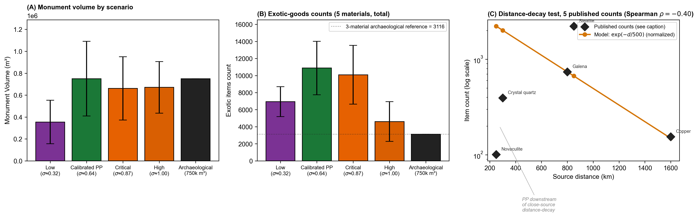

***Figure 12. Archaeological calibration with replicate-spread error bars.*** *Bars are means across 8 stochastic replicates, each with 200 simulated years per scenario. Error bars are ±1 sample SD (ddof = 1). (A) Monument volume comparison. The Poverty Point bar is calibrated to the archaeological 750,000 m³ target (calibration factor ≈ 104 m³ per investment unit at this parameterization, derived from a PP mean of 7,203 ± 3,276 cumulative units; ≈ one large construction-crew day at PP scale). The cross-scenario gradient (low \<\< PP \< critical ≈ high) is the phase-transition signal. (B) Total exotic-goods counts (all five materials: copper, steatite, galena, novaculite, crystal quartz). For unit-comparable per-material posterior predictive checks against the published archaeological counts of the three quantitatively documented materials (155 copper objects, 2,221 steatite fragments, 740 galena masses and shaped objects; Webb 1982; Hays 2019), see the prose at §6.1. The panel itself shows the framework's accumulation pattern across all five materials rather than a direct count comparison, since the model's "item" unit (one acquisition event) is not directly comparable to the archaeological fragment, vessel, or mass count without conversion. (C) Distance-decay test against five published counts (novaculite 101, crystal quartz 395, galena 740, steatite 2,221, copper 155 items at PP). The model's uniform-acquisition curve* $exp( - d/500)$ *(normalized to the maximum observed count) fits the three far-source materials closely (galena and copper sit on the curve; steatite plots above because Webb's count is in fragments, not vessels), but substantially overpredicts the two near-source materials (novaculite is at 5% and crystal quartz at 20% of the curve value), because PP sits downstream of those closest-source distance-decays rather than at their center. Reported summary statistics: Spearman rank correlation* $\rho = - 0.40$ *and log-space* $R^{2} = - 1.23$ *across the five materials, reflecting that the uniform model does not capture the near-source vs far-source asymmetry. The same statistics restricted to the three far-source materials (galena, steatite, copper) give* $\rho = + 0.50$*.*

The distance-decay prediction provides a partially independent test, with informative failures. The model's exotic-acquisition function $p(d) = exp( - d/500)$ predicts that material abundance at PP should fall off smoothly with source distance, so novaculite from the Ouachitas (\~250 km) should be the most abundant material, and copper from the Great Lakes (\~1,600 km) should be the least. Comparing the curve against five published counts at PP (novaculite 101, crystal quartz 395, galena 740, steatite 2,221, copper 155) gives Spearman $\rho = - 0.40$ and log-space $R^{2} = - 1.23$ across the full set: the uniform-decay model does not pass the test as posed. What the data show instead is a near-source/far-source split. The three far-source materials (galena at 800 km, steatite at 850 km, copper at 1,600 km) sit close to the model curve: galena at the model value, copper slightly above, and steatite above by the count-unit conversion already discussed (the Webb fragment count overstates the vessel count). Restricted to these three, Spearman $\rho = + 0.50$. The two near-source materials (novaculite at 250 km, crystal quartz at 300 km) plot well below the curve: PP holds 5% of the curve's predicted novaculite abundance and 20% of its predicted quartz abundance. This is consistent with Mitch (2023:145-146) and Gibson and Griffing (1994), who document that novaculite concentrates at sites near the Ouachita source and reaches PP only as a small intercept-and-transit fraction. PP is structurally downstream of those closest-source distance decays rather than of the acquisition hub, which the model's uniform-acquisition treatment does not capture. Read this way, Panel C is not a failed empirical fit but an empirical demonstration of a specific framework limitation: the model treats PP as a hub for all materials uniformly, whereas the data say PP is a hub for materials whose distance-coordinated procurement *requires* a partner network (far-source materials) and merely a downstream beneficiary for materials that closer sites can intercept (near-source materials).

Three caveats apply to this test. First, the 500 km characteristic length scale is a model parameter, not an *a priori* prediction, and it is not derived from data independent of the LMV. Second, the Spearman ranking is invariant under any monotonically decreasing $p(d)$, so any model in the uniform-decay family (including a generic transport-cost or down-the-line exchange model) would produce the same $\rho$. The Spearman result, therefore, does not discriminate the costly-signaling acquisition mechanism from those alternatives. Third, and substantively most important, the near-source vs far-source split that breaks the uniform fit is itself a prediction the framework can carry. Under the signaling reading, materials that require organized long-distance procurement through partner networks accumulate at the hub where the partner network meets (PP). The materials available from sources within a day-trip range of multiple regional sites, however, are intercepted at those sites before reaching the hub. The §6.1 concentration-ratio asymmetry analysis (95.7% of regional steatite and 97% of regional galena at PP; Smith 1991) is consistent with this reading: the two far-source materials whose distance-decay fits the model are also the two with the highest hub-concentration ratios. The §7.4(f) sharpening study, which would examine the per-site concentration pattern at independently-confirmed visitor-band sites, would tighten this reading.

The signaling-specific signature in the exotic record is an asymmetric concentration ratio: When partner-choice is a premium at the gathering, material accumulation should be strongly disproportionate at the hub, with visitor-band home territories retaining only the personal-effects fraction returning home with bands at the end of the gathering. At Poverty Point, exotic material arrives in metric-ton quantities (\~71 metric tons of lithic raw materials, with \~2,790 plummets, \~2,221 steatite fragments, \~740 galena pieces, and \~155 copper objects in the published inventory; Webb 1982), while hinterland PP-affiliated sites carry small but nonzero quantities of the same materials (Gibson and Griffing 1994; Mitch 2023). At the regional scale, 95.7% of all steatite and 97% of all galena are concentrated at the Poverty Point deposit (Smith 1991), and Kidder and Grooms (2025:7) describe the active-period flow as strongly asymmetric. The empirical question is therefore not whether outflow exists in principle, but whether the regional concentration ratio is high enough and the asymmetry sufficiently consistent to discriminate among the candidate mechanisms.

Generic down-the-line exchange predicts smooth distance-decay from each geological source with no single node dominating, ruled out by the Smith 1991 concentration figures. Risk-pooling, as social storage in the Halstead and O'Shea (1989) tradition, predicts bidirectional flow at the hub, with exotics moving in during productive years and out (or converted to subsistence media) during shortfall years. The observed pattern is monotonic inflow during the active period with low-magnitude hinterland leakage, consistent with personal-effects return rather than systematic redistribution. Subsistence-level risk-pooling among hunter-gatherers operates primarily through food, dried provisions, reciprocal labor, and hospitality during the dispersed phase, none of which are preserved archaeologically in the same way as galena and steatite, so the exotic-flow signature should be read as a secondary indicator of regional flow asymmetry rather than as a direct test of risk-pooling itself. The framework passes the discriminating empirical test on the existing data: under the signaling reading, signal-bearing materials concentrate at the gathering because the signal accrues there and decays for the absent, and the observed magnitude of the concentration asymmetry matches that prediction.

The postive results of coarse asymmetry test ("is the regional concentration ratio strong enough, and the asymmetry consistent enough, to distinguish hub-accumulation from bidirectional storage-and-redistribution or smooth distance-decay?") is supported by Smith (1991) on concentration, by Gibson and Griffing (1994) and Mitch (2023) on the low magnitude of hinterland counts, and by Kidder and Grooms (2025:7) on the strongly asymmetric character of flow during the active period. The finer-grained version of the test ("is the hinterland-to-hub concentration ratio specifically patterned at sites whose visitor-band status is independently established?") would require controlled provenience analysis of PP-style material at sites with independently determined participation status, which we identify as a sharpening study in §7.4. The coarse test is the discriminating test on the existing record. A fine-grained test would tighten it by examining the spatial structure of the asymmetry rather than its overall magnitude. We do not need the fine-grained test to discriminate the signaling reading from risk-pooling-as-social-storage and from down-the-line exchange. The existing record already does that. However, we do need it to characterize the system at finer site-by-site resolution.

### 6.2 Bayesian threshold-proximity under joint uncertainty propagation

A demanding test of the framework is whether environmental conditions estimated from paleoclimate proxies, with no archaeological data included in the $\sigma$ calculation, fall on the model-predicted threshold. The structural reasoning is that if Poverty Point exhibits the archaeological hallmarks of monumental aggregation, and the framework predicts that such aggregation should occur only when $\sigma$ exceeds $\sigma^{*}$, then estimating $\sigma$ from independent climate proxies and comparing it to $\sigma^{*}$ tests the prediction. If proxy-derived $\sigma$ falls *above* $\sigma^{*}$, the prediction holds. If it falls below, the prediction fails.

The "independence" framing of this test has a caveat: the model's threshold $\sigma^{*}$ is not derived independently of Poverty Point. The cost parameters ($C_{signal} = 0.18$, $C_{opportunity} = 0.12$), the within-group reward asserted at $\lambda_{W} = 0.15$, the network-saturation constants ($k_{\max}$, $M_{half}$, $\gamma$), and the default ecotone-weighting rubric were all chosen so that the model run at PP-scenario parameters produces a calibrated PP-scale operation. The §S3.1 one-at-a-time sensitivity table shows that $\sigma^{*}$ has a 0.225 swing under $\pm 50\%$ $C_{signal}$ and a 0.154 swing under $\varepsilon \in \lbrack 0.10,0.50\rbrack$. So $\sigma^{*}$ is conditioned on a parameter set chosen to be consistent with the Poverty Point operation, even though the paleoclimate $\sigma$ is independent of the Poverty Point archaeological record. The test below assesses whether paleoclimate $\sigma$ exceeds a model-defined threshold under PP-calibrated operating conditions. It does not evaluate whether Poverty Point-scenario conditions exceed a threshold derived without reference to the Poverty Point site. The test's inferential weight depends on this conditioning. A fuller test would propagate joint uncertainty over the parameter set that defines $\sigma^{*}$ as well. We identify this as a priority for empirical work in §7.4.

Our estimated regional uncertainty for Poverty Point ($\sigma_{LMV} \approx 0.64$, 95% CI 0.41-0.94) was derived from paleoclimate proxies (§5.5). The central estimate exceeds the model-predicted threshold ($\sigma^{*} \approx 0.40$ given the site's ecotone advantage; $\sigma^{*} \approx 0.57$ without). However, two sources of uncertainty must be propagated through the comparison: the paleoclimate uncertainty in $\sigma_{LMV}$, and the ecotone-weighting uncertainty in $\varepsilon$. Once both are propagated, the inference is more measured than the central estimate alone suggests.

We propagate this uncertainty using a Bayesian approach, which here means treating each unknown input as a probability distribution rather than a fixed number, drawing many simulated values from those distributions, and asking how often the model returns the "above threshold" conclusion across those draws. The fraction of draws above threshold is the probability that the framework's prediction holds, given what we honestly do and do not know about the inputs. In practice, we start by specifying reasonable ranges for the inputs we cannot pin down precisely (how often shortfalls occur, how severe they are, and how much the ecotone position buffers them), draw 1,000 samples from those ranges (the "priors"), and run the model on each sample. The result is a distribution of outcomes (the "posterior") for $\sigma$, $\varepsilon$, $\sigma_{eff}$, and $\sigma^{*}$ from which we can read off the probability that Poverty Point sat above the threshold. The shortfall priors are uniform on recurrence interval ($T \sim U\lbrack 6,18\rbrack$ years, bracketing late-Holocene LMV drought reconstructions) and magnitude ($m \sim U\lbrack 0.30,0.60\rbrack$).

Three different priors on the ecotone parameter test whether the result hinges on a specific operationalization. *Prior 1 (rubric):* uniform $\pm 0.2$ on each of the five PP ecotone weights, centered on the qualitative rubric of §S6. *Prior 2 (flat):* $\varepsilon \sim U\lbrack 0.10,0.50\rbrack$, treating the disagreement among GIS-derived and rubric-based estimates (Saucier-categorical 0.22, EPA L4 0.33, rubric 0.49, phenology 0.50) as genuine uncertainty over the operative quantity. *Prior 3 (GIS mixture):* draws from the four GIS-derived $\varepsilon$ estimates with $\pm 0.05$ jitter. Under the three priors, the average posterior $\sigma_{eff}$ is 0.324, 0.445, and 0.393, and the average posterior $\sigma^{*}$ is 0.357, 0.422, and 0.392. The probability that aggregation is adaptive at Poverty Point, $P(\sigma_{eff} > \sigma^{*})$, is **0.36** under the rubric prior, **0.56** under the flat prior, and **0.48** under the GIS-mixture prior. The probability rises rather than falls under less-informative priors, because lower-$\varepsilon$ samples raise $\sigma^{*}$ but raise $\sigma_{eff}$ even faster (since $\sigma_{eff} = \sigma(1 - \varepsilon)$). The qualitative conclusion that Poverty Point sits in the threshold zone is robust to the choice of prior. What is not robust is whether the site sits clearly above or below the threshold. The interval $P \in \lbrack 0.36,0.56\rbrack$ across plausible priors indicates a near tie rather than a confident result. Tightening the input distributions, either by using a narrower LMV-specific paleoclimate reconstruction or by deriving a covariance-based $\varepsilon$ from drainage-resolved hydrographs, would further shift the probability. The full sensitivity output is available in the project repository.

To address the conditioning caveat above, we extend the Bayesian propagation to include uncertainty in the model parameters that determine where $\sigma^{*}$ lies. We sample the six parameters that the §S3.1 sensitivity analysis identifies as determining $\sigma^{*}$ ($C_{signal}$, $C_{opportunity}$, $\lambda_{W}$, $k_{\max}$, $M_{half}$, $\gamma$) from independent uniform priors at $\pm 50\%$ around their default values, jointly with the rubric priors on $\sigma$ and $\varepsilon$. Across 1,000 joint samples (Figure S2; full output in the project repository), the posterior probability $P(\sigma_{eff} > \sigma^{*})$ is between 0.32 and 0.37 across Monte Carlo seeds (five seeds, 1,000 samples each), comparable to the 0.36 result under the rubric prior alone. The posterior on the gap $\sigma_{eff} - \sigma^{*}$ has a mean $- 0.05$ with a 95% interval $\lbrack - 0.26, + 0.18\rbrack$ that substantially straddles zero. The conditioning caveat is therefore real but bounded: the §6.2 result is robust against adding $\pm 50\%$ uncertainty in the parameters that fix $\sigma^{*}$, and the threshold-proximity claim does not depend on a precisely calibrated parameter set. It depends on the joint constraint that the paleoclimate inputs and the model-derived threshold sit in a roughly comparable range. The bounded reading is therefore: Poverty Point sits near the threshold under defensible parameter choices, the posterior probability spans roughly 0.32 to 0.56 across plausible prior structures and joint parameter propagation, and the §6.2 test is best interpreted as a near-tie that does not by itself confirm or refute the threshold-crossing prediction. The substantive content of the test, that the convergence of hydroclimate variability and elevated hurricane activity during the 3800-3050 BP interval produces the kind of magnitude-and-unpredictability combination the framework identifies as conducive to costly signaling, survives even where the binary threshold comparison narrows to a near-tie.

### 6.3 The Watson Brake near-threshold case

Watson Brake (16OU175, ca. 5400-4700 cal BP; Saunders et al. 2005b), the other major LMV monumental site, provides a more demanding test. Running the calibrated model at WB-appropriate parameters ($\varepsilon = 0.43$, $\sigma \approx 0.56$ from mid-Holocene LMV proxies, $n_{agg} \approx 8$ from the smaller monumental footprint) returns $\sigma^{*} \approx 0.38$, exceeded by $\sigma_{WB}$ by \~0.18 (fitness differential \~+0.12), roughly half the margin PP enjoys (\~0.28; differential \~+0.20). Solved as a continuous-equilibrium scenario, the model predicts \~240,000 m³ of earthwork at WB, compared to the LiDAR-derived per-mound volume of 27,065 m³ (§5.1). The overshoot ratio is approximately 9× (derivation in §S10.1).

The continuous-equilibrium overprediction is the framework's most demanding internal test, and we treat it as a substantive prediction problem requiring model extensions rather than a parameter-tuning issue. Two model components, developed in §S17 and applied here, close the gap, but each carries a parameter cost.

*Per-event labor scaling* (§S17.2). The conversion factor between simulated "investment units" and physical m³ of fill may vary across sites with different crew sizes. (The labor-scaling exponent $\alpha$ used here is unrelated to the vulnerability function $\alpha(k)$ of §2.4.) Coordination among many laborers may be more or less productive per worker than coordination among a few. We test two assumptions. With linear scaling ($\alpha = 1$, each laborer adds the same fill volume regardless of crew size, which Erasmus's 1965 ethnographic measurement of 2.6 m³/person-day supports under additive labor accounting), the model predicts \~77,000 m³ at WB, a 2.8-fold overprediction of the LiDAR-derived 27,065 m³: additive labor accounting narrows the continuous-equilibrium overshoot from \~9× to \~2.8× but does not close it. With superadditive scaling ($\alpha = 2$, larger crews achieve more m³ per laborer through coordination economies, beyond what Erasmus's data support and not measured in the literature for Late Archaic crew sizes), the predicted Watson Brake volume drops from \~240,000 m³ to \~25,000 m³, essentially matching the LiDAR-derived 27,065 m³ within \~9% (ratio 0.91×). Under the refined WB volume estimate, per-event labor scaling at $\alpha = 2$ closes the WB gap cleanly, without requiring the regime-switching extension below.

*Regime switching* (§S17.1). The continuous-equilibrium reading treats the system as smoothly transitioning from "no construction" to "full construction" the moment conditions cross the threshold. The regime-switching extension instead treats the system as having two distinct stable states (no aggregation, full aggregation) with a delay before bands commit to switching: conditions must remain above threshold for $K$ consecutive years before the population shifts to the construction regime, capturing the realistic time needed to establish trust and coordinate across bands. With year-to-year variability in $\sigma$, this turns the WB period into an intermittent flickering between regimes rather than a sustained construction interval, which matches the documented episodic record. Under the refined LiDAR-derived WB volume of 27,065 m³, the regime-switching predictions across $K \in \{ 1,2,3\}$ at $\sigma_{sd} \approx 0.10$-$0.125$ span \~5,400 to \~75,000 m³ (with $K = 1$ at the upper end overshooting by \~2.4 to 2.8× and $K = 3$ at the lower end undershooting by \~3.4 to 5×). The observed 27,065 m³ sits between these and is bracketed by an intermediate $K = 2$ value. Because the per-event labor-scaling extension above already closes the WB gap essentially exactly without invoking regime switching, the substantive role of the regime-switching mechanism is now to account for the *episodic tempo* of WB construction (matching the 200+-year inter-stage gaps documented by Saunders et al. 2005b), not to bracket the total volume.

The closure is therefore conditional on $\alpha = 2$ (ethnographically unsupported) and $\sigma_{sd} \in \lbrack 0.10,0.125\rbrack$ (paleoclimate-central). Regime-switching $K$ no longer drives the volume closure (it accounts for the episodic tempo), though $K \approx 2$ would bracket the LiDAR-derived 27,065 m³ between the $K = 1$ overshoot and $K = 3$ undershoot. It remains a demonstration of consistency conditional on a fitted labor-scaling exponent, not a passed test. The Watson Brake observation could have failed under arbitrary parameter choices. Under the ethnographically defensible $\alpha = 1$, the closure does not hold: the framework still overpredicts Watson Brake by approximately 2.8-fold (\~77,000 m³ against the observed 27,065 m³).

Three lines of independent evidence support the bistable reading (see § S10 for our full development). First, the 20-fold smaller monumental footprint at Watson Brake implies a per-event labor force that one to two bands could account for. Second, the 200+-year inter-stage gaps (Saunders et al. 2005b) match the on-again-off-again pattern predicted by the framework in the transition zone, where the system spends intervals in each regime rather than persisting in one. Third, the smaller margin between WB's environmental $\sigma$ and its $\sigma^{*}$ places WB within the narrow band of conditions where ordinary year-to-year fluctuations are large enough to flip the regime. In comparison, PP's larger margin keeps it firmly in the aggregating regime once the threshold is crossed. Taken together, the labor-scaling extension closes the WB volume gap and the regime-switching extension accounts for the episodic tempo of construction (matching the 200+-year inter-stage gaps documented by Saunders et al. 2005b).

We treat this as a *consistency demonstration conditional on parameter choices* rather than a passed test, because the labor-scaling exponent was not derived from independent ethnographic data: $\alpha = 2$ was selected to minimize log-overprediction across the eleven-site sample. Under the refined LiDAR-derived 27,065 m³, $\alpha = 2$ produces a near-exact match (0.91×). At $\alpha = 1$ (Erasmus-grounded), it overpredicts by \~2.8-fold. The regime-switching $K$ parameter is no longer required to bracket the volume observation (the labor-scaling extension closes the gap on its own). Its substantive role is to account for the episodic tempo of WB construction (the 200+-year inter-stage gaps), which it does for any $K \geq 1$ given WB's proximity to the threshold. The result demonstrates that the bistable framework reading is *consistent with* observed WB volume and tempo. It is not a test that the WB observation could have failed under arbitrary parameter choices.

### 6.4 Cross-LMV regional analysis

The framework's necessary condition for sustained aggregation is that the buffered uncertainty at the site, $\sigma_{eff} = \sigma(1 - \varepsilon)$, sits below the threshold $\sigma^{*}$. To screen LMV sites for this condition, we compute a Shannon diversity index across five resource zones at each site, using zone-access weights derived from published site-catchment descriptions (see the rubric in §S6). The screening sample is drawn from the known LMV monument-builder inventory plus two interior non-mound comparators (Cowpen Slough, J.W. Copes) and the Pearl River coastal pair (Claiborne, Cedarland) as the natural negative case, rather than from a random spatial sample of LMV habitable locations. The result of the screening is therefore a necessity-condition consistency check on sites that did become monumental and on the coastal pair as the natural negative case, not a sufficiency-condition discrimination across the LMV as a whole (we develop this limitation in the closing paragraph of this section). All nine interior sites cluster in the high-$\varepsilon$ band ($\varepsilon \approx 0.40$ to $0.49$), with predicted $\sigma^{*}$ comfortably below the regional $\sigma_{LMV} \approx 0.64$. Only the coastal Pearl River pair falls substantially lower ($\varepsilon \approx 0.30$ under the original coding. See corrected coding discussion in the closing paragraph). The static-diversity proxy distinguishes the interior sites from the coastal pair on the threshold dimension (Table 2).

Under the Kidder et al. (2025) revised chronology, Cedarland predates the Poverty Point active interval by approximately 500 years, while Claiborne is contemporary with PP. For the screening's coastal-PP-contemporary comparison, the operative test case is therefore Claiborne alone, not the Pearl River pair as a unit. Recomputing the static-diversity screening with Claiborne alone as the coastal-PP-contemporary negative case preserves the result: Claiborne sits at $\varepsilon \approx 0.40$ on the corrected zone-coding scheme (intersecting coastal marsh and the Coastal Plain Upland; see closing paragraph), against the interior PP-contemporary monument-builders' $\varepsilon \approx 0.42$-$0.49$ band, a smaller gap than the Pearl-River-pair-as-unit treatment suggested but in the same qualitative direction. Sassaman and Brookes's (2017) reading of the Claiborne soapstone cache as a terminal deposition of legacy material further supports treating Claiborne as a coastal site that did not develop the kind of sustained aggregation the framework links to high-$\varepsilon$ access, even on the corrected coding. The screening's qualitative result is robust to the chronological correction.

**Table 2.** *Shannon ecotone-diversity index and predicted critical threshold for eleven Middle Archaic and Late Archaic Lower Mississippi Valley sites. Zone-access weights are 0-1 estimates from published site descriptions per the rubric in §S6. H is the Shannon index across five zones.* $H/H_{\max}$ *normalizes by* $\ln 5$*.* $\varepsilon = (H/H_{\max}) \times 0.5$ *maps the normalized fraction onto the model's ecotone parameter. Predicted* $\sigma^{*}$ *uses* $n_{agg} = 25$*. The five zone-access weights* $(w_{a},w_{u},w_{d},w_{m},w_{p})$ *are for **a**quatic, **u**pland, **d**rainage, **m**ast, and **p**rairie zones. Observed monument scale (rightmost column) is ordinal: very large = type-site PP, mid = WB-scale (5+ mounds), small = 1-2 mounds, minimal = no monument or single-component construction.*

-----------------------------------------------------------------------------------------------------------------------------------------------------------------------------------------------------------------------------------------------------------------------------------------
  **Site**                     **Zones (aq, up, dr, mst, pr)**   $$\mathbf{H}$$   $$\mathbf{H}\mathbf{/}\mathbf{H}_{\mathbf{\max}}$$   $$\mathbf{\varepsilon}$$   **Predicted** $\mathbf{\sigma}^{\mathbf{*}}$   **Observed monuments**
---------------------------- --------------------------------- ---------------- ---------------------------------------------------- -------------------------- ---------------------------------------------- --------------------------------------------------------------------------
  Poverty Point (16WC5)        (1.0, 1.0, 1.0, 1.0, 0.5)         1.58             0.98                                                 0.49                       0.36                                           very large (\~750k m³, \~140 ha core)

  Lower Jackson (16WC10)       (1.0, 0.9, 0.9, 1.0, 0.3)         1.55             0.96                                                 0.48                       0.36                                           minimal (single mound, \~5500 cal BP)

  Watson Brake (16OU175)       (0.8, 0.7, 0.7, 0.8, 0.0)         1.38             0.86                                                 0.43                       0.37                                           mid (27,065 m³ per-mound, 11 mounds)

  Caney (16CT5)                (0.9, 0.6, 0.8, 0.8, 0.0)         1.38             0.85                                                 0.43                       0.38                                           mid (Middle Archaic; \~1.2× WB)

  Frenchman's Bend (16OU259)   (0.7, 0.5, 0.7, 0.7, 0.0)         1.38             0.86                                                 0.43                       0.38                                           Mid (5 mounds)

  Insley (16FR3)               (0.9, 0.6, 0.8, 0.9, 0.0)         1.37             0.85                                                 0.43                       0.38                                           mid

  J.W. Copes (16MA47)         (0.5, 0.6, 0.4, 0.7, 0.0)         1.37             0.85                                                 0.42                       0.38                                           none (PP-period satellite)

  Cowpen Slough (16CT147)      (0.9, 0.5, 0.8, 0.7, 0.0)         1.36             0.85                                                 0.42                       0.38                                           none

  Jaketown (22HU505)           (1.0, 0.3, 0.8, 0.5, 0.0)         1.30             0.81                                                 0.40                       0.38                                           small (3 PP-period mounds)

  Claiborne (22HA501)          (1.0, 0.5, 0.5, 0.3, 0.0)         1.29             0.80                                                 0.40                       0.38                                           minimal (shell ring; single-component construction, possible sand mound)

  Cedarland (22HA506)          (1.0, 0.5, 0.5, 0.3, 0.0)         1.29             0.80                                                 0.40                       0.38                                           minimal (shell/earth midden; non-mound construction)
  -----------------------------------------------------------------------------------------------------------------------------------------------------------------------------------------------------------------------------------------------------------------------------------------

A Monte Carlo perturbation of the zone weights (§S13) shows that the screening result is only partly robust against scoring uncertainty under the corrected coastal coding: Poverty Point ranks first in 86% of 1,000 perturbations, but the coastal Pearl River pair occupies the bottom two ranks in only 21% of draws (at baseline they tie Jaketown at $\varepsilon = 0.40$), and the full interior rank order is never preserved. The PP-first result is what the perturbation supports robustly. The interior-versus-coastal discrimination, which was robust under the original coastal coding, rests on small margins once the corrected coding credits the coastal pair's Coastal Plain Upland access, consistent with the qualification developed in the closing paragraph of this section.

Two limitations are worth naming explicitly. First, our sample is drawn from the known LMV monument-building inventory (seven interior mound sites) plus two interior non-mound comparators (Cowpen Slough, J.W. Copes) and the coastal Pearl River pair as the natural negative case, rather than from a random spatial sample of the region's habitable locations. The result that nine of nine interior sites pass the high-$\varepsilon$ filter is therefore not evidence that mound-building was confined to high-$\varepsilon$ locations across the LMV. It is a description of the catchment geomorphology of the LMV interior, where upland terrace, together with adjacent floodplain and backswamp settings, gives every habitable interior location a high-zone-count buffer. The two interior non-mound comparators have $\varepsilon$ values similar to those of the mound-building sites without themselves becoming monumental, consistent with high-$\varepsilon$ access being a necessary but not sufficient condition for the kind of sustained aggregation that produces monumentality (§6.6 develops the sufficiency question). Second, the static rubric under corrected zone weights no longer cleanly separates coastal from interior on the threshold dimension: Claiborne and Cedarland intersect coastal marsh and the Coastal Plain Upland (Gulf Flatwoods) and so receive upland weight 0.5 in Table 2, giving $\varepsilon = 0.40$ and predicted $\sigma^{*} \approx 0.38$, effectively the same threshold as Jaketown. What Table 2 still shows is that the coastal pair ranks lowest on static diversity (H = 1.29), though only marginally below the interior minimum (Jaketown, H = 1.30). The §6.5 multi-drainage analysis does not separate them more sharply either: the coastal pair integrates two independent shortfall regimes, the same count as Watson Brake, Frenchman's Bend, Caney, Insley, and J.W. Copes, with only Poverty Point and Lower Jackson (four) and Jaketown (three) ranking higher. The coast is therefore not quantitatively set apart from the interior comparators on any single static metric. We treat it as the natural negative case on structural grounds. It is the only site in a distinct estuarine ecoregion, where a single riverine input (the Pearl) feeds covarying estuarine and marsh zones under a shared storm- and salinity-driven shortfall, rather than the separate, low-covariance river systems plus an independent mast-forest upland that the interior sites combine, and it ranks lowest on both $\varepsilon$ and static diversity. The deeper point is that the screening is a necessity test, and the coast meets it about as well as the interior non-mound comparators (Cowpen Slough, J.W. Copes). What separates monumental Poverty Point from the coast and from those interior comparators alike is the attained aggregation size set by convergence dynamics (§6.6), not $\varepsilon$. The coastal pair is thus best understood as one of several sites where the necessary condition is met but monumentality did not follow, not as a site categorically excluded by low $\varepsilon$. Beyond this, Table 2 does not test the framework's magnitude prediction. The static zone count is not the operative quantity, as we discuss in §6.6.

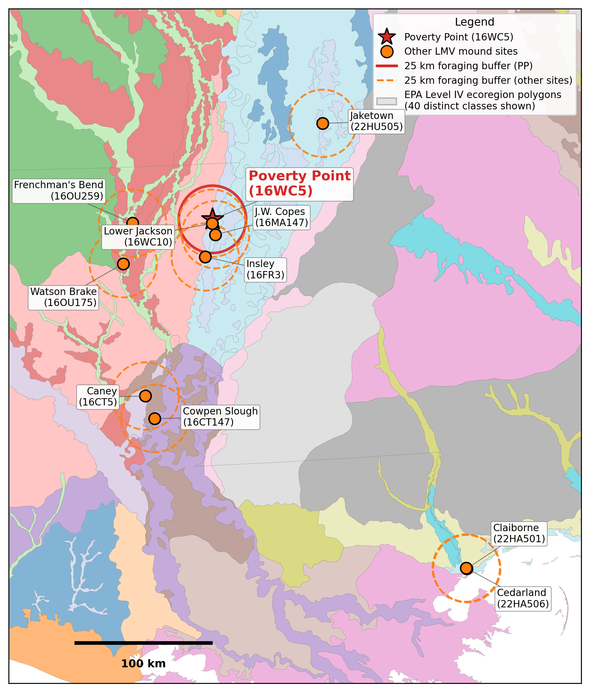

***Figure 13. Lower Mississippi Valley sites overlaid on EPA Level IV ecoregions: the static-diversity baseline.*** *Eleven Middle Archaic and Late Archaic sites (Table 2) shown with their 25 km foraging buffers on the EPA Level IV ecoregion polygon background (Omernik and Griffith 2014). Poverty Point (red star, solid red buffer) sits at the confluence of multiple Level IV polygons, including Macon Ridge (73j), Northern Holocene Meander Belts (73a), Northern Backswamps (73d), and the Mississippi alluvial valley.* *Caney's buffer* *crosses the highest count of distinct Level IV polygons (9) of any LMV site, with Cowpen Slough (8) and Watson Brake (7) next. Polygon coloring is categorical and arbitrary, and 38 distinct Level IV classes appear within the bounding box. The figure documents the static-diversity proxy used to compute the §6.4 screening result. We include it in the main text rather than supplemental because the visualization is the most direct way to see what the framework is and is not measuring at this resolution: the figure shows raw within-buffer ecoregion heterogeneity, which is the quantity the static rubric captures, but it does not capture the covariance-based multi-drainage shortfall buffering that the framework's* $\varepsilon$ *parameter encodes. The departure from static-diversity reasoning to covariance-based reasoning is the framework's substantive methodological move. Figure 14B shows the operative quantity that follows from that move (independent shortfall regimes per site from §6.5's USGS-gauge analysis).*

### 6.5 Multi-drainage shortfall buffering: USGS gauge analysis

The framework's $\varepsilon$ measures whether a site's accessible resource zones produce well during years when resources in surrounding areas are in short supply. The mechanism is statistical: zones drawing on different shortfall drivers tend to be productive in different years, so a site that integrates multiple independent drivers is buffered against any single regional shock. The framework predicts aggregation should concentrate at sites where this kind of buffering is strongest. Poverty Point's confluence position satisfies this in a way no other LMV site does: four canoe-accessible drainages (Bayou Maçon, Mississippi, Tensas, Yazoo) converge at PP. The Mississippi drains a continental basin and integrates snowmelt and storm-track variability across the central United States. At the same time, Bayou Maçon and the Tensas-Boeuf system are local-precipitation-driven sub-basins of Macon Ridge geomorphology. The Yazoo Basin is structured by separate Loess Hills runoff and backwater flooding from the main Mississippi (Saucier 1994).

Modern USGS gauge records establish that PP's catchment integrates **three substantively independent drainage signals** rather than four: Bayou Maçon and the Tensas River are highly correlated ($r = 0.90$ on log-monthly anomalies, n = 93), reflecting their shared Macon-Ridge geomorphology, and function as a single "Macon Ridge drainage system" from the framework's covariance-based $\varepsilon$ standpoint. The genuinely independent regimes are the Macon Ridge system, the Yazoo Basin (uncorrelated with the Mississippi at $r = 0.11$), and the Mississippi mainstem (partly shared with the Tensas at $r = 0.34$). Simultaneous bottom-quartile flow across the three independent regimes occurs in only \~10% of months. PP still integrates more independent shortfall regimes than any other site in Table 2 (each interior LMV site accesses one regime), but the per-site advantage is "three vs one" rather than "four vs one." Full pairwise correlation analysis in §S15.

One assumption deserves explicit treatment. We use modern hydrograph data as a first-order proxy for Late Archaic drainage independence, and the LMV catchment in the relevant window was substantially less constrained than the modern record reflects. The Vicksburg gauge post-dates the Mississippi River levee system, the Atchafalaya diversion, the Old River Control Structure, and the Yazoo Basin pumping program. The Bayou Maçon record is from a window (1985-1992) that does not even overlap with the Mississippi gauge's record period. The aspects of the late-Holocene Mississippi-Yazoo system most relevant for the framework's drainage-independence claim, on the other hand, are well documented in the geomorphological literature: Saucier (1994) reviews the LMV avulsion chronology and shows that the Stage 2 Mississippi (the configuration during PP's active interval) ran east of its modern course and was hydrologically connected to the Yazoo Basin through frequent crevasse splays and overbank events. Aslan, Autin, and Blum (2005) analyze the Holocene meander-belt sequence and document substantial pre-modern backwater connectivity between the Mississippi mainstem and the eastern tributaries (Yazoo and Tensas) via unconstrained flood-pulse dynamics. The implication is that the pre-modern unmanaged Mississippi-Yazoo correlation was plausibly higher than the modern record's $r = 0.11$. How much higher is not directly measurable, but the geomorphological literature is consistent with shifts in $\Delta r$ of $+0.20$ to $+0.40$ during periods of active eastern meander-belt activity. To bound the sensitivity of the three-regime claim under plausible Late Archaic conditions, we consider three cases: (i) modern correlation structure holds ($r = 0.11$), Poverty Point integrates three independent regimes (Macon Ridge system, Yazoo Basin, Mississippi mainstem); (ii) a $\Delta r = +0.30$ upward shift ($r = 0.41$), Yazoo and Mississippi remain substantively independent under any standard threshold ($r < 0.50$), and Poverty Point's three-regime claim survives; (iii) a $\Delta r = +0.50$ upward shift ($r = 0.61$), the Yazoo collapses into the Mississippi regime as a single integrated system, reducing Poverty Point from three to two independent regimes. The "unique multi-regime outlier" framing among LMV mound sites (in which every other interior site accesses one regime) persists as long as PP retains at least two independent regimes. That claim, therefore, holds under shifts up to $\Delta r \approx +0.50$. Under the most adverse plausible scenario (case iii), Poverty Point's advantage reduces from "three-vs-one" to "two-vs-one," still in the framework-predicted direction but with reduced quantitative magnitude. The qualitative multi-regime vs. single-regime contrast is robust to proxy uncertainty across the geomorphologically plausible range. The specific three-regime claim is conditional on the modern correlation structure approximately holding, a condition that the LMV avulsion literature has yet to settle.

When one regime is in short supply, the others typically are not. PP's bands could therefore draw on more zones for more of the year, during the very critical periods when surrounding LMV locations were less productive. The shortfall regimes are ecologically as well as hydrologically distinct: the floodplain river bottoms (Bayou Maçon, Tensas, Mississippi mainstem, Yazoo Basin) experience flood-timing and seasonal-inundation shortfalls that drive aquatic productivity, while the Macon Ridge and other upland terrace surface experiences mast-failure and drought shortfalls in oak-hickory forest productivity. No USGS gauge measures upland forest productivity, so the upland regime's correlations with the river-bottom drainages are assumed values in the catchment analysis rather than gauge estimates ($r = 0.45$ between Bayou Maçon and Upland; $r = 0.30$ between Yazoo and Upland; $r = 0.10$ between Mississippi and Upland; §S17.4 documents the assumption), all well below the $\rho \geq 0.6$ threshold for treating two regimes as the same shortfall channel. We therefore count the Macon Ridge (or other) upland as an independent regime wherever a site has direct canoe-day access at weight $\geq 0.5$. Under this count, Poverty Point and Lower Jackson each integrate four independent regimes (Bayou Maçon clustered with Tensas at $r = 0.90$ as one Macon-Ridge-bottom regime; Mississippi mainstem; Yazoo Basin; Macon Ridge upland); Insley (Macon Ridge, Franklin Parish) and J.W. Copes (Tensas Basin, Madison Parish) integrate two each (one local interior drainage plus upland access within the foraging buffer); Jaketown integrates three (Yazoo Basin, Mississippi mainstem partial, Loess Bluffs upland to the east); Watson Brake and Frenchman's Bend integrate two (Ouachita River-system regime plus the local Pleistocene-terrace upland); Caney integrates two (Catahoula tributary plus its local Pleistocene-terrace upland); Cowpen Slough integrates one (Red/Black confluence floodplain, with only marginal upland in its foraging buffer, coded conservatively as a single regime); the coastal Pearl River pair (Claiborne, Cedarland) integrates two (Pearl-River-estuarine/marsh system plus the Coastal Plain Upland Gulf Flatwoods, both structurally distinct from the LMV interior). Lower Jackson reaches the same four regimes as Poverty Point, although from ~3 km south of the confluence its access to the three aquatic regimes is partial rather than full (§6.7). The regime count here records only that both sites reach all four regimes, not that they reach them equally. That near-PP regime access, despite minimal construction (under the conventional chronology; see §5.1), is one of several anchors for the §6.6 point that high $\varepsilon$ is necessary but not sufficient for large-scale monument accumulation. The same point is demonstrated at the Insley and J.W. Copes sites, whose chronological assignments are not contested. Among LMV mound sites with substantial attained $n_{agg}$, Poverty Point is the unique outlier on the joint $\varepsilon \times n_{agg}$ surface, not on $\varepsilon$ alone.

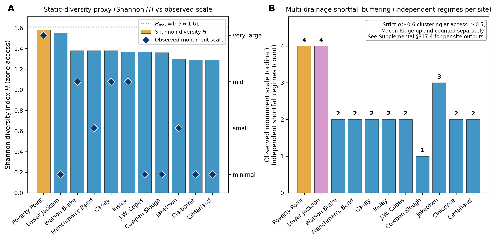

***Figure 14. Multi-drainage shortfall buffering across LMV mound-building sites.*** *(A) Shannon diversity index* $H$ *(bars) and ordinal observed monument scale (dark diamonds, right axis: minimal/small/mid/very large) for the eleven sites in Table 2. The dotted green line marks the maximum possible Shannon entropy with five equally weighted zones (*$H_{\max} = ln5 \approx 1.61$*). The interior sites span the* $H \approx 1.30\text{-}1.58$ *band (Jaketown lowest, at 1.30); the coastal Pearl River pair is only marginally lower, at 1.29. (B) Number of substantively independent shortfall regimes per site, derived from the modern USGS gauge correlation matrix (§S15) via* $\rho \geq 0.6$ *clustering at access* $\geq 0.5$*. Poverty Point and Lower Jackson each integrate four independent regimes (Bayou Maçon + Tensas at* $r = 0.90$ *clustered as one Macon-Ridge-bottom regime; Mississippi mainstem; Yazoo Basin; Macon Ridge upland, where the upland mast-forest shortfall regime is ecologically distinct from the river-bottom flooding regimes). Jaketown integrates three. Watson Brake, Frenchman's Bend, and most other interior sites integrate two, while Cowpen Slough integrates one. The coastal Pearl River pair also integrates two (a single Pearl River drainage feeding a covarying estuarine and coastal-marsh system, plus the adjacent Gulf Flatwoods upland), so the regime count alone does not set the coast apart from the interior comparators; what distinguishes it is the structurally distinct estuarine setting and its lowest Shannon diversity (Panel A), as developed in §6.4. Lower Jackson's PP-comparable regime access, combined with single-band, single-event construction, is the case §6.6 develops. PP is the unique outlier on the joint* $\varepsilon \times n_{agg}$ *surface rather than on* $\varepsilon$ *alone. The contrast between Panel A (static-diversity proxy showing similar values across sites) and Panel B (multi-drainage shortfall buffering showing the framework's actual operative quantity) makes the central methodological point: the static proxy does not differentiate the sites well because it does not measure the covariance-based shortfall buffering that the framework's* $\varepsilon$ *encodes.*

A defensible test of the magnitude prediction requires a covariance-based, water-route-aware operationalization (drainage-resolved hydrographs, species-level seasonal productivity, canoe-day isochrones) that the present article does not perform. We identify this step as the water-route-catchment component (§S17.4), with paleo-discharge-resolved follow-up flagged for future work in §7.4.

### 6.6 Convergence dynamics and the magnitude limit

The framework takes the attained crowd size $n_{agg}$ as an external input set by regional convergence dynamics rather than deriving it from first principles. It therefore predicts *which regime* a site occupies (aggregator-dominated or not) but not the *magnitude* of monument investment a site ultimately attains. Magnitude variation among the high-$\varepsilon$ sites is set by two factors the static rubric does not measure: differential covariance-based $\varepsilon$ (multi-drainage shortfall buffering, addressed in §6.5), and attained aggregation size $n_{agg}$ via convergence dynamics. The convergence dimension is itself substantive. Lower Jackson, with the second-highest static $H$ in the LMV, is a single isolated mound built \~5,500 cal BP and represents a single-band or single-event construction with no associated evidence of residential activity or exchange (Saunders et al. 2001). Watson Brake, J.W. Copes, and Jaketown all sit in the high-$\varepsilon$ band but never achieved comparable scale. Poverty Point's primacy follows from the combination of confluence-based shortfall buffering with a uniquely large attained $n_{agg}$, driven by the convergence of multiple cultural traditions documented by Grooms et al. (2023) and Kidder and Grooms (2024). Of the high-$\varepsilon$ LMV sites, Poverty Point is the one that drew bands from across the midcontinent. The others operated at much smaller $n_{agg}$, which the framework predicts produces correspondingly smaller fitness differentials and equilibrium monument stocks.

The framework's joint $M_{g}(\varepsilon,n_{agg})$ formula (§2.4) lets us compute the predicted equilibrium monument stock at each Table 2 site using each site's $\varepsilon$ value from the static rubric and an $n_{agg}$ value from the convergence-model literature (the values used in the computation are PP $= 25$; Jaketown and Watson Brake $= 8$; Insley $= 6$; Caney and Frenchman's Bend $= 5$; Pearl River pair $= 4$; J.W. Copes and Cowpen Slough $= 3$; Lower Jackson $= 1$; §S17.5). The rank correlation between predicted and observed scale across the eleven sites is high, with $\rho$ ranging from $+ 0.85$ to $+ 0.92$ (depending on the $\varepsilon$ operationalization and on whether the observed scale is treated as an ordinal class or an absolute volume).

While this result appears to be a strong magnitude prediction, it is not. The two predictors that go into $M_{g}$, the framework's $\varepsilon$ and the imported $n_{agg}$, are not independent contributors to the joint correlation. We need to ask how much $\varepsilon$ adds *given that we already know* $n_{agg}$. The standard statistical tool for this is partial correlation, which measures the association between two variables after accounting for the effect of a third variable. If $n_{agg}$ alone is doing all the predictive work, then knowing $\varepsilon$ on top of $n_{agg}$ should add nothing, and the partial correlation between $\varepsilon$ and observed scale (holding $n_{agg}$ constant) should be near zero.

The analysis returns two complementary answers. The partial correlations between $\varepsilon$ and the observed outcomes given $n_{agg}$ are moderate for the static rubric ($+0.41$ against ordinal scale, $+0.52$ against volume) but statistically indistinguishable from zero at $n = 11$, and they change sign across the three $\varepsilon$ operationalizations (Table 3). More decisively for the joint result, substituting any of the three $\varepsilon$ variants into the equilibrium $M_{g}$ prediction changes the joint correlation by at most $\pm 0.02$ relative to ranking sites on $n_{agg}$ alone. The joint correlation is driven by $n_{agg}$ and is imported from the convergence-model literature rather than deriving from first principles. Full analysis is in `scripts/analysis/partial_correlation_eps_nagg.py`.

**Table 3.** *Partial-correlation decomposition of the §6.6 joint magnitude result.* *Zero-order correlations are computed against observed monument scale (ordinal: minimal/small/mid/very-large) and observed monument volume (m³, log scale). Partial correlations are rank-based (partial Spearman) controlling for* $n_{agg}$*; none is statistically distinguishable from zero at* $n = 11$*. The marginal change in the joint* $M_{g}$ *prediction from substituting any* $\varepsilon$ *variant, relative to ranking on* $n_{agg}$ *alone, is at most* $\pm 0.02$*.*

-----------------------------------------------------------------------------------------------------------------------------------------------------------------------------------------------------------------------------------------------------------------------------------------------------------------
  **Predictor**                                            **Zero-order** $\mathbf{\rho}$ **vs scale**   **Zero-order** $\mathbf{\rho}$ **vs volume**   **Partial** $\mathbf{\rho}$ **vs scale, given** $\mathbf{n}_{\mathbf{agg}}$   **Partial** $\mathbf{\rho}$ **vs volume, given** $\mathbf{n}_{\mathbf{agg}}$
------------------------------------------------------- --------------------------------------------- ---------------------------------------------- ----------------------------------------------------------------------------- ------------------------------------------------------------------------------
  $n_{agg}$ alone (convergence model)                                      $$+ 0.87$$                                     $$+ 0.91$$                                                        ---                                                                           ---

  $\varepsilon$ (Shannon-rubric, §S6)                                      $$+ 0.39$$                                     $$+ 0.42$$                                                    $$+ 0.41$$                                                                    $$+ 0.52$$

  $\varepsilon$ (EPA Level IV, §S12)                                       $$+ 0.24$$                                     $$+ 0.07$$                                                    $$+ 0.48$$                                                                    $$+ 0.16$$

  $\varepsilon$ (phenology, §S16)                                          $$- 0.21$$                                     $$- 0.05$$                                                    $$- 0.53$$                                                                    $$- 0.25$$

  Joint $M_{g}(\varepsilon,n_{agg})$, model equilibrium                    $$+ 0.85$$                                     $$+ 0.89$$                                                        ---                                                                           ---
  -----------------------------------------------------------------------------------------------------------------------------------------------------------------------------------------------------------------------------------------------------------------------------------------------------------------

The framework's $\varepsilon$, therefore, does not predict cross-site magnitude in any substantive sense. The convergence-model literature is. The joint $\rho$ result is a *within-model consistency demonstration* that the framework's equilibrium $M_{g}$ tracks $n_{agg}$ in the expected direction. It is not an independent prediction of cross-site magnitude by the framework.

This finding makes a central concession: the framework predicts the necessity and tempo of threshold crossing, not cross-site magnitude. The $\varepsilon$ parameter is a necessity-condition variable. It asks whether a site's combination of accessible resource zones, with their independent shortfall regimes, is sufficient for aggregation to persist there at all, rather than how large the resulting investment will be. The screening test it supports (interior monument-building sites meet the necessity threshold, while the coastal Pearl River pair does not) carries the inferential weight. Tests against magnitude were never the right tests of the framework's $\varepsilon$. The structural-vs-contingent decomposition that organizes this finding parallels Sassaman's (2005) structure-event-process framework: both readings agree that the necessary structural conditions are met across multiple LMV sites and that contingent convergence dynamics set the historically realized concentration at Poverty Point. The two readings disagree about the *weight* of the structural register. We do not know how much of the LMV pattern the structural conditions actually account for and whether the convergence dynamics themselves can be derived from the structural conditions or must be imported from outside. The disagreement is therefore not over the decomposition itself but over what fraction of the explanatory work each register does. We engage that contested weight in §7.2 and identify the prospectively discriminating evidence that might be observable in future work.

### 6.7 Within-year aggregation timing (plausibility check, not independent test)

The framework's annual cycle in the ABM defaults to aggregating in summer, with bands dispersing back to home territories for fall harvest, winter, and spring. A within-year monthly time-step model (§S17.6) generates the framework's predicted timing of aggregation for comparison with the published archaeological evidence. We flag this section as a plausibility check rather than an empirical test because the available evidence does not directly constrain seasonality at the Poverty Point monumental core. Faunal preservation at the type-site is poor because acidic soils dissolve bone, so direct seasonality determinations from faunal remains are not available, regardless of which excavator looked. Thomas and Campbell (1978) worked at peripheral Poverty Point-period sites where the same preservation problem precluded seasonality work on bone. Their plant-remains analysis is consistent with fall-winter occupation, possibly extending into summer, with no plant evidence for spring, based on which they inferred band dispersal during spring and possibly until late summer. Jackson did not analyze faunal material from the type-site itself. At the J.W. Copes site, his statements range from a possible mid-winter abandonment to year-round occupation (Jackson 1986). More recent macrobotanical analyses from the type site itself recover early-summer-ripening native cultigens (maygrass and little barley) alongside fall-ripening nuts and fruits, documenting plant use that extends from late spring and early summer through fall at the monumental core (Leone 2014, 2020). The early-summer cultigen counts are modest, and because the seeds are storable their presence does not by itself fix the season of deposition; but they are direct type-site evidence against the earlier inference, drawn from peripheral assemblages, of no spring or early-summer plant use. The published evidence base therefore no longer supports a clean fall-winter-only signal with spring dispersal. It indicates fall-dominated nut and fruit use with a documented late-spring and early-summer cultigen component at the monumental core, the direction the framework's multi-peak prediction anticipates. The remaining path to direct constraint on aggregation timing runs through non-faunal seasonality proxies rather than reanalysis of bone.

The within-year analysis rests on a regional phenology calendar of five resource peaks driven by independent climate and ecological mechanisms (Figure 15A): hardwood mast (fall), spring fish spawn, summer aquatic productivity, falling-water aquatic concentration (late summer to early fall), and migratory waterfowl (separate fall and spring migration peaks). Each LMV site's access to these peaks depends on which canoe-accessible drainages and habitats sit within reach during each month (Figure 15B). The site-level distinction the framework cares about is not how many resource zones a site contains within a 25 km terrestrial buffer (the static-diversity proxies of §6.4 measure that), but how many *independent* peak windows it integrates: peaks driven by different mechanisms tend not to fail in the same year, which is what produces the negative covariance the framework's $\varepsilon$ encodes.

The temporal-peak access pattern across LMV sites is shown in Figure 15. Panel C reports a weighted peak-access sum (each of the five peak windows contributes 1.0 for full access, 0.5 for partial single-drainage access, 0.0 for no direct access; maximum 5.0). Poverty Point sits at the maximum (5.0); J.W. Copes and Jaketown follow at 4.0; Lower Jackson at 3.5; Watson Brake and Cowpen Slough at 3.0; Frenchman's Bend and Insley at 2.5; Caney, Claiborne, and Cedarland at 2.0. The weighted sum graduates the partial-access codings that a binary count collapses. It produces a hierarchy that places PP alone at the top and grades the remaining sites by how much of the regional peak-access profile they integrate. The discrimination operative for the framework's $\varepsilon$ parameter combines this peak-breadth signal with the multi-drainage redundancy visible in Panel B: each peak window at PP is contributed by multiple independent canoe-accessible drainages, producing a higher per-month peak-access weight (warmer cells) than at sites where a single drainage contributes the same peak window. Lower Jackson's intermediate weighted-sum value (3.5), for a site only ~3 km from Poverty Point, comes entirely from its aquatic access. It reaches the same four resource regimes as PP (the identical §6.5 regime count), and its terrestrial access matches PP's: full access to the Macon Ridge hardwood mast and to migratory waterfowl. The three aquatic peak windows are where the two diverge. Poverty Point sits at the multi-drainage confluence and draws the spring fish spawn, summer aquatic, and falling-water concentration peaks each from several independent channels (full access, 1.0), whereas Lower Jackson, ~3 km south of the junction, reaches them through a single, less direct drainage approach (partial access, 0.5; per-window coding in §S16). The §6.5 regime count records that both sites reach all four regimes; the phenology weighting additionally registers that Lower Jackson's access to the aquatic peaks is partial rather than full, reflecting its slightly greater distance from the active floodplain at the confluence. Combined with its single-band, single-event construction, this reinforces the §6.6 finding that high $\varepsilon$ access is necessary but not sufficient for sustained large-scale aggregation. PP is the unique outlier on the joint $\varepsilon \times n_{agg}$ surface, not on $\varepsilon$ alone. Full per-site coding and analysis are in §S16.

We acknowledge a structural caveat. The minimal phenology calendar places the mast peak window from Webb (1982) and Jackson (1986) as Sep-Nov, then ranks months by integer count of overlapping peak windows under the framework's threshold logic. The peripheral-site plant-remains interpretation of Thomas and Campbell (1978) draws on the same primary sources, so the "match" between the extension's top-3 months (October, September, November) and the published fall-winter interpretation reflects the same calendar rather than an independent test. The minimal extension serves as a *plausibility check* on the framework's logic rather than an independent prediction of the seasonal pattern. The macrobotanical evidence of Leone (2014, 2020) is, by contrast, independent of the Webb and Jackson sources that define the calendar: its early-summer cultigens and fall nuts and fruits come from new type-site flotation rather than from the same publications, and so provide a partly non-circular check that points in the multi-season direction.

The seasonally resolved component (§S17.6) generates one falsifiable prediction. The framework's broader-window output shows a substantial aggregation share in spring fish spawning (Mar-May) and summer aquatic months (Jun-Aug). This was in tension with the older peripheral-site inference of spring dispersal (Thomas and Campbell 1978), but recent type-site macrobotanical work recovering early-summer-ripening cultigens (Leone 2014, 2020) is consistent with the predicted late-spring and summer plant use. Because acidic soils have dissolved the bone, this tension cannot be adjudicated by faunal seasonality analysis at the monumental core. The falsifiable test is therefore new research using non-faunal seasonality proxies, including macrobotanical assemblages from new excavations, phytolith and pollen records from contexts that preserve those signatures, stable-isotope sequencing of preserved tooth or shell where present, and microbotanical residues. An exclusively fall-winter signal across multiple such proxies would be at odds with the framework's predicted multi-peak aggregation. A multi-peak signal across mast, fish-spawning, and summer aquatic months, however, would be consistent with it. We identify this as a falsifiable test (§7.4) that requires new fieldwork and analysis using non-faunal methods rather than reanalysis of existing faunal collections.

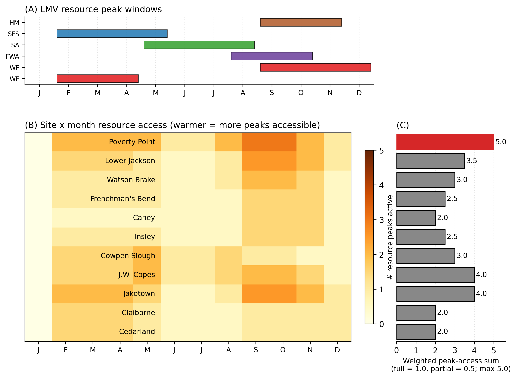

***Figure 15. Seasonal phenology of LMV resource peaks and site-level access.*** *(A) Five resource-peak windows in the Lower Mississippi Valley driven by independent climate and ecological mechanisms (per Webb 1982, Jackson 1986, Ward et al. 2022): hardwood mast (HM, brown), spring fish spawn (SFS, blue), summer aquatic (SA, green), falling-water aquatic concentration (FWA, purple), and migratory waterfowl (WF, red; fall and spring migrations are shown separately). (B) Site-by-month resource access matrix for the eleven LMV sites in Table 2. Cell darkness encodes the number of resource peaks accessible to each site that month, weighted by access fraction (full = 1.0, partial = 0.5; per-site coding in §S16). (C) Weighted peak-access sum per site, with Monte Carlo $\pm 1$ SD error bars (each of the five peak windows contributes 1.0 for full access, 0.5 for partial single-drainage access; maximum 5.0). Error bars come from 1,000 MC draws that perturb each non-zero access flag by $N(0, 0.10)$, truncated to $[0, 1]$, to bracket rank-order sensitivity to subjective coding choices. Point estimates: Poverty Point alone at 5.0; J.W. Copes and Jaketown at 4.0; Lower Jackson at 3.5; Watson Brake and Cowpen Slough at 3.0; Frenchman's Bend and Insley at 2.5; Caney, Claiborne, and Cedarland at 2.0. The PP hierarchy at the top of the ranking is robust to the MC perturbation (PP ranks first in more than 95% of draws). The interior ordering of the middle band is less stable under perturbation. The weighted sum of graduates' partial-access codings that a binary count collapses into, producing a hierarchy that combines peak breadth (how many peak types the site reaches) and access depth (full vs. partial). Discrimination operative for the framework's* $\varepsilon$ *parameter combines this peak-breadth signal with the multi-drainage redundancy visible in Panel B (PP's row is uniformly warmer because multiple independent drainages contribute to each peak window) and with the regime-count hierarchy of §6.5 (Figure 14B).*

### 6.8 Construction tempo and pulsed accumulation

The framework predicts pulsed construction following from the seasonal aggregation cycle: each gathering produces a rapid construction episode (the signal for that year), and the accumulated product of many such episodes over the active interval creates the multi-component site. The signal-half-life argument (§2.2) sharpens the prediction. Monuments persist physically after the bands that built them are gone, so the signal value of any single construction event decays on the social timescale of band turnover, and ongoing investment is required to renew the signal on the timescale relevant to current partner choice.

The Poverty Point construction record matches this pattern. Individual episodes are rapid (Mound A in \<90 days, and the investigated segment of Ridge 3 West in days to weeks; Kidder et al. 2021; Ortmann and Kidder 2013), yet the site as a whole accumulated through many such episodes, with magnetic gradient survey identifying 64 distinct ridge construction components (Hargrave et al. 2021) and Clay (2023) documenting repeated build-decommission-rebuild cycles in plaza post circles and Ortman (2010) identifying 16 sequential prepared activity surfaces beneath Mound C. The site is, as Clay (2023) argues, "the physical remnant of several abandoned projects" rather than a master plan. The framework resolves the apparent tension between rapid individual episodes and the multi-component site. Each seasonal gathering produced a rapid construction episode, and the cumulative result of many such episodes over the \~75-year active window made the site archaeologically visible. The pulsed-construction pattern fits both the seasonal-aggregation cycle and the signal-half-life reading, and contemporary geoarchaeology converges on this pattern across different theoretical framings.

The signal-half-life argument also generates a quantitative prediction that the existing PP and WB records can test. The reasoning runs as follows. If finished earthwork loses its value as a signal of current cooperative capacity as the bands that built it disperse or are replaced, then a community-at-large accumulated stock has to spend a rising share of its labor just keeping that signal current. New construction adds to the stock. Renewal and maintenance keep the existing stock signaling in place. A young system at low stock is mostly building new. A mature system at high stock is mostly maintaining what it has. The two regimes leave different archaeological signatures, with the mature-system regime producing many small renewal events (re-cappings, prepared surfaces, post-circle rebuilds). In contrast, the young-system regime produces fewer larger initial-construction events with long gaps between them.

Formally, the framework treats the monument stock $M_{g}$ as follows: the recurrence $M_{g}(t + 1) = (1 - \delta)M_{g}(t) + I_{g}$, where $\delta$ is the per-year decay rate of the signal value and $I_{g}$ is each year's investment flow. Each year's labor splits into a part that offsets decay, $\delta M_{g}$, and a part that adds net new stock, $I_{g} - \delta M_{g}$. Their ratio $R(M_{g}) = \delta M_{g}/(I_{g} - \delta M_{g})$ starts at zero (when the system is young) and rises without bound as the stock approaches its steady state $M_{g}^{*} = I_{g}/\delta$ (when the system is fully mature and every unit of labor is going to maintenance). Run at PP parameters ($\sigma = 0.64$, $n_{agg} = 25$, $\delta = 0.08$), the model predicts a steady-state stock of about 130 units, reached within about 50 years (the decay timescale is $1/\delta = 12.5$ yr). Across PP's 75-year active interval, cumulative maintenance labor is about five times cumulative new-construction labor, meaning roughly 83% of total labor went to renewal rather than to net stock growth. At WB parameters ($\sigma \approx 0.56$, $n_{agg} \approx 8$) operating in the documented episodic pattern of four short construction bursts separated by 200+ year hiatuses (Saunders et al. 2005b), each new burst begins from a stock that has decayed substantially during the gap, so each burst looks more like initial construction than like maintenance.

The discriminating prediction the framework makes is therefore the event density averaged across each site's full active interval. PP shows at least 100 documented construction events (the 64 ridge components from Hargrave et al. \[2021\], the build-decommission-rebuild cycles in the plaza post circles from Clay \[2023\], and the 16 sequential prepared surfaces beneath Mound C from Ortmann \[2010\]) across 75 years, which is about 1.3 events per year. WB shows 11-20 events over 700 years, averaging about 0.02-0.03 events per year. The PP-to-WB ratio of 47-85$\times$ is in the direction predicted by the framework and matches its order-of-magnitude expectation. The contrast comes from the same signal-half-life mechanism that drives the rest of the model: PP held its stock near saturation for the duration of its active interval, so each year's labor was renewal-weighted, while WB's episodic gaps reset the stock toward zero between bursts, so each burst resembled initial construction at a smaller scale. No additional free parameter is introduced. We list the contrast as a falsifiable prediction in §7.4(h). A reversal or sub-order-of-magnitude reduction would weaken the signal-half-life mechanism. 

Several caveats are worth flagging. The model treats $I_{g}$ as constant from year to year, which does not capture the concentrated labor bursts documented for Mound A, which was raised in fewer than 90 days within the active interval rather than at a steady annual rate (Ortmann and Kidder 2013). This approximation leaves the cumulative maintenance-vs-new split unaffected, though the year-by-year ratio is approximate. Published event counts include both maintenance/renewal events and new-construction events, with no clean separator in the field record. The decay rate $\delta = 0.08$ is taken from the weathering-rate range in Table S2 rather than from a site-specific decay study. 

Most importantly, the "event" units at the two sites are not directly commensurable: PP events include post-circle rebuild cycles, prepared surfaces beneath mound caps, and ridge components recovered through magnetic gradient survey (mixed maintenance and construction events documented through different lines of evidence), while WB events are mound stages from Saunders et al. (2005b). The order-of-magnitude contrast (PP-to-WB ratio in the predicted direction) is robust to unit-conversion uncertainty, because no plausible re-classification of WB stages or PP components would move the contrast by more than a factor of two or three, well within the 47-85$\times$ headline ratio. The precise ratio is not robust: depending on how PP events are aggregated and how WB stages are subdivided, the headline could plausibly be re-stated in the 30-100$\times$ range. The prediction is therefore structural (the direction and order of magnitude of the PP-vs-WB contrast) rather than precise (R values and the headline ratio are not labor-unit-resolved). A sharper version of the test would require a single event-coding protocol applied to both sites with explicit treatment of which events are documented through which lines of evidence (gradiometry vs core stratigraphy vs surface mapping).

## 7. Discussion

### 7.1 What the framework predicts and what it does not

The framework predicts threshold-crossing locations and aggregation tempo. It does not predict the magnitude of cross-site monument volume. This finding is not a limitation we have only just discovered. It is a structural property of the model. Magnitude depends on the attained aggregation size $n_{agg}$, which is taken as exogenous (set by the contingent regional convergence dynamics documented by Grooms et al. 2023 and Kidder and Grooms 2024) rather than derived from first principles. Because the framework also does not fix the form signaling takes, a site that invested less in monuments but more in other honest signals (exotic acquisition, lapidary production, feasting) is consistent with the framework rather than a counterexample to it.

The framework commits the model to five structural claims about the LMV record. First, threshold-crossing necessity: sustained monumental construction by mobile foragers should occur only at sites where regional environmental uncertainty exceeds the model-derived threshold, with independent foraging dominating below it. Second, a pulsed construction tempo. Because the signal value of any completed feature has a half-life on the social timescale of band turnover, construction should proceed episodically rather than steadily, with each episode renewing the signal on the timescale relevant to current partner choice and cumulative volume recording many individually honest signals stacked over the active interval. Third, a distance-decay shape in exotic acquisition: the acquisition function generates a monotonic decay of relative frequency with source distance, whose shape depends on the characteristic length-scale parameter. Fourth, a sharp phase transition, concentrated in a narrow range of conditions ($\sigma$ within $\pm 0.10$ of $\sigma^{*}$ in our parameterization) rather than tracking environmental stress continuously. Fifth, an asymmetric flow signature: exotic goods in an aggregation-centered signaling system should flow toward the gathering rather than from it. That asymmetry should itself be patterned. Signal-bearing markers appear at sites whose bands attended the aggregation as visitor-source partners, where the signal does its social work, and are absent at peripheral sites whose bands did not attend, where it would have no audience.

There are three claims the framework explicitly does not make. It does not predict the magnitude of cross-site monument volume. Three independent magnitude tests across LMV sites confirm this limit: the Table 2 Shannon-derived $\varepsilon$ correlates only weakly with ordinal observed monument scale (Spearman $\rho = + 0.39$, $p = 0.24$); the §S12 EPA Level IV ecoregion-derived $\varepsilon$ correlates weakly with ordinal scale ($\rho = + 0.24$, $p = 0.47$) and not at all with volume ($\rho = + 0.07$, $p = 0.84$); and the §S16 phenology-derived $\varepsilon$ returns $\rho = - 0.21$ ($p = 0.54$). All three are statistically null. The joint $M_{g}(\varepsilon,n_{agg})$ result of §6.6 returns Spearman $\rho = + 0.85$ to $+ 0.92$ against observed scale and volume. The partial-correlation decomposition, however, shows that this is essentially the $n_{agg}$ ranking: $\varepsilon$ contributes at most $+ 0.02$ to the joint correlation. The framework's $\varepsilon$ is therefore a necessity-condition variable, not a magnitude predictor. It does not predict the cultural content of the signaling apparatus. Some cultural apparatus (institutional forms, symbolic content, motivational logics) must develop to coordinate cooperation under above-threshold conditions. However, the specific form that apparatus takes is not derivable from ecology alone. The framework is silent on owl imagery, sodality markers, prophetic movements, and similar specifics, which belong to cultural-historical accounts that operate in a complementary register. It does not predict the historically realized concentration at any specific site. Above-threshold sites should appear in regions with high environmental uncertainty and multi-zone access. The framework, however, does not predict which above-threshold site will become the regional center, because the attained $n_{agg}$ depends on convergence dynamics that the framework imports rather than derives.

The Watson Brake comparison shows the same property in reverse: the equilibrium calculation overshoots the LiDAR-derived WB volume of 27,065 m³ (§5.1) by approximately 9× (§6.3), and that overshoot is closed cleanly by per-event labor scaling at $\alpha = 2$ (predicted \~25,000 m³ vs observed 27,065 m³, ratio 0.91×), not by adjusting $\varepsilon$. The structural-vs-contingent decomposition is shared with Sassaman's (2005) structure-event-process reading (necessary structural conditions, contingent realized sequence). The contested weight, on which the two readings differ, is whether the structural register does additional explanatory work beyond setting prerequisites. We develop that contested weight in §7.2.

Five sources of magnitude variation the model does not track (enumerated in §S11) are spatial network topology and water-route accessibility, gathering-site carrying capacity, path dependence and first-mover advantage, temporal heterogeneity in regional $\sigma$, and the reduction of multi-zone structure to a single Shannon number. Closing the magnitude prediction would require a regional spatially explicit ABM that endogenizes $n_{agg}$ at each site through hydrographic routing and across-site selection.

### 7.2 Cultural-historical alternatives

The framework is not in competition with the recent culturally rich accounts of Poverty Point. It operates in a different register, and the most useful question is how the registers relate. Our account is *structural*: it specifies the environmental and demographic conditions under which a particular kind of investment becomes adaptive, and it predicts the qualitative locations and tempo of that investment. It does not predict relative magnitude across LMV sites within the high-$\varepsilon$ band. The cultural-historical accounts are *organizational*: they specify the institutional forms, symbolic content, and motivational logics through which the investment is actually carried out. Both registers are needed.

*Kidder and Grooms's (2025) revitalization-movement framework* is a *reason-giving* account specifying the cultural and motivational logic participants would have invoked. The two frameworks agree that construction should intensify during or after environmental disruption, that chiefdom-level hierarchy was absent, and that labor was voluntary. The key divergence is mechanistic: revitalization invokes prophetic movements and bundle ceremonies drawn from ethnographic analogy across a multi-millennia gap, while the costly-signaling framework derives the same behaviors from fitness-maximizing decisions under specified environmental conditions. The framework predicts quantitative threshold relationships and a distance-decay shape that revitalization does not address. Revitalization engages with specific symbolic content (owl imagery, sodality markers) that the framework treats as an arbitrary cultural convention. The two operate simultaneously: signaling theory explains why collective investment is adaptive, revitalization dynamics describe the cultural forms it takes.

*Grooms's (2022) relational-performative critique* deserves direct engagement, since it is the most philosophically articulated objection to the kind of structural-evolutionary account we develop here. Drawing on Native American philosophies and epistemologies (Cajete 2000; Cordova 2007; Deloria 2003; Norton-Smith 2010), Grooms argues that mound building at Jaketown was a "communal performance meant to restore balance to relations \[participants\] perceived to be in flux" (Grooms 2022:108), and that signaling-intergroup-cooperation accounts reduce mound building to "transactional epiphenomena, arguably representing universal human motives" (Grooms 2022:117). The charge is that the structural-adaptive reading mistakes the analyst's etic question (what selection pressure favors this behavior?) for the participants' emic horizon (what does building this mound do in the relational web that constitutes the world?). The objection has force against reductive forms of signaling theory that treat ritual and ceremony as mere costumes atop an underlying material calculation. It has less force against the framework developed here for two reasons.

First, the framework is explicit that its predictions are structural, not interpretive. The model is silent on the symbolic content, motivational logic, and ritual form of the cultural apparatus by design (§1, §7.1). When we say the framework predicts that *some* such cultural apparatus must develop to coordinate cooperation under the predicted conditions, we are committing to the necessity of an interpretive register without claiming that register reduces to a material calculation. Grooms's relational-performative reading and the framework here address different questions about the same record: Grooms asks what mound-building meant to its makers and what work it did in the world they took themselves to inhabit. The framework asks under what environmental and demographic conditions such a tradition can be initiated and sustained at the scale and tempo Poverty Point exhibits. Neither answer reduces to the other.

Second, the framework's discriminating empirical content does not depend on participants having a transactional motivation. The §6.1 asymmetric concentration ratio, the §6.2 paleoclimate threshold-proximity, and the §6.7 fluvial-collapse sequence are pattern claims about the record, not psychological claims about the makers. The asymmetric flow of exotics into the gathering is consistent with a relational reading in which exotic acquisition demonstrates one's position in an extended web of cooperation partners, just as well as it is consistent with a transactional reading in which exotic acquisition signals fitness. The framework's structural prediction constrains which interpretive registers can be sustained at the LMV scale. It is not a claim about which interpretive register the participants actually inhabited. We therefore take Grooms's objection as a productive disciplinary correction against careless reductive uses of signaling theory rather than as a refutation of the structural argument. The relational worldview Grooms develops is the kind of cultural apparatus our framework predicts must develop to make sustained cooperation work at this scale, and his account specifies what that apparatus actually looked like at Jaketown in ways the framework cannot.

*Sanger's (2023, 2024) institutional-flexibility/containment framework* deserves more careful engagement because his strongest claim is in productive tension with the framework's signaling logic rather than aligned with it. Sanger argues that the cyclical aggregate-disperse rhythm of LMV monumental sites is itself an *intentional institution of containment*: groups deliberately structured their gatherings to prevent the consolidation of authority, and cyclicity was the mechanism by which they did so. The tension with our framework is that the signaling apparatus, taken on its own, would predict that high-display bands should accumulate partner-choice premium and that the cooperation network reward should, over time, generate persistent rank differences between bands. Sanger's reading says that LMV groups went out of their way to prevent this from happening, and that the cyclical dispersal-aggregation rhythm is the active institutional response. Two things follow. First, the framework's compatibility with Sanger's reading is not that it predicts the same thing across different observables. Sanger's containment institution is the cultural-historical apparatus that *must* develop to make a signaling-mediated cooperation system sustainable at the LMV scale, *because* the partner-choice premium would otherwise generate the inequality that the record does not show. The framework's signaling apparatus is the explanans for the existence of cooperation. Sanger's containment apparatus is the explanans for why cooperation persisted without consolidating into a hierarchy. Second, the seasonal aggregate-disperse rhythm Sanger describes, with Mandan-Hidatsa parallels, matches the cycle predicted by the present framework. The framework's predicted cycle, though, is set by aggregation cost-benefit dynamics, whereas participants' active institutional preference sets the cycle in Sanger's reading. The two readings are observationally indistinguishable on cycle existence. They predict different responses to perturbation. If the aggregation cost drops, the framework predicts longer aggregation windows. Sanger's reading predicts that the cyclical containment institution should reassert itself. The LMV record does not currently resolve this contrast, but it is a discriminating prediction that the framework owes to Sanger's containment thesis rather than to the cultural-historical record as a whole.

*Carballo's (2013) collective-action framework* provides institutional mechanisms (norms, monitoring, and sanctioning) that maintain cooperation once established. Signaling theory addresses how cooperation is *initially* established between unfamiliar groups, the acute problem at an aggregation drawing bands from across the midcontinent. *Cultural-transmission and credibility-enhancing-display accounts* (Henrich 2009; Lanman and Buhrmester 2017; Singh and Henrich 2020) address how learners acquire commitment to costly practices through observation, a complementary register to the index-signaling channel that the present framework operationalizes. Brusse, Handfield, and Zollman (2022) work out the operational distinction. At the LMV scale, these registers plausibly operate simultaneously through the same construction events. The frameworks address different stages of the same trajectory.

*Discriminating index-signaling from CRED at PP.* The framework's index-signaling channel (a band's monument labor and exotic possessions are unfakeable correlates of cooperative capacity, used by other bands to choose partners) and the CRED channel of Henrich (2009) (a costly display witnessed by cultural learners reduces their credence in alternatives to the practice's underlying belief, propagating commitment via transmission) often converge during active maintenance because both predict that visible costly investment should accumulate at the gathering site. They decouple in two places. First, in the temporal sequence after abandonment: under the index-signal reading, the signal value of the standing monument decays on the timescale of band turnover (the §2.2 half-life argument), while under the CRED reading, the persistent monument continues to encode the credibility-enhancing display for cultural learners as long as the physical structure remains legible. Second, in the relationship between display intensity and partner choice across familiar versus unfamiliar partners, the index-signal reading predicts that the partner-choice premium scales similarly across kin-affiliated and visitor-band pairs because the signal carries the same information in both cases. The CRED reading predicts that within-tradition learners derive more benefit from the display than visitor-band participants because cultural transmission is more efficient within an established tradition. The §6.1 asymmetric concentration signature is consistent with both readings. It does not discriminate between them. The LMV record at current resolution does not include the temporal-sequence data (which would require sub-decadal terminal-occupation chronology) or the kin-vs-visitor partner-choice data (which would require independently identified kin-affiliated vs visitor-band sites with controlled provenience analysis of PP-style material) needed to discriminate. We treat index-signaling and CRED as complementary channels that likely both operated at PP, and identify the discriminating tests as a priority for empirical work in §7.4.

*Is the framework strict-signaling or cooperative-display?* A reader familiar with the Codding and Jones (2007) critique of costly-signaling-in-archaeology will note that the framework's index signals (monument labor; exotic possession) are themselves the cooperative acts they advertise, rather than costly correlates of an underlying unobserved trait. Strict-signaling theory (Spence, Grafen, Bliege Bird, and Smith) requires that the signal carry information the receiver could not otherwise infer. If the receiver observes the contribution directly, the contribution does not need to be a signal of anything. It is itself the cooperative act, and the apparatus reduces to direct-observation partner choice plus network cooperation. We take Codding and Jones's critique seriously. The honest answer is that the framework here is closer to a cooperative-display-plus-partner-choice model than to strict signaling in the Spence sense, and we do not think this weakens it. The framework's discriminating empirical content (the §6.1 spatial-flow signature) does not require that monument labor signal anything beyond itself. It requires only that bands preferentially form cooperative ties with bands that have visibly contributed, that those ties carry shortfall-buffering value, and that the partner-choice premium generates the observed asymmetric accumulation. The "costly" framing carries some legacy weight from Zahavi (1975) that the framework does not need. The *index* framing (Penn and Szamadó 2020; Bliege Bird and Smith 2005) is what we actually use, and unfakeability is the architectural commitment that does the work. If a future reader prefers to call this "cooperative-display partner-choice" rather than "costly signaling," the framework's predictions are unchanged. What survives the Codding-Jones critique is the signed-prediction architecture itself. What does not survive, and we do not invoke, is the claim that monument labor is a wasteful display whose function is to be costly. *Carballo's (2013) collective-action framework* provides institutional mechanisms (norms, monitoring, and sanctioning) that maintain cooperation once established. Signaling theory addresses how cooperation is *initially* established between unfamiliar groups, the acute problem at an aggregation drawing bands from across the midcontinent. *Cultural-transmission and credibility-enhancing-display accounts* (Henrich 2009; Lanman and Buhrmester 2017; Singh and Henrich 2020) address how learners acquire commitment to costly practices through observation, a complementary register to the index-signaling channel that the present framework operationalizes. Brusse, Handfield, and Zollman (2022) work out the operational distinction. At the LMV scale, these registers plausibly operate simultaneously through the same construction events. The frameworks address different stages of the same trajectory.

*The evolutionary family is one multilevel process.* The framework developed here is best read not as an alternative to the earlier evolutionary accounts of monumentality but as the apparatus that unifies them. Three strands of that literature each captured one component of a single multilevel-selection process. Dunnell's (1989) waste concept identified the explanandum, a costly nonreproductive investment whose persistence demands a fitness account rather than a complexity narrative, with the specific form treated as historically contingent (Dunnell and Greenlee 1999). The bet-hedging strand (Hamilton 1999; Madsen, Lipo, and Cannon 1999; Peacock and Rafferty 2013) identified the between-group benefit. Under environmental variability, groups carrying the costly trait achieve higher geometric-mean fitness because the trait buffers the bad years that govern long-run growth. Neiman's (1997) wasteful-advertising model identified the individual-level channel, in which conspicuous consumption is an honest signal of competitive ability because it cannot be faked. In the Price decomposition of §2.1 (Figure 3), these are not rival claims but separate terms. The between-group term carries the bet-hedging advantage. The within-group term reflects the cost Neiman's signalers incur and the reward partner choice confers. The net direction of selection depends on environmental uncertainty relative to the threshold, which the framework makes explicit.

This decomposition resolves an apparent contradiction in the modeling literature. Carleton et al. (2019) report that an agent-based model drives the propensity to waste toward zero regardless of environmental variability and read this as casting doubt on the adaptive-waste hypothesis. Their model represents only individual-level selection, where the cost of the trait is selected against, and it omits the between-group term by construction, so it cannot recover the bet-hedging advantage that Madsen, Lipo, and Cannon (1999) demonstrated and that Carleton et al. could not reproduce. Their result is, in fact, consistent with ours. Within-group selection opposes the costly trait, exactly as the framework states, because in any aggregation, non-contributors out-reproduce contributors (§2.1). Between-group selection favors the trait when uncertainty exceeds the threshold that a single-level model cannot represent. A model that holds only the within-group term will always find waste maladaptive. The disagreement is about the level of selection, not about whether costly investment can be adaptive.

Read this way, the framework sharpens the bet-hedging family's central claim rather than replacing it. Peacock and Rafferty (2013) predict that investment concentrates where environmental variability is greatest and occurs during stable intervals within a generally variable regime. The framework here agrees but predicts a step function rather than continuous scaling, and Watson Brake's punctuated construction fits the step function more naturally. The threshold framing also addresses the standing objection that bet-hedging and costly-signaling explanations of monumental investment risk are unfalsifiable, post hoc rationalizations (Codding and Jones 2007; Quinn 2019). It generates signed predictions about location, tempo, distance decay, and collapse sequence (§7.4) that are evaluated against the LMV record. The model code is publicly available, allowing the predictions to be tested at independent sites.

The classical alternatives reviewed in §1 (aggrandizer, pilgrimage, trade-center, incipient sedentism) are best read as identifying real phenomena that the framework subsumes. Status competition, ritual draw, exchange flows, and seasonal residence concentration are all *predicted* by an aggregation system at the LMV scale. The classical accounts go wrong by promoting one phenomenon to the role of explanation and treating the others as ancillary.

*Sassaman's (2005) structure-event-process framing*. The framework and Sassaman agree on the *decomposition* (i.e., necessary structural conditions and the contingent realized sequence; §6.6, §7.1) but disagree on the *weight*. Sassaman's central claim is that the structural register is largely passive: PP's specific tempo, scale, and material accumulation depend on the contingent event-and-process trajectory of inter-band engagements that the structural register does not derive. The framework agrees that the structural register is necessary-but-not-sufficient (§7.1) but argues that it does substantive explanatory work beyond serving as a passive backdrop: the framework's necessity conditions account for chronology (above-threshold timing follows the §5.5 paleoclimate window), location (the interior-vs-coastal screening result, Table 2), tempo (the bistable transition zone, §6.3 and §6.8), and constraint on the magnitude register (sites without high-$\varepsilon$ access could not have sustained multi-band aggregation regardless of historical contingency). The contested question is whether these structural results explain a substantial fraction of the LMV pattern or merely set the conditions under which the explanation occurs. Sassaman reads the structural register as conditions. We read it as conditions plus active constraints on chronology, location, and tempo.

Where the readings make different predictions: the Late Archaic-Early Woodland transition, the structural reading (as developed in §7.3) reads the post-3300 cal BP collapse as ε-degradation following the Stage 2-to-Stage 1 fluvial reorganization at the gathering hub. The structure-event-process reading predicts that the abandonment should track the dissolution of the specific institutional configurations (the cyclical dispersal-aggregation rhythm, the convergence-pulling network among interbanding partners) that made PP work. If they exist, high-resolution Bayesian dating of Early Woodland deposits at PP and at Jaketown could discriminate between the two readings.

*Summary of which signed predictions discriminate the framework from cultural-historical alternatives.* The structural framework and the cultural-historical accounts (revitalization, containment, relational-performative, structure-event-process) overlap on many predictions (cyclical aggregation, asymmetric material concentration, pulsed tempo, post-3300 BP collapse). To earn inferential weight beyond these accounts, the framework needs to make at least one prediction that the alternatives do not also make. Three predictions do this work. *First*, the framework predicts a *signed ordering* between monument abandonment and exotic-network attrition during collapse (§7.3, §7.4(d)): the $\varepsilon$-pathway predicts monuments first. The $\sigma$-pathway predicts exotics first. None of the cultural-historical accounts specifies this ordering. *Second*, the framework predicts the PP-vs-WB *event-density ratio* (§6.8, §7.4(h)): a community holding its accumulated stock near saturation should show many small renewal events per active year, while a community operating in short bursts should show few. The order-of-magnitude contrast observed (47-85$\times$ on existing data, robust to event-unit incommensurability) is in the framework-predicted direction. None of the cultural-historical accounts derives the magnitude or direction of this ratio from first principles. *Third*, the framework predicts a quantitative *fine-grained asymmetry pattern* in exotic distribution across visitor-band sites (§7.4(f) sharpening study): under partner-choice premium, the asymmetry should hold specifically at sites whose participation is independently established as visitor-band rather than as random hinterland occupation. This test is not currently performed, but would distinguish signaling via partner choice from generic transport-cost or social-storage readings. These three signed predictions are the framework's distinctive contribution. The remaining empirical evaluations are consistency demonstrations or anchors, important for showing the framework's internal coherence but not for differentiating it from the cultural-historical alternatives.

### 7.3 System collapse

The framework allows two pathways through which collapse can occur, and the LMV record currently supports one of them more clearly than the other. The $\varepsilon$-degradation pathway operates through geomorphic change: channel migration, sedimentation, and flooding alter the mosaic of zones, reducing local ecotone access $\varepsilon$ and, through the threshold relation $\sigma^{*} = f(\varepsilon)$, raising $\sigma^{*}$ above the regional $\sigma$. A drop from $\varepsilon = 0.35$ to $\varepsilon = 0.15$ would raise $\sigma^{*}$ from \~0.40 to \~0.50, potentially pushing conditions below the viability boundary even without any change in regional environmental variance. The $\sigma$-pathway operates through reduction in regional environmental uncertainty. If the post-3300 cal BP regime had measurably lower regional $\sigma$ on the same composite uncertainty index used during the active interval, conditions would fall below the unchanged $\sigma^{*}$ boundary on the $\sigma$-axis directly.

On the currently available LMV record, the $\varepsilon$-degradation pathway is the supported one. Geoarchaeological evidence from Jaketown (Kidder et al. 2018) records a crevasse splay that buried the Poverty Point occupation at 3310 cal BP (10-15 cm of coarse sand overlain by 50-60 cm of fining-upward sediment), produced by the Mississippi's lateral migration from its Stage 2 to Stage 1 course. This is direct ecotone degradation: the gathering location was physically removed by an avulsion event, and the surrounding ecotone access at Jaketown was reorganized in a single depositional sequence. The resulting regional abandonment at Jaketown lasted \~530 years. Across the LMV more broadly, the post-3300 cal BP Stage 2-to-Stage 1 transition involved increased flood frequency and substantial floodplain reorganization (Kidder 2006; Kidder et al. 2018). The proximate driver of the system's collapse, as documented at the only LMV site where the terminal-occupation stratigraphy has been examined in detail, is therefore the $\varepsilon$-pathway, not the $\sigma$-pathway. On the LMV-interior paleoclimate proxies currently available, we do not have direct evidence that post-3300 cal BP regional $\sigma$ on a consistent composite index is lower than during the active interval. Some proxies (paleotempestology, the increased flood-frequency record itself) point in the opposite direction. Post-flood Early Woodland reoccupation shows little monumental architecture (with the possible LMV-wide exception of St. Mary's Mound in Madison Parish), minimal long-distance trade, less diverse assemblages, and no lapidary art (Kidder et al. 2018), a near-complete collapse of the signaling system rather than a gradual decline. This pattern is consistent with the prediction that once any pathway pushes conditions across the viability boundary, the positive feedback that sustained aggregation reverses rapidly.

Three qualifications. First, the framework was developed with the Kidder et al. (2018) collapse pattern already in mind, so the consistency between model and observations is not an out-of-sample prediction. We read it as a confirmation that the threshold logic accommodates the documented sequence rather than as a blind test that the account passed. Second, the $\sigma$-pathway is not falsified by the current evidence. Rather, it is unsupported. A future LMV-interior $\sigma$-resolved proxy reconstruction (drawing on Lake Tulane pollen, Avery Island salt-dome records, Pigmy Basin Mg/Ca SSTs, or Mississippi Delta sediment-supply records) could, in principle, show that post-3300 cal BP regional $\sigma$ was lower than during the active interval and revive the $\sigma$-pathway reading. On the proxies currently engaged in §5.5 (which are dominated by extra-LMV records), the $\sigma$-pathway is neither supported nor refuted, and we treat it as a parallel hypothesis that the existing record does not discriminate. Third, the two pathways yield temporally distinct predictions about which signal-channel attributes the LMV record could, in principle, distinguish. A $\sigma$-pathway collapse predicts that the *signaling indicators* (long-distance exotic acquisition, lapidary production) should weaken before or simultaneously with monument abandonment, because the supporting cooperation network must thin before the signals it sustains become uneconomic. An $\varepsilon$-pathway collapse predicts that monument abandonment should *precede* exotic-network attrition, because the immediate driver is the loss of the gathering site rather than the loss of the network. The current LMV chronology lacks the temporal resolution to discriminate this outcome.  High-resolution Bayesian modeling of terminal-occupation deposits, in parallel with Kidder and Grooms (2024) for the active interval, would provide a sharper test of which pathway dominates.

The collapse provides insight into the underlying mechanism even without that finer test. If the LMV system had been organized through inherited institutions or chiefly authority, we would expect partial reorganization rather than near-total cessation. The framework predicts that crossing below the viability boundary on either pathway simultaneously removes the adaptive basis for the entire signaling apparatus, which matches the observed pattern of synchronized collapse across architecture, exchange, and lapidary production. The signal-half-life argument (§2.2) sharpens the prediction: a system that depends on continuous resignaling is vulnerable not only to threshold-crossing environmental change but also to any disruption that interrupts the construction cycle, because the inferential reliability of past investment decays on the social timescale of band turnover. The pre-existing physical structures cannot substitute for ongoing fresh investment, so a single missed cycle attenuates the network's signaling capacity in subsequent years. Recovery would require not just ecological restoration but the rebuilding of cooperation networks and convergence dynamics that take generations to mature.

### 7.4 Falsifiable predictions and priority empirical work

We separate predictions into those that carry independent inferential weight against the framework and those that carry only consistency weight conditional on inputs we have not derived.

**Signed discriminating predictions against cultural-historical alternatives.** These are the framework's distinctive contributions: predictions whose direction the LMV record could, in principle, reverse and whose reversal would substantially weaken the framework's reading relative to revitalization, containment, or relational-performative alternatives.

(f) *Concentration-ratio asymmetry.* The model predicts a high concentration ratio at the gathering hub, with low-magnitude personal-effects leakage to visitor-band home territories, rather than the negligible durable-exotic flow predicted by pure risk-pooling, the bidirectional flow predicted by social-storage variants of risk-pooling, or the smooth distance-decay predicted by down-the-line exchange. The existing record matches: 95.7% of all steatite and 97% of all galena in the entire Poverty Point regional system are at the type-site (Smith 1991), with low-magnitude trace quantities at hinterland PP-affiliated sites (Gibson and Griffing 1994; Mitch 2023), and the active-period flow is characterized as strongly asymmetric (Kidder and Grooms 2025:7). This is the discriminating empirical result, and it holds on the existing record. If hinterland assemblages at independently-confirmed visitor-band sites contained PP-style exotic material at quantities approaching the type-site fraction, or if a temporal signature of bidirectional flow at the hub (in during good years, out during shortfall years) were demonstrated, the signaling-specific reading of the exotic record would be falsified. The published cross-site inventory does not show either pattern. A controlled provenience analysis of visitor-band sources (the sharpening study identified below) would tighten the test from coarse concentration-ratio asymmetry to fine-grained per-site asymmetry patterning.

(d) *$\varepsilon$-pathway versus $\sigma$-pathway collapse.* The framework's two collapse pathways (§7.3) predict opposite *orderings* between monument abandonment and exotic-network attrition. The $\varepsilon$-pathway predicts monument abandonment first (because the immediate driver is loss of the gathering location). The $\sigma$-pathway predicts exotic-network attrition first or simultaneously (because the supporting cooperation network must thin before the signals it sustains become uneconomic). Sanger's containment, Kidder and Grooms's revitalization, and Grooms's relational-performative accounts do not specify this ordering. The structural framework, however, does. High-resolution Bayesian dating of terminal-occupation deposits, comparable to Kidder and Grooms (2024) for the active interval, would discriminate. The data at the required resolution does not currently exist.

(h) *Construction event density at PP versus WB.* If finished earthworks lose their value as signals of current cooperative capacity over time (the signal-half-life argument of §2.2), then a community at high accumulated stock should spend most of its labor renewing existing features rather than adding new ones, producing many small construction events per active year. A community operating in short bursts with long gaps in between should produce fewer events per year. The framework's formal expression of this argument (§6.8) yields a quantitative prediction: PP, which held its stock near saturation for its continuous 75-year active interval, should show a much higher construction-event density per year than WB, which operated episodically with multi-century hiatuses. The existing record matches: PP shows at least 100 distinct construction events (the 64 ridge components of Hargrave et al. 2021, the 16 prepared surfaces beneath Mound C of Ortmann 2010, the build-decommission-rebuild cycles in plaza post circles of Clay 2023, and Mound A; Ortmann and Kidder 2013) in 75 years, about 1.3 events per year. WB shows 11-20 events in 700 years (Saunders et al. 2005b), about 0.02-0.03 events per year. The ratio is 47-85$\times$, in the direction predicted by the framework. The "event" units are not directly comparable across the two sites: PP events include post-circle rebuild cycles, prepared surfaces, and ridge components recovered through magnetic gradient surveys, whereas WB events are mound stages from Saunders et al. (2005b). The order-of-magnitude contrast is robust to unit-conversion uncertainty. However, the precise 47-85$\times$ ratio is not. A labor-resolved chronology of either site that reversed the order of magnitude would substantially weaken the signal-half-life mechanism. A sharper version of the test would extend the event-density comparison to additional LMV sites and use a site-specific estimate of the decay rate $\delta$ from earthwork-weathering studies.

**Necessity-condition test (carries weaker falsifying weight because aggregation is known to have occurred).**

(b) *Paleoclimate-threshold proximity.* If a more rigorous paleo-discharge-resolved $\varepsilon$ produced a posterior probability of above-threshold operation below 0.20, the structural-conditions claim would be substantially weakened. The current posterior under §6.2 Bayesian uncertainty propagation is $P(\sigma_{\mathrm{eff}} > \sigma^{*}) = 0.36$-$0.56$ across plausible priors. We report this as a near-tie rather than a confirmed pass: the $\sigma$ inputs place the active interval within the threshold zone, but the binary above-versus-below question is unresolved on the proxies currently engaged. A future LMV-interior $\sigma$-resolved proxy reconstruction (§5.5, §7.3) would tighten the test. We treat this as a necessity-condition test because we know aggregation occurred. The test asks whether the framework's identified necessary conditions are consistent with that fact, not whether the framework is uniquely correct.

**Out-of-sample test not yet performed.**

(e) *Out-of-sample placement.* An out-of-sample test of additional earthwork locations, where $\varepsilon$ and $n_{agg}$ are derived independently, and the joint prediction fails to bracket the observed monument scale, would carry strong independent weight against the framework. This test is not currently performed. Candidates outside the LMV (Stallings Island, Green River shell mounds, Mulberry Creek) are identified in §7.5 as the next empirical frontier.

**Consistency demonstrations conditional on inputs.** These results are consistent with the framework but do not put it at risk relative to the LMV record, either because the underlying mechanism does not uniquely predict the observed pattern or because the test is applied to a non-random sample. Failures here would weaken the framework, but do not carry the same independent inferential weight as the signed predictions above.

(a) *Binary interior-vs-coastal screening (consistency).* The screening operates on a sample drawn from known LMV monument-builders plus the Pearl River coastal pair as the natural negative case. Our conclusion that "9 of 9 interior sites pass the high-$\varepsilon$ filter" result is therefore not independent of how the sample was assembled. The screening is consistent with the framework's necessity-condition prediction but does not test it against a randomly drawn LMV spatial sample. A sharper version would draw candidate sites from the LMV without reference to known monumental status and ask whether the high-$\varepsilon$ locations identified by the framework's ε-rubric coincide with the documented mound-building locations at better-than-chance frequency, with a quantitative magnitude-discrepancy threshold below which the screening claim would be weakened.

(c) *Distance-decay rank correlation (not passed on the full material set; would not discriminate even if passed).* The Spearman ranking of exotic-material frequency by source distance is invariant under any monotonically decreasing $p(d)$, so a generic transport-cost or down-the-line exchange model makes the same ordinal prediction, and even a perfect ranking would carry no discriminating weight. On the current inventory the comparison returns $\rho = -0.40$ across the five tracked materials (+0.50 restricted to the three far-source materials; §6.1), with the two Arkansas-source materials falling far below the decay curve. Distance decay therefore neither discriminates among mechanisms nor, at present, holds as an unconditional consistency demonstration: the ordering is recovered only with material-specific value and recovery corrections. The discriminating exchange-side test is (f) above.

(g) *Phenology test (consistency, partly circular at PP).* The available seasonality evidence does not directly constrain the type-site core: faunal bone preservation at Poverty Point is poor due to soil acidity, and the earliest macrobotanical reports came from peripheral Poverty Point-period sites (Thomas and Campbell 1978), where plant remains were read as fall-winter occupation with no clear spring signal. Macrobotanical analysis of samples from the type site itself has since recovered early-summer-ripening cultigens (maygrass and little barley) together with fall nuts and fruits (Leone 2014, 2020), a multi-season pattern consistent with the framework's broader-window prediction (substantial aggregation share in spring fish spawning and summer aquatic months, in addition to fall-winter mast). The faunal component of that prediction still cannot be tested against existing PP faunal material because the relevant bone has not survived. A falsifiable form of the test requires non-faunal seasonality proxies recoverable from the monumental core (macrobotanical assemblages from new excavations, phytolith and pollen records, stable-isotope sequencing of preserved tooth or shell, ZooMS protein analyses, microbotanical residues). An exclusively fall-winter signal across multiple such proxies would be at odds with the predicted multi-peak aggregation. A multi-peak signal across mast, fish-spawning, and summer aquatic months would be consistent with it.

(i) The cross-site magnitude correlation ($\rho = + 0.85$ to $+ 0.91$) is dominated by exogenous $n_{agg}$ factors drawn from the convergence-model literature. The framework's $\varepsilon$ contributes at most $\pm 0.02$ marginal correlation. The magnitude prediction is therefore conditional on input data that the framework does not derive, and the correlation cannot be read as independent support for the framework.

(ii) The Watson Brake closure (§6.3), under the refined LiDAR-derived per-mound volume of 27,065 m³ (§5.1), now rests primarily on the per-event labor-scaling extension at $\alpha = 2$, which gives a predicted WB volume of \~25,000 m³ that matches the LiDAR observation within \~9% (ratio 0.91×) without further parameter tuning. The regime-switching $K$ parameter is no longer required to close the gap. Regime switching now plays the substantive role of accounting for episodic construction tempo rather than total volume. The remaining post-hoc element is $\alpha = 2.0$ itself, which exceeds the additive-labor baseline ($\alpha = 1$) of Erasmus (1965) and is calibrated to minimize log-overprediction across the eleven-site sample rather than derived from independent ethnographic data. Restricting to $\alpha = 1$ produces a WB prediction of \~77,000 m³, still 2.8× above the LiDAR-derived 27,065 m³. The closure is therefore conditional on superadditive labor scaling at the WB-vs-PP crew-size contrast.

We can partially derive $\alpha$ from independent ethnographic data. Erasmus (1965) measured that one laborer with a wooden digging stick excavates approximately 2.6 m³ of earthen fill per five-hour person-day in the Mexican highlands. The rate is widely cited in Late Archaic labor estimates (Ortmann and Kidder 2013 use it to derive the \~91,700 person-day estimate for Mound A). Under additive accounting (per-person rate constant across crew sizes), Erasmus's measurement supports $\alpha \approx 1$ (linear scaling in crew size). The $\alpha = 2$ used in §6.3 instead requires superadditive scaling, meaning that larger crews achieve more m³ per person than smaller crews due to specialization or coordination economies. The Late Archaic literature does not establish whether such economies operated at the crew sizes relevant for Watson Brake versus Poverty Point, so the §6.3 closure should be read as consistent only under a fitted $\alpha = 2$ that exceeds Erasmus-derived linear scaling. A full forward prediction would require either independent justification for superadditive scaling at these crew sizes (Carballo 2013 reviews the institutional reasons large crews can achieve specialization-driven productivity gains, but the literature is mixed) or restricting the Watson Brake analysis to $\alpha = 1$, which would leave the framework overpredicting the 27,065 m³ by approximately 2.8-fold rather than the post-hoc-fitted 0.91× near-match achieved at $\alpha = 2$.

(iii) The seasonal aggregation pattern prediction (§6.7) is partly tautological because the script reads in the mast peak window from Webb (1982) and Jackson (1986). The genuinely falsifiable spring-summer prediction is listed in (g) above.

We highlight these limits to provide readers with a clear accounting of the framework's empirical commitments. The framework's distinctive contribution, beyond the cultural-historical alternatives, is the set of signed, discriminating predictions (f), (d), and (h): spatial-flow asymmetry, collapse-pathway ordering, and PP-vs-WB event-density ratio. Test (b) is a necessity-condition consistency test (a near-tie on the current proxies). The framework does not independently predict cross-site monument-volume magnitude independent of $n_{agg}$, as (i) makes explicit.

A challenge shared by all current attempts to understand Poverty Point is that most archaeological data on the LMV mound-building tradition was generated under culture-historical paradigms, organized around questions of when, where, by whom, and in what sequence. The resulting assemblages and chronologies are extensive and well-documented, but they were not collected to test or falsify mechanistic hypotheses about why mobile hunter-gatherers built monuments. As Perreault (2019) argues, at the level of the archaeological record more generally, the resolution at which a record discriminates among hypotheses is set by the resolution at which it was assembled. The LMV record's design supports discrimination among cultural-historical periods, traditions, and population trajectories. It does not, in its current form, support discrimination among mechanistic accounts of cooperation, aggregation, and monument investment, because the relevant discriminating evidence (per-event labor force, partner-choice events, signal-conditional tie formation, drainage-resolved per-site shortfall productivity) is either not preserved or has not been recovered through the dominant research programs.

The framework offered here is the kind of mechanistic account that requires the higher-resolution evidence the existing record largely lacks. Its testable predictions identify both what existing data can be marshaled for and what new data are needed. The accounting below makes this resolution-question match explicit.

Existing data support the demonstrations of calibration, distance decay, paleoclimate, chronology, and consistency with Watson Brake reported in §6. They are not sufficient for: (1) the framework's covariance-based magnitude prediction across LMV sites, which requires drainage-resolved paleo-discharge time series at each Table 2 site; (2) the fine-grained visitor-band concentration-ratio test, which requires controlled provenience analysis on PP-style exotic material at sites whose visitor-band status is independently established (this is the test that would discriminate the signaling reading from generic transport-cost or risk-pooling-as-social-storage alternatives, see §7.2 above. The existing PP exchange data was not collected with the asymmetric-flow signature in view); (3) a clean discrimination of convergence from delayed down-the-line diffusion, which requires uniformly Bayesian-modeled chronologies for the full LMV PP-trait inventory at sites beyond Jaketown and Poverty Point; (4) the threshold-vs-displacement collapse contrast, which requires high-resolution Bayesian dating of terminal-occupation deposits comparable to Kidder and Grooms (2024) for the active interval; (5) the seasonal-aggregation pattern test, which requires reanalysis of existing PP faunal collections at finer seasonal resolution; (6) a true signal-conditional ablation, which requires either the spatially-explicit ABM extension that endogenizes partner choice or the visitor-band concentration-ratio analysis that operationalizes signal-conditional tie formation in the archaeological record; and (7) a cross-LMV PPO production-volume test, which would assess whether aggregate PPO concentrations at the type site exceed any defensible cooking-needs baseline by a margin sufficient to read the excess as a group-level signaling deposit parallel to excess monument volume. This last test requires per-site PPO counts with deposit context (partly available in Webb 1982 and Hays 2019), plus an independently derived cooking-needs baseline that the LMV literature has yet to develop. Items (2) and (6) are the critical items for separating the framework's signaling reading from a generic risk-pooling account; items (1), (3), (4), and (5) tighten or extend specific framework claims that the existing record can already partly support; item (7) would extend the framework with a third signaling channel currently unformalized (see §2.2).

Additional model extensions would tighten or extend specific claims. A regional, spatially explicit ABM with hydrographic routing on a digital elevation model, carrying-capacity dynamics, path dependence over multi-century timescales, and stochastic exploration-exploitation balance would endogenize $n_{agg}$ rather than treat it as exogenous. We have implemented a minimal version (band allocation among 11 candidate LMV sites, including canoe-day travel costs) for verification purposes. The full version remains future work. A within-month time-step model with species-resolved subsistence dynamics and a phenology calendar built from independent regional ecological data (modern fish, game, and plant phenology for the region) rather than from the archaeological seasonality interpretations the test evaluates would assess the framework's seasonality prediction non-circularly. A paleo-discharge-resolved operationalization of $\varepsilon$ using sediment-yield reconstructions or paleo-flood-frequency proxies per drainage at the focal-site scale would replace the modern hydrograph-as-proxy treatment used in our preliminary regional analysis.

Generating this data, with falsification of specific framework predictions in view rather than further descriptive documentation as the primary goal, is the empirical agenda the framework calls for.

### 7.5 Implications for hunter-gatherer archaeology more broadly

The standard typological account of forager societies treats monumentality as a marker of the transition to complexity, with hunter-gatherer monumentality treated as evidence of transitional or anomalous status. Sassaman (2010) challenges this assumption specifically for the Eastern Archaic, and Graeber and Wengrow (2021) make a parallel argument for the broader human deep-time record. The framework offers a structural reading consistent with both arguments. If mobile-forager monumentality occurs when environmental uncertainty exceeds the threshold, combined with locally available ecotone diversity and a viable attained aggregation scale, then the appearance of monumentality in mobile-forager societies need not indicate transitional status, and its absence in other forager societies need not indicate a lack of capacity for cooperation or symbolic life.

The framework's predictions for adjacent eastern Archaic traditions are worth naming concretely to identify where it should and should not place sites above the threshold. None is a tested prediction. All are conditional placements that we report so the framework's operational specificity is visible to the reader, with the explicit caveat that we have not applied the static rubric or the convergence-model $n_{agg}$ to any of them. Three traditions matter most for the comparison.

*Stallings Island and the interior Stallings shell-mound tradition* on the Savannah River (4500-3500 cal BP; Sassaman 2006). These are interior shell mounds at the Fall Line, not the coastal shell-ring tradition (St. Catherines, Sapelo, Skidaway) that some readings confuse them with. Stallings Island integrates riverine aquatic resources, oak-hickory uplands, and Piedmont edge ecotones. The framework would place it in a moderately high $\varepsilon$ band. The convergence-model $n_{agg}$ at Stallings, with its documented multi-tradition assembly (Stallings, Awendaw, Thom's Creek) on the Savannah, is more comparable to early Jaketown than to PP. The framework would predict above-threshold operation at WB-scale magnitude rather than PP-scale.

*Green River shell mound complex* in Kentucky (5800-4000 cal BP; Marquardt and Watson 2005). The high-$\varepsilon$ reading the framework supports comes from integration of riverine, terrace, oak-hickory upland, and bottomland zones at Indian Knoll, Carlston Annis, and adjacent sites. The catchment scale is comparable to interior LMV sites. The Indian Knoll case is particularly relevant to the framework's signaling reading on independent grounds: 1,000+ burials with differential grave-good distributions, including Marine Shell at distances comparable to LMV exotic-source distances, place this complex within the same long-distance exchange network that the LMV monument-builders participated in. Indian Knoll is therefore the cleanest external comparator for the framework's exchange-side claims. In contrast, the absence of monumental architecture at Green River sites (despite high $\varepsilon$ and the documented long-distance exchange) makes it a useful test of the $\varepsilon \times n_{agg}$ interaction: the framework predicts a sites with high $\varepsilon$ but small attained $n_{agg}$ should not produce monumental architecture, only the exchange-side correlates. The Green River case is consistent with this prediction.

*Mulberry Creek and the Tennessee Valley shell-mound tradition* (Eva, Mulberry Creek, Little Bear Creek; ca. 6000-4000 cal BP; Webb 1939; Sassaman 2010). The Tennessee Valley tradition is closer in date to the Middle Archaic Watson Brake horizon than to the Late Archaic Poverty Point horizon. The framework's relevant external comparison for these sites is therefore to WB rather than to PP. Tennessee River aquatic resources, mast-forest uplands, and limestone-derived soils give Mulberry Creek high $\varepsilon$ access. The framework would predict shell-mound investment (which is documented) at a WB-scale magnitude rather than at a PP-scale.

The Western Eastern Woodlands prairie settings of comparable date are the relevant negative case: the framework would not predict monument-scale investment, because the prairie ecotone configuration reduces zone count and removes the multi-drainage covariance buffering that high-$\varepsilon$ LMV sites have. Determining whether each of these placements matches the documented record requires applying the rubric and the convergence model $n_{agg}$ at each site, which we have not done here. The Green River / Indian Knoll comparison is the cleanest external test the framework currently supports, particularly for the exchange-side spatial-flow signature. The Stallings and Mulberry Creek cases would generalize the $\varepsilon \times n_{agg}$ interaction.

None of these is a tested prediction. Instead, all are conditional placements. The point is that the framework is operationally specific enough to make case-by-case structural predictions in the eastern Archaic literature, even though those predictions have not been formally tested against the broader record. Whether the LMV pattern is best understood as a regionally bounded experiment in mobile-forager monumentality (consistent with Sassaman 2010) or as part of a continent-wide structural phenomenon awaiting empirical testing is the empirical question the framework reformulates.

## 8. Conclusions

The Poverty Point paradox, in which mobile foragers built the largest Archaic earthwork complex north of Mexico without hierarchy, food production, or year-round settlement at the type site (though year-round resource use is indicated for satellite sites such as Copes, Watson Brake, and Cowpen Slough), is consistent with a costly signaling system operating through seasonal aggregation. When environmental uncertainty exceeds a critical threshold and ecotone access is sufficient, aggregation with monument construction and exotic-goods acquisition provides higher fitness than independent foraging in the multilevel-selection framework we have developed. The investment patterns are not wasteful displays but functional solutions to the partner-identification, free-rider, and commitment problems that arise whenever mobile bands gather at a site that pulls partners from across the midcontinent.

We evaluate the framework against the LMV record through eight separate tests. The inferential ledger, separating tests that discriminate the framework from cultural-historical alternatives from tests that demonstrate internal consistency or check necessary conditions, is as follows:

*Signed discriminating predictions against cultural-historical alternatives (three tests).* The concentration-ratio asymmetry signature of §6.1 is the framework's primary discriminating empirical claim: under a partner-choice premium at the gathering, exotic material should accumulate disproportionately at the hub with only low-magnitude personal-effects leakage to visitor-band home territories. The LMV record matches (Smith 1991; Gibson and Griffing 1994; Mitch 2023; Kidder and Grooms 2025:7), and the observed concentration pattern is what the framework predicts, but not what generic transport-cost, social-storage risk-pooling, and pure-risk-pooling-with-archaeologically-invisible-media alternatives predict. The collapse-pathway ordering prediction of §7.3 and §7.4(d) is the second discriminating test: the framework's $\varepsilon$-pathway predicts monument abandonment before exotic-network attrition, while its $\sigma$-pathway predicts the reverse. Cultural-historical accounts do not specify this ordering. The data at the resolution required to perform the test does not currently exist. The PP-vs-WB event-density contrast of §6.8 and §7.4(h) is the third discriminating test: the signal-half-life logic predicts an order-of-magnitude higher event density at PP than at WB, the existing record shows 47-85$\times$ in the predicted direction (robust to event-unit incommensurability between the two sites), and the cultural-historical alternatives do not derive this ratio from first principles.

*Necessity-condition test (one test, near-tie on current proxies).* The paleoclimate threshold-proximity test (§6.2), conditioned on the calibrated parameter set that defines $\sigma^{*}$, lands at posterior probability $P(\sigma_{\mathrm{eff}} > \sigma^{*}) = 0.36$-$0.56$ across plausible $\varepsilon$ priors. The width of this range reflects uncertainty in both the paleoclimate inputs and the model parameters. Poverty Point sits within the threshold zone, but the above-versus-below binary remains unresolved with the proxies currently in use. We treat this as a necessity-condition test because we know aggregation occurred at PP. The test asks whether the framework's identified necessary conditions are consistent with that fact.

*Consistency demonstrations conditional on inputs (four tests).* The volume calibration (§6.1) is, by definition, fit to the PP target. The interior-vs-coastal screening (§6.4) distinguishes the high-$\varepsilon$ interior monument-building sites from the low-$\varepsilon$ Pearl River coastal pair. Its sample is drawn from the known LMV monument-builder inventory plus the natural coastal negative case. As a consequence, the "9 of 9 interior sites pass" result is conditional on how the sample was assembled rather than a discriminating test against a random spatial frame. The Watson Brake closure (§6.3) requires per-event labor-scaling and regime-switching parameters chosen to bracket the WB observation. This result is consistent with the observed scale rather than a passed test. The cross-site magnitude correlation (§6.6) returns Spearman $\rho = + 0.85$ to $+ 0.92$, but the partial-correlation decomposition shows $\varepsilon$ contributes at most $\pm 0.02$ marginal correlation once exogenous $n_{agg}$ is conditioned. Magnitude, therefore, is not a framework claim. The within-year aggregation-timing test (§6.7) is partly tautological because the phenology calendar comes from the same Webb (1982) and Jackson (1986) sources that inform the published seasonal interpretation. The distance-decay comparison (§6.1) returns $\rho = -0.40$ across the five tracked materials (+0.50 among the three far-source materials), so observed frequencies track source distance only after material-specific value and recovery corrections. Even a favorable ranking would not discriminate the signaling-mediated acquisition mechanism from a generic transport-cost or down-the-line exchange model that predicts the same monotonic ordering. We report this result here for completeness as a consistency demonstration rather than a discriminating result.

The framework's distinctive empirical content lies in the three signed discriminating predictions enumerated above, not in the consistency demonstrations, nor in the threshold location (which the §4.3 ablation showed does not adjudicate between signaling and network-cooperation accounts that share the buffering mechanism). The §7.4(f) sharpening study (controlled provenience analysis at sites whose visitor-band participation is independently established) would tighten the spatial-flow test from coarse asymmetry to fine-grained asymmetry patterning. High-resolution Bayesian dating of terminal-occupation deposits (§7.4(d)) would discriminate the collapse pathways. The §7.4(h) extension of event-density comparison to additional LMV sites would generalize the third discriminating test. Its empirical agenda is organized around these three signed predictions plus the necessity-condition refinements identified in §7.4 and §7.5.

Late Archaic hunter-gatherers in the LMV were not anomalous, incipient, or in transition toward something else. They were doing what a fitness-maximizing analysis of mobile-forager populations under environmental uncertainty predicts. Read alongside the recent culturally rich accounts of Poverty Point (Clay 2023; Grooms 2022; Kidder and Grooms 2025; Sanger 2023, 2024), the framework is a structural complement to organizational accounts rather than a competing explanation. The signaling framework specifies where the conditions for sustained aggregation arise and when they should collapse. Cultural-historical accounts specify through what institutional forms, with what symbolic content, and on what motivational logic those conditions are realized. Both registers are needed.

The framework's eight independently weighted, falsifiable predictions (§7.4), along with the heavier model extensions and data-collection priorities those predictions identify, define the empirical agenda the framework calls for. Whether the LMV pattern is best understood as a regionally bounded experiment in mobile-forager monumentality or as part of a continent-wide structural phenomenon waiting to be tested at Stallings Island, Green River, Mulberry Creek, and beyond is the question the framework reformulates and that future work, organized around falsification of specific predictions rather than further descriptive documentation, would address.

## Acknowledgments

We thank the Poverty Point World Heritage Site staff, the Louisiana Office of State Parks, and the Louisiana Office of Cultural Development for ongoing access and collaboration. The Saucier (1994) Lower Mississippi Valley geomorphology shapefile is provided as public-domain data via USGS ScienceBase. The EPA Office of Research and Development Level IV ecoregion shapefiles are in the public domain under the Omernik and Griffith framework.

## Data Availability

Reproducibility of every analytical step in this article has been a central design goal: the public repository contains the canonical site-coordinate dataset, the analytical equilibrium and ABM source code, calibration replicates with deterministic seed lists, the per-figure generation scripts, and the Makefile targets (deterministic analyses, stochastic simulation suite, figures, manuscript build) plus REPRODUCE.md that walk a reader from a clean clone to every numerical result and figure in this article and its supplemental. Simulation code, parameter-sweep scripts, figure-generation code, an ODD protocol following Grimm et al. (2010), full sensitivity analyses, and the detailed cross-cultural comparison are provided as Supplemental Material and available at https://github.com/clipo/poverty-point. The repository includes a requirements.txt that pins Python and library versions. Reproducibility is supported by deterministic seeding throughout. The manuscript version of the code release will be archived on Zenodo with a DOI before publication.

## References Cited

Aslan, Andres, Whitney J. Autin, and Michael D. Blum. 2005. Causes of River Avulsion: Insights from the Late Holocene Avulsion History of the Mississippi River, U.S.A. *Journal of Sedimentary Research* 75:650-664.

Baumgartel, Olivia C. 2024. *Creating a Chronology of Claiborne (22HA501): Revisiting and Revising Radiocarbon Assays of a Poverty Point Site*. M.A. thesis, Department of Anthropology and Middle Eastern Cultures, Mississippi State University, Mississippi State, Mississippi.

Bliege Bird, Rebecca, and Eric A. Smith. 2005. Signaling Theory, Strategic Interaction, and Symbolic Capital. *Current Anthropology* 46:221-248.

Blurton Jones, Nicholas G., Kristen Hawkes, and James F. O'Connell. 1997. Why Do Hadza Children Forage? In *Uniting Psychology and Biology: Integrative Perspectives on Human Development*, edited by Nancy L. Segal, Glenn E. Weisfeld, and Carol C. Weisfeld, pp. 279-313. American Psychological Association, Washington, D.C.

Boudreaux, Edmond A., III. 2015. *Archaeological Investigations at Jackson Landing: An Early Late Woodland Mound and Earthwork Site in Coastal Mississippi*. Archaeological Report No. 36. Mississippi Department of Archives and History, Jackson.

Brent, Richard P. 1973. *Algorithms for Minimization without Derivatives*. Prentice-Hall, Englewood Cliffs, New Jersey.

Brusse, Carl, Toby Handfield, and Kevin J. S. Zollman. 2022. Explaining Costly Religious Practices: Credibility Enhancing Displays and Signaling Theories. *Synthese* 200(3):249. https://doi.org/10.1007/s11229-022-03742-7

Cajete, Gregory. 2000. *Native Science: Natural Laws of Interdependence*. Clear Light Publishers, Santa Fe.

Carballo, David M. (editor). 2013. *Cooperation and Collective Action: Archaeological Perspectives*. University Press of Colorado, Boulder.

Carleton, W. Christopher, Brea McCauley, André Costopoulos, and Mark Collard. 2019. Agent-Based Model Experiments Cast Doubt on Dunnell's Adaptive Waste Explanation for Cultural Elaboration. *STAR: Science & Technology of Archaeological Research* 5(1):1-17. https://doi.org/10.1080/20548923.2019.1647648

Clay, R. Berle. 2023. Two Types of Ritual Space at the Poverty Point Site 16WC5. *American Antiquity* 88:187-206.

Codding, Brian F., and Terry L. Jones. 2007. Man the Showoff? Or the Ascendance of a Just-So Story: A Comment on Recent Applications of Costly Signaling Theory in American Archaeology. *American Antiquity* 72:349-357.

Cordova, V. F. 2007. *How It Is: The Native American Philosophy of V. F. Cordova*, edited by Kathleen Dean Moore, Kurt Peters, Ted Jojola, and Amber Lacy. University of Arizona Press, Tucson.

Deloria, Vine, Jr. 2003. *God Is Red: A Native View of Religion*, 30th anniversary edition. Fulcrum Publishing, Golden, Colorado.

Dunnell, Robert C. 1989. Aspects of the Application of Evolutionary Theory in Archaeology. In *Archaeological Thought in America*, edited by C. C. Lamberg-Karlovsky, pp. 35-49. Cambridge University Press, Cambridge.

Dunnell, Robert C., and Diana M. Greenlee. 1999. Late Woodland Period "Waste" Reduction in the Ohio River Valley. *Journal of Anthropological Archaeology* 18:376-395.

Earle, Timothy. 1997. *How Chiefs Come to Power: The Political Economy in Prehistory*. Stanford University Press, Stanford. 

Enquist, M., and O. Leimar. 1983. Evolution of Fighting Behavior: Decision Rules and Assessment of Relative Strength. *Journal of Theoretical Biology* 102:387-410.

Erasmus, Charles J. 1965. Monument Building: Some Field Experiments. *Southwestern Journal of Anthropology* 21:277-301.

Ford, James A. 1955. The Puzzle of Poverty Point. *Natural History* 64:466-472.

Ford, James A., and Clarence H. Webb. 1956. *Poverty Point: A Late Archaic Site in Louisiana*. Anthropological Papers Vol. 46(1). American Museum of Natural History, New York.

Gagliano, Sherwood M., and Clarence H. Webb. 1975. Archaic-Poverty Point Transition at the Pearl River Mouth. In *The Poverty Point Culture*, edited by Bettye J. Broyles and Clarence H. Webb, pp. 47-72. Bulletin No. 12, Southeastern Archaeological Conference, Morgantown, West Virginia.

Gibson, Jon L. 1973. *Social Systems at Poverty Point: An Analysis of Intersite and Intrasite Variability*. Ph.D. dissertation, Southern Methodist University, Dallas.

Gibson, Jon L. 1984. Empirical Characterization of Exchange Systems in Lower Mississippi Valley Prehistory. In *Prehistoric Exchange Systems in North America*, edited by Timothy G. Baugh and Jonathon E. Ericson, pp. 127-175. Plenum, New York.

Gibson, Jon L. 1994. Before Their Time? Early Mounds in the Lower Mississippi Valley. *Southeastern Archaeology* 13(2):162-186.

Gibson, Jon L. 1998. Elements and Organization of Poverty Point Political Economy: High-Water Fish, Exotic Rocks, and Sacred Earth. *Research in Economic Anthropology* 19:291-340.

Gibson, Jon L. 1999. Swamp Exchange and the Walled Mart: Poverty Point's Rock Business. In *Raw Materials and Exchange in the Mid-South*, edited by Evan Peacock and Samuel O. Brookes, pp. 57-64. Archaeological Report 29. Mississippi Department of Archives and History, Jackson.

Gibson, Jon L. 2000. *The Ancient Mounds of Poverty Point: Place of Rings*. University Press of Florida, Gainesville.

Gibson, Jon L., and David L. Griffing. 1994. Only a Stone's Throw Away: Exchange in the Poverty Point Hinterland. *Louisiana Archaeology* 17(1990):207-250.

Graeber, David, and David Wengrow. 2021. *The Dawn of Everything: A New History of Humanity*. Farrar, Straus and Giroux, New York.

Griffing, David L. 1990. Surface Surveys of the Insley Site, Franklin Parish, Louisiana. *Louisiana Archaeology* 12(1985):219-240

Grimm, Volker, Uta Berger, Donald L. DeAngelis, J. Gary Polhill, Jarl Giske, and Steven F. Railsback. 2010. The ODD Protocol: A Review and First Update. *Ecological Modelling* 221:2760-2768.

Grooms, Seth B. 2022. *Reassessing the History of the Poverty Point Phenomenon: A Case Study from the Jaketown Site, Mississippi, USA*. PhD dissertation, Department of Anthropology, Washington University in St. Louis, St. Louis.

Grooms, Seth B., Grace M. V. Ward, and Tristram R. Kidder. 2023. Convergence at Poverty Point: A Revised Chronology of the Late Archaic Lower Mississippi Valley. *Antiquity* 97:1453-1469.

Halstead, Paul, and John O'Shea (editors). 1989. *Bad Year Economics: Cultural Responses to Risk and Uncertainty*. Cambridge University Press, Cambridge.

Hamilton, Fran E. 1999. Southeastern Archaic Mounds: Examples of Elaboration in a Temporally Fluctuating Environment? *Journal of Anthropological Archaeology* 18:344-355.

Hargrave, Michael L., R. Berle Clay, Rinita A. Dalan, and Diana M. Greenlee. 2021. The Complex Construction History of Poverty Point's Timber Circles and Concentric Ridges. *Southeastern Archaeology* 40:192-211.

Hawkes, Kristen. 2000. Hunting and the Evolution of Egalitarian Societies: Lessons from the Hadza. In *Hierarchies in Action: Cui Bono?*, edited by Michael W. Diehl, pp. 59-83. Center for Archaeological Investigations Occasional Paper No. 27. Southern Illinois University, Carbondale.

Hawkes, Kristen, and Rebecca Bliege Bird. 2002. Showing Off, Handicap Signaling, and the Evolution of Men's Work. *Evolutionary Anthropology* 11:58-67.

Hays, Christopher T. 2019. Feasting at Poverty Point with Poverty Point Objects. *Southeastern Archaeology* 38:193-207.

Henrich, Joseph. 2009. The Evolution of Costly Displays, Cooperation and Religion: Credibility Enhancing Displays and Their Implications for Cultural Evolution. *Evolution and Human Behavior* 30(4):244-260. https://doi.org/10.1016/j.evolhumbehav.2009.03.005

Hill, Mark A., Diana M. Greenlee, and Hector Neff. 2016. Assessing the Provenance of Poverty Point Copper through LA-ICP-MS Compositional Analysis. *Journal of Archaeological Science: Reports* 6:351-360.

Jackson, H. Edwin. 1982. Recent Research on Poverty Point Period Subsistence and Settlement Systems: Test Excavations at the J.W. Copes Site in Northeast Louisiana. *Louisiana Archaeology* 8:73-86.

Jackson, H. Edwin. 1986. *Sedentism and Hunter-Gatherer Adaptations in the Lower Mississippi Valley: Subsistence Strategies During the Poverty Point Period*. PhD dissertation, University of Michigan. University Microfilms, Ann Arbor.

Jackson, H. Edwin. 1989. Poverty Point Adaptive Systems in the Lower Mississippi Valley: Subsistence Remains from the J.W. Copes Site. *North American Archaeologist* 10:173-204.

Jackson, H. Edwin. 1991. The Trade Fair in Hunter-Gatherer Interaction: The Role of Intersocietal Trade in the Evolution of Poverty Point Culture. In *Between Bands and States*, edited by Susan A. Gregg, pp. 265-286. Center for Archaeological Investigations Occasional Paper No. 9. Southern Illinois University, Carbondale.

Johnson, Gregory A. 1982. Organizational Structure and Scalar Stress. In *Theory and Explanation in Archaeology*, edited by Colin Renfrew, Michael J. Rowlands, and Barbara A. Segraves, pp. 389-421. Academic Press, New York.

Jones, Dennis, and Samuel O. Brookes. 2019. Gone But Surely Not Forgotten: Implications of the Monte Sano Site (16EBR17). *Louisiana Archaeology* 44(2017):105-120.

Kaufman, Darrell, Nicholas McKay, Cody Routson, Michael Erb, Christoph Datwyler, Philipp S. Sommer, Oliver Heiri, and Basil Davis. 2020. A Global Database of Holocene Paleotemperature Records. *Scientific Data* 7:115.

Kelly, Robert L. 2013. *The Lifeways of Hunter-Gatherers: The Foraging Spectrum*. Cambridge University Press, Cambridge.

Kidder, Tristram R. 2002. Mapping Poverty Point. *American Antiquity* 67:89-101.

Kidder, Tristram R. 2006. Climate Change and the Archaic to Woodland Transition (3000-2500 cal B.P.) in the Mississippi River Basin. *American Antiquity* 71:195-231.

Kidder, Tristram R., Olivia C. Baumgartel, and James E. Bruseth. 2025. High-resolution Dating of Legacy Collections from the Cedarland and Claiborne Sites, Southwest Mississippi. *Southeastern Archaeology* 44:1-20.

Kidder, Tristram R., and Kelly M. Ervin. 2018. Hunter-Gatherer Surplus Accumulation and Monumental Construction at Poverty Point, Mississippi Valley. In *Surplus without the State: Political Forms in Prehistory*, edited by Harald Meller, Detlef Gronenborn, and Roberto Risch, pp. 517-531. Landesamt für Denkmalpflege und Archäologie Sachsen-Anhalt, Halle (Saale).

Kidder, Tristram R., and Seth B. Grooms. 2024. Chronological Hygiene and Bayesian Modeling of Poverty Point Sites in the Lower Mississippi Valley, Circa 4200 to 3200 cal BP. *American Antiquity* 89:98-118.

Kidder, Tristram R., and Seth B. Grooms. 2025. Performance, Ritual, and Revitalization at Poverty Point. *Southeastern Archaeology*, 44:171-186.

Kidder, Tristram R., Edward R. Henry, and Lee J. Arco. 2018. Rapid Climate Change-Induced Collapse of Hunter-Gatherer Societies in the Lower Mississippi River Valley between ca. 3300 and 2780 cal yr BP. *Science China Earth Sciences* 61:178-189.

Kidder, Tristram R., Su Kai, Edward R. Henry, Seth B. Grooms, and Kelly M. Ervin. 2021. Multi-Method Geoarchaeological Analyses Demonstrate Exceptionally Rapid Construction of Ridge West 3 at Poverty Point. *Southeastern Archaeology* 40:212-227.

Kidder, Tristram R., Lee J. Arco, Anthony L. Ortmann, Timothy Schilling, Caroline Boeke, Rachel Beilitz, and Katherine A. Adelsberger. 2009. *Poverty Point Mound A: Final Report of the 2005 and 2006 Field Seasons*. Report submitted to the Louisiana Archaeological Survey and Antiquities Commission, Baton Rouge.

Lambert, Shawn P., D. Shane Miller, Matthew C. Sanger, Olivia Baumgartel, Madeleine Hale, Tiffany Raymond, Hector Neff, and Laure Dussubieux. 2024. Copper on the Mississippi Coast: Assessing Provenance of a Copper Bead at the Claiborne Site (22HA501) through LA-ICP-MS Compositional Analysis. *Journal of Archaeological Science: Reports* https://doi.org/10.1016/j.jasrep.2023.104366

Lanman, Jonathan A., and Michael D. Buhrmester. 2017. Religious Actions Speak Louder than Words: Exposure to Credibility-Enhancing Displays Predicts Theism. *Religion, Brain & Behavior* 7(1):3-16. https://doi.org/10.1080/2153599X.2015.1117011

Lehmann, Geoffrey R. 1982. *The Jaketown Site: Surface Collections from a Poverty Point Regional Center in the Yazoo Basin*. Archaeological Report No. 9, Mississippi Department of Archives and History, Jackson.

Leone, Karen L. 2014. *Paleoethnobotanical Analysis of Samples from Poverty Point (16WC5), Project 1/09, in West Carroll Parish, Louisiana*. Report prepared for the Poverty Point Station Archaeology Program, Poverty Point State Historic Site, Pioneer, Louisiana. Gray & Pape, Inc., Cincinnati, Ohio.

Leone, Karen L. 2020. *Macrobotanical Analysis, Project 1/19, Poverty Point (16WC5), West Carroll Parish, Louisiana*. Report prepared for the Poverty Point Station Archaeology Program, Poverty Point State Historic Site, Pioneer, Louisiana.

Lewontin, Richard C. 1974. *The Genetic Basis of Evolutionary Change*. Columbia University Press, New York.

Liu, Kam-biu, and Miriam L. Fearn. 1993. Lake-Sediment Record of Late Holocene Hurricane Activities from Coastal Alabama. *Geology* 21:793-796.

Liu, Kam-biu, and Miriam L. Fearn. 2000. Reconstruction of Prehistoric Landfall Frequencies of Catastrophic Hurricanes in Northwestern Florida from Lake Sediment Records. *Quaternary Research* 54:238-245.

Madsen, Mark, Carl P. Lipo, and Michael Cannon. 1999. Fitness and Reproductive Trade-Offs in Uncertain Environments: Explaining the Evolution of Cultural Elaboration. *Journal of Anthropological Archaeology* 18:251-281.

Mariano, Melissa M. 2011. *Final Report on the Copper Objects Preservation Project*. Report submitted to the Poverty Point Station Archaeology Program, Pioneer, LA.

Marquardt, William H., and Patty Jo Watson (editors). 2005. *Archaeology of the Middle Green River Region, Kentucky*. Monograph 5, Institute of Archaeology and Paleoenvironmental Studies, University of Florida, Gainesville.

Mitch, William A. 2023. An Evaluation of the Distribution of Imported Lithics within the Yazoo-Mississippi Delta during the Poverty Point Period. *Southeastern Archaeology* 42:136-154.

Neiman, Fraser D. 1997. Conspicuous Consumption as Wasteful Advertising: A Darwinian Perspective on Spatial Patterns in Classic Maya Terminal Monument Dates. In *Rediscovering Darwin: Evolutionary Theory and Archeological Explanation*, edited by C. Michael Barton and Geoffrey A. Clark, pp. 267-290. Archeological Papers of the American Anthropological Association No. 7. American Anthropological Association, Arlington, Virginia.

Norton-Smith, Thomas M. 2010. *The Dance of Person and Place: One Interpretation of American Indian Philosophy*. State University of New York Press, Albany.

Omernik, James M., and Glenn E. Griffith. 2014. Ecoregions of the Conterminous United States: Evolution of a Hierarchical Spatial Framework. *Environmental Management* 54:1249-1266.

Ortmann, Anthony L. 2010. Placing the Poverty Point Mounds in Their Temporal Context. *American Antiquity* 75:657-678.

Ortmann, Anthony L., and Tristram R. Kidder. 2013. Building Mound A at Poverty Point, Louisiana: Monumental Public Architecture, Ritual Practice, and Implications for Hunter-Gatherer Complexity. *Geoarchaeology* 28:66-86.

Peacock, Evan, and Janet Rafferty. 2013. The Bet-Hedging Model as an Explanatory Framework for the Evolution of Mound Building in the Southeastern United States. In *Beyond Barrows*, edited by David Fontijn, Arjan J. Louwen, Sasja van der Vaart, and Karsten Wentink, pp. 253-279. Sidestone Press, Leiden.

Penn, Dustin J., and Szabolcs Szamadó. 2020. The Handicap Principle: How an Erroneous Hypothesis Became a Scientific Principle. *Biological Reviews* 95:267-290.

Perreault, Charles. 2019. *The Quality of the Archaeological Record*. University of Chicago Press, Chicago.

Pierce, Christopher. 1998. Theory, Measurement, and Explanation: Variable Shapes in Poverty Point Objects. In *Unit Issues in Archaeology: Measuring Time, Space, and Material*, edited by Ann F. Ramenofsky and Anastasia Steffen, pp. 163-189. University of Utah Press, Salt Lake City.

Price, George R. 1970. Selection and Covariance. *Nature* 227:520-521.

Quinn, Colin P. 2019. Costly Signaling Theory in Archaeology. In *Handbook of Evolutionary Research in Archaeology*, edited by Anna Marie Prentiss, pp. 275-294. Springer, Cham.

Ramenofsky, Ann F. 1986. The Persistence of Late Archaic Subsistence-Settlement in Louisiana. In *Foraging, Collecting, and Harvesting: Archaic Period Subsistence and Settlement in the Eastern Woodlands*, edited by Sarah W. Neusius, pp. 289-312. Occasional Paper No. 6, Center for Archaeological Investigations, Southern Illinois University at Carbondale, Carbondale.

Ramenofsky, A. F. 1991. Investigating Settlement Strategies at Cowpen Slough, a Late Archaic-Poverty Point Site in Louisiana. In *The Poverty Point Culture: Local Manifestations, Subsistence Practices, and Trade Networks*, edited by Kathleen M. Byrd, pp. 159-172. Geoscience and Man 29. Louisiana State University, Baton Rouge.

Salonen, J. Sakari, Frederik Schenk, John W. Williams, Bryan Shuman, Anna L. Lindroth Dauner, Sebastian Wagner, Johann Jungclaus, Qiong Zhang, and Miska Luoto. 2025. Patterns and Drivers of Holocene Moisture Variability in Mid-Latitude Eastern North America. *Nature Communications* 16:3582.

Sanger, Matthew C. 2023. Anarchy, Institutional Flexibility, and Containment of Authority at Poverty Point (USA). *World Archaeology* 54:555-571.

Sanger, Matthew C. 2024. The Archaeology of Awe: Monumental Architecture, Communal Ritual, and Community Formation at Poverty Point, USA. *Journal of Archaeological Method and Theory* 31:1462-1484.

Sassaman, Kenneth E. 2005. Poverty Point as Structure, Event, Process. *Journal of Archaeological Method and Theory* 12:335-364.

Sassaman, Kenneth E. 2006. *People of the Shoals: Stallings Culture of the Savannah River Valley*. University Press of Florida, Gainesville.

Sassaman, Kenneth E. 2010. *The Eastern Archaic, Historicized*. AltaMira Press, Lanham.

Sassaman, Kenneth E., and Samuel O. Brookes. 2017. Situating the Claiborne Soapstone Vessel Cache in the History of Poverty Point. *American Antiquity* 82(4):781-797.

Sassaman, Kenneth E., and Michael J. Heckenberger. 2004. Crossing the Symbolic Rubicon in the Southeast. In *Signs of Power: The Rise of Cultural Complexity in the Southeast*, edited by Jon L. Gibson and Philip J. Carr, pp. 214-233. University of Alabama Press, Tuscaloosa.

Saucier, Roger T. 1981. Current Thinking on Riverine Processes and Geologic History as Related to Human Settlement in the Southeast. *Geoscience and Man* 22:7-18.

Saucier, Roger T. 1994. *Geomorphology and Quaternary Geologic History of the Lower Mississippi Valley*, 2 vols. U.S. Army Engineer Waterways Experiment Station, Vicksburg, Mississippi.

Saunders, Joe W., Thurman Allen, and Roger T. Saucier. 1994. Four Archaic? Mound Complexes in Northeast Louisiana. *Southeastern Archaeology* 13:134-153.

Saunders, Joe W., E. Thurman Allen, Reca Jones, and Gloria Swoveland. 2000. Caney Mounds (16CT5). *Louisiana Archaeological Society Newsletter* 27:14-21.

Saunders, Joe W., Reca Bamburg Jones, and Thurman Allen. 2005a. *2005 Annual Report for Management Unit 2*. Regional Archaeology Program, Department of Geosciences, University of Louisiana at Monroe. Submitted to the Louisiana Division of Archaeology, Baton Rouge.

Saunders, Joe, Reca Bamburg Jones, and Thurman Allen. 2009. *2009 Annual Report for Management Unit 2*. Regional Archaeology Program, Department of Geosciences, University of Louisiana at Monroe. Submitted to the Louisiana Division of Archaeology, Baton Rouge.

Saunders, Joe W., Rolfe D. Mandel, C. Garth Sampson, Charles M. Allen, E. Thurman Allen, Daniel A. Bush, James K. Feathers, Kristen J. Gremillion, C. T. Hallmark, H. Edwin Jackson, Jay K. Johnson, Reca Jones, Roger T. Saucier, Gary L. Stringer, and Malcolm F. Vidrine. 2005b. Watson Brake, a Middle Archaic Mound Complex in Northeast Louisiana. *American Antiquity* 70:631-668.

Saunders, Joe W., Thurman Allen, Dennis Labatt, Reca Jones, and David Griffing. 2001. An Assessment of the Antiquity of the Lower Jackson Mound. *Southeastern Archaeology* 20:67-77.

Sherwood, Sarah C., and Tristram R. Kidder. 2011. The DaVincis of Dirt: Geoarchaeological Perspectives on Native American Mound Building in the Mississippi River Basin. *Journal of Anthropological Archaeology* 30:69-87.

Singh, Manvir, and Joseph Henrich. 2020. Why Do Religious Leaders Observe Costly Prohibitions? Examining Taboos on Mentawai Shamans. *Evolutionary Human Sciences* 2:e32. https://doi.org/10.1017/ehs.2020.32

Shuman, Bryan N., and Jeremiah Marsicek. 2016. The Structure of Holocene Climate Change in Mid-Latitude North America. *Quaternary Science Reviews* 141:38-51.

Smith, Brent W. 1991. The Late Archaic-Poverty Point Trade Network. In *The Poverty Point Culture: Local Manifestations, Subsistence Practices, and Trade Networks*, edited by Kathleen M. Byrd, pp. 173-180. Geoscience and Man 29. Louisiana State University, Baton Rouge.

Sober, Elliott, and David Sloan Wilson. 1998. *Unto Others: The Evolution and Psychology of Unselfish Behavior*. Harvard University Press, Cambridge, Massachusetts.

Spivey, S. Margaret, Tristram R. Kidder, Anthony L. Ortmann, and Lee J. Arco. 2015. Pilgrimage to Poverty Point? In *The Enigma of the Event: Moments of Consequence in the Ancient Southeast*, edited by Zackary Gilmore and Jason O'Donoughue, pp. 230-267. University of Alabama Press, Tuscaloosa.

Thomas, Prentice M., Jr., and L. Janice Campbell. 1978. *The Peripheries of Poverty Point*. Report of Investigations No. 12. New World Research, Pollock, Louisiana.

Walthall, John A., Clarence H. Webb, Stephen H. Stow, and Sharon I. Goad. 1982. Galena Analysis and Poverty Point Trade. *Mid-Continental Journal of Archaeology* 7:133-148.

Ward, Grace M. V., Seth B. Grooms, Andrew G. Schroll, and Tristram R. Kidder. 2022. The View from Jaketown: Considering Variation in the Poverty Point Culture of the Lower Mississippi Valley. *American Antiquity* 87:758-775.

Ward, Heather D. 1998. The Paleoethnobotanical Record of the Poverty Point Culture: Implications of Past and Current Research. *Southeastern Archaeology* 17:166-174.

Webb, Clarence H. 1968. The Extent and Content of Poverty Point Culture. *American Antiquity* 33:297-321.

Webb, Clarence H. 1982. *The Poverty Point Culture*. 2nd ed., revised. Geoscience and Man 17. Louisiana State University, Baton Rouge.

Webb, William S. 1939. *An Archaeological Survey of Wheeler Basin on the Tennessee River in Northern Alabama*. Bureau of American Ethnology Bulletin 122. Smithsonian Institution, Washington, D.C.

West, Stuart A., Ashleigh S. Griffin, and Andy Gardner. 2008. Social Semantics: How Useful Has Group Selection Been? *Journal of Evolutionary Biology* 21:374-385.

Wiessner, Polly. 2002. Hunting, Healing, and Hxaro Exchange: A Long-Term Perspective on !Kung (Ju/'hoansi) Large-Game Hunting. *Evolution and Human Behavior* 23:407-436.

Winterhalder, Bruce. 1986. Diet Choice, Risk, and Food Sharing in a Stochastic Environment. *Journal of Anthropological Archaeology* 5:369-392.

Yates, William B. 2009. A Sourcing Study of Soapstone Vessel Fragments from the Poverty Point Archaeological Site (16WC5), West Carroll Parish, Louisiana. *Louisiana Archaeology* 28:25-35.

Zahavi, Amotz. 1975. Mate Selection: A Selection for a Handicap. *Journal of Theoretical Biology* 53:205-214.

## Supplemental Material

The supplemental information accompanies this manuscript at Supplemental.md and contains: complete ODD-protocol specification, design concepts, and submodel equations (S1); parameter estimation and justification with full source citations (S2); one-at-a-time and joint-Monte-Carlo sensitivity analyses (S3); supplemental theoretical figures (S4); two structural-architecture extensions, a near-threshold parameter sweep and a restructured network-saturation function (S5); zone-access scoring rubric for Table 2 (S6); detailed scenario simulation results (S7); the full set of testable predictions (S8); supplemental empirical figures (S9); the Watson Brake bistable analysis with the 9× overprediction derivation referenced in §6.3 (S10); enumeration of the five magnitude-prediction gaps the framework does not address (S11); GIS-based ecotone diversity comparison using EPA Level IV ecoregions (S12); Monte Carlo perturbation analysis for the §6.4 zone-weight rubric (S13); per-material exotic decomposition (S14); modern hydrograph data and the empirical test of multi-drainage independence used in §6.5 (S15); seasonal resource phenology and temporal staggering analysis (S16); and six model components used in §6 (regime switching, per-event labor scaling, regional band allocation, water-route catchment, per-site $n_{agg}$ scale ratios, seasonally resolved aggregation timing) with implementation status, reproducibility notes, and a consolidated list of priority follow-up work (S17).
