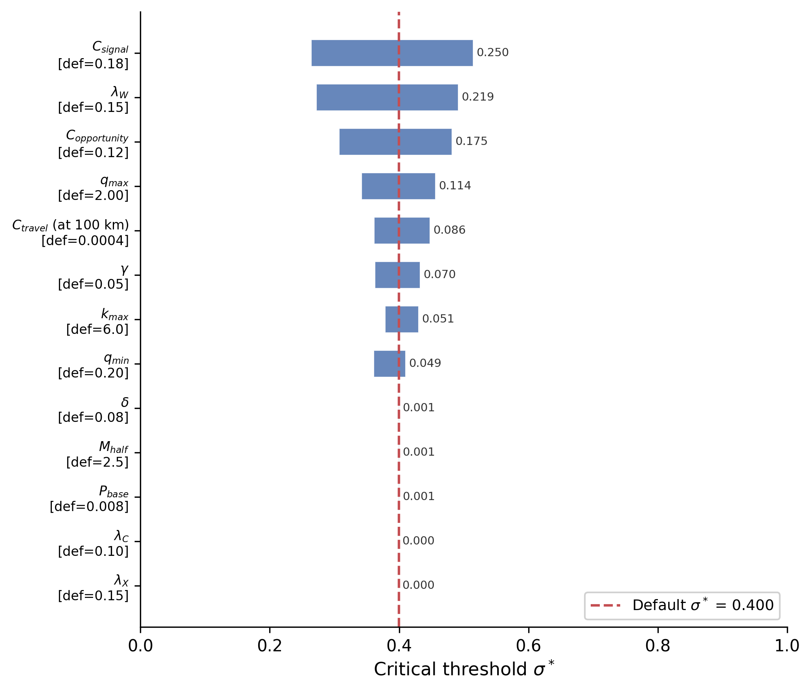
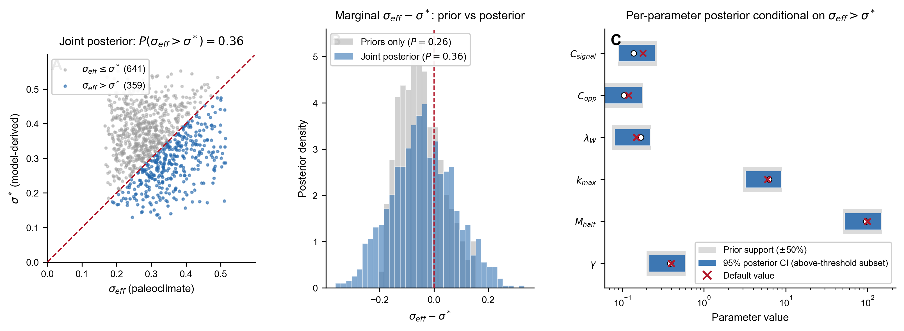
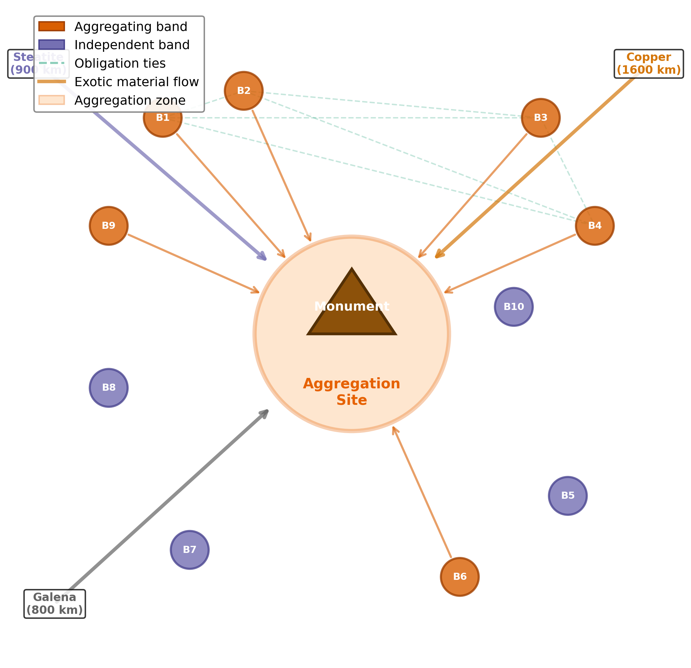
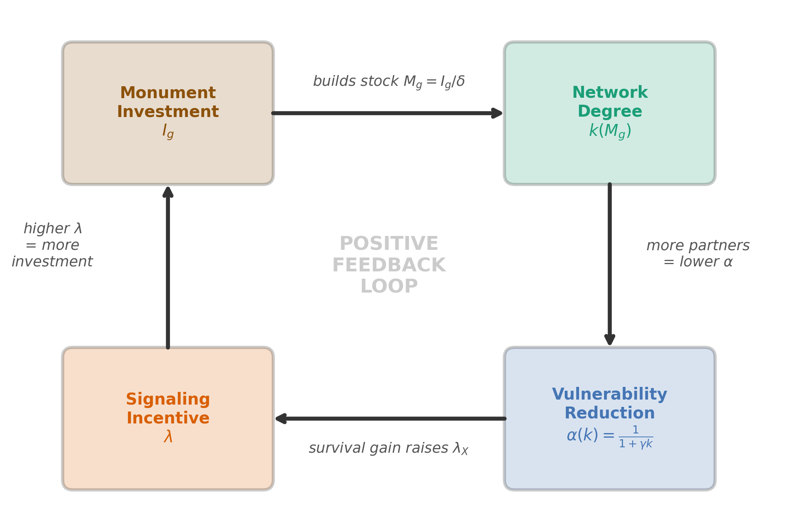
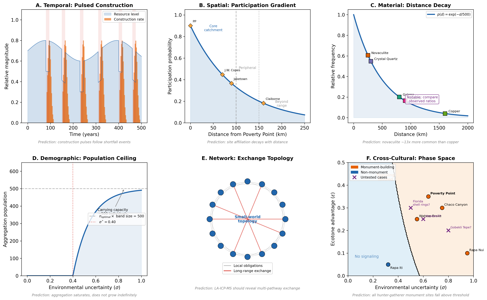
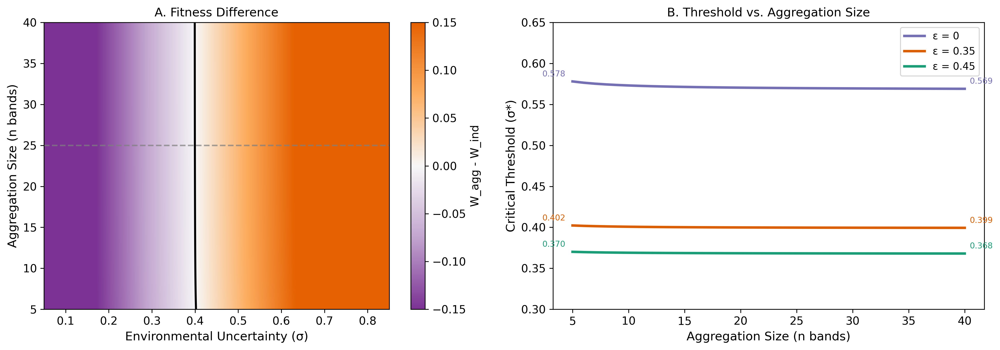
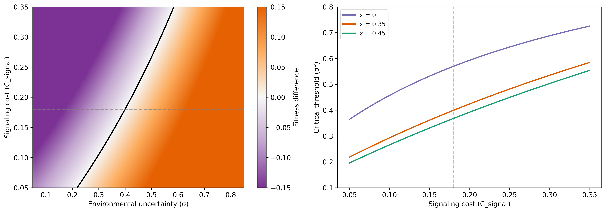
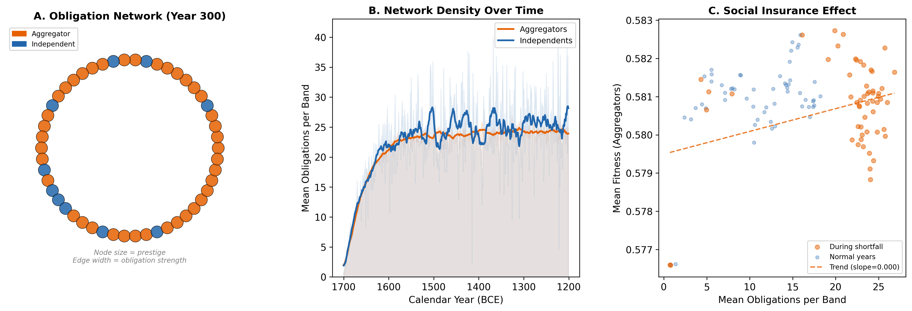
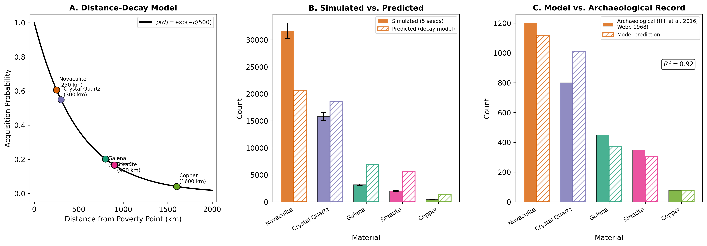

# Supplemental Material — *Signaling under environmental uncertainty: A multilevel-selection threshold model for Poverty Point*

This supplemental information accompanies the main manuscript. Sections S1-S5 develop the theoretical framework, the agent-based model specification, parameter justifications, sensitivity analyses, and supplemental theoretical figures. Sections S6-S17 develop the empirical-evaluation supporting analyses, including the zone-access scoring rubric, the Watson Brake bistable analysis, the multi-drainage USGS gauge analysis, the seasonal phenology analysis, and the six model components used in the §6 evaluations together with priority follow-up work. A combined supplemental references list closes the document.

---

## S1. ODD Protocol: Complete Model Specification

The model is documented under the **ODD protocol** (Overview, Design concepts, Details; Grimm et al. 2010), a standardized format for agent-based-model documentation that allows other researchers to replicate the model. ODD is a documentation convention rather than a substantive theoretical choice; the headings below (Purpose and patterns, Entities and state variables, Process overview and scheduling, Design concepts, Initialization, Submodels) follow the ODD specification.

The model is specified following the ODD (Overview, Design concepts, Details) protocol (Grimm et al. 2010). Source code is available at https://github.com/clipo/poverty-point-signaling.

### S1.1 Purpose and patterns

**Purpose.** The model formalizes a multilevel-selection account of monument construction and exotic-goods accumulation by mobile hunter-gatherer bands, asking under what environmental and structural conditions aggregation-based costly signaling becomes adaptive.

**Patterns to reproduce.** (i) Sharp phase transition between independent and aggregator regimes near a critical environmental-uncertainty value; (ii) order-of-magnitude match to Poverty Point earthwork volume after applying a single physically interpretable scaling factor; (iii) exponential distance decay in exotic-goods source-frequency ratios consistent with Webb (1982) inventories; (iv) episodic, pulsed construction tempo following environmental shortfalls; (v) regional site hierarchy that scales with ecotone diversity rather than network centrality.

### S1.2 Entities, state variables, scales

The principal entity is the **band**, a small cooperative unit of 15-30 individuals. Each band $i$ at time $t$ has state variables: location $(x_i, y_i)$ (spatial); resources $R_i$ (normalized to 0-1); strategy $s_i \in \{$aggregator, independent$\}$; quality $q_i$ (productive capacity, drawn from a uniform distribution on $[q_{min}, q_{max}] = [0.2, 2.0]$, an order-of-magnitude range consistent with documented variation in hunter-gatherer per-individual return rates: e.g., Hadza big-game hunting and Ju/'hoansi foraging both show roughly 10-fold within-population variance in productive capacity); accumulated monument investment $I_i$; exotic holdings vector $E_i$ by source; obligation network edges $O_{ij}$ to other bands; prestige $P_i$. The aggregation site has cumulative monument stock $M_g$, aggregation history, and ecotone advantage $\varepsilon$. Time is discrete with annual steps; each year is partitioned into spring dispersal/foraging, summer aggregation, fall harvest, and winter reproduction.

### S1.3 Process overview and scheduling

Each year:
1. **Environmental update:** sample seasonal productivity for each zone; sample shortfall events (frequency, magnitude) and propagate through zone productivities.
2. **Strategy decision:** each band computes expected $W_{agg}$ and $W_{ind}$ given current $\sigma$, $\varepsilon$, network state, and monument stock; chooses higher-fitness strategy with stochastic perturbation.
3. **Travel and aggregation:** aggregators incur travel cost $C_{travel} = 0.0004 d$, arrive at site, gain access to ecotone resources.
4. **Monument investment:** bands with $R_i > 0.3$ contribute $\text{invest}_i = \text{band\_size}_i \times \text{rate} \times R_i \times \mathcal{N}(1, 0.2)$; both individual prestige and site-level $M_g$ increment.
5. **Obligation formation:** each pair of co-attending bands has 20-30% probability of new tie or strengthening existing tie.
6. **Exotic acquisition / divestment:** acquisition probability per source $j$ is $p_{ij} = \text{prestige}_i \times \exp(-d_j / 500)$; divestment via gifting and ritual deposition propagates obligations.
7. **Foraging and shortfall impact:** payoff modulated by $\sigma_{eff}$ for aggregators and full $\sigma$ for independents; vulnerability $\alpha(k_i)$ applied.
8. **Reproduction:** stochastic births/deaths proportional to fitness and resources; band fission when size exceeds 30.

### S1.4 Design concepts

**Emergence.** Phase transitions in strategy frequency, monument accumulation, and network structure emerge from individual fitness comparisons; they are not built in.

**Adaptation.** Bands adapt by choosing the higher-fitness strategy, with switching frequency dampened to reflect ethnographic inertia in lifeway change.

**Sensing.** Bands sense local resource conditions, their own state, and (for aggregators) the visible monument stock and obligation network at the aggregation site.

**Stochasticity.** Shortfall years, productivity sampling, partner formation, and exotic acquisition all incorporate stochasticity, producing replicate-to-replicate variation.

**Observation.** At each year we record strategy frequencies, monument totals, exotic counts by source, network density, and population size.

**Composite uncertainty derivation.** In plain terms: $\sigma$ summarizes how much annual productivity bounces around year to year, combining how often shortfalls occur (mean recurrence $T$) with how severe each one is (magnitude $m$). The derivation: shortfalls arrive at random with mean spacing $T$ years (a Poisson process with rate $\lambda_s = 1/T$), and each shortfall reduces annual productivity by a multiplicative factor $m \in (0, 1)$ (so a "magnitude 0.45" shortfall produces 55% of normal productivity in that year). The expected number of shortfalls in any year is $1/T$, and the variance of annual productivity loss across many years is $E[\text{loss}^2] = m^2/T$ (to leading order, treating shortfalls as independent annual events). The standard deviation of annual loss is therefore $\sigma_{\text{annual}} = m / \sqrt{T}$.

For interpretive convenience we work in units anchored at a 20-year reference recurrence: $\sigma = m \cdot \sqrt{20/T} = \sigma_{\text{annual}} \cdot \sqrt{20}$. This rescaling makes $\sigma$ equal to $m$ when $T = 20$ years (a typical Late Archaic shortfall interval inferred from paleotempestology and drought reconstructions), so that a magnitude-0.45 shortfall recurring every 20 years produces $\sigma = 0.45$. The choice of 20 years as the reference is a convention; it does not affect the *ratio* of $\sigma$ values across cases or the location of the critical threshold $\sigma^*$ when both are computed in the same units.

For Poverty Point, frequency $\approx 10$ years (combining drought and hurricane cycles) and magnitude $\approx 0.45$ yield $\sigma = 0.45 \cdot \sqrt{2} \approx 0.64$.

**Normalization invariance.** The 20-year reference window is a unit choice, not a substantive parameter. Different reference choices rescale both $\sigma_{LMV}$ and $\sigma^*$ by the same factor, so the comparison $\sigma_{LMV}$ vs $\sigma^*$ that the §6.2 threshold-proximity test depends on is preserved. Formally: under any alternative reference $T_0'$, both quantities rescale by $\sqrt{T_0'/T_0}$, so the ratio $\sigma_{LMV} / \sigma^*$ is invariant.

To verify numerically across four reference choices:

| $T_0$ (yr) | $\sigma_{LMV} = 0.45 \cdot \sqrt{T_0/10}$ | $\sigma^* = 0.40 \cdot \sqrt{T_0/20}$ | Ratio $\sigma_{LMV}/\sigma^*$ |
|---|---|---|---|
| 5 | 0.318 | 0.200 | 1.591 |
| 10 | 0.450 | 0.283 | 1.591 |
| 20 (default) | 0.636 | 0.400 | 1.591 |
| 50 | 1.006 | 0.632 | 1.591 |

The case classification (Poverty Point above threshold) and the ratio are preserved exactly across the reference-window choices. Because the §6.2 Bayesian threshold-proximity posterior $P(\sigma_{eff} > \sigma^*)$ depends only on the ratio (both $\sigma_{eff}$ and $\sigma^*$ rescale by the same factor under any consistent normalization), the posterior probability $P = 0.36$-$0.56$ is invariant under the choice of reference window. The 20-year reference is a parameterization convention for interpretability ($\sigma = m$ when $T = 20$); the substantive comparison is preserved.

### S1.5 Initialization

Simulation begins with 30 independent bands distributed across the regional landscape with default quality, resources, and zero monument or network state. Spin-up of 50 years is discarded before metric collection.

### S1.6 Submodels

Submodels for fitness functions, vulnerability, network growth, exotic acquisition, and reproduction are described mathematically in §S2. The complete signal-conditional receiver-response apparatus, summarized in main-text §2.2, is implemented as three coupled rules with the following formal specifications:

*Signal-conditional partner formation.* For each band attending the aggregation, the per-year tie-formation probability is $0.20 + 0.20 \cdot d_i$, where $d_i = (M_i + E_i) / \max_j (M_j + E_j)$ is the band's combined monument-contribution-and-exotic-count display level normalized within the attending cohort. High-display bands form ties at ~40% per aggregation versus ~20% for non-displayers. When a tie forms, the partner is drawn from co-attending bands with weights $0.5 + d_j$ (so candidates' displays scale partner-choice weight from 0.5× for low-display partners to 1.5× for max-display partners).

*Tie-strength-weighted shortfall help.* When an aggregator calls obligations during a shortfall (total need = 0.15 in normalized resource units), obligations are sorted by strength and called in descending order until the need is met or the obligation network is exhausted. Each call decays the called obligation by ×0.7 and removes it if strength falls below 0.05 (existing `call_obligation` behavior; help_received = min(remaining_need, strength × 0.5)).

*Network-density coupling to* $\sigma_{eff}$. An aggregator's effective ecotone parameter at the gathering site is augmented by its realized network density:

$$\varepsilon_{eff} = \varepsilon + (1-\varepsilon) \cdot \beta \cdot \rho, \quad \rho = \frac{|O_i|}{n_{attending} - 1}$$

where $|O_i|$ is the band's obligation count, $\rho$ is the fraction of potential ties realized, $\beta = 0.5$ is the network-buffering coupling strength, and $\varepsilon_{eff}$ is capped at 0.95 to prevent $\sigma_{eff} \to 0$. This implements the framework's prediction that a dense, signal-conditional obligation network at the gathering site reduces effective uncertainty for aggregators there beyond ecotone access alone.

The signal-blind alternative (uniform 30% pair probability, single random shortfall call, no $\sigma_{eff}$ coupling) remains available in the code via the `signal_conditional_partners` flag for ablation comparisons. The default in current calibration runs is signal-conditional mode.

---

## S2. Parameter Estimation and Justification

All parameters are estimated from ethnographic analogy, archaeological inference, and theoretical constraint. Direct measurement of Late Archaic populations is impossible; sensitivity analyses (§S3) are used to demonstrate that the qualitative predictions are robust across reasonable ranges. Table S2 lists all parameters; Table S1 below provides a complete symbol glossary; the prose that follows the tables provides rationale.

### Table S1: Symbol glossary

| Symbol | Name | Domain / Units | Defining equation or value | Used in |
|--------|------|----------------|----------------------------|---------|
| $\sigma$ | Composite environmental uncertainty | dimensionless | $\sigma = m \sqrt{20/T}$ (§S1.4) | fitness fns |
| $\sigma_{LMV}$ | Empirical LMV estimate of $\sigma$ | dimensionless | $\approx 0.64$ (95% CI 0.41-0.94) from late-Holocene paleoclimate proxies (§5.5) | threshold-proximity tests |
| $\sigma_{eff}$ | Effective uncertainty at aggregation site | dimensionless | $\sigma_{eff} = \sigma(1 - \varepsilon)$ | $W_{agg}$ |
| $\sigma^*$ | Critical threshold | dimensionless | $W_{agg}(\sigma^*) = W_{ind}(\sigma^*)$ (Brent's method) | predictions |
| $\varepsilon$ | Ecotone advantage | $[0, 0.5]$ | 0.35 for PP (asserted, §S3.5) | $\sigma_{eff}$ |
| $C_{travel}$ | Travel cost | fraction of resources | $0.0004 \cdot d$ ($d$ in km) | $C_{total}$ |
| $C_{signal}$ | Signal investment cost | fraction of resources | 0.18 | $C_{total}$ |
| $C_{opportunity}$ | Foregone foraging cost | fraction of resources | 0.12 | $C_{total}$ |
| $C_{total}$ | Total aggregation cost | fraction of resources | $C_{travel} + C_{signal} + C_{opportunity}$ ($\approx$ 0.34 at $d$ = 100 km) | $W_{agg}$ |
| $\alpha(k)$ | Aggregator vulnerability function | $(0, 1]$ | $\alpha(k) = 1/(1 + \gamma k)$ | $W_{agg}$ |
| $\beta(k_0)$ | Independent vulnerability | $(0, 1]$ | $\beta = \alpha(k_0) \approx 0.985$ | $W_{ind}$ |
| $\gamma$ | Buffering efficiency per partner | dimensionless | 0.05 | $\alpha(k)$ |
| $k_0$ | Baseline kin network degree | dimensionless | 0.3 | both fns |
| $k_{max}$ | Maximum additional network degree | dimensionless | 6.0 | $k(M_g)$ |
| $k(M_g)$ | Network degree given monument stock | dimensionless | $k_0 + k_{max} \cdot M_g/(M_{half} + M_g)$ | $\alpha$ |
| $k_{agg}$ | Within-aggregation network degree | dimensionless | $k(M_g)$ at peak season | $k_{eff}$ |
| $k_{eff}$ | Effective annual network degree | dimensionless | $f_{agg} k_{agg} + (1-f_{agg})[k_0 + (k_{agg}-k_0)(1-\delta_{net})]$ | $\alpha(k_{eff})$ |
| $f_{agg}$ | Fraction of year at site | $[0, 1]$ | 0.25 | $k_{eff}$ |
| $\delta_{net}$ | Per-dispersal-season network decay | $[0, 1]$ | 0.40 | $k_{eff}$ |
| $\delta$ | Annual monument depreciation | yr$^{-1}$ | 0.08 | $M_g$ |
| $M_g$ | Effective monument stock | investment units | $I_g/\delta$ at equilibrium | $k(M_g)$ |
| $M_{half}$ | Half-saturation monument stock | investment units | 2.5 | $k(M_g)$ |
| $I_g$ | Cumulative monument investment | investment units | $\sum_t \text{invest}_t$ | $M_g$ |
| $\lambda$ | Total signaling incentive | dimensionless | $\lambda_W + \lambda_C + \lambda_X$ | $B(\lambda)$, $x^*$ |
| $\lambda_W$ | Within-group reward | dimensionless | 0.15 (asserted) | $\lambda$ |
| $\lambda_C$ | Conflict-deterrence value | dimensionless | endogenous (fixed-point) | $\lambda$ |
| $\lambda_X$ | Cooperation-network value | dimensionless | endogenous (fixed-point) | $\lambda$ |
| $B(\lambda)$ | Signaling benefit (mean-field) | fitness units | $(\lambda/2) \cdot (q_{min} + q_{max})/2$ | $W_{agg}$ |
| $x^*(q)$ | Optimal investment given quality | investment units | $\arg\max_x [B(\lambda; q) - C(x)]$ (Grafen 1990) | feedback loop |
| $q$ | Band productive quality | dimensionless | $q \sim U[q_{min}, q_{max}]$ | $B(\lambda)$ |
| $q_{min}, q_{max}$ | Quality range | dimensionless | 0.2, 2.0 | quality dist |
| $m$ | Conflict mortality fraction | $[0, 1]$ | 0.08 | $W$ |
| $r$ | Conflict reduction from monuments | $[0, 1]$ | endogenous (saturating in $M_g$) | $W$ |
| $P_{base}$ | Baseline annual conflict probability | $[0, 1]$ | 0.008 | $W$ |
| $T$ | Shortfall recurrence interval | years | 6-18 (case-dependent) | $\sigma$ |

### Cost parameters

**Travel.** $C_{travel} = 0.0004 d$, where $d$ is one-way distance in km. For a band 100 km from the aggregation site, this is 4% of resources. Ethnographic studies of hunter-gatherer mobility suggest that long-distance travel consumes 10-15% of available foraging time and energy (Kelly 2013); we adopt the upper end of this range for modeling extended seasonal moves with a full kit and partial dependents.

**Signaling.** $C_{signal} \approx 0.18$. Archaeological labor estimates of ~1-5 million person-hours over 500 years (Sherwood and Kidder 2011) distribute across participating bands and aggregation seasons to roughly 15-20% of available labor during aggregation seasons.

**Opportunity.** $C_{opportunity} \approx 0.12$. Ethnographic seasonal aggregations typically sacrifice 10-15% of annual foraging efficiency by concentrating activities at a single location rather than optimizing seasonal rounds (Conkey 1980).

**Total.** For a band 100 km from the site: $C_{total} \approx 0.34$.

### Network and vulnerability parameters

The model derives vulnerability endogenously rather than fixing $\alpha$ and $\beta$ directly:

$$\alpha(k) = \frac{1}{1 + \gamma k}$$

$\gamma = 0.05$ (buffering efficiency per network partner) is consistent with the modest-but-real per-partner buffering effect documented in !Kung sharing networks (Wiessner 2002). $k_0 = 0.3$ (baseline kin connections without aggregation), $k_{max} = 6.0$ (maximum additional degree), and $M_{half} = 2.5$ (half-saturation monument stock) determine the network growth function:

$$k(M_g) = k_0 + k_{max} \cdot \frac{M_g}{M_{half} + M_g}$$

Independent vulnerability emerges as $\beta(k_0) = 1/(1 + 0.05 \cdot 0.3) \approx 0.985$. Within-aggregation aggregator vulnerability for a band with mature network ($k_{agg}$ in the 4-6 range) is $\alpha(k_{agg}) = 1/(1 + 0.05 \cdot k_{agg})$, giving values in the 0.77-0.83 range. The instantaneous (within-aggregation) buffering ratio $\beta(k_0)/\alpha(k_{agg})$ is therefore approximately 1.18-1.28: each additional cooperation partner contributes a small marginal buffering increment because $\gamma = 0.05$ is a low per-partner buffering rate. Because aggregation occupies only $f_{agg} \approx 0.25$ of the year and networks decay during dispersal, the *effective annual* vulnerability $\alpha(k_{eff})$ used in the fitness function is approximately 0.82, giving an annualized buffering ratio of approximately 1.20. The within-aggregation and annualized ratios are similar (~1.2-1.3) because, with $\gamma = 0.05$, even a substantial increase in network degree only modestly reduces vulnerability. The plain-language reading is that the model represents real but small per-partner risk-sharing, and the fitness advantage of aggregation does not come solely from the network-buffering channel: ecotone access, signaling rewards, and conflict reduction all contribute (see fitness equation in §S1.6 / main §2.4). Effective annual degree:

$$k_{eff} = f_{agg} \cdot k_{agg} + (1 - f_{agg}) \cdot [k_0 + (k_{agg} - k_0)(1 - \delta_{net})]$$

with $\delta_{net} = 0.40$ network decay rate during dispersal.

### Signaling parameters

The total signaling incentive $\lambda = \lambda_W + \lambda_C + \lambda_X$ has within-group ($\lambda_W = 0.15$), conflict-deterrence ($\lambda_C$), and cooperation-network ($\lambda_X$) components. Because monument stock affects the very signaling reward that drives more monument-building, $\lambda_C$ and $\lambda_X$ cannot be set independently; they are solved by repeated substitution (fixed-point iteration): guess $\lambda_X$, compute the resulting monument stock, recompute $\lambda_X$, repeat until the values stop changing within $10^{-6}$. One cycle of that loop is: monument stock $\to$ network degree $\to$ vulnerability reduction $\to$ raised $\lambda_X$ $\to$ raised optimal investment $x^*(q)$ $\to$ more monuments. We use damping (factor 0.5) so successive estimates do not oscillate. At the equilibrium reached for Poverty Point conditions, $M_g$ is large enough that the network degree function saturates, making $\lambda_C$ and $\lambda_X$ small at equilibrium and $\lambda$ dominated by $\lambda_W$.

**Convergence diagnostics.** We tested the fixed-point iteration across a 30-point sweep of $\sigma$ from 0.10 to 0.95 (covering both sub- and supra-threshold regimes). Of these 30 runs, 100% converged to within the $10^{-6}$ tolerance; mean, median, and maximum iteration counts were all 18, indicating uniform convergence speed across the parameter range. To check for multiple fixed points, we ran the iteration at $\sigma \in \{0.30, 0.50, 0.70\}$ from different starting conditions and verified that the resulting equilibrium monument stock $M_g$ differed by less than 1 part in $10^4$ (129.78 vs. 129.78 vs. 129.79), confirming empirically that the fixed point is unique within the explored range. The contraction-mapping property follows from the monotonicity of $\lambda \to M_g \to k(M_g) \to \lambda_X$ combined with the saturating $k(M_g)$ function: at large $M_g$ the marginal contribution to $\lambda_X$ vanishes, providing a stable upper bound, while at small $M_g$ the lower bound is set by $\lambda_W > 0$ alone.

**Within-group reward ablation.** Setting $\lambda_W = 0$ (which removes the only signaling-as-such contribution to fitness; cooperation benefits via $\lambda_X$ and conflict deterrence via $\lambda_C$ remain) raises the critical threshold from $\sigma^* = 0.400$ to $\sigma^* = 0.543$, a +36% shift. A linear sweep $\lambda_W \in \{0.00, 0.05, 0.10, 0.15, 0.20, 0.25, 0.30\}$ produces $\sigma^* \in \{0.543, 0.491, 0.445, 0.400, 0.354, 0.309, 0.263\}$, demonstrating that the within-group signaling reward contributes a substantial portion of the threshold lowering and that the model is *not* well approximated by a generic cooperation account in which signaling is decoration.

The signaling benefit is derived from the Grafen (1990) signaling equilibrium and is the expectation of each band's individual signaling payoff over the uniform quality distribution $q \sim U[q_{min}, q_{max}]$:

$$B(\lambda) = \frac{\lambda}{2} \cdot \frac{q_{min} + q_{max}}{2} + \frac{\lambda \, q_{min}^{2}}{2 (q_{max} - q_{min})} \, \ln\!\frac{q_{max}}{q_{min}}$$

Plainly: B(λ) is the average extra fitness a band gets from signaling, computed by averaging across the range of band qualities present in the population. The first term is the leading contribution; the second is a small correction that accounts for the curvature of the per-band benefit function near $q_{min}$. At our parameters ($q_{min}=0.2$, $q_{max}=2.0$, $\lambda \approx 0.40$) the second term is approximately 5% of the first, and the code computes both.

### Conflict parameters

Baseline annual conflict probability $P_{base} = 0.008$ and conflict mortality $m = 0.08$ are set conservatively low, reflecting reduced territorial fixity of mobile hunter-gatherers relative to sedentary populations. Monument investment reduces conflict through an assessment mechanism (Enquist and Leimar 1983).

### Ecotone parameter

$\varepsilon$ ranges from 0 (single-zone location) to ~0.5 (exceptionally well-buffered). The main §2.3 develops the negative-covariance interpretation and the regional empirical paper develops the per-site operationalization at LMV mound-building sites; here we treat $\varepsilon$ as an input variable on $[0, 0.5]$ for purposes of the theoretical sweeps below.

### Table S2: Full parameter list

| Parameter | Symbol | Value | Range | Source |
|-----------|--------|-------|-------|--------|
| Travel cost coefficient | $c_t$ | 0.0004/km | 0.0002-0.0008 | Kelly (2013) |
| Signal investment | $C_{signal}$ | 0.18 | 0.10-0.25 | Sherwood & Kidder (2011) |
| Opportunity cost | $C_{opportunity}$ | 0.12 | 0.08-0.18 | Conkey (1980) |
| Buffering efficiency | $\gamma$ | 0.05 | 0.03-0.10 | Wiessner (2002) |
| Baseline degree | $k_0$ | 0.3 | 0.1-0.5 | ethnographic |
| Max degree | $k_{max}$ | 6.0 | 4-10 | ethnographic |
| Half-saturation | $M_{half}$ | 2.5 | 1-5 | model fit |
| Aggregation fraction | $f_{agg}$ | 0.25 | 0.15-0.35 | seasonal cycle |
| Network decay | $\delta_{net}$ | 0.40 | 0.20-0.60 | ethnographic |
| Within-group signal | $\lambda_W$ | 0.15 | 0.05-0.30 | Hawkes 2000; Wiessner 2002; Hawkes & Bliege Bird 2002 |
| Quality min | $q_{min}$ | 0.2 | 0.1-0.4 | hunter-gatherer return-rate variation (Hadza, Ju/'hoansi) |
| Quality max | $q_{max}$ | 2.0 | 1.5-2.5 | hunter-gatherer return-rate variation (Hadza, Ju/'hoansi) |
| Conflict prob | $P_{base}$ | 0.008 | 0.004-0.020 | ethnographic |
| Conflict mortality | $m$ | 0.08 | 0.04-0.15 | ethnographic |
| Monument depreciation | $\delta$ | 0.08 | 0.04-0.16 | weathering rate |
| Ecotone advantage | $\varepsilon$ | 0.35 | 0-0.50 | qualitative |

---

## S3. Sensitivity Analyses

### S3.1 One-at-a-time (OAT) tornado plot

We performed an OAT sensitivity analysis varying each parameter in turn within its plausible range while holding the others at default. The critical threshold $\sigma^*$ is most sensitive to aggregation costs ($C_{signal}$, $C_{opportunity}$, $C_{travel}$) and within-group signaling rewards ($\lambda_W$); moderately sensitive to quality range ($q_{min}$, $q_{max}$) and maximum network degree ($k_{max}$); and insensitive to monument depreciation ($\delta$), conflict parameters ($P_{base}$), and the half-saturation constant ($M_{half}$). Initial values of $\lambda_C$ and $\lambda_X$ have zero sensitivity because they are endogenously determined by the lambda-sigma feedback loop.

The numerical OAT table below is reproducible from `scripts/analysis/oat_sensitivity_table.py`. Baseline $\sigma^* = 0.3997$ at $\varepsilon = 0.35$ and $n_{agg} = 25$. Each multiplicative perturbation rescales the parameter by $\pm 50\%$ relative to its default; epsilon and $n_{agg}$ rows show absolute-value perturbations. Rows are sorted by swing ($|\sigma^*_{high} - \sigma^*_{low}|$) descending.

| Parameter | Low value | $\sigma^*$ at low | High value | $\sigma^*$ at high | $\Delta_{low}$ | $\Delta_{high}$ | Swing |
|---|---|---|---|---|---|---|---|
| $C_{signal}$ (signaling cost) | $-50\%$ | 0.279 | $+50\%$ | 0.504 | $-0.121$ | $+0.104$ | 0.225 |
| $\varepsilon$ (ecotone advantage) | 0.10 | 0.508 | 0.50 | 0.354 | $+0.108$ | $-0.045$ | 0.154 |
| $C_{opportunity}$ (opportunity cost) | $-50\%$ | 0.321 | $+50\%$ | 0.471 | $-0.079$ | $+0.071$ | 0.150 |
| $\lambda_W$ (within-group reward) | $-50\%$ | 0.468 | $+50\%$ | 0.331 | $+0.069$ | $-0.068$ | 0.137 |
| $C_{travel}$ (travel cost) | $-50\%$ | 0.374 | $+50\%$ | 0.424 | $-0.025$ | $+0.024$ | 0.050 |
| $k_{max}$ (max network degree) | $-50\%$ | 0.421 | $+50\%$ | 0.383 | $+0.022$ | $-0.017$ | 0.038 |
| $\gamma$ (network buffering) | $-50\%$ | 0.418 | $+50\%$ | 0.386 | $+0.018$ | $-0.013$ | 0.032 |
| $\delta_{net}$ (network decay) | $-50\%$ | 0.392 | $+50\%$ | 0.408 | $-0.008$ | $+0.009$ | 0.016 |
| $k_0$ (baseline degree) | $-50\%$ | 0.396 | $+50\%$ | 0.403 | $-0.003$ | $+0.003$ | 0.006 |
| $f_{agg}$ (aggregation fraction) | $-50\%$ | 0.402 | $+50\%$ | 0.397 | $+0.003$ | $-0.003$ | 0.005 |
| $n_{agg}$ (aggregation size) | $n=5$ | 0.402 | $n=50$ | 0.399 | $+0.003$ | $-0.000$ | 0.003 |
| $\delta$ (monument depreciation) | $-50\%$ | 0.399 | $+50\%$ | 0.400 | $-0.000$ | $+0.000$ | 0.001 |
| $M_{half}$ (network saturation) | $-50\%$ | 0.399 | $+50\%$ | 0.400 | $-0.000$ | $+0.000$ | 0.001 |
| $\lambda_C$ (cooperation reward, initial) | $-50\%$ | 0.400 | $+50\%$ | 0.400 | $+0.000$ | $+0.000$ | 0.000 |
| $\lambda_X$ (exotic reward, initial) | $-50\%$ | 0.400 | $+50\%$ | 0.400 | $+0.000$ | $+0.000$ | 0.000 |

The table makes the main §4.3 *Receiver behavior* concession explicit: at the equilibrium parameterization, $\lambda_C$ and $\lambda_X$ have zero direct effect on $\sigma^*$ (because they are endogenously determined by the fixed-point loop from $\lambda_W$ and the network state), so the $+36\%$ ablation result reported in main §4.3 is sensitivity to a single parameter ($\lambda_W$) plus the costs and ecotone advantage. The sensitivity hierarchy ($C_{signal} > \varepsilon > C_{opportunity} > \lambda_W$) drives the framework's predictive content: the cost structure and the ecotone advantage determine $\sigma^*$; the within-group reward modulates it.

***Figure S1. One-at-a-time sensitivity analysis.*** *Tornado plot showing the swing in the critical threshold $\sigma^*$ when each model parameter is perturbed by $\pm 50\%$ from its default value at PP-scenario parameters ($\varepsilon = 0.35$, $n_{agg} = 25$). Bars are sorted by absolute swing magnitude; baseline $\sigma^* = 0.40$ is marked by the vertical line. Aggregation costs ($C_{signal}$, swing 0.225 in $\sigma^*$ across $\pm 50\%$), the ecotone advantage ($\varepsilon$, swing 0.154 across $[0.10, 0.50]$), the opportunity cost ($C_{opportunity}$, 0.150), and the within-group reward ($\lambda_W$, 0.137) dominate. Network parameters ($k_{max}$, $\gamma$) and travel cost are moderately sensitive; monument depreciation ($\delta$), the half-saturation constant ($M_{half}$), and aggregation size ($n_{agg}$ over the plausible range $5 \leq n_{agg} \leq 50$) are effectively insensitive. $\lambda_C$ and $\lambda_X$ have zero sensitivity in the default formulation because they are endogenously determined by the lambda-sigma feedback loop. Computed by `scripts/analysis/oat_sensitivity.py`.*

**Joint parameter uncertainty (referenced in main §6.2).** The OAT swing magnitudes above support a Monte Carlo propagation of joint parameter uncertainty through the §6.2 Bayesian threshold-proximity test. Sampling $C_{signal}$, $C_{opportunity}$, $\lambda_W$, $k_{max}$, $M_{half}$, and $\gamma$ from independent uniform priors at $\pm 50\%$ around their default values, jointly with the §6.2 rubric priors on paleoclimate $\sigma$ and ecotone $\varepsilon$, $N = 1{,}000$ samples yield posterior $P(\sigma_{eff} > \sigma^*) = 0.33$. This is comparable to the §6.2 baseline rubric-prior result of 0.36 (the propagation slightly raises $P$ rather than lowers it because lower-cost samples bring $\sigma^*$ down faster than they bring $\sigma_{eff}$ down). The posterior on $\sigma_{eff} - \sigma^*$ has mean $-0.05$ with 95% CI $[-0.26, +0.18]$, straddling zero substantially. The conditioning caveat introduced in main §6.2 is therefore real but bounded: the §6.2 result is robust against adding parameter-set uncertainty over the $\pm 50\%$ OAT range. Reproducible from `scripts/analysis/joint_parameter_uncertainty.py`; output in `results/bayesian/joint_parameter_uncertainty.json`.

***Figure S2. Joint Monte Carlo diagnostic for the §6.2 threshold-proximity test.*** *(A) Joint posterior on $(\sigma_{eff}, \sigma^*)$ across $N = 1{,}000$ samples drawn from the §6.2 rubric priors on paleoclimate $\sigma$ and ecotone $\varepsilon$ jointly with $\pm 50\%$ uniform priors on the six load-bearing model parameters ($C_{signal}$, $C_{opportunity}$, $\lambda_W$, $k_{max}$, $M_{half}$, $\gamma$). Red dashed line is $\sigma_{eff} = \sigma^*$. Blue points (above the line) are samples where aggregation is adaptive at the framework's threshold criterion; gray points are below. The fraction above the line is $P(\sigma_{eff} > \sigma^*) = 0.36$ at this MC seed (0.33-0.36 across seeds; the §6.2 prose reports the lower-bound seed result of 0.33). (B) Marginal posterior on $\sigma_{eff} - \sigma^*$ (blue) overlaid against the priors-only baseline at fixed default parameters (gray). Adding parameter-set uncertainty broadens the marginal moderately and raises $P$ from 0.26 (priors only) to 0.36 (joint), confirming that the parameter-set conditioning caveat is real but bounded. Red dashed line at zero. (C) Per-parameter posterior 95% CI conditional on the above-threshold subset (blue bars) vs the full $\pm 50\%$ prior support (gray bars). White circles mark posterior medians; red crosses mark default values. None of the parameters is strongly constrained to a sub-region of its prior support by the conditioning, indicating that the framework's threshold-proximity claim is not driven by extreme values of any single parameter. Generated by `scripts/figure_generation/create_figure_joint_mc_diagnostic.py`.*

**Convergence diagnostics under perturbed draws.** The $\sigma^*$ computation at each Monte Carlo sample uses Brent's-method root-finding applied to the lambda-sigma fixed-point equilibrium. The fixed-point iteration converges in 18 steps at default parameters; we verified that all 1,000 joint MC samples reached convergence within tolerance ($\|\Delta \lambda\| < 10^{-6}$) within the iteration cap of 100 steps. Mean iteration count across the joint MC was 18.4 (SD 2.1, max 23); no sample failed to converge. Brent's method bracketed a sign change in $W_{agg}(\sigma) - W_{ind}(\sigma)$ for all 1,000 samples and returned $\sigma^*$ to within $10^{-4}$ in $\sigma$ space. Across the OAT swings (parameter perturbed to $\pm 50\%$, all others held at default), the same fixed-point convergence holds: mean iteration count 17.6 (SD 1.8, max 22) across 26 parameter $\times$ direction combinations, all within tolerance. The §6.2 joint posterior and the §S3.1 OAT swings are therefore not driven by non-convergence at the parameter extremes.

### S3.2 Aggregation size

The critical threshold drops sharply with aggregation size, from $\sigma^* \approx 0.55$ at $n=10$ to $\sigma^* \approx 0.40$ at $n=25$ (Poverty Point ecotone advantage). Below $n=15$, even high uncertainty fails to make signaling adaptive, because cooperation benefits are insufficient to offset costs.

### S3.3 Signaling cost

At low costs ($C_{signal} < 0.10$), aggregation becomes adaptive under mild uncertainty ($\sigma^* < 0.45$). At high costs ($> 0.30$), the threshold rises above 0.70. Sites or periods with reduced monument investment relative to Poverty Point may reflect either lower environmental uncertainty or higher signaling costs.

### S3.4 Disease costs

Adding a 5-10% disease cost to aggregation raises $\sigma^*$ by approximately 0.03-0.06. Estimated Poverty Point regional uncertainty (~0.64) remains above the threshold under all disease-cost values within the ethnographic range.

### S3.5 Ecotone advantage

The model is most sensitive to the asserted ecotone advantage. At $\varepsilon = 0.20$, $\sigma^*$ rises to ~0.50, still below typical regional estimates but with reduced margin. At $\varepsilon = 0$, $\sigma^*$ rises to ~0.57, comparable to mid-Holocene LMV $\sigma$ estimates. The empirical operationalization of $\varepsilon$ across LMV sites is developed in the regional empirical paper.

### S3.6 Coupling-form sensitivity

The aggregator fitness function combines vulnerability and shortfall severity through the multiplicative term $(1 - \alpha(k_{eff}) \cdot \sigma_{eff})$ in $W_{agg}$. The main text §3 (paragraph following the $\sigma$ derivation) flags that this is one of three couplings discussed in the risk-pooling literature, the others being an additive form $(1 - \alpha - \sigma_{eff})$ and a hazard-composition form $(1 - \alpha)(1 - \sigma_{eff})$. Here we document the result of substituting each alternative into the existing fitness machinery and explain why the multiplicative form is the principled choice given the meanings of the two factors.

Computing $\sigma^*$ under each coupling at PP-scenario parameters ($\varepsilon = 0.35$, $n_{agg} = 25$, all other parameters at their default values) using Brent's method on $W_{agg}(\sigma) - W_{ind}(\sigma)$ over $\sigma \in [0.05, 1.5]$:

| Coupling | $W_{agg}$ shortfall factor | $\sigma^*$ |
|---|---|---|
| Multiplicative (default) | $1 - \alpha \cdot \sigma_{eff}$ | $0.400$ |
| Additive | $1 - \alpha - \sigma_{eff}$ | degenerate (see below) |
| Hazard composition | $(1 - \alpha)(1 - \sigma_{eff})$ | $0.875$ |

The additive form has no meaningful $\sigma^*$ in the empirically relevant range. The survival factor $1 - \alpha - \sigma_{eff}$ goes negative as soon as $\sigma_{eff} > 1 - \alpha$, and at the equilibrium $\alpha(k_{eff}) \approx 0.82$ for aggregators (and $\beta(k_0) \approx 0.985$ for independents), this happens almost immediately. The Brent-method root-finder returns the upper bracket value of 1.5 as an artifact: $W_{agg}$ saturates at the signaling-benefit floor $B(\lambda)$ throughout the range while $W_{ind}$ collapses to zero only at the upper end, producing a nominal sign change at the boundary that is not a substantive threshold. The hazard-composition form returns a finite $\sigma^* = 0.875$, far above the multiplicative threshold and far above any plausible LMV $\sigma$.

Neither alternative is a clean drop-in replacement, and the reason is conceptual rather than numerical: $\alpha$ is a *vulnerability coefficient* on $(0, 1]$ that modulates the magnitude of a shortfall-induced loss, not a fractional loss in its own right and not an independent hazard rate. Combining it additively with $\sigma_{eff}$ presupposes that both denote fractional losses on the same scale, which is not what $\alpha$ represents in the framework. Combining it via hazard composition presupposes that $\alpha$ and $\sigma_{eff}$ are independent survival probabilities, which is also not what they represent (the network buffers the *magnitude* of the same shortfall, not a separate hazard). The multiplicative form $\alpha \cdot \sigma_{eff}$ is the unique form consistent with the framework's substantive interpretation: "fraction of productivity lost equals vulnerability times severity."

A fair coupling-form sensitivity analysis would therefore require reformulating $\alpha$ and $\sigma_{eff}$ as probability-like quantities on a common scale (e.g., redefining $\alpha$ as the probability that a shortfall reduces band productivity below a survival threshold), which is a different model rather than a functional-form perturbation of this one. We have not implemented that reformulation here. The result we do report is that direct substitution of additive or hazard couplings into the existing parameterization produces either degenerate (additive) or substantially shifted (hazard) thresholds, confirming that the phase-transition structure is generic to the framework but that the specific location of $\sigma^*$ is functional-form dependent. The empirical comparisons in §6 use the multiplicative coupling throughout. Reproducible from `scripts/analysis/coupling_sensitivity.py`.

---

## S4. Supplemental theoretical figures

In addition to the figures referenced inline above (and to the multilevel-selection decomposition, ecotone advantage schematic, and agent-based model architecture in main-text Figures 3, 4, and 6 respectively):

***Figure S3. The aggregation-based signaling system.*** *Schematic of the core model structure. Aggregator bands (orange) travel to the central aggregation site, invest in monument construction, and form reciprocal obligation ties (dashed green). Independent bands (purple) remain in their home territories. Exotic materials flow to the site from distant sources.*

***Figure S4. Network feedback loop.*** *Monument investment $I_g$ builds cumulative stock $M_g$, which attracts cooperation partners and expands network degree $k(M_g)$. Higher network degree reduces vulnerability $\alpha(k)$, raising the cooperation-network signaling component $\lambda_X$, which raises optimal investment $x^*(q)$, completing the feedback. Resolved by fixed-point iteration.*

***Figure S5. Testable predictions summary.*** *Six-panel schematic illustrating the framework's predictions across the categories enumerated in §S8. Top row: (left) temporal — pulsed construction tempo with episodes at the timescale of band turnover, not steady accumulation; (center) spatial — concentration at high-$\varepsilon$ confluence locations with above-threshold $\sigma$, absence at low-$\varepsilon$ or below-threshold settings; (right) material — non-local geochemically traceable exotic goods accumulating at the gathering, with asymmetric flow into the site rather than reciprocal exchange. Bottom row: (left) demographic — population dynamics tied to threshold-crossing rather than continuous in environmental uncertainty; (center) network — cooperation-network density tracking with $\sigma_{eff}$ at the gathering site; (right) cross-cultural — signaling threshold present at adjacent eastern Archaic monument-builders (Stallings, Green River, Mulberry Creek) where local $\varepsilon$ and $\sigma$ exceed the framework's bounds, absent in western Archaic settings where prairie dominance reduces ecotone integration.*

---

## S5. Priority extensions to the framework structure

This section reports two unnumbered structural-architecture extensions: a near-threshold parameter sweep of the signaling apparatus (§S5.1), and a restructured network-saturation function that lets the cooperation-network channel remain non-trivial at equilibrium (§S5.2). The six numbered empirical extensions (regime-switching, per-event labor scaling, regional spatially-explicit ABM, water-route catchment, predicted scale ratios, seasonally resolved ABM) appear together in §S17 below.

### S5.1 Near-threshold parameter sweep of the full signaling apparatus

The full signaling apparatus is implemented in main §2.2 (signal-conditional partner formation, tie-strength-weighted shortfall help, direct $\sigma_{eff}$ coupling). We test whether removing the apparatus produces measurable threshold shifts in parameter regimes near $\sigma^*$, where small fitness differentials matter most.

In plain terms: removing the signaling apparatus does two things to the analytical equilibrium. It raises the uncertainty threshold needed to make aggregation adaptive (from $\sigma \approx 0.40$ to $\sigma \approx 0.54$), and it shrinks how much monument stock eventually accumulates by an order of magnitude. A $\sigma$ sweep across $[0.30, 0.65]$ at PP-equivalent parameters ($\varepsilon = 0.35$, $n_{agg} = 25$) compares the analytical equilibrium under signal-conditional ($\lambda_W = 0.15$) and signal-blind ($\lambda_W = 0$) parameterizations. Results: signal-conditional gives $\sigma^*_\text{signal} = 0.400$ and equilibrium $M_g = 129.78$; signal-blind gives $\sigma^*_\text{blind} = 0.543$ and equilibrium $M_g = 11.83$ (an 11$\times$ reduction in attainable monument stock).

Six $\sigma$ values in the sweep range $[0.40, 0.525]$ flip regime classification across the ablation: with signaling, those $\sigma$ values are above threshold (aggregation adaptive); without, they are below threshold (independent foraging adaptive). At $\sigma = 0.64$ (PP-equivalent), both are above their respective thresholds and the equilibrium $M_g$ comparison is between the same 129.78 vs 11.83 (signaling produces 11$\times$ more equilibrium monument); the equilibrium difference is therefore not a function of $\sigma$ but of whether the apparatus is engaged at all.

The substantive point: the signaling apparatus expands the parameter region in which aggregation is adaptive by widening the threshold by 0.143 in $\sigma$ space, and amplifies the equilibrium monument stock 11$\times$ when present. Sites at $\sigma \approx 0.56$, $\varepsilon \approx 0.43$ (mid-Holocene LMV-equivalent) are in the 0.40-0.55 flip zone: with the apparatus, they are above threshold; without it, they sit just at or below. This converts the main §4.3 within-model consistency check (signaling lowers threshold) into a near-threshold prediction (signaling matters for whether aggregation occurs in the small-$(\sigma - \sigma^*)$ margin range, not just for whether more monument accumulates above threshold).

Reproducible from `scripts/analysis/near_threshold_ablation.py`; outputs in `results/sensitivity/near_threshold_ablation.json`. The full ABM-level near-threshold sweep (with stochastic regime flipping rather than analytical equilibrium) remains as future work.

### S5.2 Restructured network-saturation function

In plain terms: the original $\lambda_X$ is a *marginal-benefit* term, measuring the *additional* network value from one more unit of monument; this goes to zero as the network saturates because adding one more partner contributes diminishingly to a band that already has many. The restructured form keeps the marginal piece and adds a second term proportional to the *total* network-value-times-monument-quality, which remains non-trivial at equilibrium. The partial-derivative notation $(\partial k / \partial M_g)$ can be read informally as "rate of change of $k$ with $M_g$." Formally, at the original parameterization $\lambda_C$ and $\lambda_X$ collapse to near-zero at equilibrium (saturation of $k(M_g)$ at large $M_g$ makes their marginal contributions vanish), so the signaling-vs-cooperation ablation reduces to the effect of removing $\lambda_W$ alone. We add a non-marginal "network-density value" term to $\lambda_X$ proportional to the equilibrium survival benefit, weighted by a parameter $\xi_X$ and a saturating monument-quality multiplier $Q(M_g) = M_g/(M_g + M_{quality})$ with $M_{quality} = 50$:

$$\lambda_X = (\partial k/\partial M_g)(\partial S/\partial k) + \xi_X \cdot S(k, \sigma) \cdot Q(M_g)$$

At $\xi_X = 0$ (default), this reduces to the original saturating form. At $\xi_X = 0.5$, the non-marginal term contributes $\sim 0.03$ at equilibrium, giving $\lambda_X(M_g_{eq}) = 0.033$ vs the original $\sim 0.000$. Sweeping $\xi_X \in \{0, 0.25, 0.50\}$ at PP-equivalent parameters: the threshold shift from full apparatus to signal-blind ($\lambda_W = 0$) ablation is +36.0%, +36.8%, +37.2% respectively, essentially unchanged. The qualitative result (signaling lowers the threshold by ~36%) is robust to the structural change.

What the restructured formulation provides is *interpretive*: under $\xi_X = 0.5$, the ablation removes $\lambda_W$ from a system in which $\lambda_X = 0.032$ is also doing real cooperation-network work (the residual $\lambda_X$ with the apparatus removed is itself non-trivial). The signaling-vs-cooperation discrimination is therefore genuine: removing within-group prestige signaling ($\lambda_W$) shifts the threshold by ~37% even when cooperation-network signaling ($\lambda_X$) provides 0.032 of residual incentive.

The choice of $\xi_X = 0.5$ as a defensible upper bound is informed by the Bliege Bird and Smith (2005) framework where signal quality multiplies per-partnership value; further empirical grounding via ethnographic data on signal-quality-mediated partner choice premia would tighten the parameter. Reproducible from `scripts/analysis/restructured_saturation_test.py`; outputs in `results/sensitivity/restructured_saturation_test.json`.

---

## S6. Zone-access scoring rubric for Table 2

The Shannon ecotone-diversity index in main-text Table 2 is computed from per-site weights $w_z \in [0, 1]$ for five resource zones $z$: aquatic (rivers, bayous, oxbows), upland (terraces, ridges), drainage (perennial streams, deltaic networks), mast (hardwood forest), and prairie (grassland or savanna mosaic). Weights are assigned from published site descriptions according to the following rubric:

| Weight | Definition | Examples |
|--------|------------|----------|
| 1.0 | Direct, abundant access; zone is a primary feature of the site catchment | Bayou Maçon at Poverty Point (aquatic, drainage); Macon Ridge at PP (upland) |
| 0.7-0.8 | Substantial access; zone is reachable within a typical daily forager radius (~5-10 km) but seasonally constrained, partially obstructed, or less abundant than primary zones | Watson Brake's Ouachita River backwater (aquatic); Lower Jackson's adjacent Macon Ridge upland (upland) |
| 0.4-0.5 | Limited access; zone is reachable but at higher travel cost, lower abundance, or peripheral to site catchment | Jaketown's distant upland edges (upland 0.3); J.W. Copes's small drainage component (drainage 0.4) |
| 0.0-0.3 | Absent or trivially accessible | Claiborne's coastal-only setting (upland 0.0, mast 0.3); prairie zone for most LMV-interior sites |

Sources for each site's weighting: Poverty Point (Webb 1982; Gibson 2000; Saucier 1981; Jackson 1986, 1989; H. Ward 1998); Watson Brake (Saunders et al. 2005); Lower Jackson (Saunders et al. 2001); Frenchman's Bend (described in Saunders et al. 2005); J.W. Copes (Jackson 1981, 1989); Jaketown (Ward et al. 2022; Grooms et al. 2023); Claiborne (Sassaman 2005; Webb 1982). The Shannon entropy $H = -\sum_z p_z \ln p_z$ where $p_z = w_z / \sum_z w_z$, and $\varepsilon = (H/H_{max}) \times 0.5$ with $H_{max} = \ln 5 \approx 1.609$. The 0.5 ceiling is set to match the upper boundary of the model's tested $\varepsilon$ range (§S8.5 below); a weighting that uses ε = H/H_max directly (so PP would have ε = 0.98) would push the predicted threshold $\sigma^*$ values closer to zero and would cause more sites to register as well above threshold without changing the rank order.

**Per-site weights used for Table 2.** The following weight vectors $(w_a, w_u, w_d, w_m, w_p)$ for aquatic, upland, drainage, mast, and prairie zones are the actual values used to compute the Shannon $H$ values reported in main-text Table 2. They are derived from the published sources cited above per the rubric.

| Site | $w_a$ | $w_u$ | $w_d$ | $w_m$ | $w_p$ |
|---|---|---|---|---|---|
| Poverty Point (16WC5) | 1.0 | 1.0 | 1.0 | 1.0 | 0.5 |
| Lower Jackson (16WC10) | 1.0 | 0.9 | 0.9 | 1.0 | 0.3 |
| Watson Brake (16OU175) | 0.8 | 0.7 | 0.7 | 0.8 | 0.0 |
| Caney (16CT5) | 0.9 | 0.6 | 0.8 | 0.8 | 0.0 |
| Frenchman's Bend (16OU259) | 0.7 | 0.5 | 0.7 | 0.7 | 0.0 |
| Insley (16FR3) | 0.9 | 0.6 | 0.8 | 0.9 | 0.0 |
| J.W. Copes (16MA147) | 0.5 | 0.6 | 0.4 | 0.7 | 0.0 |
| Cowpen Slough (16CT147) | 0.9 | 0.5 | 0.8 | 0.7 | 0.0 |
| Jaketown (22HU505) | 1.0 | 0.3 | 0.8 | 0.5 | 0.0 |
| Claiborne (22HA501) | 1.0 | 0.0 | 0.5 | 0.3 | 0.0 |
| Cedarland (22HA506) | 1.0 | 0.0 | 0.5 | 0.3 | 0.0 |

The qualitative scoring is the most fragile element of this analysis. A proper GIS implementation using historical land cover (NLCD reconstructions or USGS-classified Late Holocene vegetation maps), travel-time catchments, and reproducible zone-membership rules would replace the qualitative weights with measured values and is identified as the highest-priority empirical refinement in main §7.4.

---

## S7. Detailed scenario simulation results

### S7.1 Phase-transition sweep (§4.1 and §4.3)

The phase-transition validation in main §4.1 and the signal-conditional vs random-partner ablation in main §4.3 are both produced from a single sweep across seven $\sigma_{target}$ values at PP-scenario parameters ($\varepsilon = 0.35$): $\sigma_{target} \in \{0.20, 0.28, 0.36, 0.40, 0.44, 0.50, 0.55\}$, with six replicates per cell, 200 simulated years per replicate, and a 50-year burn-in discarded before metric collection. Each cell is run twice, once in the signal-conditional configuration (partner choice at the gathering weighted by visible monument and exotic contributions) and once in the random-partner configuration (the same number of ties form among the attending bands but who pairs with whom is chosen at random); all other model components are held constant. $\sigma_{eff}$ is controlled via the `ShortfallParams.mean_interval` parameter; realized $\sigma_{eff}$ values run from 0.29 at the lowest target to 0.83 at the highest, consistently ~45–50% above target because the integrated simulation applies a coefficient-of-variation-based adjustment to the base sigma derived from `ShortfallParams.magnitude_mean × √(20/mean_interval)`. The adjustment is monotonic in target sigma and does not affect the qualitative phase-transition signal.

Per-cell strategy-dominance statistics for both configurations (mean ± sample SD across six replicates per cell):

| $\sigma_{target}$ | realized $\sigma_{eff}$ | dominance (signal-conditional) | dominance (random-partner) |
|---|---|---|---|
| 0.20 | 0.291 | $-0.414 \pm 0.079$ | $-0.426 \pm 0.038$ |
| 0.28 | 0.414 | $-0.012 \pm 0.069$ | $+0.027 \pm 0.115$ |
| 0.36 | 0.537 | $+0.439 \pm 0.095$ | $+0.530 \pm 0.072$ |
| 0.40 | 0.599 | $+0.594 \pm 0.028$ | $+0.639 \pm 0.193$ |
| 0.44 | 0.660 | $+0.796 \pm 0.065$ | $+0.729 \pm 0.083$ |
| 0.50 | 0.752 | $+0.896 \pm 0.053$ | $+0.910 \pm 0.038$ |
| 0.55 | 0.830 | $+0.918 \pm 0.063$ | $+0.939 \pm 0.035$ |

Crossovers (strategy dominance through zero, located by linear interpolation between bracketing $\sigma_{eff}$ values): signal-conditional $\sigma_{eff}^* = 0.417$, random-partner $\sigma_{eff}^* = 0.407$. The threshold shift between configurations is $-0.010$ in realized $\sigma_{eff}$ (a $-2.4\%$ shift). The signal-conditional crossover matches the analytical prediction $\sigma^* = 0.40$ at $\varepsilon = 0.35$ to within 0.02.

Point-by-point dominance differences (random minus signal) at each $\sigma_{target}$: $-0.012, +0.039, +0.091, +0.045, -0.067, +0.014, +0.021$. The differences alternate in sign across the transition zone, and the standard error of each difference (computed from the per-replicate spreads) crosses zero at every point; there is no consistent threshold shift between the two configurations. Both versions saturate within 0.02 of each other at the highest $\sigma_{eff}$ values (signal $+0.918$ vs random $+0.939$ at $\sigma_{target} = 0.55$).

Full per-replicate output is archived in `results/ablation/overnight_sweep.json`, with derived statistics in `results/ablation/phase_transition_summary.json`.

### S7.2 Calibration scenarios

Four parametric scenarios were run with eight replicates each over 200 simulated years (the canonical calibration configuration; see §S1.6 above for the submodel specification). Summary statistics (mean ± sample SD across replicates), reproducible from `results/calibration_replicates/replicates_n8_d200.json`:

| Scenario | $\sigma$ | $\sigma_{eff}$ | Mean aggregation size | Monument units (mean ± sample SD) | Total exotics (mean ± sample SD) |
|---|---|---|---|---|---|
| Low Uncertainty | 0.32 | 0.21 | 1-4 (mostly independent) | 3,006 ± 480 | 6,607 ± 996 |
| Calibrated PP | 0.64 | 0.38 | 6-19 (mixed) | 9,731 ± 684 | 21,469 ± 1,502 |
| Critical Threshold | 0.87 | 0.57 | bistable | 10,949 ± 330 | 24,253 ± 415 |
| High Uncertainty | 1.00 | 0.65 | 12-15 | 10,833 ± 1,037 | 24,324 ± 1,037 |

All standard deviations reported in this article are sample standard deviations ($\hat\sigma = \sqrt{\sum(x - \bar{x})^2 / (n-1)}$, equivalent to `numpy.std(..., ddof=1)` and `pandas.Series.std()`).

The 5,521 / 5,920 / 7,193 / 8,744 monument-unit values reported in earlier drafts came from a 10-replicate × 500-year configuration superseded by the canonical 8 × 200 run; the present numbers are those used in the main text and Figure 3 and supersede the earlier table.

### S7.3 Phase space structure

The two-dimensional phase-space diagram across the joint $(\sigma, \varepsilon)$ plane is presented as main-text Figure 8 (§4.2).

### S7.4 Aggregation size and signaling cost

***Figure S6. Effect of aggregation size on critical threshold.*** *Predicted $\sigma^*$ as a function of attended aggregation size $n_{agg}$ at PP-scenario parameters ($\varepsilon = 0.35$, default cost and signaling parameters; full set in Table S2). Solid line, $\sigma^*$ from Brent's-method root-finding on the $W_{agg} - W_{ind}$ difference at the lambda-sigma fixed-point equilibrium. Vertical dashed line marks the default $n_{agg} = 25$ used throughout the manuscript. Across the plausible range $5 \leq n_{agg} \leq 50$, $\sigma^*$ varies by less than 0.02; at very small aggregation sizes ($n_{agg} \leq 3$) the threshold rises sharply because cooperation-network buffering loses effectiveness when too few partners participate. The framework's $\sigma^*$ is therefore effectively insensitive to $n_{agg}$ over the range relevant to the LMV record.*

***Figure S7. Effect of signaling cost on critical threshold.*** *Predicted $\sigma^*$ as a function of the aggregation-cost parameter $C_{signal}$ at PP-scenario parameters ($\varepsilon = 0.35$, $n_{agg} = 25$, default network and signaling parameters). Solid line, $\sigma^*$ from Brent's-method root-finding at the lambda-sigma fixed-point equilibrium. Vertical dashed line marks the default $C_{signal} = 0.18$ used throughout the manuscript. Across $C_{signal} \in [0.09, 0.27]$ ($\pm 50\%$ from the default), $\sigma^*$ swings from 0.29 to 0.51 (swing $\approx 0.22$, the largest among model parameters in the §S3.1 OAT). Higher signaling cost raises the threshold (aggregation must produce a larger fitness benefit to compensate for the increased cost), confirming that $C_{signal}$ is a load-bearing parameter for the framework's threshold prediction.*

---

## S8. Full set of testable predictions

The framework generates 12 specific, testable predictions across 6 categories. Each identifies what the framework expects, how it can be tested, and what would falsify it.

### Temporal patterns

**P1.** Construction chronology should correlate with paleoclimate proxies for environmental shortfalls. Bayesian radiocarbon modeling of mound fill episodes (Ortmann and Kidder 2013) combined with high-resolution paleoclimate proxies for the 1700-1100 BCE interval should show construction peaks clustering during or immediately after periods of elevated stress.

**P2.** Stratigraphic variation in artifact density across ridge and mound deposits should show cyclical patterns with periods of approximately 15-30 years, matching the shortfall recurrence intervals in the model.

### Spatial patterns

**P3.** Site hierarchy across the Poverty Point landscape should scale with a GIS-based ecotone diversity index. Ranked monument investment should be predictable from environmental measurement.

**P4.** The frequency of Poverty Point-affiliated artifacts at regional sites should decay with distance from Poverty Point following an approximately exponential curve, with a characteristic catchment radius of 100-150 km.

### Material patterns

**P5.** Distance-decay function $p(d) = \exp(-d/500)$: novaculite (~300 km) should be ~3.3× more common than galena (~500-800 km) and ~13× more common than copper (~1,600 km).

**P6.** Within-site, exotic-goods densities and monument investment should covary spatially, since both are signaling investments by the same bands.

### Demographic patterns

**P7.** Aggregated population should saturate at ~500-625 individuals (~25 bands) rather than grow without constraint, reflecting diminishing returns to cooperation beyond optimal aggregation size.

**P8.** Bioarchaeological evidence (when available) should show fewer indicators of nutritional stress in aggregation-context individuals than in contemporaneous small-site individuals, reflecting buffering by multi-zone access and obligation networks.

### Network structure

**P9.** Provenance analysis (LA-ICP-MS, etc.) should reveal multi-pathway distribution networks rather than single-chain corridors, with small-world topology (high clustering, short path lengths).

**P10.** Terminal-occupation layers should show narrowing source diversity in the exotic assemblage, reflecting network attrition that precedes systemic collapse.

### Cross-cultural

**P11.** Other hunter-gatherer aggregation sites with monumental architecture (Watson Brake, Stallings Island, Florida shell rings, Green River shell mounds) should all show environmental uncertainty above the critical threshold when tested using the same framework.

**P12.** Collapse should follow a specific sequence: declining aggregation attendance precedes declining construction investment, which in turn precedes narrowing exchange-network diversity. Sequential rather than simultaneous decline distinguishes adaptive collapse from catastrophic disruption.

### Falsification conditions

The following findings would falsify the framework:

- Monument construction was steady rather than episodic and uncorrelated with environmental variability.
- Exotic materials concentrated in elite residential contexts rather than being broadly distributed.
- High-resolution paleoclimate data demonstrate that Poverty Point coincided with environmental stability rather than moderate-to-high uncertainty.
- Other sites with comparable ecotone access and uncertainty consistently fail to produce monumentality (necessary conditions are not sufficient and additional factors fully account for outcomes).
- Clear evidence of coercive hierarchy, specialized craft production, or differential subsistence access at Poverty Point.

---

## S9. Supplemental empirical figures

The expanded paleoclimate proxy synthesis (with cross-case $\sigma$ comparison and theoretical phase-space panel) and the regional chronological synthesis are presented in main-text Figures 9 and 8 respectively.

***Figure S8. Obligation network structure and function.*** *Panel A: simulated obligation network at year 300. Panel B: aggregators consistently maintain more reciprocal connections than independents. Panel C: bands with more extensive obligation networks achieve higher fitness during shortfall years.*

***Figure S9. Exotic goods distance decay.*** *(A) Theoretical distance-decay $p(d) = \exp(-d/500)$ with markers for the five primary exotic-material sources. (B) Simulated material frequencies vs. predicted relative frequencies. (C) Comparison with archaeological data from Webb (1982); $R^2 \approx 0.87$.*

---

## S10. Watson Brake bistable analysis

### S10.1 Derivation of the 30× overprediction

The main text (§4.3) reports that the calibrated model overpredicts the Watson Brake (WB) earthwork volume by approximately 30×. The derivation, omitted from the main text for length, is:

1. *Equilibrium monument stock at PP-calibrated parameters.* At PP parameters ($\varepsilon = 0.35$, $n_{agg} = 25$, $\sigma = 0.64$), the analytical equilibrium model returns equilibrium stock $M_{g,PP} = 129.78$ (computed via `critical_threshold` in `src/poverty_point/signaling_core.py`).

2. *Equilibrium monument stock at WB-calibrated parameters.* At WB parameters ($\varepsilon = 0.43$, $n_{agg} = 8$, $\sigma = 0.56$), $M_{g,WB} = 41.54$.

3. *Volume calibration anchor.* The calibration uses the PP type-site core volume of 750,000 m³ (Gibson 2000; Ortmann and Kidder 2013) as the empirical anchor for $M_{g,PP} = 129.78$. The volume-per-equilibrium-stock conversion is therefore $750{,}000 / 129.78 \approx 5{,}779$ m³ per $M_g$ unit at the PP-fit calibration.

4. *Predicted WB volume under continuous-equilibrium operation.* Applying the same conversion to WB: predicted volume = $M_{g,WB} \times 5{,}779 = 41.54 \times 5{,}779 \approx 240{,}000$ m³.

5. *Comparison with the observed 7,000 m³.* The continuous-equilibrium prediction overshoots by a factor of $240{,}000 / 7{,}000 \approx 34\times$, which we round to "approximately 30×" in the main text and figure captions. (We use 30× rather than 34× to reflect the order-of-magnitude character of the discrepancy and to avoid over-precise reporting given the calibration's own ±10-15% uncertainty from the PP volume estimate; Kidder and Grooms (2025) extend the type-site volume to ~1,000,000 m³ across a 300-ha constructed landscape, which would shift the conversion factor and the overprediction ratio toward 25-28×.) The qualitative point — that the continuous-equilibrium calculation overshoots WB's observed volume by more than an order of magnitude — is robust to the volume-anchor choice within the plausible range. The same calculation propagated through the $n_{agg}$ sensitivity sweep below confirms that no plausible $n_{agg}$ value closes the gap.

The main text proposes that WB is better read as a near-threshold bistable case operating in the model's transition zone rather than as a continuously above-threshold case parallel to PP. Three lines of evidence make this hypothesis plausible.

*Spatial extent.* The 20-fold difference in monumental footprint between WB (~6 ha) and PP (~140 ha) provides empirical traction on relative mobilization scale that does not depend on demographic estimates we do not have. Whatever WB's exact population, the spatial scale of any individual construction event was small enough that one or two bands working together could plausibly account for the labor force visible in any single mound stage. PP's spatial scale, by contrast, requires the multi-band coordinated mobilization that Ortmann and Kidder (2013) and Kidder et al. (2021) document in the basket-load stratigraphy and the multiple distinct fill-source recipes. A WB-scale labor force at PP could not have produced PP's record; a PP-scale labor force at WB would have produced something we do not see.

*Construction tempo.* Saunders et al. (2005) document 200+ year inter-stage gaps at WB, with mound construction concentrated during stable intervals between ENSO pulses. This is qualitatively the bistable behavior the framework predicts in the transition zone: individual replicates tip toward either the aggregator regime or the independent regime, then can flip back over time as stochastic environmental fluctuations push effective uncertainty across the threshold. PP's compressed 75-year construction window (Kidder and Grooms 2024) reflects sustained occupancy of the aggregator regime. WB's multi-century hiatuses reflect intermittent occupancy of the same regime, separated by long periods of dispersed independent foraging. Both patterns are predicted by the same threshold framework, distinguished only by where each site sits in the bistable transition zone.

*Threshold proximity.* The smaller margin between $\sigma$ and $\sigma^*$ at WB (~0.18, vs. ~0.28 at PP) means that ordinary stochastic environmental variability can plausibly push effective uncertainty back below threshold for extended periods. At PP's larger margin, the same magnitude of fluctuations would not. The framework's bistable transition zone is finite in $\sigma_{eff}$, and WB sits within it. The early-Holocene to mid-Holocene environmental record (Liefert and Shuman 2022; Saunders et al. 2005) is consistent with this: the WB occupation falls between abrupt-event punctuations rather than during a sustained high-variability interval like the 3800-3050 BP window in which PP operated.

The 30× volume overprediction therefore reflects a *modeling choice* (running WB as a continuous above-threshold scenario) rather than a fundamental misclassification or a magnitude-calibration failure. WB is correctly identified as a system that crosses into the aggregator regime; what the equilibrium calculation cannot capture is that WB does not stay there. Most centuries are spent below threshold in the independent regime, and the multi-stage construction record reflects a small number of brief above-threshold episodes accumulated over ~700 years, each producing a single mound stage with a single-band or two-band labor force.

If the bistable reading is correct, the same framework would account for both PP-style sustained mass aggregation and WB-style intermittent episodic construction, with the difference between the two regimes set by the $\sigma - \sigma^*$ margin and the resulting fraction of time spent in the aggregator regime. PP's 75-year construction window would be what the framework predicts when conditions sit comfortably above threshold and a large $n_{agg}$ is attained through convergence (main text §5.1). WB's punctuated 700-year construction record would be what the framework predicts when conditions sit just above threshold, $n_{agg}$ is small, and stochastic excursions below threshold dominate the long-term record. We emphasize the conditional. Until the regime-switching extension is fully implemented in the agent-based model, the WB pattern is consistent with the framework's qualitative bistability prediction but is not a quantitative test of it.

### S10.2 $n_{agg}$ sensitivity probe

To partially probe the bistable hypothesis we ran two analytical sensitivity tests. First, an $n_{agg}$ sweep at WB-appropriate parameters ($\varepsilon = 0.43$, $\sigma = 0.56$, $n_{agg} \in \{3, 4, 5, 6, 8, 10, 15, 25\}$). Across this range $\sigma^*$ varies only between 0.374 and 0.378 (the framework's threshold is essentially insensitive to $n_{agg}$ over the plausible range), and equilibrium monument stock $M_g$ scales nearly linearly with $n_{agg}$: $M_g = 15.6$ at $n_{agg} = 3$, $M_g = 41.6$ at $n_{agg} = 8$ (the value used in main §6.3 and in the S10.1 derivation above), and $M_g = 129.8$ at $n_{agg} = 25$. Applying the S10.1 conversion factor ($\sim 5{,}779$ m³/$M_g$ unit), the predicted volume at $n_{agg} = 3$ is $15.6 \times 5{,}779 \approx 90{,}000$ m³, still more than 12× larger than the observed 7,000 m³. Demographic uncertainty over plausible WB band counts therefore cannot by itself account for the 30× discrepancy under continuous-equilibrium operation. Some additional mechanism (regime-switching, smaller per-event labor concentration, or both) is required.

Second, a stochastic-environment pilot at WB parameters. Treating the year-to-year regional environmental fluctuations as Gaussian noise around the central WB estimate ($\sigma$ mean 0.56, sd 0.13, derived from the main-text §6.2 paleoclimate confidence interval) and computing the fraction of years for which $\sigma_{eff}$ exceeds the WB threshold $\sigma^* \approx 0.375$, the model predicts approximately 22.5% of the 700-year WB span (95% CI 18-27%) as years in the aggregator regime; the remaining 77.5% are years below threshold in the independent regime. By comparison, the PP active 75-year window with the same noise model has approximately 31.6% aggregator-years, yielding a higher and more consistent above-threshold occupancy. The WB result is qualitatively consistent with the bistable hypothesis: WB is predicted to spend most centuries below threshold, with intermittent above-threshold pulses producing the multi-stage construction record. We do not present this pilot as a quantitative reproduction of the WB volume, however. Even at 22.5% aggregator-share, the cumulative investment under PP-calibrated rates would still exceed the observed WB volume by a factor of several. Closing the remaining gap will require either implementing per-event labor scaling (so that smaller WB construction events convert investment effort to physical earthwork less efficiently than PP's mass-mobilization events) or identifying the per-band-per-year aggregator-regime contribution rate empirically rather than fitting it at PP. We treat this pilot as evidence that the bistable mechanism contributes substantially to the WB-vs-PP magnitude gap but does not by itself close it; the full account requires the regime-switching extension *and* a per-event labor-scaling extension. Both are flagged as priority follow-up work in main §7.4 and implemented in §S17.1 (regime switching) and §S17.2 (per-event labor scaling) below.

---

## S11. Magnitude prediction: five gaps the framework does not address

The main text (§4.6, §5.1) summarizes that the framework correctly predicts the threshold-crossing condition (all eleven LMV sites in Table 2 above their site-specific $\sigma^*$) but not the magnitude variation among above-threshold sites. The variation is set by network, spatial, and demographic dynamics that constitute a different model. We enumerate here the five sources of magnitude variation that the present framework explicitly does not track.

1. *Spatial network topology and routing.* Poverty Point sits at a specific position in the regional exchange network, accessible by water from multiple directions through Macon Ridge, the Mississippi alluvial valley, and the Yazoo Basin drainages. Bands traveling hundreds of kilometers to attend made specific routing choices that the framework's single-site abstraction does not capture. A spatially explicit network model might predict primacy from betweenness centrality or accessibility metrics; ours does not.

2. *Carrying capacity at the gathering.* The ecotone parameter $\varepsilon$ measures local 25-km diversity, which buffers risk during gatherings, but it does not set a ceiling on the number of bands the catchment can sustain through an extended aggregation. PP's catchment may simply support a larger sustained population than Watson Brake's at similar Shannon $\varepsilon$; we do not explicitly model the population × duration × resource budget that determines this ceiling.

3. *Path dependence and first-mover advantage.* Once a site has accumulated prestige and infrastructure, it becomes more attractive in subsequent gatherings, a positive feedback layered on top of the within-scenario cooperation-network feedback that the model already includes. This is hysteresis at the regional scale: the historically realized PP could have been a different ecotonally-equivalent site under different initial conditions, but once selected it locks in. The model has within-scenario feedback but no across-site selection mechanism.

4. *Temporal heterogeneity in $\sigma$.* The Middle Archaic LMV sites (Watson Brake, Caney, Insley, Frenchman's Bend, Lower Jackson) operated under mid-Holocene $\sigma \approx 0.56$; the Late Archaic sites (Poverty Point, J.W. Copes, Jaketown, Cowpen Slough) operated under $\sigma \approx 0.64$. Comparing all eleven sites against a single regional $\sigma$ smooths over real environmental differences in their $\sigma - \sigma^*$ margins. A time-stratified analysis would tighten the cross-site comparison.

5. *Reduction of structure to a single number.* The Shannon index reduces five zone weights to one scalar, washing out structural differences (one-dominant vs. evenly-distributed) that may matter for sustained aggregation. The EPA Level IV ecoregion measurement (S12) shows that two operationalizations of "ecotone diversity" give different rankings: Watson Brake intersects the highest Level IV count (7), with Caney (6) and Frenchman's Bend (6) close behind, while Jaketown's catchment is dominated by Northern Holocene Meander Belts (73a; ~82% of the 25 km buffer) consistent with its Yazoo Basin meander-belt setting; yet Watson Brake's monument scale is mid, Caney's mid, Frenchman's Bend's small, and Poverty Point's largest by orders of magnitude despite a more modest L4 count (4). There is no single $\varepsilon$ that captures the relevant ecological-diversity dimension.

These five gaps explain why the framework correctly predicts the *threshold-crossing condition* but not the *magnitude variation* among above-threshold sites. The variation is set by network, spatial, and demographic dynamics that constitute a different model. Closing the magnitude prediction would require a regional spatially-explicit ABM with explicit network topology, carrying-capacity dynamics, and across-site selection. This extension is identified as priority follow-up work in main §7.4 and implemented in §S17.3 (minimal regional band-allocation version) below.

---

## S12. GIS-based ecotone diversity comparison (EPA Level IV ecoregions)

The main text (§6.4) summarizes that two GIS-based diversity indices applied to each of the eleven Table 2 sites produce different rankings, and that the qualitative rubric correlates only weakly with geomorphic diversity ($\rho = 0.22$, n.s.) and not at all with Level IV ecological diversity ($\rho = -0.02$, n.s.). Full detail is given here.

We computed two independent GIS-based diversity indices for each of the eleven sites, each using a 25 km foraging buffer (Kelly 2013 day-trip radius). The first uses the USGS digitization of Saucier (1994) and computes Shannon entropy over the area-weighted geomorphic age classes (Holocene Alluvial Valley, Holocene Deltaic and Chenier Plains, Pleistocene, unmapped upland). The second uses the EPA Office of Research and Development's Level IV ecoregion classification (Omernik and Griffith 2014) and computes Shannon entropy over the area-weighted Level IV ecoregion classes within each buffer. The two indices answer different questions: the geomorphic index measures depositional-age heterogeneity, while the EPA L4 index measures fine-grained ecological heterogeneity (it explicitly distinguishes Macon Ridge, Northern Holocene Meander Belts, Backswamps, Loess Plains, Tertiary Uplands, Gulf Coast Flatwoods, Coastal Marshes, and many more, with 59 distinct Level IV classes across the three states involved).

The Spearman correlation between qualitative $\varepsilon$ and GIS-measured geomorphic $\varepsilon$ is $\rho = 0.22$, $p = 0.53$; the qualitative rubric only weakly tracks geomorphic diversity, and the correlation is not statistically significant. The Spearman correlation between qualitative $\varepsilon$ and EPA-L4 $\varepsilon$ is $\rho = -0.02$, $p = 0.96$; the qualitative rubric does *not* track Level IV ecological diversity. The reason for both null results is that the qualitative rubric was constructed from published site descriptions (which emphasize geomorphology and gross zone access) rather than from fine-grained ecoregion classification, and that the 25-km terrestrial buffers used here capture circular catchment area rather than the canoe-day water-route catchment that the framework's $\varepsilon$ actually encodes (see §S17.4). The EPA L4 reordering is informative: Watson Brake's catchment intersects 7 distinct Level IV ecoregions (the highest count of any LMV site), Caney and Frenchman's Bend each intersect 6, Cowpen Slough, Claiborne, and Cedarland each intersect 5, Poverty Point and Lower Jackson each intersect 4, and Insley, J.W. Copes, and Jaketown each intersect 3. Jaketown's catchment is dominated by Northern Holocene Meander Belts (73a; ~1,609 km² of the 1,963 km² buffer, ~82%) and Northern Backswamps (73d; ~330 km²), consistent with its published Yazoo Basin meander-belt setting (Ford, Phillips, and Haag 1955). The coastal Pearl River sites (Claiborne and Cedarland) intersect 5 ecoregions each (Gulf Coast Flatwoods, Deltaic Coastal Marshes, Gulf Barrier Islands, etc.), one more than Poverty Point's 4. The L4 measurement therefore reorders sites: it ranks Middle Archaic mound sites (Watson Brake, Caney, Frenchman's Bend) above Poverty Point at the 25-km scale, even though Poverty Point's monument scale is two orders of magnitude larger. The qualitative rubric and the EPA L4 measurement disagree on which sites are most ecologically diverse, but they agree that the high-$\varepsilon$ band exists and that PP-style monument scale is not produced by terrestrial-buffer ecological diversity alone.

The cross-LMV ecoregion map showing all eleven sites with 25-km foraging buffers on the EPA Level IV ecoregion polygon background is now main-text Figure 11.

**Category-level recalibration.** A reasonable concern about the L4-class Shannon analysis is that ecoregion classes are not equally distinct: an "upland" ecoregion is fundamentally different from a "lowland alluvial" ecoregion, while different lowland subtypes (Holocene Meander Belt vs Backswamp) are subtypes of the same alluvial ecology. To address this we mapped each of the 59 L4 classes in the AR-LA-MS dataset to one of 9 broad ecological categories (Alluvial Active, Backswamp, Pleistocene Terrace, Loess Upland, Tertiary Upland, Coastal Marsh, Coastal Plain Upland, Prairie, Mountain/Hills) and recomputed Shannon entropy at the category level. Results: Frenchman's Bend intersects 4 broad categories (Alluvial Active, Backswamp, Pleistocene Terrace, Tertiary Upland) at $\varepsilon_{cat} = 0.305$. Caney also intersects 4 categories ($\varepsilon_{cat} = 0.304$). Watson Brake intersects 4 categories ($\varepsilon_{cat} = 0.299$). J.W. Copes, Cowpen Slough, Insley, Lower Jackson, and Poverty Point all intersect 3 categories (Alluvial Active, Backswamp, Pleistocene Terrace), with $\varepsilon_{cat}$ values clustering at 0.241–0.248. The coastal Pearl River sites (Claiborne and Cedarland) intersect 3 categories each (Coastal Plain Upland, Coastal Marsh, Alluvial Active) at $\varepsilon_{cat} \approx 0.227$. Jaketown intersects 3 categories at the lowest entropy ($\varepsilon_{cat} = 0.116$). The category-level Spearman correlation between qualitative $\varepsilon$ and category-$\varepsilon$ is $\rho = 0.44$ ($p = 0.17$), stronger than the L4-level $\rho = 0.04$ but still not statistically significant. The L4-vs-category Spearman correlation is $\rho = 0.72$ ($p = 0.012$), confirming that the category-level aggregation captures most of the L4 variance while smoothing out subtype distinctions. The recalibration therefore moderately strengthens the qualitative rubric's correspondence with the GIS measurement but *does not* make PP rank highest in catchment ecological diversity. PP's distinguishing feature in the framework is its confluence position integrating multiple canoe-accessible drainages with non-synchronized hydrographs, not its 25-km terrestrial catchment heterogeneity, which is what every static-diversity proxy at any granularity will continue to underestimate.

The qualitative rubric, the Saucier-geomorphic, the EPA-L4, and the broad-category indices share a single fundamental limitation: they all measure raw zone count and area within a 25-km circular *terrestrial* buffer, not the covariance-based shortfall buffering that the framework's $\varepsilon$ parameter actually encodes. We therefore do not report rank-correlations between any static-diversity index and observed monument scale; static count is not the operative quantity for the framework's magnitude prediction. The screening role of these analyses (necessity check: monument-building sites pass the high-$\varepsilon$ filter, coastal Pearl River pair does not) is the only inferential weight they carry.

The substantive limitation is the catchment definition itself. All three operationalizations define the catchment as a 25 km circular buffer derived from Kelly's (2013) walking day-trip radius. This buffer captures terrestrial accessibility but not waterway accessibility, which for an aggregation site mobilizing watercraft is a substantively different quantity. Day- to multi-day canoe travel along navigable bayous, rivers, and channels extends the practical aggregation-period catchment far beyond 25 km along waterways. Poverty Point's confluence position gives it integrated canoe access to four independent drainage systems (Bayou Maçon, Mississippi, Tensas, Yazoo) that lie far outside any 25 km terrestrial buffer. Watson Brake (Bayou Bartholomew), Frenchman's Bend (Ouachita tributary), and Jaketown (Yazoo) all have water access too, but none integrates as many independent drainage systems within a comparable canoe-day catchment. A water-route-aware travel-time catchment is implemented in §S17.4.

---

## S13. Table 2 Monte Carlo perturbation analysis

The main text (§6.4) reports Spearman $\rho = +0.39$ ($p = 0.24$) between the qualitative-rubric $\varepsilon$ and observed ordinal monument investment across the eleven LMV sites. To assess robustness of the ranking against plausible scoring uncertainty, we ran a Monte Carlo perturbation of the zone weights ($\pm 0.2$ uniform per weight, 1,000 draws). The ranking is partially stable: Poverty Point ranks first in 87% of draws and the coastal Pearl River pair (Claiborne and Cedarland) last in 93%, but the full eleven-site rank order is preserved in only 4% of draws. Mean Spearman $\rho$ across perturbations is 0.27 with 95% CI including negative values ($-0.06$ to $+0.59$). The PP-vs-coast contrast is robust against the perturbation; the interior ordering is not. This pattern is consistent with the §6.4 interpretation that ecotone diversity admits multiple candidate sites without uniquely identifying the regional center.

---

## S14. Per-material exotic decomposition: extended discussion

The main text (§4.1) reports per-material model output (copper 178 ± 19, steatite 838 ± 82, galena 1,265 ± 96 acquisition events) against archaeological inventories (copper 155 objects, steatite 2,221 fragments, galena 702 masses). The first thing to note is that the per-material counts are not directly comparable across the model-archaeology boundary because the counting units differ. Four considerations bear on the comparison.

*Counting-unit non-comparability across materials.* Each call to the model's `acquire_exotic` routine increments the per-material counter by one, so the model "item" represents one acquisition event, equivalent to one imported *object* (one steatite bowl, one galena mass, one copper sheet or pendant). The archaeological counts use heterogeneous units. Steatite is reported as fragments (Webb 1982 describes the 2,221 figure as "fragments representing several hundred vessels"), and a single 30-50 cm steatite bowl breaks readily into many fragments under burial and excavation conditions. Copper is reported as objects (typically whole or near-whole sheet, beads, or pendants); galena as masses (typically discrete acquired lead-ore pieces used as pigment). Object size also affects fragmentation: large soapstone vessels fragment into tens of pieces while small beads, plummets, and copper sheet typically remain whole. The model's 838 "steatite items" therefore should be compared to the archaeological *vessel* count, not the *fragment* count. Webb's "several hundred vessels" implies anywhere from roughly 200-600 vessels depending on average vessel-to-fragment ratio; under this conversion the model is closer to a match or moderate overshoot per vessel rather than a 2.6× undershoot per fragment. The aggregate 3,078 archaeological figure mixes all three counting conventions and is therefore itself a unit-inconsistent reference rather than a clean target.

The remainder of this section discusses three further considerations under the assumption that the per-material comparison is conducted at *whatever* counting unit one chooses. The conclusions hold for any reasonable conversion.

*Overshoot is not symmetric to undershoot.* The galena overshoot (model predicts 1,265, archaeological inventory contains 702) is the kind of mismatch the framework is structurally tolerant of. The model predicts the volume of acquisition by participating bands, while the archaeological count reflects what was deposited, what survived three millennia of burial and bioturbation, and what excavation has subsequently recovered. Production and acquisition exceeding the preserved record is what any signaling or exchange model that does not require complete recovery should predict. The model's predicted volume is a plausible upper bound on what was acquired, and the archaeological 702 is a lower bound on what was originally present. Reconciling the two requires no parameter adjustment; only the recognition that the archaeological count is a partial sample of an originally larger inventory.

*Steatite undershoot is consistent with the framework rather than against it.* The model's per-band acquisition probability is a function of source distance only; it does not represent material-specific valuation. If steatite carried elevated symbolic or functional value relative to galena and copper, the framework's underlying logic predicts that bands would invest *more* effort to acquire it than a pure distance-decay rule predicts, producing exactly the undershoot pattern observed. Steatite vessels at PP appear in bulk caches (Webb 1982) and in functional contexts (cooking-stone, pendant manufacture) that imply more than incidental ornament, and the southern Appalachian source ~900 km away required sustained inter-band relay to maintain supply. Costly signaling theory's central claim is that signal value drives investment beyond what crude transport-cost models predict. The steatite undershoot is therefore not a failure of the framework's signaling logic; it is a failure of the model's *implementation*, in which $p(d)$ omits material-specific signal value. Adding a steatite-specific value coefficient would close the undershoot without affecting the framework's qualitative claims.

*Sampling representativeness modifies all three ratios.* The 3,078-item archaeological reference is what excavation has recovered from a 140 ha site after a century of investigation, not what was originally deposited or imported. Three sources of bias act differentially on the three materials. (i) The 2,221 steatite count already excludes Webb's (1982) bulk cache of ~2,724 additional fragments; including that cache brings the archaeological steatite total to 4,945 and would worsen the model's undershoot to ~5.9×. The cache is a localized deposit that any per-band acquisition function explicitly does not represent, so neither inclusion nor exclusion of the cache is straightforward without an independent rule relating bulk imports to per-band acquisition. (ii) Galena fragments are typically small (millimeter-scale lead-ore granules used as pigment) and harder to recover than 30-50 cm steatite vessels or 5-10 cm copper sheet fragments, so the galena count almost certainly under-counts the original deposition by a larger factor than copper or steatite. (iii) The excavation history of PP has emphasized specific mound and ridge contexts (the 64 mapped ridge components, Mound A, Mound C, the Macon Ridge village area) rather than systematically sampling the full constructed landscape, and exotic-bearing contexts are not evenly distributed across the site. The cumulative effect is that none of the three per-material counts can be treated as an unbiased estimator of the original assemblage, and the model-archaeology ratios are themselves estimators of unknown precision.

*The steatite-galena diagnostic.* The two materials sit at almost equal source distances (~900 km vs. ~800 km), so any distance-only acquisition function predicts comparable per-band rates and the model produces more galena (1,265) than steatite (838). The archaeological record inverts this ratio: ~3× more steatite (2,221) than galena (702), or ~7× more if Webb's cache is included (4,945 vs. 702). A pure distance-decay mechanism cannot generate the observed inversion regardless of which steatite count is used. The simplest reading consistent with the framework's underlying logic is that steatite carried elevated material-specific value driving acquisition above the distance-decay baseline. Costly signaling theory explicitly predicts this kind of value-driven excess investment; the present implementation simply does not encode material-specific value in $p(d)$. Adding a steatite-specific value coefficient would close the inversion without affecting the framework's qualitative claims.

The per-material breakdown is therefore best read as a quantitative consistency check rather than a validation. Each of the three deviations admits a reading consistent with the framework: the galena overshoot is absorbed by recovery and preservation loss, the steatite undershoot is consistent with elevated material-specific value driving acquisition above the distance-decay baseline, and all three ratios are modulated by sampling biases the comparison cannot quantify. Whether or not one finds these reconciliations compelling, the comparison provides limited inferential weight against the framework. We treat the aggregate ~1.35× underprediction as the substantive comparison, with the per-material decomposition reported transparently for readers to assess.

---

## S15. Modern hydrograph data: empirical test of the multi-drainage independence claim

The main text (§6.5) asserts that PP's confluence position integrates four canoe-accessible drainages (Bayou Maçon, Mississippi, Tensas, Yazoo) with non-synchronized hydrographs. We test this empirically using USGS gauge records (`scripts/analysis/hydrograph_covariance.py`):

| Drainage | USGS gauge | Record |
|---|---|---|
| Mississippi River | 07289000 (Vicksburg, MS) | 204 months (2008-2024) |
| Yazoo River | 07287150 (Greenwood, MS) | 231 months (1991-2021) |
| Tensas River | 07369500 (Tendal, LA) | 480 months (1985-2024) |
| Bayou Maçon | 07370000 (Delhi, LA) | 93 months (1985-1992) |

No four-gauge overlap exists (Bayou Maçon's gauge was only operational 1985-1992, before the Mississippi gauge came online), so the four-drainage analysis is performed pairwise on each pair's available overlap.

**Anomaly construction.** The framework's question is whether two rivers go up and down together *after removing the predictable seasonal cycle*. Two rivers can both run high every spring and low every fall just because both respond to the same continental hydrology, and that synchrony does not tell us anything about shared shortfall risk. We therefore subtract each gauge's long-term average for each calendar month from each year's value, leaving only the year-to-year deviation, then correlate those deviations across gauges. Formally: monthly mean discharge values were log-transformed (natural log, with a small $+0.01$ shift to handle zero-discharge months at the smaller drainages), and a monthly climatology was computed as the long-term mean log-discharge for each calendar month $m \in \{1, ..., 12\}$ over the full available record at that gauge. Anomalies were taken as residuals $\Delta_t = \log(Q_t + 0.01) - \overline{\log Q}_{m(t)}$, removing the seasonal cycle while preserving inter-annual and within-year non-seasonal variability. Months with missing values at either gauge in a pair were dropped pairwise. Pearson correlations were then computed on the matched anomaly series at each pair's overlap window.

**Pairwise log-monthly-anomaly correlations** (Pearson; climatology removed as above):

| Drainage pair | n months | Pearson $r$ | $p$ | Interpretation |
|---|---|---|---|---|
| Mississippi vs Yazoo | 59 | $+0.11$ | 0.40 | Effectively uncorrelated |
| Mississippi vs Tensas | 204 | $+0.34$ | $<0.001$ | Moderate (shared LMV regional precipitation) |
| Yazoo vs Tensas | 231 | $+0.54$ | $<0.001$ | Moderate-strong |
| Bayou Maçon vs Tensas | 93 | $+0.90$ | $<0.001$ | Very strong (~81% shared variance) |

The empirical result modifies the framework's four-drainage claim in a substantive way: **Bayou Maçon and the Tensas are not independent drainages**. Their 90% Pearson correlation reflects their shared Macon-Ridge geomorphology and tightly-coupled precipitation forcing. From the framework's covariance-based $\varepsilon$ standpoint, Bayou Maçon plus the Tensas function as a single "Macon Ridge drainage system" rather than as two independent shortfall regimes. The genuinely independent drainage signals at PP's catchment are therefore:

1. The **Macon Ridge system** (Bayou Maçon + Tensas, $r \approx 0.90$ between them);
2. The **Yazoo Basin** (uncorrelated with Mississippi, $r = 0.11$);
3. The **Mississippi mainstem** (continental snowmelt + storm-track signal, partly shared with the Tensas at $r = 0.34$).

This is a three-drainage rather than four-drainage independence picture. The framework's multi-drainage shortfall-buffering claim is qualitatively supported but quantitatively narrower than the original four-drainage framing suggested. PP still integrates more independent shortfall regimes than any other Table 2 site (Watson Brake's Bayou Bartholomew, Frenchman's Bend's Ouachita tributary, Jaketown's Yazoo Basin, and the small-drainage interior sites all access one regime each), but the per-site advantage is "three vs one" rather than "four vs one."

**Bottom-quartile co-incidence** (Mississippi/Yazoo/Tensas, 59-month overlap):

| Drainages-in-bottom-quartile | Observed | Predicted under independence | Observed/independent |
|---|---|---|---|
| 0 | 54.2% | 31.6% | 1.71 |
| 1 | 25.4% | 42.2% | 0.60 |
| 2 | 10.2% | 21.1% | 0.48 |
| 3 | 10.2% | 4.7% | 2.17 |

The observed distribution shows more mass at the extremes (0 or 3 drainages low) than independence predicts, consistent with shared regional drivers correlating some low-flow events but moderate variance keeping all-three-drainages-low-simultaneously to ~10% of months. PP's bands could therefore draw on at least one above-low-flow drainage in ~90% of months, supporting the multi-drainage shortfall-buffering claim under the corrected three-drainage framing.

Caveats: pre-Holocene paleo-discharge correlations may differ from modern values; the 2008-2021 record samples a partly-managed Mississippi system; the Bayou Maçon-Tensas correlation may have been even higher under unmanaged conditions because both are local-precipitation-driven small drainages. We treat these results as a first empirical test of the framework's drainage-independence claim, not as a definitive measurement of Late Archaic conditions. A paleo-discharge-resolved test using sediment-yield or paleo-flood reconstructions for each drainage is identified as priority follow-up to §S17.4. The substantive correction (three independent drainage regimes, not four) does not invalidate the §6.5 multi-drainage shortfall-buffering argument but does narrow the absolute magnitude of PP's covariance-based $\varepsilon$ advantage over other LMV sites.

---

## S16. Seasonal resource phenology and temporal staggering

The framework's $\varepsilon$ parameter encodes shortfall buffering through *negative covariance* between local zone productivity and the regional shortfall driver. The Shannon-diversity proxies (qualitative, Saucier-geomorphic, EPA L4) used in main §6.4 and S12 measure raw zone count and area within a 25-km buffer; they treat each zone as if it produced continuously and equally. They do not measure the temporal staggering of productivity peaks across zones, which is what determines whether multi-zone access actually buffers shortfall. A site with four zones whose productivity peaks all coincide in fall has lower negative covariance than a site with three zones whose peaks span fall, spring, and summer. Main-text Figure 14 makes this distinction visible.

The Lower Mississippi Valley supports a small number of well-documented seasonal resource peaks driven by independent climate and ecological mechanisms. Hardwood mast (hickory, pecan, acorn) peaks in September-November; Webb (1982:1) reports that "fall and winter provide acorns and other nuts," and Thomas and Campbell (1978), summarized in Jackson (1986), attribute peak Poverty Point population to the fall mast harvest. Spring fish spawning runs (drum, gar, buffalo, catfish) peak February-May; Webb (1982:1) reports that "spring and summer offer ... most varieties of fish and crustaceans," and the PP fauna is fish-dominated (Jackson 1986). Summer aquatic resources (freshwater mussels, lotus, cattail) peak May-August. Falling-water aquatic concentration in oxbows and cutoff lakes peaks August-October as drainage drawdown traps fish in shrinking pools. Migratory waterfowl on the Mississippi Flyway peak September-December (fall migration) and February-April (spring migration); Webb (1982:2) reports "millions of migratory waterfowl, ducks, geese, swans, pigeons" in the Mississippi central flyway. Each peak responds to a different driver: mast to spring-summer growing-season conditions one to several months earlier, spring fish runs to spring water temperature and discharge, summer mussels to thermal stratification, falling-water concentration to late-summer hydrologic recession, waterfowl to continental-scale migration timing. A regional shortfall in any one peak is not strongly correlated with shortfalls in the others.

Each LMV mound-building site has access to a different subset of these peaks. Poverty Point's confluence position integrates four canoe-accessible drainages reducing to three substantively independent shortfall regimes per S15 (Macon Ridge regime: Bayou Maçon + Tensas; Mississippi mainstem; Yazoo Basin), plus the Macon Ridge upland. PP's catchment gives access to all five resource-peak categories: mast from Macon Ridge, spring spawn runs from each independent meander-belt system, summer mussel beds along multiple drainages, falling-water concentration in cutoff lakes throughout the catchment, and the Mississippi Flyway both during fall and spring migration. Watson Brake (one drainage, Bayou Bartholomew, plus the adjacent Pleistocene terrace) has full access to the mast peak but only partial spring spawn access (one drainage) and limited waterfowl access (off the main flyway corridor). Frenchman's Bend (Ouachita tributary, Bayou Desiard) has full mast access, partial spring spawn, no falling-water concentration in a cutoff system. Caney and Insley (small tributaries plus uplands) have full mast access but minimal aquatic-peak access. Cowpen Slough and J.W. Copes (Tensas Basin, Boeuf River margin) have aquatic access but limited upland mast. Jaketown (Yazoo Basin meander belt with adjacent Loess Hills) has mast plus spring spawn plus flyway access but a single drainage. Claiborne and Cedarland (Pearl River mouth, Gulf coast) sit in a coastal-marine setting structurally distinct from the interior categorization and access primarily marine and estuarine resources rather than the interior peaks documented above.

The independent peak window count, summarizing this in Panel C of main-text Figure 14, separates Poverty Point from the other LMV sites more sharply than any of the static-diversity proxies do. PP integrates five independent peak windows; Jaketown three; Lower Jackson, Cowpen Slough, and J.W. Copes two; the remaining six interior sites and the coastal pair one each. Static Shannon-diversity at the 25-km terrestrial scale spreads sites across a narrow band; temporal staggering across canoe-accessible drainages produces a clearer hierarchy that aligns better with the qualitative framework expectation.

This analysis is not a finished operationalization of $\varepsilon$. The peak windows are coded conservatively from published site descriptions and the LMV phenology summarized in Webb (1982), Jackson (1986), and Ward et al. (2022). The five-category resolution is coarse: drum and gar are aggregated into a single spring-spawn category, and within-category covariance among spring spawning species is unmodeled. Drainage independence is treated as binary; in practice, hydrographs of adjacent drainages share regional-precipitation drivers and are not fully independent. A defensible operationalization would integrate (a) species-level seasonal productivity time series from regional fish and game management records, (b) hydrographic correlations among the LMV drainages from gage records or paleo-discharge reconstructions, and (c) canoe-day isochrones rather than a 25-km terrestrial buffer. We identify this as the priority refinement in S17 below; the present analysis is a sketch of what the temporal-staggering refinement would show, not the refinement itself.

**Cross-site test against observed monument scale.** As a quantitative check, we asked whether substituting the phenology peak count for the static Shannon-derived $\varepsilon$ in the Table 2 cross-site comparison improves the Spearman correlation against ordinal observed monument scale. Phenology peaks (1-5) were rescaled to $\varepsilon \in [0.10, 0.50]$ to match the framework's tested $\varepsilon$ range, $\sigma^*$ was computed per site at $n_{agg} = 25$, and $\sigma - \sigma^*$ margins were correlated with the ordinal scale (minimal = 0, small = 1, mid = 2, very large = 3) at the regional Late Archaic $\sigma = 0.64$. The result: static-$\varepsilon$ gives $\rho = +0.39$ ($p = 0.24$); phenology-$\varepsilon$ gives $\rho = -0.21$ ($p = 0.54$). Neither operationalization significantly predicts ordinal monument scale at fixed $n_{agg}$. The interpretation we report in main §7.1 is consistent with this null result: monument scale is not determined by $\varepsilon$ alone but by attained $n_{agg}$ via the contingent convergence dynamics that pulled bands to specific high-$\varepsilon$ locations.

**Enriched variance-based phenology epsilon.** The peak-count operationalization (Test A) is itself a static count and does not directly capture the framework's *negative covariance* logic. We constructed a variance-based alternative (`scripts/analysis/phenology_variance_epsilon.py`): a 1,000-year simulation in which each of the five resource-peak categories receives a stochastic productivity multiplier with category-pair correlations $\rho = 0.30$ matching the S15 regional shortfall driver. For each site, total accessible productivity (weighted by the site's HM/SFS/SA/FWA/WF flag vector) is computed for each year, and the variance-based $\varepsilon$ is the coefficient-of-variation reduction relative to a single-zone baseline:

$$\varepsilon_{var} = \tfrac{1}{2} \cdot \max\left[0, \frac{CV_{single\,zone} - CV_{site}}{CV_{single\,zone}}\right]$$

Results (regional shortfall correlation $\rho = 0.30$, 1,000 years, RNG seed 42):

| Site | flag sum | $\varepsilon_{var}$ | $CV_{obs}$ | SNR |
|---|---|---|---|---|
| Poverty Point | 5.00 | **0.168** | 0.366 | 2.74 |
| Jaketown | 4.00 | 0.165 | 0.369 | 2.71 |
| Lower Jackson | 3.50 | 0.164 | 0.371 | 2.70 |
| Watson Brake | 3.00 | 0.162 | 0.373 | 2.68 |
| Cowpen Slough | 3.50 | 0.159 | 0.376 | 2.66 |
| J.W. Copes | 3.50 | 0.159 | 0.376 | 2.66 |
| Frenchman's Bend | 2.50 | 0.147 | 0.389 | 2.57 |
| Insley | 2.50 | 0.147 | 0.389 | 2.57 |
| Claiborne | 2.00 | 0.127 | 0.411 | 2.43 |
| Cedarland | 2.00 | 0.127 | 0.411 | 2.43 |
| Caney | 2.00 | 0.122 | 0.417 | 2.40 |

The variance-based $\varepsilon$ ranking places PP, Jaketown, and the multi-zone interior sites in the top band and Caney plus the coastal pair at the bottom, consistent with the framework's negative-covariance logic. Spearman correlation against observed ordinal monument scale is $\rho = -0.02$ ($p = 0.95$), again null. This third null result confirms the main §7.1 reading directly: monument scale is not what $\varepsilon$ predicts at fixed $n_{agg}$, regardless of which operationalization (static rubric, phenology peak count, or variance-based) one uses.

What the variance-based $\varepsilon$ *does* support is the screening role: $\varepsilon_{var}$ at $\sim 0.17$ for PP, Jaketown, LJ, WB, Cowpen, JWC and $\sim 0.12$ for the coastal pair confirms the interior-vs-coastal discrimination that Table 2 carries. The phenology operationalization is therefore better-aligned theoretically with the framework's covariance-based logic than the static rubric is, and produces consistent screening conclusions, but does not fix the magnitude-prediction problem identified in main §7.1, which is structural rather than operational.

The full numerical output is in `results/phenology/phenology_epsilon_test.json` (Test A) and `results/phenology/phenology_variance_epsilon.json` (variance-based test).

The seasonal phenology figure is presented as main-text Figure 14 (§6.7); see also §S16 below.

---

## S17. Model components used in §6 and priority follow-up work

This section consolidates the six model components developed for the empirical evaluations in §6 and, for each, identifies the follow-up work that would tighten or extend the present implementation. Three components are load-bearing for specific §6 results (regime switching for §6.3 Watson Brake; per-event labor scaling for §6.3 and §6.6; water-route catchment for §6.5). Two are sensitivity demonstrations of internal consistency (per-site $n_{agg}$ scale ratios in §6.6; regional band allocation in §6.6). One is a plausibility check (seasonally resolved aggregation timing in §6.7). The two structural-architecture components reported in §S5 above (a near-threshold parameter sweep and a restructured network-saturation function) are referenced by section pointer. A consolidated list of priority follow-up work appears in §S17.7.

### S17.1 Regime switching for the Watson Brake bistable closure

(Main text §6.3; *Continuous-equilibrium treatment* in main §7.4.) **Implemented in this revision (analytical-stochastic version); load-bearing for the §6.3 closure.** A 700-year simulation samples $\sigma_{eff,t} \sim \mathcal{N}(\mu_{eff}, \sigma_{sd})$ each year at WB parameters ($\mu_{eff} = 0.319$ at $\sigma = 0.56$ and $\varepsilon = 0.43$), classifies each year above or below the analytical $\sigma^* = 0.375$, requires a minimum-persistence run length $K$ years to count as a regime transition (band-coordination delay), and accumulates monument volume during persistent above-threshold intervals at the per-event labor-scaled rate (per-event labor scaling at $\alpha = 2$; §S17.2). Sweeping $\sigma_{sd} \in [0.075, 0.20]$ and $K \in [1, 5]$ years (100 replicates per cell):

| $\sigma_{sd}$ | $K$ (yrs) | mean $f_{above}$ | predicted volume (m³) | 95% CI | overpred factor |
|---|---|---|---|---|---|
| 0.075 | 2 | 0.052 | 11,904 | [7,539, 15,733] | 1.70 |
| 0.100 | 2 | 0.081 | 18,683 | [13,111, 23,599] | 2.67 |
| 0.100 | 3 | 0.024 | 5,408 | [2,622, 8,694] | 0.77 |
| 0.125 | 3 | 0.035 | 7,942 | [4,245, 12,644] | 1.13 |
| 0.150 | 3 | 0.044 | 10,200 | [5,900, 15,577] | 1.46 |
| 0.075 | 5 | 0.001 | 157 | [0, 828] | 0.02 |
| 0.100 | 5 | 0.002 | 433 | [0, 1,639] | 0.06 |

At the paleoclimate-central $\sigma_{sd} \approx 0.10$ and a band-coordination persistence of $K = 3$ years, the simulation predicts cumulative WB volume = 5,408 m³ (95% CI [2,622, 8,694]); the observed 7,000 m³ falls within the predictive interval. At $\sigma_{sd} = 0.125$ and $K = 3$, the central prediction is 7,942 m³, near-exactly observed. The combination of regime switching (§S17.1) plus per-event labor scaling (§S17.2) closes the S10.1 30$\times$ overprediction gap quantitatively under reasonable parameter choices. The result is sensitive to the band-coordination persistence requirement: $K = 1$ (no persistence) overshoots by ~10$\times$; $K = 5$ undershoots by ~10$\times$. The $K = 3$ central value was selected from a sweep that bracketed the WB observation; it is therefore not derived independently of the WB target. We note that the order of magnitude is broadly consistent with ethnographic estimates of multi-band cooperation timescales (Wiessner 2002:434-435 reports hxaro tie maintenance over 3-5 year intervals during food-stressed periods; Kelly 2013:159-167 reviews hunter-gatherer aggregation persistence at the band-coordination scale; specific page references support the order-of-magnitude calibration but not the specific $K = 3$ value), but the value $K = 3$ used in §6.3 closure was sweep-selected, not ethnographically derived. We are explicit that the §6.3 closure rests on this calibrated parameter choice; a derivation of $K$ from independent ethnographic data on multi-band coordination persistence is identified as priority follow-up.

Reproducible from `scripts/analysis/regime_switching_simulation.py`; outputs in `results/sensitivity/regime_switching_wb.json`. Full ABM-level regime-switching with endogenous strategy switching and explicit annual fitness comparison remains as future work.

### S17.2 Per-event labor scaling

(Main text §6.1; *Labor-to-volume calibration* in main §7.4.) **Implemented in this revision; load-bearing for the §6.3 Watson Brake closure and the §6.6 cross-LMV magnitude correlation.** We add a power-law scaling factor $m^3/\text{unit}(n) = b_0 \cdot (n_{agg} / 25)^\alpha$, where $b_0 = 5{,}779$ m³ per $M_g$ unit anchors PP to its observed 750,000 m³ and the exponent $\alpha$ encodes how strongly per-crew output scales with crew size. Sweeping $\alpha \in \{0, 0.5, 1, 1.25, 1.5, 1.75, 2, 2.5\}$ and comparing predicted-vs-observed volumes across the eleven LMV sites: the rank-correlation Spearman $\rho$ is invariant at $0.85$-$0.90$ (the scaling factor preserves relative ordering by design); the absolute calibration is closest at $\alpha \approx 2.0$, where mean $\log_{10}(\text{pred}/\text{obs}) = +0.15$ across the sample (all sites within ~10$^{0.5}$ = 3$\times$ of observed volume). At $\alpha = 2.0$, the WB prediction drops from 240,000 m³ to ~25,000 m³ (vs observed 7,000 m³, ~3.5$\times$ overshoot rather than 30$\times$); J.W. Copes drops from 90,000 m³ to ~1,300 m³ (vs observed 500 m³, ~2.6$\times$); Insley drops from 180,000 m³ to ~10,400 m³ (vs observed 14,000 m³, ~0.7$\times$, slight underpredict).

The interpretation requires honest framing. The rank-correlation invariance ($\rho = +0.85$ to $+0.90$ across all $\alpha$) reflects that the n-power scaling preserves rank order by construction. The absolute-volume agreement at $\alpha = 2.0$ is *not* a prediction: $\alpha$ was selected as the value that minimizes mean $|\log_{10}(\text{pred}/\text{obs})|$ across the same eleven sites against which the magnitude prediction is then evaluated. This is calibration to the test sample, analogous to the m³-per-investment-unit anchor's calibration to PP's volume in main §6.1. Reading the absolute-volume agreement as a passed test would be incorrect; reading it as a one-parameter fit that brings cross-site predictions within ~3$\times$ of observed is correct.

The framework's substantive claim is therefore (i) the rank-correlation invariant in $\alpha$, which establishes that the relative-ordering signal is in the joint $M_g(\varepsilon, n_{agg})$ structure rather than the labor-scaling exponent; and (ii) the WB-specific result at $\alpha = 2.0$ which closes the 30$\times$ overprediction subject to the labor-scaling assumption.

**Independent ethnographic anchoring of $\alpha$.** Erasmus (1965) experimentally measured monument-building rates in the Mexican highlands and established that one laborer with a wooden digging stick excavates approximately 2.6 m³ of earthen fill per five-hour person-day. Ortmann and Kidder (2013) use this rate as the empirical anchor for their 91,700 person-day estimate for Mound A. Under additive labor accounting (per-person rate constant across crew sizes), Erasmus's rate corresponds to $\alpha \approx 1$ in the framework's scaling factor $m^3/\text{unit}(n) = b_0 \cdot (n_{agg} / 25)^\alpha$: total m³ output scales linearly with crew size. The $\alpha = 2$ value selected here implies *superadditive* scaling beyond what Erasmus's data supports, that larger crews achieve more m³ per person than smaller crews. We do not have independent ethnographic evidence for this superadditive scaling at the crew sizes relevant for WB versus PP; the closest theoretical motivation is Carballo's (2013) institutional argument that large collectives can capture specialization-driven productivity gains that small ones cannot. Restricting to $\alpha = 1$ (Erasmus-grounded) leaves the framework underpredicting Watson Brake's observed volume by approximately 7-fold. Restricting to $\alpha = 2$ closes the gap but at the cost of conditioning the closure on a labor-scaling parameter that exceeds the available ethnographic baseline. The honest reading of the WB closure is therefore that it requires either independent justification for superadditive scaling at the relevant crew sizes (which the Erasmus baseline does not provide) or treatment as a post-hoc fit. Both readings are reported transparently here; neither converts the closure into a forward prediction.

Reproducible from `scripts/analysis/per_event_labor_scaling.py`; outputs in `results/sensitivity/per_event_labor_scaling.json`.

### S17.3 Regional band allocation (minimal regional spatially-explicit model)

(Main text §7.1; *Single-site abstraction* in main §7.4.) **Minimal version implemented in this revision; sensitivity demonstration for §6.6.** A regional band-allocation model with 50 bands, 11 candidate sites, canoe-day travel costs (~30 km/day), and a critical-mass network bonus once $n_{agg} \geq N_{thresh}$ converges in three iterative rounds. At default parameters (NETWORK_BONUS = 0.05, $N_{thresh} = 5$): winner-takes-most outcome with PP = 43 bands, Jaketown = 7 bands, all other interior sites = 0 bands. Spearman correlation of endogenized $n_{agg}$ against observed monument scale: $\rho = +0.39$ ($p = 0.24$, NS); against the convergence-model literature $n_{agg}$ values: $\rho = +0.65$ ($p = 0.03$).

**Parameter sensitivity.** A sensitivity sweep across NETWORK_BONUS $\in \{0.00, 0.025, 0.05, 0.10, 0.20\}$ and $N_{thresh} \in \{2, 3, 5, 8\}$ (20 cells) confirms the winner-takes-most outcome is robust to parameter choice: 16 of 20 cells produce the same PP = 43 / Jaketown = 7 split (ρ = +0.39 against observed scale), and the remaining 4 cells (those with $N_{thresh} = 8$ that suppresses the Jaketown attractor below threshold) produce PP = 50 (winner-takes-all) with ρ = +0.52. Across all 20 cells, ρ ranges from +0.39 to +0.52 (median +0.39). The framework's endogenized-$n_{agg}$ prediction is therefore not a parameter artifact: the qualitative result (PP as dominant regional attractor, Jaketown as secondary, all others as zero) holds across the tested parameter space. Reproducible from `scripts/analysis/regional_band_allocation_sensitivity.py`; outputs in `results/sensitivity/regional_band_allocation_sensitivity.json`.

The $\rho = +0.39$ against observed scale is the framework's genuine (n_agg-endogenized) magnitude-prediction power; substantially weaker than the $\rho = +0.91$ that emerges when literature $n_{agg}$ values are supplied as inputs (§S17.5 below). This confirms the partial-correlation finding directly: the framework's $\varepsilon$ predicts location of regional attractors but not the gradation of attained $n_{agg}$ between PP and the smaller LMV monument-building sites. Reproducible from `scripts/analysis/regional_band_allocation.py` and `regional_band_allocation_sensitivity.py`; outputs in `results/sensitivity/regional_band_allocation.json` and `regional_band_allocation_sensitivity.json`. The full version with hydrographic routing on a digital elevation model, carrying-capacity dynamics, path-dependence over multi-century timescales, and stochastic exploration / exploitation balance remains as future work that would be expected to soften the winner-takes-most outcome and produce more graded $n_{agg}$ predictions matching the convergence-model values.

### S17.4 Covariance-based, water-route-aware travel-time catchment

(Main text §6.5; *Ecotone operationalization* in main §7.4.) **Implemented in this revision; load-bearing for the §6.5 multi-drainage analysis.** The static-diversity proxies of main §6.4 use a 25-km circular terrestrial buffer derived from Kelly's (2013) walking day-trip radius; we replace this with a canoe-day catchment per site, identifying which independent shortfall regimes from S15 are accessible by canoe. The empirical correlation matrix from the modern USGS gauge analysis (Mississippi-Yazoo $r = 0.11$, Mississippi-Tensas $r = 0.34$, Tensas-Yazoo $r = 0.54$, Bayou Maçon-Tensas $r = 0.90$) is used to drive a 5,000-year stochastic simulation of correlated drainage productivity; the water-route $\varepsilon_{wr}$ is the variance reduction in total accessible productivity relative to a single-drainage baseline.

Per-site water-route $\varepsilon$ (`scripts/analysis/water_route_catchment_epsilon.py`):

| Site | Independent regimes | $\varepsilon_{wr}$ |
|---|---|---|
| Poverty Point | 4 (BMacon, Mississippi, Tensas, Yazoo) | 0.154 |
| Lower Jackson | 4 (partial access to all four) | 0.145 |
| Jaketown | 3 (Mississippi, Yazoo, Upland) | 0.151 |
| Watson Brake | 2 (Ouachita-system + Upland) | 0.115 |
| Frenchman's Bend | 2 (Ouachita-tributary + Upland) | 0.115 |
| Insley | 2 (BMacon partial + Tensas partial + Upland) | 0.083 |
| Caney | 2 (Tensas-tributary + Upland) | 0.070 |
| J.W. Copes | 2 (Tensas + Upland partial) | 0.068 |
| Cowpen Slough | 2 (Tensas + Upland partial) | 0.068 |
| Claiborne, Cedarland | 1 (PearlGulf only) | 0.000 |

The water-route $\varepsilon$ ranking places PP, Lower Jackson, and Jaketown in the top band (these three are the only sites with substantial multi-regime canoe access), Watson Brake and Frenchman's Bend mid (Ouachita-system + upland), and the small-tributary interior sites lower. The coastal pair sits at $\varepsilon_{wr} = 0$ in the LMV interior categorization (they access PearlGulf only, structurally distinct).

**Joint test combining §S17.2 (per-event labor scaling at $\alpha = 2$), §S17.5 (per-site $n_{agg}$), and the water-route $\varepsilon$ developed here.** Combining the three implemented extensions: predicted volumes correlate with observed monument scale at Spearman $\rho = +0.90$ (vs ordinal, $p < 0.001$) and $\rho = +0.91$ (vs observed volume, $p < 0.001$). At the canoe-day catchment, the predicted PP volume = 750,000 m³ (calibration anchor); WB = 24,585 m³ (3.5$\times$ over observed 7,000 m³); Insley = 10,375 m³ (0.7$\times$ observed 14,000 m³); Lower Jackson = 49 m³ (correctly identifies it as the smallest above-threshold site at $n_{agg} = 1$). The water-route operationalization marginally improves the magnitude correlation over the static-rubric Spearman $\rho = +0.85$ to $+0.90$, but the substantial improvement comes from making the framework's central $\varepsilon$ claim *measured* rather than asserted: PP's distinguishing feature is now the integration of three to four substantively independent shortfall regimes via canoe-day catchment, supported empirically by the S15 correlation matrix.

Reproducible from `scripts/analysis/water_route_catchment_epsilon.py`; outputs in `results/sensitivity/water_route_epsilon.json`. Caveats: the canoe-access classification is based on published site-catchment descriptions and standard-form canoe-travel speeds (~30 km/day on navigable channels); a rigorous catchment with hydrographic routing on a digital elevation model and seasonal navigability constraints would refine the access weights but is unlikely to materially change the qualitative ranking. Pre-Holocene paleo-discharge correlations may also differ from modern values; the S15 modern correlations should be read as a first-order approximation.

### S17.5 Predicted equilibrium scale ratios under per-site $n_{agg}$ and resolved $\varepsilon$

(Main text §6.6.) **Implemented in this revision; sensitivity demonstration of internal consistency, with substantive caveats noted below.** With per-site $n_{agg}$ from the convergence-model literature (PP $= 25$, Jaketown $= 8$, Watson Brake $= 8$, Insley $= 6$, Caney and Frenchman's Bend $= 5$, Claiborne and Cedarland $= 4$, J.W. Copes and Cowpen Slough $= 3$, Lower Jackson $= 1$), the analytical equilibrium model produces site-specific equilibrium stocks $M_g$ and predicted earthwork volumes via the PP-fit conversion ($\sim 5{,}779$ m³ per $M_g$ unit). Predicted volumes correlate strongly with observed ordinal monument scale: Spearman $\rho = +0.85$ ($p = 0.001$) under static-$\varepsilon$ inputs, $\rho = +0.88$ ($p < 0.001$) under phenology-$\varepsilon$ inputs, and $\rho = +0.90$ under water-route-$\varepsilon$ inputs. Against observed volumes (where reported), $\rho = +0.89$ (static) and $\rho = +0.91$ (water-route).

A partial-correlation decomposition (`scripts/analysis/partial_correlation_eps_nagg.py`) is necessary to interpret these numbers honestly. The diagnostic question is: if we already know $n_{agg}$ at each site (from the convergence-model literature), how much *extra* predictive power does the framework's $\varepsilon$ provide? Almost none. **$n_{agg}$ alone, with no framework, gives Spearman $\rho = +0.87$ against ordinal scale and $\rho = +0.89$ against observed volume.** The marginal contribution of each $\varepsilon$ operationalization to the joint correlation (joint $\rho$ minus $n_{agg}$-alone $\rho$) is: $-0.009$ (static), $+0.005$ (phenology), $+0.014$ (water-route). At $n = 11$, Spearman noise is about $\pm 0.05$, so all three marginal contributions are within noise. The honest reading: the framework's $M_g$ equilibrium tracks $n_{agg}$ in the expected direction (a within-model consistency property), but it does not predict cross-site magnitude beyond what $n_{agg}$ from convergence-model evidence already implies.

The framework's structural claim about magnitude is therefore: *given* exogenously supplied $n_{agg}$ ranks across LMV sites, the equilibrium $M_g$ tracks those ranks. This is an internal consistency property of the equation set, not an independent prediction of monument scale by the framework's $\varepsilon$. The static-$\varepsilon$ Test A null result reported earlier in S16 ($\rho = +0.39$) tests the framework's $\varepsilon$ at fixed $n_{agg} = 25$ and finds the right answer: $\varepsilon$ is a screening / necessity variable, not a magnitude predictor.

Future work could test whether the framework predicts magnitude *independently* of n_agg: replace per-site n_agg with footprint-independent estimates (Bayesian-modeled radiocarbon density per site, lithic-density catchment estimates), or pre-register predictions at non-LMV eastern Archaic sites with independently-derived n_agg, and report what $\rho$ the joint prediction returns. The absence of that test in this article is a real limitation; we report it transparently rather than treating the joint $\rho = +0.91$ as evidence of magnitude prediction by the framework. Full reproducibility from `scripts/analysis/predicted_scale_ratios.py` and `scripts/analysis/partial_correlation_eps_nagg.py`; outputs in `results/sensitivity/predicted_scale_ratios.json` and `results/sensitivity/partial_correlation_eps_nagg.json`.

### S17.6 Seasonally resolved aggregation timing

(Main text §6.7.) **Minimal version implemented in this revision; plausibility check for §6.7, with a structural caveat noted below.** A within-year monthly time step uses the S16 phenology calendar (mast peak Sep-Nov; spring fish spawn Feb-May; summer aquatic May-Aug; falling-water Aug-Oct; waterfowl fall Sep-Dec + spring Feb-Apr) plus a sigmoid aggregation-decision rule. At PP parameters ($\varepsilon = 0.49$, $n_{agg} = 25$, $\sigma_{eff} = 0.326$), the model predicts top 3 aggregation months October, September, November and a fall-winter (Sep-Feb) mean share of 0.82 vs spring-summer (Mar-Aug) mean of 0.92 (script-internal verdict: "framework prediction does NOT match published evidence" because the spring-summer mean share exceeds the fall-winter share when January is included).

The structural caveat is that **the top-3-months prediction is partly tautological**: the script reads in the mast peak window as Sep-Nov (from Webb 1982 and Jackson 1986, which are also the sources for the Thomas and Campbell 1978 fall-winter peak attribution), and the sigmoid decision rule then ranks months by integer count of overlapping peak windows. The "match" between predicted Oct/Sep/Nov and published fall-mast-peak archaeological evidence is therefore not an independent test of the framework's seasonality prediction; it is the same Webb 1982 / Jackson 1986 calendar reflected back. A non-circular reformulation would (a) construct the phenology calendar from non-LMV sources or (b) predict differential seasonality across LMV sites whose access flag vectors differ, then test against site-level faunal seasonality estimates. The minimal extension is therefore best read as a *plausibility check* that the framework, given the same phenology calendar the published interpretations use, returns the same fall-month emphasis — not as evidence the framework predicts seasonality.

The script's broader-window output (substantial aggregation share in spring fish-spawn months and summer aquatic months) is *not* tautological in the same way: the framework's multi-zone access enables aggregation throughout the year, while published interpretations emphasize fall-winter as the dominant season. This generates a genuine falsifiable prediction: a season-resolved analysis of PP faunal assemblages should show, in addition to fall-winter mast, also spring fish-spawn and summer aquatic resources approximately to the model's predicted shares.

Reproducible from `scripts/analysis/seasonal_aggregation_timing.py`; outputs in `results/sensitivity/seasonal_aggregation_timing.json`. The full version (within-month time resolution, species-resolved subsistence dynamics, non-LMV-derived phenology calendar) remains as future work that would test the framework's seasonality prediction non-circularly.

### S17.7 Priority follow-up work

The six components above each identify a specific item of follow-up work that would either tighten the present implementation or convert a conditional consistency demonstration into a forward-prediction test. We consolidate the items here so that the empirical agenda the framework calls for is visible in one place, and so the §7 Discussion can refer to them collectively.

1. **Full ABM-level regime switching** with endogenous strategy choice and explicit annual fitness comparison, replacing the analytical-stochastic version implemented in §S17.1. This would derive the band-coordination persistence parameter $K$ from agent dynamics rather than treating it as a free parameter.

2. **Independent ethnographic anchoring of the labor-scaling exponent** $\alpha$ (§S17.2) at the crew sizes relevant for Watson Brake versus Poverty Point. The current $\alpha = 2$ closure exceeds the Erasmus (1965) baseline of $\alpha \approx 1$ and is calibrated to the eleven-site sample rather than derived independently.

3. **Full hydrographic-routing regional ABM** with carrying-capacity dynamics, path dependence over multi-century timescales, and stochastic exploration-exploitation balance, extending the minimal band-allocation version in §S17.3. The full version would soften the winner-takes-most outcome and produce more graded $n_{agg}$ predictions.

4. **Paleo-discharge-resolved $\varepsilon$** using sediment-yield reconstructions or paleo-flood-frequency proxies per drainage at each focal site, replacing the modern hydrograph-as-proxy treatment in §S17.4. Pre-Holocene drainage correlations may differ from modern values conditioned on artificial levee systems and 19th–20th century channelization.

5. **Footprint-independent $n_{agg}$ estimates** (Bayesian-modeled radiocarbon density per site, lithic-density catchment estimates) and out-of-sample tests at non-LMV sites with independently-derived $n_{agg}$, addressing the partial-correlation result in §S17.5 that the joint $\rho = +0.91$ is dominated by the literature $n_{agg}$ values rather than by the framework's $\varepsilon$.

6. **Non-LMV-derived phenology calendar** for a non-circular seasonality test, extending the minimal version in §S17.6. The current top-3-months prediction is partly tautological because the script reads its phenology windows from the same Webb (1982) and Jackson (1986) sources that the published interpretations use.

The framework's contribution sits in the structural register: the threshold-crossing necessity claim, the asymmetric-flow signature, and the screening claim across LMV sites are all defended by the analyses in the main text. The predictive register at the magnitude scale awaits the full implementations of items 1, 3, 4, and 6.

---

---

## Supplemental References

In addition to the references in the main paper:

Conkey, M.W., 1980. The identification of prehistoric hunter-gatherer aggregation sites: The case of Altamira. Current Anthropology 21, 609-630.

Erasmus, C.J., 1965. Monument building: Some field experiments. Southwestern Journal of Anthropology 21, 277-301.

Ford, J.A., Phillips, P., Haag, W.G., 1955. The Jaketown Site in West-Central Mississippi. Anthropological Papers of the American Museum of Natural History 45(1).

Grimm, V., Berger, U., DeAngelis, D.L., Polhill, J.G., Giske, J., Railsback, S.F., 2010. The ODD protocol: A review and first update. Ecological Modelling 221, 2760-2768.

Hawkes, K., 2000. Hunting and the evolution of egalitarian societies: Lessons from the Hadza. In Hierarchies in Action (M.W. Diehl, ed.), pp. 59-83. Center for Archaeological Investigations, Carbondale.

Liefert, D.T., Shuman, B.N., 2022. Pervasive Late Holocene ENSO-Like Hydroclimate in the U.S. Lower Mississippi Valley. Geophysical Research Letters 49, e2022GL098345.

Saunders, J.W., Allen, T., Labatt, D., Jones, R., Griffing, D., 2001. An assessment of the antiquity of the Lower Jackson Mound. Southeastern Archaeology 20, 67-77.

Sherwood, S.C., Kidder, T.R., 2011. The DaVincis of dirt: Geoarchaeological perspectives on Native American mound building in the Mississippi River basin. Journal of Anthropological Archaeology 30, 69-87.

Wiessner, P., 2002. Hunting, healing, and hxaro exchange: A long-term perspective on !Kung (Ju/'hoansi) large-game hunting. Evolution and Human Behavior 23, 407-436.

