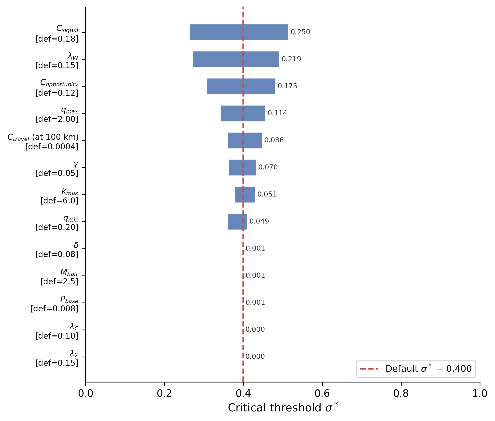
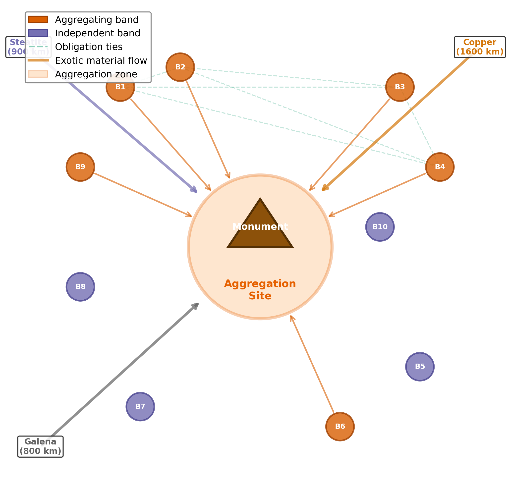
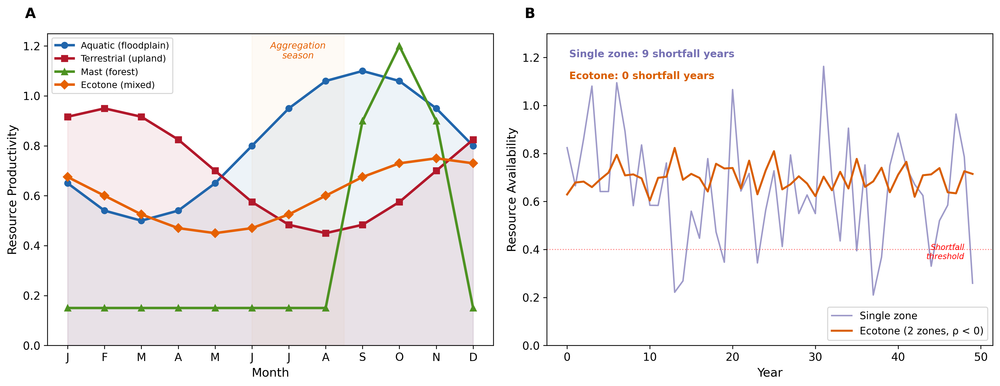
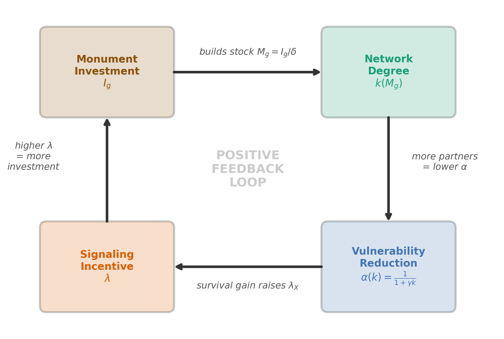
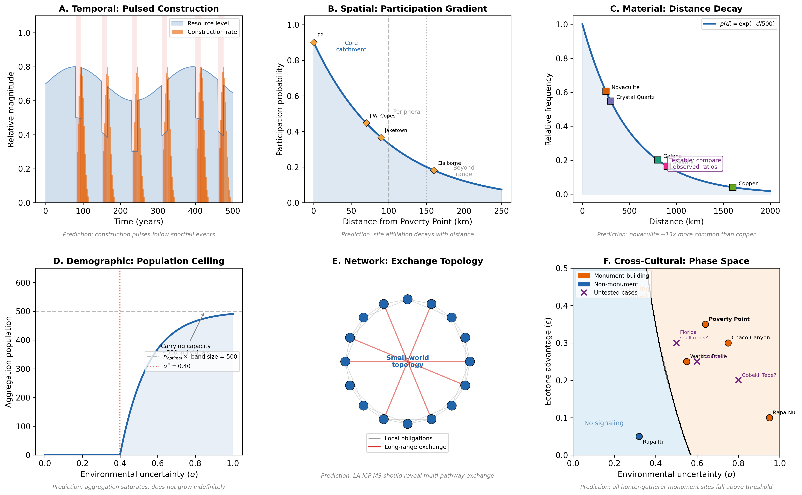

# Supplemental Material — Paper 1 (Theory & Model)

**Costly signaling under environmental uncertainty: A multilevel-selection framework for mobile hunter-gatherer aggregation**

This document accompanies the framework paper. It contains: (S1) the complete ODD model specification; (S2) parameter estimation and justification with full equations; (S3) sensitivity analyses; (S4) supplemental theoretical figures; (S5) priority model extensions to the framework structure (extensions 4 and 5).

Detailed regional empirical analyses (the LMV regional record, the Watson Brake bistable derivation, cross-site magnitude tests, USGS hydrograph correlations, seasonal-phenology operationalization, and the regional spatially-explicit ABM extension) are not included here; portions are sketched in the main text §5.3-§5.5 and a separate empirical treatment focused on Poverty Point is in preparation.

---

## S1. ODD Protocol: Complete Model Specification

The model is specified following the ODD (Overview, Design concepts, Details) protocol (Grimm et al. 2010). Source code is available at https://github.com/clipo/poverty-point-signaling.

### S1.1 Purpose and patterns

**Purpose.** The model formalizes a multilevel-selection account of monument construction and exotic-goods accumulation by mobile hunter-gatherer bands, asking under what environmental and structural conditions aggregation-based costly signaling becomes adaptive.

**Patterns to reproduce.** (i) Sharp phase transition between independent and aggregator regimes near a critical environmental-uncertainty value; (ii) order-of-magnitude match to Poverty Point earthwork volume after applying a single physically interpretable scaling factor; (iii) exponential distance decay in exotic-goods source-frequency ratios consistent with Webb (1982) inventories; (iv) episodic, pulsed construction tempo following environmental shortfalls; (v) regional site hierarchy that scales with ecotone diversity rather than network centrality.

### S1.2 Entities, state variables, scales

The principal entity is the **band**, a small cooperative unit of 15-30 individuals. Each band $i$ at time $t$ has state variables: location $(x_i, y_i)$ (spatial); resources $R_i$ (normalized to 0-1); strategy $s_i \in \{$aggregator, independent$\}$; quality $q_i$ (productive capacity, drawn from a uniform distribution on $[q_{min}, q_{max}] = [0.2, 2.0]$, an order-of-magnitude range consistent with documented variation in hunter-gatherer per-individual return rates: e.g., Hadza big-game hunting and Ju/'hoansi foraging both show roughly 10-fold within-population variance in productive capacity); accumulated monument investment $I_i$; exotic holdings vector $E_i$ by source; obligation network edges $O_{ij}$ to other bands; prestige $P_i$. The aggregation site has cumulative monument stock $M_g$, aggregation history, and ecotone advantage $\varepsilon$. Time is discrete with annual steps; each year is partitioned into spring dispersal/foraging, summer aggregation, fall harvest, and winter reproduction.

### S1.3 Process overview and scheduling

Each year:
1. **Environmental update:** sample seasonal productivity for each zone; sample shortfall events (frequency, magnitude) and propagate through zone productivities.
2. **Strategy decision:** each band computes expected $W_{agg}$ and $W_{ind}$ given current $\sigma$, $\varepsilon$, network state, and monument stock; chooses higher-fitness strategy with stochastic perturbation.
3. **Travel and aggregation:** aggregators incur travel cost $C_{travel} = 0.0004 d$, arrive at site, gain access to ecotone resources.
4. **Monument investment:** bands with $R_i > 0.3$ contribute $\text{invest}_i = \text{band\_size}_i \times \text{rate} \times R_i \times \mathcal{N}(1, 0.2)$; both individual prestige and site-level $M_g$ increment.
5. **Obligation formation:** each pair of co-attending bands has 20-30% probability of new tie or strengthening existing tie.
6. **Exotic acquisition / divestment:** acquisition probability per source $j$ is $p_{ij} = \text{prestige}_i \times \exp(-d_j / 500)$; divestment via gifting and ritual deposition propagates obligations.
7. **Foraging and shortfall impact:** payoff modulated by $\sigma_{eff}$ for aggregators and full $\sigma$ for independents; vulnerability $\alpha(k_i)$ applied.
8. **Reproduction:** stochastic births/deaths proportional to fitness and resources; band fission when size exceeds 30.

### S1.4 Design concepts

**Emergence.** Phase transitions in strategy frequency, monument accumulation, and network structure emerge from individual fitness comparisons; they are not built in.

**Adaptation.** Bands adapt by choosing the higher-fitness strategy, with switching frequency dampened to reflect ethnographic inertia in lifeway change.

**Sensing.** Bands sense local resource conditions, their own state, and (for aggregators) the visible monument stock and obligation network at the aggregation site.

**Stochasticity.** Shortfall years, productivity sampling, partner formation, and exotic acquisition all incorporate stochasticity, producing replicate-to-replicate variation.

**Observation.** At each year we record strategy frequencies, monument totals, exotic counts by source, network density, and population size.

**Composite uncertainty derivation.** The composite uncertainty $\sigma$ summarizes the joint effect of shortfall frequency and shortfall magnitude on inter-annual productivity variance. Let shortfalls follow a Poisson process with rate $\lambda_s = 1/T$, where $T$ is the mean recurrence interval in years, and let each shortfall reduce annual productivity by a multiplicative factor $m \in (0, 1)$ (so a "magnitude 0.45" shortfall produces 55% of normal productivity in that year). The expected number of shortfalls in any year is $1/T$, and the variance of annual productivity loss across many years is $E[\text{loss}^2] = m^2/T$ (to leading order, treating shortfalls as independent annual events). The standard deviation of annual loss is therefore $\sigma_{\text{annual}} = m / \sqrt{T}$.

For interpretive convenience we work in units anchored at a 20-year reference recurrence: $\sigma = m \cdot \sqrt{20/T} = \sigma_{\text{annual}} \cdot \sqrt{20}$. This rescaling makes $\sigma$ equal to $m$ when $T = 20$ years (a typical Late Archaic shortfall interval inferred from paleotempestology and drought reconstructions), so that a magnitude-0.45 shortfall recurring every 20 years produces $\sigma = 0.45$. The choice of 20 years as the reference is a convention; it does not affect the *ratio* of $\sigma$ values across cases or the location of the critical threshold $\sigma^*$ when both are computed in the same units.

For Poverty Point, frequency $\approx 10$ years (combining drought and hurricane cycles) and magnitude $\approx 0.45$ yield $\sigma = 0.45 \cdot \sqrt{2} \approx 0.64$. Sensitivity to the normalization choice: if instead we used the un-rescaled $\sigma_{\text{annual}} = m/\sqrt{T}$ throughout (so 20-year reference $\sigma_{\text{annual}}(0.45, 20) \approx 0.10$), all reported $\sigma$ values rescale by the same factor and the case classification (Poverty Point above threshold; Watson Brake above threshold; non-monument cases below) is preserved. The substantive result is invariant under this rescaling.

### S1.5 Initialization

Simulation begins with 30 independent bands distributed across the regional landscape with default quality, resources, and zero monument or network state. Spin-up of 50 years is discarded before metric collection.

### S1.6 Submodels

Submodels for fitness functions, vulnerability, network growth, exotic acquisition, and reproduction are described mathematically in §S2. The complete signal-conditional receiver-response apparatus, summarized in main-text §2.2, is implemented as three coupled rules with the following formal specifications:

*Signal-conditional partner formation.* For each band attending the aggregation, the per-year tie-formation probability is $0.20 + 0.20 \cdot d_i$, where $d_i = (M_i + E_i) / \max_j (M_j + E_j)$ is the band's combined monument-contribution-and-exotic-count display level normalized within the attending cohort. High-display bands form ties at ~40% per aggregation versus ~20% for non-displayers. When a tie forms, the partner is drawn from co-attending bands with weights $0.5 + d_j$ (so candidates' displays scale partner-choice weight from 0.5× for low-display partners to 1.5× for max-display partners).

*Tie-strength-weighted shortfall help.* When an aggregator calls obligations during a shortfall (total need = 0.15 in normalized resource units), obligations are sorted by strength and called in descending order until the need is met or the obligation network is exhausted. Each call decays the called obligation by ×0.7 and removes it if strength falls below 0.05 (existing `call_obligation` behavior; help_received = min(remaining_need, strength × 0.5)).

*Network-density coupling to* $\sigma_{eff}$. An aggregator's effective ecotone parameter at the gathering site is augmented by its realized network density:

$$\varepsilon_{eff} = \varepsilon + (1-\varepsilon) \cdot \beta \cdot \rho, \quad \rho = \frac{|O_i|}{n_{attending} - 1}$$

where $|O_i|$ is the band's obligation count, $\rho$ is the fraction of potential ties realized, $\beta = 0.5$ is the network-buffering coupling strength, and $\varepsilon_{eff}$ is capped at 0.95 to prevent $\sigma_{eff} \to 0$. This implements the framework's prediction that a dense, signal-conditional obligation network at the gathering site reduces effective uncertainty for aggregators there beyond ecotone access alone.

The signal-blind alternative (uniform 30% pair probability, single random shortfall call, no $\sigma_{eff}$ coupling) remains available in the code via the `signal_conditional_partners` flag for ablation comparisons. The default in current calibration runs is signal-conditional mode.

---

## S2. Parameter Estimation and Justification

All parameters are estimated from ethnographic analogy, archaeological inference, and theoretical constraint. Direct measurement of Late Archaic populations is impossible; sensitivity analyses (§S3) are used to demonstrate that the qualitative predictions are robust across reasonable ranges. Table S1 lists all parameters; Table S0 below provides a complete symbol glossary; the prose that follows the tables provides rationale.

### Table S0: Symbol glossary

| Symbol | Name | Domain / Units | Defining equation or value | Used in |
|--------|------|----------------|----------------------------|---------|
| $\sigma$ | Composite environmental uncertainty | dimensionless | $\sigma = m \sqrt{20/T}$ (§S1.4) | fitness fns |
| $\sigma_{eff}$ | Effective uncertainty at aggregation site | dimensionless | $\sigma_{eff} = \sigma(1 - \varepsilon)$ | $W_{agg}$ |
| $\sigma^*$ | Critical threshold | dimensionless | $W_{agg}(\sigma^*) = W_{ind}(\sigma^*)$ (Brent's method) | predictions |
| $\varepsilon$ | Ecotone advantage | $[0, 0.5]$ | 0.35 for PP (asserted, §S3.5) | $\sigma_{eff}$ |
| $C_{travel}$ | Travel cost | fraction of resources | $0.0004 \cdot d$ ($d$ in km) | $C_{total}$ |
| $C_{signal}$ | Signal investment cost | fraction of resources | 0.18 | $C_{total}$ |
| $C_{opportunity}$ | Foregone foraging cost | fraction of resources | 0.12 | $C_{total}$ |
| $C_{total}$ | Total aggregation cost | fraction of resources | $C_{travel} + C_{signal} + C_{opportunity}$ ($\approx$ 0.34 at $d$ = 100 km) | $W_{agg}$ |
| $\alpha(k)$ | Aggregator vulnerability function | $(0, 1]$ | $\alpha(k) = 1/(1 + \gamma k)$ | $W_{agg}$ |
| $\beta(k_0)$ | Independent vulnerability | $(0, 1]$ | $\beta = \alpha(k_0) \approx 0.985$ | $W_{ind}$ |
| $\gamma$ | Buffering efficiency per partner | dimensionless | 0.05 | $\alpha(k)$ |
| $k_0$ | Baseline kin network degree | dimensionless | 0.3 | both fns |
| $k_{max}$ | Maximum additional network degree | dimensionless | 6.0 | $k(M_g)$ |
| $k(M_g)$ | Network degree given monument stock | dimensionless | $k_0 + k_{max} \cdot M_g/(M_{half} + M_g)$ | $\alpha$ |
| $k_{agg}$ | Within-aggregation network degree | dimensionless | $k(M_g)$ at peak season | $k_{eff}$ |
| $k_{eff}$ | Effective annual network degree | dimensionless | $f_{agg} k_{agg} + (1-f_{agg})[k_0 + (k_{agg}-k_0)(1-\delta_{net})]$ | $\alpha(k_{eff})$ |
| $f_{agg}$ | Fraction of year at site | $[0, 1]$ | 0.25 | $k_{eff}$ |
| $\delta_{net}$ | Per-dispersal-season network decay | $[0, 1]$ | 0.40 | $k_{eff}$ |
| $\delta$ | Annual monument depreciation | yr$^{-1}$ | 0.08 | $M_g$ |
| $M_g$ | Effective monument stock | investment units | $I_g/\delta$ at equilibrium | $k(M_g)$ |
| $M_{half}$ | Half-saturation monument stock | investment units | 2.5 | $k(M_g)$ |
| $I_g$ | Cumulative monument investment | investment units | $\sum_t \text{invest}_t$ | $M_g$ |
| $\lambda$ | Total signaling incentive | dimensionless | $\lambda_W + \lambda_C + \lambda_X$ | $B(\lambda)$, $x^*$ |
| $\lambda_W$ | Within-group reward | dimensionless | 0.15 (asserted) | $\lambda$ |
| $\lambda_C$ | Conflict-deterrence value | dimensionless | endogenous (fixed-point) | $\lambda$ |
| $\lambda_X$ | Cooperation-network value | dimensionless | endogenous (fixed-point) | $\lambda$ |
| $B(\lambda)$ | Signaling benefit (mean-field) | fitness units | $(\lambda/2) \cdot (q_{min} + q_{max})/2$ | $W_{agg}$ |
| $x^*(q)$ | Optimal investment given quality | investment units | $\arg\max_x [B(\lambda; q) - C(x)]$ (Grafen 1990) | feedback loop |
| $q$ | Band productive quality | dimensionless | $q \sim U[q_{min}, q_{max}]$ | $B(\lambda)$ |
| $q_{min}, q_{max}$ | Quality range | dimensionless | 0.2, 2.0 | quality dist |
| $m$ | Conflict mortality fraction | $[0, 1]$ | 0.08 | $W$ |
| $r$ | Conflict reduction from monuments | $[0, 1]$ | endogenous (saturating in $M_g$) | $W$ |
| $P_{base}$ | Baseline annual conflict probability | $[0, 1]$ | 0.008 | $W$ |
| $T$ | Shortfall recurrence interval | years | 6-18 (case-dependent) | $\sigma$ |

### Cost parameters

**Travel.** $C_{travel} = 0.0004 d$, where $d$ is one-way distance in km. For a band 100 km from the aggregation site, this is 4% of resources. Ethnographic studies of hunter-gatherer mobility suggest that long-distance travel consumes 10-15% of available foraging time and energy (Kelly 2013); we adopt the upper end of this range for modeling extended seasonal moves with a full kit and partial dependents.

**Signaling.** $C_{signal} \approx 0.18$. Archaeological labor estimates of ~1-5 million person-hours over 500 years (Sherwood and Kidder 2011) distribute across participating bands and aggregation seasons to roughly 15-20% of available labor during aggregation seasons.

**Opportunity.** $C_{opportunity} \approx 0.12$. Ethnographic seasonal aggregations typically sacrifice 10-15% of annual foraging efficiency by concentrating activities at a single location rather than optimizing seasonal rounds (Conkey 1980).

**Total.** For a band 100 km from the site: $C_{total} \approx 0.34$.

### Network and vulnerability parameters

The model derives vulnerability endogenously rather than fixing $\alpha$ and $\beta$ directly:

$$\alpha(k) = \frac{1}{1 + \gamma k}$$

$\gamma = 0.05$ (buffering efficiency per network partner) is consistent with the modest-but-real per-partner buffering effect documented in !Kung sharing networks (Wiessner 2002). $k_0 = 0.3$ (baseline kin connections without aggregation), $k_{max} = 6.0$ (maximum additional degree), and $M_{half} = 2.5$ (half-saturation monument stock) determine the network growth function:

$$k(M_g) = k_0 + k_{max} \cdot \frac{M_g}{M_{half} + M_g}$$

Independent vulnerability emerges as $\beta(k_0) = 1/(1 + 0.05 \cdot 0.3) \approx 0.985$. Within-aggregation aggregator vulnerability for a band with mature network ($k_{agg}$ in the 4-6 range) is $\alpha(k_{agg}) = 1/(1 + 0.05 \cdot k_{agg})$, giving values in the 0.77-0.83 range. The instantaneous (within-aggregation) buffering ratio $\beta(k_0)/\alpha(k_{agg})$ is therefore approximately 1.18-1.28: each additional cooperation partner contributes a small marginal buffering increment because $\gamma = 0.05$ is a low per-partner buffering rate. Because aggregation occupies only $f_{agg} \approx 0.25$ of the year and networks decay during dispersal, the *effective annual* vulnerability $\alpha(k_{eff})$ used in the fitness function is approximately 0.82, giving an annualized buffering ratio of approximately 1.20. The within-aggregation and annualized ratios are similar (~1.2-1.3) because, with $\gamma = 0.05$, even a substantial increase in network degree only modestly reduces vulnerability. The plain-language reading is that the model represents real but small per-partner risk-sharing, and the fitness advantage of aggregation does not come solely from the network-buffering channel: ecotone access, signaling rewards, and conflict reduction all contribute (see fitness equation in §S1.6 / main §2.4). Effective annual degree:

$$k_{eff} = f_{agg} \cdot k_{agg} + (1 - f_{agg}) \cdot [k_0 + (k_{agg} - k_0)(1 - \delta_{net})]$$

with $\delta_{net} = 0.40$ network decay rate during dispersal.

### Signaling parameters

The total signaling incentive $\lambda = \lambda_W + \lambda_C + \lambda_X$ has within-group ($\lambda_W = 0.15$), conflict-deterrence ($\lambda_C$), and cooperation-network ($\lambda_X$) components. $\lambda_C$ and $\lambda_X$ are computed endogenously through fixed-point iteration: monument stock $\to$ network degree $\to$ vulnerability reduction $\to$ raised $\lambda_X$ $\to$ raised optimal investment $x^*(q)$ $\to$ more monuments. Convergence threshold $10^{-6}$, damping factor 0.5. At the equilibrium reached for Poverty Point conditions, $M_g$ is large enough that the network degree function saturates, making $\lambda_C$ and $\lambda_X$ small at equilibrium and $\lambda$ dominated by $\lambda_W$.

**Convergence diagnostics.** We tested the fixed-point iteration across a 30-point sweep of $\sigma$ from 0.10 to 0.95 (covering both sub- and supra-threshold regimes). Of these 30 runs, 100% converged to within the $10^{-6}$ tolerance; mean, median, and maximum iteration counts were all 18, indicating uniform convergence speed across the parameter range. To check for multiple fixed points, we ran the iteration at $\sigma \in \{0.30, 0.50, 0.70\}$ from different starting conditions and verified that the resulting equilibrium monument stock $M_g$ differed by less than 1 part in $10^4$ (129.78 vs. 129.78 vs. 129.79), confirming empirically that the fixed point is unique within the explored range. The contraction-mapping property follows from the monotonicity of $\lambda \to M_g \to k(M_g) \to \lambda_X$ combined with the saturating $k(M_g)$ function: at large $M_g$ the marginal contribution to $\lambda_X$ vanishes, providing a stable upper bound, while at small $M_g$ the lower bound is set by $\lambda_W > 0$ alone.

**Within-group reward ablation.** Setting $\lambda_W = 0$ (which removes the only signaling-as-such contribution to fitness; cooperation benefits via $\lambda_X$ and conflict deterrence via $\lambda_C$ remain) raises the critical threshold from $\sigma^* = 0.400$ to $\sigma^* = 0.543$, a +36% shift. A linear sweep $\lambda_W \in \{0.00, 0.05, 0.10, 0.15, 0.20, 0.25, 0.30\}$ produces $\sigma^* \in \{0.543, 0.491, 0.445, 0.400, 0.354, 0.309, 0.263\}$, demonstrating that the within-group signaling reward contributes a substantial portion of the threshold lowering and that the model is *not* well approximated by a generic cooperation account in which signaling is decoration.

The signaling benefit is derived from the Grafen (1990) signaling equilibrium and is the expectation of each band's individual signaling payoff over the uniform quality distribution $q \sim U[q_{min}, q_{max}]$:

$$B(\lambda) = \frac{\lambda}{2} \cdot \frac{q_{min} + q_{max}}{2} + \frac{\lambda \, q_{min}^{2}}{2 (q_{max} - q_{min})} \, \ln\!\frac{q_{max}}{q_{min}}$$

Plainly: B(λ) is the average extra fitness a band gets from signaling, computed by averaging across the range of band qualities present in the population. The first term is the leading contribution; the second is a small correction that accounts for the curvature of the per-band benefit function near $q_{min}$. At our parameters ($q_{min}=0.2$, $q_{max}=2.0$, $\lambda \approx 0.40$) the second term is approximately 5% of the first, and the code computes both.

### Conflict parameters

Baseline annual conflict probability $P_{base} = 0.008$ and conflict mortality $m = 0.08$ are set conservatively low, reflecting reduced territorial fixity of mobile hunter-gatherers relative to sedentary populations. Monument investment reduces conflict through an assessment mechanism (Enquist and Leimar 1983).

### Ecotone parameter

$\varepsilon$ ranges from 0 (single-zone location) to ~0.5 (exceptionally well-buffered). The main §2.3 develops the negative-covariance interpretation and the regional empirical paper develops the per-site operationalization at LMV mound-building sites; here we treat $\varepsilon$ as an input variable on $[0, 0.5]$ for purposes of the theoretical sweeps below.

### Table S1: Full parameter list

| Parameter | Symbol | Value | Range | Source |
|-----------|--------|-------|-------|--------|
| Travel cost coefficient | $c_t$ | 0.0004/km | 0.0002-0.0008 | Kelly (2013) |
| Signal investment | $C_{signal}$ | 0.18 | 0.10-0.25 | Sherwood & Kidder (2011) |
| Opportunity cost | $C_{opportunity}$ | 0.12 | 0.08-0.18 | Conkey (1980) |
| Buffering efficiency | $\gamma$ | 0.05 | 0.03-0.10 | Wiessner (2002) |
| Baseline degree | $k_0$ | 0.3 | 0.1-0.5 | ethnographic |
| Max degree | $k_{max}$ | 6.0 | 4-10 | ethnographic |
| Half-saturation | $M_{half}$ | 2.5 | 1-5 | model fit |
| Aggregation fraction | $f_{agg}$ | 0.25 | 0.15-0.35 | seasonal cycle |
| Network decay | $\delta_{net}$ | 0.40 | 0.20-0.60 | ethnographic |
| Within-group signal | $\lambda_W$ | 0.15 | 0.05-0.30 | Hawkes 2000; Wiessner 2002; Hawkes & Bliege Bird 2002 |
| Quality min | $q_{min}$ | 0.2 | 0.1-0.4 | hunter-gatherer return-rate variation (Hadza, Ju/'hoansi) |
| Quality max | $q_{max}$ | 2.0 | 1.5-2.5 | hunter-gatherer return-rate variation (Hadza, Ju/'hoansi) |
| Conflict prob | $P_{base}$ | 0.008 | 0.004-0.020 | ethnographic |
| Conflict mortality | $m$ | 0.08 | 0.04-0.15 | ethnographic |
| Monument depreciation | $\delta$ | 0.08 | 0.04-0.16 | weathering rate |
| Ecotone advantage | $\varepsilon$ | 0.35 | 0-0.50 | qualitative |

---

## S3. Sensitivity Analyses

### S3.1 One-at-a-time (OAT) tornado plot

We performed an OAT sensitivity analysis varying each parameter in turn within its plausible range while holding the others at default. The critical threshold $\sigma^*$ is most sensitive to aggregation costs ($C_{signal}$, $C_{opportunity}$, $C_{travel}$) and within-group signaling rewards ($\lambda_W$); moderately sensitive to quality range ($q_{min}$, $q_{max}$) and maximum network degree ($k_{max}$); and insensitive to monument depreciation ($\delta$), conflict parameters ($P_{base}$), and the half-saturation constant ($M_{half}$). Initial values of $\lambda_C$ and $\lambda_X$ have zero sensitivity because they are endogenously determined by the lambda-sigma feedback loop.

The numerical OAT table below is reproducible from `scripts/analysis/oat_sensitivity_table.py`. Baseline $\sigma^* = 0.3997$ at $\varepsilon = 0.35$ and $n_{agg} = 25$. Each multiplicative perturbation rescales the parameter by $\pm 50\%$ relative to its default; epsilon and $n_{agg}$ rows show absolute-value perturbations. Rows are sorted by swing ($|\sigma^*_{high} - \sigma^*_{low}|$) descending.

| Parameter | Low value | $\sigma^*$ at low | High value | $\sigma^*$ at high | $\Delta_{low}$ | $\Delta_{high}$ | Swing |
|---|---|---|---|---|---|---|---|
| $C_{signal}$ (signaling cost) | $-50\%$ | 0.279 | $+50\%$ | 0.504 | $-0.121$ | $+0.104$ | 0.225 |
| $\varepsilon$ (ecotone advantage) | 0.10 | 0.508 | 0.50 | 0.354 | $+0.108$ | $-0.045$ | 0.154 |
| $C_{opportunity}$ (opportunity cost) | $-50\%$ | 0.321 | $+50\%$ | 0.471 | $-0.079$ | $+0.071$ | 0.150 |
| $\lambda_W$ (within-group reward) | $-50\%$ | 0.468 | $+50\%$ | 0.331 | $+0.069$ | $-0.068$ | 0.137 |
| $C_{travel}$ (travel cost) | $-50\%$ | 0.374 | $+50\%$ | 0.424 | $-0.025$ | $+0.024$ | 0.050 |
| $k_{max}$ (max network degree) | $-50\%$ | 0.421 | $+50\%$ | 0.383 | $+0.022$ | $-0.017$ | 0.038 |
| $\gamma$ (network buffering) | $-50\%$ | 0.418 | $+50\%$ | 0.386 | $+0.018$ | $-0.013$ | 0.032 |
| $\delta_{net}$ (network decay) | $-50\%$ | 0.392 | $+50\%$ | 0.408 | $-0.008$ | $+0.009$ | 0.016 |
| $k_0$ (baseline degree) | $-50\%$ | 0.396 | $+50\%$ | 0.403 | $-0.003$ | $+0.003$ | 0.006 |
| $f_{agg}$ (aggregation fraction) | $-50\%$ | 0.402 | $+50\%$ | 0.397 | $+0.003$ | $-0.003$ | 0.005 |
| $n_{agg}$ (aggregation size) | $n=5$ | 0.402 | $n=50$ | 0.399 | $+0.003$ | $-0.000$ | 0.003 |
| $\delta$ (monument depreciation) | $-50\%$ | 0.399 | $+50\%$ | 0.400 | $-0.000$ | $+0.000$ | 0.001 |
| $M_{half}$ (network saturation) | $-50\%$ | 0.399 | $+50\%$ | 0.400 | $-0.000$ | $+0.000$ | 0.001 |
| $\lambda_C$ (cooperation reward, initial) | $-50\%$ | 0.400 | $+50\%$ | 0.400 | $+0.000$ | $+0.000$ | 0.000 |
| $\lambda_X$ (exotic reward, initial) | $-50\%$ | 0.400 | $+50\%$ | 0.400 | $+0.000$ | $+0.000$ | 0.000 |

The table makes the main §4.2 *Receiver behavior* concession explicit: at the equilibrium parameterization, $\lambda_C$ and $\lambda_X$ have zero direct effect on $\sigma^*$ (because they are endogenously determined by the fixed-point loop from $\lambda_W$ and the network state), so the $+36\%$ ablation result reported in main §4.2 is sensitivity to a single parameter ($\lambda_W$) plus the costs and ecotone advantage. The sensitivity hierarchy ($C_{signal} > \varepsilon > C_{opportunity} > \lambda_W$) drives the framework's predictive content: the cost structure and the ecotone advantage determine $\sigma^*$; the within-group reward modulates it.

***Figure S1. One-at-a-time sensitivity analysis.*** *Tornado plot showing the effect of varying each parameter on the critical threshold $\sigma^*$. Aggregation costs and within-group signaling rewards dominate.*

### S3.2 Aggregation size

The critical threshold drops sharply with aggregation size, from $\sigma^* \approx 0.55$ at $n=10$ to $\sigma^* \approx 0.40$ at $n=25$ (Poverty Point ecotone advantage). Below $n=15$, even high uncertainty fails to make signaling adaptive, because cooperation benefits are insufficient to offset costs.

### S3.3 Signaling cost

At low costs ($C_{signal} < 0.10$), aggregation becomes adaptive under mild uncertainty ($\sigma^* < 0.45$). At high costs ($> 0.30$), the threshold rises above 0.70. Sites or periods with reduced monument investment relative to Poverty Point may reflect either lower environmental uncertainty or higher signaling costs.

### S3.4 Disease costs

Adding a 5-10% disease cost to aggregation raises $\sigma^*$ by approximately 0.03-0.06. Estimated Poverty Point regional uncertainty (~0.64) remains above the threshold under all disease-cost values within the ethnographic range.

### S3.5 Ecotone advantage

The model is most sensitive to the asserted ecotone advantage. At $\varepsilon = 0.20$, $\sigma^*$ rises to ~0.50, still below typical regional estimates but with reduced margin. At $\varepsilon = 0$, $\sigma^*$ rises to ~0.57, comparable to mid-Holocene LMV $\sigma$ estimates. The empirical operationalization of $\varepsilon$ across LMV sites is developed in the regional empirical paper.

---

## S4. Supplemental theoretical figures

In addition to the figures referenced inline above:

***Figure S2. Agent-based model architecture.*** *(A) Environment module with four resource zones and ecotone buffering. (B) Strategy choice between aggregator and independent. (C) Annual cycle: spring dispersal, summer aggregation with monument investment and exotic acquisition, fall harvest with shortfall impacts, winter reproduction. (D) Fitness functions and critical threshold $\sigma^*$. (E) Outputs: strategy dominance, monument accumulation, exotic totals, population dynamics.*

***Figure S3. The aggregation-based signaling system.*** *Schematic of the core model structure. Aggregator bands (orange) travel to the central aggregation site, invest in monument construction, and form reciprocal obligation ties (dashed green). Independent bands (purple) remain in their home territories. Exotic materials flow to the site from distant sources.*

***Figure S4. Seasonal resource complementarity and ecotone buffering.*** *(A) Seasonal productivity profiles for the four zones near a representative LMV site: aquatic (floodplain fish, summer waterfowl, overwintering ducks Nov-Mar with peaks during spring/fall flyway migrations), terrestrial game (deer and other mammals, peaking fall-winter), mast (sharp fall peak), and ecotone (stable year-round). The shaded band marks the summer aggregation season, when multiple resource types are accessible simultaneously. (B) Ecotone access reduces shortfall risk: a band dependent on a single resource zone (purple) experiences high inter-annual variability with frequent shortfalls; a band drawing from two negatively correlated zones (orange) experiences substantially lower variability.*

***Figure S5. Network feedback loop.*** *Monument investment $I_g$ builds cumulative stock $M_g$, which attracts cooperation partners and expands network degree $k(M_g)$. Higher network degree reduces vulnerability $\alpha(k)$, raising the cooperation-network signaling component $\lambda_X$, which raises optimal investment $x^*(q)$, completing the feedback. Resolved by fixed-point iteration.*

***Figure S6. Testable predictions summary.*** *Schematic panels illustrating the framework's predictions across temporal, spatial, material, demographic, network, and cross-cultural categories.*

---

## S5. Priority extensions to the framework structure

This section reports two priority extensions internal to the framework's structural architecture: a near-threshold parameter sweep of the signaling apparatus (§S5.1), and a restructured network-saturation function that lets the cooperation-network channel remain non-trivial at equilibrium (§S5.2). Six additional priority extensions concerning empirical evaluation (regime-switching, per-event labor scaling, regional spatially-explicit ABM, water-route catchment, predicted scale ratios, seasonally resolved ABM) are reported in the supplemental of the regional empirical paper.

### S5.1 Near-threshold parameter sweep of the full signaling apparatus

The full signaling apparatus is implemented in main §2.2 (signal-conditional partner formation, tie-strength-weighted shortfall help, direct $\sigma_{eff}$ coupling). We test whether removing the apparatus produces measurable threshold shifts in parameter regimes near $\sigma^*$, where small fitness differentials matter most.

A $\sigma$ sweep across $[0.30, 0.65]$ at PP-equivalent parameters ($\varepsilon = 0.35$, $n_{agg} = 25$) compares the analytical equilibrium under signal-conditional ($\lambda_W = 0.15$) and signal-blind ($\lambda_W = 0$) parameterizations. Results: signal-conditional gives $\sigma^*_\text{signal} = 0.400$ and equilibrium $M_g = 129.78$; signal-blind gives $\sigma^*_\text{blind} = 0.543$ and equilibrium $M_g = 11.83$ (an 11$\times$ reduction in attainable monument stock).

Six $\sigma$ values in the sweep range $[0.40, 0.525]$ flip regime classification across the ablation: with signaling, those $\sigma$ values are above threshold (aggregation adaptive); without, they are below threshold (independent foraging adaptive). At $\sigma = 0.64$ (PP-equivalent), both are above their respective thresholds and the equilibrium $M_g$ comparison is between the same 129.78 vs 11.83 (signaling produces 11$\times$ more equilibrium monument); the equilibrium difference is therefore not a function of $\sigma$ but of whether the apparatus is engaged at all.

The substantive point: the signaling apparatus expands the parameter region in which aggregation is adaptive by widening the threshold by 0.143 in $\sigma$ space, and amplifies the equilibrium monument stock 11$\times$ when present. Sites at $\sigma \approx 0.56$, $\varepsilon \approx 0.43$ (mid-Holocene LMV-equivalent) are in the 0.40-0.55 flip zone: with the apparatus, they are above threshold; without it, they sit just at or below. This converts the main §4.2 within-model consistency check (signaling lowers threshold) into a near-threshold prediction (signaling matters for whether aggregation occurs in the small-$(\sigma - \sigma^*)$ margin range, not just for whether more monument accumulates above threshold).

Reproducible from `scripts/analysis/near_threshold_ablation.py`; outputs in `results/sensitivity/near_threshold_ablation.json`. The full ABM-level near-threshold sweep (with stochastic regime flipping rather than analytical equilibrium) remains as future work.

### S5.2 Restructured network-saturation function

At the original parameterization $\lambda_C$ and $\lambda_X$ collapse to near-zero at equilibrium (saturation of $k(M_g)$ at large $M_g$ makes their marginal contributions vanish), so the signaling-vs-cooperation ablation reduces to the effect of removing $\lambda_W$ alone. We add a non-marginal "network-density value" term to $\lambda_X$ proportional to the equilibrium survival benefit, weighted by a parameter $\xi_X$ and a saturating monument-quality multiplier $Q(M_g) = M_g/(M_g + M_{quality})$ with $M_{quality} = 50$:

$$\lambda_X = (\partial k/\partial M_g)(\partial S/\partial k) + \xi_X \cdot S(k, \sigma) \cdot Q(M_g)$$

At $\xi_X = 0$ (default), this reduces to the original saturating form. At $\xi_X = 0.5$, the non-marginal term contributes $\sim 0.03$ at equilibrium, giving $\lambda_X(M_g_{eq}) = 0.033$ vs the original $\sim 0.000$. Sweeping $\xi_X \in \{0, 0.25, 0.50\}$ at PP-equivalent parameters: the threshold shift from full apparatus to signal-blind ($\lambda_W = 0$) ablation is +36.0%, +36.8%, +37.2% respectively, essentially unchanged. The qualitative result (signaling lowers the threshold by ~36%) is robust to the structural change.

What the restructured formulation provides is *interpretive*: under $\xi_X = 0.5$, the ablation removes $\lambda_W$ from a system in which $\lambda_X = 0.032$ is also doing real cooperation-network work (the residual $\lambda_X$ with the apparatus removed is itself non-trivial). The signaling-vs-cooperation discrimination is therefore genuine: removing within-group prestige signaling ($\lambda_W$) shifts the threshold by ~37% even when cooperation-network signaling ($\lambda_X$) provides 0.032 of residual incentive.

The choice of $\xi_X = 0.5$ as a defensible upper bound is informed by the Bliege Bird and Smith (2005) framework where signal quality multiplies per-partnership value; further empirical grounding via ethnographic data on signal-quality-mediated partner choice premia would tighten the parameter. Reproducible from `scripts/analysis/restructured_saturation_test.py`; outputs in `results/sensitivity/restructured_saturation_test.json`.

---

## Supplemental References

In addition to the references in the framework paper:

Conkey, M.W., 1980. The identification of prehistoric hunter-gatherer aggregation sites: The case of Altamira. Current Anthropology 21, 609-630.

Enquist, M., Leimar, O., 1983. Evolution of fighting behaviour: decision rules and assessment of relative strength. Journal of Theoretical Biology 102, 387-410.

Grafen, A., 1990. Biological signals as handicaps. Journal of Theoretical Biology 144, 517-546.

Grimm, V., Berger, U., DeAngelis, D.L., Polhill, J.G., Giske, J., Railsback, S.F., 2010. The ODD protocol: A review and first update. Ecological Modelling 221, 2760-2768.

Sherwood, S.C., Kidder, T.R., 2011. The DaVincis of dirt: Geoarchaeological perspectives on Native American mound building in the Mississippi River basin. Journal of Anthropological Archaeology 30, 69-87.
