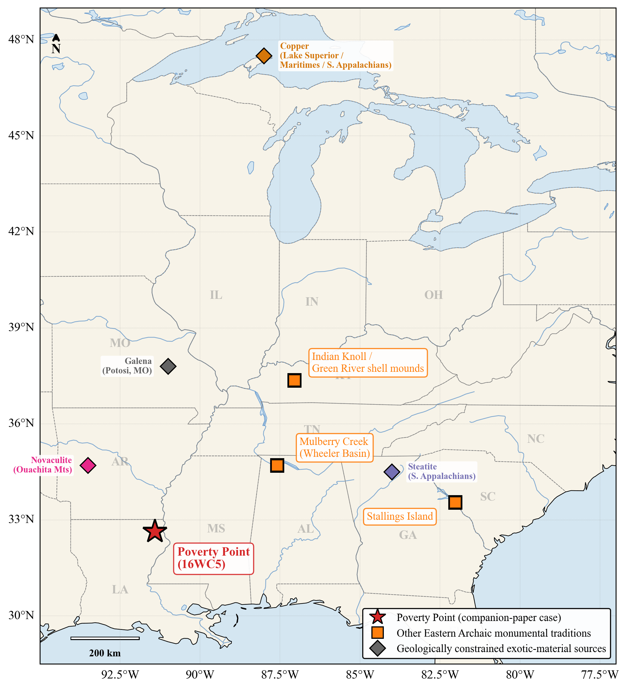
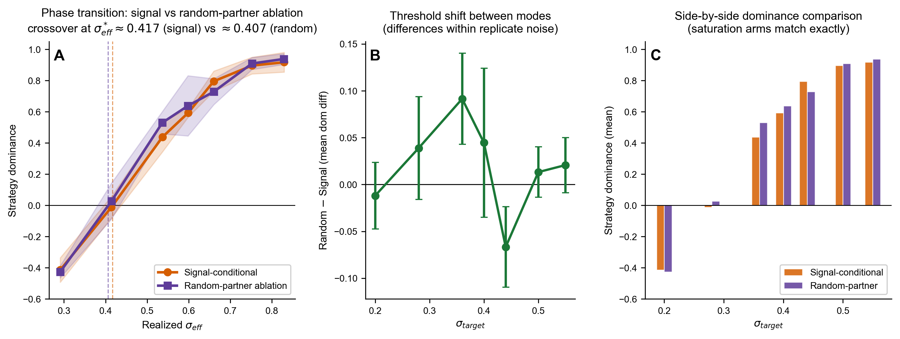

# Costly signaling under environmental uncertainty: A multilevel-selection framework for mobile hunter-gatherer aggregation

**Target journal:** *Journal of Archaeological Method and Theory*

**Running title:** A threshold framework for mobile-forager aggregation

**Authors:** Carl P. Lipo¹\* (ORCID: 0000-0003-4391-3590), Robert J. DiNapoli¹ (ORCID: 0000-0003-2180-2195), Diana M. Greenlee²

¹ Department of Anthropology and Environmental Studies Program, Binghamton University, Binghamton, NY 13902, USA

² Station Archaeologist, Poverty Point World Heritage Site, University of Louisiana at Monroe, Monroe, LA 71209, USA

\* **Corresponding author:** Carl P. Lipo, clipo@binghamton.edu

**Keywords:** costly signaling, multilevel selection, hunter-gatherer aggregation, agent-based modeling, Late Archaic monumentality, landscape investment, phase transition, environmental uncertainty

---

## Abstract

Beginning roughly 5,500 years ago, mobile hunter-gatherer populations across the eastern United States started to gather at fixed locations on the landscape, build earthworks, dig substantial pits, deposit burials, and accumulate exotic raw materials transported from sources hundreds to more than a thousand kilometers away. The combined record runs from Watson Brake and the Green River shell mounds through Stallings Island and Mulberry Creek and culminates at Poverty Point — the largest such investment north of Mexico at the time. None of these populations adopted food production, occupied their construction sites year-round, or developed the inherited inequalities that ordinarily accompany monumental investment elsewhere in the world. Why do mobile foragers in these contexts begin to aggregate, and why does aggregation generate landscape investment at this scale? Existing accounts — aggrandizer competition, pilgrimage, trade-center, incipient sedentism, revitalization, and institutional flexibility — describe individual cases but do not specify the conditions under which the transition should occur. We develop a multilevel-selection framework that does. We extend the Price equation to fission-fusion bands choosing between aggregation with cooperative investment and dispersed independent foraging, and treat earthworks and geologically traceable exotic goods as honest index signals (Bliege Bird and Smith 2005) of cooperative reliability, with a signal half-life that requires ongoing rather than one-time investment. Effective uncertainty at the gathering site is buffered locally by ecotone access whose strength depends on the negative covariance between local productivity and regional shortfall drivers. The model produces a sharp phase transition above a critical environmental-uncertainty threshold $\sigma^*$. We formalize the framework in an agent-based model whose simulated dynamics reproduce the analytical threshold; a signaling-versus-cooperation ablation shifts the predicted threshold by 36-37%. The framework predicts where landscape investment should arise, when it should collapse, and what observations would falsify the threshold mechanism. Late Holocene paleoclimate proxies for the Lower Mississippi Valley place regional environmental uncertainty near or above the model-predicted threshold, consistent with the framework's central prediction that mobile-forager landscape investment should arise where these conditions hold.

## 1. Introduction

Across the Holocene Eastern Woodlands of the United States, mobile hunter-gatherer populations show a pattern that the comparative ethnographic record gives little reason to expect. Between roughly 5,500 and 3,000 cal BP, foragers in this region begin to converge on fixed locations on the landscape, return to those locations across seasonal cycles, and pour collective labor into modifying them. The investments take several forms: earthen mounds and ridges (the most archaeologically conspicuous), but also large excavated pits, prepared activity surfaces, formal burial concentrations, post-set timber circles, and accumulations of geologically traceable raw materials brought in from sources hundreds to more than a thousand kilometers distant. The Lower Mississippi Valley between roughly 4,200 and 3,000 cal BP records the densest expression of this pattern (Figure 1); Stallings Island on the Savannah River, the Green River shell mounds in Kentucky, and the Mulberry Creek shell-mound tradition of the Tennessee Valley record contemporary or earlier expressions across a broader Eastern Archaic landscape (Ford and Webb 1956; Gibson 2000; Marquardt and Watson 2005; Sassaman 2006, 2010). What unites these cases is a transition that the standard typology of forager behavior does not predict: people who would otherwise be expected to maintain residentially mobile, low-investment lifeways begin to systematically aggregate at locations they then transform.

The transition demands explanation on at least two registers. The first is *why aggregation*, given that the fitness cost of forgoing alternative resource patches and traveling to a fixed gathering site is real. The second is *why landscape investment*, given that mobile foragers ordinarily minimize fixed-place commitments and generally avoid the kinds of labor pours that earthwork construction or large-pit excavation entails. Both questions become sharper when the populations involved show no evidence for the institutional features that would, in most archaeological contexts elsewhere in the world, accompany this scale of investment. There are no elite burials, no specialized economic differentiation, no architectural markers of inherited inequality, and no evidence for coercive authority of the chiefly type at any of the relevant Eastern Archaic sites (Kidder and Ervin 2018; Sassaman 2005, 2010). Whatever drove the aggregation, it was not centralized power, surplus accumulation by an emerging elite, or year-round residence at a population center.

***Figure 1. Eastern Archaic monumental-tradition sites discussed in this paper, with geologically constrained exotic-material source regions.*** *Poverty Point (16WC5, red star) is the canonical and largest case of Late Archaic landscape investment in the eastern United States; three additional Eastern Archaic monumental traditions are shown as orange squares: Stallings Island (Savannah River shell-ring tradition, 4500-3500 cal BP, near Augusta, GA); the Green River shell mounds in Kentucky (Indian Knoll site 15OH2 marked, ~5800-4000 cal BP); and Mulberry Creek (Wheeler Basin shell-mound tradition, 4500-3500 cal BP, on the Tennessee River in northern Alabama). The framework predicts that mobile-forager landscape investment should arise where regional environmental uncertainty exceeds a critical threshold and locally available ecotone diversity buffers shortfall sufficiently for sustained aggregation; §5.3 places these four cases conditionally above threshold based on their drainage-and-zone settings. Diamonds mark the four geologically constrained exotic-material source regions referenced in the framework's distance-decay arguments: copper (Lake Superior, Maritime, and southern Appalachian sources, all ~1,000-1,600 km from the LMV); galena (Potosi, Missouri, ~800 km); steatite (southern Appalachians, ~800-900 km); and novaculite (Ouachita Mountains, ~250-300 km). The Lower Mississippi Valley contains the densest concentration of such sites in the Holocene Eastern Woodlands, with eleven Middle Archaic and Late Archaic mound-building sites within ~3° of latitude.*

Several explanatory traditions have been brought to bear on the puzzle, each capturing part of the phenomenon. Aggrandizer interpretations require asymmetric power that the Eastern Archaic record does not support (Gibson 1998; Jackson 1986). Pilgrimage models account for the draw of distant participants but cannot specify why a particular landscape, scale, and tempo (Spivey et al. 2015). Trade-center models explain the accumulation of exotic raw materials but leave the earthworks themselves unaccounted for (Gibson 1999; Jackson 1991). Incipient-sedentism readings conflict with the seasonal faunal record and the absence of cultigens (Jackson 1986). Recent culturally embedded accounts move past these classical alternatives in different directions. Sanger (2023, 2024) reads the aggregation centers as institutions that deliberately limit the consolidation of authority, with cyclical gathering and dispersal preventing inequality from settling into permanence. Kidder and Grooms (2025) argue for revitalization-movement dynamics in which the construction is mobilized as a response to environmental and demographic stress. Each of these accounts captures part of what is going on, and each draws heavily on ethnographic analogy across the multi-millennia gap that separates the cases from the modern observation. None specifies the structural conditions under which the transition to aggregation-with-landscape-investment should be expected to occur in the first place.

This is the gap our framework addresses. We argue that the aggregation transition, where it occurs, becomes adaptive when environmental uncertainty exceeds a critical threshold and locally available ecotone diversity buffers shortfall sufficiently for a sustained gathering to take place. Under those conditions, earthworks and geologically traceable exotic goods function as honest index signals (Bliege Bird and Smith 2005) of a band's cooperative reliability, and the pattern of investment that ethnographers and archaeologists describe — pulsed construction, broad geographic draw, multi-material accumulation, episodic deposition — emerges as the predicted footprint of a costly-signaling system whose receivers are the other participating bands. Poverty Point is the canonical and most extraordinary case, and the Lower Mississippi Valley provides the densest concentration of contemporary and antecedent sites. The framework as we develop it here is intended to apply across the Eastern Archaic record more broadly, with Poverty Point as the limiting case rather than as the whole phenomenon. We do not claim that the framework displaces the cultural-historical accounts; we claim that it specifies the conditions under which the pattern those accounts describe becomes adaptive, generates quantitative predictions about *when* and *where* the pattern should occur, and identifies what *would* falsify the framework's claims. On the cultural content — the symbols, the ceremonies, the prophetic language, the bundle ceremonies and sodality markers — the framework is intentionally silent: the structural prediction is that *some* such cultural apparatus must develop to coordinate cooperation under the predicted conditions, but the specific form that apparatus takes is not derivable from ecology alone.

Costly signaling models in archaeology have been criticized for producing post-hoc narrative rationalizations rather than testable predictions (Codding and Jones 2007; Quinn 2019). The objection is fair where signaling is invoked as an interpretive frame after the pattern is already known, and where the same logic could equally explain almost any costly behavior. Our approach addresses this critique by deriving quantitative predictions from a formal model whose parameters are anchored independently of the archaeological pattern they are meant to explain, and by specifying ex ante what observations would falsify the framework (§5.4 below).

The remainder of this article develops the framework in three steps. We first set out the multilevel-selection logic and the index-signal interpretation that distinguish costly signaling from generic cooperation theory (§2). We then describe the agent-based model in which the framework is formalized (§3). We present theoretical results (phase transition, ablation, sensitivity; §4) and close by discussing what the framework predicts, what it does not, and how it could be falsified (§5). The full ODD model specification, parameter justifications, and sensitivity analyses are provided as Supplemental Material.

## 2. Theoretical framework

### 2.1 Multilevel selection and the logic of aggregation

Consider a region of mobile hunter-gatherer bands. Each band, every year, either travels to a seasonal aggregation and contributes labor to collective tasks (earthwork construction, pit excavation, post-circle raising, exotic-goods acquisition) or remains dispersed and forages independently. Contributors pay a short-term cost that non-contributors avoid; within any aggregation, the non-contributors out-reproduce them. But aggregations stocked with contributors survive bad years — droughts, floods, mast-crop failures — at higher rates than dispersed independents, because contributors carry cooperation networks they can call on during shortfalls. Over generations, the aggregation strategy can spread despite the short-term cost it imposes. The balance depends on the environment. When shortfalls are rare, the cost-avoidance of independents wins; when shortfalls are frequent, the network advantage of aggregators prevails. Between the two regimes lies a tipping point in environmental uncertainty above which aggregation pays and below which it does not.

This intuition is formalized by the Price equation for multilevel selection (Price 1970). The Price equation cleanly partitions any change in the average frequency of a trait into a part driven by differences *between* groups and a part driven by differences *within* them. For our purposes, the trait is "tendency to aggregate and contribute," and the equation specifies under what conditions that trait spreads:

$$\Delta\bar{p} = \frac{Cov(w_g(\sigma), p_g)}{\bar{w}(\sigma)} + \frac{E(w_g(\sigma) \Delta p_g)}{\bar{w}(\sigma)}$$

In plain language: the change in the population's average tendency-to-aggregate ($\Delta\bar{p}$) is the sum of (i) how strongly groups with more aggregators do better than groups with fewer, weighted by group size, and (ii) how non-contributors gain or lose ground within their own groups. The first term tracks the between-group benefit of cooperation; the second tracks the within-group cost. Symbolically, $p_g$ is the frequency of the aggregation trait in group $g$, $w_g$ is the fitness of group $g$, $\bar{w}$ is the population mean fitness, and $\sigma$ indexes environmental uncertainty (high $\sigma$ = volatile, frequent shortfalls; low $\sigma$ = stable). The first term is large and positive when groups with more cooperators have higher group fitness. The second is typically negative because cooperators pay short-term costs that non-cooperators avoid. Cooperation spreads when the first term outweighs the second.

$\sigma$ modulates the balance between the two terms. In stable environments, the within-group cost dominates. In volatile environments, the between-group benefit dominates. Separating the two regimes is a critical threshold $\sigma^*$. Below it, the population converges on independent foraging; above it, aggregation with cooperative investment spreads and persists. The transition is sharp rather than gradual because the cooperation network produces positive feedback: more aggregators yield denser networks, which lower per-band vulnerability and make aggregation more attractive (see §2.4 below). Sharp transitions of this kind are *phase transitions*, by analogy with physical systems such as water freezing at 0°C. We expect three qualitative regions in the simulation results: a near-flat low-investment regime, a narrow transition zone, and a near-flat high-investment regime.

The logic is not new in archaeology. Multilevel selection is the formal apparatus underlying long-running discussions of scalar tension (Johnson 1982), risk-pooling and storage (Halstead and O'Shea 1989), and cooperation under uncertainty (Hawkes 2000; Winterhalder 1986). What our framework adds is the sharp threshold prediction. We are not claiming that greater uncertainty always yields more cooperation; we are claiming that the relationship is non-monotonic and that the transition is concentrated in a narrow range of conditions. Where archaeological intuition might look for a continuous correlation between environmental stress and the scale of landscape investment, the model predicts a step function.

Earlier applications of this framework to territorial monument-builders, such as Rapa Nui ahu (DiNapoli et al. 2019), treated groups as fixed in space competing for territory. The signal said, "We can defend this place," and monuments served as deterrents. For mobile hunter-gatherer bands, the optimization problem is different. Bands are not territorial. They choose whether to aggregate at central locations, how long to remain, and how much to invest in collective activities. The signal function shifts from deterrence to attraction. It now says "we will cooperate reliably" and serves to identify trustworthy partners among bands that may have only weak prior contact with one another. This shift requires modifying the fitness functions to reflect a fission-fusion social structure in which cooperation is re-established with partial strangers each year.

### 2.2 Honest signals: index, not handicap

Costly signaling theory in archaeology distinguishes two kinds of reliable signals. *Handicap* signals (Zahavi 1975) are reliable because they are wasteful: only individuals with surplus capacity can afford them, so the signal correlates with quality precisely because of the cost. *Index* signals (Bliege Bird and Smith 2005) are reliable because they are physically constrained: only individuals who actually possess the underlying quality can produce them, so the signal correlates with quality regardless of cost. A handicap signal works by being expensive. An index signal works by being unfakeable. Recent reviews in evolutionary biology have moved away from strict interpretations of the handicap (Penn and Szamadó 2020), and the signals at archaeological aggregation sites fit the index framework more naturally. A band cannot display Great Lakes copper unless it has actually obtained Great Lakes copper, and a band cannot have basket-built a substantial mound without having mobilized many bodies for many days. The cost in both cases is a consequence of producing an unfakeable signal, not the mechanism that enforces honesty. This distinction matters because the model does not require signals to be wasteful displays. It requires only that they correlate reliably with the cooperative capacity they advertise.

For a signaling framework to do empirical work, it must specify four things: who is signaling, who is receiving, what quality is being signaled, and how the receiver responds. At an aggregation gathering: (1) the **signaler** is an aggregating band; (2) the **receivers** are other bands at the gathering, both established partners and prospective ones drawn from across the regional network; (3) the **quality being signaled** is cooperative reliability, operationalized as a band's likelihood of contributing labor to collective tasks and reciprocating obligations during shortfalls; (4) the **receiver response** is preferential partner selection, with bands forming and strengthening reciprocal obligations with high-signal partners over the course of an aggregation season.

The framework requires a signal-conditional response from the receiver. We implement this directly in the agent-based model as three coupled rules: signal-conditional partner formation (tie probability and partner choice scale with display level), tie-strength-weighted shortfall help (strongest ties tapped first with multi-call), and direct coupling of obligation-network density to $\sigma_{eff}$ at the gathering site (full implementation specifications in §S1.6). Comparison runs confirm the rules operate as the framework specifies; near-threshold parameter sweeps test their differential effect (§4.2 below).

Cooperative-labor investments are unusually clean index signals because they are inherently collective and physically unfakeable. The relevant Eastern Archaic record contains several such forms — earthen mounds and ridges, large excavated pits, prepared activity surfaces, formal burial concentrations, and post-set timber circles — all of which share the same labor signature: many people working together for sustained periods, in observable real time, on a fixed location. Moving earth in baskets at the Late Archaic mound sites (Ford 1955; Ortmann and Kidder 2013; Sherwood and Kidder 2011) is the most-studied case, but excavating large flat-bottomed pits, raising and decommissioning timber circles, or preparing the surfaces beneath later monument fills involve the same kind of pooled, witnessed effort. A band's contribution is visible to other participants in any of these construction events: others can see who carries baskets, who hauls posts, who digs. Non-contributors are immediately identifiable, which minimizes free-riding. The construction itself requires cooperation, so the act of signaling produces the cooperative behavior it advertises. Bands that have invested heavily in any of these features at a particular site also have strong incentives to return, because abandoning the system means losing the value of past investment. The sunk cost binds participants and lets other bands preferentially cooperate with committed partners.

**The signal half-life.** The value of a completed earthwork — or pit, or circle, or burial concentration — as an honest signal of *current* cooperative capacity has a half-life. Signaling theory requires that the signal reliably indicate the signaler's properties at the time of the receiver's response (Bliege Bird and Smith 2005; Hawkes and Bliege Bird 2002). A finished construction remains physically present after the bands that built it have dispersed, fissioned, died, or been replaced; over time, the feature no longer reliably indicates the cooperative capacity of bands now attending. Free-riders can occupy a complex without having contributed, and a receiver cannot easily distinguish a band that just hauled baskets from one whose ancestors did. The signal value of any individual construction event therefore decays even as the structure persists, which is what makes ongoing construction necessary rather than optional: each new episode renews the signal at the timescale relevant for current partner choice. The framework predicts pulsed, episodic construction tempo across all relevant feature classes — many separately honest signals stacked over the active interval, rather than a single durable display whose signal value persists for centuries. The Eastern Archaic record matches this expectation: build-decommission-rebuild sequences in plaza post circles, multi-stage activity surfaces beneath terminal mound caps, and the dozens of distinct ridge construction components documented at the Lower Mississippi Valley type site through recent geophysical and geoarchaeological work all fit the expected episodic pattern. The same logic recasts eventual collapse: a system that depends on continuous re-signaling is vulnerable not only to threshold-crossing environmental change but also to any disruption that interrupts the construction cycle.

Exotic goods complement the collective construction signals at the individual scale. Acquiring materials whose source is geologically constrained — copper from the Great Lakes, Maritime, or southern Appalachian sources (~1,000-1,600 km), steatite from the southern Appalachians (~800-900 km), galena from Missouri (~800 km) — cannot be faked because the materials carry distinctive geochemical signatures traceable to specific sources. Possession demonstrates resource surplus, long-distance network connectivity, and willingness to invest in the exchange system, all qualities that make a band a desirable partner. Locally produced craft goods (e.g., the fired-clay cooking objects called "Poverty Point Objects" in the LMV) are unfakeable in their own physical sense but reliably index *participation in the regional cooking-aggregation tradition* rather than *long-distance network access and surplus capacity*. Both qualities are real, and the framework distinguishes them: group-identity markers should propagate broadly across affiliated populations, while signals diagnostic of cooperative reliability concentrate at the aggregation site and decay with distance.

### 2.3 The ecotone advantage

The probability and stability of aggregation depend on more than uncertainty alone. They also depend on whether the aggregation site itself can support large gatherings during extended seasonal stays. We represent this buffering with a single parameter $\varepsilon$, and the effective uncertainty at the aggregation site is

$$\sigma_{eff} = \sigma_{regional}(1 - \varepsilon)$$

The mechanism $\varepsilon$ encodes is shortfall buffering through *negative covariance* between locally accessible zone productivity and the regional shortfall driver. When local zones share the same shortfall driver (a single drainage hit by a regional drought, a single floodplain drowned by a flood pulse), aggregator bands at the gathering experience the same shortfall as bands dispersed in single-zone territories elsewhere; $\varepsilon$ is small. When the local zones draw on independent shortfall drivers (drainages with different hydrographs, uplands and lowlands responding to different precipitation modes), some local zones are typically producing during regional shortfalls; $\varepsilon$ is large. The framework's prediction is therefore not that aggregation concentrates at the most diverse location in raw zone count, but at the location with the strongest negative covariance between accessible-zone productivity and regional shortfall. Confluence positions integrating multiple canoe-accessible drainages with non-synchronized hydrographs maximize $\varepsilon$.

The ecotone insight is not novel in hunter-gatherer archaeology. Jackson (1986, 1989) developed it explicitly in subsistence work for the LMV, and Ward (1998) refined it through paleoethnobotany. What the model adds is an explicit operationalization of $\varepsilon$ as covariance-based shortfall buffering, distinguishing it from raw zone count. A measured operationalization at the regional scale, using modern hydrograph data as a first-order proxy for Late Archaic drainage independence, is sketched in §5.5 and identified as a priority empirical extension.

### 2.4 Fitness functions and the critical threshold

Bands choose annually between the **aggregator** strategy (travel to the site, invest in monuments and exotics, form reciprocal obligations) and the **independent** strategy (remain dispersed, forage independently). A band that aggregates *pays* to do so (travel, time away from foraging, labor on monuments) and *gains* from doing so (cooperation network for bad years, reduced conflict via visible commitment, social rewards for visibly contributing). A band that stays independent avoids the cost but bears the full brunt of any shortfall alone. Whether aggregation is worth it depends on how often shortfalls occur, how vulnerable an unaggregated band is, and how much the cooperation network can buy when needed. The aggregator fitness function is

$$W_{agg}(\sigma, \varepsilon) = (1 - C_{total}) \cdot (1 - \alpha(k_{eff}) \cdot \sigma_{eff}) \cdot (1 - m(1-r)P_{base}) + B(\lambda)$$

Each multiplicative factor is a probability-of-success term, applied sequentially: a band first pays aggregation costs, then survives any shortfall, then survives any conflict, and the signaling benefit accrues additively on top. Reading the equation left to right, the band's expected fitness is the product of (chance of paying off the aggregation cost) × (chance of surviving environmental shortfall given network buffering) × (chance of avoiding conflict given visible monuments) plus the social reward for contributing. **Aggregation costs** $(1 - C_{total})$: travel, labor on monument and exotic-goods investment, and foregone foraging. **Shortfall survival** $(1 - \alpha(k_{eff}) \cdot \sigma_{eff})$: aggregators have lower vulnerability than independents because cooperation networks let them call on partners in bad years, and lower effective uncertainty because the ecotone provides multi-zone buffering. **Conflict avoidance** $(1 - m(1-r)P_{base})$: visible monuments reduce escalation probability via the assessment mechanism (Enquist and Leimar 1983). **Signaling benefit** $B(\lambda)$: bands that contribute gain a within-group fitness boost scaled by the total signaling incentive $\lambda = \lambda_W + \lambda_C + \lambda_X$ (within-group, conflict-deterrence, and cooperation-network components).

The vulnerability function $\alpha(k) = 1/(1 + \gamma k)$ derives endogenously from the band's cooperation network rather than being a fixed input. $k$ is the number of cooperation partners a band has access to, $\gamma$ is a network-effectiveness parameter, and $\alpha(k)$ is the share of a shortfall a band absorbs personally. More partners mean lower vulnerability, with diminishing returns. Independents have only baseline kin connections ($k_0 = 0.3$). Aggregators with mature monument stocks reach within-aggregation network degree $k_{agg} \approx 4-6$. Because aggregation occurs only for $f_{agg} \approx 0.25$ of the year and networks decay during dispersal, the effective annual vulnerability $\alpha(k_{eff})$ is a weighted average over the gathered and dispersed periods.

The independent fitness function is simpler:

$$W_{ind}(\sigma) = (1 - \beta(k_0) \cdot \sigma) \cdot (1 - m \cdot P_{base})$$

Independents avoid the aggregation cost but face full regional uncertainty with only baseline networks and gain no signaling benefit. Parameter values are estimated from ethnographic analogy, archaeological inference, and theoretical constraint; full justifications are in Supplemental §S2, and sensitivity analyses across all 13 parameters are in Supplemental §S3.

The **critical threshold** $\sigma^*$ is the value of environmental uncertainty at which the two fitness functions cross over. We solve for $\sigma^*$ numerically using Brent's (1973) method, a standard one-dimensional root-finder that brackets a sign change. The difference $W_{agg}(\sigma) - W_{ind}(\sigma)$ is monotonically decreasing in $\sigma$ across the range used here, because aggregation costs are independent of $\sigma$ while shortfall vulnerability rises faster for independents than for aggregators; we have verified this monotonicity numerically and report no multi-crossing cases. At zero ecotone advantage and 25 bands, $\sigma^* \approx 0.57$. With moderate ecotone advantage ($\varepsilon = 0.35$), $\sigma^* \approx 0.40$; with stronger ecotone access ($\varepsilon = 0.49$), $\sigma^* \approx 0.36$. Lower thresholds mean aggregation becomes adaptive at lower environmental uncertainty.

The cooperation network feeds back on itself, which is what makes the transition at $\sigma^*$ sharp rather than gradual. The mechanism is sequential. Monument investment builds an effective monument stock $M_g$, which attracts cooperation partners through a saturating function $k(M_g) = k_0 + k_{max} M_g/(M_{half} + M_g)$. A larger network reduces vulnerability through $\alpha(k)$. Lower vulnerability raises the cooperation-network component of the total signaling incentive $\lambda$. Higher $\lambda$ raises the optimal level of signaling investment, building more monuments. This positive feedback amplifies small differences in initial conditions near the threshold, producing qualitatively different behavioral regimes (low-investment vs. high-investment). The feedback is resolved numerically by a damped fixed-point iteration with damping factor 0.5 and convergence tolerance $\|\Delta\lambda\| < 10^{-6}$. Across a 30-point sweep of $\sigma$ from 0.10 to 0.95, all 30 runs converge to within tolerance, with iteration count uniform: mean, median, and maximum are all 18. To test fixed-point uniqueness, we ran the iteration from different starting conditions at $\sigma \in \{0.30, 0.50, 0.70\}$ and verified that the resulting equilibrium monument stock $M_g$ matched to better than 1 part in $10^4$.

***Figure 2. Fitness crossover and the critical threshold.*** *Expected fitness for aggregator (orange) and independent (purple) strategies as a function of environmental uncertainty $\sigma$. The strategies cross at $\sigma^* \approx 0.40$ given a moderate ecotone advantage ($\varepsilon = 0.35$). Below $\sigma^*$, the independent strategy yields higher expected fitness. Above $\sigma^*$, the aggregator strategy does. The fitness difference $W_{agg} - W_{ind}$ is monotonically decreasing in $\sigma$, so the threshold is unique.*

## 3. The agent-based model

We implement the framework as an agent-based model (ABM) in Python: individual hunter-gatherer bands interact with each other and with their environment over simulated years, and population-level outcomes (monument volume, exotic-goods totals) emerge from accumulated decisions rather than being assumed in advance. The model integrates three modules: an **environment module** representing a heterogeneous four-zone landscape with seasonal cycles and stochastic shortfalls; an **agent module** implementing band-level state (location, resources, monument investment, exotic holdings, obligation network), annual strategy choice (best-response between aggregator and independent), action execution, and reproduction (births and deaths weighted by fitness, fission at band size > 30); and a **simulation controller** orchestrating the annual aggregation-dispersal cycle.

For readers familiar with the ODD protocol (Grimm et al. 2010), the model summary is as follows. **Time step**: one year, partitioned into a four-phase annual cycle (spring dispersal, summer aggregation, fall harvest, winter reproduction). **Agent activation**: synchronous within each phase. **Decision rule**: each band's annual strategy choice is best-response between the aggregator and independent fitness functions (Equations §2.4) given the population state at the start of the year, with a small softmax temperature ($\tau = 0.1$) that produces realistic path dependence near the threshold. **Reproduction rule**: births and deaths are weighted by realized fitness; bands fission deterministically at size 30, with daughter bands inheriting the parent band's monument-investment history and obligation network at half weight. **Stochasticity** enters through (i) annual environmental shortfall draws (Bernoulli with frequency 1/T, magnitude m), (ii) softmax decision noise, and (iii) random initial obligation-network seeding. The complete ODD specification, submodel equations, and source code documentation are in Supplemental §S1.

The four resource zones are: (1) aquatic resources (floodplain fish, summer waterfowl, and overwintering ducks November-March, with peaks during spring and fall flyway migrations); (2) terrestrial game (deer and other mammals, peaking in fall-winter); (3) mast resources (hickory and acorn, with a sharp fall peak); and (4) ecotone-edge resources providing moderate but stable year-round productivity. Each zone has its own seasonal productivity profile. The staggered seasonal peaks are what create the multi-zone buffering effect captured by the ecotone advantage parameter $\varepsilon$. Stochastic shortfalls (drought years, exceptional floods, mast-crop failures) are characterized by two parameters: their *recurrence frequency* (how often they happen) and their *magnitude* (how severe they are). These two are combined into the composite uncertainty parameter $\sigma$ via $\sigma = \text{magnitude} \times \sqrt{20/\text{frequency}}$, derived in Supplemental §S1.4 from a Poisson-renewal-process variance argument and chosen so that a 20-year reference recurrence interval gives $\sigma$ equal to the magnitude.

**Run configurations.** Three configurations are used in this article and clearly labeled at point of use. (i) The §4.1 phase-transition sweep runs five $\sigma_{eff}$ values from 0.31 to 0.60 at PP-scenario parameters, two replicates per value, 400 simulated years per replicate, used to validate that the agent-based dynamics reproduce the analytical critical threshold. (ii) The §4.2 ablation experiment compares signal-conditional and signal-blind configurations under PP parameters. (iii) The §S3.1 OAT sensitivity table is produced by a deterministic analytical script: each parameter is perturbed by $\pm 50\%$ and $\sigma^*$ is recomputed via Brent's-method root-finding applied to the lambda-sigma fixed-point equilibrium. There are no stochastic replicates in (iii) because $\sigma^*$ at fixed parameters is deterministic; the OAT table reports the analytical $\sigma^*$ swings directly.

**Restructured network-saturation function (Extension 5).** The default form of $\lambda_X$ uses the marginal contribution $(\partial k/\partial M_g)(\partial S/\partial k)$, which collapses to near-zero at large $M_g$ because $k(M_g)$ saturates. To allow the cooperation-network channel to remain non-trivial at equilibrium, we add a non-marginal "network-density value" term proportional to the equilibrium survival benefit weighted by a parameter $\xi_X$ and a saturating monument-quality multiplier (Bliege Bird and Smith 2005's intuition that signal quality enhances per-partnership value):

$$\lambda_X = (\partial k/\partial M_g)(\partial S/\partial k) + \xi_X \cdot S(k, \sigma) \cdot \frac{M_g}{M_g + M_{quality}}$$

At $\xi_X = 0$ (default), this reduces to the original saturating form. At $\xi_X = 0.5$, the non-marginal term contributes $\sim 0.03$ at equilibrium. The implications for the §4.2 ablation are developed below.

## 4. Theoretical results

### 4.1 Phase transition

The first test is whether the simulation exhibits the sharp behavioral threshold predicted by the theory. We define the **strategy-dominance metric** as the population fraction of aggregator bands minus the population fraction of independent bands, ranging from $-1$ (all independent) to $+1$ (all aggregator), with $0$ marking parity. Running the model across $\sigma_{eff} \in \{0.31, 0.36, 0.44, 0.52, 0.60\}$ at $\varepsilon = 0.35$ (two replicates per value, 400 simulated years per replicate) produces a clean S-curve crossing zero at the analytical threshold $\sigma^* \approx 0.40$ (Figure 3A). At the low end ($\sigma_{eff} = 0.31$), strategy dominance is $-0.23$, mean aggregation size is 19.2 bands, and cumulative monument investment is 8,412 units. At the high end ($\sigma_{eff} = 0.60$), dominance is $+0.60$, aggregation size is 40.0 bands, and cumulative investment is 18,104 units. The transition crosses dominance zero between $\sigma_{eff} = 0.36$ ($-0.13$) and $\sigma_{eff} = 0.44$ ($+0.15$), consistent to within 0.01-0.02 with the analytical prediction. The simulated transition tracks the analytical prediction at $\varepsilon = 0.35$, validating the multilevel-selection derivation.

***Figure 3. Phase transition validation.*** *(A) Strategy dominance follows a clean S-curve crossing zero precisely at the analytical threshold $\sigma^* = 0.40$ (red dotted), from independent-majority ($-0.23$) through mixed populations near threshold to aggregator-majority ($+0.60$) at saturation. (B) Mean aggregation size grows from ~19 bands at low $\sigma_{eff}$ to ~40 bands at high $\sigma_{eff}$, crossing the theoretical optimum of 25 bands at the threshold. (C) Cumulative monument investment grows from ~8,400 to ~18,100 units across the $\sigma$ range. (D) Strategy dominance plotted against monument investment, with points colored by $\sigma_{eff}$. High monument accumulation occurs only at high uncertainty.*

### 4.2 Signaling-vs-cooperation ablation

A reasonable concern about any signaling model is that the "signaling" apparatus may not be doing work distinct from generic cooperation theory. If a model that simply pools risk through cooperative networks produces the same predictions as one that adds signaling on top, then "costly signaling" does no explanatory work, and the framework reduces to collective-action theory with extra labels (cf. Penn and Szamadó 2020). The way to test this is an *ablation experiment*: set the signaling-incentive parameters to zero and check whether the model's predictions change. If they do not, signaling is decoration. If they do, signaling is doing real work.

The total signaling incentive in the model is $\lambda = \lambda_W + \lambda_C + \lambda_X$, with within-group rewards $\lambda_W$ asserted at 0.15, conflict-deterrence $\lambda_C$ and cooperation-network $\lambda_X$ resolved endogenously through fixed-point iteration. With $\lambda_W = 0.15$ (default), the model returns $\sigma^* = 0.400$; with the signaling apparatus zeroed out (cooperation benefits via network-mediated vulnerability buffering and ecotone access retained, but no signaling-incentive contribution to fitness) $\sigma^* = 0.543$. The +36% upward shift in the threshold corresponds to a 26% reduction in $\sigma^*$ from the unsignaled baseline. A $\lambda_W$ sweep across the plausible range traces $\sigma^*$ values monotonically from 0.543 (at $\lambda_W = 0$) to 0.263 (at $\lambda_W = 0.30$).

We are explicit about what this test does and does not establish. Under the default parameterization, $\lambda_C$ and $\lambda_X$ collapse to near-zero at equilibrium because the saturating network-degree function $k(M_g)$ produces vanishing marginal contributions for large $M_g$, so the operative signaling channel reduces to $\lambda_W$. The §3 extension #5 (restructured network-saturation function) addresses this. At $\xi_X = 0.5$, $\lambda_X$ at equilibrium is 0.033 (with the apparatus) and 0.032 (without $\lambda_W$), so the cooperation-network channel does substantive work in both cases. The ablation result is robust to this restructuring: the threshold shift remains at +37% (0.508 → 0.370), and the qualitative reading does not change. What changes is the interpretive content: under the restructured formulation, the +37% shift tests the effect of removing within-group prestige signaling ($\lambda_W$) from a system in which the cooperation-network channel ($\lambda_X$) is doing real work. Removing $\lambda_W$ leaves a non-trivial $\lambda_X$ behind, so the ablation is now a genuine signaling-vs-cooperation discrimination rather than removing one constant.

The plausible-range claim for $\lambda_W$ deserves explicit ethnographic justification. Three independent ethnographic case studies of mobile-forager societies provide qualitative and quantitative evidence about the magnitude of within-group reward for visibly cooperative behavior, none of which directly measures the within-group fitness benefit of monument signaling but each of which constrains its plausible range. Hawkes (2000) summarizes Hadza data showing that better big-game hunters are recognized as valuable partners — hunter rankings are consistent across years (Blurton Jones et al. 1997, summarized in Hawkes 2000:71), and partner choice favors better hunters — the qualitative pattern that signal quality drives partner-choice premium. Wiessner (2002) reports a 34-year longitudinal Ju/'hoansi (!Kung) record showing that good hunters' families have substantially more hxaro partners (mean 42.9 vs 23.7, p=.006), more household possessions (60.4 vs 40.7, p=.02), and longer camp-residence stability (32.0 vs 17.4 years, p=.0001) than poor hunters' families, with hxaro co-attendance providing 93% of extended visits during food shortages (Wiessner 2002:422); good hunters' wives' children survive at 83% vs 67% (a 24% relative survival advantage, Wiessner 2002:426). Hawkes and Bliege Bird (2002) review the partner-choice premium for visibly cooperative individuals across multiple foraging societies and place it within a comparable order-of-magnitude range. These ethnographic findings establish that the within-group reward for visibly cooperative behavior is non-trivial — meaningfully positive but bounded below the magnitudes (often >50%) that would arise from straightforward provisioning or kin-selection mechanisms — and motivate an order-of-magnitude plausibility window for $\lambda_W$ on the order of $0.05$-$0.30$, with central values around $0.10$-$0.20$. We do not claim that this analysis derives $\lambda_W$ from the data; it brackets a defensible range within which the asserted central value of 0.15 lies, and the Supplemental §S3.1 OAT sensitivity table shows the framework's threshold prediction is robust across this range.

The substantive content of the ablation differs between the two formulations. Under the default $\xi_X = 0$, the ablation removes $\lambda_W$ from a system in which $\lambda_C$ and $\lambda_X$ have already collapsed to near-zero at equilibrium, so the result tests sensitivity to one asserted constant rather than discriminating signaling from cooperation. We treat this as a within-model consistency check. Under the restructured setting, with $\xi_X = 0.5$, $\lambda_X$ retains a substantive value at equilibrium ($\sim 0.032$), and the ablation removes within-group prestige signaling from a system in which the cooperation-network channel is doing real work; this is a genuine signaling-vs-cooperation discrimination. The +37% threshold shift remains unchanged by the structural change. The qualitative reading is therefore robust; the inferential weight depends on which formulation is the operative one, and we report both transparently rather than choosing.

### 4.3 Sensitivity

A one-at-a-time sensitivity analysis across the model's parameters (full table in Supplemental §S3.1) shows $\sigma^*$ is most sensitive to aggregation costs ($C_{signal}$, swing 0.225 in $\sigma^*$ across $\pm 50\%$), the ecotone advantage $\varepsilon$ (swing 0.154 across $[0.10, 0.50]$), the opportunity cost $C_{opportunity}$ (swing 0.150), and the within-group reward $\lambda_W$ (swing 0.137). It is moderately sensitive to network parameters ($k_{max}$, $\gamma$) and travel costs, and effectively insensitive to monument depreciation ($\delta$), the half-saturation constant ($M_{half}$), and aggregation size ($n_{agg}$ over the plausible range $5 \leq n_{agg} \leq 50$). Initial values of $\lambda_C$ and $\lambda_X$ have zero sensitivity in the default formulation because they are endogenously determined by the lambda-sigma feedback loop.

The substantive implication: $\sigma^*$ at the framework's parameterization is determined primarily by the cost structure ($C_{signal}, C_{opportunity}$) and the ecotone advantage ($\varepsilon$). The within-group signaling reward $\lambda_W$ modulates the threshold; the cooperation-network channels collapse to zero at equilibrium under the default network-saturation function but recover nontrivial values under the restructured form (Extension 5).

## 5. Discussion

### 5.1 What the framework predicts

Five things that the framework's structural commitments require:

1. **Threshold-crossing necessity.** Sustained mobile-forager landscape investment — earthworks, large pits, prepared activity surfaces, formal burial concentrations, post-set timber circles, accumulations of geologically traceable raw materials — is predicted only at sites where regional environmental uncertainty exceeds the model-derived threshold. Below threshold, the framework predicts predominantly independent foraging.

2. **Pulsed construction tempo.** Because the signal value of any completed feature has a half-life at the social timescale of band turnover, the framework predicts episodic rather than steady construction, with each episode renewing the signal at the timescale relevant for current partner choice. Cumulative volume accumulates as a record of many separately honest signals stacked across the active interval.

3. **Distance-decay in exotic acquisition.** The model's exotic-acquisition function predicts a monotonic decay in relative frequency with source distance, with the shape of the decay depending on the characteristic length scale parameter.

4. **Sharp phase transition.** The transition from independent foraging to sustained aggregation is concentrated in a narrow range of conditions ($\sigma$ within $\pm 0.10$ of $\sigma^*$ in our parameterization), not a continuous correlation between environmental stress and the scale of landscape investment.

5. **Asymmetric flow signature.** Exotic-goods accumulation in a costly signaling system with aggregation at a central site is predicted to flow toward the gathering rather than from it. A generic central-place transport-cost model predicts the same in-flow but is silent on the back-side: it allows symmetric outflow to peripheral sites along the same routes. The framework predicts a *patterned* asymmetry: signal-bearing markers should appear at sites whose bands attended the aggregation as visitor-source partners (where the signal is socially load-bearing) but should be absent at peripheral sites whose bands did not attend (where the signal would have no audience). The discriminating test is therefore not just the absence of outflow, but outflow patterning across sites whose visitor-band status is independently known.

### 5.2 What the framework does not predict

Three things the framework explicitly does not claim:

1. **Cross-site monument-volume magnitude.** The framework's $\varepsilon$ is a screening / necessity variable, not a magnitude predictor. Monument scale at any individual site depends on attained aggregation size $n_{agg}$, which the framework treats as exogenous (set by contingent regional convergence dynamics) rather than predicting from first principles. This is a structural property of the model, not a discoverable limit. Tests against magnitude are therefore not the right tests of the framework's $\varepsilon$.

2. **The cultural content of the signaling apparatus.** The framework predicts that *some* cultural apparatus (institutional forms, symbolic content, motivational logics) must develop to coordinate cooperation under above-threshold conditions, but the specific form that apparatus takes is not derivable from ecology alone. The framework is silent on owl imagery, sodality markers, prophetic movements, and similar specifics; these belong to cultural-historical accounts (Sanger 2023; Kidder and Grooms 2025) that operate in a complementary register.

3. **The historically realized concentration at any specific site.** The framework predicts that above-threshold sites should appear in regions where environmental uncertainty is high and multi-zone access is available. It does not predict which above-threshold site will become the regional center, because attained $n_{agg}$ depends on convergence dynamics the framework imports rather than derives. Sassaman's (2005) structure-event-process framing captures this: structural conditions are necessary, the historical sequence is contingent, and the pattern requires both.

### 5.3 Implications for hunter-gatherer archaeology more broadly

The standard typological account of forager societies treats sustained landscape investment as a marker of the transition to complexity, and hunter-gatherer earthworks, burials at scale, and large-pit constructions as evidence of transitional or anomalous status. Sassaman (2010) challenges this assumption for the Eastern Archaic specifically, and Graeber and Wengrow (2021) make a parallel argument across the broader human deep-time record. The threshold framework gives a structural reading consistent with both arguments: if mobile-forager landscape investment arises when environmental uncertainty exceeds the threshold combined with locally available ecotone diversity and a viable attained aggregation scale, then its appearance in mobile-forager societies need not indicate transitional status, and its absence elsewhere need not indicate the absence of cooperative or symbolic capacity.

The framework's predictions for adjacent eastern Archaic monumental traditions are worth naming concretely. *Stallings Island and the Savannah River shell-ring tradition* (4500-3500 cal BP; Sassaman 2006) sit at the Atlantic-coast estuary margin with primary access to riverine, estuarine, and coastal-flatwoods zones; the framework would place them in a moderately high-$\varepsilon$ band and predicts above-threshold operation at smaller magnitude than PP-scale, consistent with the observed shell-ring scale. *Green River shell mound complex* in Kentucky (5800-4000 cal BP; Marquardt and Watson 2005) integrates river, terrace, oak-hickory upland, and bottomland zones; the framework would place it in a high-$\varepsilon$ band similar to interior LMV sites, with above-threshold operation predicted, consistent with the documented mound-and-midden investment. *Mulberry Creek and adjacent Tennessee Valley shell mounds* (4500-3500 cal BP; Webb 1939; Sassaman 2010) integrate Tennessee River aquatic, upland, and mast zones, predicting above-threshold operation at intermediate scale; the documented shell-mound investment is consistent. The framework would *not* place above threshold most western Eastern Woodlands hunter-gatherer settings of comparable date, where prairie dominance reduces zone count and ecotone integration; the documented absence of monumental architecture across that area through the same interval is consistent. None of these is a tested prediction; all are conditional placements. The point is that the framework is operationally specific enough to make case-by-case structural predictions in the eastern Archaic literature, even though those predictions have not been formally tested against the broader record.

### 5.4 Falsifiable predictions

We are explicit about which observations would falsify the framework. The list is divided into independent tests (which the framework's substantive claims would fail if reversed) and out-of-sample tests (which would extend the framework's empirical reach).

**Independent tests:**

- (a) Above-threshold posterior probability $P(\sigma_{eff} > \sigma^*) < 0.20$ from a more rigorous paleo-discharge-resolved $\varepsilon$ at a focal site that the framework predicts above threshold would falsify the structural-conditions claim.
- (b) Distance-decay rank correlation $\rho < 0.5$ between predicted (based on geological source distances) and observed (recovery-corrected) exotic-material relative frequencies at an aggregation site would undermine the long-distance-acquisition claim.
- (c) High-resolution Bayesian dating of terminal-occupation deposits at an above-threshold aggregation site showing exotic-network attrition *after* monument abandonment would falsify the threshold mechanism's prediction that signaling indicators should weaken before or simultaneously with monument abandonment.
- (d) Identification of a coastal site (estuary-only access to a single drainage system) producing both high observed $\varepsilon$ and high observed monument scale would falsify the screening discrimination of interior multi-drainage from coastal single-drainage settings.

**Out-of-sample tests:**

- (e) Application of the framework to an eastern Archaic site outside the LMV (Stallings Island, Green River, or Mulberry Creek) where $\varepsilon$ and $n_{agg}$ are derived independently and the framework's joint $M_g$ prediction fails to bracket the observed monument scale would falsify the framework's regional-applicability claim.
- (f) A non-LMV-derived seasonality calendar applied to a focal site that produces top-aggregation-month predictions other than the documented seasonal peak would falsify the framework's seasonality logic (any LMV-internal test of this is necessarily partly tautological because the seasonality calendar would be built from the same primary sources used for the published peak attribution).
- (g) A generic-cooperation control model (no within-group prestige reward; cooperation benefits via shared risk pool only) fitted to the same data and producing comparable or better predictions across the framework's signed predictions would render the signaling apparatus epistemically inert. The framework's discriminative content depends on producing predictions a generic-cooperation model does not.

These seven items constitute the framework's empirical risk surface. The framework's predictive content stands or falls with how the LMV record (and, in time, other Eastern Archaic records) addresses them.

### 5.5 Remaining work

The framework's empirical defense as developed here rests on the threshold-crossing necessity claim and on the structural commitments that follow from it (sharp phase transition; pulsed tempo; distance decay; one-directional flow). Heavier model extensions would tighten or extend specific claims. Three remain as substantive future work.

A regional spatially-explicit ABM with hydrographic routing on a digital elevation model, carrying-capacity dynamics, path-dependence over multi-century timescales, and stochastic exploration-exploitation balance would endogenize $n_{agg}$ rather than taking it as exogenous. We have implemented a minimal version (band-allocation among 11 candidate LMV sites with canoe-day travel costs) for verification purposes; the full version remains future work.

A within-month time-step model with species-resolved subsistence dynamics and a non-LMV-derived phenology calendar would test the framework's seasonality prediction non-circularly. A minimal monthly-step version has been implemented; the full version remains future work.

A paleo-discharge-resolved operationalization of $\varepsilon$ using sediment-yield reconstructions or paleo-flood-frequency proxies per drainage at the focal-site scale would replace the modern hydrograph-as-proxy treatment used in our preliminary regional analysis.

## 6. Conclusions

We have set out a multilevel-selection framework for the Late Archaic transition in the Eastern Woodlands, in which earthworks, burials, large pits, post circles, and geologically traceable exotic raw materials function jointly as honest index signals of cooperative reliability among aggregating bands under environmental uncertainty above a critical threshold. The framework derives a sharp phase transition from a Price-equation logic, formalizes the dynamics in an agent-based model that reproduces the analytical threshold at simulated parameters, and produces a battery of falsifiable predictions about where landscape investment should arise, when it should collapse, the tempo it should display, the distance-decay shape its exotic-material accumulation should show, and the asymmetric flow signature that distinguishes a costly-signaling system from generic transport-cost or down-the-line exchange. The framework's $\varepsilon$ predicts threshold-crossing necessity, the locations where the transition should occur, and the tempo of investment at those locations. It does not predict cross-site monument-volume magnitude, which depends on attained aggregation size set by contingent regional convergence dynamics. On the cultural content of the signaling apparatus — institutional forms, symbolic content, motivational logics — the framework is silent: those belong to complementary cultural-historical accounts.

The framework is not a final product. The minimal versions of the regional spatially-explicit ABM and the within-month seasonally-resolved ABM identified in §5.5 leave room for substantial future refinement. What we provide here is the structural commitment, the formalization, and the empirical risk surface: a list of observations that would falsify the framework if they hold.

## Acknowledgments

We thank the Poverty Point World Heritage Site staff and the Louisiana Office of State Parks for ongoing access and collaboration.

## Data Availability

Simulation code, parameter-sweep scripts, the ODD protocol, and full sensitivity analyses are available at https://github.com/clipo/poverty-point-signaling. The repository includes a `requirements.txt` that pins Python and library versions; reproducibility is supported by deterministic seeding throughout. The manuscript version code release will be archived at Zenodo with a DOI prior to publication.

---

## References Cited

Bliege Bird, Rebecca, and Eric A. Smith. 2005. Signaling Theory, Strategic Interaction, and Symbolic Capital. *Current Anthropology* 46:221-248.

Brent, Richard P. 1973. *Algorithms for Minimization without Derivatives*. Prentice-Hall, Englewood Cliffs, New Jersey.

Codding, Brian F., and Terry L. Jones. 2007. Man the Showoff? Or the Ascendance of a Just-So Story: A Comment on Recent Applications of Costly Signaling Theory in American Archaeology. *American Antiquity* 72:349-357.

DiNapoli, Robert J., Carl P. Lipo, Tanya Brosnan, Terry L. Hunt, Sean Hixon, Alex E. Morrison, and Matthew Becker. 2019. Rapa Nui (Easter Island) Monument (Ahu) Locations Explained by Freshwater Sources. *PLoS ONE* 14:e0210409.

Enquist, M., and O. Leimar. 1983. Evolution of Fighting Behavior: Decision Rules and Assessment of Relative Strength. *Journal of Theoretical Biology* 102:387-410.

Ford, James A. 1955. The Puzzle of Poverty Point. *Natural History* 64:466-472.

Ford, James A., and Clarence H. Webb. 1956. *Poverty Point: A Late Archaic Site in Louisiana*. Anthropological Papers Vol. 46(1). American Museum of Natural History, New York.

Gibson, Jon L. 1998. Elements and Organization of Poverty Point Political Economy: High-Water Fish, Exotic Rocks, and Sacred Earth. *Research in Economic Anthropology* 19:291-340.

Gibson, Jon L. 1999. Swamp Exchange and the Walled Mart: Poverty Point's Rock Business. In *Raw Materials and Exchange in the Mid-South*, edited by Evan Peacock and Samuel O. Brookes, pp. 57-64. Archaeological Report 29. Mississippi Department of Archives and History, Jackson.

Gibson, Jon L. 2000. *The Ancient Mounds of Poverty Point: Place of Rings*. University Press of Florida, Gainesville.

Graeber, David, and David Wengrow. 2021. *The Dawn of Everything: A New History of Humanity*. Farrar, Straus and Giroux, New York.

Grimm, Volker, Uta Berger, Donald L. DeAngelis, J. Gary Polhill, Jarl Giske, and Steven F. Railsback. 2010. The ODD protocol: A review and first update. *Ecological Modelling* 221:2760-2768.

Halstead, Paul, and John O'Shea (editors). 1989. *Bad Year Economics: Cultural Responses to Risk and Uncertainty*. Cambridge University Press, Cambridge.

Hawkes, Kristen. 2000. Hunting and the Evolution of Egalitarian Societies: Lessons from the Hadza. In *Hierarchies in Action: Cui Bono?*, edited by Michael W. Diehl, pp. 59-83. Center for Archaeological Investigations Occasional Paper No. 27. Southern Illinois University, Carbondale.

Hawkes, Kristen, and Rebecca Bliege Bird. 2002. Showing Off, Handicap Signaling, and the Evolution of Men's Work. *Evolutionary Anthropology* 11:58-67.

Jackson, H. Edwin. 1986. *Sedentism and Hunter-Gatherer Adaptations in the Lower Mississippi Valley: Subsistence Strategies During the Poverty Point Period*. PhD dissertation, University of Michigan. University Microfilms, Ann Arbor.

Jackson, H. Edwin. 1989. Poverty Point Adaptive Systems in the Lower Mississippi Valley: Subsistence Remains from the J.W. Copes Site. *North American Archaeologist* 10:173-204.

Jackson, H. Edwin. 1991. The Trade Fair in Hunter-Gatherer Interaction: The Role of Intersocietal Trade in the Evolution of Poverty Point Culture. In *Between Bands and States*, edited by Susan A. Gregg, pp. 265-286. Center for Archaeological Investigations Occasional Paper No. 9. Southern Illinois University, Carbondale.

Johnson, Gregory A. 1982. Organizational Structure and Scalar Stress. In *Theory and Explanation in Archaeology*, edited by Colin Renfrew, Michael J. Rowlands, and Barbara A. Segraves, pp. 389-421. Academic Press, New York.

Kidder, Tristram R., and Seth B. Grooms. 2025. Performance, Ritual, and Revitalization at Poverty Point. *Southeastern Archaeology* (in press).

Marquardt, William H., and Patty Jo Watson (editors). 2005. *Archaeology of the Middle Green River Region, Kentucky*. University Press of Florida, Gainesville.

Ortmann, Anthony L., and Tristram R. Kidder. 2013. Building Mound A at Poverty Point, Louisiana: Monumental Public Architecture, Ritual Practice, and Implications for Hunter-Gatherer Complexity. *Geoarchaeology* 28:66-86.

Penn, Dustin J., and Szabolcs Szamadó. 2020. The Handicap Principle: How an Erroneous Hypothesis Became a Scientific Principle. *Biological Reviews* 95:267-290.

Price, George R. 1970. Selection and Covariance. *Nature* 227:520-521.

Quinn, Colin P. 2019. Costly Signaling Theory in Archaeology. In *Handbook of Evolutionary Research in Archaeology*, edited by Anna Marie Prentiss, pp. 275-294. Springer, Cham.

Sanger, Matthew C. 2023. Anarchy, Institutional Flexibility, and Containment of Authority at Poverty Point (USA). *World Archaeology* 54:555-571.

Sanger, Matthew C. 2024. The Archaeology of Awe: Monumental Architecture, Communal Ritual, and Community Formation at Poverty Point, USA. *Journal of Archaeological Method and Theory* 31:1462-1484.

Sassaman, Kenneth E. 2005. Poverty Point as Structure, Event, Process. *Journal of Archaeological Method and Theory* 12:335-364.

Sassaman, Kenneth E. 2006. *People of the Shoals: Stallings Culture of the Savannah River Valley*. University Press of Florida, Gainesville.

Sassaman, Kenneth E. 2010. *The Eastern Archaic, Historicized*. AltaMira Press, Lanham.

Sherwood, Sarah C., and Tristram R. Kidder. 2011. The DaVincis of Dirt: Geoarchaeological Perspectives on Native American Mound Building in the Mississippi River Basin. *Journal of Anthropological Archaeology* 30:69-87.

Spivey, S. Margaret, Tristram R. Kidder, Anthony L. Ortmann, and Lee J. Arco. 2015. Pilgrimage to Poverty Point? In *The Enigma of the Event: Moments of Consequence in the Ancient Southeast*, edited by Zackary Gilmore and Jason O'Donoughue, pp. 230-267. University of Alabama Press, Tuscaloosa.

Ward, H. Trawick. 1998. The Paleoethnobotanical Record of the Poverty Point Culture: Implications of Past and Current Research. *Southeastern Archaeology* 17:166-174.

Webb, William S. 1939. *An Archaeological Survey of Wheeler Basin on the Tennessee River in Northern Alabama*. Bureau of American Ethnology Bulletin 122. Smithsonian Institution, Washington, D.C.

Wiessner, Polly. 2002. Hunting, Healing, and Hxaro Exchange: A Long-Term Perspective on !Kung (Ju/'hoansi) Large-Game Hunting. *Evolution and Human Behavior* 23:407-436.

Winterhalder, Bruce. 1986. Diet Choice, Risk, and Food Sharing in a Stochastic Environment. *Journal of Anthropological Archaeology* 5:369-392.

Zahavi, Amotz. 1975. Mate Selection: A Selection for a Handicap. *Journal of Theoretical Biology* 53:205-214.
