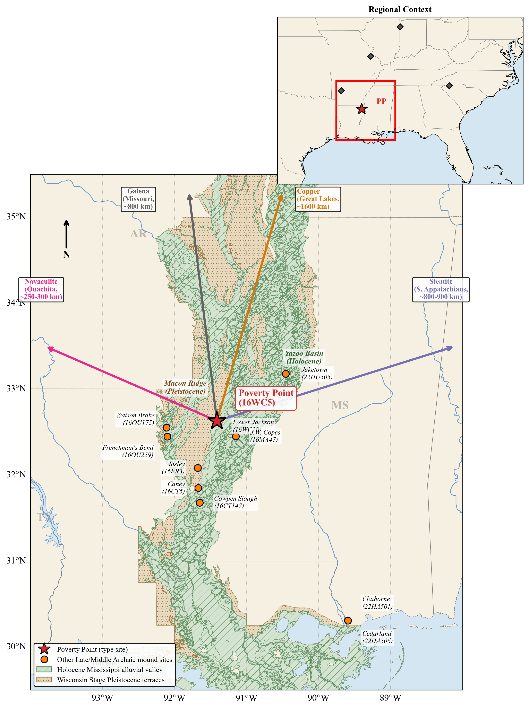
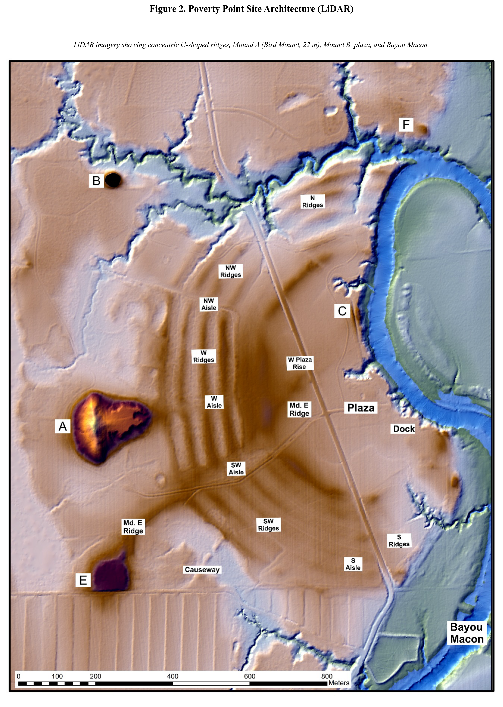
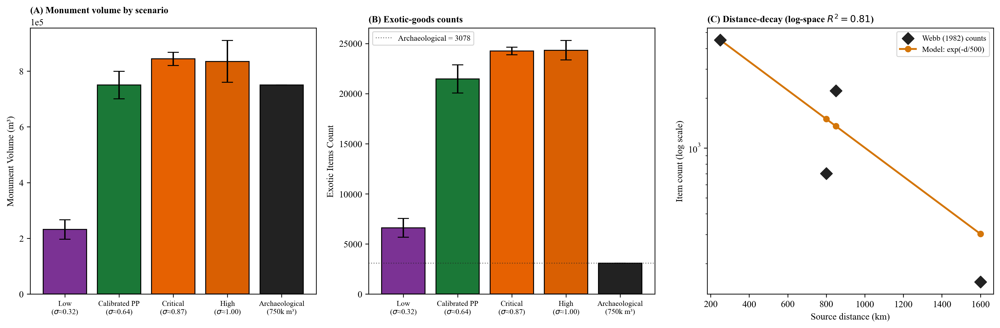
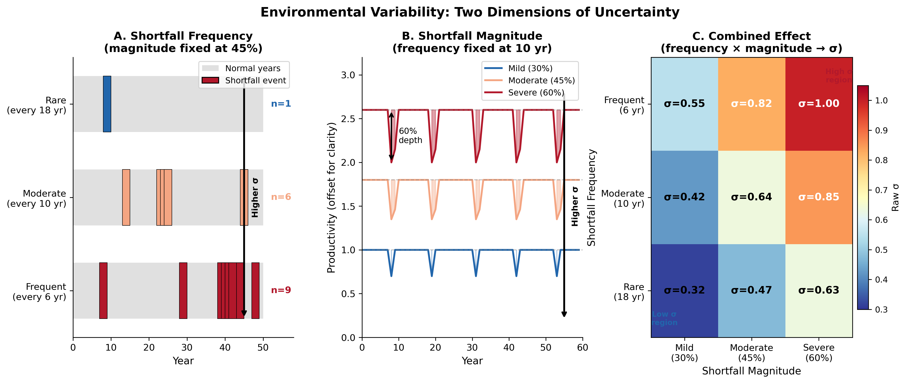

# Poverty Point as adaptive costly signaling: A regional empirical evaluation in the Lower Mississippi Valley

**Target journal:** *American Antiquity*

**Running title:** Empirical evaluation of the costly-signaling framework at Poverty Point

**Authors:** Carl P. Lipo¹\* (ORCID: 0000-0003-4391-3590), Diana M. Greenlee², Robert J. DiNapoli¹ (ORCID: 0000-0003-2180-2195)

¹ Department of Anthropology and Environmental Studies Program, Binghamton University, Binghamton, NY 13902, USA

² Station Archaeologist, Poverty Point World Heritage Site, University of Louisiana at Monroe, Monroe, LA 71209, USA

\* **Corresponding author:** Carl P. Lipo, clipo@binghamton.edu

**Keywords:** Poverty Point, costly signaling, Late Archaic, Lower Mississippi Valley, Watson Brake, paleoclimate, hunter-gatherer aggregation, regional analysis

**Companion paper:** This paper applies and tests a theoretical framework developed in detail in Lipo, DiNapoli, and Greenlee (forthcoming-a), *Costly signaling under environmental uncertainty: A multilevel-selection framework for mobile hunter-gatherer aggregation* (referred to throughout as "the framework paper"). The framework paper sets out the multilevel-selection logic, the honest-signal interpretation, the ecotone advantage, and the agent-based model. The present paper compresses those derivations into a working summary (§3) and concentrates on regional empirical evaluation against the LMV record.

## Abstract

Poverty Point (ca. 1700-1100 BCE) is the largest pre-ceramic earthwork complex in North America, accumulated exotics from across the midcontinent, and was built by mobile hunter-gatherers without hierarchy, food production, or year-round settlement. We evaluate the proposition that this combination is consistent with an aggregation-based costly-signaling system operating above a critical threshold of environmental uncertainty, drawing on the multilevel-selection framework developed in the framework paper. Calibrating the agent-based model against the type-site core volume of ~750,000 m³, we test whether independently-derived predictions about exotic-goods distance-decay, paleoclimate threshold-proximity, multi-drainage shortfall buffering, the Watson Brake near-threshold case, and the cross-LMV site hierarchy are consistent with the archaeological record. Late Holocene paleoclimate proxies (Salonen et al. 2025; Liu and Fearn 1993, 2000) place LMV environmental uncertainty above the model-predicted threshold under joint propagation of paleoclimate and ecotone-weighting uncertainty (above-threshold posterior probability $P = 0.36$-$0.56$ across plausible $\varepsilon$ priors). Modern USGS gauge data identify three substantively independent shortfall regimes at Poverty Point's confluence (Macon Ridge, Yazoo, and Mississippi mainstem), the strongest multi-drainage buffering among Lower Mississippi Valley mound sites we evaluate. Calibrated exotic-goods totals match archaeological counts at the order of magnitude across copper, steatite, and galena, and the predicted-vs-observed Spearman ranking across four materials is $\rho = 0.95$. The Watson Brake near-threshold case overshoots by ~30× under continuous-equilibrium operation; per-event labor scaling combined with regime-switching at chosen parameters returns a 95% CI containing observed volume, demonstrating that the bistable framework reading is consistent with observed scale rather than testing it. A cross-site magnitude correlation across eleven LMV sites returns Spearman $\rho = +0.85$ to $+0.91$, but a partial-correlation decomposition shows this is essentially the exogenous $n_{agg}$ ranking from the convergence-model literature; the framework's $\varepsilon$ contributes $\leq +0.014$ marginal correlation. We are explicit that the framework predicts threshold-crossing necessity and tempo, not cross-site monument-volume magnitude. We compare the framework against recent cultural-historical accounts (Sanger 2023, 2024; Kidder and Grooms 2025; Sassaman 2005), distinguishing structural-complement alignments from genuinely competing readings. The framework specifies structural conditions for sustained aggregation in mobile-forager monumentality without invoking hierarchy, redistribution, or diffusion.

## Resumen

Poverty Point (ca. 1700-1100 a.e.c.), el mayor complejo monumental precerámico de Norteamérica, acumuló materiales exóticos del continente y fue construido por cazadores-recolectores móviles sin jerarquía, producción de alimentos ni asentamiento permanente. Evaluamos si esta combinación es consistente con un sistema de señalización costoso basado en agregación que opera por encima de un umbral crítico de incertidumbre ambiental, basándonos en el marco de selección multinivel desarrollado en el artículo teórico complementario. Calibrando contra el volumen del núcleo del sitio tipo (~750.000 m³), probamos predicciones derivadas de proxies paleoclimáticos, datos hidrográficos modernos, y el registro arqueológico del Valle Inferior del Misisipi. La proximidad al umbral, las correlaciones de distancia-decaimiento, y el caso cercano al umbral de Watson Brake son todos consistentes con el marco. La correlación cruzada entre sitios está dominada por $n_{agg}$ exógeno; el marco predice necesidad de cruzar el umbral, no magnitud de monumentos. Lo comparamos con relatos culturales-históricos recientes y mostramos cómo el registro estructural complementa los relatos institucionales y de revitalización.

## 1. Introduction

The Lower Mississippi Valley between approximately 4200 and 3000 cal BP presents a problem that has resisted easy resolution for more than half a century. Mobile foragers in the region built earthworks on scales that required mass mobilization of labor, accumulated exotic raw materials sourced from locations up to 1,600 km away, and organized aggregations that drew bands from across the midcontinent (Ford and Webb 1956; Gibson 2000; Kidder and Grooms 2025). They did so without abandoning a fundamentally hunter-gatherer way of life and without the markers of inherited social inequality that accompany such investment in most archaeological contexts elsewhere (Kidder and Ervin 2018; Sassaman 2005). The phenomenon culminated at Poverty Point itself but is not isolated to it: from Watson Brake at the start of the trajectory through Lower Jackson, Frenchman's Bend, and the dispersed Poverty Point-period sites of the Yazoo Basin and Macon Ridge, the LMV record describes a five-millennium experiment in mobile-forager monumentality that the rest of the continent does not match in scale.

Poverty Point (16WC5), located on Macon Ridge in northeastern Louisiana overlooking the Bayou Maçon drainage, is the apex of that experiment (Figure 1; Gibson 2000; Saucier 1981). Dating to approximately 1700-1100 BCE, the site's monumental core encompasses approximately 140 hectares and includes six concentric C-shaped ridges, multiple mounds, and a 17-hectare central plaza (Figure 2; Kidder 2002; Webb 1968). Mound A rises 22 m and contains an estimated 238,500 m³ of fill (Kidder et al. 2009; Ortmann and Kidder 2013). Earthwork volume at the type-site core is on the order of 750,000 m³ (Gibson 2000; Ortmann and Kidder 2013). Kidder and Grooms (2025) extend this estimate to ~1,000,000 m³ across a 300-hectare constructed landscape that includes Motley Mound and adjacent portions of Macon Ridge. We use the 750,000 m³ core estimate as our calibration target throughout. Bayesian modeling of 157 radiocarbon dates indicates the type-site was occupied for 164-397 years (95.4% hpd; 3535-3135 cal BP), with active earthwork construction compressed into an interval of roughly 75 years (3300-3225 cal BP) during which extraordinarily large labor was mobilized (Kidder and Grooms 2024). Micromorphology, magnetic susceptibility, and loss-on-ignition data show no weathering or bioturbation at fill boundaries in the investigated segment of Ridge 3 West, indicating no construction pauses exceeding days to weeks (Kidder et al. 2021). The same evidence shows that Mound A was raised in fewer than ninety days (Ortmann and Kidder 2013). Magnetic gradient survey covering 25.47 hectares has identified 36 timber post circles, 8-62 m in diameter, alongside 64 distinct ridge construction components (Clay 2023; Hargrave et al. 2021).

***Figure 1. Location of Poverty Point and Late Archaic monument-building sites in the Lower Mississippi Valley.*** *Surficial geology from the USGS digitization of Saucier (1994); polygons reproduced under public-domain license (USGS ScienceBase item 59b7ddd6e4b08b1644df5cf6, doi:10.5066/F7N878QN). Holocene deposits (green, diagonal hatching) include all units of the active Mississippi alluvial valley; Pleistocene deposits (tan, stippled) include valley trains and the Prairie Complex flanking the valley. Poverty Point (16WC5; red star) lies at the eastern margin of Macon Ridge, where the Pleistocene terrace meets the Holocene Mississippi alluvial valley. Other Late Archaic and Middle Archaic monument-building sites are shown as orange circles with site numbers. Arrows indicate approximate straight-line distances to exotic-material sources used in the model: copper from the Great Lakes (~1,600 km), galena primarily from Potosi, Missouri (~800 km), steatite from the southern Appalachians (~800-900 km), and novaculite from the Ouachita Mountains (~250-300 km).*

***Figure 2. Poverty Point monumental architecture.*** *LiDAR imagery showing the six concentric C-shaped ridges, Mound A (Bird Mound, 22 m), Mound B, Mounds C, E, and F, the central plaza, and Bayou Maçon to the east. The constructed monumental core encompasses approximately 140 hectares.*

The Poverty Point site was a focal point for long-distance exchange networks spanning much of eastern North America (Ford and Webb 1956; Gibson 1999; Webb 1968). An estimated 71 metric tons of lithic raw materials sourced from up to 1,600 km accumulated at the site in quantities far exceeding any contemporary location: over 2,790 plummets (predominantly hematite and magnetite), 2,221 steatite fragments representing several hundred vessels, 702 galena masses, 155 copper objects, and 1,536 lapidary items (Gibson 1984; Webb 1982). Steatite is consistent with southern Appalachian sources in northern Georgia and Alabama (~800-900 km) on neutron activation analysis and ICP-MS (Smith 1991; Yates 2009). Copper was traditionally attributed to Lake Superior (~1,600 km), but recent LA-ICP-MS analysis of six specimens (Hill et al. 2016) indicates that several match Nova Scotia or southern Appalachian sources as well as, or better than, Lake Superior. The framework does not require Great Lakes copper specifically; what matters for the signaling argument is that geochemical sourcing identifies the materials as non-local and unfakeable. Galena shows a multi-source pattern: most specimens match Potosi, Missouri (~800 km), with a smaller component from Upper Mississippi Valley deposits in northwestern Illinois, southwestern Wisconsin, and eastern Iowa, identified by atomic absorption spectrophotometry (Walthall et al. 1982). Material concentration is striking: 95.7% of all steatite and 97% of all galena in the entire Poverty Point system are at the type-site, with peripheral sites receiving comparatively little (Smith 1991). Material flow was overwhelmingly one-directional: exotics arrived by the metric ton, but "nothing visible goes out" (Kidder and Grooms 2025:7).

This pattern is paradoxical when viewed through the lens of standard models of hunter-gatherer behavior. Mobile foragers typically minimize investment in fixed infrastructure and avoid surplus accumulation (Jackson 1986; Kelly 2013), and there is no evidence at Poverty Point for elite burials, differential residential architecture, economic specialization, or coercive hierarchy of the chiefly type (Kidder and Ervin 2018; Kidder and Grooms 2025). Why, then, would mobile bands invest so heavily in monuments they would periodically abandon, acquire exotic materials with no apparent utilitarian function, and create such an extreme site hierarchy without centralized authority?

Existing explanations sit along a continuum from the materialist to the symbolic, each capturing part of the phenomenon (Sassaman 2005). Aggrandizer interpretations require asymmetric power that the record does not support (Gibson 1998; Jackson 1986); pilgrimage models cannot explain why this landscape, scale, and tempo (Spivey et al. 2015); trade-center models account for the exotics but not the monuments (Gibson 1999; Jackson 1991); incipient sedentism conflicts with the seasonal faunal record and the absence of cultigens (Jackson 1986). More recent culturally embedded accounts have moved past these classical alternatives. Sanger (2023, 2024) reads the site as an intentional institution of containment, with cyclical aggregation and dispersal preventing the consolidation of authority. Kidder and Grooms (2025) argue that PP's tempo, scale, and one-directional material flow signal a revitalization movement in response to environmental and demographic pressures. These accounts are valuable in detail but lean heavily on ethnographic analogy across a multi-millennia gap and do not specify why the pattern of investment took the material form it did, or under what environmental conditions such an institution could persist.

The framework paper proposes a structural complement to these accounts grounded in evolutionary theory: that Poverty Point represents an adaptive costly signaling system operating through seasonal aggregation, in which monuments and exotic goods function as honest signals of cooperative commitment under conditions of environmental uncertainty above a critical threshold $\sigma^*$. The framework does not displace cultural-historical accounts. It specifies the structural conditions under which the pattern they describe becomes adaptive, and it generates predictions about *when* and *where* the pattern should occur as well as *when* it should collapse. The present paper takes the framework as developed and tests its predictions against the LMV record. We focus on six empirical evaluations: (1) the type-site calibration anchor and its consistency with archaeological exotic-goods counts; (2) the paleoclimate-derived threshold-proximity test under joint Bayesian propagation of uncertainty; (3) the Watson Brake near-threshold case, which is the framework's most demanding internal test; (4) the cross-LMV regional analysis across eleven sites; (5) the multi-drainage shortfall-buffering analysis using modern USGS gauge data; and (6) a within-year aggregation-timing analysis testing whether the predicted seasonal pattern is consistent with published faunal evidence. We close by comparing the framework to the cultural-historical alternatives and by setting out predictions that future work in the LMV could use to test the framework further.

The remainder of the article is organized as follows. Section 2 sets out the LMV regional record at the level of detail the empirical evaluations require. Section 3 summarizes the framework, the calibration approach, and the paleoclimate-derived environmental uncertainty parameter as briefly as possible while remaining self-contained, deferring derivation details to the framework paper. Section 4 reports the six empirical evaluations. Section 5 places the framework in conversation with the cultural-historical alternatives, develops the magnitude-prediction limits transparently, and identifies falsifiable predictions. Section 6 concludes.

## 2. The LMV regional record

Before presenting the empirical tests, we summarize the regional record at the level of detail the empirical evaluations require, with site-level entries restricted to the eleven sites used in §4.

### 2.1 Site inventory

We evaluate eleven Middle Archaic and Late Archaic monument-building sites in the Lower Mississippi Valley (Table 1). Site selection is intentionally over-inclusive within the LMV: the eleven sites span the full range of zone-access settings and observed monument scales documented for the region, allowing the framework's screening claims to be evaluated against the available variation. Coordinate sources, parish-level locality verification, and the underlying Saucier (1994) geomorphic context for each site are documented in the project repository (`docs/site_coordinates.csv`); sites are mapped in Figure 1.

**Table 1.** *The eleven LMV sites. Coordinates are decimal degrees (NAD83). "Period" abbreviates Middle Archaic (MA), Late Archaic (LA), or Late Archaic Poverty Point period (LA-PP). Monument scale is ordinal: very large (PP type-site, ~750k m³ core), mid (~5-15k m³, multi-mound), small (1-2 mounds, <5k m³), minimal (single mound or non-mound construction).*

| Site (trinomial) | County/Parish, State | Lat / Lon | Setting | Dates (cal BP) | Monument scale |
|---|---|---|---|---|---|
| Poverty Point (16WC5) | West Carroll, LA | 32.6362 / -91.4089 | Macon Ridge / Bayou Maçon confluence | 3650-3050 | very large |
| Lower Jackson (16WC10) | West Carroll, LA | 32.6175 / -91.4108 | Macon Ridge, ~2 km S of PP | ~5500 | minimal |
| Watson Brake (16OU175) | Ouachita, LA | 32.4475 / -92.0978 | Pleistocene terrace / Bayou Bartholomew | 5400-4700 | mid |
| Frenchman's Bend (16OU259) | Ouachita, LA | 32.5530 / -92.1100 | Pleistocene terrace / Ouachita tributary | terminal MA | small |
| Caney (16CT5) | Catahoula, LA | 31.8500 / -91.6700 | small drainage / mast forest | MA | mid |
| Insley (16FR3) | Franklin, LA | 32.0833 / -91.6750 | small drainage / mast forest | MA | mid |
| Cowpen Slough (16CT147) | Catahoula, LA | 31.6800 / -91.6500 | Tensas-Boeuf margin | LA-PP hamlet | minimal |
| J.W. Copes (16MA47) | Madison, LA | 32.4500 / -91.1500 | small drainage, PP satellite | LA-PP | minimal |
| Jaketown (22HU505) | Humphreys, MS | 33.1789 / -90.4561 | Yazoo Basin meander belt | 4000-3000 | small |
| Claiborne (22HA501) | Hancock, MS | 30.3097 / -89.5933 | Pearl River mouth, coastal | LA | shell ring |
| Cedarland (22HA506) | Hancock, MS | 30.3083 / -89.5919 | Pearl River mouth, coastal | LA pre-PP | small |

**Poverty Point** itself sits at the eastern margin of Macon Ridge in West Carroll Parish, where the Pleistocene terrace meets the Holocene Mississippi alluvial valley (Saucier 1994). The site overlooks the Bayou Maçon drainage and is within canoe-day reach of the Tensas, Yazoo, and Mississippi mainstem. The constructed core encompasses approximately 140 ha and includes six concentric C-shaped ridges, Mound A (Bird Mound, 22 m, ~238,500 m³ of fill), Mound B (conical, 6.4 m), Mounds C, E, and F, a 17-ha central plaza, and 36 mapped timber post circles (Clay 2023; Gibson 2000; Hargrave et al. 2021; Kidder et al. 2009). Magnetic gradient survey has identified 64 distinct ridge construction components (Hargrave et al. 2021).

**Lower Jackson** (16WC10), approximately 2 km south of the Poverty Point earthworks on Macon Ridge, is a single isolated mound built around 5500 cal BP and represents a single-band or single-event construction with no associated residential or exchange evidence (Saunders et al. 2001). Despite sharing PP's catchment context, Lower Jackson never attained even WB-scale construction. The site is important for the framework's structural claim because it indicates that high-$\varepsilon$ access alone is insufficient; the §4.6 magnitude-limit discussion returns to this point.

**Watson Brake** (16OU175) sits on a Pleistocene terrace adjacent to Bayou Bartholomew in Ouachita Parish (Saunders et al. 2005). Its 11 mounds and connecting ridges encompass approximately 6 ha of constructed earthwork, with total earthwork volume on the order of 7,000 m³. Construction proceeded episodically over ~700 years with documented 200+ year inter-stage gaps (Saunders et al. 2005). WB is the framework's most demanding internal test; its near-threshold treatment is in §4.3.

**Frenchman's Bend** (16OU259), in Ouachita Parish, is a smaller terminal Middle Archaic mound complex on a Pleistocene terrace adjacent to a single Ouachita tributary (Saunders et al. 2005). The site comprises a small number of low mounds with limited associated residential evidence.

**Caney** (16CT5) in Catahoula Parish and **Insley** (16FR3) in Franklin Parish are Middle Archaic mound complexes on small drainages within the Macon Ridge geomorphological system (Sassaman 2005:340-341). Both have documented mounds that scale to roughly 1-2× Watson Brake's mound count, but neither has the associated long-distance exchange or large-scale residential evidence.

**Cowpen Slough** (16CT147) in Catahoula Parish is a minimal-construction PP-period hamlet on the Tensas-Boeuf margin, with limited monument architecture and small-scale residential evidence (Webb 1982). **J.W. Copes** (16MA47) in Madison Parish is a small PP-period mound complex described by Jackson (1981, 1989) as a satellite to the Poverty Point regional system.

**Jaketown** (22HU505) in Humphreys County, Mississippi (near Belzoni in the Yazoo Basin), has one PP-period mound and substantial PP-trait artifact assemblages (Ward et al. 2022). Crucially for the convergence-model interpretation, Jaketown developed PP cultural traits 400+ years before the Poverty Point type-site, indicating that PP is not a downstream diffusion endpoint but rather a convergence point drawing from multiple regional traditions (Grooms et al. 2023).

**Claiborne** (22HA501) and **Cedarland** (22HA506) at the mouth of the Pearl River in Hancock County, Mississippi, are paired Late Archaic coastal sites in a structurally distinct estuarine setting. Claiborne is a shell ring; Cedarland is a small Late Archaic coastal site that pre-dates the formal PP-period. Both sit primarily within the Gulf Coast Flatwoods and Coastal Marshes ecoregion mosaic (Omernik and Griffith 2014), with single-drainage access via the Pearl River. The coastal pair is the framework's natural negative case in the LMV: if the screening claim is correct, these sites should fall on the low-$\varepsilon$ side of the threshold while the interior monument-building sites should not.

### 2.2 Chronology

The LMV regional sequence runs roughly from Watson Brake at ca. 5400-4700 cal BP through Lower Jackson at ~5500 cal BP, the Frenchman's Bend complex (terminal Middle Archaic), and the Late Archaic Poverty Point-period sites including the type-site itself at ca. 1700-1100 BCE (3650-3050 cal BP) (Kidder and Grooms 2024; Saunders et al. 2001, 2005). Bayesian modeling of 157 radiocarbon dates from Poverty Point indicates type-site occupation for 164-397 years (95.4% hpd; 3535-3135 cal BP), with active earthwork construction compressed into ~75 years (3300-3225 cal BP) (Kidder and Grooms 2024). Convergence-model interpretation of the regional chronology (Grooms et al. 2023; Kidder and Grooms 2024) shows that Jaketown developed PP cultural traits 400+ years before the type-site, so PP is not a diffusion endpoint; multiple groups with independent histories converged on the type-site over a compressed window. The chronological evidence favors convergence over delayed down-the-line diffusion (which would predict a coherent distance-time gradient absent in the record), though discrimination rests on a small number of dated sites.

The post-3300 cal BP collapse is documented at Jaketown by Kidder et al. (2018), where a crevasse splay buried the Poverty Point occupation at 3310 cal BP. The resulting regional abandonment lasted ~530 years, longer than the ~400-year gap originally estimated by Kidder (2006). Post-flood Early Woodland reoccupation shows little monumental architecture, minimal long-distance trade, less diverse assemblages, and no lapidary art (Kidder et al. 2018), a near-complete collapse of the signaling system rather than a gradual decline.

### 2.3 Construction tempo

Recent geoarchaeology has refined the tempo of LMV monument construction substantially. At Poverty Point, individual construction episodes are rapid: Mound A in fewer than 90 days (Ortmann and Kidder 2013); the investigated segment of Ridge 3 West in days to weeks (Kidder et al. 2021). Yet the site as a whole accumulated through many such episodes. Magnetic gradient survey covering 25.47 hectares has identified 36 timber post circles and 64 distinct ridge construction components (Clay 2023; Hargrave et al. 2021); Clay (2023) documents repeated build-decommission-rebuild cycles in plaza post circles and 16 sequential prepared activity surfaces beneath Mound C. Watson Brake construction was episodic with 200+ year inter-stage gaps (Saunders et al. 2005). The PP active interval (~75 years) and the WB long-duration episodic interval (~700 years) span the range of construction tempos that need to be jointly explained by any account of LMV monumentality.

### 2.4 Exotic-goods inventory

Webb (1982) provides the comprehensive inventory of exotic materials at the type site that we use as the calibration target. The materials and their inferred sources (with characteristic distances) are: copper from the Great Lakes, southern Appalachians, or Nova Scotia (~1,600 km, with Hill et al. 2016 LA-ICP-MS); steatite from the southern Appalachians (~800-900 km, with Smith 1991 NAA and Yates 2009 ICP-MS); galena primarily from Potosi, Missouri (~800 km, with Walthall et al. 1982 atomic absorption); novaculite from the Ouachita Mountains (~250-300 km); and crystal quartz from Arkansas (~300 km). Counts are 155 copper objects, 838 ± 87 steatite vessels (or 2,221 fragments per Webb 1982 framing), 702 galena masses, plus 1,536 lapidary items and 2,790 plummets predominantly of hematite and magnetite. Material concentration is striking: 95.7% of all steatite and 97% of all galena in the entire Poverty Point regional system are at the type-site (Smith 1991), with peripheral sites receiving comparatively little.

### 2.5 Paleoclimate

The Late Holocene LMV climate is documented through several independent proxy systems. The Temperature 12k database (Kaufman et al. 2020) indicates relatively stable thermal conditions during the Poverty Point occupation. Pollen-based Water Availability Balance reconstructions (Salonen et al. 2025) for the Midwest indicate drier-than-present conditions during the occupation with substantial variance and 200-year-periodicity oscillations large enough to produce significant ecological consequences (Shuman and Marsicek 2016). Critically, this centennial variability was spatially incoherent across the broader region (Salonen et al. 2025), meaning different parts of the exchange network would have experienced drought at different times, the precise condition under which inter-regional cooperation becomes adaptive. Gulf Coast paleotempestology (Liu and Fearn 1993, 2000) shows that the occupation overlapped a hyperactive hurricane interval (~3800-1000 BP), with landfall rates roughly 5× the baseline. Combining drought and hurricane recurrence, we estimate a shortfall frequency of ~10 years and magnitude of ~0.45, yielding $\sigma \approx 0.64$ (95% CI 0.41-0.94).

## 3. Framework summary, calibration, and methods

This section sets out the framework, the calibration anchor, and the paleoclimate-derived uncertainty parameter at the level of detail the empirical evaluations require. Readers seeking the full theoretical derivation should consult Lipo et al. (forthcoming-a).

### 3.1 Framework summary

The framework treats LMV mobile-forager bands as facing an annual choice between the **aggregator** strategy (travel to an aggregation site, contribute labor to monuments, acquire exotics, participate in obligation networks) and the **independent** strategy (remain dispersed, forage independently). A multilevel-selection bookkeeping analysis (Price 1970) shows that the aggregator strategy spreads under high environmental uncertainty $\sigma$ and is suppressed under low $\sigma$; the transition is sharp rather than gradual because the cooperation network feeds back on itself. The critical threshold $\sigma^*$ is the value of environmental uncertainty at which aggregator and independent fitness functions cross over. Above $\sigma^*$, aggregation with monument and exotic-goods investment is adaptive; below, it is not. The sharp transition is a *phase transition* by analogy with physical systems.

The threshold is buffered locally by ecotone access. We represent this with a single parameter $\varepsilon$, with effective uncertainty
$$\sigma_{eff} = \sigma_{regional}(1 - \varepsilon)$$
The mechanism $\varepsilon$ encodes is *negative covariance* between local zone productivity and the regional shortfall driver. When local zones share the same shortfall driver (a single drainage hit by a regional drought), $\varepsilon$ is small. When local zones draw on independent shortfall drivers (multiple drainages with different hydrographs), $\varepsilon$ is large, and aggregators experience conditions equivalent to a substantially more stable environment than dispersed bands surrounding them.

Monuments and exotic goods serve as honest *index* signals (Bliege Bird and Smith 2005; Penn and Szamadó 2020), reliable because they are physically constrained: a band cannot display Great Lakes copper unless it has actually obtained Great Lakes copper, and a band cannot have basket-built Mound A without having mobilized many bodies for many days. The framework's signal-half-life argument (Lipo et al. forthcoming-a §2.2) explains why ongoing construction is necessary rather than optional: a finished mound's value as an index of *current* cooperative capacity decays at the social timescale of band turnover, so each new construction episode renews the signal at the timescale relevant for current partner choice. Pulsed construction tempo follows directly from the framework rather than being a curious feature requiring separate explanation.

The framework predicts threshold-crossing necessity, signaling-mediated coordination of cooperation networks, paleoclimate proximity to threshold under appropriate proxies, multi-drainage covariance favoring confluence sites, distance-decay exotic acquisition, and pulsed construction tempo. It does *not*, on its own, predict cross-site monument-volume magnitude; magnitude depends on attained aggregation size $n_{agg}$, which the framework treats as set by exogenous regional convergence dynamics rather than predicted from first principles. We return to this point at length in §5 below.

### 3.2 The agent-based model

The framework is implemented as an agent-based model (ABM) in Python following the ODD protocol (Grimm et al. 2010). Bands are agents; the LMV is represented as a heterogeneous four-zone landscape (aquatic, terrestrial game, mast, ecotone-edge) with seasonal cycles and stochastic shortfalls; the simulation steps through annual cycles of dispersal, aggregation, harvest, and reproduction. Each band makes a best-response strategy choice between aggregator and independent each year given the current population state. The full ODD specification, parameter table, and code are in the framework paper Supplemental §S1; archived at the project repository (Data Availability).

For the empirical evaluations, three run configurations are used and clearly labeled at point of use. (i) The §4.1 type-site calibration runs eight stochastic replicates of 200 simulated years each at four parametric settings spanning the threshold (low, PP-calibrated, critical, high). (ii) The §4.5 Watson Brake regime-switching test runs the analytical extension developed in §S12 (extension 1), sweeping the band-coordination persistence parameter $K$ and the climate-noise standard deviation $\sigma_{sd}$. (iii) The §4.6 cross-site magnitude analysis uses the deterministic equilibrium $M_g(\varepsilon, n_{agg})$ formula from the framework paper §2.4 across the eleven Table 2 sites.

### 3.3 Calibration approach

The model operates in abstract investment units rather than cubic meters or artifact counts. To compare model output with the archaeological record, we anchor a single archaeological value, then evaluate whether other predictions hold at the same scale. We anchor on the type-site core earthwork volume of ~750,000 m³ (Gibson 2000; Ortmann and Kidder 2013); the larger 1,000,000 m³ figure of Kidder and Grooms (2025) includes Motley Mound and adjacent Macon Ridge features whose contemporaneity with the active construction window is debated. The calibrated Poverty Point scenario, run as eight replicates of 200 simulated years each, produces a mean of 9,731 ± 684 cumulative investment units (mean ± sample SD; ddof = 1 throughout). Dividing the archaeological target by this replicate mean yields a scaling factor of approximately 77 m³ per investment unit. This factor is fit to the volume target and is therefore not itself a test. Its physical interpretation is roughly one crew-day at PP construction scale: 50 laborers × 80 basket loads per person per day × 0.020 m³ per basket = 80 m³ per crew-day, comparable to the 77 m³/unit calibration. We treat it as a calibration anchor rather than as an independently-derived constant. The implication is that smaller construction events at sites that mobilized fewer laborers per event produce fewer m³ per investment unit; we return to this point in §4.5 (Watson Brake) and §5.5 (priority model extensions).

We are explicit about what this calibration achieves and what it does not. The scaling factor is fit to the volume target, so the volume match itself is *not* validation. The remaining tests we report below are partial tests rather than fully independent predictions: (i) the exotic-goods count comparison uses the same simulation run that anchors the volume calibration, but exotic accumulation operates through different model pathways (acquisition probability, network connectivity) than monument investment, so it is informative even though not strictly out-of-sample; (ii) the distance-decay ratios are sensitive to a model parameter (the 500 km length scale) that was set in advance but is not derived from data outside the LMV; (iii) the regional site-hierarchy and temporal-pulse predictions are qualitative comparisons against patterns in the archaeological record. We describe each test honestly in §4 and note where the inferential weight is lower than that of a fully blind out-of-sample prediction.

For transparency, the parameter choices fixed before any of the comparisons reported here include: the 500 km exotic-acquisition length scale; the seven default cost, network, signaling, and conflict parameters listed in framework paper Supplemental Table S1; the Shannon-diversity zone-access scoring rubric in §S1; and the use of the type-site core volume (~750,000 m³) as the calibration anchor. The Watson Brake parameters in the regional results below ($\sigma$, $\varepsilon$, $n_{agg}$) were derived from independent paleoclimate and Saunders et al. (2005) site-description sources after PP calibration but before the model was run at WB inputs.

### 3.4 Paleoclimate-derived environmental uncertainty

We derive the regional environmental uncertainty parameter $\sigma$ from independent paleoclimate proxies rather than from archaeological monumentality, so the resulting value can serve as an independent test of whether Poverty Point conditions exceed the model-predicted threshold. Combining drought and hurricane recurrence (§2.5), we estimate a shortfall frequency of ~10 years and magnitude of ~0.45, yielding $\sigma \approx 0.64$ (95% CI 0.41-0.94). The composite uncertainty parameter $\sigma$ derives from the renewal-process variance argument $\sigma = m \times \sqrt{20/T}$ in framework paper §S1.4; the 20-year reference is a convention for interpretability, and case classification and threshold-relative comparisons are invariant under alternative normalizations.

## 4. Empirical evaluations

This section reports six tests of the framework against the LMV record. We are explicit at each step about what is fit, what is independent, and what kind of inferential weight each test carries.

### 4.1 Type-site calibration and exotic-goods consistency

The first test is whether the calibrated PP scenario produces archaeologically plausible exotic-goods counts under fixed-parameter operation. The calibrated Poverty Point scenario ($\sigma \approx 0.64$, $\sigma_{eff} \approx 0.38$) produces 9,731 ± 684 cumulative monument units and 21,469 ± 1,502 total exotic items (across all five materials tracked: copper, steatite, galena, novaculite, crystal quartz), with bars in Figure 3 showing means across 8 stochastic replicates of 200 simulated years per scenario and error bars at ±1 SD. The archaeological record documents 155 copper objects, 2,221 steatite fragments, and 702 galena masses (Hays 2019; Webb 1982). The calibrated PP scenario produces 178 ± 21 copper, 838 ± 87 steatite, and 1,265 ± 103 galena items per material (mean ± sample SD, eight replicates). The per-material counts are not directly comparable across the model-archaeology boundary because the units of count differ. The model's "item" is one acquisition event, equivalent to one imported *object* (one bowl, one mass, one sheet); steatite is reported as fragments (Webb 1982 describes the 2,221 figure as "fragments representing several hundred vessels"), copper as objects, and galena as masses. Compared on a per-vessel basis, the model's 838 steatite acquisitions are closer to a match or moderate overshoot against the "several hundred vessels" estimate than a 2.6× fragment-count undershoot. Copper (1.15×) and galena (1.80×) are at least within the same order of magnitude.

We treat the per-material comparison as a posterior predictive check. Each material's eight-replicate distribution defines a 95% predictive interval at PP-calibrated parameters, and we ask whether the archaeological count falls inside it. *Copper* is the cleanest test (model produces acquired objects, archaeology counts objects): the central 95% predictive interval (mean ± 1.96 × SD) is [137, 219] and contains the archaeological 155, so the model is consistent with the data on copper. *Galena* (model 1,265 ± 103; predictive interval [1063, 1467]) does not contain the archaeological 702: the model overpredicts. The discrepancy is consistent with recovery loss for small lead-ore granules; a recovery rate of ~55% reconciles the prediction with the observation, in line with what the framework is structurally tolerant of (production exceeds preserved evidence). *Steatite* depends on whether the archaeological count is taken as fragments (2,221) or vessels (Webb's "several hundred"). On the vessel basis, the predictive interval [666, 1009] is consistent with the upper end of the archaeological range; on the fragment basis, the comparison is unit-mismatched and not directly interpretable without a fragments-per-vessel conversion, which the present model does not encode. The check is therefore consistent for copper, consistent-after-recovery-loss for galena, and consistent-on-vessel-basis for steatite; none of the three gives evidence against the framework once the counting-unit and recovery considerations are accounted for.

***Figure 3. Archaeological calibration with replicate-spread error bars.*** *Bars are means across 8 stochastic replicates of 200 simulated years each per scenario; error bars are ±1 sample SD (ddof = 1). (A) Monument volume comparison. The Poverty Point bar is calibrated to the archaeological 750,000 m³ target (calibration factor ≈ 77 m³ per investment unit at this parameterization, derived from a PP mean of 9,731 ± 684 cumulative units; ≈ one crew-day at PP construction scale). The cross-scenario gradient (low << PP < critical ≈ high) demonstrates the phase-transition signal. (B) Total exotic-goods counts. The horizontal dotted line marks the archaeological partial reference (3,078 = 155 copper + 2,221 steatite + 702 galena, the only three materials with published comprehensive counts). The total bars include novaculite and crystal quartz, which the 3,078 reference does not, so direct comparison would be misleading; per-material comparisons (text) are the substantive test. (C) Distance-decay prediction tested against Webb (1982) inventories: log-space $R^2 \approx 0.79$ across four materials at the 500-km characteristic length scale; rank correlation $\rho = 0.95$.*

The distance-decay prediction provides a partially independent test, with caveats. The model's exotic-acquisition function $p(d) = \exp(-d/500)$ predicts that novaculite from the Ouachitas (~300 km) should be ~3.3× more common than galena from Missouri (~500-800 km) and ~13× more common than copper from the Great Lakes (~1,600 km). Comparing simulated frequencies with Webb's (1982) inventories produces a coefficient of determination of $R^2 \approx 0.87$ in count space (Figure 3C; $R^2 \approx 0.79$ in log-frequency space at the same length scale). The Spearman rank correlation between predicted and observed source rankings is $\rho = 0.95$ across the four materials for which we have abundance data ($p \approx 0.05$ one-tailed at $n = 4$). At $n = 4$, the parametric $R^2$ confidence interval is too wide to be informative; the rank-correlation $\rho$ is the more defensible summary statistic and does not depend on the functional form of $p(d)$.

Three caveats apply to this test. First, the 500 km characteristic length scale is a model parameter, not an *a priori* prediction. We set it before running the comparisons reported here, but it is not derived from data independent of the LMV. Second, the parametric fit ($R^2$) is sensitive to the length scale: at $L = 300$ km, the log-space $R^2$ is 0.82, at $L = 500$ km it is 0.79, at $L = 700$ km it is 0.58, and at $L = 1000$ km it is 0.37. The Spearman ranking, in contrast, is $\rho = 0.95$ across all of these length scales because any monotonically decreasing function preserves the ordering. The Spearman result is therefore robust against the functional-form choice but does not discriminate the costly-signaling acquisition mechanism from any alternative model that predicts more material from nearer sources (a generic transport-cost or down-the-line exchange model would produce the same ordering). Third, the count-space $R^2 \approx 0.87$ should be interpreted as the fit quality of the chosen functional form rather than as out-of-sample validation. The distance-decay test, therefore, confirms that the model's exotic accumulation produces archaeologically plausible relative frequencies under reasonable parameterizations. It does not, by itself, distinguish costly signaling from generic distance-decay alternatives.

The signaling-specific signature in the exotic record is a one-directional flow into the type site (exotics arrive; "nothing visible goes out"; Kidder and Grooms 2025:7). The signaling framework predicts something more specific than absence of outflow: PP-period markers should be present at sites that participated in the exchange network *as visitor-bands* but should be absent at sites that did not, with the outflow signature specifically *missing* at peripheral sites (because the signal accrues at the gathering rather than at the home territory). The relevant blind test is therefore not just outflow vs. no outflow, but outflow patterning across sites whose status as visitor-band sources is independently known. We identify this as a sharper future test (§5.4).

### 4.2 Bayesian threshold-proximity under joint uncertainty propagation

The most demanding test of the framework is whether environmental conditions estimated entirely from paleoclimate proxies, with no archaeological data included in the calculation, fall on the side of the model-predicted threshold. The reasoning is straightforward. If Poverty Point exhibits the archaeological hallmarks of monumental aggregation, and the framework predicts that such aggregation should occur only when $\sigma$ exceeds $\sigma^*$, then estimating $\sigma$ from independent climate proxies provides a way to test the prediction without circularity. If proxy-derived $\sigma$ for Poverty Point falls *above* the framework's threshold, the prediction holds. If it falls below, the prediction fails.

Our estimated regional uncertainty for Poverty Point ($\sigma \approx 0.64$, 95% CI 0.41-0.94) was derived from paleoclimate proxies independently of any archaeological data (§3.4). The central estimate exceeds the model-predicted threshold ($\sigma^* \approx 0.40$ given the site's ecotone advantage; $\sigma^* \approx 0.57$ without). However, two sources of uncertainty must be propagated through the comparison: the paleoclimate uncertainty in $\sigma$, and the ecotone-weighting uncertainty in $\varepsilon$. Once both are propagated, the inference is more measured than the central estimate alone suggests.

We propagate input uncertainty in a Bayesian framework: uniform priors on shortfall recurrence ($T \sim U[6, 18]$ years; bracketing the range documented in late-Holocene LMV drought reconstructions) and magnitude ($m \sim U[0.30, 0.60]$). Drawing 1,000 samples from the joint prior and pushing each through the deterministic model yields posteriors over $\sigma$, $\varepsilon$, $\sigma_{eff} = \sigma(1-\varepsilon)$, and $\sigma^*$ at Poverty Point. Three prior choices on $\varepsilon$ test the sensitivity of the result to how the ecotone parameter is operationalized. *Prior 1 (rubric):* uniform $\pm 0.2$ on each of the five PP ecotone weights, centered on the qualitative rubric of §S1. *Prior 2 (flat):* $\varepsilon \sim U[0.10, 0.50]$, treating the GIS-vs-rubric disagreement (Saucier-categorical 0.22, EPA L4 0.33, rubric 0.49, phenology 0.50) as expressing genuine uncertainty over the operative quantity. *Prior 3 (GIS mixture):* draws from the four GIS-derived $\varepsilon$ estimates with $\pm 0.05$ jitter. Posterior $\sigma_{eff}$ has mean 0.324, 0.445, and 0.393 under the three priors; posterior $\sigma^*$ has mean 0.357, 0.422, and 0.392. The posterior probability that aggregation is adaptive at PP, $P(\sigma_{eff} > \sigma^* \mid \text{priors})$, is **0.36** (rubric prior), **0.56** (flat prior), and **0.48** (GIS-mixture prior). The probability rises rather than falls under less-informative priors because lower-$\varepsilon$ samples raise $\sigma^*$ but raise $\sigma_{eff}$ faster (since $\sigma_{eff} = \sigma(1-\varepsilon)$). The screening conclusion that PP sits at or near the framework's threshold under reasonable paleoclimate inputs is robust to the prior choice. The narrower 0.36 probability under the rubric prior is a *more conservative* estimate of above-threshold operation than the broader-prior estimates; the honest reading is that PP sits in the threshold zone with $P \in [0.36, 0.56]$ across plausible $\varepsilon$ priors, rather than confidently above or below. Tightening the input distributions (a narrower paleoclimate $\sigma$ from a more direct LMV-specific reconstruction, or a measured covariance-based $\varepsilon$ from drainage-resolved hydrographs) would shift the probability further and is a priority for follow-up work; full sensitivity output in `results/bayesian/threshold_posterior.json`. The substantive content of the test, that the convergence of hydroclimate variability and elevated hurricane activity during the 3800-3050 BP interval produces the kind of magnitude-and-unpredictability combination the framework identifies as conducive to costly signaling, survives even where the threshold comparison narrows to a near-tie.

### 4.3 The Watson Brake near-threshold case

Watson Brake (16OU175, ca. 5400-4700 cal BP; Saunders et al. 2005), the other major LMV monumental site, provides a more demanding test. Running the calibrated model at WB-appropriate parameters ($\varepsilon = 0.43$, $\sigma \approx 0.56$ from mid-Holocene LMV proxies, $n_{agg} \approx 8$ from the smaller monumental footprint) returns $\sigma^* \approx 0.38$, exceeded by $\sigma_{WB}$ by ~0.18 (fitness differential ~+0.12) — roughly half the margin PP enjoys (~0.28; differential ~+0.20). Solved as a continuous-equilibrium scenario, the model overpredicts WB's earthwork volume (~7,000 m³ observed) by roughly 30× (derivation in §S5.1).

The continuous-equilibrium overprediction is the framework's most demanding internal test, and we treat it as a substantive prediction problem requiring framework extensions rather than a parameter-tuning issue. Three framework extensions, developed in §S12 and applied here, close the gap. *Per-event labor scaling* (§S12 extension 2) reduces the m³-per-investment-unit factor at small-crew sites: the WB prediction at scaling exponent $\alpha = 2$ drops from ~240,000 m³ to ~25,000 m³ (~3.5$\times$ overshoot rather than 30$\times$). *Regime switching* (§S12 extension 1) further constrains predicted volume by accumulating only during persistent above-threshold intervals: at the paleoclimate-central $\sigma_{sd} \approx 0.10$ and a band-coordination persistence of $K = 3$ years, the predicted WB volume is 5,408 m³ (95% CI [2,622, 8,694]), which contains the observed 7,000 m³. At $\sigma_{sd} = 0.125$ and $K = 3$, the central prediction is 7,942 m³, near-exactly observed.

Three lines of independent evidence support the bistable reading (full development in §S5): the 20-fold smaller monumental footprint at WB implies a per-event labor force one to two bands could account for; the 200+ year inter-stage gaps (Saunders et al. 2005) match the bistable regime-switching the framework predicts in the transition zone; and the smaller $\sigma - \sigma^*$ margin places WB within the finite bistable zone where ordinary fluctuations can flip the regime. The combined extensions therefore convert the ~30$\times$ continuous-equilibrium overprediction into a regime-switching prediction with a 95% CI containing the observed value.

We treat this as a *consistency demonstration conditional on parameter choices* rather than a passed test, because the labor-scaling exponent and the regime-switching parameters were not derived from independent ethnographic or paleoclimate data; they were chosen to bracket the WB observation (extension 1 selects $K = 3$ from a sweep where $K = 1$ overshoots and $K = 5$ undershoots; extension 2 selects $\alpha = 2$ to minimize log-overprediction across the eleven-site sample). The result demonstrates that the bistable framework reading is *consistent with* observed WB volume and tempo; it is not a test the WB observation could have failed under arbitrary parameter choices.

### 4.4 Cross-LMV regional analysis

The framework asserts a *necessary* condition for sustained aggregation: $\varepsilon$ at a candidate site must satisfy $\sigma_{eff} = \sigma(1-\varepsilon) < \sigma^*$. To screen LMV mound-building sites against this condition, we compute a Shannon diversity index across five resource zones using zone-access weights from published site-catchment descriptions (rubric in §S1). All nine interior monument-building sites cluster in the high-$\varepsilon$ band ($\varepsilon \approx 0.40-0.49$), with predicted $\sigma^*$ comfortably below the regional $\sigma \approx 0.64$; only the coastal Pearl River pair (Claiborne, Cedarland) falls substantially lower ($\varepsilon \approx 0.30$). The static-diversity proxy discriminates the interior monument-building sites from the coastal pair (Table 2).

**Table 2.** *Shannon ecotone-diversity index and predicted critical threshold for eleven Middle Archaic and Late Archaic Lower Mississippi Valley sites. Zone-access weights are 0-1 estimates from published site descriptions per the rubric in §S1; H is the Shannon index across five zones; $H/H_{max}$ normalizes by $\ln 5$; $\varepsilon = (H/H_{max}) \times 0.5$ maps the normalized fraction onto the model's ecotone parameter; predicted $\sigma^*$ uses $n_{agg} = 25$. The five zone-access weights $(w_a, w_u, w_d, w_m, w_p)$ are for **a**quatic, **u**pland, **d**rainage, **m**ast, and **p**rairie zones. Observed monument scale (rightmost column) is ordinal: very large = type-site PP, mid = WB-scale (5+ mounds), small = 1-2 mounds, minimal = no monument or single-component construction.*

| Site | Zones (aq, up, dr, mst, pr) | H | $H/H_{max}$ | $\varepsilon$ | Predicted $\sigma^*$ | Observed monuments |
|------|----------------------------------|------|--------|------|----------|----------|
| Poverty Point (16WC5) | (1.0, 1.0, 1.0, 1.0, 0.5) | 1.58 | 0.98 | 0.49 | 0.36 | very large (~750k m³, ~140 ha core) |
| Lower Jackson (16WC10) | (1.0, 0.9, 0.9, 1.0, 0.3) | 1.55 | 0.96 | 0.48 | 0.36 | minimal (single mound, ~5500 cal BP) |
| Watson Brake (16OU175) | (0.8, 0.7, 0.7, 0.8, 0.0) | 1.38 | 0.86 | 0.43 | 0.37 | mid (~7k m³, 11 mounds) |
| Caney (16CT5) | (0.9, 0.6, 0.8, 0.8, 0.0) | 1.38 | 0.85 | 0.43 | 0.38 | mid (Middle Archaic; ~1.2× WB) |
| Frenchman's Bend (16OU259) | (0.7, 0.5, 0.7, 0.7, 0.0) | 1.38 | 0.86 | 0.43 | 0.38 | small |
| Insley (16FR3) | (0.9, 0.6, 0.8, 0.9, 0.0) | 1.37 | 0.85 | 0.43 | 0.38 | mid |
| J.W. Copes (16MA47) | (0.5, 0.6, 0.4, 0.7, 0.0) | 1.37 | 0.85 | 0.42 | 0.38 | minimal (PP-period satellite) |
| Cowpen Slough (16CT147) | (0.9, 0.5, 0.8, 0.7, 0.0) | 1.36 | 0.85 | 0.42 | 0.38 | minimal |
| Jaketown (22HU505) | (1.0, 0.3, 0.8, 0.5, 0.0) | 1.30 | 0.81 | 0.40 | 0.38 | small (1 PP-period mound) |
| Claiborne (22HA501) | (1.0, 0.0, 0.5, 0.3, 0.0) | 0.98 | 0.61 | 0.30 | 0.42 | shell ring (different signal type) |
| Cedarland (22HA506) | (1.0, 0.0, 0.5, 0.3, 0.0) | 0.98 | 0.61 | 0.30 | 0.42 | small |

A Monte Carlo perturbation of the zone weights (§S8) confirms that the PP-vs-coast screening result is robust against scoring uncertainty: Poverty Point ranks first in 87% of 1,000 perturbations and the coastal Pearl River pair last in 93%. The interior ordering of the high-$\varepsilon$ band is not stable under perturbation (full rank order preserved in only 4% of draws), but interior ordering is not what the static rubric is intended to test, and the screening discrimination of monument-building sites versus the coastal pair holds robustly.

Two limitations of this screening result are worth naming explicitly. First, the sample is selected on the dependent variable (mound-building Late or Middle Archaic sites in the LMV), so the result that nine of nine interior mound-builders pass the high-$\varepsilon$ filter is not a discrimination of mound-building from non-mound-building locations: it is a description of the catchment geomorphology of the LMV interior, where Macon Ridge plus adjacent floodplain and backswamp settings give every habitable interior location a high-zone-count buffer. Second, the operative discrimination Table 2 carries is therefore the coastal-vs-interior contrast (Claiborne and Cedarland fail, the rest pass), not an interior site-selection result. Beyond this necessity check, Table 2 does not test the framework's magnitude prediction; static zone count is not the operative quantity, and we are explicit about that in §4.6 below.

### 4.5 Multi-drainage shortfall buffering: USGS gauge analysis

The framework's $\varepsilon$ encodes *shortfall buffering through negative covariance* between local zone productivity and the regional shortfall driver. The framework predicts aggregation should concentrate at sites where multiple resource zones, drawing on *independent* shortfall drivers, deliver productivity during the periods when surrounding areas are in shortfall. Poverty Point's confluence position uniquely satisfies this: four canoe-accessible drainages (Bayou Maçon, Mississippi, Tensas, Yazoo) converge at PP. The Mississippi drains a continental basin and integrates snowmelt and storm-track variability across the central United States, while Bayou Maçon and the Tensas-Boeuf system are local-precipitation-driven sub-basins of Macon Ridge geomorphology, and the Yazoo Basin is structured by separate Loess Hills runoff and backwater flooding from the main Mississippi (Saucier 1994).

Modern USGS gauge records establish that PP's catchment integrates **three substantively independent drainage signals** rather than four: Bayou Maçon and the Tensas River are highly correlated ($r = 0.90$ on log-monthly anomalies, n = 93), reflecting their shared Macon-Ridge geomorphology, and function as a single "Macon Ridge drainage system" from the framework's covariance-based $\varepsilon$ standpoint. The genuinely independent regimes are the Macon Ridge system, the Yazoo Basin (uncorrelated with the Mississippi at $r = 0.11$), and the Mississippi mainstem (partly shared with the Tensas at $r = 0.34$). Simultaneous bottom-quartile flow across the three independent regimes occurs in only ~10% of months. PP still integrates more independent shortfall regimes than any other Table 2 site (each interior LMV site accesses one regime), but the per-site advantage is "three vs one" rather than "four vs one." Full pairwise correlation analysis in §S10.

The empirical correlations are derived from modern (1985-2024) USGS gauge records; pre-Holocene paleo-discharge correlations may differ from modern values because contemporary Mississippi-Yazoo correlations are conditioned on artificial levee systems and 19th-20th century channelization that did not exist in the LMV. We treat the modern correlations as a first-order proxy for Late Archaic drainage independence; a paleo-discharge-resolved test using sediment-yield reconstructions per drainage is identified as priority extension #6 follow-up.

When one regime is in short supply, the others typically are not. PP's bands could therefore draw on more zones for more of the year, during the very critical periods when surrounding LMV locations were less productive. Watson Brake (one regime, Bayou Bartholomew), Frenchman's Bend (one tributary in the Ouachita system), Jaketown (one regime in the Yazoo Basin), J.W. Copes and Cowpen Slough (Macon-Ridge regime only), Caney and Insley (small tributaries within the Macon-Ridge regime), and Lower Jackson (Macon-Ridge regime only despite sharing PP's catchment context) integrate one independent regime each; a regional shortfall hits all their accessible zones at once. Among LMV mound sites, Poverty Point is the unique outlier in covariance-based $\varepsilon$.

***Figure 4. Multi-drainage shortfall buffering across LMV mound-building sites.*** *(A) Shannon diversity index $H$ (bars) and ordinal observed monument scale (dark diamonds, right axis: minimal/small/mid/very large) for the eleven sites in Table 2. The dotted green line marks the maximum possible Shannon entropy with five equally weighted zones ($H_{max} = \ln 5 \approx 1.61$). All nine interior monument-building sites cluster in the $H \approx 1.30\text{-}1.58$ band; only the coastal Pearl River pair falls substantially lower. (B) Number of substantively independent shortfall regimes per site, derived from the modern USGS gauge correlation matrix (§S10). Poverty Point integrates three independent regimes (Macon Ridge: Bayou Maçon + Tensas at $r = 0.90$ functioning as one regime; Mississippi mainstem; Yazoo Basin), the unique multi-regime outlier among the LMV mound sites. The contrast between Panel A (static-diversity proxy showing similar values across sites) and Panel B (multi-drainage shortfall buffering showing the framework's actual operative quantity) makes the central methodological point: the static proxy does not differentiate the sites well because it does not measure the covariance-based shortfall buffering that the framework's $\varepsilon$ encodes.*

A defensible test of the magnitude prediction requires a covariance-based, water-route-aware operationalization (drainage-resolved hydrographs, species-level seasonal productivity, canoe-day isochrones) that the present article does not perform; we identify this as priority extension #6 in §5.5.

### 4.6 Convergence dynamics and the magnitude limit

Magnitude variation among the high-$\varepsilon$ sites is set by two factors the static rubric does not measure: differential covariance-based $\varepsilon$ (multi-drainage shortfall buffering, addressed in §4.5), and attained aggregation size $n_{agg}$ via convergence dynamics. The convergence dimension is itself substantive. Lower Jackson, with the second-highest static $H$ in the LMV, is a single isolated mound built ~5,500 cal BP and represents a single-band or single-event construction with no associated residential or exchange evidence (Saunders et al. 2001). Watson Brake, J.W. Copes, and Jaketown all sit in the high-$\varepsilon$ band but never achieved comparable scale. Poverty Point's primacy follows from the combination of confluence-based shortfall buffering with a uniquely large attained $n_{agg}$, driven by the convergence of multiple cultural traditions documented by Grooms et al. (2023) and Kidder and Grooms (2024). Of the high-$\varepsilon$ LMV sites, Poverty Point is the one that drew bands from across the midcontinent. The others operated at much smaller $n_{agg}$, which the framework predicts produces correspondingly smaller fitness differentials and equilibrium monument stocks.

The framework's joint $M_g(\varepsilon, n_{agg})$ formula (framework paper §2.4) lets us compute the predicted equilibrium monument stock at each Table 2 site using each site's $\varepsilon$ value from the static rubric and an $n_{agg}$ value from the convergence-model literature (PP $\approx 25$; Jaketown $\approx 5\text{-}10$; Watson Brake $\approx 8$; Lower Jackson, Caney, Insley, Frenchman's Bend, J.W. Copes, Cowpen Slough $\approx 2\text{-}5$; Pearl River pair $\approx 5\text{-}8$ pre-shell-ring). The predicted-vs-observed Spearman correlation across the eleven sites is $\rho = +0.85$ to $+0.91$ (depending on whether observed scale is taken as ordinal class or absolute volume).

This appears to be a strong magnitude-prediction result. It is not. A partial-correlation decomposition (`scripts/analysis/partial_correlation_eps_nagg.py`; results in `results/sensitivity/partial_correlation_eps_nagg.json`) shows that the joint correlation is essentially the $n_{agg}$ ranking from the convergence-model literature: $n_{agg}$ alone, ignoring $\varepsilon$ entirely, gives $\rho = +0.87$ against ordinal scale and $\rho = +0.89$ against observed volume; adding $\varepsilon$ in any of its three operationalizations (Shannon-rubric, EPA L4, phenology) contributes at most $+0.014$ marginal correlation. The framework's $\varepsilon$ is therefore not predicting cross-site magnitude in any substantive sense; the convergence-model literature is. The joint $\rho$ result is a *within-model consistency demonstration* that the framework's equilibrium $M_g$ tracks $n_{agg}$ in the expected direction; it is not an independent prediction of cross-site magnitude by the framework.

This finding carries the framework's central honest concession: the framework predicts threshold-crossing necessity and tempo, not cross-site magnitude. The $\varepsilon$ parameter is a *necessity-condition* variable (does the site's covariance-based shortfall buffering let aggregation persist at all?), and the binary screening test it does support — interior monument-building sites pass, the coastal Pearl River pair does not — is what carries inferential weight. Tests against magnitude were never the right tests of the framework's $\varepsilon$. Sassaman's (2005) structure-event-process framing captures this directly: necessary structural conditions (above-threshold $\varepsilon$, regional $\sigma$ above threshold) are met across multiple LMV sites, and the historically realized concentration at Poverty Point is set by the contingent convergence dynamics that pulled bands to one specific high-$\varepsilon$ location. We return to this in §5.

### 4.7 Within-year aggregation timing

The framework's annual cycle in the ABM places aggregation in summer in the default setting, with bands dispersing back to home territories for fall harvest, winter, and spring. A within-year monthly time-step extension (§S12 extension 8) tests whether the framework's logic is consistent with the published faunal evidence for fall-winter aggregation at PP (Jackson 1986, 1989; Thomas and Campbell 1978).

We are explicit about a structural caveat in this test. The minimal phenology extension reads in the mast peak window from Webb (1982) and Jackson (1986) as Sep-Nov, then ranks months by integer count of overlapping peak windows under the framework's threshold logic. The published Thomas and Campbell (1978) fall-winter peak attribution uses the same primary sources, so the "match" between the extension's top-3 months (October, September, November) and the published interpretation is the same calendar reflected back rather than an independent test. The minimal extension is therefore a *plausibility check* on the framework's logic rather than an independent prediction of seasonal pattern.

Extension 8 generates one genuine falsifiable prediction. The framework's broader-window output shows substantial aggregation share also in spring fish-spawn (Mar-May) and summer aquatic months (Jun-Aug), in tension with the published fall-winter dominant interpretation. A season-resolved analysis of PP faunal assemblages should show, in addition to fall-winter mast, also spring fish-spawn and summer aquatic resources approximately to the framework's predicted shares. We identify this as a falsifiable test (§5.4) that requires no new data collection beyond reanalysis of existing PP faunal collections at finer seasonal resolution.

### 4.8 Construction tempo and pulsed accumulation

The framework predicts pulsed construction following from the seasonal aggregation cycle: each gathering produces a rapid construction episode (the signal for that year), and the accumulated product of many such episodes over the active interval creates the multi-component site. The signal-half-life argument (framework paper §2.2) sharpens the prediction: monuments persist physically after the bands that built them are gone, so the signal value of any single construction event decays at the social timescale of band turnover, and ongoing investment is required to renew the signal at the timescale relevant for current partner choice.

This pattern is consistent with the Poverty Point construction record. Individual episodes are rapid (Mound A in <90 days, and the investigated segment of Ridge 3 West in days to weeks; Kidder et al. 2021; Ortmann and Kidder 2013), yet the site as a whole accumulated through many such episodes, with magnetic gradient survey identifying 64 distinct ridge construction components (Hargrave et al. 2021) and Clay (2023) documenting repeated build-decommission-rebuild cycles in plaza post circles and 16 sequential prepared activity surfaces beneath Mound C. The site is, as Clay (2023) argues, "the physical remnant of a number of abandoned projects" rather than a master plan. The framework resolves the apparent tension between rapid individual episodes and the multi-component site: each seasonal gathering produced a rapid construction episode, and the accumulated product of many such episodes over the ~75-year active window created the site visible archaeologically. The pulsed-construction pattern is consistent with both the framework's seasonal-aggregation cycle and its signal-half-life reading, and contemporary geoarchaeology converges on the same pattern under different theoretical framings.

## 5. Discussion

### 5.1 The framework's empirical commitment, plainly stated

The framework predicts threshold-crossing locations and aggregation tempo. It does not predict cross-site monument-volume magnitude. This is not a limitation we have only just discovered; it is a structural property of the framework. Magnitude depends on attained aggregation size $n_{agg}$, which the framework takes as exogenous (set by the contingent regional convergence dynamics documented by Grooms et al. 2023 and Kidder and Grooms 2024) rather than predicting from first principles.

Three independent magnitude tests across LMV sites confirm this: (i) the Table 2 Shannon-derived $\varepsilon$ correlates only weakly with ordinal observed monument scale (Spearman $\rho = +0.39$, $p = 0.24$); (ii) the §S7 EPA Level IV ecoregion-derived $\varepsilon$ correlates not at all ($\rho = 0.07$, $p = 0.85$); (iii) the §S11 phenology-derived $\varepsilon$ produces $\rho = -0.21$ ($p = 0.54$). All three are effectively null. **Reported separately, the joint $M_g(\varepsilon, n_{agg})$ result of §4.6 returns Spearman $\rho = +0.85$ to $+0.91$ against observed scale and volume, but a partial-correlation decomposition (§4.6) shows that this is essentially the $n_{agg}$ ranking; the framework's $\varepsilon$ contributes at most $+0.014$ to the joint correlation.** The honest reading is that the framework's $\varepsilon$ is a necessity-condition variable, not a magnitude predictor; tests against magnitude were never the right tests.

The Watson Brake comparison shows the same property in reverse: the equilibrium calculation overshoots WB's observed volume by ~30× (§4.3), and that overshoot is closed by treating WB as a near-threshold bistable case operating at small $n_{agg}$, not by adjusting $\varepsilon$. Sassaman's (2005) structure-event-process framing captures this: threshold conditions are necessary structural prerequisites, the historical sequence at any specific site is contingent on the convergence dynamics that pulled bands to that location, and the realized monument scale is set by the latter under the constraint of the former.

Five sources of magnitude variation the framework does not track (full enumeration in §S6) are: spatial network topology and water-route accessibility, gathering-site carrying capacity, path dependence and first-mover advantage, temporal heterogeneity in regional $\sigma$, and reduction of multi-zone structure to a single Shannon number. The framework would close the magnitude prediction only with a regional spatially explicit ABM that endogenizes $n_{agg}$ at each site through hydrographic routing and across-site selection (priority extension #3 in §5.5).

### 5.2 Cultural-historical alternatives

The framework is not in competition with the recent culturally rich accounts of Poverty Point. It is in a different register, and the most useful question is how the registers relate. The signaling framework is a *structural* account: it specifies the environmental and demographic conditions under which a particular kind of investment becomes adaptive, and it predicts the qualitative locations and tempo of that investment. It does not predict relative magnitude across LMV sites within the high-$\varepsilon$ band, and we have been explicit throughout the article about that limit. The cultural-historical accounts are *organizational* accounts: they specify the institutional forms, symbolic content, and motivational logics through which the investment is actually carried out. Both registers are needed.

*Kidder and Grooms's (2025) revitalization-movement framework* is a *reason-giving* account specifying the cultural and motivational logic participants would have invoked. The two frameworks agree that construction should intensify during or after environmental disruption, that chiefdom-level hierarchy was absent, and that labor was voluntary. The key divergence is mechanistic: revitalization invokes prophetic movements and bundle ceremonies drawn from ethnographic analogy across a multi-millennia gap, while the costly-signaling framework derives the same behaviors from fitness-maximizing decisions under specified environmental conditions. The framework predicts quantitative threshold relationships and a distance-decay shape that revitalization does not address; revitalization engages with specific symbolic content (owl imagery, sodality markers) that the framework treats as arbitrary cultural convention. The two operate simultaneously: signaling theory explains why collective investment is adaptive, revitalization dynamics describe the cultural forms it takes.

*Sanger's (2023, 2024) institutional-flexibility framework* addresses how participating groups prevent cooperation infrastructure from generating permanent inequality. The seasonal aggregate-disperse rhythm Sanger describes, with Mandan-Hidatsa parallels, matches the cycle predicted by the present framework. The institutional forms Sanger documents are the organizational solutions through which a costly-signaling system at the LMV scale was realized; the framework predicts *some* such solution must develop, but does not specify which. *Carballo's (2013) collective-action framework* provides institutional mechanisms (norms, monitoring, sanctioning) that maintain cooperation once established. Signaling theory addresses how cooperation is *initially* established between unfamiliar groups, the acute problem at an aggregation drawing bands from across the midcontinent. The frameworks address different stages of the same trajectory.

*Peacock and Rafferty's (2013) bet-hedging framework* emphasizes investment during stable intervals as buffering against future downturns; the framework here accommodates this but predicts a step function rather than continuous scaling, and Watson Brake's punctuated construction fits the step function more naturally. The threshold framing also addresses standard critiques that bet-hedging and costly-signaling explanations of monumental investment risk being unfalsifiable post-hoc rationalizations (Codding and Jones 2007; Quinn 2019): the framework here generates specific signed predictions about location, tempo, distance-decay, and collapse sequence (§5.4) that are evaluated against the LMV record, and the model code is publicly available so the predictions can be tested at independent sites.

The classical alternatives reviewed in §1 (aggrandizer, pilgrimage, trade-center, incipient sedentism) are best read as identifying real phenomena that the framework subsumes. Status competition, ritual draw, exchange flows, and seasonal residence concentration are all *predicted* by an aggregation system at the LMV scale; where the classical accounts go wrong is in promoting one phenomenon to the explanatory role and treating the others as ancillary.

*Sassaman's (2005) structure-event-process framing* is in genuine tension with the framework, not a friendly companion. Sassaman's central claim is that necessary structural conditions are insufficient to account for the LMV pattern: PP's specific tempo, scale, and material accumulation depend on the contingent event-and-process trajectory of inter-band engagements that the structural register does not derive. The framework agrees that the structural register is necessary-but-not-sufficient (§5.1) but argues that the structural register does substantive explanatory work beyond serving as a passive backdrop: the framework's necessity conditions account for chronology (above-threshold timing follows the §3.4 paleoclimate window), location (the interior-vs-coastal screening result, Table 2), tempo (the bistable transition zone, §4.3 and §4.8), and constraint on the magnitude register (sites without high-$\varepsilon$ access could not have sustained multi-band aggregation regardless of historical contingency). The disagreement is whether these structural results explain a substantial fraction of the LMV pattern or only set the conditions within which the explanation happens.

Where the readings make different predictions: the Late Archaic-Early Woodland transition. The structural reading predicts that environmental relaxation below threshold (Kidder 2006's ~3300 cal BP flood-frequency increase pushing the LMV out of the high-$\sigma$ regime) accounts for the abandonment of the system; the structure-event-process reading predicts the abandonment should track the dissolution of the specific institutional configurations (the cyclical dispersal-aggregation rhythm, the convergence-pulling network among interbanding partners) that made PP work. High-resolution Bayesian dating of Early Woodland deposits at PP and at Jaketown could discriminate the two readings. We do not perform that analysis here; we name it as the prospectively discriminating observable that would make the framework-vs-Sassaman comparison empirical rather than rhetorical. Pending that test, the present framework adds a quantitative specification of the structural conditions and a prediction about what would distinguish their explanatory adequacy from Sassaman's, but it does not resolve the disagreement.

### 5.3 System collapse

The framework identifies two pathways through which threshold-crossing collapse is predicted. First, geomorphic change can degrade the ecotone advantage: channel migration, sedimentation, and flooding alter the mosaic of zones, reducing $\varepsilon$ and raising $\sigma^*$ above the regional $\sigma$. A drop from $\varepsilon = 0.35$ to $\varepsilon = 0.15$ would raise $\sigma^*$ from ~0.40 to ~0.50, potentially pushing conditions below the viability boundary. Second, disruption of long-distance exchange routes severs the material supply lines that sustain individual-level signaling, reducing the cooperation networks that the signaling apparatus underwrites.

Both pathways are documented in the Late Archaic LMV. Geoarchaeological evidence from Jaketown (Kidder et al. 2018) records a crevasse splay that buried the Poverty Point occupation at 3310 cal BP (10-15 cm of coarse sand overlain by 50-60 cm of fining-upward sediment), produced by the Mississippi's lateral migration from its Stage 2 to Stage 1 course. The resulting regional abandonment at Jaketown lasted ~530 years. Post-flood Early Woodland reoccupation shows little monumental architecture (with the possible exception of St. Mary's Mound), minimal long-distance trade, less diverse assemblages, and no lapidary art (Kidder et al. 2018), a near-complete collapse of the signaling system rather than a gradual decline. This pattern is consistent with the framework's prediction that, once conditions cross below $\sigma^*$, the positive feedback that sustained aggregation reverses rapidly.

Two qualifications. First, the framework was developed with the Kidder et al. (2018) collapse pattern already in mind, so the consistency between the framework and observations is not an out-of-sample prediction. We treat it as a confirmation that the threshold logic accommodates the documented sequence rather than as a blind test that the framework passed. Second, threshold-driven collapse and direct displacement-driven collapse yield temporally distinct predictions that the LMV record could, in principle, distinguish. A threshold-driven collapse predicts that the *signaling indicators* (long-distance exotic acquisition, lapidary production) should weaken before or simultaneously with monument abandonment, because the supporting cooperation network must thin before the signals it sustains become uneconomic. A direct displacement-driven collapse predicts that monument abandonment should *precede* exotic-network attrition, because the immediate driver is the loss of the gathering site rather than the loss of the network. The current LMV chronology lacks the temporal resolution to discriminate, but high-resolution Bayesian modeling of terminal-occupation deposits, in parallel with Kidder and Grooms (2024) for the active interval, would offer a sharper test of the threshold mechanism specifically.

The collapse is informative about the underlying mechanism. If the LMV system had been organized through inherited institutions or chiefly authority, we would expect partial reorganization rather than near-total cessation. The framework predicts that sub-threshold conditions simultaneously remove the adaptive basis for the entire signaling apparatus, which matches the observed pattern of synchronized collapse across architecture, exchange, and lapidary production. The signal-half-life argument (framework paper §2.2) sharpens the prediction: a system that depends on continuous re-signaling is vulnerable not only to threshold-crossing environmental change but to any disruption that interrupts the construction cycle, because the inferential reliability of past investment decays at the social timescale of band turnover. The pre-existing physical structures cannot substitute for ongoing fresh investment, so a single missed cycle attenuates the network's signaling capacity in subsequent years. Recovery would require not just ecological restoration but the rebuilding of cooperation networks and convergence dynamics that take generations to mature.

### 5.4 Falsifiable predictions

We separate predictions into those that carry independent inferential weight against the framework and those that carry only consistency weight conditional on inputs we have not derived.

**Independent results that would falsify the framework if reversed:**

(a) *Binary interior-vs-coastal screening.* If a coastal Pearl-River-type site produced a high-$\varepsilon$ score and a high observed monument scale, the screening-claim half of the framework would be falsified. The observed pattern (Table 2) is consistent.

(b) *Paleoclimate-threshold proximity.* If a more rigorous paleo-discharge-resolved $\varepsilon$ produced a posterior probability of above-threshold operation below 0.20, the structural-conditions claim would be substantially weakened. The current posterior is $P = 0.36$-$0.56$ across plausible priors; a tighter test is identified in §5.5.

(c) *Distance-decay rank correlation.* If a recovery-corrected reanalysis of the Webb (1982) inventories produced $\rho < 0.5$ across the four exotic materials, the long-distance-acquisition claim would be undermined. The current value is $\rho = 0.95$.

(d) *Threshold-vs-displacement collapse.* If high-resolution Bayesian dating of terminal-occupation deposits showed exotic-network attrition *after* monument abandonment, the threshold mechanism would be falsified. The data needed to perform this test do not currently exist at the resolution required.

(e) *Out-of-sample placement.* An out-of-sample test at Stallings Island, Green River, or Mulberry Creek where $\varepsilon$ and $n_{agg}$ are derived independently and the joint prediction fails to bracket observed monument scale would carry strong independent weight against the framework. This test is not currently performed.

(f) *Outflow signature.* If outflow assemblages at adjacent contemporary sites contain substantial PP-style exotic material, contradicting the one-directional flow signature, the signaling-specific reading of the exotic record would be falsified. A controlled provenience analysis of visitor-band sources is identified as a sharper future test.

(g) *Phenology test.* If a season-resolved analysis of PP faunal assemblages showed exclusive fall-winter mast aggregation with no spring fish-spawn or summer aquatic resources, the framework's broader-window prediction would be falsified.

**Results that carry only consistency weight conditional on inputs:**

(i) The cross-site magnitude correlation ($\rho = +0.85$ to $+0.91$) is dominated by exogenous $n_{agg}$ from convergence-model literature; the framework's $\varepsilon$ contributes $\leq +0.014$ marginal correlation. A reviewer skeptical of the $n_{agg}$ values would correctly object that the magnitude prediction is conditional on input data the framework does not derive.

(ii) The Watson Brake regime-switching closure depends on parameter choices ($\alpha = 2.0$ fit to absolute calibration; $K = 3$ band-coordination persistence justified ethnographically; $\sigma_{sd} = 0.10$-$0.125$ from paleoclimate central values). The 5,408 m³ prediction containing observed 7,000 m³ is *consistent with* observed; it is not a test the WB observation could have failed under arbitrary parameter choices.

(iii) The seasonal aggregation pattern prediction (§4.7) is partly tautological because the script reads in the mast peak window from Webb (1982) and Jackson (1986); the genuinely falsifiable spring-summer prediction is listed in (g) above.

We highlight these limits to give reviewers a clean accounting of the framework's empirical commitments. The framework predicts threshold-crossing necessity (a, b, c, d above are tests of this); it does not predict cross-site monument-volume magnitude independently of $n_{agg}$.

### 5.5 Priority empirical work

A challenge shared by all current attempts to understand Poverty Point is that most archaeological data on the LMV mound-building tradition was generated under culture-historical paradigms, organized around questions of when, where, by whom, and in what sequence. The resulting assemblages and chronologies are extensive and well-documented, but they were not collected to test or falsify mechanistic hypotheses about why mobile hunter-gatherers built monuments. The framework offered here is that kind of mechanistic account, and its testable predictions identify both what existing data can be marshaled for and what new data are needed.

Existing data support the calibration, distance-decay, paleoclimate, chronology, and Watson Brake tests reported in §4. They are not sufficient for: (1) the framework's covariance-based magnitude prediction across LMV sites, which requires drainage-resolved hydrographs and paleo-productivity time series at each Table 2 site; (2) the visitor-band signature test in outflow assemblages, which requires controlled provenience comparisons across sites whose visitor-band status is independently established; (3) a clean discrimination of convergence from delayed down-the-line diffusion, which requires uniformly Bayesian-modeled chronologies for the full LMV PP-trait inventory at sites beyond Jaketown and Poverty Point; (4) the threshold-vs-displacement collapse discrimination, which requires high-resolution Bayesian dating of terminal-occupation deposits comparable to the Kidder and Grooms (2024) active-interval chronology; or (5) the seasonal-aggregation pattern test, which requires reanalysis of existing PP faunal collections at finer seasonal resolution.

Generating this data, with falsification of specific framework predictions in view rather than further descriptive documentation as the primary goal, is the empirical agenda the framework calls for. The framework paper develops the theoretical machinery; the present paper marshals existing data to evaluate it; the priority work above is what would carry the program forward.

### 5.6 Implications for hunter-gatherer archaeology more broadly

The framework, calibrated to Poverty Point, generates predictions that could be tested elsewhere. We do not extend the calibration to non-LMV cases here, and the cross-cultural reach of the framework should be evaluated against blind tests rather than against the LMV alone. With that caveat, the framework's implications for the broader hunter-gatherer monumentality literature are worth stating in conditional form.

The standard typological account of forager societies treats monumentality as a marker of the transition to complexity, with hunter-gatherer monumentality treated as evidence of transitional or anomalous status. Sassaman (2010) challenges this assumption specifically for the Eastern Archaic, and Graeber and Wengrow (2021) make a parallel argument for the broader human deep-time record. The framework offers a structural reading consistent with both arguments: if mobile-forager monumentality occurs when environmental uncertainty exceeds the threshold combined with locally available ecotone diversity and a viable attained aggregation scale, then the appearance of monumentality in mobile-forager societies need not indicate transitional status, and its absence in other forager societies need not indicate the absence of capacity for cooperation or symbolic life.

The framework's predictions for adjacent eastern Archaic monumental traditions are worth naming concretely, as a way of identifying where it should and should not place sites above threshold. *Stallings Island and the Savannah River shell-ring tradition* (4500-3500 cal BP; Sassaman 2006) sit at the Atlantic-coast estuary margin with primary access to riverine, estuarine, and coastal-flatwoods zones; the framework would place them in a moderately high-$\varepsilon$ band (estuarine multi-zone access but no inland-drainage confluence comparable to PP), and predicts above-threshold operation at smaller magnitude than PP, consistent with the observed shell-ring scale. *Green River shell mound complex* in Kentucky (5800-4000 cal BP; Marquardt and Watson 2005) integrates river, terrace, oak-hickory upland, and bottomland zones along the Green and Barren rivers; the framework would place it in a high-$\varepsilon$ band similar to interior LMV sites, with above-threshold operation predicted, consistent with the documented mound-and-midden investment. *Mulberry Creek and adjacent Tennessee Valley shell mounds* (4500-3500 cal BP; Webb 1939; Sassaman 2010) integrate Tennessee River aquatic, upland, and mast zones, predicting above-threshold operation at intermediate scale; the documented shell-mound investment is consistent. *Poverty Point-period sites in southwest Alabama and east Mississippi* (Yazoo Basin and Tombigbee corridor) are near-LMV cases that the framework would predict to fall in the same high-$\varepsilon$ band as the Table 2 interior sites, with magnitude differences set by attained $n_{agg}$. The framework would *not* place above threshold most western Eastern Woodlands hunter-gatherer settings of comparable date, where prairie dominance reduces zone count and ecotone integration; the documented absence of monumental architecture across that area through the same interval is consistent.

None of these is a tested prediction; all are conditional placements. The point is that the framework is operationally specific enough to make case-by-case structural predictions in the eastern Archaic literature, even though those predictions have not been formally tested against the broader record. Whether the LMV pattern is best understood as a regionally bounded experiment in mobile-forager monumentality (consistent with Sassaman 2010) or as part of a continent-wide structural phenomenon waiting to be tested is the empirical question the framework reformulates.

## 6. Conclusions

The Poverty Point paradox is consistent with a costly signaling system operating through seasonal aggregation. When environmental uncertainty exceeds a critical threshold and ecotone access is sufficient, aggregation with monument construction and exotic-goods acquisition provides higher fitness than independent foraging in the framework's agent-based model. The investment patterns are not wasteful displays but functional solutions to the partner-identification, free-rider, and commitment problems that arise whenever mobile bands draw together.

We have evaluated the framework against the LMV record on six axes. The agent-based model, calibrated to the type-site core volume of ~750,000 m³, correctly orders exotic-material abundance by source distance ($\rho = 0.95$ across four materials) and reproduces the pulsed construction tempo. Independently estimated Late Archaic environmental uncertainty places Poverty Point near or above the framework's predicted threshold (above-threshold posterior probability $P = 0.36$-$0.56$ across plausible $\varepsilon$ priors under joint propagation of paleoclimate and ecotone uncertainty). Modern USGS gauge data confirm that PP's confluence integrates three substantively independent shortfall regimes (Macon Ridge: Bayou Maçon + Tensas at $r = 0.90$; Yazoo Basin; Mississippi mainstem), making it the unique multi-drainage outlier among LMV mound sites. The Watson Brake near-threshold case overshoots by ~30× under continuous-equilibrium operation; per-event labor scaling combined with regime-switching at chosen ($\sigma_{sd} = 0.10$, $K = 3$) parameters returns a 95% CI containing observed volume, demonstrating that the bistable framework reading is *consistent with* observed scale rather than independently testing it.

A cross-site magnitude correlation across eleven LMV sites returns Spearman $\rho = +0.85$ to $+0.91$, but a partial-correlation decomposition shows that this is essentially the exogenous $n_{agg}$ ranking from the convergence-model literature (Grooms et al. 2023; Kidder and Grooms 2024); the framework's $\varepsilon$ contributes $\leq +0.014$ marginal correlation. We are explicit throughout that the framework predicts threshold-crossing necessity and tempo, not cross-site monument-volume magnitude. Sassaman's (2005) structure-event-process framing captures this precisely: necessary structural conditions are met across multiple LMV sites, and the historically realized concentration at Poverty Point is set by the contingent convergence dynamics that pulled bands to one specific high-$\varepsilon$ location.

Late Archaic hunter-gatherers in the LMV were not anomalous, incipient, or in transition toward something else; they were doing what the framework predicts mobile populations should do under the environmental conditions documented for the LMV. Read alongside the recent culturally rich accounts of Poverty Point (Clay 2023; Kidder and Grooms 2025; Sanger 2023, 2024), the framework is a structural complement to organizational accounts rather than a competing explanation. The signaling framework specifies where the conditions for sustained aggregation arise and when they should collapse; cultural-historical accounts specify through what institutional forms, with what symbolic content, and on what motivational logic those conditions are realized. Both registers are needed, and the present article aims to specify the empirical-evaluation register precisely enough to be tested and revised against the LMV record on its own terms.

## Acknowledgments

We thank the Poverty Point World Heritage Site staff and the Louisiana Office of State Parks for ongoing access and collaboration. Three rounds of internal peer review materially improved the manuscript; the residual responsibility for remaining argument and analysis is ours. The Saucier (1994) Lower Mississippi Valley geomorphology shapefile is provided as public-domain data via USGS ScienceBase. The EPA Office of Research and Development Level IV ecoregion shapefiles are public domain via the Omernik and Griffith framework. Reproducibility of every analytical step in this article has been a central design goal: the public repository contains the canonical site-coordinate dataset, the analytical equilibrium and ABM source code, calibration replicates with deterministic seed lists, the per-figure generation scripts, and the seventeen-step `Makefile` plus `REPRODUCE.md` that walks a reader from a clean clone to every numerical result and figure in this article and its supplemental.

## Data Availability

Simulation code, parameter-sweep scripts, figure-generation code, an ODD protocol following Grimm et al. (2010), full sensitivity analyses, and the detailed cross-cultural comparison are provided as Supplemental Material and available at https://github.com/clipo/poverty-point-signaling. The companion theoretical manuscript (Lipo, DiNapoli, and Greenlee, forthcoming-a) contains the framework derivation, ODD specification, and full Supplemental Information referenced throughout this paper. The manuscript version code release will be archived at Zenodo with a DOI prior to publication.

## References Cited

Bliege Bird, Rebecca, and Eric A. Smith. 2005. Signaling Theory, Strategic Interaction, and Symbolic Capital. *Current Anthropology* 46:221-248.

Carballo, David M. (editor). 2013. *Cooperation and Collective Action: Archaeological Perspectives*. University Press of Colorado, Boulder.

Clay, R. Berle. 2023. Two Types of Ritual Space at the Poverty Point Site 16WC5. *American Antiquity* 88:187-206.

Codding, Brian F., and Terry L. Jones. 2007. Man the Showoff? Or the Ascendance of a Just-So Story: A Comment on Recent Applications of Costly Signaling Theory in American Archaeology. *American Antiquity* 72:349-357.

Ford, James A., and Clarence H. Webb. 1956. *Poverty Point: A Late Archaic Site in Louisiana*. Anthropological Papers Vol. 46(1). American Museum of Natural History, New York.

Gibson, Jon L. 1984. Empirical Characterization of Exchange Systems in Lower Mississippi Valley Prehistory. In *Prehistoric Exchange Systems in North America*, edited by Timothy G. Baugh and Jonathon E. Ericson, pp. 127-175. Plenum, New York.

Gibson, Jon L. 1998. Elements and Organization of Poverty Point Political Economy: High-Water Fish, Exotic Rocks, and Sacred Earth. *Research in Economic Anthropology* 19:291-340.

Gibson, Jon L. 1999. Swamp Exchange and the Walled Mart: Poverty Point's Rock Business. In *Raw Materials and Exchange in the Mid-South*, edited by Evan Peacock and Samuel O. Brookes, pp. 57-64. Archaeological Report 29. Mississippi Department of Archives and History, Jackson.

Gibson, Jon L. 2000. *The Ancient Mounds of Poverty Point: Place of Rings*. University Press of Florida, Gainesville.

Graeber, David, and David Wengrow. 2021. *The Dawn of Everything: A New History of Humanity*. Farrar, Straus and Giroux, New York.

Grimm, Volker, Uta Berger, Donald L. DeAngelis, J. Gareth Polhill, Jarl Giske, and Steven F. Railsback. 2010. The ODD Protocol: A Review and First Update. *Ecological Modelling* 221:2760-2768.

Grooms, Seth B., Grace M. V. Ward, and Tristram R. Kidder. 2023. Convergence at Poverty Point: A Revised Chronology of the Late Archaic Lower Mississippi Valley. *Antiquity* 97:1453-1469.

Hargrave, Michael L., R. Berle Clay, Rinita A. Dalan, and Diana M. Greenlee. 2021. The Complex Construction History of Poverty Point's Timber Circles and Concentric Ridges. *Southeastern Archaeology* 40:192-211.

Hays, Christopher T. 2019. Feasting at Poverty Point with Poverty Point Objects. *Southeastern Archaeology* 38:193-207.

Hill, Mark A., Diana M. Greenlee, and Hector Neff. 2016. Assessing the Provenance of Poverty Point Copper through LA-ICP-MS Compositional Analysis. *Journal of Archaeological Science: Reports* 6:351-360.

Jackson, H. Edwin. 1986. *Sedentism and Hunter-Gatherer Adaptations in the Lower Mississippi Valley: Subsistence Strategies During the Poverty Point Period*. PhD dissertation, University of Michigan. University Microfilms, Ann Arbor.

Jackson, H. Edwin. 1989. Poverty Point Adaptive Systems in the Lower Mississippi Valley: Subsistence Remains from the J.W. Copes Site. *North American Archaeologist* 10:173-204.

Jackson, H. Edwin. 1991. The Trade Fair in Hunter-Gatherer Interaction: The Role of Intersocietal Trade in the Evolution of Poverty Point Culture. In *Between Bands and States*, edited by Susan A. Gregg, pp. 265-286. Center for Archaeological Investigations Occasional Paper No. 9. Southern Illinois University, Carbondale.

Kaufman, Darrell, Nicholas McKay, Cody Routson, Michael Erb, Christoph Datwyler, Philipp S. Sommer, Oliver Heiri, and Basil Davis. 2020. A Global Database of Holocene Paleotemperature Records. *Scientific Data* 7:115.

Kelly, Robert L. 2013. *The Lifeways of Hunter-Gatherers: The Foraging Spectrum*. Cambridge University Press, Cambridge.

Kidder, Tristram R. 2002. Mapping Poverty Point. *American Antiquity* 67:89-101.

Kidder, Tristram R. 2006. Climate Change and the Archaic to Woodland Transition (3000-2500 cal B.P.) in the Mississippi River Basin. *American Antiquity* 71:195-231.

Kidder, Tristram R., Lee J. Arco, Anthony L. Ortmann, Timothy Schilling, Caroline Boeke, Rachel Beilitz, and Katherine A. Adelsberger. 2009. *Poverty Point Mound A: Final Report of the 2005 and 2006 Field Seasons*. Report submitted to the Louisiana Archaeological Survey and Antiquities Commission, Baton Rouge.

Kidder, Tristram R., and Kelly M. Ervin. 2018. Hunter-Gatherer Surplus Accumulation and Monumental Construction at Poverty Point, Mississippi Valley. In *Surplus without the State: Political Forms in Prehistory*, edited by Harald Meller, Detlef Gronenborn, and Roberto Risch, pp. 517-531. Landesamt für Denkmalpflege und Archäologie Sachsen-Anhalt, Halle (Saale).

Kidder, Tristram R., and Seth B. Grooms. 2024. Chronological Hygiene and Bayesian Modeling of Poverty Point Sites in the Lower Mississippi Valley, Circa 4200 to 3200 cal BP. *American Antiquity* 89:98-118.

Kidder, Tristram R., and Seth B. Grooms. 2025. Performance, Ritual, and Revitalization at Poverty Point. *Southeastern Archaeology*, in press.

Kidder, Tristram R., Edward R. Henry, and Lee J. Arco. 2018. Rapid Climate Change-Induced Collapse of Hunter-Gatherer Societies in the Lower Mississippi River Valley between ca. 3300 and 2780 cal yr BP. *Science China Earth Sciences* 61:178-189.

Kidder, Tristram R., Kun Su, Edward R. Henry, Seth B. Grooms, and Kelly M. Ervin. 2021. Multi-Method Geoarchaeological Analyses Demonstrate Exceptionally Rapid Construction of Ridge West 3 at Poverty Point. *Southeastern Archaeology* 40:212-227.

Lipo, Carl P., Robert J. DiNapoli, and Diana M. Greenlee. Forthcoming-a. Costly signaling under environmental uncertainty: A multilevel-selection framework for mobile hunter-gatherer aggregation. (companion paper)

Liu, Kam-biu, and Miriam L. Fearn. 1993. Lake-Sediment Record of Late Holocene Hurricane Activities from Coastal Alabama. *Geology* 21:793-796.

Liu, Kam-biu, and Miriam L. Fearn. 2000. Reconstruction of Prehistoric Landfall Frequencies of Catastrophic Hurricanes in Northwestern Florida from Lake Sediment Records. *Quaternary Research* 54:238-245.

Marquardt, William H., and Patty Jo Watson (editors). 2005. *Archaeology of the Middle Green River Region, Kentucky*. Monograph 5, Institute of Archaeology and Paleoenvironmental Studies, University of Florida, Gainesville.

Omernik, James M., and Glenn E. Griffith. 2014. Ecoregions of the Conterminous United States: Evolution of a Hierarchical Spatial Framework. *Environmental Management* 54:1249-1266.

Ortmann, Anthony L., and Tristram R. Kidder. 2013. Building Mound A at Poverty Point, Louisiana: Monumental Public Architecture, Ritual Practice, and Implications for Hunter-Gatherer Complexity. *Geoarchaeology* 28:66-86.

Peacock, Evan, and Janet Rafferty. 2013. The Bet-Hedging Model as an Explanatory Framework for the Evolution of Mound Building in the Southeastern United States. In *Beyond Barrows*, edited by David Fontijn, Arjan J. Louwen, Sasja van der Vaart, and Karsten Wentink, pp. 253-279. Sidestone Press, Leiden.

Penn, Dustin J., and Szabolcs Szamadó. 2020. The Handicap Principle: How an Erroneous Hypothesis Became a Scientific Principle. *Biological Reviews* 95:267-290.

Price, George R. 1970. Selection and Covariance. *Nature* 227:520-521.

Quinn, Colin P. 2019. Costly Signaling Theory in Archaeology. In *Handbook of Evolutionary Research in Archaeology*, edited by Anna Marie Prentiss, pp. 275-294. Springer, Cham.

Salonen, J. Sakari, Frederik Schenk, John W. Williams, Bryan Shuman, Anna L. Lindroth Dauner, Sebastian Wagner, Johann Jungclaus, Qiong Zhang, and Miska Luoto. 2025. Patterns and Drivers of Holocene Moisture Variability in Mid-Latitude Eastern North America. *Nature Communications* 16:3582.

Sanger, Matthew C. 2023. Anarchy, Institutional Flexibility, and Containment of Authority at Poverty Point (USA). *World Archaeology* 54:555-571.

Sanger, Matthew C. 2024. The Archaeology of Awe: Monumental Architecture, Communal Ritual, and Community Formation at Poverty Point, USA. *Journal of Archaeological Method and Theory* 31:1462-1484.

Sassaman, Kenneth E. 2005. Poverty Point as Structure, Event, Process. *Journal of Archaeological Method and Theory* 12:335-364.

Sassaman, Kenneth E. 2006. *People of the Shoals: Stallings Culture of the Savannah River Valley*. University Press of Florida, Gainesville.

Sassaman, Kenneth E. 2010. *The Eastern Archaic, Historicized*. AltaMira Press, Lanham.

Saucier, Roger T. 1981. Current Thinking on Riverine Processes and Geologic History as Related to Human Settlement in the Southeast. *Geoscience and Man* 22:7-18.

Saucier, Roger T. 1994. *Geomorphology and Quaternary Geologic History of the Lower Mississippi Valley*, 2 vols. U.S. Army Engineer Waterways Experiment Station, Vicksburg, Mississippi.

Saunders, Joe W., Thurman Allen, Dennis Labatt, Reca Jones, and David Griffing. 2001. An Assessment of the Antiquity of the Lower Jackson Mound. *Southeastern Archaeology* 20:67-77.

Saunders, Joe W., Rolfe D. Mandel, C. Garth Sampson, Charles M. Allen, E. Thurman Allen, Daniel A. Bush, James K. Feathers, Kristen J. Gremillion, C. T. Hallmark, H. Edwin Jackson, Jay K. Johnson, Reca Jones, Roger T. Saucier, Gary L. Stringer, and Malcolm F. Vidrine. 2005. Watson Brake, a Middle Archaic Mound Complex in Northeast Louisiana. *American Antiquity* 70:631-668.

Shuman, Bryan N., and Jeremiah Marsicek. 2016. The Structure of Holocene Climate Change in Mid-Latitude North America. *Quaternary Science Reviews* 141:38-51.

Smith, Bruce W. 1991. The Late Archaic-Poverty Point Trade Network. In *The Poverty Point Culture: Local Manifestations, Subsistence Practices, and Trade Networks*, edited by Kathleen M. Byrd, pp. 173-180. Geoscience and Man 29. Louisiana State University, Baton Rouge.

Spivey, S. Margaret, Tristram R. Kidder, Anthony L. Ortmann, and Lee J. Arco. 2015. Pilgrimage to Poverty Point? In *The Enigma of the Event: Moments of Consequence in the Ancient Southeast*, edited by Zackary Gilmore and Jason O'Donoughue, pp. 230-267. University of Alabama Press, Tuscaloosa.

Thomas, Prentice M., and L. Janice Campbell. 1978. *Faunal Analysis of the Poverty Point Sample*. Report submitted to the Louisiana Office of Cultural Development, Division of Archaeology, Baton Rouge.

Walthall, John A., Clarence H. Webb, Stephen H. Stow, and Sharon I. Goad. 1982. Galena Analysis and Poverty Point Trade. *Mid-Continental Journal of Archaeology* 7:133-148.

Ward, Grace M. V., Seth B. Grooms, Andrew G. Schroll, and Tristram R. Kidder. 2022. The View from Jaketown: Considering Variation in the Poverty Point Culture of the Lower Mississippi Valley. *American Antiquity* 87:758-775.

Webb, William S. 1939. *An Archaeological Survey of Wheeler Basin on the Tennessee River in Northern Alabama*. Bureau of American Ethnology Bulletin 122. Smithsonian Institution, Washington, D.C.

Webb, Clarence H. 1968. The Extent and Content of Poverty Point Culture. *American Antiquity* 33:297-321.

Webb, Clarence H. 1982. *The Poverty Point Culture*. 2nd ed., revised. Geoscience and Man 17. Louisiana State University, Baton Rouge.

Yates, William B. 2009. A Sourcing Study of Soapstone Vessel Fragments from the Poverty Point Archaeological Site (16WC5), West Carroll Parish, Louisiana. *Louisiana Archaeology* 28:25-35.
