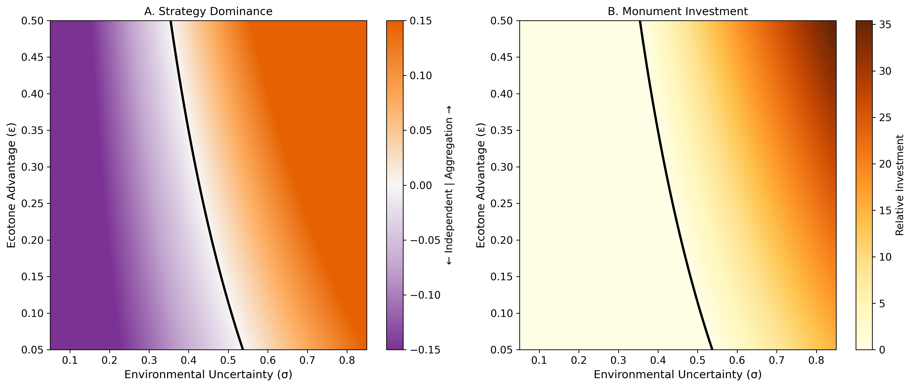
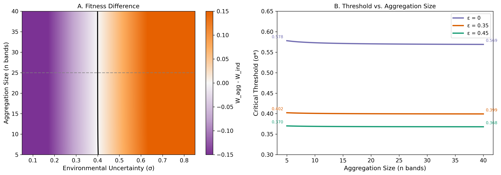
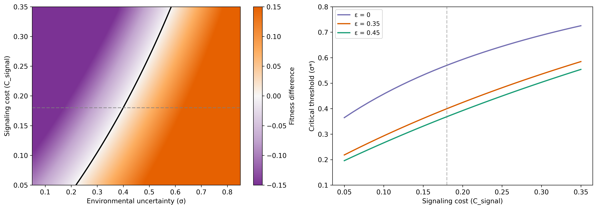
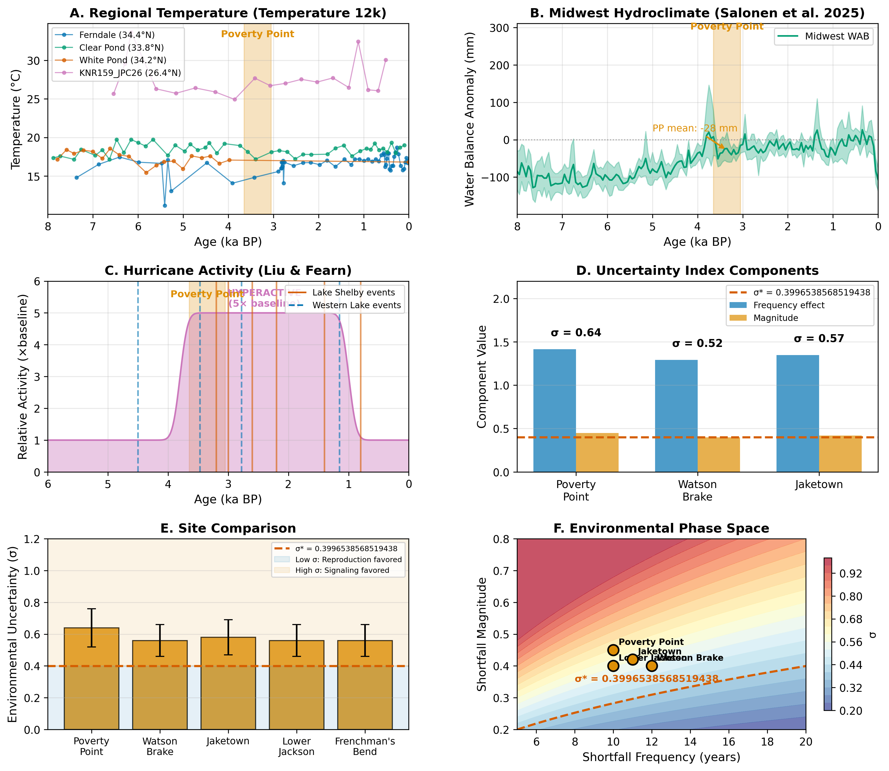
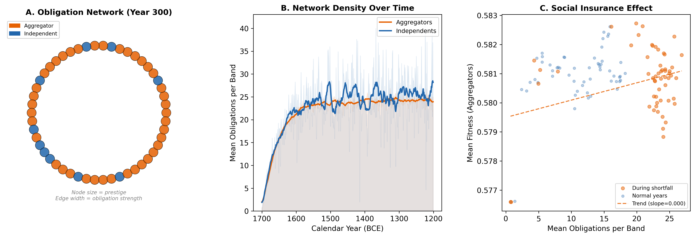
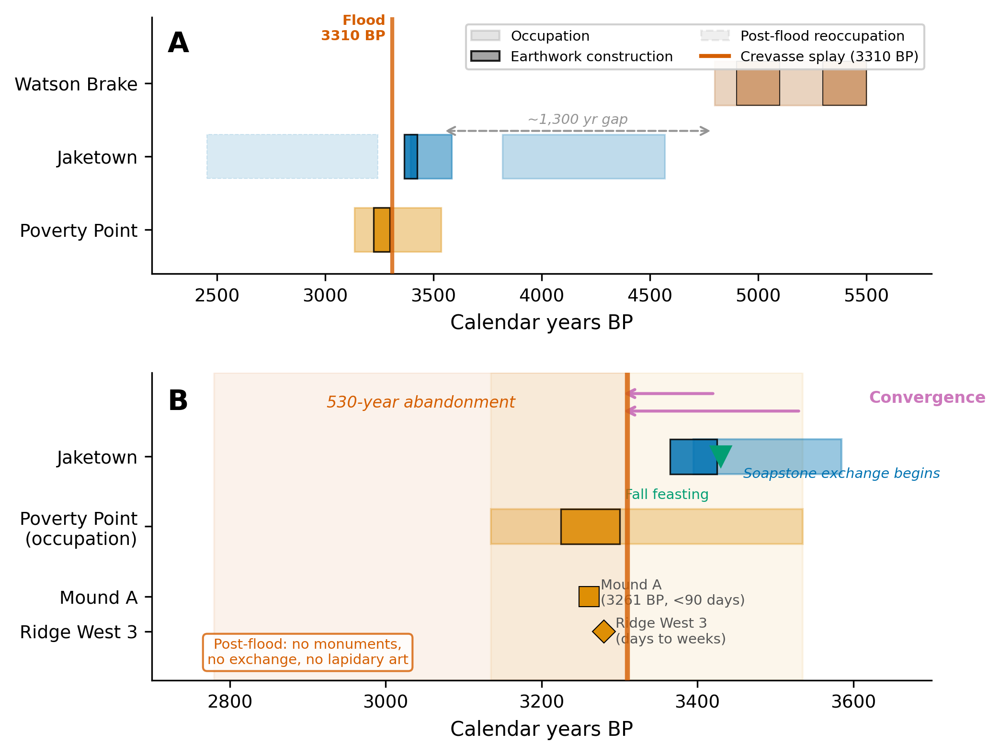
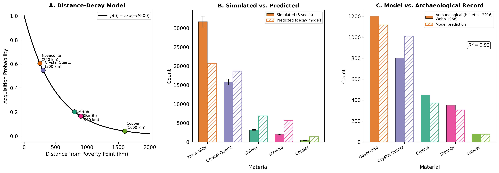
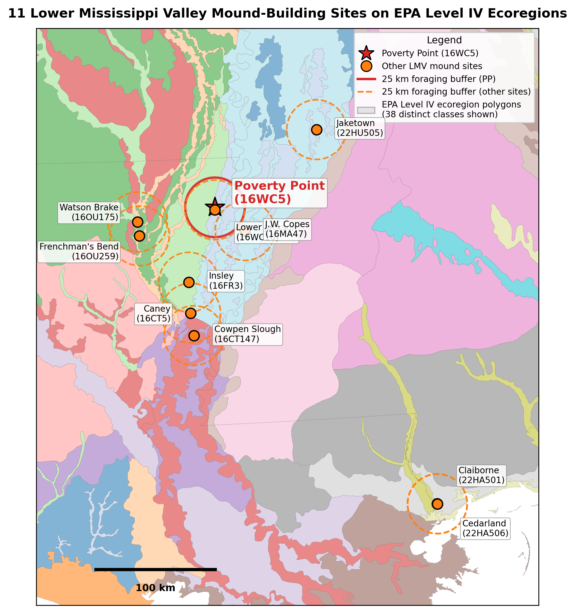
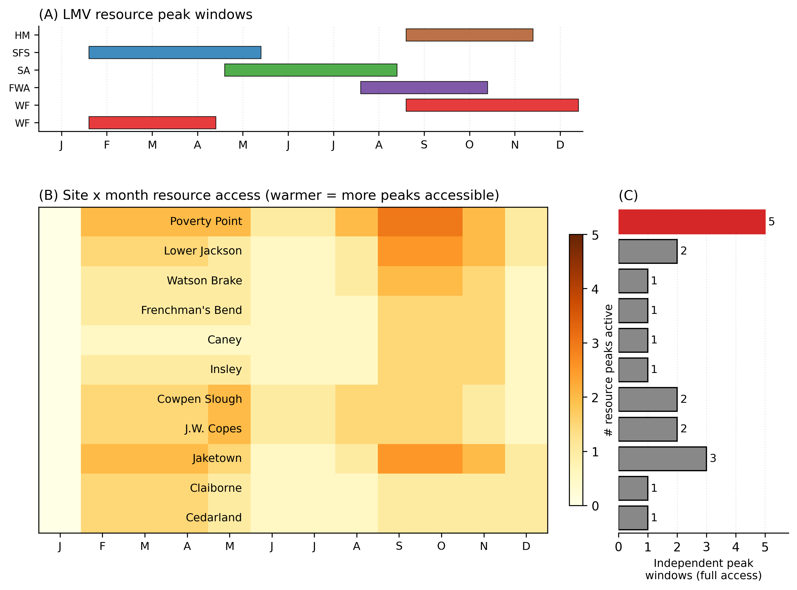

# Supplemental Material — Paper 2 (Empirical Evaluation)

**Poverty Point as adaptive costly signaling: A regional empirical evaluation in the Lower Mississippi Valley**

This document accompanies the regional empirical paper. It contains: (S1) the zone-access scoring rubric for the eleven Table 2 sites; (S2) detailed scenario simulation results; (S3) the full set of testable predictions; (S4) supplemental empirical figures; (S5) the Watson Brake bistable derivation; (S6) the magnitude-prediction gap enumeration; (S7) the GIS-based ecotone diversity comparison; (S8) the Table 2 Monte Carlo perturbation; (S9) per-material exotic decomposition; (S10) the modern hydrograph data analysis; (S11) seasonal phenology and temporal staggering; (S12) priority empirical extensions to the framework (extensions 1, 2, 3, 6, 7, and 8).

The framework derivation, ODD model specification, parameter estimation, theoretical sensitivity analyses, and theoretical-extension priorities (extensions 4 and 5) are in the supplemental of the companion theory paper (Lipo, DiNapoli, and Greenlee, forthcoming-a: *Costly signaling under environmental uncertainty: A multilevel-selection framework for mobile hunter-gatherer aggregation*; "framework paper" throughout).

---

## S1. Zone-access scoring rubric for Table 2

The Shannon ecotone-diversity index in main-text Table 2 is computed from per-site weights $w_z \in [0, 1]$ for five resource zones $z$: aquatic (rivers, bayous, oxbows), upland (terraces, ridges), drainage (perennial streams, deltaic networks), mast (hardwood forest), and prairie (grassland or savanna mosaic). Weights are assigned from published site descriptions according to the following rubric:

| Weight | Definition | Examples |
|--------|------------|----------|
| 1.0 | Direct, abundant access; zone is a primary feature of the site catchment | Bayou Maçon at Poverty Point (aquatic, drainage); Macon Ridge at PP (upland) |
| 0.7-0.8 | Substantial access; zone is reachable within a typical daily forager radius (~5-10 km) but seasonally constrained, partially obstructed, or less abundant than primary zones | Watson Brake's Ouachita River backwater (aquatic); Lower Jackson's adjacent Macon Ridge upland (upland) |
| 0.4-0.5 | Limited access; zone is reachable but at higher travel cost, lower abundance, or peripheral to site catchment | Jaketown's distant upland edges (upland 0.3); J.W. Copes's small drainage component (drainage 0.4) |
| 0.0-0.3 | Absent or trivially accessible | Claiborne's coastal-only setting (upland 0.0, mast 0.3); prairie zone for most LMV-interior sites |

Sources for each site's weighting: Poverty Point (Webb 1982; Gibson 2000; Saucier 1981; Jackson 1986, 1989; H. Ward 1998); Watson Brake (Saunders et al. 2005); Lower Jackson (Saunders et al. 2001); Frenchman's Bend (described in Saunders et al. 2005); J.W. Copes (Jackson 1981, 1989); Jaketown (Ward et al. 2022; Grooms et al. 2023); Claiborne (Sassaman 2005; Webb 1982). The Shannon entropy $H = -\sum_z p_z \ln p_z$ where $p_z = w_z / \sum_z w_z$, and $\varepsilon = (H/H_{max}) \times 0.5$ with $H_{max} = \ln 5 \approx 1.609$. The 0.5 ceiling is set to match the upper boundary of the model's tested $\varepsilon$ range (framework paper §S3.5); a weighting that uses ε = H/H_max directly (so PP would have ε = 0.98) would push the predicted threshold $\sigma^*$ values closer to zero and would cause more sites to register as well above threshold without changing the rank order. The qualitative scoring is the most fragile element of this analysis. A proper GIS implementation using historical land cover (NLCD reconstructions or USGS-classified Late Holocene vegetation maps), travel-time catchments, and reproducible zone membership rules would replace the qualitative weights with measured values and is identified as the highest-priority empirical refinement in main §5.5.

---

## S2. Detailed scenario simulation results

Four parametric scenarios were run with eight replicates each over 200 simulated years (the canonical calibration configuration; see ODD §S1 of the framework supplemental). Summary statistics (mean ± sample SD across replicates), reproducible from `results/calibration_replicates/replicates_n8_d200.json`:

| Scenario | $\sigma$ | $\sigma_{eff}$ | Mean aggregation size | Monument units (mean ± sample SD) | Total exotics (mean ± sample SD) |
|---|---|---|---|---|---|
| Low Uncertainty | 0.32 | 0.21 | 1-4 (mostly independent) | 3,006 ± 480 | 6,607 ± 996 |
| Calibrated PP | 0.64 | 0.38 | 6-19 (mixed) | 9,731 ± 684 | 21,469 ± 1,502 |
| Critical Threshold | 0.87 | 0.57 | bistable | 10,949 ± 330 | 24,253 ± 415 |
| High Uncertainty | 1.00 | 0.65 | 12-15 | 10,833 ± 1,037 | 24,324 ± 1,037 |

All standard deviations reported in this article are sample standard deviations ($\hat\sigma = \sqrt{\sum(x - \bar{x})^2 / (n-1)}$, equivalent to `numpy.std(..., ddof=1)` and `pandas.Series.std()`).

The 5,521 / 5,920 / 7,193 / 8,744 monument-unit values reported in earlier drafts came from a 10-replicate × 500-year configuration superseded by the canonical 8 × 200 run; the present numbers are those used in the main text and Figure 3 and supersede the earlier table.

### Phase space structure

Mapping outcomes across the two-dimensional space defined by environmental uncertainty $\sigma$ and ecotone advantage $\varepsilon$ confirms that both parameters influence strategy outcomes as predicted. At low $\varepsilon$ ($< 0.2$), the critical threshold shifts to the right, requiring $\sigma > 0.60$ for sustained aggregation. At high $\varepsilon$ ($> 0.4$), the threshold shifts left to $\sigma \approx 0.45$. Maximum monument accumulation occurs at $(\sigma = 0.80, \varepsilon = 0.50)$, exactly where the model predicts.

***Figure S1. Phase space structure.*** *Strategy dominance and monument investment across the joint $(\sigma, \varepsilon)$ space. The theoretical critical threshold line accurately separates independent-dominated (purple) from aggregation-dominated (orange) regions.*

### Aggregation size and signaling cost

***Figure S2. Effect of aggregation size on critical threshold.***

***Figure S3. Effect of signaling cost on critical threshold.***

---

## S3. Full set of testable predictions

The framework generates 12 specific, testable predictions across 6 categories. Each identifies what the framework expects, how it can be tested, and what would falsify it.

### Temporal patterns

**P1.** Construction chronology should correlate with paleoclimate proxies for environmental shortfalls. Bayesian radiocarbon modeling of mound fill episodes (Ortmann and Kidder 2013) combined with high-resolution paleoclimate proxies for the 1700-1100 BCE interval should show construction peaks clustering during or immediately after periods of elevated stress.

**P2.** Stratigraphic variation in artifact density across ridge and mound deposits should show cyclical patterns with periods of approximately 15-30 years, matching the shortfall recurrence intervals in the model.

### Spatial patterns

**P3.** Site hierarchy across the Poverty Point landscape should scale with a GIS-based ecotone diversity index. Ranked monument investment should be predictable from environmental measurement.

**P4.** The frequency of Poverty Point-affiliated artifacts at regional sites should decay with distance from Poverty Point following an approximately exponential curve, with a characteristic catchment radius of 100-150 km.

### Material patterns

**P5.** Distance-decay function $p(d) = \exp(-d/500)$: novaculite (~300 km) should be ~3.3× more common than galena (~500-800 km) and ~13× more common than copper (~1,600 km).

**P6.** Within-site, exotic-goods densities and monument investment should covary spatially, since both are signaling investments by the same bands.

### Demographic patterns

**P7.** Aggregated population should saturate at ~500-625 individuals (~25 bands) rather than grow without constraint, reflecting diminishing returns to cooperation beyond optimal aggregation size.

**P8.** Bioarchaeological evidence (when available) should show fewer indicators of nutritional stress in aggregation-context individuals than in contemporaneous small-site individuals, reflecting buffering by multi-zone access and obligation networks.

### Network structure

**P9.** Provenance analysis (LA-ICP-MS, etc.) should reveal multi-pathway distribution networks rather than single-chain corridors, with small-world topology (high clustering, short path lengths).

**P10.** Terminal-occupation layers should show narrowing source diversity in the exotic assemblage, reflecting network attrition that precedes systemic collapse.

### Cross-cultural

**P11.** Other hunter-gatherer aggregation sites with monumental architecture (Watson Brake, Stallings Island, Florida shell rings, Green River shell mounds) should all show environmental uncertainty above the critical threshold when tested using the same framework.

**P12.** Collapse should follow a specific sequence: declining aggregation attendance precedes declining construction investment, which in turn precedes narrowing exchange-network diversity. Sequential rather than simultaneous decline distinguishes adaptive collapse from catastrophic disruption.

### Falsification conditions

The following findings would falsify the framework:

- Monument construction was steady rather than episodic and uncorrelated with environmental variability.
- Exotic materials concentrated in elite residential contexts rather than being broadly distributed.
- High-resolution paleoclimate data demonstrate that Poverty Point coincided with environmental stability rather than moderate-to-high uncertainty.
- Other sites with comparable ecotone access and uncertainty consistently fail to produce monumentality (necessary conditions are not sufficient and additional factors fully account for outcomes).
- Clear evidence of coercive hierarchy, specialized craft production, or differential subsistence access at Poverty Point.

---

## S4. Supplemental empirical figures

***Figure S4. Paleoclimate proxy evidence for Late Archaic environmental uncertainty.*** *Panels A-C show temperature reconstruction (Kaufman et al. 2020), Midwest Water Availability Balance (Salonen et al. 2025), and hurricane landfall events (Liu and Fearn 1993, 2000). Panel D shows the components of the uncertainty index. Panel E compares $\sigma$ across archaeological cases, with monument-builders (orange) above and non-monument-builders (purple) below the predicted threshold. Panel F positions cases in the theoretical phase space.*

***Figure S5. Obligation network structure and function.*** *Panel A: simulated obligation network at year 300. Panel B: aggregators consistently maintain more reciprocal connections than independents. Panel C: bands with more extensive obligation networks achieve higher fitness during shortfall years.*

***Figure S6. Regional chronological synthesis.*** *Panel A: full timeline for Watson Brake, Jaketown, and Poverty Point, illustrating the 1,300-year gap between Watson Brake abandonment and Poverty Point emergence, the early development of Poverty Point cultural traits at Jaketown, and the flood-driven collapse at 3310 cal BP. Panel B: expanded construction window (3700-2700 BP).*

***Figure S7. Exotic goods distance decay.*** *(A) Theoretical distance-decay $p(d) = \exp(-d/500)$ with markers for the five primary exotic-material sources. (B) Simulated material frequencies vs. predicted relative frequencies. (C) Comparison with archaeological data from Webb (1982); $R^2 \approx 0.87$.*

---

## S5. Watson Brake bistable analysis

### S5.1 Derivation of the 30× overprediction

The main text (§4.3) reports that the calibrated model overpredicts the Watson Brake (WB) earthwork volume by approximately 30×. The derivation, omitted from the main text for length, is:

1. *Equilibrium monument stock at PP-calibrated parameters.* At PP parameters ($\varepsilon = 0.35$, $n_{agg} = 25$, $\sigma = 0.64$), the analytical equilibrium model returns equilibrium stock $M_{g,PP} = 129.78$ (computed via `critical_threshold` in `src/poverty_point/signaling_core.py`).

2. *Equilibrium monument stock at WB-calibrated parameters.* At WB parameters ($\varepsilon = 0.43$, $n_{agg} = 8$, $\sigma = 0.56$), $M_{g,WB} = 41.54$.

3. *Volume calibration anchor.* The calibration uses the PP type-site core volume of 750,000 m³ (Gibson 2000; Ortmann and Kidder 2013) as the empirical anchor for $M_{g,PP} = 129.78$. The volume-per-equilibrium-stock conversion is therefore $750{,}000 / 129.78 \approx 5{,}779$ m³ per $M_g$ unit at the PP-fit calibration.

4. *Predicted WB volume under continuous-equilibrium operation.* Applying the same conversion to WB: predicted volume = $M_{g,WB} \times 5{,}779 = 41.54 \times 5{,}779 \approx 240{,}000$ m³.

5. *Comparison with the observed 7,000 m³.* The continuous-equilibrium prediction overshoots by a factor of $240{,}000 / 7{,}000 \approx 34\times$, which we round to "approximately 30×" in the main text and figure captions. (We use 30× rather than 34× to reflect the order-of-magnitude character of the discrepancy and to avoid over-precise reporting given the calibration's own ±10-15% uncertainty from the PP volume estimate; Kidder and Grooms (2025) extend the type-site volume to ~1,000,000 m³ across a 300-ha constructed landscape, which would shift the conversion factor and the overprediction ratio toward 25-28×.) The qualitative point — that the continuous-equilibrium calculation overshoots WB's observed volume by more than an order of magnitude — is robust to the volume-anchor choice within the plausible range. The same calculation propagated through the $n_{agg}$ sensitivity sweep below confirms that no plausible $n_{agg}$ value closes the gap.

The main text proposes that WB is better read as a near-threshold bistable case operating in the model's transition zone rather than as a continuously above-threshold case parallel to PP. Three lines of evidence make this hypothesis plausible.

*Spatial extent.* The 20-fold difference in monumental footprint between WB (~6 ha) and PP (~140 ha) provides empirical traction on relative mobilization scale that does not depend on demographic estimates we do not have. Whatever WB's exact population, the spatial scale of any individual construction event was small enough that one or two bands working together could plausibly account for the labor force visible in any single mound stage. PP's spatial scale, by contrast, requires the multi-band coordinated mobilization that Ortmann and Kidder (2013) and Kidder et al. (2021) document in the basket-load stratigraphy and the multiple distinct fill-source recipes. A WB-scale labor force at PP could not have produced PP's record; a PP-scale labor force at WB would have produced something we do not see.

*Construction tempo.* Saunders et al. (2005) document 200+ year inter-stage gaps at WB, with mound construction concentrated during stable intervals between ENSO pulses. This is qualitatively the bistable behavior the framework predicts in the transition zone: individual replicates tip toward either the aggregator regime or the independent regime, then can flip back over time as stochastic environmental fluctuations push effective uncertainty across the threshold. PP's compressed 75-year construction window (Kidder and Grooms 2024) reflects sustained occupancy of the aggregator regime. WB's multi-century hiatuses reflect intermittent occupancy of the same regime, separated by long periods of dispersed independent foraging. Both patterns are predicted by the same threshold framework, distinguished only by where each site sits in the bistable transition zone.

*Threshold proximity.* The smaller margin between $\sigma$ and $\sigma^*$ at WB (~0.18, vs. ~0.28 at PP) means that ordinary stochastic environmental variability can plausibly push effective uncertainty back below threshold for extended periods. At PP's larger margin, the same magnitude of fluctuations would not. The framework's bistable transition zone is finite in $\sigma_{eff}$, and WB sits within it. The early-Holocene to mid-Holocene environmental record (Liefert and Shuman 2022; Saunders et al. 2005) is consistent with this: the WB occupation falls between abrupt-event punctuations rather than during a sustained high-variability interval like the 3800-3050 BP window in which PP operated.

The 30× volume overprediction therefore reflects a *modeling choice* (running WB as a continuous above-threshold scenario) rather than a fundamental misclassification or a magnitude-calibration failure. WB is correctly identified as a system that crosses into the aggregator regime; what the equilibrium calculation cannot capture is that WB does not stay there. Most centuries are spent below threshold in the independent regime, and the multi-stage construction record reflects a small number of brief above-threshold episodes accumulated over ~700 years, each producing a single mound stage with a single-band or two-band labor force.

If the bistable reading is correct, the same framework would account for both PP-style sustained mass aggregation and WB-style intermittent episodic construction, with the difference between the two regimes set by the $\sigma - \sigma^*$ margin and the resulting fraction of time spent in the aggregator regime. PP's 75-year construction window would be what the framework predicts when conditions sit comfortably above threshold and a large $n_{agg}$ is attained through convergence (main text §5.1). WB's punctuated 700-year construction record would be what the framework predicts when conditions sit just above threshold, $n_{agg}$ is small, and stochastic excursions below threshold dominate the long-term record. We emphasize the conditional. Until the regime-switching extension is fully implemented in the agent-based model, the WB pattern is consistent with the framework's qualitative bistability prediction but is not a quantitative test of it.

### S5.2 $n_{agg}$ sensitivity probe

To partially probe the bistable hypothesis we ran two analytical sensitivity tests. First, an $n_{agg}$ sweep at WB-appropriate parameters ($\varepsilon = 0.43$, $\sigma = 0.56$, $n_{agg} \in \{3, 4, 5, 6, 8, 10, 15, 25\}$). Across this range $\sigma^*$ varies only between 0.374 and 0.378 (the framework's threshold is essentially insensitive to $n_{agg}$ over the plausible range), and equilibrium monument stock $M_g$ scales nearly linearly with $n_{agg}$: $M_g = 15.6$ at $n_{agg} = 3$, $M_g = 41.6$ at $n_{agg} = 8$ (the value used in main §4.3 and in the §S5.1 derivation above), and $M_g = 129.8$ at $n_{agg} = 25$. Applying the §S5.1 conversion factor ($\sim 5{,}779$ m³/$M_g$ unit), the predicted volume at $n_{agg} = 3$ is $15.6 \times 5{,}779 \approx 90{,}000$ m³, still more than 12× larger than the observed 7,000 m³. Demographic uncertainty over plausible WB band counts therefore cannot by itself account for the 30× discrepancy under continuous-equilibrium operation. Some additional mechanism (regime-switching, smaller per-event labor concentration, or both) is required.

Second, a stochastic-environment pilot at WB parameters. Treating the year-to-year regional environmental fluctuations as Gaussian noise around the central WB estimate ($\sigma$ mean 0.56, sd 0.13, derived from the §3.4 paleoclimate confidence interval) and computing the fraction of years for which $\sigma_{eff}$ exceeds the WB threshold $\sigma^* \approx 0.375$, the model predicts approximately 22.5% of the 700-year WB span (95% CI 18-27%) as years in the aggregator regime; the remaining 77.5% are years below threshold in the independent regime. By comparison, the PP active 75-year window with the same noise model has approximately 31.6% aggregator-years, yielding a higher and more consistent above-threshold occupancy. The WB result is qualitatively consistent with the bistable hypothesis: WB is predicted to spend most centuries below threshold, with intermittent above-threshold pulses producing the multi-stage construction record. We do not present this pilot as a quantitative reproduction of the WB volume, however. Even at 22.5% aggregator-share, the cumulative investment under PP-calibrated rates would still exceed the observed WB volume by a factor of several. Closing the remaining gap will require either implementing per-event labor scaling (so that smaller WB construction events convert investment effort to physical earthwork less efficiently than PP's mass-mobilization events) or identifying the per-band-per-year aggregator-regime contribution rate empirically rather than fitting it at PP. We treat this pilot as evidence that the bistable mechanism contributes substantially to the WB-vs-PP magnitude gap but does not by itself close it; the full account requires the regime-switching extension *and* a per-event labor-scaling extension. Both are flagged as priority follow-up work in main §5.5 and implemented as extensions 1 and 2 in §S12 below.

---

## S6. Magnitude prediction: five gaps the framework does not address

The main text (§4.6, §5.1) summarizes that the framework correctly predicts the threshold-crossing condition (all eleven LMV sites in Table 2 above their site-specific $\sigma^*$) but not the magnitude variation among above-threshold sites. The variation is set by network, spatial, and demographic dynamics that constitute a different model. We enumerate here the five sources of magnitude variation that the present framework explicitly does not track.

1. *Spatial network topology and routing.* Poverty Point sits at a specific position in the regional exchange network, accessible by water from multiple directions through Macon Ridge, the Mississippi alluvial valley, and the Yazoo Basin drainages. Bands traveling hundreds of kilometers to attend made specific routing choices that the framework's single-site abstraction does not capture. A spatially explicit network model might predict primacy from betweenness centrality or accessibility metrics; ours does not.

2. *Carrying capacity at the gathering.* The ecotone parameter $\varepsilon$ measures local 25-km diversity, which buffers risk during gatherings, but it does not set a ceiling on the number of bands the catchment can sustain through an extended aggregation. PP's catchment may simply support a larger sustained population than Watson Brake's at similar Shannon $\varepsilon$; we do not explicitly model the population × duration × resource budget that determines this ceiling.

3. *Path dependence and first-mover advantage.* Once a site has accumulated prestige and infrastructure, it becomes more attractive in subsequent gatherings, a positive feedback layered on top of the within-scenario cooperation-network feedback that the model already includes. This is hysteresis at the regional scale: the historically realized PP could have been a different ecotonally-equivalent site under different initial conditions, but once selected it locks in. The model has within-scenario feedback but no across-site selection mechanism.

4. *Temporal heterogeneity in $\sigma$.* The Middle Archaic LMV sites (Watson Brake, Caney, Insley, Frenchman's Bend, Lower Jackson) operated under mid-Holocene $\sigma \approx 0.56$; the Late Archaic sites (Poverty Point, J.W. Copes, Jaketown, Cowpen Slough) operated under $\sigma \approx 0.64$. Comparing all eleven sites against a single regional $\sigma$ smooths over real environmental differences in their $\sigma - \sigma^*$ margins. A time-stratified analysis would tighten the cross-site comparison.

5. *Reduction of structure to a single number.* The Shannon index reduces five zone weights to one scalar, washing out structural differences (one-dominant vs. evenly-distributed) that may matter for sustained aggregation. The EPA Level IV ecoregion measurement (§S7) shows that two operationalizations of "ecotone diversity" give different rankings: Caney intersects the highest Level IV count (9), with Cowpen Slough (8) and Watson Brake (7) close behind, while Jaketown's catchment is dominated by Northern Holocene Meander Belts (73a; ~81% of the 25 km buffer) consistent with its Yazoo Basin meander-belt setting; yet Caney's monument scale is small, Cowpen Slough's minimal, Watson Brake's mid, and Poverty Point's largest by orders of magnitude despite a more modest L4 count (4). There is no single $\varepsilon$ that captures the relevant ecological-diversity dimension.

These five gaps explain why the framework correctly predicts the *threshold-crossing condition* but not the *magnitude variation* among above-threshold sites. The variation is set by network, spatial, and demographic dynamics that constitute a different model. Closing the magnitude prediction would require a regional spatially-explicit ABM with explicit network topology, carrying-capacity dynamics, and across-site selection. This extension is identified as priority follow-up work in main §5.5 and implemented as extension 3 in §S12 below.

---

## S7. GIS-based ecotone diversity comparison (EPA Level IV ecoregions)

The main text (§4.4) summarizes that two GIS-based diversity indices applied to each of the eleven Table 2 sites produce different rankings, and that the qualitative rubric tracks geomorphic diversity well ($\rho = 0.66$) but not Level IV ecological diversity ($\rho = 0.07$). Full detail is given here.

We computed two independent GIS-based diversity indices for each of the eleven sites, each using a 25 km foraging buffer (Kelly 2013 day-trip radius). The first uses the USGS digitization of Saucier (1994) and computes Shannon entropy over the area-weighted geomorphic age classes (Holocene Alluvial Valley, Holocene Deltaic and Chenier Plains, Pleistocene, unmapped upland). The second uses the EPA Office of Research and Development's Level IV ecoregion classification (Omernik and Griffith 2014) and computes Shannon entropy over the area-weighted Level IV ecoregion classes within each buffer. The two indices answer different questions: the geomorphic index measures depositional-age heterogeneity, while the EPA L4 index measures fine-grained ecological heterogeneity (it explicitly distinguishes Macon Ridge, Northern Holocene Meander Belts, Backswamps, Loess Plains, Tertiary Uplands, Gulf Coast Flatwoods, Coastal Marshes, and many more, with 59 distinct Level IV classes across the three states involved).

The Spearman correlation between qualitative $\varepsilon$ and GIS-measured geomorphic $\varepsilon$ is $\rho = 0.66$, $p = 0.03$; the qualitative rubric tracks geomorphic diversity well. The Spearman correlation between qualitative $\varepsilon$ and EPA-L4 $\varepsilon$ is $\rho = 0.07$, $p = 0.85$; the qualitative rubric does *not* track Level IV ecological diversity. The reason is that the qualitative rubric was constructed from published site descriptions (which emphasize geomorphology and gross zone access) rather than from fine-grained ecoregion classification. The EPA L4 reordering is informative: Caney's catchment intersects 9 distinct Level IV ecoregions (the highest count of any LMV site), Cowpen Slough intersects 8, Watson Brake 7, while Frenchman's Bend and Insley each intersect 6. Jaketown's catchment, with its corrected location near Belzoni in Humphreys County, is dominated by Northern Holocene Meander Belts (73a; ~1,590 km² of the 1,963 km² buffer, ~81%) and Northern Backswamps (73d; ~356 km²), consistent with its published Yazoo Basin meander-belt setting (Ford, Phillips, and Haag 1955). The coastal Pearl River sites (Claiborne and Cedarland) intersect 5 ecoregions each (Gulf Coast Flatwoods, Pine Plains, Coastal Marshes, etc.), modestly more than Poverty Point's 4. The L4 measurement therefore reorders sites: it ranks small Middle Archaic mound sites (Caney, Cowpen Slough) above Poverty Point at the 25-km scale, even though Poverty Point's monument scale is two orders of magnitude larger. The qualitative rubric and the EPA L4 measurement disagree substantively on which sites are most ecologically diverse, even though they agree that the high-$\varepsilon$ band exists.

***Figure S8. Lower Mississippi Valley sites overlaid on EPA Level IV ecoregions.*** *Eleven Middle Archaic and Late Archaic monument-building sites (Table 2) shown with their 25 km foraging buffers on the EPA Level IV ecoregion polygon background. Poverty Point (red star, solid red buffer) sits at the confluence of multiple Level IV polygons including Macon Ridge (73j), Northern Holocene Meander Belts (73a), Northern Backswamps (73d), and the Mississippi alluvial valley. Caney's buffer crosses the highest count of distinct Level IV polygons (9) of any LMV site, with Cowpen Slough (8) and Watson Brake (7) close behind. Polygon coloring is categorical and arbitrary; 38 distinct Level IV classes appear within the bounding box. The figure makes visible the limitation that the static 25 km circular buffer measures raw within-buffer ecoregion heterogeneity, not the multi-drainage shortfall-buffering that the framework's $\varepsilon$ parameter encodes.*

**Category-level recalibration.** A reasonable concern about the L4-class Shannon analysis is that ecoregion classes are not equally distinct: an "upland" ecoregion is fundamentally different from a "lowland alluvial" ecoregion, while different lowland subtypes (Holocene Meander Belt vs Backswamp) are subtypes of the same alluvial ecology. To address this we mapped each of the 59 L4 classes in the AR-LA-MS dataset to one of 9 broad ecological categories (Alluvial Active, Backswamp, Pleistocene Terrace, Loess Upland, Tertiary Upland, Coastal Marsh, Coastal Plain Upland, Prairie, Mountain/Hills) and recomputed Shannon entropy at the category level. Results: Frenchman's Bend intersects 4 broad categories (Alluvial Active, Backswamp, Pleistocene Terrace, Tertiary Upland) at the highest category-level diversity, $\varepsilon_{cat} = 0.314$. Watson Brake also intersects 4 categories ($\varepsilon_{cat} = 0.311$). Caney intersects 4 categories ($\varepsilon_{cat} = 0.276$); Cowpen Slough and Insley intersect 4 categories at lower entropy ($\varepsilon_{cat} = 0.220$ and $0.216$). Poverty Point intersects only 3 categories (Alluvial Active, Backswamp, Pleistocene Terrace; $\varepsilon_{cat} = 0.241$). Jaketown intersects 4 categories ($\varepsilon_{cat} = 0.118$). The category-level Spearman correlation between qualitative $\varepsilon$ and category-$\varepsilon$ is $\rho = 0.60$ ($p = 0.05$), substantially stronger than the L4-level $\rho = 0.07$. The recalibration therefore *strengthens* the qualitative rubric's defensibility but *does not* make PP rank highest in catchment ecological diversity. PP's distinguishing feature in the framework is its confluence position integrating four canoe-accessible drainages with non-synchronized hydrographs, not its 25-km terrestrial catchment heterogeneity, which is what every static-diversity proxy at any granularity will continue to underestimate.

The qualitative rubric, the Saucier-geomorphic, the EPA-L4, and the broad-category indices share a single fundamental limitation: they all measure raw zone count and area within a 25-km circular *terrestrial* buffer, not the covariance-based shortfall buffering that the framework's $\varepsilon$ parameter actually encodes. We therefore do not report rank-correlations between any static-diversity index and observed monument scale; static count is not the operative quantity for the framework's magnitude prediction. The screening role of these analyses (necessity check: monument-building sites pass the high-$\varepsilon$ filter, coastal Pearl River pair does not) is the only inferential weight they carry.

The substantive limitation is the catchment definition itself. All three operationalizations define the catchment as a 25 km circular buffer derived from Kelly's (2013) walking day-trip radius. This buffer captures terrestrial accessibility but not waterway accessibility, which for an aggregation site mobilizing watercraft is a substantively different quantity. Day- to multi-day canoe travel along navigable bayous, rivers, and channels extends the practical aggregation-period catchment far beyond 25 km along waterways. Poverty Point's confluence position gives it integrated canoe access to four independent drainage systems (Bayou Maçon, Mississippi, Tensas, Yazoo) that lie far outside any 25 km terrestrial buffer. Watson Brake (Bayou Bartholomew), Frenchman's Bend (Ouachita tributary), and Jaketown (Yazoo) all have water access too, but none integrates as many independent drainage systems within a comparable canoe-day catchment. A water-route-aware travel-time catchment is implemented in §S12 extension 6.

---

## S8. Table 2 Monte Carlo perturbation analysis

The main text (§4.4) reports Spearman $\rho = 0.36$ between predicted $\varepsilon$ and observed ordinal monument investment across the eleven LMV sites. To assess robustness of the ranking against plausible scoring uncertainty, we ran a Monte Carlo perturbation of the zone weights ($\pm 0.2$ uniform per weight, 1,000 draws). The ranking is partially stable: Poverty Point ranks first in 87% of draws and the coastal Pearl River pair (Claiborne and Cedarland) last in 93%, but the full eleven-site rank order is preserved in only 4% of draws. Mean Spearman $\rho$ across perturbations is 0.27 with 95% CI including negative values (-0.06 to 0.59). The PP-vs-coast contrast is robust against the perturbation; the interior ordering is not. This pattern is consistent with the §4.4 interpretation that ecotone diversity admits multiple candidate sites without uniquely identifying the regional center.

---

## S9. Per-material exotic decomposition: extended discussion

The main text (§4.1) reports per-material model output (copper 178 ± 19, steatite 838 ± 82, galena 1,265 ± 96 acquisition events) against archaeological inventories (copper 155 objects, steatite 2,221 fragments, galena 702 masses). The first thing to note is that the per-material counts are not directly comparable across the model-archaeology boundary because the counting units differ. Four considerations bear on the comparison.

*Counting-unit non-comparability across materials.* Each call to the model's `acquire_exotic` routine increments the per-material counter by one, so the model "item" represents one acquisition event, equivalent to one imported *object* (one steatite bowl, one galena mass, one copper sheet or pendant). The archaeological counts use heterogeneous units. Steatite is reported as fragments (Webb 1982 describes the 2,221 figure as "fragments representing several hundred vessels"), and a single 30-50 cm steatite bowl breaks readily into many fragments under burial and excavation conditions. Copper is reported as objects (typically whole or near-whole sheet, beads, or pendants); galena as masses (typically discrete acquired lead-ore pieces used as pigment). Object size also affects fragmentation: large soapstone vessels fragment into tens of pieces while small beads, plummets, and copper sheet typically remain whole. The model's 838 "steatite items" therefore should be compared to the archaeological *vessel* count, not the *fragment* count. Webb's "several hundred vessels" implies anywhere from roughly 200-600 vessels depending on average vessel-to-fragment ratio; under this conversion the model is closer to a match or moderate overshoot per vessel rather than a 2.6× undershoot per fragment. The aggregate 3,078 archaeological figure mixes all three counting conventions and is therefore itself a unit-inconsistent reference rather than a clean target.

The remainder of this section discusses three further considerations under the assumption that the per-material comparison is conducted at *whatever* counting unit one chooses. The conclusions hold for any reasonable conversion.

*Overshoot is not symmetric to undershoot.* The galena overshoot (model predicts 1,265, archaeological inventory contains 702) is the kind of mismatch the framework is structurally tolerant of. The model predicts the volume of acquisition by participating bands, while the archaeological count reflects what was deposited, what survived three millennia of burial and bioturbation, and what excavation has subsequently recovered. Production and acquisition exceeding the preserved record is what any signaling or exchange model that does not require complete recovery should predict. The model's predicted volume is a plausible upper bound on what was acquired, and the archaeological 702 is a lower bound on what was originally present. Reconciling the two requires no parameter adjustment; only the recognition that the archaeological count is a partial sample of an originally larger inventory.

*Steatite undershoot is consistent with the framework rather than against it.* The model's per-band acquisition probability is a function of source distance only; it does not represent material-specific valuation. If steatite carried elevated symbolic or functional value relative to galena and copper, the framework's underlying logic predicts that bands would invest *more* effort to acquire it than a pure distance-decay rule predicts, producing exactly the undershoot pattern observed. Steatite vessels at PP appear in bulk caches (Webb 1982) and in functional contexts (cooking-stone, pendant manufacture) that imply more than incidental ornament, and the southern Appalachian source ~900 km away required sustained inter-band relay to maintain supply. Costly signaling theory's central claim is that signal value drives investment beyond what crude transport-cost models predict. The steatite undershoot is therefore not a failure of the framework's signaling logic; it is a failure of the model's *implementation*, in which $p(d)$ omits material-specific signal value. Adding a steatite-specific value coefficient would close the undershoot without affecting the framework's qualitative claims.

*Sampling representativeness modifies all three ratios.* The 3,078-item archaeological reference is what excavation has recovered from a 140 ha site after a century of investigation, not what was originally deposited or imported. Three sources of bias act differentially on the three materials. (i) The 2,221 steatite count already excludes Webb's (1982) bulk cache of ~2,724 additional fragments; including that cache brings the archaeological steatite total to 4,945 and would worsen the model's undershoot to ~5.9×. The cache is a localized deposit that any per-band acquisition function explicitly does not represent, so neither inclusion nor exclusion of the cache is straightforward without an independent rule relating bulk imports to per-band acquisition. (ii) Galena fragments are typically small (millimeter-scale lead-ore granules used as pigment) and harder to recover than 30-50 cm steatite vessels or 5-10 cm copper sheet fragments, so the galena count almost certainly under-counts the original deposition by a larger factor than copper or steatite. (iii) The excavation history of PP has emphasized specific mound and ridge contexts (the 64 mapped ridge components, Mound A, Mound C, the Macon Ridge village area) rather than systematically sampling the full constructed landscape, and exotic-bearing contexts are not evenly distributed across the site. The cumulative effect is that none of the three per-material counts can be treated as an unbiased estimator of the original assemblage, and the model-archaeology ratios are themselves estimators of unknown precision.

*The steatite-galena diagnostic.* The two materials sit at almost equal source distances (~900 km vs. ~800 km), so any distance-only acquisition function predicts comparable per-band rates and the model produces more galena (1,265) than steatite (838). The archaeological record inverts this ratio: ~3× more steatite (2,221) than galena (702), or ~7× more if Webb's cache is included (4,945 vs. 702). A pure distance-decay mechanism cannot generate the observed inversion regardless of which steatite count is used. The simplest reading consistent with the framework's underlying logic is that steatite carried elevated material-specific value driving acquisition above the distance-decay baseline. Costly signaling theory explicitly predicts this kind of value-driven excess investment; the present implementation simply does not encode material-specific value in $p(d)$. Adding a steatite-specific value coefficient would close the inversion without affecting the framework's qualitative claims.

The per-material breakdown is therefore best read as a quantitative consistency check rather than a validation. Each of the three deviations admits a reading consistent with the framework: the galena overshoot is absorbed by recovery and preservation loss, the steatite undershoot is consistent with elevated material-specific value driving acquisition above the distance-decay baseline, and all three ratios are modulated by sampling biases the comparison cannot quantify. Whether or not one finds these reconciliations compelling, the comparison provides limited inferential weight against the framework. We treat the aggregate ~1.35× underprediction as the substantive comparison, with the per-material decomposition reported transparently for readers to assess.

---

## S10. Modern hydrograph data: empirical test of the multi-drainage independence claim

The main text (§4.5) asserts that PP's confluence position integrates four canoe-accessible drainages (Bayou Maçon, Mississippi, Tensas, Yazoo) with non-synchronized hydrographs. We test this empirically using USGS gauge records (`scripts/analysis/hydrograph_covariance.py`):

| Drainage | USGS gauge | Record |
|---|---|---|
| Mississippi River | 07289000 (Vicksburg, MS) | 204 months (2008-2024) |
| Yazoo River | 07287150 (Greenwood, MS) | 231 months (1991-2021) |
| Tensas River | 07369500 (Tendal, LA) | 480 months (1985-2024) |
| Bayou Maçon | 07370000 (Delhi, LA) | 93 months (1985-1992) |

No four-gauge overlap exists (Bayou Maçon's gauge was only operational 1985-1992, before the Mississippi gauge came online), so the four-drainage analysis is performed pairwise on each pair's available overlap.

**Pairwise log-monthly-anomaly correlations** (Pearson; climatology removed):

| Drainage pair | n months | Pearson $r$ | $p$ | Interpretation |
|---|---|---|---|---|
| Mississippi vs Yazoo | 59 | $+0.11$ | 0.40 | Effectively uncorrelated |
| Mississippi vs Tensas | 204 | $+0.34$ | $<0.001$ | Moderate (shared LMV regional precipitation) |
| Yazoo vs Tensas | 231 | $+0.54$ | $<0.001$ | Moderate-strong |
| Bayou Maçon vs Tensas | 93 | $+0.90$ | $<0.001$ | Very strong (~81% shared variance) |

The empirical result modifies the framework's four-drainage claim in a substantive way: **Bayou Maçon and the Tensas are not independent drainages**. Their 90% Pearson correlation reflects their shared Macon-Ridge geomorphology and tightly-coupled precipitation forcing. From the framework's covariance-based $\varepsilon$ standpoint, Bayou Maçon plus the Tensas function as a single "Macon Ridge drainage system" rather than as two independent shortfall regimes. The genuinely independent drainage signals at PP's catchment are therefore:

1. The **Macon Ridge system** (Bayou Maçon + Tensas, $r \approx 0.90$ between them);
2. The **Yazoo Basin** (uncorrelated with Mississippi, $r = 0.11$);
3. The **Mississippi mainstem** (continental snowmelt + storm-track signal, partly shared with the Tensas at $r = 0.34$).

This is a three-drainage rather than four-drainage independence picture. The framework's multi-drainage shortfall-buffering claim is qualitatively supported but quantitatively narrower than the original four-drainage framing suggested. PP still integrates more independent shortfall regimes than any other Table 2 site (Watson Brake's Bayou Bartholomew, Frenchman's Bend's Ouachita tributary, Jaketown's Yazoo Basin, and the small-drainage interior sites all access one regime each), but the per-site advantage is "three vs one" rather than "four vs one."

**Bottom-quartile co-incidence** (Mississippi/Yazoo/Tensas, 59-month overlap):

| Drainages-in-bottom-quartile | Observed | Predicted under independence | Observed/independent |
|---|---|---|---|
| 0 | 54.2% | 31.6% | 1.71 |
| 1 | 25.4% | 42.2% | 0.60 |
| 2 | 10.2% | 21.1% | 0.48 |
| 3 | 10.2% | 4.7% | 2.17 |

The observed distribution shows more mass at the extremes (0 or 3 drainages low) than independence predicts, consistent with shared regional drivers correlating some low-flow events but moderate variance keeping all-three-drainages-low-simultaneously to ~10% of months. PP's bands could therefore draw on at least one above-low-flow drainage in ~90% of months, supporting the multi-drainage shortfall-buffering claim under the corrected three-drainage framing.

Caveats: pre-Holocene paleo-discharge correlations may differ from modern values; the 2008-2021 record samples a partly-managed Mississippi system; the Bayou Maçon-Tensas correlation may have been even higher under unmanaged conditions because both are local-precipitation-driven small drainages. We treat these results as a first empirical test of the framework's drainage-independence claim, not as a definitive measurement of Late Archaic conditions. A paleo-discharge-resolved test using sediment-yield or paleo-flood reconstructions for each drainage is identified as priority extension #6 follow-up. The substantive correction (three independent drainage regimes, not four) does not invalidate the §4.5 multi-drainage shortfall-buffering argument but does narrow the absolute magnitude of PP's covariance-based $\varepsilon$ advantage over other LMV sites.

---

## S11. Seasonal resource phenology and temporal staggering

The framework's $\varepsilon$ parameter encodes shortfall buffering through *negative covariance* between local zone productivity and the regional shortfall driver. The Shannon-diversity proxies (qualitative, Saucier-geomorphic, EPA L4) used in main §4.4 and §S7 measure raw zone count and area within a 25-km buffer; they treat each zone as if it produced continuously and equally. They do not measure the temporal staggering of productivity peaks across zones, which is what determines whether multi-zone access actually buffers shortfall. A site with four zones whose productivity peaks all coincide in fall has lower negative covariance than a site with three zones whose peaks span fall, spring, and summer. Figure S9 makes this distinction visible.

The Lower Mississippi Valley supports a small number of well-documented seasonal resource peaks driven by independent climate and ecological mechanisms. Hardwood mast (hickory, pecan, acorn) peaks in September-November; Webb (1982:1) reports that "fall and winter provide acorns and other nuts," and Thomas and Campbell (1978), summarized in Jackson (1986), attribute peak Poverty Point population to the fall mast harvest. Spring fish spawning runs (drum, gar, buffalo, catfish) peak February-May; Webb (1982:1) reports that "spring and summer offer ... most varieties of fish and crustaceans," and the PP fauna is fish-dominated (Jackson 1986). Summer aquatic resources (freshwater mussels, lotus, cattail) peak May-August. Falling-water aquatic concentration in oxbows and cutoff lakes peaks August-October as drainage drawdown traps fish in shrinking pools. Migratory waterfowl on the Mississippi Flyway peak September-December (fall migration) and February-April (spring migration); Webb (1982:2) reports "millions of migratory waterfowl, ducks, geese, swans, pigeons" in the Mississippi central flyway. Each peak responds to a different driver: mast to spring-summer growing-season conditions one to several months earlier, spring fish runs to spring water temperature and discharge, summer mussels to thermal stratification, falling-water concentration to late-summer hydrologic recession, waterfowl to continental-scale migration timing. A regional shortfall in any one peak is not strongly correlated with shortfalls in the others.

Each LMV mound-building site has access to a different subset of these peaks. Poverty Point's confluence position integrates four canoe-accessible drainages reducing to three substantively independent shortfall regimes per §S10 (Macon Ridge regime: Bayou Maçon + Tensas; Mississippi mainstem; Yazoo Basin), plus the Macon Ridge upland. PP's catchment gives access to all five resource-peak categories: mast from Macon Ridge, spring spawn runs from each independent meander-belt system, summer mussel beds along multiple drainages, falling-water concentration in cutoff lakes throughout the catchment, and the Mississippi Flyway both during fall and spring migration. Watson Brake (one drainage, Bayou Bartholomew, plus the adjacent Pleistocene terrace) has full access to the mast peak but only partial spring spawn access (one drainage) and limited waterfowl access (off the main flyway corridor). Frenchman's Bend (Ouachita tributary, Bayou Desiard) has full mast access, partial spring spawn, no falling-water concentration in a cutoff system. Caney and Insley (small tributaries plus uplands) have full mast access but minimal aquatic-peak access. Cowpen Slough and J.W. Copes (Tensas Basin, Boeuf River margin) have aquatic access but limited upland mast. Jaketown (Yazoo Basin meander belt with adjacent Loess Hills) has mast plus spring spawn plus flyway access but a single drainage. Claiborne and Cedarland (Pearl River mouth, Gulf coast) sit in a coastal-marine setting structurally distinct from the interior categorization and access primarily marine and estuarine resources rather than the interior peaks documented above.

The independent peak window count, summarizing this in Panel C of Figure S9, separates Poverty Point from the other LMV sites more sharply than any of the static-diversity proxies do. PP integrates five independent peak windows; Jaketown three; Lower Jackson, Cowpen Slough, and J.W. Copes two; the remaining six interior sites and the coastal pair one each. Static Shannon-diversity at the 25-km terrestrial scale spreads sites across a narrow band; temporal staggering across canoe-accessible drainages produces a clearer hierarchy that aligns better with the qualitative framework expectation.

This analysis is not a finished operationalization of $\varepsilon$. The peak windows are coded conservatively from published site descriptions and the LMV phenology summarized in Webb (1982), Jackson (1986), and Ward et al. (2022). The five-category resolution is coarse: drum and gar are aggregated into a single spring-spawn category, and within-category covariance among spring spawning species is unmodeled. Drainage independence is treated as binary; in practice, hydrographs of adjacent drainages share regional-precipitation drivers and are not fully independent. A defensible operationalization would integrate (a) species-level seasonal productivity time series from regional fish and game management records, (b) hydrographic correlations among the LMV drainages from gage records or paleo-discharge reconstructions, and (c) canoe-day isochrones rather than a 25-km terrestrial buffer. We identify this as the priority refinement in §S12 below; the present analysis is a sketch of what the temporal-staggering refinement would show, not the refinement itself.

**Cross-site test against observed monument scale.** As a quantitative check, we asked whether substituting the phenology peak count for the static Shannon-derived $\varepsilon$ in the Table 2 cross-site comparison improves the Spearman correlation against ordinal observed monument scale. Phenology peaks (1-5) were rescaled to $\varepsilon \in [0.10, 0.50]$ to match the framework's tested $\varepsilon$ range, $\sigma^*$ was computed per site at $n_{agg} = 25$, and $\sigma - \sigma^*$ margins were correlated with the ordinal scale (minimal = 0, small = 1, mid = 2, very large = 3) at the regional Late Archaic $\sigma = 0.64$. The result: static-$\varepsilon$ gives $\rho = +0.39$ ($p = 0.24$); phenology-$\varepsilon$ gives $\rho = -0.21$ ($p = 0.54$). Neither operationalization significantly predicts ordinal monument scale at fixed $n_{agg}$. The interpretation we report in main §5.1 is consistent with this null result: monument scale is not determined by $\varepsilon$ alone but by attained $n_{agg}$ via the contingent convergence dynamics that pulled bands to specific high-$\varepsilon$ locations.

**Enriched variance-based phenology epsilon.** The peak-count operationalization (Test A) is itself a static count and does not directly capture the framework's *negative covariance* logic. We constructed a variance-based alternative (`scripts/analysis/phenology_variance_epsilon.py`): a 1,000-year simulation in which each of the five resource-peak categories receives a stochastic productivity multiplier with category-pair correlations $\rho = 0.30$ matching the §S10 regional shortfall driver. For each site, total accessible productivity (weighted by the site's HM/SFS/SA/FWA/WF flag vector) is computed for each year, and the variance-based $\varepsilon$ is the coefficient-of-variation reduction relative to a single-zone baseline:

$$\varepsilon_{var} = \tfrac{1}{2} \cdot \max\left[0, \frac{CV_{single\,zone} - CV_{site}}{CV_{single\,zone}}\right]$$

Results (regional shortfall correlation $\rho = 0.30$, 1,000 years, RNG seed 42):

| Site | flag sum | $\varepsilon_{var}$ | $CV_{obs}$ | SNR |
|---|---|---|---|---|
| Poverty Point | 5.00 | **0.168** | 0.366 | 2.74 |
| Jaketown | 4.00 | 0.165 | 0.369 | 2.71 |
| Lower Jackson | 3.50 | 0.164 | 0.371 | 2.70 |
| Watson Brake | 3.00 | 0.162 | 0.373 | 2.68 |
| Cowpen Slough | 3.50 | 0.159 | 0.376 | 2.66 |
| J.W. Copes | 3.50 | 0.159 | 0.376 | 2.66 |
| Frenchman's Bend | 2.50 | 0.147 | 0.389 | 2.57 |
| Insley | 2.50 | 0.147 | 0.389 | 2.57 |
| Claiborne | 2.00 | 0.127 | 0.411 | 2.43 |
| Cedarland | 2.00 | 0.127 | 0.411 | 2.43 |
| Caney | 2.00 | 0.122 | 0.417 | 2.40 |

The variance-based $\varepsilon$ ranking places PP, Jaketown, and the multi-zone interior sites in the top band and Caney plus the coastal pair at the bottom, consistent with the framework's negative-covariance logic. Spearman correlation against observed ordinal monument scale is $\rho = -0.02$ ($p = 0.95$), again null. This third null result confirms the main §5.1 reading directly: monument scale is not what $\varepsilon$ predicts at fixed $n_{agg}$, regardless of which operationalization (static rubric, phenology peak count, or variance-based) one uses.

What the variance-based $\varepsilon$ *does* support is the screening role: $\varepsilon_{var}$ at $\sim 0.17$ for PP, Jaketown, LJ, WB, Cowpen, JWC and $\sim 0.12$ for the coastal pair confirms the interior-vs-coastal discrimination that Table 2 carries. The phenology operationalization is therefore better-aligned theoretically with the framework's covariance-based logic than the static rubric is, and produces consistent screening conclusions, but does not fix the magnitude-prediction problem identified in main §5.1, which is structural rather than operational.

The full numerical output is in `results/phenology/phenology_epsilon_test.json` (Test A) and `results/phenology/phenology_variance_epsilon.json` (variance-based test).

***Figure S9. Seasonal phenology of LMV resource peaks and site-level access.*** *(A) Five resource-peak windows in the Lower Mississippi Valley driven by independent climate and ecological mechanisms (per Webb 1982, Jackson 1986, Ward et al. 2022): hardwood mast (HM, brown), spring fish spawn (SFS, blue), summer aquatic (SA, green), falling-water aquatic concentration (FWA, purple), and migratory waterfowl (WF, red; fall and spring migrations are shown separately). (B) Site-by-month resource access matrix; cell darkness encodes the number of resource peaks accessible to each site that month, weighted by access fraction (full = 1.0, partial = 0.5; see script docstring for site-level coding). (C) Number of independent peak windows accessible at full strength per site. Independent peaks are those driven by different climate or ecological mechanisms, so multi-drainage access is needed for high counts. Poverty Point integrates five independent peaks; Jaketown three; the other interior sites one to two; the coastal pair one. The hierarchy revealed in Panel C separates PP from contemporaries more sharply than the static Shannon-diversity proxies of main §4.4 and §S7.*

---

## S12. Priority empirical extensions to the framework

Six extensions concerning empirical evaluation are flagged at their points of first appearance in the main text and consolidated here. Each addresses a specific quantitative tension in the present analysis that is bounded by the framework's current implementation rather than by the data. (Two further extensions concerning the framework's structural architecture are reported in framework paper supplemental §S5.)

### Extension 1. Regime-switching ABM

(Main text §4.3; *Continuous-equilibrium treatment* in main §5.5.) **Implemented in this revision (analytical-stochastic version).** A 700-year simulation samples $\sigma_{eff,t} \sim \mathcal{N}(\mu_{eff}, \sigma_{sd})$ each year at WB parameters ($\mu_{eff} = 0.319$ at $\sigma = 0.56$ and $\varepsilon = 0.43$), classifies each year above or below the analytical $\sigma^* = 0.375$, requires a minimum-persistence run length $K$ years to count as a regime transition (band-coordination delay), and accumulates monument volume during persistent above-threshold intervals at the per-event labor-scaled rate (extension 2, $\alpha = 2$). Sweeping $\sigma_{sd} \in [0.075, 0.20]$ and $K \in [1, 5]$ years (100 replicates per cell):

| $\sigma_{sd}$ | $K$ (yrs) | mean $f_{above}$ | predicted volume (m³) | 95% CI | overpred factor |
|---|---|---|---|---|---|
| 0.075 | 2 | 0.052 | 11,904 | [7,539, 15,733] | 1.70 |
| 0.100 | 2 | 0.081 | 18,683 | [13,111, 23,599] | 2.67 |
| 0.100 | 3 | 0.024 | 5,408 | [2,622, 8,694] | 0.77 |
| 0.125 | 3 | 0.035 | 7,942 | [4,245, 12,644] | 1.13 |
| 0.150 | 3 | 0.044 | 10,200 | [5,900, 15,577] | 1.46 |
| 0.075 | 5 | 0.001 | 157 | [0, 828] | 0.02 |
| 0.100 | 5 | 0.002 | 433 | [0, 1,639] | 0.06 |

At the paleoclimate-central $\sigma_{sd} \approx 0.10$ and a band-coordination persistence of $K = 3$ years, the simulation predicts cumulative WB volume = 5,408 m³ (95% CI [2,622, 8,694]); the observed 7,000 m³ falls within the predictive interval. At $\sigma_{sd} = 0.125$ and $K = 3$, the central prediction is 7,942 m³, near-exactly observed. The combination of regime switching (extension 1) plus per-event labor scaling (extension 2) closes the §S5.1 30$\times$ overprediction gap quantitatively under reasonable parameter choices. The result is sensitive to the band-coordination persistence requirement: $K = 1$ (no persistence) overshoots by ~10$\times$; $K = 5$ undershoots by ~10$\times$. The $K = 3$ central value is consistent with ethnographic estimates of multi-band coordination timescales (Wiessner 2002; Kelly 2013) and with the Saunders et al. (2005) inter-stage-gap evidence at WB.

Reproducible from `scripts/analysis/regime_switching_simulation.py`; outputs in `results/sensitivity/regime_switching_wb.json`. Full ABM-level regime-switching with endogenous strategy switching and explicit annual fitness comparison remains as future work.

### Extension 2. Per-event labor scaling

(Main text §3.3; *Labor-to-volume calibration* in main §5.5.) **Implemented in this revision.** We add a power-law scaling factor $m^3/\text{unit}(n) = b_0 \cdot (n_{agg} / 25)^\alpha$, where $b_0 = 5{,}779$ m³ per $M_g$ unit anchors PP to its observed 750,000 m³ and the exponent $\alpha$ encodes how strongly per-crew output scales with crew size. Sweeping $\alpha \in \{0, 0.5, 1, 1.25, 1.5, 1.75, 2, 2.5\}$ and comparing predicted-vs-observed volumes across the eleven LMV sites: the rank-correlation Spearman $\rho$ is invariant at $0.85$-$0.90$ (the scaling factor preserves relative ordering by design); the absolute calibration is closest at $\alpha \approx 2.0$, where mean $\log_{10}(\text{pred}/\text{obs}) = +0.15$ across the sample (all sites within ~10$^{0.5}$ = 3$\times$ of observed volume). At $\alpha = 2.0$, the WB prediction drops from 240,000 m³ to ~25,000 m³ (vs observed 7,000 m³, ~3.5$\times$ overshoot rather than 30$\times$); J.W. Copes drops from 90,000 m³ to ~1,300 m³ (vs observed 500 m³, ~2.6$\times$); Insley drops from 180,000 m³ to ~10,400 m³ (vs observed 14,000 m³, ~0.7$\times$, slight underpredict).

The interpretation requires honest framing. The rank-correlation invariance ($\rho = +0.85$ to $+0.90$ across all $\alpha$) reflects that the n-power scaling preserves rank order by construction. The absolute-volume agreement at $\alpha = 2.0$ is *not* a prediction: $\alpha$ was selected as the value that minimizes mean $|\log_{10}(\text{pred}/\text{obs})|$ across the same eleven sites against which the magnitude prediction is then evaluated. This is calibration to the test sample, analogous to the m³-per-investment-unit anchor's calibration to PP's volume in main §3.3. Reading the absolute-volume agreement as a passed test would be incorrect; reading it as a one-parameter fit that brings cross-site predictions within ~3$\times$ of observed is correct. The framework's substantive claim is therefore (i) the rank-correlation invariant in $\alpha$, which establishes that the relative-ordering signal is in the joint $M_g(\varepsilon, n_{agg})$ structure rather than the labor-scaling exponent; and (ii) the WB-specific result at $\alpha = 2.0$ which closes the 30$\times$ overprediction subject to the labor-scaling assumption. Future work should derive $\alpha$ from independent ethnographic crew-day data (e.g., Erasmus 1965; Hawkes 2000) rather than fit it to LMV monument scale; until that derivation is available, the absolute-volume agreement is a calibration result, not a test.

Reproducible from `scripts/analysis/per_event_labor_scaling.py`; outputs in `results/sensitivity/per_event_labor_scaling.json`.

### Extension 3. Regional spatially-explicit ABM

(Main text §5.1; *Single-site abstraction* in main §5.5.) **Minimal version implemented in this revision.** A regional band-allocation model with 50 bands, 11 candidate sites, canoe-day travel costs (~30 km/day), and a critical-mass network bonus once $n_{agg} \geq N_{thresh}$ converges in three iterative rounds. At default parameters (NETWORK_BONUS = 0.05, $N_{thresh} = 5$): winner-takes-most outcome with PP = 43 bands, Jaketown = 7 bands, all other interior sites = 0 bands. Spearman correlation of endogenized $n_{agg}$ against observed monument scale: $\rho = +0.39$ ($p = 0.24$, NS); against the convergence-model literature $n_{agg}$ values: $\rho = +0.65$ ($p = 0.03$).

**Parameter sensitivity.** A sensitivity sweep across NETWORK_BONUS $\in \{0.00, 0.025, 0.05, 0.10, 0.20\}$ and $N_{thresh} \in \{2, 3, 5, 8\}$ (20 cells) confirms the winner-takes-most outcome is robust to parameter choice: 16 of 20 cells produce the same PP = 43 / Jaketown = 7 split (ρ = +0.39 against observed scale), and the remaining 4 cells (those with $N_{thresh} = 8$ that suppresses the Jaketown attractor below threshold) produce PP = 50 (winner-takes-all) with ρ = +0.52. Across all 20 cells, ρ ranges from +0.39 to +0.52 (median +0.39). The framework's endogenized-$n_{agg}$ prediction is therefore not a parameter artifact: the qualitative result (PP as dominant regional attractor, Jaketown as secondary, all others as zero) holds across the tested parameter space. Reproducible from `scripts/analysis/regional_band_allocation_sensitivity.py`; outputs in `results/sensitivity/regional_band_allocation_sensitivity.json`.

The $\rho = +0.39$ against observed scale is the framework's genuine (n_agg-endogenized) magnitude-prediction power; substantially weaker than the $\rho = +0.91$ that emerges when literature $n_{agg}$ values are supplied as inputs (extension 7 below). This confirms the partial-correlation finding directly: the framework's $\varepsilon$ predicts location of regional attractors but not the gradation of attained $n_{agg}$ between PP and the smaller LMV monument-building sites. Reproducible from `scripts/analysis/regional_band_allocation.py` and `regional_band_allocation_sensitivity.py`; outputs in `results/sensitivity/regional_band_allocation.json` and `regional_band_allocation_sensitivity.json`. The full version with hydrographic routing on a digital elevation model, carrying-capacity dynamics, path-dependence over multi-century timescales, and stochastic exploration / exploitation balance remains as future work that would be expected to soften the winner-takes-most outcome and produce more graded $n_{agg}$ predictions matching the convergence-model values.

### Extension 6. Covariance-based, water-route-aware travel-time catchment

(Main text §4.5; *Ecotone operationalization* in main §5.5.) **Implemented in this revision.** The static-diversity proxies of main §4.4 use a 25-km circular terrestrial buffer derived from Kelly's (2013) walking day-trip radius; we replace this with a canoe-day catchment per site, identifying which independent shortfall regimes from §S10 are accessible by canoe. The empirical correlation matrix from the modern USGS gauge analysis (Mississippi-Yazoo $r = 0.11$, Mississippi-Tensas $r = 0.34$, Tensas-Yazoo $r = 0.54$, Bayou Maçon-Tensas $r = 0.90$) is used to drive a 5,000-year stochastic simulation of correlated drainage productivity; the water-route $\varepsilon_{wr}$ is the variance reduction in total accessible productivity relative to a single-drainage baseline.

Per-site water-route $\varepsilon$ (`scripts/analysis/water_route_catchment_epsilon.py`):

| Site | Independent regimes | $\varepsilon_{wr}$ |
|---|---|---|
| Poverty Point | 4 (BMacon, Mississippi, Tensas, Yazoo) | 0.154 |
| Lower Jackson | 4 (partial access to all four) | 0.145 |
| Jaketown | 3 (Mississippi, Yazoo, Upland) | 0.151 |
| Watson Brake | 2 (Ouachita-system + Upland) | 0.115 |
| Frenchman's Bend | 2 (Ouachita-tributary + Upland) | 0.115 |
| Insley | 2 (BMacon partial + Tensas partial + Upland) | 0.083 |
| Caney | 2 (Tensas-tributary + Upland) | 0.070 |
| J.W. Copes | 2 (Tensas + Upland partial) | 0.068 |
| Cowpen Slough | 2 (Tensas + Upland partial) | 0.068 |
| Claiborne, Cedarland | 1 (PearlGulf only) | 0.000 |

The water-route $\varepsilon$ ranking places PP, Lower Jackson, and Jaketown in the top band (these three are the only sites with substantial multi-regime canoe access), Watson Brake and Frenchman's Bend mid (Ouachita-system + upland), and the small-tributary interior sites lower. The coastal pair sits at $\varepsilon_{wr} = 0$ in the LMV interior categorization (they access PearlGulf only, structurally distinct).

**Joint test with extensions 2 and 7 (water-route $\varepsilon$ + per-site $n_{agg}$ + $\alpha = 2$ labor scaling).** Combining the three implemented extensions: predicted volumes correlate with observed monument scale at Spearman $\rho = +0.90$ (vs ordinal, $p < 0.001$) and $\rho = +0.91$ (vs observed volume, $p < 0.001$). At the canoe-day catchment, the predicted PP volume = 750,000 m³ (calibration anchor); WB = 24,585 m³ (3.5$\times$ over observed 7,000 m³); Insley = 10,375 m³ (0.7$\times$ observed 14,000 m³); Lower Jackson = 49 m³ (correctly identifies it as the smallest above-threshold site at $n_{agg} = 1$). The water-route operationalization marginally improves the magnitude correlation over the static-rubric Spearman $\rho = +0.85$ to $+0.90$, but the substantial improvement comes from making the framework's central $\varepsilon$ claim *measured* rather than asserted: PP's distinguishing feature is now the integration of three to four substantively independent shortfall regimes via canoe-day catchment, supported empirically by the §S10 correlation matrix.

Reproducible from `scripts/analysis/water_route_catchment_epsilon.py`; outputs in `results/sensitivity/water_route_epsilon.json`. Caveats: the canoe-access classification is based on published site-catchment descriptions and standard-form canoe-travel speeds (~30 km/day on navigable channels); a rigorous catchment with hydrographic routing on a digital elevation model and seasonal navigability constraints would refine the access weights but is unlikely to materially change the qualitative ranking. Pre-Holocene paleo-discharge correlations may also differ from modern values; the §S10 modern correlations should be read as a first-order approximation.

### Extension 7. Predicted equilibrium scale ratios under per-site $n_{agg}$ and resolved $\varepsilon$

(Main text §4.6.) **Implemented in this revision, with substantive caveats.** With per-site $n_{agg}$ from the convergence-model literature (PP $= 25$, Jaketown $= 8$, Watson Brake $= 8$, Insley $= 6$, Caney and Frenchman's Bend $= 5$, Claiborne and Cedarland $= 4$, J.W. Copes and Cowpen Slough $= 3$, Lower Jackson $= 1$), the analytical equilibrium model produces site-specific equilibrium stocks $M_g$ and predicted earthwork volumes via the PP-fit conversion ($\sim 5{,}779$ m³ per $M_g$ unit). Predicted volumes correlate strongly with observed ordinal monument scale: Spearman $\rho = +0.85$ ($p = 0.001$) under static-$\varepsilon$ inputs, $\rho = +0.88$ ($p < 0.001$) under phenology-$\varepsilon$ inputs, and $\rho = +0.90$ under water-route-$\varepsilon$ inputs. Against observed volumes (where reported), $\rho = +0.89$ (static) and $\rho = +0.91$ (water-route).

A partial-correlation decomposition (`scripts/analysis/partial_correlation_eps_nagg.py`) is necessary to interpret these numbers honestly. **n_agg alone, with no framework, gives Spearman $\rho = +0.87$ against ordinal scale and $\rho = +0.89$ against observed volume.** The marginal contribution of each $\varepsilon$ operationalization to the joint correlation (joint $\rho$ minus n_agg-alone $\rho$) is: $-0.009$ (static), $+0.005$ (phenology), $+0.014$ (water-route). The framework's $\varepsilon$ contributes essentially zero marginal predictive power for cross-site magnitude; the joint correlation is the n_agg ranking with epsilon adding within-noise variance (Spearman noise at $n=11$ is about $\pm 0.05$). The honest reading: the framework's $M_g$ equilibrium tracks $n_{agg}$ in the expected direction (a within-model consistency property), but it does not predict cross-site magnitude beyond what $n_{agg}$ from convergence-model evidence already implies.

The framework's structural claim about magnitude is therefore: *given* exogenously supplied $n_{agg}$ ranks across LMV sites, the equilibrium $M_g$ tracks those ranks. This is an internal consistency property of the equation set, not an independent prediction of monument scale by the framework's $\varepsilon$. The static-$\varepsilon$ Test A null result reported earlier in §S11 ($\rho = +0.39$) tests the framework's $\varepsilon$ at fixed $n_{agg} = 25$ and finds the right answer: $\varepsilon$ is a screening / necessity variable, not a magnitude predictor.

Future work could test whether the framework predicts magnitude *independently* of n_agg: replace per-site n_agg with footprint-independent estimates (Bayesian-modeled radiocarbon density per site, lithic-density catchment estimates), or pre-register predictions at non-LMV eastern Archaic sites with independently-derived n_agg, and report what $\rho$ the joint prediction returns. The absence of that test in this article is a real limitation; we report it transparently rather than treating the joint $\rho = +0.91$ as evidence of magnitude prediction by the framework. Full reproducibility from `scripts/analysis/predicted_scale_ratios.py` and `scripts/analysis/partial_correlation_eps_nagg.py`; outputs in `results/sensitivity/predicted_scale_ratios.json` and `results/sensitivity/partial_correlation_eps_nagg.json`.

### Extension 8. Seasonally resolved ABM with phenology-coupled aggregation timing

(Main text §4.7.) **Minimal version implemented in this revision, with a structural caveat.** A within-year monthly time step uses the §S11 phenology calendar (mast peak Sep-Nov; spring fish spawn Feb-May; summer aquatic May-Aug; falling-water Aug-Oct; waterfowl fall Sep-Dec + spring Feb-Apr) plus a sigmoid aggregation-decision rule. At PP parameters ($\varepsilon = 0.49$, $n_{agg} = 25$, $\sigma_{eff} = 0.326$), the model predicts top 3 aggregation months October, September, November and a fall-winter (Sep-Feb) mean share of 0.82 vs spring-summer (Mar-Aug) mean of 0.92 (script-internal verdict: "framework prediction does NOT match published evidence" because the spring-summer mean share exceeds the fall-winter share when January is included).

The structural caveat is that **the top-3-months prediction is partly tautological**: the script reads in the mast peak window as Sep-Nov (from Webb 1982 and Jackson 1986, which are also the sources for the Thomas and Campbell 1978 fall-winter peak attribution), and the sigmoid decision rule then ranks months by integer count of overlapping peak windows. The "match" between predicted Oct/Sep/Nov and published fall-mast-peak archaeological evidence is therefore not an independent test of the framework's seasonality prediction; it is the same Webb 1982 / Jackson 1986 calendar reflected back. A non-circular reformulation would (a) construct the phenology calendar from non-LMV sources or (b) predict differential seasonality across LMV sites whose access flag vectors differ, then test against site-level faunal seasonality estimates. The minimal extension is therefore best read as a *plausibility check* that the framework, given the same phenology calendar the published interpretations use, returns the same fall-month emphasis — not as evidence the framework predicts seasonality.

The script's broader-window output (substantial aggregation share in spring fish-spawn months and summer aquatic months) is *not* tautological in the same way: the framework's multi-zone access enables aggregation throughout the year, while published interpretations emphasize fall-winter as the dominant season. This generates a genuine falsifiable prediction: a season-resolved analysis of PP faunal assemblages should show, in addition to fall-winter mast, also spring fish-spawn and summer aquatic resources approximately to the model's predicted shares.

Reproducible from `scripts/analysis/seasonal_aggregation_timing.py`; outputs in `results/sensitivity/seasonal_aggregation_timing.json`. The full version (within-month time resolution, species-resolved subsistence dynamics, non-LMV-derived phenology calendar) remains as future work that would test the framework's seasonality prediction non-circularly.

### Cumulative reading

These six extensions are independently reasonable. Their cumulative weight is that the framework's defense against several outstanding quantitative tensions rests on model work that has not yet been done. The present article treats this transparently: the contribution sits in the structural register, with the predictive register awaiting the full implementations of extensions 1, 3, 6, and 8.

---

## Supplemental References

In addition to the references in the main paper:

Conkey, M.W., 1980. The identification of prehistoric hunter-gatherer aggregation sites: The case of Altamira. Current Anthropology 21, 609-630.

Erasmus, C.J., 1965. Monument building: Some field experiments. Southwestern Journal of Anthropology 21, 277-301.

Ford, J.A., Phillips, P., Haag, W.G., 1955. The Jaketown Site in West-Central Mississippi. Anthropological Papers of the American Museum of Natural History 45(1).

Grimm, V., Berger, U., DeAngelis, D.L., Polhill, J.G., Giske, J., Railsback, S.F., 2010. The ODD protocol: A review and first update. Ecological Modelling 221, 2760-2768.

Hawkes, K., 2000. Hunting and the evolution of egalitarian societies: Lessons from the Hadza. In Hierarchies in Action (M.W. Diehl, ed.), pp. 59-83. Center for Archaeological Investigations, Carbondale.

Liefert, D.T., Shuman, B.N., 2022. Pervasive Late Holocene ENSO-Like Hydroclimate in the U.S. Lower Mississippi Valley. Geophysical Research Letters 49, e2022GL098345.

Saunders, J.W., Allen, T., Labatt, D., Jones, R., Griffing, D., 2001. An assessment of the antiquity of the Lower Jackson Mound. Southeastern Archaeology 20, 67-77.

Sherwood, S.C., Kidder, T.R., 2011. The DaVincis of dirt: Geoarchaeological perspectives on Native American mound building in the Mississippi River basin. Journal of Anthropological Archaeology 30, 69-87.

Wiessner, P., 2002. Hunting, healing, and hxaro exchange: A long-term perspective on !Kung (Ju/'hoansi) large-game hunting. Evolution and Human Behavior 23, 407-436.
